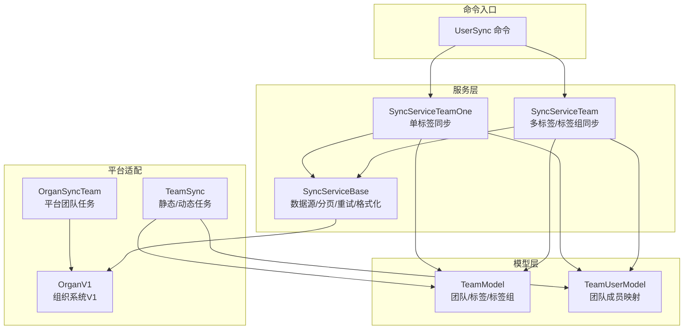
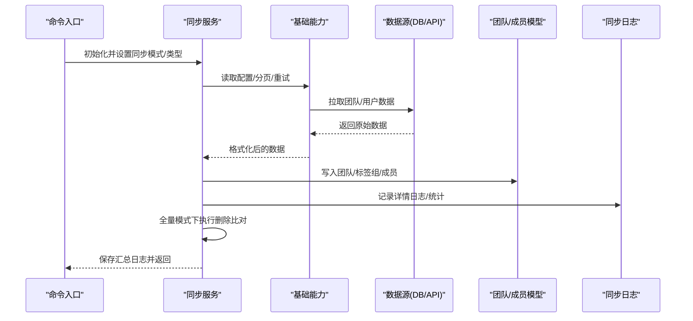
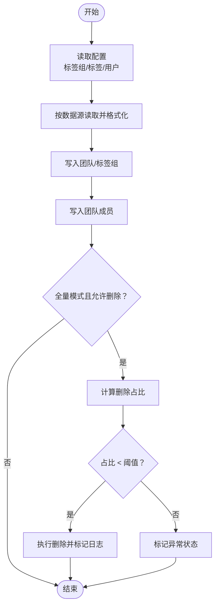
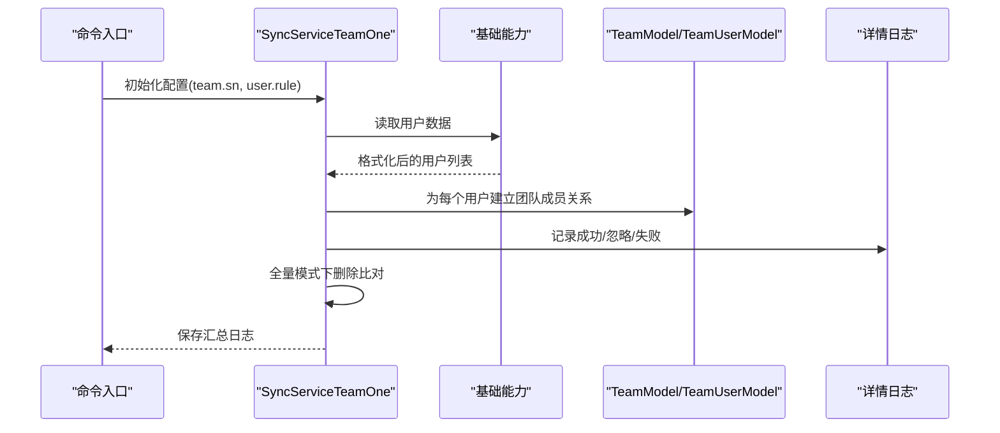
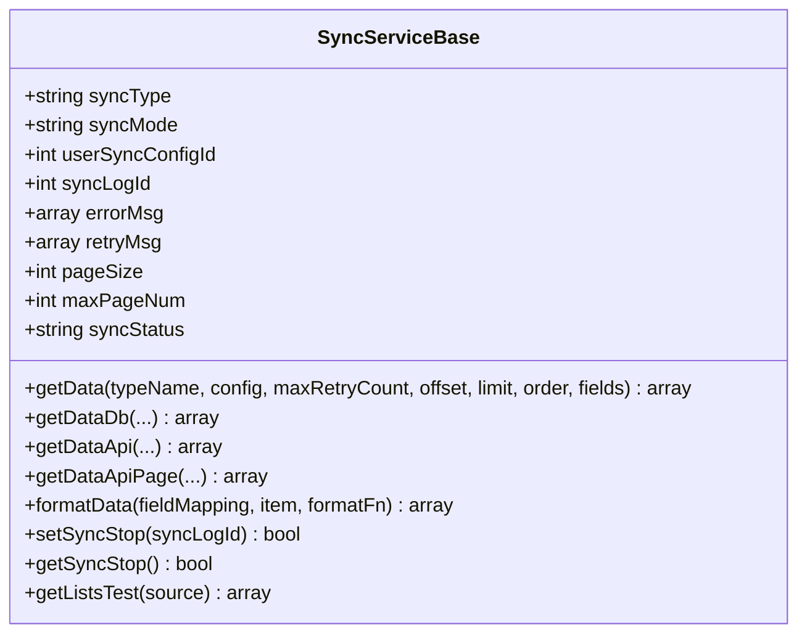
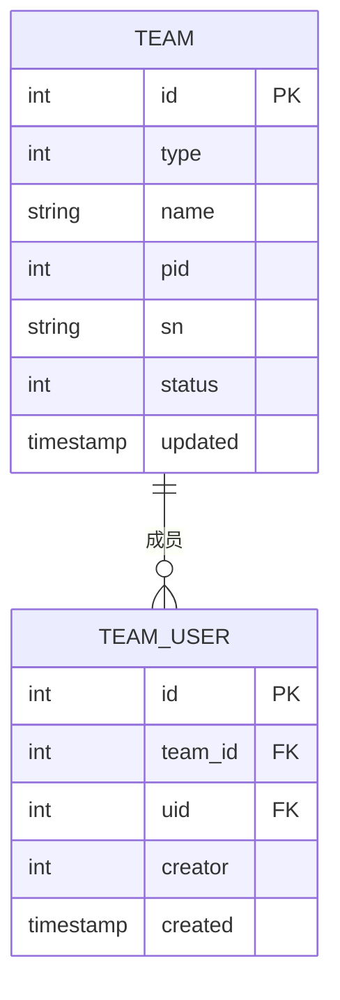
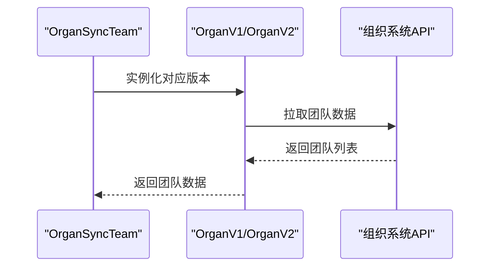
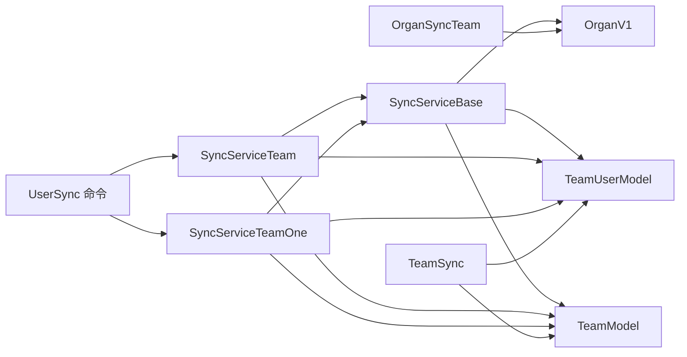

# 团队数据同步服务

<cite>
**本文引用的文件**
- [SyncServiceTeam.php](file://process/src/services/user/SyncServiceTeam.php)
- [SyncServiceTeamOne.php](file://process/src/services/user/SyncServiceTeamOne.php)
- [SyncServiceBase.php](file://process/src/services/user/SyncServiceBase.php)
- [TeamModel.php](file://process/src/models/TeamModel.php)
- [TeamUserModel.php](file://process/src/models/TeamUserModel.php)
- [OrganSyncTeam.php](file://process/src/services/task/OrganSyncTeam.php)
- [TeamSync.php](file://process/src/services/task/TeamSync.php)
- [OrganV1.php](file://process/src/services/platform/OrganV1.php)
- [UserSync.php](file://process/src/commands/UserSync.php)
- [UserSync.php（系统管理界面配置）](file://process/src/http/system/UserSync.php)
- [migration_20250804_112233_user_sync.php](file://process/src/migrations/migration_20250804_112233_user_sync.php)
- [IsSyncTeamListener.php](file://process_envs/cfau/product/listeners/IsSyncTeamListener.php)
</cite>

## 目录
1. [简介](#简介)
2. [项目结构](#项目结构)
3. [核心组件](#核心组件)
4. [架构总览](#架构总览)
5. [详细组件分析](#详细组件分析)
6. [依赖分析](#依赖分析)
7. [性能考虑](#性能考虑)
8. [故障排查指南](#故障排查指南)
9. [结论](#结论)
10. [附录](#附录)

## 简介
本文件面向 htdNew 项目的“团队数据同步服务”，系统性阐述团队信息同步的机制与实现，覆盖团队数据的获取、处理、更新与删除策略；解释团队同步的版本演进与功能增强；说明团队成员关系的建立、维护与清理机制；给出配置选项、数据验证与冲突解决策略，并提供实际应用场景与使用示例。

## 项目结构
团队同步服务围绕以下模块协同工作：
- 服务层：负责解析配置、拉取数据源、格式化、落库与删除比对
- 模型层：封装团队、团队成员等实体的增删改查与约束校验
- 平台适配层：对接组织管理系统（V1/V2）或自定义数据源（DB/API）
- 任务调度层：支持定时任务与一次性同步
- 命令入口：统一触发同步流程，控制锁与模式

图示来源
- [UserSync.php](file://process/src/commands/UserSync.php#L1-L150)
- [SyncServiceTeam.php](file://process/src/services/user/SyncServiceTeam.php#L1-L120)
- [SyncServiceTeamOne.php](file://process/src/services/user/SyncServiceTeamOne.php#L1-L120)
- [SyncServiceBase.php](file://process/src/services/user/SyncServiceBase.php#L1-L120)
- [OrganV1.php](file://process/src/services/platform/OrganV1.php#L1-L120)
- [OrganSyncTeam.php](file://process/src/services/task/OrganSyncTeam.php#L1-L17)
- [TeamSync.php](file://process/src/services/task/TeamSync.php#L1-L135)
- [TeamModel.php](file://process/src/models/TeamModel.php#L1-L120)
- [TeamUserModel.php](file://process/src/models/TeamUserModel.php#L1-L114)

章节来源
- [UserSync.php](file://process/src/commands/UserSync.php#L1-L150)
- [SyncServiceTeam.php](file://process/src/services/user/SyncServiceTeam.php#L1-L120)
- [SyncServiceTeamOne.php](file://process/src/services/user/SyncServiceTeamOne.php#L1-L120)
- [SyncServiceBase.php](file://process/src/services/user/SyncServiceBase.php#L1-L120)
- [OrganV1.php](file://process/src/services/platform/OrganV1.php#L1-L120)
- [TeamModel.php](file://process/src/models/TeamModel.php#L1-L120)
- [TeamUserModel.php](file://process/src/models/TeamUserModel.php#L1-L114)

## 核心组件
- 多标签/标签组同步服务：支持自动同步标签组与标签，按配置进行字段映射、条件过滤、重试与删除比对
- 单标签同步服务：针对单标签场景，直接按配置同步成员
- 基础同步能力：统一的数据源读取（DB/API）、分页与重试、格式化、停止信号检测
- 团队与成员模型：团队类型（组/静态/动态/单标签/批量动态）、成员映射、缓存与校验
- 平台适配：组织系统V1/V2团队数据获取，以及平台团队任务
- 任务调度：静态/动态任务与一次性同步

章节来源
- [SyncServiceTeam.php](file://process/src/services/user/SyncServiceTeam.php#L1-L200)
- [SyncServiceTeamOne.php](file://process/src/services/user/SyncServiceTeamOne.php#L1-L200)
- [SyncServiceBase.php](file://process/src/services/user/SyncServiceBase.php#L1-L200)
- [TeamModel.php](file://process/src/models/TeamModel.php#L1-L220)
- [TeamUserModel.php](file://process/src/models/TeamUserModel.php#L1-L114)
- [OrganV1.php](file://process/src/services/platform/OrganV1.php#L1-L200)
- [OrganSyncTeam.php](file://process/src/services/task/OrganSyncTeam.php#L1-L17)
- [TeamSync.php](file://process/src/services/task/TeamSync.php#L1-L135)

## 架构总览
团队同步采用“命令驱动 + 服务编排 + 模型持久化”的分层架构。命令入口根据配置选择同步服务，服务层调用基础能力从数据源读取并格式化，再写入团队与成员表，并在全量模式下执行删除比对。平台适配层负责对接组织系统或自定义数据源。

图示来源
- [UserSync.php](file://process/src/commands/UserSync.php#L60-L150)
- [SyncServiceTeam.php](file://process/src/services/user/SyncServiceTeam.php#L120-L220)
- [SyncServiceTeamOne.php](file://process/src/services/user/SyncServiceTeamOne.php#L120-L220)
- [SyncServiceBase.php](file://process/src/services/user/SyncServiceBase.php#L100-L220)
- [TeamModel.php](file://process/src/models/TeamModel.php#L120-L220)
- [TeamUserModel.php](file://process/src/models/TeamUserModel.php#L1-L114)

## 详细组件分析

### 多标签/标签组同步服务（SyncServiceTeam）
- 配置维度
  - 标签组来源：手动创建或自动同步
  - 标签组规则：是否删除比对、异常百分比、重试次数
  - 标签规则：是否删除比对、异常百分比、重试次数
  - 用户规则：是否删除比对、异常百分比、重试次数
- 数据流
  - 读取标签组/标签/用户数据，按字段映射与条件过滤生成详情日志
  - 保存团队与成员，记录成功/失败/忽略状态
  - 全量模式下执行删除比对：计算删除占比，低于阈值则执行删除并标记日志
- 关键逻辑
  - 删除比对：仅对“批量动态标签”与“自动同步标签组”生效
  - 异常百分比：用于保护性删除，避免误删
  - 详情日志：记录每条数据的来源、映射字段与备注

图示来源
- [SyncServiceTeam.php](file://process/src/services/user/SyncServiceTeam.php#L180-L290)
- [SyncServiceTeam.php](file://process/src/services/user/SyncServiceTeam.php#L290-L470)
- [SyncServiceTeam.php](file://process/src/services/user/SyncServiceTeam.php#L470-L689)

章节来源
- [SyncServiceTeam.php](file://process/src/services/user/SyncServiceTeam.php#L1-L689)

### 单标签同步服务（SyncServiceTeamOne）
- 配置维度
  - 单标签编码（team.sn）
  - 用户规则：是否删除比对、异常百分比、重试次数
- 数据流
  - 读取用户数据，按字段映射生成详情日志
  - 将用户加入指定团队，保留“手动添加”的成员不受删除影响
  - 全量模式下执行删除比对与日志标记

图示来源
- [SyncServiceTeamOne.php](file://process/src/services/user/SyncServiceTeamOne.php#L1-L298)
- [TeamUserModel.php](file://process/src/models/TeamUserModel.php#L1-L114)

章节来源
- [SyncServiceTeamOne.php](file://process/src/services/user/SyncServiceTeamOne.php#L1-L298)
- [TeamUserModel.php](file://process/src/models/TeamUserModel.php#L1-L114)

### 基础同步能力（SyncServiceBase）
- 数据源支持：DB（表/SQL）与 API（分页/非分页）
- 分页与重试：统一的分页拉取、最大页数限制与重试策略
- 格式化：基于字段映射表达式将远端数据映射到本地字段
- 停止信号：通过 Redis 键检测同步中止请求
- 测试运行：快速测试数据源连通性与格式化结果

图示来源
- [SyncServiceBase.php](file://process/src/services/user/SyncServiceBase.php#L1-L479)

章节来源
- [SyncServiceBase.php](file://process/src/services/user/SyncServiceBase.php#L1-L479)

### 团队与成员模型（TeamModel / TeamUserModel）
- 团队模型
  - 类型：标签组、静态标签、动态标签（含单标签/批量动态）
  - 状态：启用/禁用
  - 关系：父子关系（标签组 -> 标签），支持按 sn 唯一标识
  - 动态标签：支持 SQL/可视/高级查询，按配置定期同步
- 成员模型
  - 团队成员映射，支持“手动添加”标记，避免被删除比对清理
  - 保存后清理用户缓存

图示来源
- [TeamModel.php](file://process/src/models/TeamModel.php#L1-L220)
- [TeamUserModel.php](file://process/src/models/TeamUserModel.php#L1-L114)

章节来源
- [TeamModel.php](file://process/src/models/TeamModel.php#L1-L356)
- [TeamUserModel.php](file://process/src/models/TeamUserModel.php#L1-L114)

### 平台适配与任务调度
- 组织系统适配（OrganV1）
  - 提供团队、团队用户等数据获取接口
  - 支持按标签分页拉取用户
- 平台团队任务（OrganSyncTeam）
  - 根据版本实例化 V1/V2，统一返回团队列表
- 静态/动态任务（TeamSync）
  - 基于业务数据表生成静态/动态团队成员，支持增量更新

图示来源
- [OrganSyncTeam.php](file://process/src/services/task/OrganSyncTeam.php#L1-L17)
- [OrganV1.php](file://process/src/services/platform/OrganV1.php#L150-L200)
- [TeamSync.php](file://process/src/services/task/TeamSync.php#L1-L135)

章节来源
- [OrganSyncTeam.php](file://process/src/services/task/OrganSyncTeam.php#L1-L17)
- [OrganV1.php](file://process/src/services/platform/OrganV1.php#L1-L200)
- [TeamSync.php](file://process/src/services/task/TeamSync.php#L1-L135)

## 依赖分析
- 命令入口依赖同步服务类型选择器，按配置决定使用多标签/单标签服务
- 同步服务依赖基础能力进行数据源读取与格式化
- 团队/成员模型承担持久化与约束校验
- 平台适配层与任务调度层作为外部数据源补充

图示来源
- [UserSync.php](file://process/src/commands/UserSync.php#L1-L150)
- [SyncServiceTeam.php](file://process/src/services/user/SyncServiceTeam.php#L1-L120)
- [SyncServiceTeamOne.php](file://process/src/services/user/SyncServiceTeamOne.php#L1-L120)
- [SyncServiceBase.php](file://process/src/services/user/SyncServiceBase.php#L1-L120)
- [TeamModel.php](file://process/src/models/TeamModel.php#L1-L120)
- [TeamUserModel.php](file://process/src/models/TeamUserModel.php#L1-L114)
- [OrganSyncTeam.php](file://process/src/services/task/OrganSyncTeam.php#L1-L17)
- [TeamSync.php](file://process/src/services/task/TeamSync.php#L1-L135)

章节来源
- [UserSync.php](file://process/src/commands/UserSync.php#L1-L150)
- [SyncServiceTeam.php](file://process/src/services/user/SyncServiceTeam.php#L1-L120)
- [SyncServiceTeamOne.php](file://process/src/services/user/SyncServiceTeamOne.php#L1-L120)
- [SyncServiceBase.php](file://process/src/services/user/SyncServiceBase.php#L1-L120)
- [TeamModel.php](file://process/src/models/TeamModel.php#L1-L120)
- [TeamUserModel.php](file://process/src/models/TeamUserModel.php#L1-L114)
- [OrganSyncTeam.php](file://process/src/services/task/OrganSyncTeam.php#L1-L17)
- [TeamSync.php](file://process/src/services/task/TeamSync.php#L1-L135)

## 性能考虑
- 分页与重试：基础能力内置分页与重试，避免一次性拉取过大导致阻塞
- 批量插入与删除：成员更新采用差集计算与批量写入，降低事务开销
- 缓存与索引：团队表新增 sn 字段与索引，提升查找效率
- 锁与并发：命令入口通过 Redis 锁避免重复执行，全量模式下设置较长锁时长
- 停止信号：支持在运行中检测停止请求，及时释放锁并回滚状态

章节来源
- [SyncServiceBase.php](file://process/src/services/user/SyncServiceBase.php#L1-L200)
- [TeamModel.php](file://process/src/models/TeamModel.php#L1-L120)
- [UserSync.php](file://process/src/commands/UserSync.php#L60-L150)

## 故障排查指南
- 数据源异常
  - DB/API 拉取失败会记录错误并重试，超过最大重试次数后标记失败
  - 建议检查数据源连通性、SQL/字段映射与分页参数
- 字段映射与条件过滤
  - 若缺少必要字段（如编码/名称/学工号/标签编码），将记录异常并跳过
  - API 场景可配置条件表达式，不满足条件的数据会被忽略
- 删除比对异常
  - 当删除占比超过阈值时，不会执行删除，同步状态标记为异常
  - 检查团队成员是否主要由“手动添加”构成，导致删除比例异常升高
- 停止与并发
  - 如需中止同步，可通过停止接口设置 Redis 键，服务会在下次检查时响应
  - 全量模式下若锁长时间未释放，需检查命令进程与 Redis 服务

章节来源
- [SyncServiceTeam.php](file://process/src/services/user/SyncServiceTeam.php#L180-L290)
- [SyncServiceTeamOne.php](file://process/src/services/user/SyncServiceTeamOne.php#L180-L260)
- [SyncServiceBase.php](file://process/src/services/user/SyncServiceBase.php#L120-L220)
- [UserSync.php](file://process/src/commands/UserSync.php#L60-L150)

## 结论
团队数据同步服务通过清晰的分层设计与完善的配置体系，实现了从组织系统或自定义数据源到团队/成员模型的稳定同步。其具备灵活的删除比对保护、详尽的日志记录与重试机制，能够适应多标签与单标签的多种场景。建议在生产环境中结合业务需求合理设置异常百分比与重试次数，并通过系统管理界面配置与监控日志，确保同步质量与稳定性。

## 附录

### 版本演进与功能增强
- 团队编码与状态字段引入：为团队建立唯一标识与启用/禁用状态，支撑更细粒度的同步控制
- 多标签/标签组同步：支持自动同步标签组与标签，减少手工维护成本
- 单标签同步：针对特定标签的快速同步能力
- 动态标签任务：支持 SQL/可视/高级查询的动态标签，按配置周期同步
- 日志与索引优化：完善同步日志结构与索引，提升可观测性与查询效率

章节来源
- [migration_20250804_112233_user_sync.php](file://process/src/migrations/migration_20250804_112233_user_sync.php#L1-L126)
- [TeamModel.php](file://process/src/models/TeamModel.php#L1-L220)
- [TeamSync.php](file://process/src/services/task/TeamSync.php#L1-L135)

### 配置选项与字段映射
- 标签组/标签/用户配置
  - 数据源类型：DB（表/SQL）或 API
  - 条件表达式：支持按字段过滤
  - 字段映射：sn/name/psn/number/team_sn 等
  - 规则：是否删除比对、异常百分比、重试次数
  - 其他：全量同步周期、日志保留时长等
- 示例配置位置
  - 多标签/标签组/用户同步配置示例位于系统管理界面配置文件中

章节来源
- [UserSync.php（系统管理界面配置）](file://process/src/http/system/UserSync.php#L1081-L1183)
- [SyncServiceBase.php](file://process/src/services/user/SyncServiceBase.php#L1-L120)

### 数据验证与冲突解决策略
- 数据验证
  - 必填字段校验：编码/名称/学工号/标签编码等
  - 条件过滤：API 场景可配置条件表达式，不满足条件的数据忽略
- 冲突解决
  - 删除比对：全量模式下计算删除占比，低于阈值才执行删除
  - 手动添加保护：保留“手动添加”的成员，避免被删除比对清理
  - 异常百分比：防止大规模误删，保障业务安全

章节来源
- [SyncServiceTeam.php](file://process/src/services/user/SyncServiceTeam.php#L180-L290)
- [SyncServiceTeamOne.php](file://process/src/services/user/SyncServiceTeamOne.php#L180-L260)
- [TeamUserModel.php](file://process/src/models/TeamUserModel.php#L1-L114)

### 实际应用场景与使用示例
- 组织系统团队同步
  - 使用平台适配层获取团队与团队用户，写入本地团队/成员表
  - 适用于需要与组织系统保持一致的场景
- 自定义数据源同步
  - 通过 DB 表/SQL 或 API 接口配置团队与成员数据
  - 适用于自有业务系统的团队数据同步
- 定时任务与一次性同步
  - 静态/动态任务按配置周期执行
  - 一次性同步用于临时数据修复或迁移

章节来源
- [OrganV1.php](file://process/src/services/platform/OrganV1.php#L150-L200)
- [TeamSync.php](file://process/src/services/task/TeamSync.php#L1-L135)
- [UserSync.php](file://process/src/commands/UserSync.php#L60-L150)