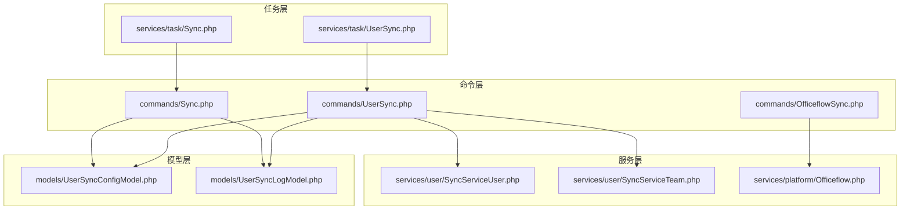
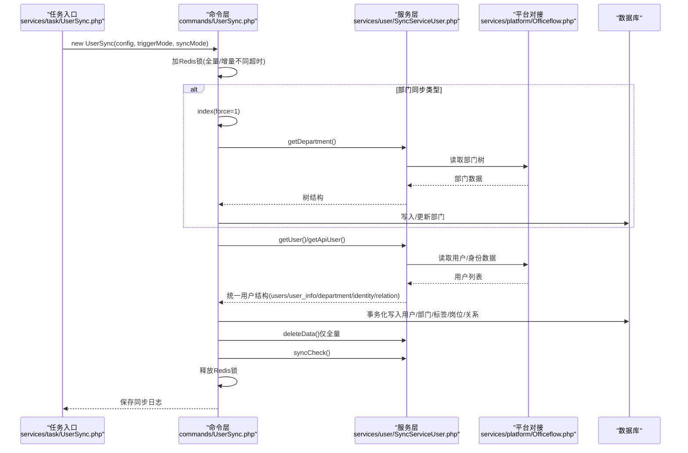
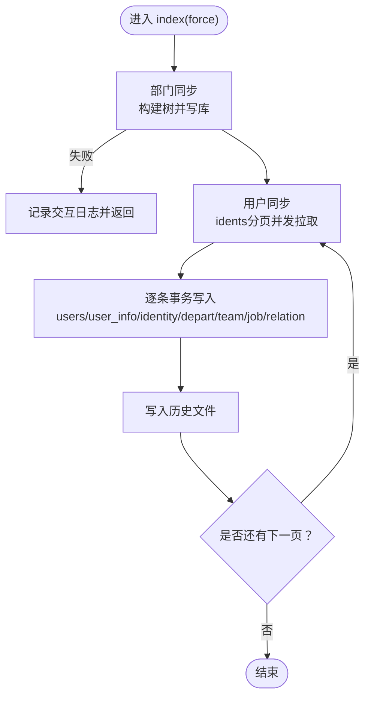
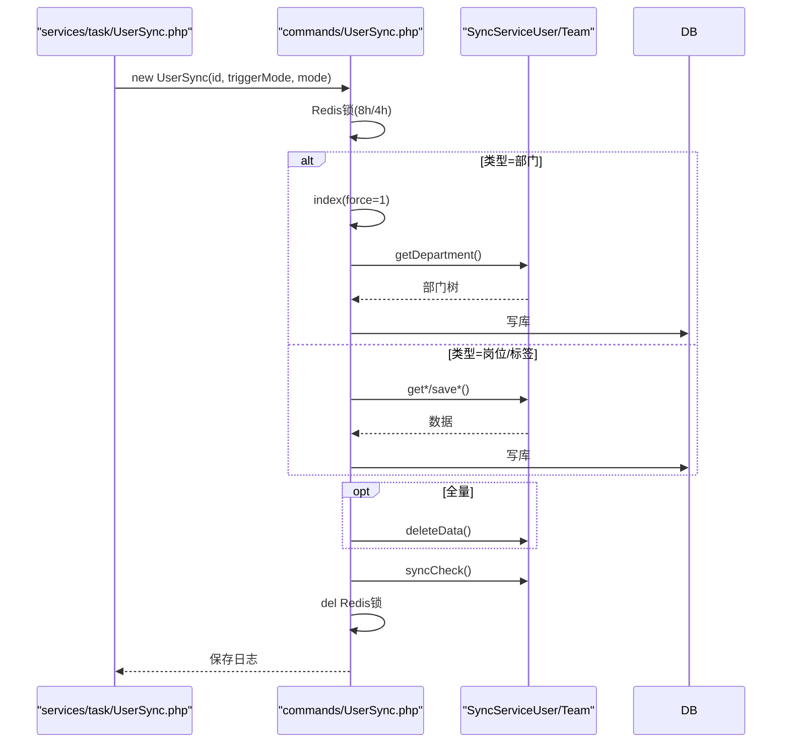
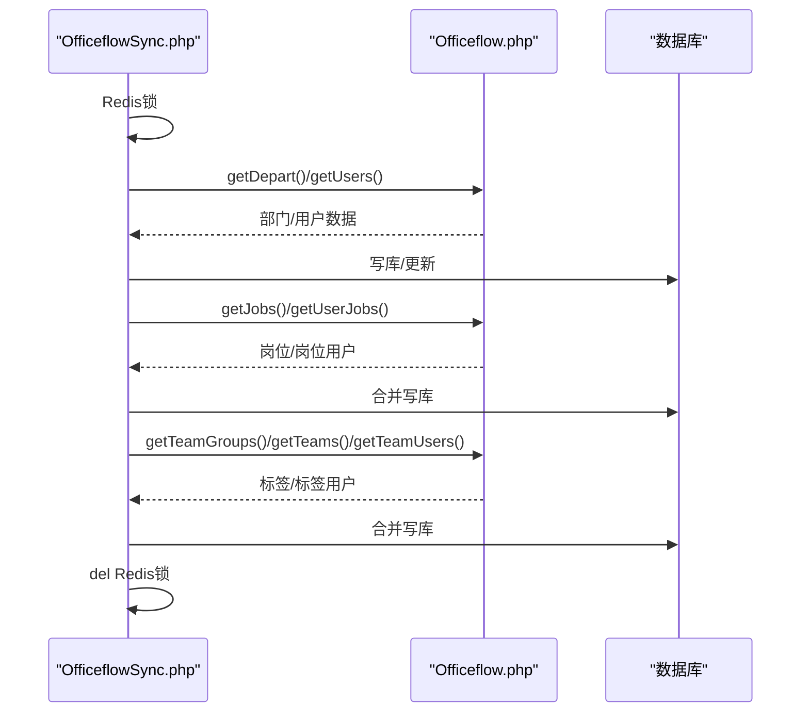
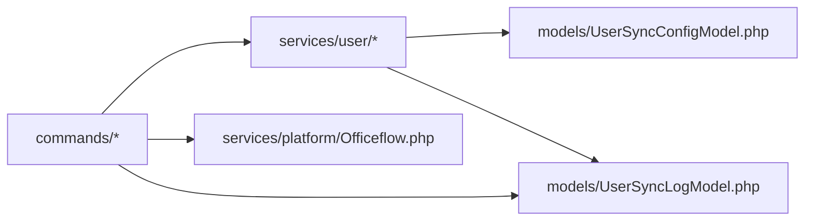

# 数据同步服务

<cite>
**本文引用的文件**
- [process/src/commands/Sync.php](file://process/src/commands/Sync.php)
- [process/src/commands/UserSync.php](file://process/src/commands/UserSync.php)
- [process/src/commands/OfficeflowSync.php](file://process/src/commands/OfficeflowSync.php)
- [process/src/services/task/Sync.php](file://process/src/services/task/Sync.php)
- [process/src/services/task/UserSync.php](file://process/src/services/task/UserSync.php)
- [process/src/services/user/SyncServiceUser.php](file://process/src/services/user/SyncServiceUser.php)
- [process/src/services/user/SyncServiceTeam.php](file://process/src/services/user/SyncServiceTeam.php)
- [process/src/services/platform/Officeflow.php](file://process/src/services/platform/Officeflow.php)
- [process/src/models/UserSyncConfigModel.php](file://process/src/models/UserSyncConfigModel.php)
- [process/src/models/UserSyncLogModel.php](file://process/src/models/UserSyncLogModel.php)
- [process/src/http/system/UserSync.php](file://process/src/http/system/UserSync.php)
</cite>

## 目录
1. [简介](#简介)
2. [项目结构](#项目结构)
3. [核心组件](#核心组件)
4. [架构总览](#架构总览)
5. [详细组件分析](#详细组件分析)
6. [依赖分析](#依赖分析)
7. [性能考量](#性能考量)
8. [故障排查指南](#故障排查指南)
9. [结论](#结论)
10. [附录](#附录)

## 简介
本文件面向 htdNew 项目的“数据同步服务”，系统性梳理组织架构同步、用户信息同步、团队数据同步、办公流程同步与外出流程同步的实现机制与扩展路径。文档重点覆盖：
- 同步策略：全量与增量的差异、断点续传与并发控制
- 数据流：从源头拉取、格式化、落库、关系维护与清理
- 接口设计：命令层、任务层、服务层的职责划分与参数传递
- 异常处理：锁机制、重试策略、日志与状态回写
- 性能优化：协程并发、批处理、分页与缓存
- 扩展开发：如何新增同步类型与适配新环境

## 项目结构
围绕“数据同步服务”的关键目录与文件如下：
- 命令层：负责调度与生命周期控制（如 index、users、departments）
- 服务层：按业务域拆分（用户、标签、岗位、平台对接）
- 平台对接：Officeflow 平台数据读取与字段扩展
- 任务层：对外暴露可执行的任务入口
- 模型层：同步配置、日志与状态枚举

图表来源
- [process/src/commands/Sync.php](file://process/src/commands/Sync.php#L1-L587)
- [process/src/commands/UserSync.php](file://process/src/commands/UserSync.php#L1-L221)
- [process/src/commands/OfficeflowSync.php](file://process/src/commands/OfficeflowSync.php#L1-L495)
- [process/src/services/user/SyncServiceUser.php](file://process/src/services/user/SyncServiceUser.php#L1-L934)
- [process/src/services/user/SyncServiceTeam.php](file://process/src/services/user/SyncServiceTeam.php#L1-L689)
- [process/src/services/platform/Officeflow.php](file://process/src/services/platform/Officeflow.php#L1-L596)
- [process/src/services/task/Sync.php](file://process/src/services/task/Sync.php#L1-L11)
- [process/src/services/task/UserSync.php](file://process/src/services/task/UserSync.php#L1-L32)
- [process/src/models/UserSyncConfigModel.php](file://process/src/models/UserSyncConfigModel.php#L1-L59)
- [process/src/models/UserSyncLogModel.php](file://process/src/models/UserSyncLogModel.php#L1-L81)

章节来源
- [process/src/commands/Sync.php](file://process/src/commands/Sync.php#L1-L587)
- [process/src/commands/UserSync.php](file://process/src/commands/UserSync.php#L1-L221)
- [process/src/commands/OfficeflowSync.php](file://process/src/commands/OfficeflowSync.php#L1-L495)
- [process/src/services/user/SyncServiceUser.php](file://process/src/services/user/SyncServiceUser.php#L1-L934)
- [process/src/services/user/SyncServiceTeam.php](file://process/src/services/user/SyncServiceTeam.php#L1-L689)
- [process/src/services/platform/Officeflow.php](file://process/src/services/platform/Officeflow.php#L1-L596)
- [process/src/services/task/Sync.php](file://process/src/services/task/Sync.php#L1-L11)
- [process/src/services/task/UserSync.php](file://process/src/services/task/UserSync.php#L1-L32)
- [process/src/models/UserSyncConfigModel.php](file://process/src/models/UserSyncConfigModel.php#L1-L59)
- [process/src/models/UserSyncLogModel.php](file://process/src/models/UserSyncLogModel.php#L1-L81)

## 核心组件
- 抽象同步基类：提供部门树构建、用户分页拉取、事务化落库、部门/标签/岗位/关系的增量合并与清理、断点续传与日志记录
- 用户同步命令：根据配置选择同步类型（部门/岗位/标签），加锁控制，全量/增量模式下的锁时长差异，最终删除多余数据
- 办公流程同步命令：对接 Officeflow 平台，按环境事件开关决定是否同步部门/岗位/标签，并支持 OpenID 对接
- 用户同步服务：按配置从数据库或 API 源读取数据，字段映射与校验，生成统一用户结构，支持增量时间字段
- 标签同步服务：支持自动同步标签组/标签/标签用户，按配置执行删除阈值控制
- 平台对接服务：读取 Officeflow 的部门、用户、岗位、标签、标签用户、OpenID 等数据，动态扩展身份字段
- 任务入口：对外提供可执行的任务封装，便于定时器或 Web 触发

章节来源
- [process/src/commands/Sync.php](file://process/src/commands/Sync.php#L1-L587)
- [process/src/commands/UserSync.php](file://process/src/commands/UserSync.php#L1-L221)
- [process/src/commands/OfficeflowSync.php](file://process/src/commands/OfficeflowSync.php#L1-L495)
- [process/src/services/user/SyncServiceUser.php](file://process/src/services/user/SyncServiceUser.php#L1-L934)
- [process/src/services/user/SyncServiceTeam.php](file://process/src/services/user/SyncServiceTeam.php#L1-L689)
- [process/src/services/platform/Officeflow.php](file://process/src/services/platform/Officeflow.php#L1-L596)
- [process/src/services/task/Sync.php](file://process/src/services/task/Sync.php#L1-L11)
- [process/src/services/task/UserSync.php](file://process/src/services/task/UserSync.php#L1-L32)

## 架构总览
下面以“用户同步”为例，展示从任务入口到命令、服务与平台对接的调用链路。

图表来源
- [process/src/services/task/UserSync.php](file://process/src/services/task/UserSync.php#L1-L32)
- [process/src/commands/UserSync.php](file://process/src/commands/UserSync.php#L1-L221)
- [process/src/services/user/SyncServiceUser.php](file://process/src/services/user/SyncServiceUser.php#L1-L934)
- [process/src/services/platform/Officeflow.php](file://process/src/services/platform/Officeflow.php#L1-L596)

章节来源
- [process/src/services/task/UserSync.php](file://process/src/services/task/UserSync.php#L1-L32)
- [process/src/commands/UserSync.php](file://process/src/commands/UserSync.php#L1-L221)
- [process/src/services/user/SyncServiceUser.php](file://process/src/services/user/SyncServiceUser.php#L1-L934)
- [process/src/services/platform/Officeflow.php](file://process/src/services/platform/Officeflow.php#L1-L596)

## 详细组件分析

### 抽象同步基类（commands/Sync）
- 职责
  - 组织架构同步：自顶向下构建部门树，支持禁用/启用状态更新
  - 用户同步：分身份分页拉取，协程并发，事务化写入，断点续传
  - 数据清理：部门/标签/岗位/关系的增量合并与删除
  - 日志与交互：写入交互日志、用户同步详情日志、错误统计
- 关键流程
  - index(force)：先部门后用户；部门失败直接中断
  - users(force)：按身份分页并发拉取，写历史文件，失败回滚
  - syncInfo：统一落库，含基础信息、用户详情、身份专属表、部门/标签/岗位/关系
  - syncUserDepartment/syncTeam/syncJob/syncRelation：增量合并与清理
- 并发与断点
  - 协程通道控制并发数
  - 历史文件记录同步进度，跨周期续传
- 异常处理
  - 交互日志记录请求/响应
  - 详情日志记录每条数据状态与备注
  - 用户同步日志聚合错误与统计

图表来源
- [process/src/commands/Sync.php](file://process/src/commands/Sync.php#L147-L320)

章节来源
- [process/src/commands/Sync.php](file://process/src/commands/Sync.php#L1-L587)

### 用户同步命令（commands/UserSync）
- 职责
  - 解析配置，选择同步类型（部门/岗位/标签/单岗位/单标签）
  - 加锁控制（全量8小时，增量4小时），避免并发重复执行
  - 根据类型调用服务层：部门树、岗位、标签组/标签/标签用户、用户
  - 全量模式下执行删除多余数据，最终校验与保存日志
- 参数与触发
  - userSyncConfigId、triggerMode、syncMode
  - 任务入口 services/task/UserSync.php 提供参数校验与执行

图表来源
- [process/src/commands/UserSync.php](file://process/src/commands/UserSync.php#L1-L221)
- [process/src/services/task/UserSync.php](file://process/src/services/task/UserSync.php#L1-L32)

章节来源
- [process/src/commands/UserSync.php](file://process/src/commands/UserSync.php#L1-L221)
- [process/src/services/task/UserSync.php](file://process/src/services/task/UserSync.php#L1-L32)

### 办公流程同步命令（commands/OfficeflowSync）
- 职责
  - 对接 Officeflow 平台，按环境事件开关决定是否同步部门/岗位/标签
  - 部门：去重校验、启用/禁用状态更新
  - 岗位：岗位与岗位用户同步，按部门维度合并
  - 标签：标签组、标签、标签用户同步，支持动态/静态标签冲突处理
  - OpenID：跨平台用户 OpenID 同步与冲突处理
- 锁与模式
  - Redis 锁超时约 8 小时，避免长时间阻塞
- 事件开关
  - 通过全局事件分发器控制是否同步部门用户、岗位、标签等

图表来源
- [process/src/commands/OfficeflowSync.php](file://process/src/commands/OfficeflowSync.php#L1-L495)
- [process/src/services/platform/Officeflow.php](file://process/src/services/platform/Officeflow.php#L1-L596)

章节来源
- [process/src/commands/OfficeflowSync.php](file://process/src/commands/OfficeflowSync.php#L1-L495)
- [process/src/services/platform/Officeflow.php](file://process/src/services/platform/Officeflow.php#L1-L596)

### 用户同步服务（services/user/SyncServiceUser）
- 职责
  - 读取部门/用户/身份数据，支持数据库与 API 两种源
  - 字段映射与校验：必填字段、部门存在性、手机号/邮箱长度等
  - 统一用户结构：users、user_info、identity、department、relation
  - 增量模式：支持按增量时间字段过滤
  - 删除策略：按配置阈值执行删除
- 关键点
  - 多身份配置解析与分页
  - 条件过滤（API 场景）
  - 详情日志与错误聚合
  - 统计上报（成功/失败/删除数量）

章节来源
- [process/src/services/user/SyncServiceUser.php](file://process/src/services/user/SyncServiceUser.php#L1-L934)

### 标签同步服务（services/user/SyncServiceTeam）
- 职责
  - 标签组/标签/标签用户三层同步
  - 自动/手动同步标签组的选择
  - 删除阈值控制：当删除比例低于阈值才执行真实删除
  - 标签用户合并：按标签维度批量写入，支持保留手动添加用户
- 关键点
  - 标签组与标签的父子关系
  - 标签用户去重与批量插入
  - 删除详情日志与状态回写

章节来源
- [process/src/services/user/SyncServiceTeam.php](file://process/src/services/user/SyncServiceTeam.php#L1-L689)

### 平台对接服务（services/platform/Officeflow）
- 职责
  - 读取 Officeflow 的部门、用户、岗位、标签、标签用户、OpenID 等
  - 动态扩展身份字段：根据字段授权表扩展 identity 属性
  - 增量/全量：按小时窗口或环境事件控制
  - 交互日志：记录每次拉取的请求与响应
- 关键点
  - 字段扩展与 identity 映射
  - 学生关系字段（导师/辅导员/班主任）的二次解析
  - 环境定制（如 UPC 的部门撤销处理）

章节来源
- [process/src/services/platform/Officeflow.php](file://process/src/services/platform/Officeflow.php#L1-L596)

### 任务入口（services/task）
- services/task/Sync.php：执行 main.php sync/index
- services/task/UserSync.php：参数校验后执行 commands/UserSync

章节来源
- [process/src/services/task/Sync.php](file://process/src/services/task/Sync.php#L1-L11)
- [process/src/services/task/UserSync.php](file://process/src/services/task/UserSync.php#L1-L32)

## 依赖分析
- 命令层依赖服务层与平台对接，服务层依赖模型层与配置
- OfficeflowSync 通过 Officeflow 读取外部数据，再写入本地库
- UserSync 命令根据配置选择具体服务类型，统一走断点续传与事务化写入
- 日志与状态通过 UserSyncLogModel 与 UserSyncDetailLogModel 聚合

图表来源
- [process/src/commands/Sync.php](file://process/src/commands/Sync.php#L1-L587)
- [process/src/commands/UserSync.php](file://process/src/commands/UserSync.php#L1-L221)
- [process/src/commands/OfficeflowSync.php](file://process/src/commands/OfficeflowSync.php#L1-L495)
- [process/src/services/user/SyncServiceUser.php](file://process/src/services/user/SyncServiceUser.php#L1-L934)
- [process/src/services/user/SyncServiceTeam.php](file://process/src/services/user/SyncServiceTeam.php#L1-L689)
- [process/src/services/platform/Officeflow.php](file://process/src/services/platform/Officeflow.php#L1-L596)
- [process/src/models/UserSyncConfigModel.php](file://process/src/models/UserSyncConfigModel.php#L1-L59)
- [process/src/models/UserSyncLogModel.php](file://process/src/models/UserSyncLogModel.php#L1-L81)

章节来源
- [process/src/commands/Sync.php](file://process/src/commands/Sync.php#L1-L587)
- [process/src/commands/UserSync.php](file://process/src/commands/UserSync.php#L1-L221)
- [process/src/commands/OfficeflowSync.php](file://process/src/commands/OfficeflowSync.php#L1-L495)
- [process/src/services/user/SyncServiceUser.php](file://process/src/services/user/SyncServiceUser.php#L1-L934)
- [process/src/services/user/SyncServiceTeam.php](file://process/src/services/user/SyncServiceTeam.php#L1-L689)
- [process/src/services/platform/Officeflow.php](file://process/src/services/platform/Officeflow.php#L1-L596)
- [process/src/models/UserSyncConfigModel.php](file://process/src/models/UserSyncConfigModel.php#L1-L59)
- [process/src/models/UserSyncLogModel.php](file://process/src/models/UserSyncLogModel.php#L1-L81)

## 性能考量
- 并发与限速
  - 协程通道控制并发数，避免目标服务过载
  - 分页拉取与批量写入（如标签用户批量插入）
- 断点续传
  - 历史文件记录身份+页码，跨周期续传，减少重复工作
- 增量策略
  - 用户同步支持按增量时间字段过滤，降低每日负载
  - Officeflow 默认按天窗口增量，部分环境可强制全量
- 数据清理
  - 全量模式下按阈值删除多余标签/标签用户，避免数据膨胀
- 缓存与预热
  - 关系映射、字典项等通过缓存键提升查询效率
- I/O 优化
  - 批量插入、事务化提交，减少往返开销

## 故障排查指南
- 锁竞争与重复执行
  - 若 Redis 锁存在且未释放，命令层会直接返回忽略状态
  - 全量/增量锁时长不同，避免长时间占用
- 交互日志与详情日志
  - 交互日志记录请求/响应，便于定位平台侧异常
  - 详情日志记录每条数据状态、备注与源数据，便于定位脏数据
- 错误百分比与删除保护
  - 标签/标签组删除采用阈值控制，超过阈值转为异常状态，避免误删
- 常见问题定位
  - 部门编码重复：OfficeflowSync 在部门读取阶段即抛错
  - 用户无部门：用户服务在格式化阶段校验并记录错误
  - OpenID 冲突：OfficeflowSync 对平台间冲突进行判定与处理
- 日志与状态
  - UserSyncLogModel 聚合错误消息与统计数据，便于监控与报表

章节来源
- [process/src/commands/OfficeflowSync.php](file://process/src/commands/OfficeflowSync.php#L115-L146)
- [process/src/services/user/SyncServiceUser.php](file://process/src/services/user/SyncServiceUser.php#L455-L682)
- [process/src/services/user/SyncServiceTeam.php](file://process/src/services/user/SyncServiceTeam.php#L188-L293)
- [process/src/commands/Sync.php](file://process/src/commands/Sync.php#L147-L320)
- [process/src/models/UserSyncLogModel.php](file://process/src/models/UserSyncLogModel.php#L1-L81)

## 结论
htdNew 的数据同步服务以“命令层 + 服务层 + 平台对接 + 任务入口”的分层架构实现，具备完善的断点续传、并发控制、事务化落库与删除阈值控制能力。针对组织架构、用户信息、团队数据、办公流程与外出流程，系统提供了可扩展的同步类型与灵活的配置机制。通过日志与状态聚合，能够有效支撑生产环境的可观测性与稳定性。

## 附录

### 同步类型与核心功能对照
- 组织架构同步
  - 负责部门树构建与状态更新，支持禁用/启用切换
  - OfficeflowSync 在部门读取阶段进行重复校验与状态更新
- 用户信息同步
  - 统一用户结构：users、user_info、identity、department、relation
  - 支持数据库与 API 两种源，字段映射与校验
- 团队数据同步
  - 标签组/标签/标签用户三层同步，支持自动/手动同步标签组
  - 删除阈值控制，避免误删
- 办公流程同步
  - 对接 Officeflow，支持岗位、标签、OpenID 同步
  - 动态扩展身份字段，适配多环境定制
- 外出流程同步
  - 通过平台对接服务读取相关数据，结合关系字段进行用户关系维护

章节来源
- [process/src/commands/OfficeflowSync.php](file://process/src/commands/OfficeflowSync.php#L1-L495)
- [process/src/services/user/SyncServiceUser.php](file://process/src/services/user/SyncServiceUser.php#L1-L934)
- [process/src/services/user/SyncServiceTeam.php](file://process/src/services/user/SyncServiceTeam.php#L1-L689)
- [process/src/services/platform/Officeflow.php](file://process/src/services/platform/Officeflow.php#L1-L596)

### 全量与增量同步策略
- 全量（all）
  - 适用场景：初始化、修复性同步、标签/标签组重建
  - 特点：写入 Redis 锁最长时长，结束后执行删除多余数据
- 增量（incr）
  - 适用场景：日常同步，降低数据量与平台压力
  - 特点：按天窗口过滤，部分环境可强制全量

章节来源
- [process/src/commands/UserSync.php](file://process/src/commands/UserSync.php#L67-L149)
- [process/src/services/platform/Officeflow.php](file://process/src/services/platform/Officeflow.php#L24-L63)

### 接口设计与参数传递
- 任务入口
  - services/task/UserSync.php：校验 userSyncConfigId、triggerMode、syncMode，构造命令并执行
- 命令层
  - commands/UserSync.php：加锁、路由到具体服务、全量删除与校验
  - commands/OfficeflowSync.php：按事件开关同步部门/岗位/标签
- 服务层
  - services/user/SyncServiceUser.php：读取部门/用户/身份，字段映射与校验
  - services/user/SyncServiceTeam.php：读取标签组/标签/标签用户，删除阈值控制
- 平台对接
  - services/platform/Officeflow.php：读取 Officeflow 数据，动态扩展字段

章节来源
- [process/src/services/task/UserSync.php](file://process/src/services/task/UserSync.php#L1-L32)
- [process/src/commands/UserSync.php](file://process/src/commands/UserSync.php#L1-L221)
- [process/src/commands/OfficeflowSync.php](file://process/src/commands/OfficeflowSync.php#L1-L495)
- [process/src/services/user/SyncServiceUser.php](file://process/src/services/user/SyncServiceUser.php#L1-L934)
- [process/src/services/user/SyncServiceTeam.php](file://process/src/services/user/SyncServiceTeam.php#L1-L689)
- [process/src/services/platform/Officeflow.php](file://process/src/services/platform/Officeflow.php#L1-L596)

### 异常处理机制
- 锁机制：Redis 锁避免并发重复执行，超时时间区分全量/增量
- 重试策略：部门/用户读取支持重试，记录重试消息
- 交互日志：记录请求/响应，便于定位平台侧问题
- 详情日志：记录每条数据状态、备注与源数据，支持删除异常状态
- 删除保护：标签/标签组删除采用阈值控制，超过阈值转异常

章节来源
- [process/src/commands/UserSync.php](file://process/src/commands/UserSync.php#L67-L149)
- [process/src/commands/Sync.php](file://process/src/commands/Sync.php#L147-L320)
- [process/src/services/user/SyncServiceUser.php](file://process/src/services/user/SyncServiceUser.php#L134-L206)
- [process/src/services/user/SyncServiceTeam.php](file://process/src/services/user/SyncServiceTeam.php#L188-L293)

### 性能优化建议
- 合理设置协程并发数，避免目标服务过载
- 使用断点续传与分页拉取，降低单次负载
- 增量同步优先，必要时配合全量修复
- 批量写入与事务化提交，减少往返开销
- 缓存常用映射（如关系、字典、部门），减少查询成本

### 扩展开发指南
- 新增同步类型
  - 在 commands/UserSync.php 中新增分支，路由到新的服务类
  - 在 services/user/ 下新增服务类，实现 get*/save* 方法
  - 在 models/UserSyncConfigModel.php 中补充类型枚举
- 适配新环境
  - 通过全局事件分发器控制是否执行某类同步（如部门用户、岗位、标签）
  - 在 services/platform/Officeflow.php 中增加环境定制逻辑
- 日志与监控
  - 使用 UserSyncLogModel 与 UserSyncDetailLogModel 记录状态与错误
  - 在服务层聚合错误消息，便于前端展示与报警

章节来源
- [process/src/commands/UserSync.php](file://process/src/commands/UserSync.php#L1-L221)
- [process/src/services/user/SyncServiceTeam.php](file://process/src/services/user/SyncServiceTeam.php#L1-L689)
- [process/src/services/platform/Officeflow.php](file://process/src/services/platform/Officeflow.php#L1-L596)
- [process/src/models/UserSyncConfigModel.php](file://process/src/models/UserSyncConfigModel.php#L1-L59)
- [process/src/models/UserSyncLogModel.php](file://process/src/models/UserSyncLogModel.php#L1-L81)