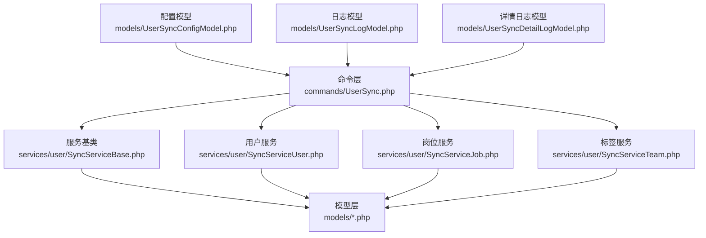
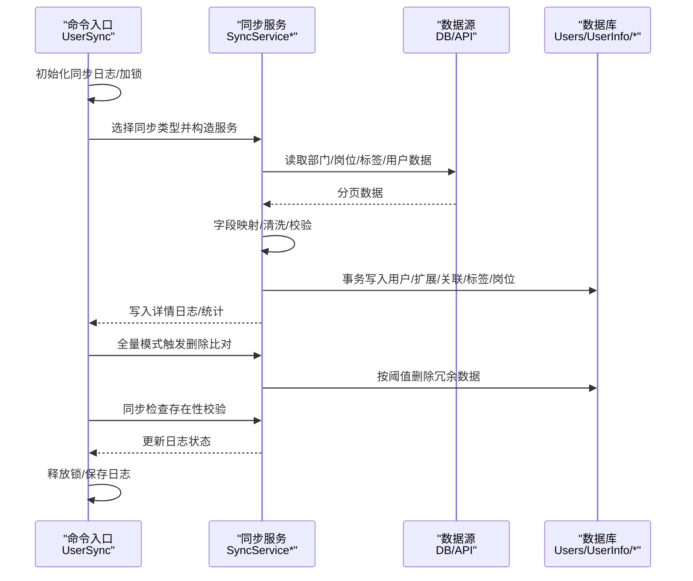
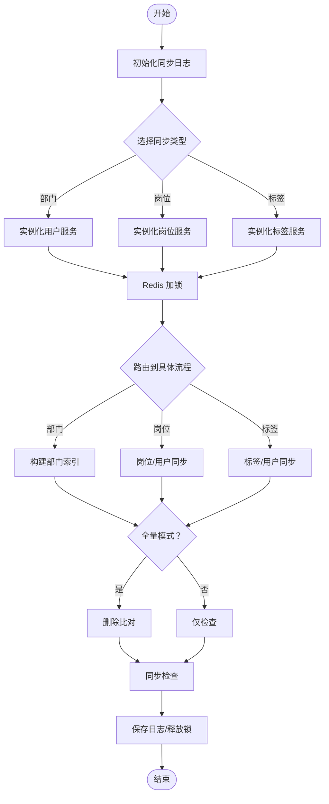
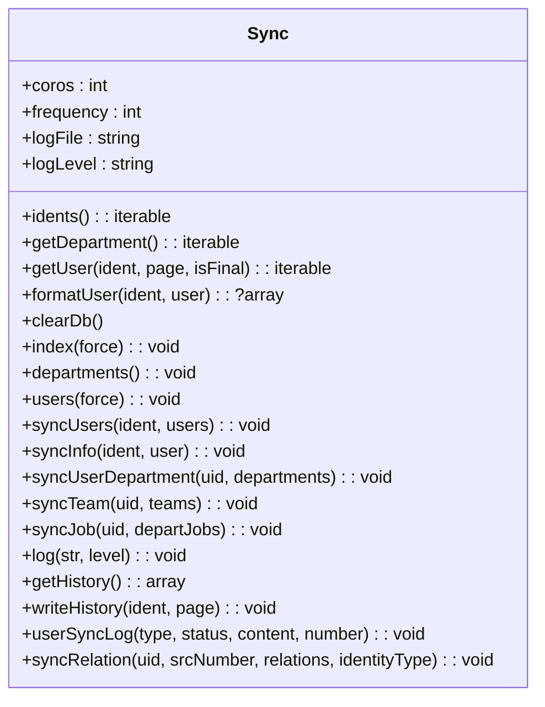
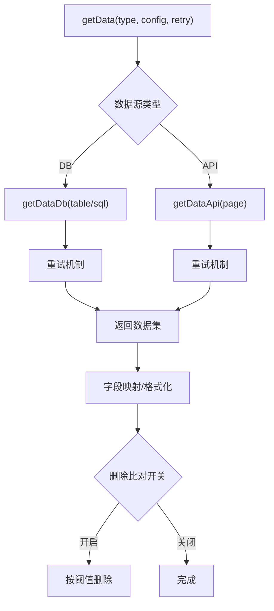
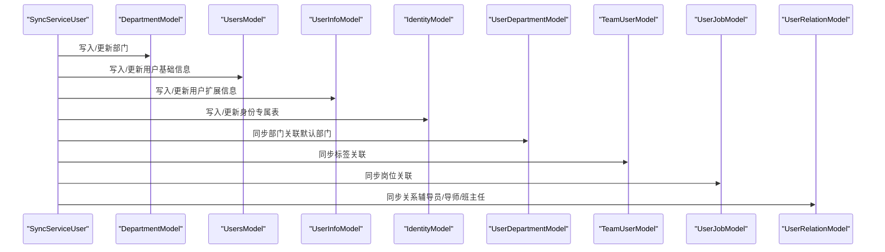
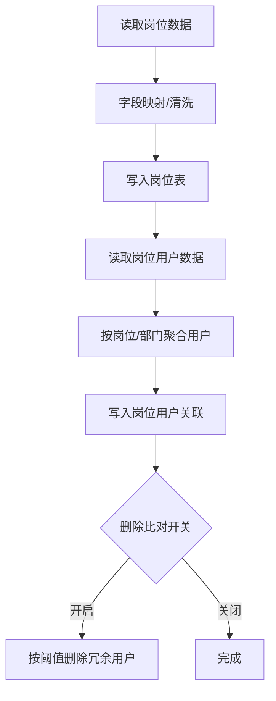
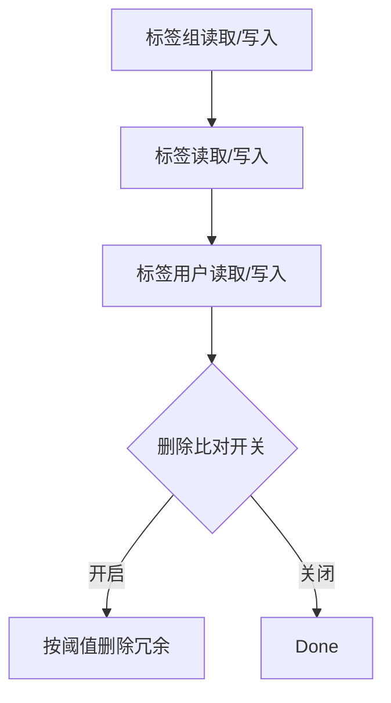
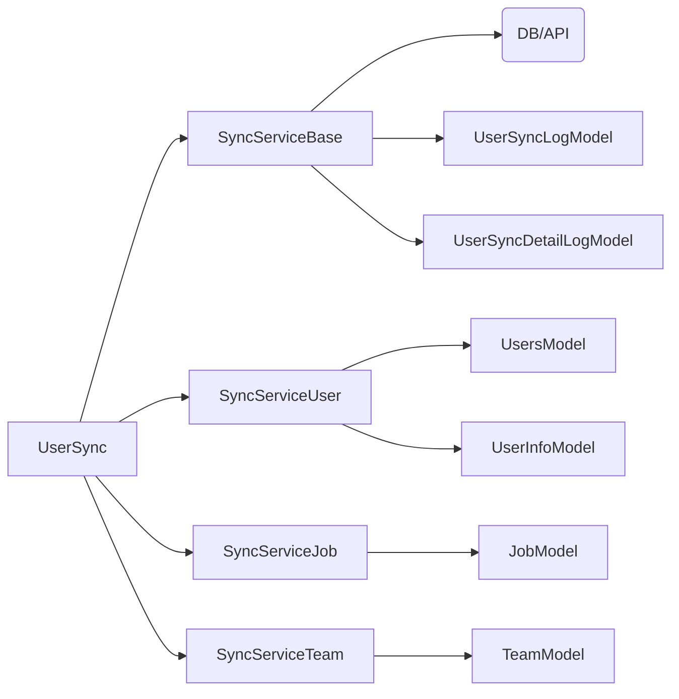

# 用户数据同步服务

<cite>
**本文引用的文件**
- [process/src/commands/UserSync.php](file://process/src/commands/UserSync.php)
- [process/src/commands/Sync.php](file://process/src/commands/Sync.php)
- [process/src/services/user/SyncServiceUser.php](file://process/src/services/user/SyncServiceUser.php)
- [process/src/services/user/SyncServiceJob.php](file://process/src/services/user/SyncServiceJob.php)
- [process/src/services/user/SyncServiceTeam.php](file://process/src/services/user/SyncServiceTeam.php)
- [process/src/services/user/SyncServiceBase.php](file://process/src/services/user/SyncServiceBase.php)
- [process/src/models/UserSyncConfigModel.php](file://process/src/models/UserSyncConfigModel.php)
- [process/src/models/UserSyncLogModel.php](file://process/src/models/UserSyncLogModel.php)
- [process/src/models/UserSyncDetailLogModel.php](file://process/src/models/UserSyncDetailLogModel.php)
- [process/src/models/UsersModel.php](file://process/src/models/UsersModel.php)
- [process/src/models/UserInfoModel.php](file://process/src/models/UserInfoModel.php)
- [process/src/services/upgrade4to5/IdentityUserSync.php](file://process/src/services/upgrade4to5/IdentityUserSync.php)
</cite>

## 目录
1. [简介](#简介)
2. [项目结构](#项目结构)
3. [核心组件](#核心组件)
4. [架构总览](#架构总览)
5. [详细组件分析](#详细组件分析)
6. [依赖分析](#依赖分析)
7. [性能考量](#性能考量)
8. [故障排查指南](#故障排查指南)
9. [结论](#结论)
10. [附录](#附录)

## 简介
本文件面向 htdNew 项目的“用户数据同步服务”，系统性阐述用户信息同步的机制与实现，覆盖数据获取、字段映射、验证与清洗、更新与去重、批量处理、异常处理、配置参数、版本升级策略与最佳实践。文档以命令层、服务层、模型层为主线，结合流程图与序列图，帮助读者快速理解并高效运维用户同步。

## 项目结构
用户同步相关代码主要分布在以下模块：
- 命令层：负责触发同步、加锁、路由到具体同步服务、最终落库与清理。
- 服务层：按同步类型拆分（部门/岗位/标签/单岗位/单标签），封装数据源读取、字段映射、校验、写库、删除比对与检查。
- 模型层：用户主表、用户信息扩展表、同步配置与日志表等。
- 升级支持：提供从旧版本到新版本的用户身份同步兼容入口。

图表来源
- [process/src/commands/UserSync.php](file://process/src/commands/UserSync.php#L1-L149)
- [process/src/services/user/SyncServiceBase.php](file://process/src/services/user/SyncServiceBase.php#L1-L120)
- [process/src/services/user/SyncServiceUser.php](file://process/src/services/user/SyncServiceUser.php#L1-L120)
- [process/src/services/user/SyncServiceJob.php](file://process/src/services/user/SyncServiceJob.php#L1-L60)
- [process/src/services/user/SyncServiceTeam.php](file://process/src/services/user/SyncServiceTeam.php#L1-L60)
- [process/src/models/UserSyncConfigModel.php](file://process/src/models/UserSyncConfigModel.php#L1-L59)
- [process/src/models/UserSyncLogModel.php](file://process/src/models/UserSyncLogModel.php#L1-L81)
- [process/src/models/UserSyncDetailLogModel.php](file://process/src/models/UserSyncDetailLogModel.php#L1-L57)

章节来源
- [process/src/commands/UserSync.php](file://process/src/commands/UserSync.php#L1-L149)
- [process/src/commands/Sync.php](file://process/src/commands/Sync.php#L1-L120)
- [process/src/services/user/SyncServiceBase.php](file://process/src/services/user/SyncServiceBase.php#L1-L120)
- [process/src/models/UserSyncConfigModel.php](file://process/src/models/UserSyncConfigModel.php#L1-L59)

## 核心组件
- 命令入口 UserSync：根据配置类型实例化具体同步服务，负责加锁、路由调用、全量删除比对与最终检查。
- 抽象同步基类 Sync：提供通用的并发拉取、断点续传、事务写库、日志汇总、关系/部门/标签/岗位同步等能力。
- 服务基类 SyncServiceBase：封装数据源读取（DB/API）、字段映射、格式化、重试、分页、删除比对开关、终止信号等。
- 用户服务 SyncServiceUser：部门/用户/身份专属表/部门关联/标签/岗位/关系的完整同步与校验。
- 岗位服务 SyncServiceJob：岗位与岗位用户同步，支持岗位与用户删除比对。
- 标签服务 SyncServiceTeam：标签组/标签/标签用户同步，支持标签与用户删除比对。
- 模型层：UserSyncConfigModel、UserSyncLogModel、UserSyncDetailLogModel、UsersModel、UserInfoModel 等。

章节来源
- [process/src/commands/UserSync.php](file://process/src/commands/UserSync.php#L1-L149)
- [process/src/commands/Sync.php](file://process/src/commands/Sync.php#L120-L228)
- [process/src/services/user/SyncServiceBase.php](file://process/src/services/user/SyncServiceBase.php#L1-L120)
- [process/src/services/user/SyncServiceUser.php](file://process/src/services/user/SyncServiceUser.php#L1-L120)
- [process/src/services/user/SyncServiceJob.php](file://process/src/services/user/SyncServiceJob.php#L1-L60)
- [process/src/services/user/SyncServiceTeam.php](file://process/src/services/user/SyncServiceTeam.php#L1-L60)
- [process/src/models/UserSyncConfigModel.php](file://process/src/models/UserSyncConfigModel.php#L1-L59)
- [process/src/models/UserSyncLogModel.php](file://process/src/models/UserSyncLogModel.php#L1-L81)
- [process/src/models/UserSyncDetailLogModel.php](file://process/src/models/UserSyncDetailLogModel.php#L1-L57)
- [process/src/models/UsersModel.php](file://process/src/models/UsersModel.php#L120-L172)
- [process/src/models/UserInfoModel.php](file://process/src/models/UserInfoModel.php#L1-L40)

## 架构总览
用户同步采用“命令层路由 + 服务层实现 + 模型层持久化”的分层架构。命令层负责生命周期控制与并发协调；服务层按类型拆分职责，统一复用数据源读取与字段映射；模型层提供强约束的字段定义与缓存策略。

图表来源
- [process/src/commands/UserSync.php](file://process/src/commands/UserSync.php#L60-L149)
- [process/src/services/user/SyncServiceBase.php](file://process/src/services/user/SyncServiceBase.php#L100-L210)
- [process/src/services/user/SyncServiceUser.php](file://process/src/services/user/SyncServiceUser.php#L300-L470)
- [process/src/services/user/SyncServiceJob.php](file://process/src/services/user/SyncServiceJob.php#L138-L210)
- [process/src/services/user/SyncServiceTeam.php](file://process/src/services/user/SyncServiceTeam.php#L186-L260)
- [process/src/models/UserSyncLogModel.php](file://process/src/models/UserSyncLogModel.php#L1-L81)

## 详细组件分析

### 命令层：UserSync
- 角色：根据配置类型实例化具体同步服务，负责加锁、路由到相应同步流程、全量删除比对与最终检查。
- 关键行为：
  - 初始化同步日志，设置运行态。
  - 根据配置类型选择服务：部门/岗位/单岗位/标签/单标签。
  - 并发模式下设置 Redis 锁，避免重复执行。
  - 路由调用：部门索引构建、岗位/标签/用户数据拉取与保存。
  - 全量模式下触发删除比对，最终执行同步检查。

图表来源
- [process/src/commands/UserSync.php](file://process/src/commands/UserSync.php#L1-L149)

章节来源
- [process/src/commands/UserSync.php](file://process/src/commands/UserSync.php#L1-L149)

### 抽象同步基类：Sync
- 角色：提供通用的并发拉取、断点续传、事务写库、日志汇总、关系/部门/标签/岗位同步等能力。
- 关键行为：
  - 并发协程通道与屏障，按身份分页拉取用户数据。
  - 事务包裹单用户写入，失败回滚并记录失败日志。
  - 用户基础信息、扩展信息、身份专属表、部门/标签/岗位/关系的同步。
  - 详情日志写入与状态更新。

图表来源
- [process/src/commands/Sync.php](file://process/src/commands/Sync.php#L1-L228)

章节来源
- [process/src/commands/Sync.php](file://process/src/commands/Sync.php#L1-L228)

### 服务基类：SyncServiceBase
- 角色：封装数据源读取（DB/API）、字段映射、格式化、重试、分页、删除比对开关、终止信号等。
- 关键行为：
  - 数据源读取：DB 表/SQL 与 API 分页读取，支持条件过滤与字段提取。
  - 字段映射：通过表达式解析器将源字段映射到目标字段。
  - 删除比对：全量模式下可启用删除比对，并按阈值控制删除。
  - 终止信号：通过 Redis 键设置同步终止，服务层轮询检测。

图表来源
- [process/src/services/user/SyncServiceBase.php](file://process/src/services/user/SyncServiceBase.php#L100-L210)
- [process/src/services/user/SyncServiceBase.php](file://process/src/services/user/SyncServiceBase.php#L210-L366)
- [process/src/services/user/SyncServiceBase.php](file://process/src/services/user/SyncServiceBase.php#L388-L427)

章节来源
- [process/src/services/user/SyncServiceBase.php](file://process/src/services/user/SyncServiceBase.php#L1-L120)
- [process/src/services/user/SyncServiceBase.php](file://process/src/services/user/SyncServiceBase.php#L120-L210)
- [process/src/services/user/SyncServiceBase.php](file://process/src/services/user/SyncServiceBase.php#L210-L366)
- [process/src/services/user/SyncServiceBase.php](file://process/src/services/user/SyncServiceBase.php#L388-L427)

### 用户服务：SyncServiceUser
- 角色：负责部门、用户、身份专属表、部门关联、标签、岗位、关系的完整同步与校验。
- 关键行为：
  - 部门：读取源数据，字段映射与清洗，树形结构校验（父子关系、重复编码等），写入部门表。
  - 用户：按身份读取，字段映射与清洗（性别/民族/政治面貌/证件类型/手机号/邮箱长度等），写入用户主表、用户信息表、身份专属表。
  - 关联：学生身份下辅导员/导师/班主任关系解析与写入。
  - 部门关联：默认部门计算与更新。
  - 删除比对：全量模式下对比源部门集合，按阈值删除冗余部门。
  - 详情日志：每条数据写入详情日志，含字段映射明细与状态。

图表来源
- [process/src/services/user/SyncServiceUser.php](file://process/src/services/user/SyncServiceUser.php#L300-L470)
- [process/src/services/user/SyncServiceUser.php](file://process/src/services/user/SyncServiceUser.php#L470-L682)
- [process/src/models/UsersModel.php](file://process/src/models/UsersModel.php#L120-L172)
- [process/src/models/UserInfoModel.php](file://process/src/models/UserInfoModel.php#L1-L40)

章节来源
- [process/src/services/user/SyncServiceUser.php](file://process/src/services/user/SyncServiceUser.php#L1-L200)
- [process/src/services/user/SyncServiceUser.php](file://process/src/services/user/SyncServiceUser.php#L200-L470)
- [process/src/services/user/SyncServiceUser.php](file://process/src/services/user/SyncServiceUser.php#L470-L723)
- [process/src/models/UsersModel.php](file://process/src/models/UsersModel.php#L120-L172)
- [process/src/models/UserInfoModel.php](file://process/src/models/UserInfoModel.php#L1-L40)

### 岗位服务：SyncServiceJob
- 角色：负责岗位与岗位用户同步，支持岗位与用户删除比对。
- 关键行为：
  - 岗位：读取岗位数据，字段映射与清洗，写入岗位表。
  - 岗位用户：按岗位与部门聚合用户，写入岗位用户关联表；支持保留手动添加用户。
  - 删除比对：按阈值删除冗余岗位用户与岗位。

图表来源
- [process/src/services/user/SyncServiceJob.php](file://process/src/services/user/SyncServiceJob.php#L138-L210)
- [process/src/services/user/SyncServiceJob.php](file://process/src/services/user/SyncServiceJob.php#L210-L368)
- [process/src/services/user/SyncServiceJob.php](file://process/src/services/user/SyncServiceJob.php#L368-L573)

章节来源
- [process/src/services/user/SyncServiceJob.php](file://process/src/services/user/SyncServiceJob.php#L1-L120)
- [process/src/services/user/SyncServiceJob.php](file://process/src/services/user/SyncServiceJob.php#L120-L210)
- [process/src/services/user/SyncServiceJob.php](file://process/src/services/user/SyncServiceJob.php#L210-L368)
- [process/src/services/user/SyncServiceJob.php](file://process/src/services/user/SyncServiceJob.php#L368-L573)

### 标签服务：SyncServiceTeam
- 角色：负责标签组/标签/标签用户同步，支持标签与用户删除比对。
- 关键行为：
  - 标签组：可选自动同步，写入标签组。
  - 标签：写入标签并绑定到标签组或固定组。
  - 标签用户：写入标签用户关联；支持保留手动添加用户。
  - 删除比对：按阈值删除冗余标签用户与标签。

图表来源
- [process/src/services/user/SyncServiceTeam.php](file://process/src/services/user/SyncServiceTeam.php#L186-L260)
- [process/src/services/user/SyncServiceTeam.php](file://process/src/services/user/SyncServiceTeam.php#L295-L461)
- [process/src/services/user/SyncServiceTeam.php](file://process/src/services/user/SyncServiceTeam.php#L500-L653)

章节来源
- [process/src/services/user/SyncServiceTeam.php](file://process/src/services/user/SyncServiceTeam.php#L1-L120)
- [process/src/services/user/SyncServiceTeam.php](file://process/src/services/user/SyncServiceTeam.php#L120-L210)
- [process/src/services/user/SyncServiceTeam.php](file://process/src/services/user/SyncServiceTeam.php#L295-L461)
- [process/src/services/user/SyncServiceTeam.php](file://process/src/services/user/SyncServiceTeam.php#L500-L653)

### 配置与日志模型
- UserSyncConfigModel：定义同步类型（部门/岗位/标签/单岗位/单标签）与配置结构。
- UserSyncLogModel：记录同步触发方式、同步方式（全量/增量）、状态、错误消息、删除标记等。
- UserSyncDetailLogModel：记录每条数据的同步详情、状态、数据与详情明细、删除标记等。

章节来源
- [process/src/models/UserSyncConfigModel.php](file://process/src/models/UserSyncConfigModel.php#L1-L59)
- [process/src/models/UserSyncLogModel.php](file://process/src/models/UserSyncLogModel.php#L1-L81)
- [process/src/models/UserSyncDetailLogModel.php](file://process/src/models/UserSyncDetailLogModel.php#L1-L57)

## 依赖分析
- 命令层依赖服务层与模型层；服务层依赖数据源与模型层；模型层依赖数据库。
- 服务层内部按类型解耦，共享 SyncServiceBase 的数据读取与删除比对能力。
- 日志模型贯穿全流程，用于追踪与审计。

图表来源
- [process/src/commands/UserSync.php](file://process/src/commands/UserSync.php#L1-L149)
- [process/src/services/user/SyncServiceBase.php](file://process/src/services/user/SyncServiceBase.php#L1-L120)
- [process/src/services/user/SyncServiceUser.php](file://process/src/services/user/SyncServiceUser.php#L1-L120)
- [process/src/services/user/SyncServiceJob.php](file://process/src/services/user/SyncServiceJob.php#L1-L60)
- [process/src/services/user/SyncServiceTeam.php](file://process/src/services/user/SyncServiceTeam.php#L1-L60)
- [process/src/models/UserSyncLogModel.php](file://process/src/models/UserSyncLogModel.php#L1-L81)
- [process/src/models/UserSyncDetailLogModel.php](file://process/src/models/UserSyncDetailLogModel.php#L1-L57)

章节来源
- [process/src/commands/UserSync.php](file://process/src/commands/UserSync.php#L1-L149)
- [process/src/services/user/SyncServiceBase.php](file://process/src/services/user/SyncServiceBase.php#L1-L120)
- [process/src/models/UserSyncLogModel.php](file://process/src/models/UserSyncLogModel.php#L1-L81)
- [process/src/models/UserSyncDetailLogModel.php](file://process/src/models/UserSyncDetailLogModel.php#L1-L57)

## 性能考量
- 并发与分页：命令层通过协程通道与屏障控制并发度，按身份分页拉取，提升吞吐。
- 事务写入：单用户写入使用事务，失败回滚，保证一致性。
- 缓存与索引：部门树构建与默认部门计算在服务层完成，减少后续查询成本。
- 删除比对阈值：全量模式下的删除比对按阈值控制，避免误删。
- 数据库适配：服务基类对不同数据库（PG/MySQL/Oracle/SQLServer）分页与排序做适配，保障性能与稳定性。

章节来源
- [process/src/commands/Sync.php](file://process/src/commands/Sync.php#L230-L320)
- [process/src/services/user/SyncServiceBase.php](file://process/src/services/user/SyncServiceBase.php#L250-L366)

## 故障排查指南
- 同步锁冲突：若上一次同步未完成，Redis 锁存在则跳过本次执行。可通过清理锁或等待锁过期解决。
- 数据异常：服务层在字段映射与清洗阶段会记录错误信息，可在详情日志中定位问题。
- 删除比对异常：当删除比例超过阈值，同步状态标记为异常，需人工核对后执行删除。
- 终止同步：通过设置终止键使服务层检测并停止同步，避免长时间阻塞。
- 日志定位：关注用户同步日志与详情日志，结合错误消息与数据明细快速定位。

章节来源
- [process/src/commands/UserSync.php](file://process/src/commands/UserSync.php#L60-L149)
- [process/src/services/user/SyncServiceBase.php](file://process/src/services/user/SyncServiceBase.php#L388-L427)
- [process/src/models/UserSyncLogModel.php](file://process/src/models/UserSyncLogModel.php#L1-L81)
- [process/src/models/UserSyncDetailLogModel.php](file://process/src/models/UserSyncDetailLogModel.php#L1-L57)

## 结论
用户数据同步服务通过清晰的分层设计与完善的校验、清洗、删除比对机制，实现了高可靠、可审计、可扩展的用户数据同步能力。配合并发与事务策略，能够在大规模数据场景下保持稳定与高性能。建议在生产环境中合理配置删除比对阈值与并发度，并持续监控日志与异常，确保同步质量与效率。

## 附录

### 字段映射与清洗规则
- 用户基础字段：学工号、姓名、用户名、性别、手机、邮箱等，均进行必填与格式校验。
- 扩展字段：出生日期、民族、政治面貌、证件类型、地址等，进行字典码表映射与长度校验。
- 部门字段：部门编码、名称、上级编码、排序等，进行树形结构校验与重复编码检查。
- 关系字段：学生身份下的辅导员、导师、班主任，基于学工号解析为用户ID并写入关系表。
- 岗位/标签：按岗位/标签编码解析为ID，写入关联表；默认部门按配置或首个部门设定。

章节来源
- [process/src/services/user/SyncServiceUser.php](file://process/src/services/user/SyncServiceUser.php#L455-L682)
- [process/src/services/user/SyncServiceUser.php](file://process/src/services/user/SyncServiceUser.php#L682-L723)
- [process/src/services/user/SyncServiceJob.php](file://process/src/services/user/SyncServiceJob.php#L210-L368)
- [process/src/services/user/SyncServiceTeam.php](file://process/src/services/user/SyncServiceTeam.php#L392-L573)

### 配置参数与同步模式
- 同步类型：部门、岗位、标签、单岗位、单标签。
- 同步方式：全量/增量；增量模式下可按增量时间字段过滤。
- 删除比对：可配置是否启用删除比对与异常阈值。
- 分页与重试：分页大小与最大页数、重试次数可配置。

章节来源
- [process/src/models/UserSyncConfigModel.php](file://process/src/models/UserSyncConfigModel.php#L1-L59)
- [process/src/models/UserSyncLogModel.php](file://process/src/models/UserSyncLogModel.php#L1-L81)
- [process/src/services/user/SyncServiceBase.php](file://process/src/services/user/SyncServiceBase.php#L1-L120)

### 版本升级与兼容
- 从 4.x 到 5.x 的用户身份同步：提供兼容入口，复用迁移中的身份同步功能，简化升级流程。
  
章节来源
- [process/src/services/upgrade4to5/IdentityUserSync.php](file://process/src/services/upgrade4to5/IdentityUserSync.php#L1-L11)