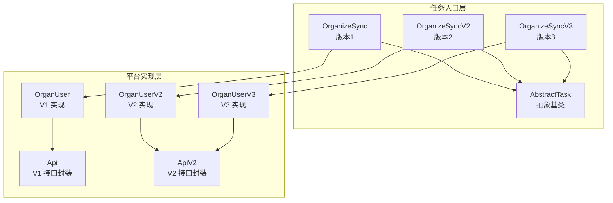
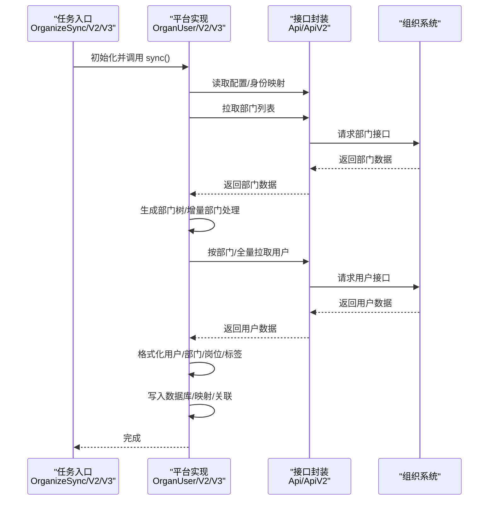
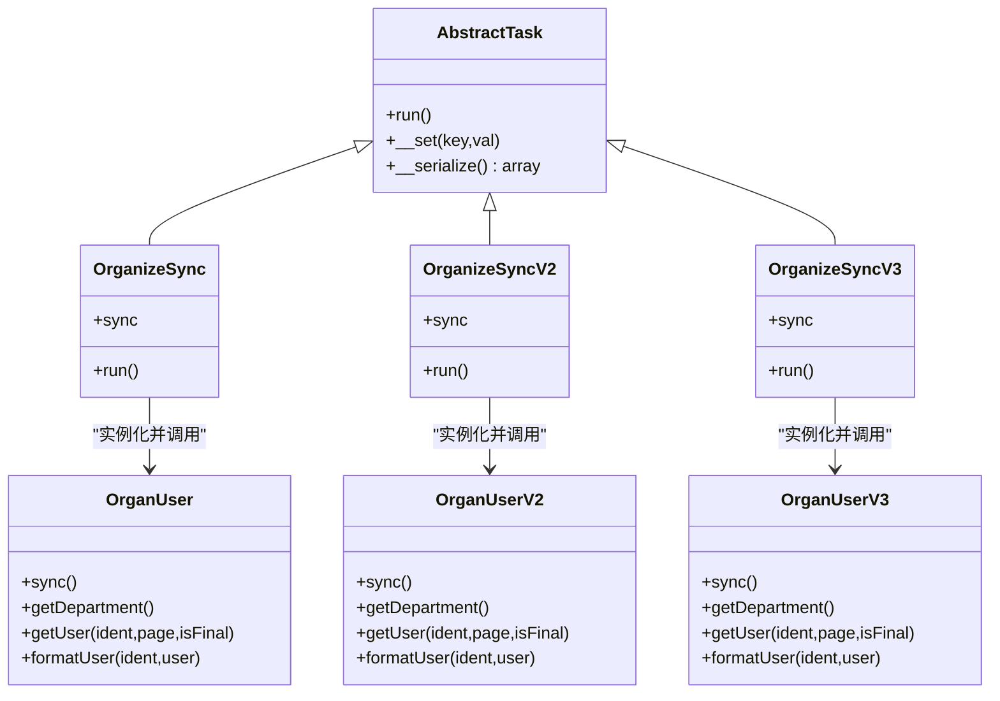
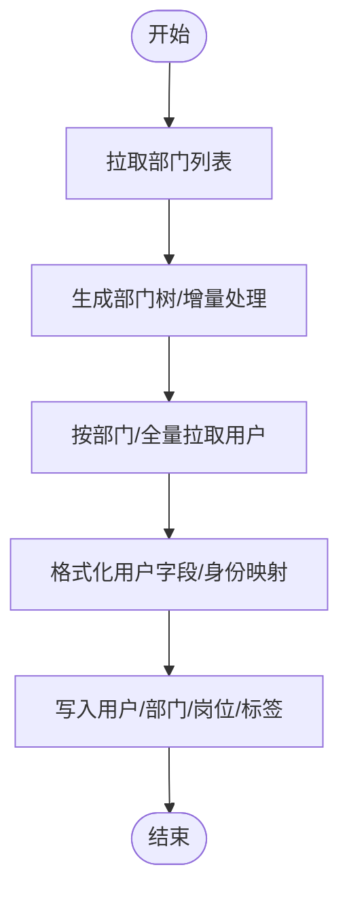
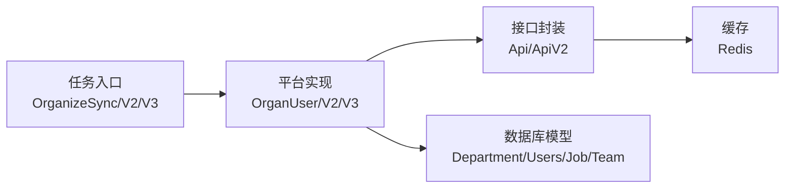

# 组织架构同步服务

<cite>
**本文引用的文件**
- [process/src/services/task/OrganizeSync.php](file://process/src/services/task/OrganizeSync.php)
- [process/src/services/task/OrganizeSyncV2.php](file://process/src/services/task/OrganizeSyncV2.php)
- [process/src/services/task/OrganizeSyncV3.php](file://process/src/services/task/OrganizeSyncV3.php)
- [process/src/services/platform/OrganUser.php](file://process/src/services/platform/OrganUser.php)
- [process/src/services/platform/OrganUserV2.php](file://process/src/services/platform/OrganUserV2.php)
- [process/src/services/platform/OrganUserV3.php](file://process/src/services/platform/OrganUserV3.php)
- [process/src/services/organize/Api.php](file://process/src/services/organize/Api.php)
- [process/src/services/organize/ApiV2.php](file://process/src/services/organize/ApiV2.php)
- [process/src/services/task/AbstractTask.php](file://process/src/services/task/AbstractTask.php)
- [process/src/services/task/OrganSyncTeam.php](file://process/src/services/task/OrganSyncTeam.php)
- [process/src/services/task/OrganSyncTeamGroup.php](file://process/src/services/task/OrganSyncTeamGroup.php)
- [process/src/services/task/OrganSyncUser.php](file://process/src/services/task/OrganSyncUser.php)
- [process/src/services/task/OrganSyncJob.php](file://process/src/services/task/OrganSyncJob.php)
- [process/src/http/system/UserSync.php](file://process/src/http/system/UserSync.php)
- [process/src/migrations/migration_20240522_user_sys.php](file://process/src/migrations/migration_20240522_user_sys.php)
</cite>

## 目录
1. [简介](#简介)
2. [项目结构](#项目结构)
3. [核心组件](#核心组件)
4. [架构总览](#架构总览)
5. [详细组件分析](#详细组件分析)
6. [依赖分析](#依赖分析)
7. [性能考虑](#性能考虑)
8. [故障排查指南](#故障排查指南)
9. [结论](#结论)
10. [附录](#附录)

## 简介
本文件面向 htdNew 项目的“组织架构同步服务”，系统性梳理并解释组织架构数据从第三方组织系统拉取、转换、验证与持久化的完整流程；深入对比 OrganizeSync、OrganizeSyncV2 与 OrganizeSyncV3 的版本演进与差异；阐明同步策略、增量更新与冲突处理机制；给出配置项、性能优化建议与常见问题解决方案，并通过图示展示关键调用链路与数据流。

## 项目结构
组织架构同步服务由“任务入口层”和“平台实现层”组成：
- 任务入口层：提供不同版本的同步任务类，负责初始化日志、选择具体实现并触发同步。
- 平台实现层：封装组织系统的 API 调用、数据格式化、岗位/标签/用户/部门等维度的写入逻辑。
- 抽象基类：统一任务序列化与忽略无效参数的行为，便于计划任务与队列消费。

图表来源
- [process/src/services/task/OrganizeSync.php](file://process/src/services/task/OrganizeSync.php#L1-L17)
- [process/src/services/task/OrganizeSyncV2.php](file://process/src/services/task/OrganizeSyncV2.php#L1-L18)
- [process/src/services/task/OrganizeSyncV3.php](file://process/src/services/task/OrganizeSyncV3.php#L1-L15)
- [process/src/services/platform/OrganUser.php](file://process/src/services/platform/OrganUser.php#L1-L60)
- [process/src/services/platform/OrganUserV2.php](file://process/src/services/platform/OrganUserV2.php#L1-L60)
- [process/src/services/platform/OrganUserV3.php](file://process/src/services/platform/OrganUserV3.php#L1-L60)
- [process/src/services/organize/Api.php](file://process/src/services/organize/Api.php#L1-L40)
- [process/src/services/organize/ApiV2.php](file://process/src/services/organize/ApiV2.php#L1-L40)
- [process/src/services/task/AbstractTask.php](file://process/src/services/task/AbstractTask.php#L1-L30)

章节来源
- [process/src/services/task/OrganizeSync.php](file://process/src/services/task/OrganizeSync.php#L1-L17)
- [process/src/services/task/OrganizeSyncV2.php](file://process/src/services/task/OrganizeSyncV2.php#L1-L18)
- [process/src/services/task/OrganizeSyncV3.php](file://process/src/services/task/OrganizeSyncV3.php#L1-L15)
- [process/src/services/task/AbstractTask.php](file://process/src/services/task/AbstractTask.php#L1-L30)

## 核心组件
- 任务入口
  - OrganizeSync：版本1入口，实例化 V1 用户同步器并触发同步。
  - OrganizeSyncV2：版本2入口，设置日志文件并实例化 V2 用户同步器。
  - OrganizeSyncV3：版本3入口，设置日志文件并实例化 V3 用户同步器。
- 平台实现
  - OrganUser（V1）：封装组织系统 API，按部门分页拉取用户，格式化用户与部门、岗位、标签等，支持增量部门数据。
  - OrganUserV2（V2）：基于新接口，部门树构建与增量部门处理，用户按部门列表拉取并格式化，支持岗位/标签同步。
  - OrganUserV3（V3）：基于新接口，用户接口改为不分部门全量拉取，部门与岗位/标签同步逻辑保持一致。
- 抽象基类
  - AbstractTask：统一任务序列化与属性过滤，避免序列化冗余。

章节来源
- [process/src/services/task/OrganizeSync.php](file://process/src/services/task/OrganizeSync.php#L1-L17)
- [process/src/services/task/OrganizeSyncV2.php](file://process/src/services/task/OrganizeSyncV2.php#L1-L18)
- [process/src/services/task/OrganizeSyncV3.php](file://process/src/services/task/OrganizeSyncV3.php#L1-L15)
- [process/src/services/platform/OrganUser.php](file://process/src/services/platform/OrganUser.php#L1-L60)
- [process/src/services/platform/OrganUserV2.php](file://process/src/services/platform/OrganUserV2.php#L1-L60)
- [process/src/services/platform/OrganUserV3.php](file://process/src/services/platform/OrganUserV3.php#L1-L60)
- [process/src/services/task/AbstractTask.php](file://process/src/services/task/AbstractTask.php#L1-L30)

## 架构总览
组织架构同步的整体调用链如下：

图表来源
- [process/src/services/task/OrganizeSync.php](file://process/src/services/task/OrganizeSync.php#L9-L17)
- [process/src/services/task/OrganizeSyncV2.php](file://process/src/services/task/OrganizeSyncV2.php#L9-L18)
- [process/src/services/task/OrganizeSyncV3.php](file://process/src/services/task/OrganizeSyncV3.php#L6-L15)
- [process/src/services/platform/OrganUser.php](file://process/src/services/platform/OrganUser.php#L23-L60)
- [process/src/services/platform/OrganUserV2.php](file://process/src/services/platform/OrganUserV2.php#L22-L60)
- [process/src/services/platform/OrganUserV3.php](file://process/src/services/platform/OrganUserV3.php#L21-L60)
- [process/src/services/organize/Api.php](file://process/src/services/organize/Api.php#L117-L157)
- [process/src/services/organize/ApiV2.php](file://process/src/services/organize/ApiV2.php#L1-L40)

## 详细组件分析

### 版本演进与差异：OrganizeSync、OrganizeSyncV2、OrganizeSyncV3
- 共同点
  - 三者均继承自 AbstractTask，具备统一的任务序列化与属性过滤行为。
  - 均通过实例化对应版本的 OrganUser* 实现类并调用其 sync() 方法启动同步。
  - 均设置日志文件路径为运行时目录下按日期命名的日志文件。
- 差异点
  - OrganizeSync（V1）：直接使用 OrganUser（V1），适用于旧版组织系统接口。
  - OrganizeSyncV2（V2）：使用 OrganUserV2，采用新版接口与部门/用户拉取方式，支持按部门列表拉取用户。
  - OrganizeSyncV3（V3）：使用 OrganUserV3，用户接口改为不分部门全量拉取，部门与岗位/标签同步逻辑保持一致。

图表来源
- [process/src/services/task/AbstractTask.php](file://process/src/services/task/AbstractTask.php#L1-L30)
- [process/src/services/task/OrganizeSync.php](file://process/src/services/task/OrganizeSync.php#L1-L17)
- [process/src/services/task/OrganizeSyncV2.php](file://process/src/services/task/OrganizeSyncV2.php#L1-L18)
- [process/src/services/task/OrganizeSyncV3.php](file://process/src/services/task/OrganizeSyncV3.php#L1-L15)
- [process/src/services/platform/OrganUser.php](file://process/src/services/platform/OrganUser.php#L1-L60)
- [process/src/services/platform/OrganUserV2.php](file://process/src/services/platform/OrganUserV2.php#L1-L60)
- [process/src/services/platform/OrganUserV3.php](file://process/src/services/platform/OrganUserV3.php#L1-L60)

章节来源
- [process/src/services/task/OrganizeSync.php](file://process/src/services/task/OrganizeSync.php#L1-L17)
- [process/src/services/task/OrganizeSyncV2.php](file://process/src/services/task/OrganizeSyncV2.php#L1-L18)
- [process/src/services/task/OrganizeSyncV3.php](file://process/src/services/task/OrganizeSyncV3.php#L1-L15)
- [process/src/services/task/AbstractTask.php](file://process/src/services/task/AbstractTask.php#L1-L30)

### 数据获取、转换、验证与存储流程
- 数据获取
  - 部门：通过组织系统接口获取部门列表，V1/V2/V3 分别使用不同方法名与参数。
  - 用户：V1/V2 按部门 ID 列表分页拉取用户；V3 改为不分部门全量拉取。
  - 岗位/标签：通过组织系统接口获取岗位与标签数据，再获取标签用户列表。
- 数据转换
  - 部门：递归生成树形结构，生成 sn/pid/name/sort 等字段；V2/V3 对 sn 字段做兼容处理。
  - 用户：标准化字段（编号、用户名、姓名、性别、手机号、邮箱、状态、身份标识等），并注入自定义字段上下文事件。
  - 关联：主部门与其它部门映射、岗位与用户关联、标签与用户关联。
- 验证与冲突处理
  - 身份映射：根据配置 identity 将远端 identity_id 映射为本地 identity_id。
  - 增量更新：V1/V2/V3 均支持增量部门数据拉取与去重排序，确保最终只保留最新更新记录。
  - 冲突处理：岗位/标签用户变更采用差集计算，新增插入、删除清理，避免重复或遗漏。
- 存储
  - 部门：写入/更新 DepartmentModel，对不在增量范围内的部门可标记禁用。
  - 用户：写入 UsersModel、UserJobModel、TeamUserModel 等，维护用户与部门/岗位/标签的关系。

图表来源
- [process/src/services/platform/OrganUser.php](file://process/src/services/platform/OrganUser.php#L61-L120)
- [process/src/services/platform/OrganUserV2.php](file://process/src/services/platform/OrganUserV2.php#L61-L120)
- [process/src/services/platform/OrganUserV3.php](file://process/src/services/platform/OrganUserV3.php#L60-L120)
- [process/src/services/platform/OrganUser.php](file://process/src/services/platform/OrganUser.php#L180-L240)
- [process/src/services/platform/OrganUserV2.php](file://process/src/services/platform/OrganUserV2.php#L195-L210)
- [process/src/services/platform/OrganUserV3.php](file://process/src/services/platform/OrganUserV3.php#L183-L191)
- [process/src/services/platform/OrganUser.php](file://process/src/services/platform/OrganUser.php#L270-L340)
- [process/src/services/platform/OrganUserV2.php](file://process/src/services/platform/OrganUserV2.php#L212-L280)
- [process/src/services/platform/OrganUserV3.php](file://process/src/services/platform/OrganUserV3.php#L194-L264)
- [process/src/services/platform/OrganUser.php](file://process/src/services/platform/OrganUser.php#L351-L492)
- [process/src/services/platform/OrganUserV2.php](file://process/src/services/platform/OrganUserV2.php#L345-L472)
- [process/src/services/platform/OrganUserV3.php](file://process/src/services/platform/OrganUserV3.php#L298-L414)

章节来源
- [process/src/services/platform/OrganUser.php](file://process/src/services/platform/OrganUser.php#L61-L120)
- [process/src/services/platform/OrganUserV2.php](file://process/src/services/platform/OrganUserV2.php#L61-L120)
- [process/src/services/platform/OrganUserV3.php](file://process/src/services/platform/OrganUserV3.php#L60-L120)
- [process/src/services/platform/OrganUser.php](file://process/src/services/platform/OrganUser.php#L180-L240)
- [process/src/services/platform/OrganUserV2.php](file://process/src/services/platform/OrganUserV2.php#L195-L210)
- [process/src/services/platform/OrganUserV3.php](file://process/src/services/platform/OrganUserV3.php#L183-L191)
- [process/src/services/platform/OrganUser.php](file://process/src/services/platform/OrganUser.php#L270-L340)
- [process/src/services/platform/OrganUserV2.php](file://process/src/services/platform/OrganUserV2.php#L212-L280)
- [process/src/services/platform/OrganUserV3.php](file://process/src/services/platform/OrganUserV3.php#L194-L264)
- [process/src/services/platform/OrganUser.php](file://process/src/services/platform/OrganUser.php#L351-L492)
- [process/src/services/platform/OrganUserV2.php](file://process/src/services/platform/OrganUserV2.php#L345-L472)
- [process/src/services/platform/OrganUserV3.php](file://process/src/services/platform/OrganUserV3.php#L298-L414)

### 同步策略、增量更新与冲突处理
- 同步策略
  - 全量/增量结合：先执行全量索引（构建部门树、岗位/标签同步），再按需执行增量部门更新。
  - 环境适配：不同学校环境对部门排序、标签用户分页等存在差异化处理。
- 增量更新
  - 增量部门：按时间段轮询增量接口，合并结果后按更新时间倒序去重，保证最终一致性。
  - 用户分页：按 ident/page 分页拉取，控制 pageSize 以平衡吞吐与内存占用。
- 冲突处理
  - 岗位/标签用户：计算新旧集合差集，分别执行新增与删除，避免重复或遗漏。
  - 部门禁用：对不在增量范围内的部门标记禁用，防止历史残留。

章节来源
- [process/src/services/platform/OrganUser.php](file://process/src/services/platform/OrganUser.php#L151-L198)
- [process/src/services/platform/OrganUserV2.php](file://process/src/services/platform/OrganUserV2.php#L110-L157)
- [process/src/services/platform/OrganUserV3.php](file://process/src/services/platform/OrganUserV3.php#L97-L144)
- [process/src/services/platform/OrganUser.php](file://process/src/services/platform/OrganUser.php#L351-L492)
- [process/src/services/platform/OrganUserV2.php](file://process/src/services/platform/OrganUserV2.php#L345-L472)
- [process/src/services/platform/OrganUserV3.php](file://process/src/services/platform/OrganUserV3.php#L298-L414)

### 配置选项与接口封装
- 配置来源
  - 第三方平台配置：优先从 ThirdpartyPlatformModel 中按类名查询；若不存在则回退到 YAML 配置文件中的 organize 节点。
  - 身份映射：identity 字段用于将远端 identity_id 映射为本地 identity_id。
- 接口封装
  - Api/ApiV2：统一封装获取 access_token、构造 URL、发起请求、解析响应与重试逻辑；对错误码进行识别并按需强制刷新 token。
  - 日志与重试：统一记录请求参数、响应数据与异常信息；对特定错误码进行指数退避重试。

章节来源
- [process/src/services/organize/Api.php](file://process/src/services/organize/Api.php#L1-L40)
- [process/src/services/organize/Api.php](file://process/src/services/organize/Api.php#L117-L157)
- [process/src/services/platform/OrganUser.php](file://process/src/services/platform/OrganUser.php#L33-L60)
- [process/src/services/platform/OrganUserV2.php](file://process/src/services/platform/OrganUserV2.php#L33-L60)
- [process/src/services/platform/OrganUserV3.php](file://process/src/services/platform/OrganUserV3.php#L32-L60)

### 与系统接口的集成
- 团队/岗位/用户同步接口
  - OrganSyncTeam/OrganSyncTeamGroup/OrganSyncJob/OrganSyncUser：动态选择版本并返回列表，供系统接口调用。
- 后台路由注册
  - 在系统接口中注册上述任务，允许通过 HTTP 调用获取团队/岗位/用户列表，便于前端或运维操作。

章节来源
- [process/src/services/task/OrganSyncTeam.php](file://process/src/services/task/OrganSyncTeam.php#L1-L17)
- [process/src/services/task/OrganSyncTeamGroup.php](file://process/src/services/task/OrganSyncTeamGroup.php#L1-L17)
- [process/src/services/task/OrganSyncJob.php](file://process/src/services/task/OrganSyncJob.php#L1-L17)
- [process/src/services/task/OrganSyncUser.php](file://process/src/services/task/OrganSyncUser.php#L1-L19)
- [process/src/http/system/UserSync.php](file://process/src/http/system/UserSync.php#L1469-L1498)

## 依赖分析
- 组件耦合
  - 任务入口与平台实现通过类实例化解耦，便于按版本切换。
  - 平台实现依赖组织系统 API 封装，API 封装依赖缓存与日志工具。
- 外部依赖
  - 组织系统接口：部门、用户、岗位、标签等接口。
  - 缓存：Redis 用于存储 access_token，提升接口调用效率。
  - 数据库：DepartmentModel、UsersModel、UserJobModel、TeamModel、TeamUserModel 等模型。

图表来源
- [process/src/services/task/OrganizeSync.php](file://process/src/services/task/OrganizeSync.php#L9-L17)
- [process/src/services/task/OrganizeSyncV2.php](file://process/src/services/task/OrganizeSyncV2.php#L9-L18)
- [process/src/services/task/OrganizeSyncV3.php](file://process/src/services/task/OrganizeSyncV3.php#L6-L15)
- [process/src/services/platform/OrganUser.php](file://process/src/services/platform/OrganUser.php#L23-L60)
- [process/src/services/platform/OrganUserV2.php](file://process/src/services/platform/OrganUserV2.php#L22-L60)
- [process/src/services/platform/OrganUserV3.php](file://process/src/services/platform/OrganUserV3.php#L21-L60)
- [process/src/services/organize/Api.php](file://process/src/services/organize/Api.php#L117-L157)

章节来源
- [process/src/services/task/OrganizeSync.php](file://process/src/services/task/OrganizeSync.php#L1-L17)
- [process/src/services/task/OrganizeSyncV2.php](file://process/src/services/task/OrganizeSyncV2.php#L1-L18)
- [process/src/services/task/OrganizeSyncV3.php](file://process/src/services/task/OrganizeSyncV3.php#L1-L15)
- [process/src/services/platform/OrganUser.php](file://process/src/services/platform/OrganUser.php#L1-L60)
- [process/src/services/platform/OrganUserV2.php](file://process/src/services/platform/OrganUserV2.php#L1-L60)
- [process/src/services/platform/OrganUserV3.php](file://process/src/services/platform/OrganUserV3.php#L1-L60)
- [process/src/services/organize/Api.php](file://process/src/services/organize/Api.php#L117-L157)

## 性能考虑
- 分页与并发
  - 用户分页大小应结合目标系统限流与内存占用权衡；V2/V3 默认分页较大，V1/V2 对特定环境做了分页调整。
- 增量更新
  - 使用增量部门接口减少全量扫描成本；按更新时间排序并去重，避免重复写入。
- 缓存与重试
  - access_token 缓存减少鉴权开销；对特定错误码进行重试与强制刷新，提高稳定性。
- 环境适配
  - 针对不同学校环境的特殊处理（如部门排序、标签用户分页）应在任务入口或平台实现中合理裁剪，避免不必要的计算。

## 故障排查指南
- 常见错误与定位
  - 未配置组织系统同步信息：检查 ThirdpartyPlatform 配置或 YAML 中 organize 节点是否存在。
  - 身份映射缺失：确认 identity 字段配置正确，远端 identity_id 是否存在映射。
  - 接口返回错误：查看 Api/ApiV2 的日志记录，关注状态码与错误消息；对特定错误码自动重试。
  - 增量数据为空：确认时间段参数与增量接口返回；检查部门树构建与 sn 列表是否为空。
- 建议排查步骤
  - 检查任务入口日志文件路径与权限。
  - 手动调用平台实现的 index/同步方法，观察中间过程输出。
  - 核对数据库中 Department/Users/Job/Team 表的状态与数量变化，确认增量更新是否生效。

章节来源
- [process/src/services/organize/Api.php](file://process/src/services/organize/Api.php#L1-L40)
- [process/src/services/organize/Api.php](file://process/src/services/organize/Api.php#L117-L157)
- [process/src/services/platform/OrganUser.php](file://process/src/services/platform/OrganUser.php#L33-L60)
- [process/src/services/platform/OrganUserV2.php](file://process/src/services/platform/OrganUserV2.php#L33-L60)
- [process/src/services/platform/OrganUserV3.php](file://process/src/services/platform/OrganUserV3.php#L32-L60)

## 结论
组织架构同步服务通过“任务入口 + 平台实现 + 接口封装”的分层设计，实现了对组织系统数据的稳定同步。V1/V2/V3 在接口形态、用户拉取方式与环境适配上逐步演进，满足不同学校与场景的需求。通过增量更新与冲突处理机制，系统能够在保证数据一致性的同时降低同步成本。建议在生产环境中结合业务规模与系统限流，合理设置分页大小与重试策略，并完善监控与告警以保障稳定性。

## 附录
- 配置项参考
  - 组织系统基础配置：url、appid、appsecret、organ_id、identity、force、incr_time 等。
  - 第三方平台配置：可通过 ThirdpartyPlatformModel 注入，优先级高于 YAML。
- 历史迁移
  - 在迁移脚本中可见对 OrganizeSync 的加载与执行记录，可用于追溯历史任务。

章节来源
- [process/src/migrations/migration_20240522_user_sys.php](file://process/src/migrations/migration_20240522_user_sys.php#L8-L42)