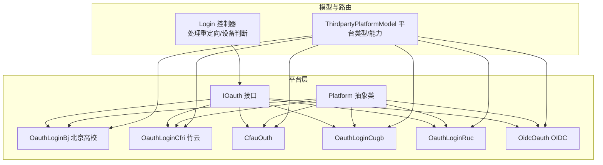
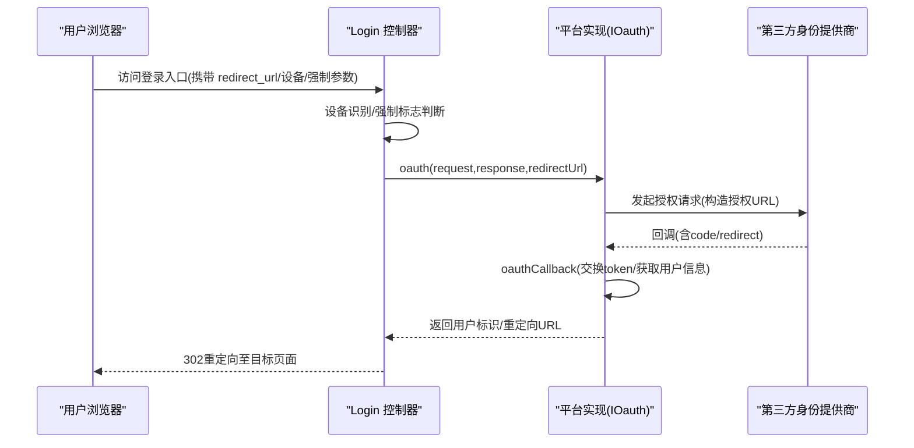
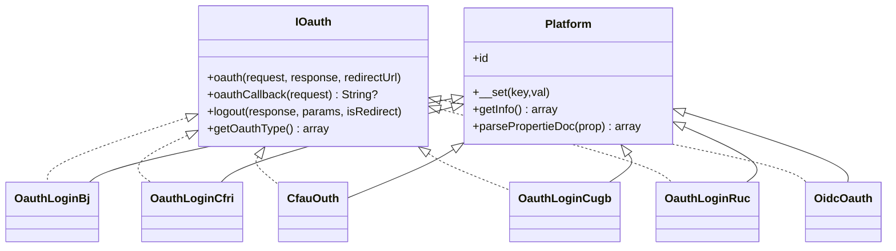
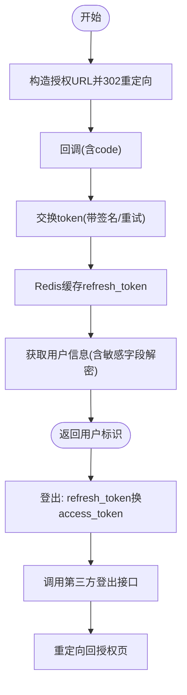
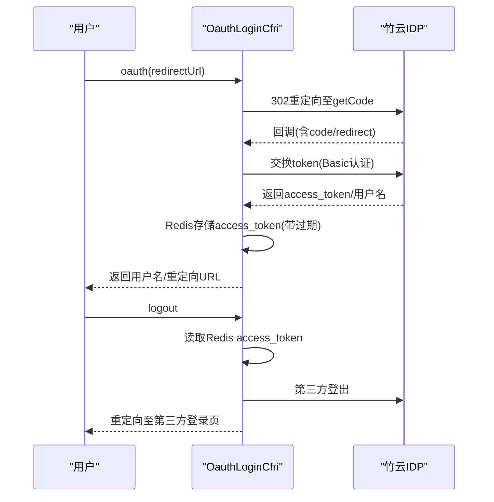
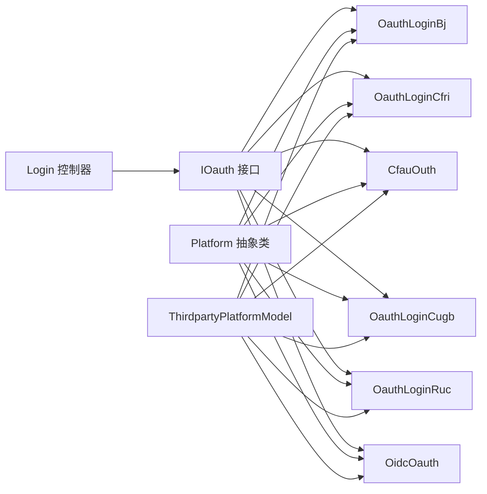
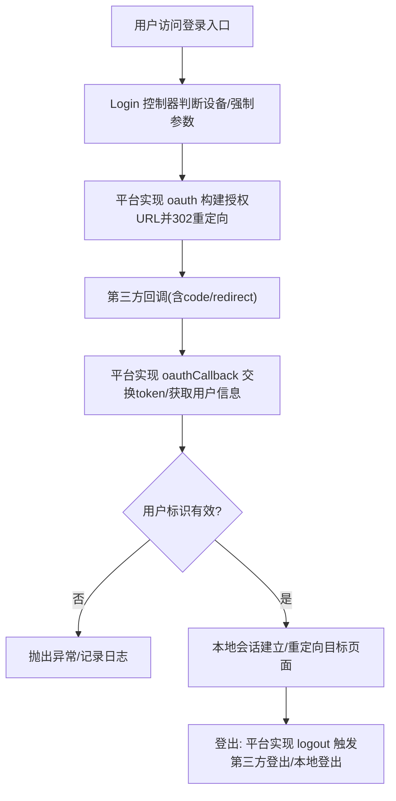

# OAuth 认证服务

<cite>
**本文引用的文件**
- [IOauth.php](file://process/src/services/platform/IOauth.php)
- [Platform.php](file://process/src/services/platform/Platform.php)
- [OidcOauth.php](file://process/src/services/platform/OidcOauth.php)
- [OauthLoginBj.php](file://process/src/services/platform/OauthLoginBj.php)
- [OauthLoginCfri.php](file://process/src/services/platform/OauthLoginCfri.php)
- [CfauOuth.php](file://process/src/services/platform/CfauOuth.php)
- [OauthLoginCugb.php](file://process/src/services/platform/OauthLoginCugb.php)
- [OauthLoginRuc.php](file://process/src/services/platform/OauthLoginRuc.php)
- [ThirdpartyPlatformModel.php](file://process/src/models/ThirdpartyPlatformModel.php)
- [Login.php](file://process/src/http/api/Login.php)
</cite>

## 目录
1. [简介](#简介)
2. [项目结构](#项目结构)
3. [核心组件](#核心组件)
4. [架构总览](#架构总览)
5. [详细组件分析](#详细组件分析)
6. [依赖关系分析](#依赖关系分析)
7. [性能考量](#性能考量)
8. [故障排查指南](#故障排查指南)
9. [结论](#结论)
10. [附录](#附录)

## 简介
本文件面向 htdNew 项目的 OAuth 认证服务，系统性梳理统一认证接口、多平台适配机制、OAuth 2.0 流程、令牌管理、安全策略与扩展接入方案。文档覆盖多种学校与机构的 OAuth 实现（如 LeDa、北京高校、Cfri 等），并给出认证失败处理、重定向机制与状态管理建议，以及新平台接入与安全加固的最佳实践。

## 项目结构
OAuth 认证相关代码集中在以下模块：
- 平台抽象与接口：services/platform/Platform.php、services/platform/IOauth.php
- 具体平台实现：services/platform/OauthLoginBj.php、services/platform/OauthLoginCfri.php、services/platform/CfauOuth.php、services/platform/OauthLoginCugb.php、services/platform/OauthLoginRuc.php、services/platform/OidcOauth.php
- 平台元数据与类型定义：models/ThirdpartyPlatformModel.php
- 统一入口与重定向控制：http/api/Login.php

图表来源
- [IOauth.php](file://process/src/services/platform/IOauth.php#L1-L23)
- [Platform.php](file://process/src/services/platform/Platform.php#L1-L93)
- [OauthLoginBj.php](file://process/src/services/platform/OauthLoginBj.php#L1-L239)
- [OauthLoginCfri.php](file://process/src/services/platform/OauthLoginCfri.php#L1-L168)
- [CfauOuth.php](file://process/src/services/platform/CfauOuth.php#L1-L41)
- [OauthLoginCugb.php](file://process/src/services/platform/OauthLoginCugb.php#L1-L138)
- [OauthLoginRuc.php](file://process/src/services/platform/OauthLoginRuc.php#L1-L221)
- [OidcOauth.php](file://process/src/services/platform/OidcOauth.php#L1-L223)
- [ThirdpartyPlatformModel.php](file://process/src/models/ThirdpartyPlatformModel.php#L1-L212)
- [Login.php](file://process/src/http/api/Login.php#L45-L68)

章节来源
- [IOauth.php](file://process/src/services/platform/IOauth.php#L1-L23)
- [Platform.php](file://process/src/services/platform/Platform.php#L1-L93)
- [ThirdpartyPlatformModel.php](file://process/src/models/ThirdpartyPlatformModel.php#L1-L212)
- [Login.php](file://process/src/http/api/Login.php#L45-L68)

## 核心组件
- 统一接口 IOauth：定义 oauth、oauthCallback、logout 与 getOauthType 等契约，确保各平台实现一致。
- 抽象基类 Platform：提供平台信息解析、表单元数据解析、忽略无效赋值等通用能力。
- 具体平台实现：
  - 北京高校：OauthLoginBj，支持签名、重试、AES 加解密、刷新令牌登出。
  - 竹云：OauthLoginCfri，支持 Redis 存储 access_token、第三方登出。
  - CFAU：CfauOuth，支持初始化校验 host/port/https。
  - 中国地质大学（CUGB）：OauthLoginCugb，支持授权码换取 token 与用户信息。
  - 中国人民大学（RUC）：OauthLoginRuc，支持 Basic 认证换取 token 与用户信息。
  - OIDC：OidcOauth，支持 JWT 校验、用户信息创建、登出。
- 平台元数据模型 ThirdpartyPlatformModel：定义 OAuth 类型、能力、分类与平台映射。

章节来源
- [IOauth.php](file://process/src/services/platform/IOauth.php#L1-L23)
- [Platform.php](file://process/src/services/platform/Platform.php#L1-L93)
- [OauthLoginBj.php](file://process/src/services/platform/OauthLoginBj.php#L1-L239)
- [OauthLoginCfri.php](file://process/src/services/platform/OauthLoginCfri.php#L1-L168)
- [CfauOuth.php](file://process/src/services/platform/CfauOuth.php#L1-L41)
- [OauthLoginCugb.php](file://process/src/services/platform/OauthLoginCugb.php#L1-L138)
- [OauthLoginRuc.php](file://process/src/services/platform/OauthLoginRuc.php#L1-L221)
- [OidcOauth.php](file://process/src/services/platform/OidcOauth.php#L1-L223)
- [ThirdpartyPlatformModel.php](file://process/src/models/ThirdpartyPlatformModel.php#L1-L212)

## 架构总览
OAuth 认证整体流程：
- 用户触发登录，Login 控制器根据 redirect_url、设备类型与强制标志决定是否走 OAuth。
- 平台实现通过 oauth 方法构造授权 URL 并进行 302 重定向。
- 第三方平台回调后，平台实现 oauthCallback 获取 access_token/用户标识。
- 登出时，平台实现 logout 触发第三方登出或本地登出，并返回重定向地址。

图表来源
- [Login.php](file://process/src/http/api/Login.php#L45-L68)
- [IOauth.php](file://process/src/services/platform/IOauth.php#L1-L23)
- [OauthLoginBj.php](file://process/src/services/platform/OauthLoginBj.php#L171-L217)
- [OauthLoginCfri.php](file://process/src/services/platform/OauthLoginCfri.php#L45-L117)
- [OauthLoginCugb.php](file://process/src/services/platform/OauthLoginCugb.php#L55-L114)
- [OauthLoginRuc.php](file://process/src/services/platform/OauthLoginRuc.php#L43-L79)
- [OidcOauth.php](file://process/src/services/platform/OidcOauth.php#L121-L155)

## 详细组件分析

### 统一接口与抽象基类
- IOauth 接口：约束平台必须实现 oauth、oauthCallback、logout 与 getOauthType。
- Platform 抽象类：提供平台信息静态方法、属性注释解析、忽略无效赋值等通用逻辑。

图表来源
- [IOauth.php](file://process/src/services/platform/IOauth.php#L1-L23)
- [Platform.php](file://process/src/services/platform/Platform.php#L1-L93)
- [OauthLoginBj.php](file://process/src/services/platform/OauthLoginBj.php#L1-L239)
- [OauthLoginCfri.php](file://process/src/services/platform/OauthLoginCfri.php#L1-L168)
- [CfauOuth.php](file://process/src/services/platform/CfauOuth.php#L1-L41)
- [OauthLoginCugb.php](file://process/src/services/platform/OauthLoginCugb.php#L1-L138)
- [OauthLoginRuc.php](file://process/src/services/platform/OauthLoginRuc.php#L1-L221)
- [OidcOauth.php](file://process/src/services/platform/OidcOauth.php#L1-L223)

章节来源
- [IOauth.php](file://process/src/services/platform/IOauth.php#L1-L23)
- [Platform.php](file://process/src/services/platform/Platform.php#L1-L93)

### 北京高校 OAuth（OauthLoginBj）
- 授权与回调：构造授权 URL 并重定向；回调后通过 getToken 获取 access_token/refresh_token，并持久化到 Redis；再调用 getLoginUserInfo 获取用户信息。
- 刷新与登出：logout 时使用 refresh_token 换取 access_token，调用第三方登出接口，随后重定向回授权页。
- 安全要点：内置 AES 加解密工具，对敏感字段进行加解密；支持重试与状态码校验。

图表来源
- [OauthLoginBj.php](file://process/src/services/platform/OauthLoginBj.php#L171-L217)
- [OauthLoginBj.php](file://process/src/services/platform/OauthLoginBj.php#L102-L160)
- [OauthLoginBj.php](file://process/src/services/platform/OauthLoginBj.php#L201-L217)

章节来源
- [OauthLoginBj.php](file://process/src/services/platform/OauthLoginBj.php#L1-L239)

### 竹云 OAuth（OauthLoginCfri）
- 授权与回调：oauth 构造 getCode URL 并重定向；oauthCallback 通过 Authorization: Basic 交换 token，解析返回的用户名与 access_token，写入 Redis 并设置过期。
- 登出：从 Redis 读取 access_token，调用第三方登出接口，再执行本地登出并返回第三方登录页。

图表来源
- [OauthLoginCfri.php](file://process/src/services/platform/OauthLoginCfri.php#L45-L117)
- [OauthLoginCfri.php](file://process/src/services/platform/OauthLoginCfri.php#L102-L117)

章节来源
- [OauthLoginCfri.php](file://process/src/services/platform/OauthLoginCfri.php#L1-L168)

### CFAU OAuth（CfauOuth）
- 初始化校验：对 host、port、https 进行正则与数值校验，拼装基础 URL。
- 授权与回调：定义常量 OAUTH_URL/OAUTH_TOKEN/OAUTH_USERINFO/OAUTH_LOGOUT，按约定路径进行交互。
- 登出：构造 GLO 登出 URL 并重定向。

章节来源
- [CfauOuth.php](file://process/src/services/platform/CfauOuth.php#L1-L41)

### 中国地质大学 OAuth（OauthLoginCugb）
- 授权与回调：oauth 构造 authorize 查询参数并重定向；oauthCallback 通过 GET 交换 token，并调用用户信息接口。
- 登出：构造 logout URL 并返回重定向地址。

章节来源
- [OauthLoginCugb.php](file://process/src/services/platform/OauthLoginCugb.php#L55-L114)
- [OauthLoginCugb.php](file://process/src/services/platform/OauthLoginCugb.php#L123-L130)

### 中国人民大学 OAuth（OauthLoginRuc）
- 授权与回调：oauth 构造 authorize 查询参数并重定向；oauthCallback 通过 Basic 认证交换 token，并调用用户信息接口解析主身份学号。
- 登出：本地登出并返回前端地址。

章节来源
- [OauthLoginRuc.php](file://process/src/services/platform/OauthLoginRuc.php#L43-L79)
- [OauthLoginRuc.php](file://process/src/services/platform/OauthLoginRuc.php#L81-L127)
- [OauthLoginRuc.php](file://process/src/services/platform/OauthLoginRuc.php#L128-L133)

### OIDC 统一认证（OidcOauth）
- 授权与回调：构造 OIDC 授权 URL 并重定向；回调后交换 token，校验 access_token/id_token 的 JWT，必要时创建用户并返回用户标识。
- 登出：构造 OIDC 提供商登出 URL 并重定向。

章节来源
- [OidcOauth.php](file://process/src/services/platform/OidcOauth.php#L121-L155)
- [OidcOauth.php](file://process/src/services/platform/OidcOauth.php#L187-L223)

### 平台类型与能力（ThirdpartyPlatformModel）
- 定义 OAuth 类型（web、wx_work、wechat、miniapp、visitor、app 等）与能力（oauth、payment、alive_check、notice、ocr、aigc 等）。
- 提供平台分类与映射，用于后台配置与展示。

章节来源
- [ThirdpartyPlatformModel.php](file://process/src/models/ThirdpartyPlatformModel.php#L1-L212)

### 统一入口与重定向控制（Login 控制器）
- 处理登录重定向 Cookie 设置、设备识别、强制 OAuth 参数与特定环境的重定向逻辑（如 naea 202 登录）。

章节来源
- [Login.php](file://process/src/http/api/Login.php#L45-L68)

## 依赖关系分析
- 平台实现均依赖 IOauth 接口与 Platform 抽象类，保证行为一致性。
- 平台实现依赖 HTTP 工具函数（如 get/post/curl）与 Redis 缓存。
- 登录控制器依赖设备识别与重定向逻辑，驱动平台选择。

图表来源
- [IOauth.php](file://process/src/services/platform/IOauth.php#L1-L23)
- [Platform.php](file://process/src/services/platform/Platform.php#L1-L93)
- [ThirdpartyPlatformModel.php](file://process/src/models/ThirdpartyPlatformModel.php#L1-L212)
- [Login.php](file://process/src/http/api/Login.php#L45-L68)

章节来源
- [IOauth.php](file://process/src/services/platform/IOauth.php#L1-L23)
- [Platform.php](file://process/src/services/platform/Platform.php#L1-L93)
- [ThirdpartyPlatformModel.php](file://process/src/models/ThirdpartyPlatformModel.php#L1-L212)
- [Login.php](file://process/src/http/api/Login.php#L45-L68)

## 性能考量
- 令牌缓存：北京高校与竹云平台均使用 Redis 缓存 token/refresh_token，减少第三方调用频率。
- 重试机制：北京高校实现有限重试与状态码校验，提升稳定性。
- 并发与协程：平台实现使用协程 HTTP 客户端与异步请求，降低阻塞。
- 日志与可观测性：各平台实现均记录调试日志，便于定位问题。

## 故障排查指南
- 授权失败（code 为空）：检查平台 oauthCallback 对 code 的提取与容错逻辑。
- 令牌交换失败：核对 Basic 认证、Content-Type、重定向 URI 与第三方返回状态码。
- 用户信息缺失：确认用户信息接口返回结构与字段映射，北京高校需完善证件号。
- 登出失败：确认 refresh_token/ access_token 的获取与第三方登出接口返回码。
- 设备与重定向：Login 控制器中设备识别与强制 OAuth 参数可能导致重定向异常，需结合前端 UA 与参数进行验证。

章节来源
- [OauthLoginBj.php](file://process/src/services/platform/OauthLoginBj.php#L179-L217)
- [OauthLoginCfri.php](file://process/src/services/platform/OauthLoginCfri.php#L61-L117)
- [OauthLoginCugb.php](file://process/src/services/platform/OauthLoginCugb.php#L63-L114)
- [OauthLoginRuc.php](file://process/src/services/platform/OauthLoginRuc.php#L59-L127)
- [OidcOauth.php](file://process/src/services/platform/OidcOauth.php#L121-L155)
- [Login.php](file://process/src/http/api/Login.php#L45-L68)

## 结论
htdNew 的 OAuth 认证服务通过统一接口与抽象基类实现了多平台适配，结合平台化的令牌管理与登出机制，满足不同学校与机构的 OAuth 需求。建议在新平台接入时遵循 IOauth 契约、完善日志与重试、强化安全校验与缓存策略，并在 Login 控制器中做好设备与重定向的统一处理。

## 附录

### OAuth 2.0 统一流程（概念图）

[本图为概念流程，无需图表来源]