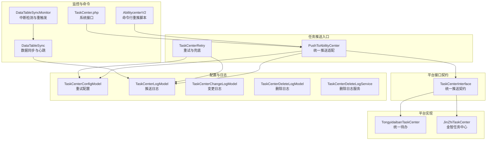
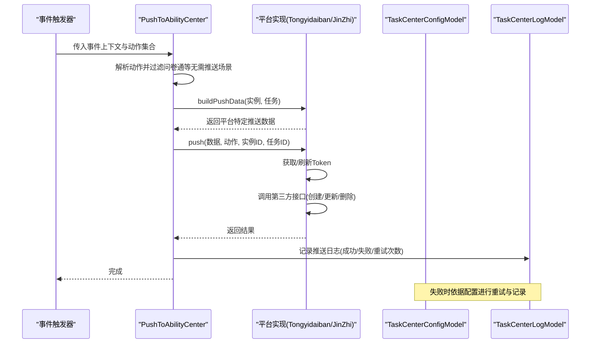
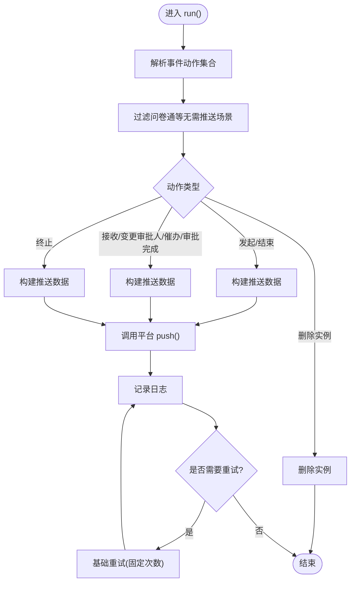
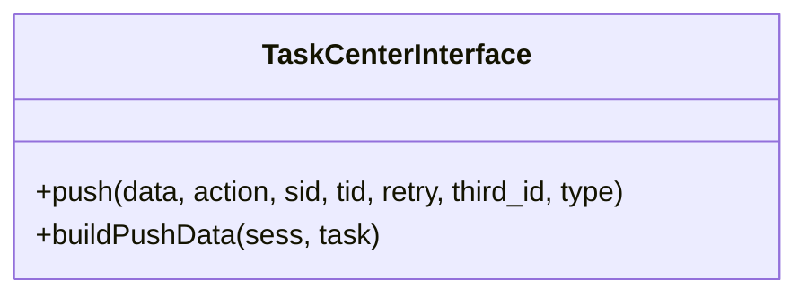
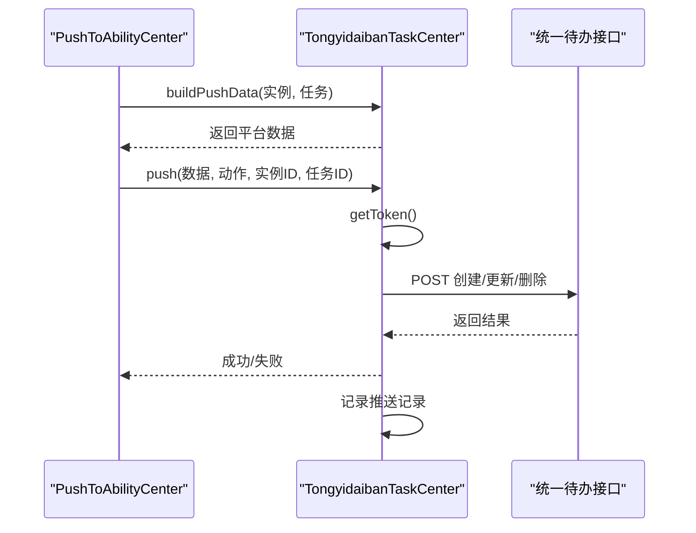
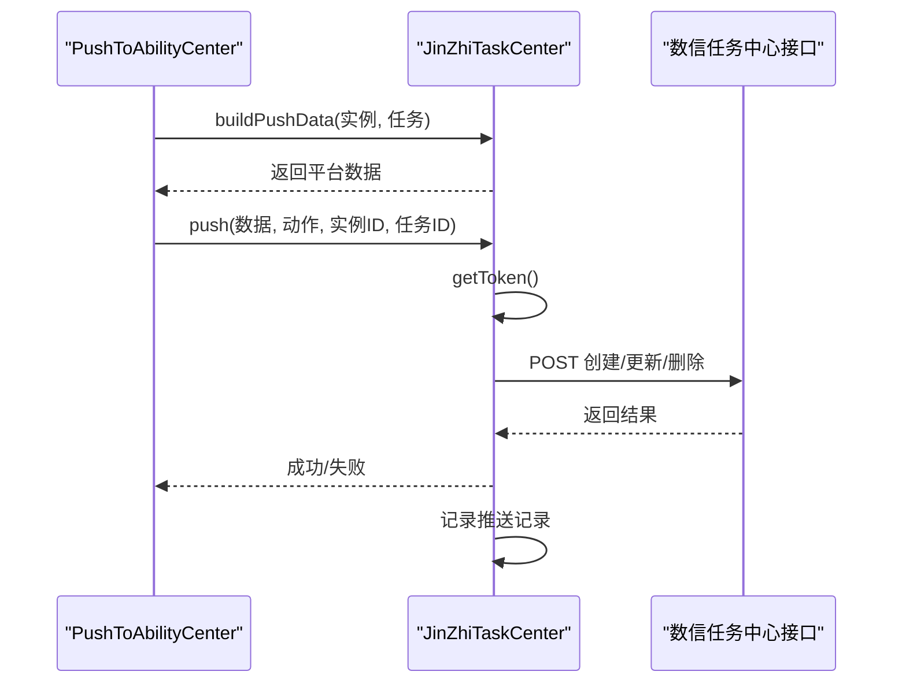
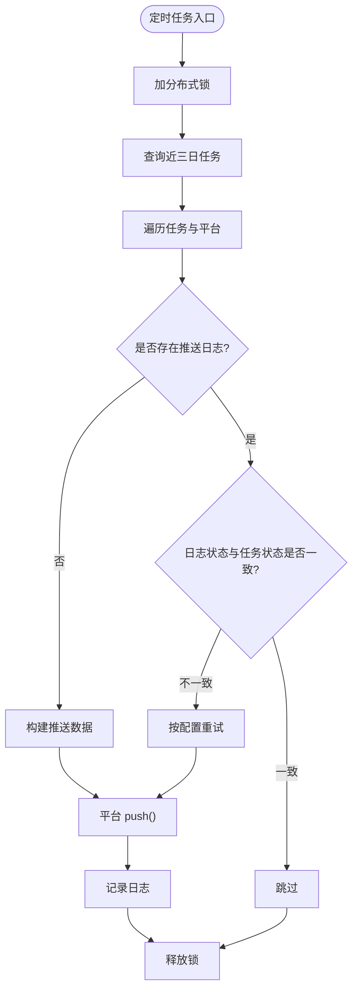
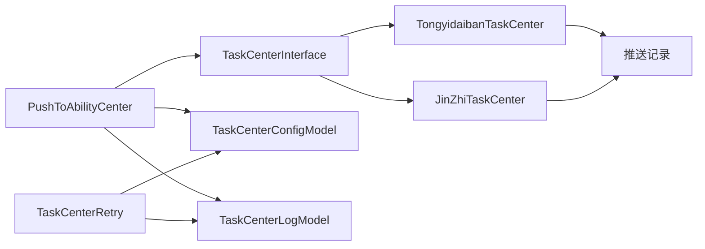

# 任务中心集成

<cite>
**本文引用的文件**
- [PushToAbilityCenter.php](file://process/src/services/task/PushToAbilityCenter.php)
- [TaskCenterRetry.php](file://process/src/services/task/TaskCenterRetry.php)
- [TaskCenterInterface.php](file://process/src/services/platform/TaskCenterInterface.php)
- [TongyidaibanTaskCenter.php](file://process/src/services/platform/TongyidaibanTaskCenter.php)
- [JinZhiTaskCenter.php](file://process/src/services/platform/JinZhiTaskCenter.php)
- [TaskCenterConfigModel.php](file://process/src/models/TaskCenterConfigModel.php)
- [Notice.php](file://process/src/components/Notice.php)
- [AbilitycenterV2.php](file://process_envs/scnu/product/commands/AbilitycenterV2.php)
- [migration_20240702_130206_alter_platform.php](file://process/src/migrations/migration_20240702_130206_alter_platform.php)
- [migration_20240811_100331_platform_reserve.php](file://process/src/migrations/migration_20240811_100331_platform_reserve.php)
- [TaskCenter.php](file://process/src/http/system/TaskCenter.php)
- [TaskCenterLogModel.php](file://process/src/models/TaskCenterLogModel.php)
- [TaskCenterChangeLogModel.php](file://process/src/models/TaskCenterChangeLogModel.php)
- [TaskCenterDeleteLogModel.php](file://process/src/models/TaskCenterDeleteLogModel.php)
- [TaskCenterDeleteLogService.php](file://process/src/services/taskCenter/TaskCenterDeleteLogService.php)
- [DataTableSync.php](file://process/src/services/task/DataTableSync.php)
- [DataTableSyncMonitor.php](file://process/src/services/task/DataTableSyncMonitor.php)
- [TokenServiceExample.php](file://process/src/services/api/TokenServiceExample.php)
- [OauthLoginVisitor.php](file://process/src/services/platform/OauthLoginVisitor.php)
</cite>

## 目录
1. [简介](#简介)
2. [项目结构](#项目结构)
3. [核心组件](#核心组件)
4. [架构总览](#架构总览)
5. [详细组件分析](#详细组件分析)
6. [依赖关系分析](#依赖关系分析)
7. [性能与容量评估](#性能与容量评估)
8. [故障排查指南](#故障排查指南)
9. [结论](#结论)
10. [附录](#附录)

## 简介
本文件面向 htdNew 项目，系统性梳理任务中心集成方案，覆盖统一推送接口、多平台适配（能力中心、数信任务中心、通义待办任务中心）、标准化推送流程、状态同步与回调、认证授权、消息格式与错误重试策略，并给出性能监控、容量评估与故障恢复建议。文档同时提供架构图与流程图，帮助读者快速理解与落地。

## 项目结构
任务中心相关代码主要分布在以下模块：
- 任务推送入口与适配层：services/task 与 services/platform
- 平台接口契约：services/platform/TaskCenterInterface.php
- 平台实现：TongyidaibanTaskCenter.php、JinZhiTaskCenter.php 等
- 配置与日志：models 下 TaskCenterConfigModel.php、TaskCenterLogModel.php 等
- 重试与监控：services/task/TaskCenterRetry.php、DataTableSync*.php
- 命令与系统接口：process_envs/*/commands/*、http/system/TaskCenter.php
- 迁移与扩展：migrations 中对平台配置字段的扩展

图表来源
- [PushToAbilityCenter.php](file://process/src/services/task/PushToAbilityCenter.php#L1-L291)
- [TaskCenterRetry.php](file://process/src/services/task/TaskCenterRetry.php#L1-L223)
- [TaskCenterInterface.php](file://process/src/services/platform/TaskCenterInterface.php#L1-L34)
- [TongyidaibanTaskCenter.php](file://process/src/services/platform/TongyidaibanTaskCenter.php#L1-L240)
- [JinZhiTaskCenter.php](file://process/src/services/platform/JinZhiTaskCenter.php#L1-L383)
- [TaskCenterConfigModel.php](file://process/src/models/TaskCenterConfigModel.php#L1-L62)
- [TaskCenterLogModel.php](file://process/src/models/TaskCenterLogModel.php)
- [TaskCenterChangeLogModel.php](file://process/src/models/TaskCenterChangeLogModel.php)
- [TaskCenterDeleteLogModel.php](file://process/src/models/TaskCenterDeleteLogModel.php)
- [TaskCenterDeleteLogService.php](file://process/src/services/taskCenter/TaskCenterDeleteLogService.php)
- [DataTableSync.php](file://process/src/services/task/DataTableSync.php#L510-L887)
- [DataTableSyncMonitor.php](file://process/src/services/task/DataTableSyncMonitor.php#L32-L62)
- [AbilitycenterV2.php](file://process_envs/scnu/product/commands/AbilitycenterV2.php#L1-L37)
- [TaskCenter.php](file://process/src/http/system/TaskCenter.php)

章节来源
- [PushToAbilityCenter.php](file://process/src/services/task/PushToAbilityCenter.php#L1-L291)
- [TaskCenterRetry.php](file://process/src/services/task/TaskCenterRetry.php#L1-L223)
- [TaskCenterInterface.php](file://process/src/services/platform/TaskCenterInterface.php#L1-L34)
- [TongyidaibanTaskCenter.php](file://process/src/services/platform/TongyidaibanTaskCenter.php#L1-L240)
- [JinZhiTaskCenter.php](file://process/src/services/platform/JinZhiTaskCenter.php#L1-L383)
- [TaskCenterConfigModel.php](file://process/src/models/TaskCenterConfigModel.php#L1-L62)
- [TaskCenterLogModel.php](file://process/src/models/TaskCenterLogModel.php)
- [TaskCenterChangeLogModel.php](file://process/src/models/TaskCenterChangeLogModel.php)
- [TaskCenterDeleteLogModel.php](file://process/src/models/TaskCenterDeleteLogModel.php)
- [TaskCenterDeleteLogService.php](file://process/src/services/taskCenter/TaskCenterDeleteLogService.php)
- [DataTableSync.php](file://process/src/services/task/DataTableSync.php#L510-L887)
- [DataTableSyncMonitor.php](file://process/src/services/task/DataTableSyncMonitor.php#L32-L62)
- [AbilitycenterV2.php](file://process_envs/scnu/product/commands/AbilitycenterV2.php#L1-L37)
- [TaskCenter.php](file://process/src/http/system/TaskCenter.php)

## 核心组件
- 统一推送适配器：PushToAbilityCenter.php
  - 负责根据事件动作构建推送数据，调用具体平台实现的 push/buildPushData，并支持基础请求重试。
- 平台接口契约：TaskCenterInterface.php
  - 定义统一的 push 与 buildPushData 接口，确保各平台实现一致性。
- 平台实现：
  - TongyidaibanTaskCenter.php：统一待办任务中心，负责 token 获取、任务创建/更新/删除与重试。
  - JinZhiTaskCenter.php：数信任务中心，负责 token 获取、任务/实例的创建/更新/删除与重试。
- 重试与兜底：TaskCenterRetry.php
  - 对近三日内未推送或失败的任务进行重试，支持按配置的重试次数与间隔控制。
- 配置与日志：TaskCenterConfigModel.php、TaskCenterLogModel.php 等
  - 提供重试次数与间隔配置，记录推送日志、变更与删除日志。
- 监控与命令：DataTableSync*.php、AbilitycenterV2.php、http/system/TaskCenter.php
  - 数据同步与心跳、中断检测与重触发、命令行重推脚本、系统接口。

章节来源
- [PushToAbilityCenter.php](file://process/src/services/task/PushToAbilityCenter.php#L1-L291)
- [TaskCenterInterface.php](file://process/src/services/platform/TaskCenterInterface.php#L1-L34)
- [TongyidaibanTaskCenter.php](file://process/src/services/platform/TongyidaibanTaskCenter.php#L1-L240)
- [JinZhiTaskCenter.php](file://process/src/services/platform/JinZhiTaskCenter.php#L1-L383)
- [TaskCenterRetry.php](file://process/src/services/task/TaskCenterRetry.php#L1-L223)
- [TaskCenterConfigModel.php](file://process/src/models/TaskCenterConfigModel.php#L1-L62)
- [TaskCenterLogModel.php](file://process/src/models/TaskCenterLogModel.php)
- [TaskCenterChangeLogModel.php](file://process/src/models/TaskCenterChangeLogModel.php)
- [TaskCenterDeleteLogModel.php](file://process/src/models/TaskCenterDeleteLogModel.php)
- [TaskCenterDeleteLogService.php](file://process/src/services/taskCenter/TaskCenterDeleteLogService.php)
- [DataTableSync.php](file://process/src/services/task/DataTableSync.php#L510-L887)
- [DataTableSyncMonitor.php](file://process/src/services/task/DataTableSyncMonitor.php#L32-L62)
- [AbilitycenterV2.php](file://process_envs/scnu/product/commands/AbilitycenterV2.php#L1-L37)
- [TaskCenter.php](file://process/src/http/system/TaskCenter.php)

## 架构总览
任务中心集成采用“统一适配器 + 平台实现 + 契约约束 + 配置与日志 + 重试兜底”的分层设计。统一适配器根据事件动作选择对应平台实现，平台实现负责与第三方任务中心对接，配置与日志保障可观测性，重试兜底提升可靠性。

图表来源
- [PushToAbilityCenter.php](file://process/src/services/task/PushToAbilityCenter.php#L67-L164)
- [TongyidaibanTaskCenter.php](file://process/src/services/platform/TongyidaibanTaskCenter.php#L100-L238)
- [JinZhiTaskCenter.php](file://process/src/services/platform/JinZhiTaskCenter.php#L156-L331)
- [TaskCenterConfigModel.php](file://process/src/models/TaskCenterConfigModel.php#L36-L62)
- [TaskCenterLogModel.php](file://process/src/models/TaskCenterLogModel.php)

## 详细组件分析

### 统一推送适配器：PushToAbilityCenter
- 职责
  - 初始化平台对象，解析事件动作，过滤不需要推送的场景（如问卷通），按动作构建推送数据并调用平台 push。
  - 支持基础请求重试（固定次数）与日志记录。
- 关键点
  - 动作映射：根据事件动作选择构建数据与推送行为（发起、结束、接收、变更审批人/催办、审批完成、终止、删除实例等）。
  - Token 管理：通过 TokenService 获取第三方 token，并缓存。
  - 错误处理：捕获用户异常并记录调试日志。

图表来源
- [PushToAbilityCenter.php](file://process/src/services/task/PushToAbilityCenter.php#L67-L164)
- [PushToAbilityCenter.php](file://process/src/services/task/PushToAbilityCenter.php#L166-L249)

章节来源
- [PushToAbilityCenter.php](file://process/src/services/task/PushToAbilityCenter.php#L1-L291)

### 平台接口契约：TaskCenterInterface
- 职责
  - 定义统一的 push 与 buildPushData 接口，确保不同平台实现的一致性。
- 参数约定
  - push(data, action, sid, tid, retry, third_id, type)
  - buildPushData(sess, task)

图表来源
- [TaskCenterInterface.php](file://process/src/services/platform/TaskCenterInterface.php#L1-L34)

章节来源
- [TaskCenterInterface.php](file://process/src/services/platform/TaskCenterInterface.php#L1-L34)

### 平台实现：TongyidaibanTaskCenter（统一待办任务中心）
- 能力
  - 获取 token、创建任务、更新任务状态、删除任务与实例、记录推送记录。
- 重试策略
  - 对特定错误码进行指数退避式重试，避免瞬时错误导致失败。
- 数据格式
  - 使用平台特定字段，包含标题、发送人、处理人、链接等。

图表来源
- [TongyidaibanTaskCenter.php](file://process/src/services/platform/TongyidaibanTaskCenter.php#L100-L238)

章节来源
- [TongyidaibanTaskCenter.php](file://process/src/services/platform/TongyidaibanTaskCenter.php#L1-L240)

### 平台实现：JinZhiTaskCenter（数信任务中心）
- 能力
  - 获取 token、创建任务/实例、更新任务状态、删除任务与实例。
- 重试策略
  - 基于客户端库进行请求封装与错误码判定，必要时重试。
- 数据格式
  - 使用平台特定字段，包含任务主键、场景编码、主题、紧急程度、任务类型、发起人/处理人、链接、节点信息等。

图表来源
- [JinZhiTaskCenter.php](file://process/src/services/platform/JinZhiTaskCenter.php#L156-L331)

章节来源
- [JinZhiTaskCenter.php](file://process/src/services/platform/JinZhiTaskCenter.php#L1-L383)

### 重试与兜底：TaskCenterRetry
- 职责
  - 对近三日内未推送或失败的任务进行重试，支持按配置的重试次数与间隔控制。
- 流程
  - 获取有效平台列表，遍历任务，查询日志，判断是否需要重试或首次推送，构建数据并调用平台 push。
- 配置
  - 通过 TaskCenterConfigModel 获取重试次数与间隔。

图表来源
- [TaskCenterRetry.php](file://process/src/services/task/TaskCenterRetry.php#L1-L223)
- [TaskCenterConfigModel.php](file://process/src/models/TaskCenterConfigModel.php#L36-L62)

章节来源
- [TaskCenterRetry.php](file://process/src/services/task/TaskCenterRetry.php#L1-L223)
- [TaskCenterConfigModel.php](file://process/src/models/TaskCenterConfigModel.php#L1-L62)

### 配置与日志
- TaskCenterConfigModel
  - 提供重试次数与间隔配置的读取与保存。
- TaskCenterLogModel/TaskCenterChangeLogModel/TaskCenterDeleteLogModel
  - 记录推送日志、变更日志与删除日志，支撑可观测性与审计。

章节来源
- [TaskCenterConfigModel.php](file://process/src/models/TaskCenterConfigModel.php#L1-L62)
- [TaskCenterLogModel.php](file://process/src/models/TaskCenterLogModel.php)
- [TaskCenterChangeLogModel.php](file://process/src/models/TaskCenterChangeLogModel.php)
- [TaskCenterDeleteLogModel.php](file://process/src/models/TaskCenterDeleteLogModel.php)

### 监控与命令
- DataTableSync/DataTableSyncMonitor
  - 数据同步的心跳与中断检测，支持日志落盘与 Redis 最新日志保留，定期重触发。
- AbilitycenterV2
  - 命令行脚本，按时间段与状态筛选实例并触发推送。
- http/system/TaskCenter.php
  - 系统接口，用于任务中心相关操作。

章节来源
- [DataTableSync.php](file://process/src/services/task/DataTableSync.php#L510-L887)
- [DataTableSyncMonitor.php](file://process/src/services/task/DataTableSyncMonitor.php#L32-L62)
- [AbilitycenterV2.php](file://process_envs/scnu/product/commands/AbilitycenterV2.php#L1-L37)
- [TaskCenter.php](file://process/src/http/system/TaskCenter.php)

## 依赖关系分析
- 组件耦合
  - PushToAbilityCenter 依赖平台实现与 TokenService，通过 TaskCenterInterface 解耦。
  - TaskCenterRetry 依赖 TaskCenterConfigModel 与 TaskCenterLogModel，遍历任务并调用平台 push。
  - 平台实现依赖第三方接口与 TokenService，记录推送记录。
- 外部依赖
  - HTTP 客户端（协程/非协程）、Redis、数据库、队列（用于消息发送等）。

图表来源
- [PushToAbilityCenter.php](file://process/src/services/task/PushToAbilityCenter.php#L1-L291)
- [TaskCenterRetry.php](file://process/src/services/task/TaskCenterRetry.php#L1-L223)
- [TaskCenterInterface.php](file://process/src/services/platform/TaskCenterInterface.php#L1-L34)
- [TongyidaibanTaskCenter.php](file://process/src/services/platform/TongyidaibanTaskCenter.php#L1-L240)
- [JinZhiTaskCenter.php](file://process/src/services/platform/JinZhiTaskCenter.php#L1-L383)
- [TaskCenterConfigModel.php](file://process/src/models/TaskCenterConfigModel.php#L1-L62)
- [TaskCenterLogModel.php](file://process/src/models/TaskCenterLogModel.php)

章节来源
- [PushToAbilityCenter.php](file://process/src/services/task/PushToAbilityCenter.php#L1-L291)
- [TaskCenterRetry.php](file://process/src/services/task/TaskCenterRetry.php#L1-L223)
- [TaskCenterInterface.php](file://process/src/services/platform/TaskCenterInterface.php#L1-L34)
- [TongyidaibanTaskCenter.php](file://process/src/services/platform/TongyidaibanTaskCenter.php#L1-L240)
- [JinZhiTaskCenter.php](file://process/src/services/platform/JinZhiTaskCenter.php#L1-L383)
- [TaskCenterConfigModel.php](file://process/src/models/TaskCenterConfigModel.php#L1-L62)
- [TaskCenterLogModel.php](file://process/src/models/TaskCenterLogModel.php)

## 性能与容量评估
- 并发与异步
  - 平台实现使用协程 HTTP 客户端，减少阻塞；通知发送使用队列异步化，降低主流程延迟。
- 重试与退避
  - 平台实现对特定错误码进行有限重试，避免雪崩；统一适配器支持基础重试。
- 监控与日志
  - 推送记录与交互日志记录请求与响应，便于定位性能瓶颈。
- 数据同步
  - DataTableSync 采用固定批次大小与内存阈值检查，定期垃圾回收，避免长时间运行内存膨胀。
- 建议
  - 为高并发场景引入限流与熔断；
  - 对第三方接口增加超时与超时重试上限；
  - 对热点实例/任务建立缓存与去重；
  - 结合 TaskCenterLogModel 的统计维度做容量规划。

章节来源
- [TongyidaibanTaskCenter.php](file://process/src/services/platform/TongyidaibanTaskCenter.php#L194-L238)
- [JinZhiTaskCenter.php](file://process/src/services/platform/JinZhiTaskCenter.php#L118-L171)
- [PushToAbilityCenter.php](file://process/src/services/task/PushToAbilityCenter.php#L223-L249)
- [DataTableSync.php](file://process/src/services/task/DataTableSync.php#L862-L887)

## 故障排查指南
- 常见问题
  - 平台未配置或不可用：检查 ThirdpartyPlatformModel 配置与 enable 字段。
  - Token 获取失败：查看 TokenService 的缓存键与第三方返回结构。
  - 推送失败：查看 TaskCenterLogModel 的失败原因与重试次数；必要时启用平台实现的重试。
  - 数据同步中断：检查 DataTableSyncMonitor 是否释放锁并重触发。
- 定位手段
  - 查看推送记录与交互日志；
  - 使用命令行脚本 AbilitycenterV2 进行定向重推；
  - 通过系统接口 TaskCenter.php 进行人工干预。
- 安全与认证
  - OAuth 登录校验：OauthLoginVisitor 对票据进行 XML 校验，失败抛出用户异常，防止伪造票据。

章节来源
- [TaskCenterRetry.php](file://process/src/services/task/TaskCenterRetry.php#L1-L223)
- [DataTableSyncMonitor.php](file://process/src/services/task/DataTableSyncMonitor.php#L32-L62)
- [AbilitycenterV2.php](file://process_envs/scnu/product/commands/AbilitycenterV2.php#L1-L37)
- [TaskCenter.php](file://process/src/http/system/TaskCenter.php)
- [OauthLoginVisitor.php](file://process/src/services/platform/OauthLoginVisitor.php#L309-L339)

## 结论
本方案通过统一适配器与平台实现解耦、契约约束与配置化重试，实现了对多任务中心平台的标准化接入。配合完善的日志与监控、命令行与系统接口，能够满足高可靠、可扩展的任务中心集成需求。建议在生产环境中结合容量评估与限流熔断策略，持续优化性能与稳定性。

## 附录
- 迁移与扩展
  - 平台配置字段扩展：新增 config_field 字段，支持动态配置。
  - 预留平台：新增预约平台示例，便于扩展其他平台。

章节来源
- [migration_20240702_130206_alter_platform.php](file://process/src/migrations/migration_20240702_130206_alter_platform.php#L1-L44)
- [migration_20240811_100331_platform_reserve.php](file://process/src/migrations/migration_20240811_100331_platform_reserve.php#L1-L25)
- [TokenServiceExample.php](file://process/src/services/api/TokenServiceExample.php#L151-L192)