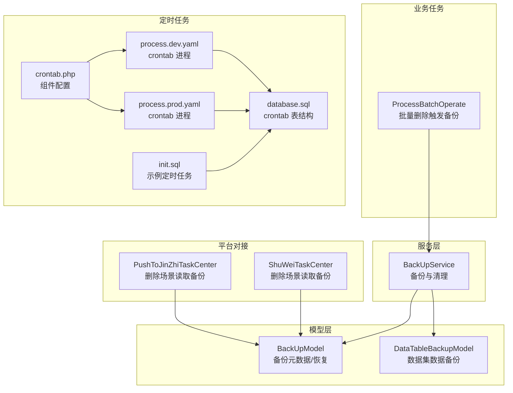
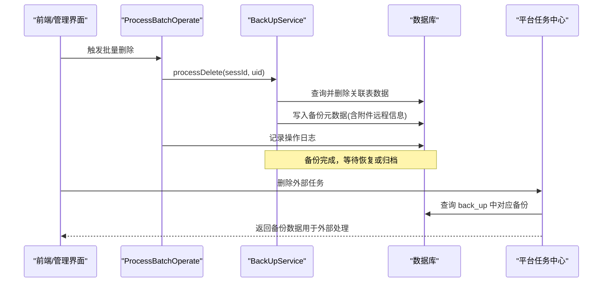
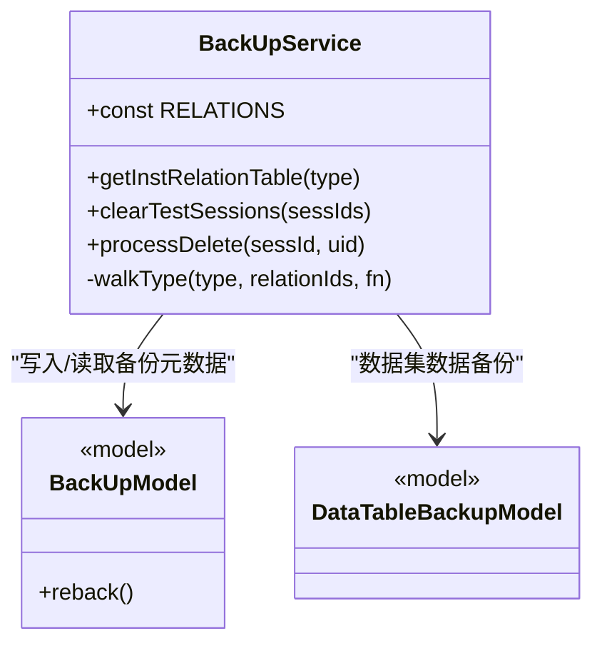
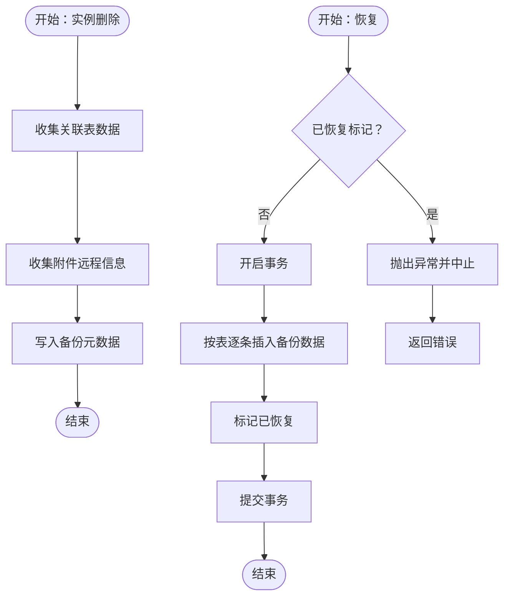
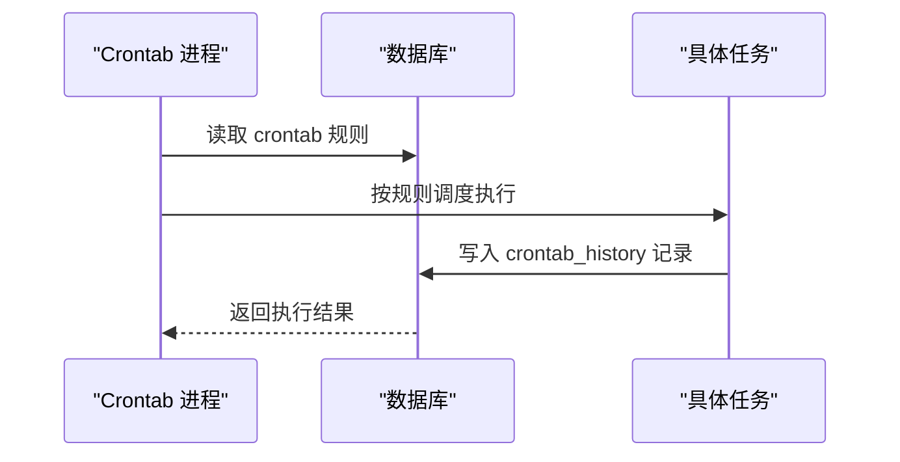
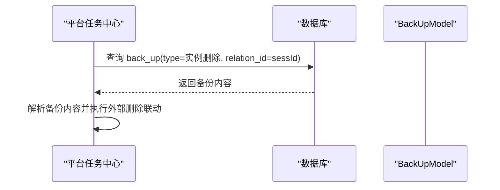
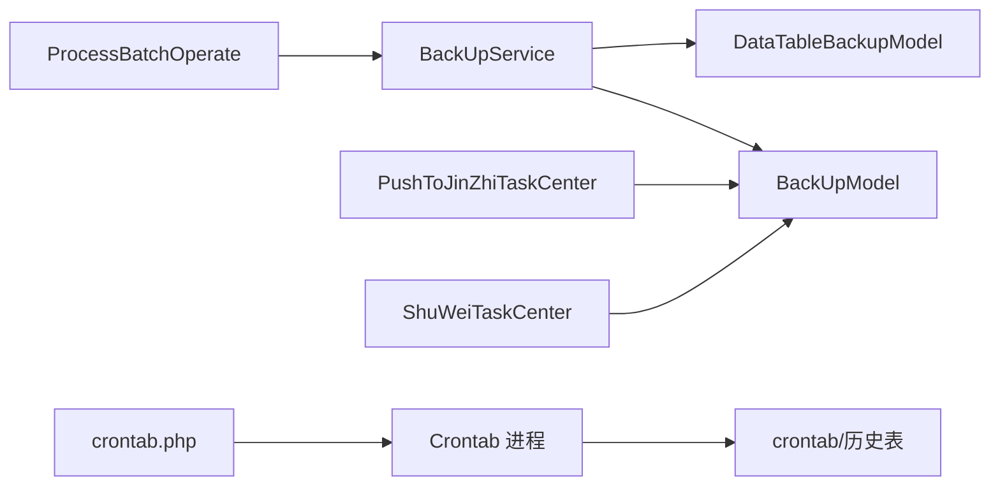

# 备份服务

<cite>
**本文引用的文件**
- [BackUpService.php](file://process/src/services/BackUpService.php)
- [BackUpModel.php](file://process/src/models/BackUpModel.php)
- [DataTableBackupModel.php](file://process/src/models/DataTableBackupModel.php)
- [ProcessBatchOperate.php](file://process/src/services/task/ProcessBatchOperate.php)
- [PushToJinZhiTaskCenter.php](file://process/src/services/task/PushToJinZhiTaskCenter.php)
- [ShuWeiTaskCenter.php](file://process/src/services/platform/ShuWeiTaskCenter.php)
- [crontab.php](file://process/src/config/crontab.php)
- [process.dev.yaml](file://process/src/config/process.dev.yaml)
- [process.prod.yaml](file://process/src/config/process.prod.yaml)
- [database.sql](file://process/docs/sql/database.sql)
- [init.sql](file://process/docs/sql/init.sql)
</cite>

## 目录
1. [简介](#简介)
2. [项目结构](#项目结构)
3. [核心组件](#核心组件)
4. [架构总览](#架构总览)
5. [详细组件分析](#详细组件分析)
6. [依赖关系分析](#依赖关系分析)
7. [性能考虑](#性能考虑)
8. [故障排查指南](#故障排查指南)
9. [结论](#结论)
10. [附录](#附录)

## 简介
本文件面向 htdNew 项目的备份服务，围绕 BackUpService 的设计原理、备份策略与数据恢复机制进行系统化说明。重点覆盖以下方面：
- 备份核心功能：实例删除时的全量备份、备份数据管理与恢复流程
- 备份策略：全量备份与差异/增量备份的现状与扩展建议
- 数据恢复：事务化恢复、幂等性与完整性校验
- 备份任务调度：基于定时任务框架的执行与监控
- 存储与版本：备份数据的持久化与版本控制思路
- 监控告警与故障恢复：日志、异常处理与恢复验证
- 压缩加密：当前未实现，提供落地建议

## 项目结构
备份服务相关代码主要分布在以下模块：
- 服务层：BackUpService 提供备份与清理逻辑
- 模型层：BackUpModel 负责备份元数据与恢复；DataTableBackupModel 支持数据集数据备份
- 业务任务：ProcessBatchOperate 在批量删除流程中触发备份
- 平台对接：多个平台任务中心在删除场景下查询备份数据
- 定时任务：crontab 配置与进程配置支撑周期性任务执行

**图表来源**
- [BackUpService.php](file://process/src/services/BackUpService.php#L1-L128)
- [BackUpModel.php](file://process/src/models/BackUpModel.php#L1-L77)
- [DataTableBackupModel.php](file://process/src/models/DataTableBackupModel.php#L1-L24)
- [ProcessBatchOperate.php](file://process/src/services/task/ProcessBatchOperate.php#L1-L200)
- [PushToJinZhiTaskCenter.php](file://process/src/services/task/PushToJinZhiTaskCenter.php#L207-L236)
- [ShuWeiTaskCenter.php](file://process/src/services/platform/ShuWeiTaskCenter.php#L1127-L1160)
- [crontab.php](file://process/src/config/crontab.php#L1-L10)
- [process.dev.yaml](file://process/src/config/process.dev.yaml#L63-L70)
- [process.prod.yaml](file://process/src/config/process.prod.yaml#L65-L72)
- [database.sql](file://process/docs/sql/database.sql#L426-L454)
- [init.sql](file://process/docs/sql/init.sql#L0-L1)

**章节来源**
- [BackUpService.php](file://process/src/services/BackUpService.php#L1-L128)
- [BackUpModel.php](file://process/src/models/BackUpModel.php#L1-L77)
- [DataTableBackupModel.php](file://process/src/models/DataTableBackupModel.php#L1-L24)
- [ProcessBatchOperate.php](file://process/src/services/task/ProcessBatchOperate.php#L1-L200)
- [PushToJinZhiTaskCenter.php](file://process/src/services/task/PushToJinZhiTaskCenter.php#L207-L236)
- [ShuWeiTaskCenter.php](file://process/src/services/platform/ShuWeiTaskCenter.php#L1127-L1160)
- [crontab.php](file://process/src/config/crontab.php#L1-L10)
- [process.dev.yaml](file://process/src/config/process.dev.yaml#L63-L70)
- [process.prod.yaml](file://process/src/config/process.prod.yaml#L65-L72)
- [database.sql](file://process/docs/sql/database.sql#L426-L454)
- [init.sql](file://process/docs/sql/init.sql#L0-L1)

## 核心组件
- BackUpService：提供实例删除备份、测试会话清理、遍历关联表删除与备份数据收集
- BackUpModel：备份元数据模型，支持恢复流程与状态标记
- DataTableBackupModel：数据集数据备份模型，用于数据集层面的备份
- ProcessBatchOperate：批量删除流程中调用备份服务并记录操作日志
- 平台任务中心：在删除场景下查询备份数据，用于外部系统联动

关键职责与行为：
- 实例删除备份：收集关联表数据，写入备份表，保留附件远程信息以便后续恢复
- 测试会话清理：通过事件分发与遍历删除，确保测试环境数据隔离
- 恢复流程：按备份内容逐表插入，设置恢复标记，事务化保证一致性

**章节来源**
- [BackUpService.php](file://process/src/services/BackUpService.php#L1-L128)
- [BackUpModel.php](file://process/src/models/BackUpModel.php#L1-L77)
- [DataTableBackupModel.php](file://process/src/models/DataTableBackupModel.php#L1-L24)
- [ProcessBatchOperate.php](file://process/src/services/task/ProcessBatchOperate.php#L1-L200)

## 架构总览
备份服务采用“服务-模型-任务-平台”的分层架构：
- 服务层负责业务语义与数据收集
- 模型层负责持久化与恢复
- 任务层触发备份动作并记录审计
- 平台层在外部系统删除时读取备份数据

**图表来源**
- [ProcessBatchOperate.php](file://process/src/services/task/ProcessBatchOperate.php#L66-L104)
- [BackUpService.php](file://process/src/services/BackUpService.php#L98-L128)
- [BackUpModel.php](file://process/src/models/BackUpModel.php#L46-L77)
- [PushToJinZhiTaskCenter.php](file://process/src/services/task/PushToJinZhiTaskCenter.php#L207-L236)
- [ShuWeiTaskCenter.php](file://process/src/services/platform/ShuWeiTaskCenter.php#L1127-L1160)

## 详细组件分析

### BackUpService 组件分析
BackUpService 是备份的核心，负责：
- 关联表配置：定义实例删除时需要清理与备份的表集合
- 清理与备份：遍历配置表，删除并收集数据，写入备份元数据
- 测试会话清理：通过事件分发与遍历删除，确保测试数据隔离
- 备份数据管理：默认保留附件远程信息，便于恢复时重建附件

**图表来源**
- [BackUpService.php](file://process/src/services/BackUpService.php#L1-L128)
- [BackUpModel.php](file://process/src/models/BackUpModel.php#L1-L77)
- [DataTableBackupModel.php](file://process/src/models/DataTableBackupModel.php#L1-L24)

**章节来源**
- [BackUpService.php](file://process/src/services/BackUpService.php#L1-L128)

### 备份策略与数据恢复机制
- 全量备份：当前实现为“实例删除即全量备份”，备份所有关联表数据与附件远程信息，恢复时逐表插入
- 差异/增量备份：当前未实现，建议在现有基础上扩展“自上次备份以来变更”的增量采集与合并策略
- 恢复流程：事务化恢复，幂等保护（防止重复恢复），恢复后标记状态

**图表来源**
- [BackUpService.php](file://process/src/services/BackUpService.php#L98-L128)
- [BackUpModel.php](file://process/src/models/BackUpModel.php#L46-L77)

**章节来源**
- [BackUpService.php](file://process/src/services/BackUpService.php#L98-L128)
- [BackUpModel.php](file://process/src/models/BackUpModel.php#L46-L77)

### 备份任务调度与监控
- 定时任务配置：通过 crontab.php 合并组件，process.dev.yaml/process.prod.yaml 指定 crontab 进程类与配置文件
- 表结构：database.sql 定义 crontab 与 crontab_history 表，init.sql 提供示例定时任务
- 执行与历史：crontab 进程根据规则调度任务，历史记录保存执行结果

**图表来源**
- [crontab.php](file://process/src/config/crontab.php#L1-L10)
- [process.dev.yaml](file://process/src/config/process.dev.yaml#L63-L70)
- [process.prod.yaml](file://process/src/config/process.prod.yaml#L65-L72)
- [database.sql](file://process/docs/sql/database.sql#L426-L454)
- [init.sql](file://process/docs/sql/init.sql#L0-L1)

**章节来源**
- [crontab.php](file://process/src/config/crontab.php#L1-L10)
- [process.dev.yaml](file://process/src/config/process.dev.yaml#L63-L70)
- [process.prod.yaml](file://process/src/config/process.prod.yaml#L65-L72)
- [database.sql](file://process/docs/sql/database.sql#L426-L454)
- [init.sql](file://process/docs/sql/init.sql#L0-L1)

### 平台对接与外部删除场景
平台任务中心在删除外部任务时，会查询 back_up 中对应实例的备份数据，用于外部系统的联动处理。

**图表来源**
- [PushToJinZhiTaskCenter.php](file://process/src/services/task/PushToJinZhiTaskCenter.php#L207-L236)
- [ShuWeiTaskCenter.php](file://process/src/services/platform/ShuWeiTaskCenter.php#L1127-L1160)
- [BackUpModel.php](file://process/src/models/BackUpModel.php#L1-L77)

**章节来源**
- [PushToJinZhiTaskCenter.php](file://process/src/services/task/PushToJinZhiTaskCenter.php#L207-L236)
- [ShuWeiTaskCenter.php](file://process/src/services/platform/ShuWeiTaskCenter.php#L1127-L1160)
- [BackUpModel.php](file://process/src/models/BackUpModel.php#L1-L77)

## 依赖关系分析
- 服务到模型：BackUpService 依赖各业务模型进行数据收集与删除；BackUpModel 负责备份元数据与恢复
- 任务到服务：ProcessBatchOperate 在批量删除时调用 BackUpService
- 平台到模型：平台任务中心直接查询 BackUpModel 获取备份数据
- 定时到服务：crontab 进程加载组件配置，调度具体任务

**图表来源**
- [ProcessBatchOperate.php](file://process/src/services/task/ProcessBatchOperate.php#L1-L200)
- [BackUpService.php](file://process/src/services/BackUpService.php#L1-L128)
- [BackUpModel.php](file://process/src/models/BackUpModel.php#L1-L77)
- [DataTableBackupModel.php](file://process/src/models/DataTableBackupModel.php#L1-L24)
- [PushToJinZhiTaskCenter.php](file://process/src/services/task/PushToJinZhiTaskCenter.php#L207-L236)
- [ShuWeiTaskCenter.php](file://process/src/services/platform/ShuWeiTaskCenter.php#L1127-L1160)
- [crontab.php](file://process/src/config/crontab.php#L1-L10)
- [process.dev.yaml](file://process/src/config/process.dev.yaml#L63-L70)
- [process.prod.yaml](file://process/src/config/process.prod.yaml#L65-L72)
- [database.sql](file://process/docs/sql/database.sql#L426-L454)

**章节来源**
- [ProcessBatchOperate.php](file://process/src/services/task/ProcessBatchOperate.php#L1-L200)
- [BackUpService.php](file://process/src/services/BackUpService.php#L1-L128)
- [BackUpModel.php](file://process/src/models/BackUpModel.php#L1-L77)
- [DataTableBackupModel.php](file://process/src/models/DataTableBackupModel.php#L1-L24)
- [PushToJinZhiTaskCenter.php](file://process/src/services/task/PushToJinZhiTaskCenter.php#L207-L236)
- [ShuWeiTaskCenter.php](file://process/src/services/platform/ShuWeiTaskCenter.php#L1127-L1160)
- [crontab.php](file://process/src/config/crontab.php#L1-L10)
- [process.dev.yaml](file://process/src/config/process.dev.yaml#L63-L70)
- [process.prod.yaml](file://process/src/config/process.prod.yaml#L65-L72)
- [database.sql](file://process/docs/sql/database.sql#L426-L454)

## 性能考虑
- 批量删除时的遍历与写入：建议对大表分批处理，避免长事务锁表
- JSON 备份体积：备份内容为 JSON，建议在入库前进行压缩（见“附录”建议）
- 附件远程信息：备份时已收集远程文件映射，恢复时可减少二次扫描成本
- 恢复幂等：is_reback 标记避免重复恢复导致的重复写入

[本节为通用指导，无需列出具体文件来源]

## 故障排查指南
- 恢复异常：BackUpModel::reback 在事务中执行，若失败会回滚并抛出异常，检查备份内容结构与目标表字段映射
- 重复恢复：若 is_reback 已标记为已恢复，再次恢复将抛出异常
- 外部系统联动：平台任务中心在删除外部任务前应先查询备份，确认存在后再执行删除
- 日志与审计：批量删除流程会记录操作日志，便于定位问题

**章节来源**
- [BackUpModel.php](file://process/src/models/BackUpModel.php#L46-L77)
- [ProcessBatchOperate.php](file://process/src/services/task/ProcessBatchOperate.php#L66-L104)
- [PushToJinZhiTaskCenter.php](file://process/src/services/task/PushToJinZhiTaskCenter.php#L207-L236)
- [ShuWeiTaskCenter.php](file://process/src/services/platform/ShuWeiTaskCenter.php#L1127-L1160)

## 结论
当前备份服务实现了“实例删除即全量备份”的核心能力，具备完善的备份数据收集、事务化恢复与幂等保护。对于增量/差异备份、压缩加密与版本控制，可在现有架构上平滑扩展。结合定时任务框架，可进一步完善周期性备份与监控告警体系。

[本节为总结性内容，无需列出具体文件来源]

## 附录

### 备份策略扩展建议
- 增量/差异备份：基于时间戳或变更日志，仅备份自上次备份以来的变更，降低存储与传输成本
- 压缩与加密：对备份 JSON 进行压缩与加密，提升安全性与传输效率
- 版本控制：引入备份版本号与过期策略，定期清理旧版本，保留最近 N 个版本

[本节为概念性建议，无需列出具体文件来源]

### 监控告警与数据完整性验证
- 监控：利用 crontab 进程与历史表记录，监控备份任务执行状态与耗时
- 告警：对恢复失败、重复恢复、备份缺失等情况触发告警
- 完整性验证：恢复后对关键表计数与关键字段进行抽样校验，确保数据一致

[本节为通用指导，无需列出具体文件来源]