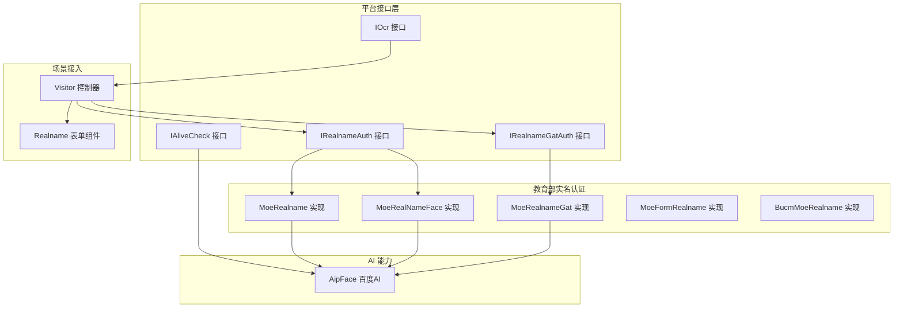
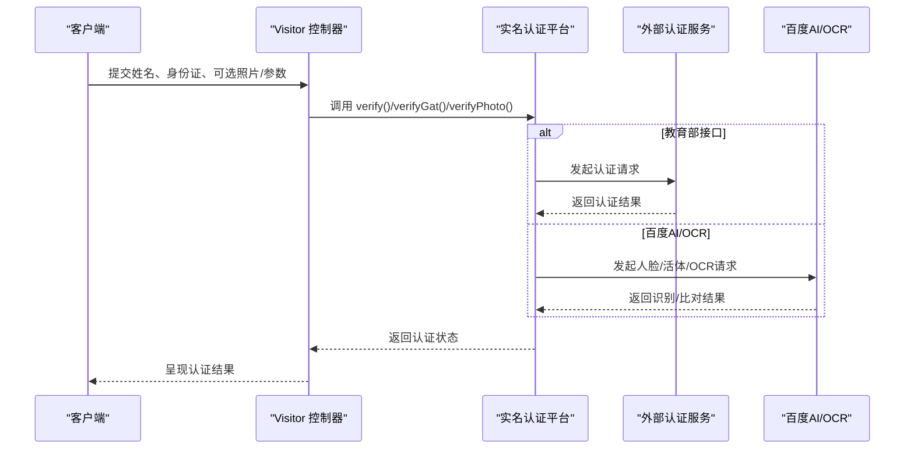
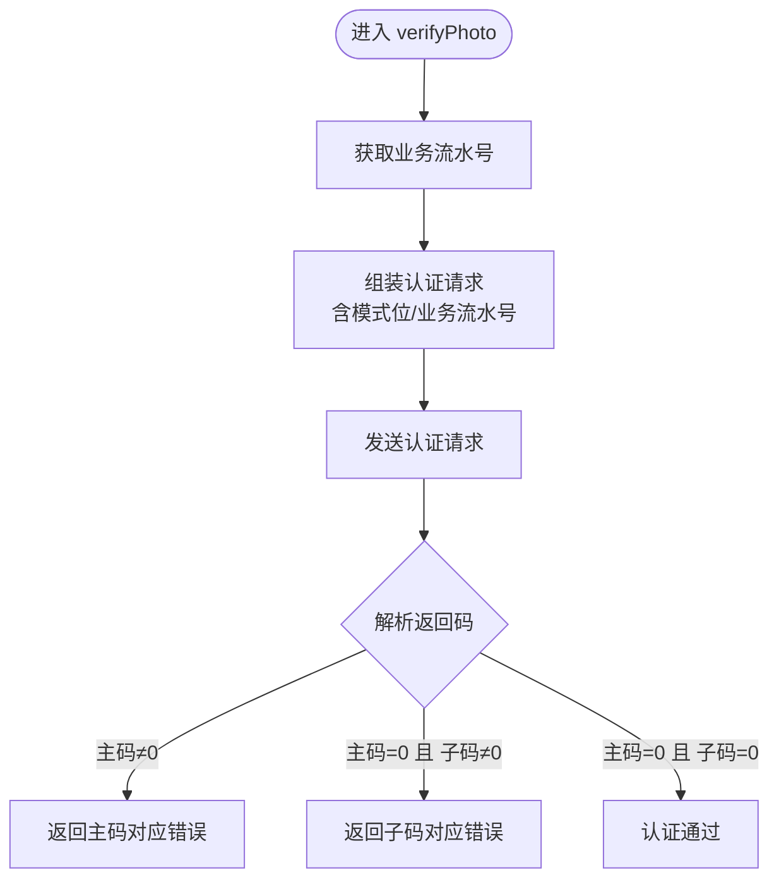
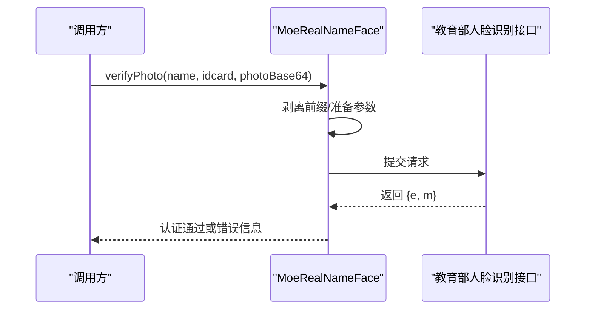
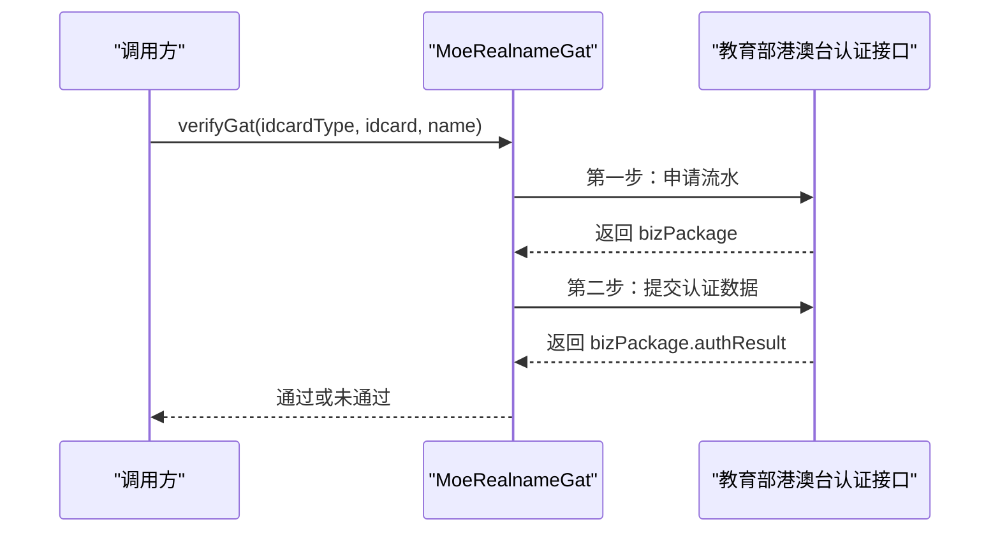
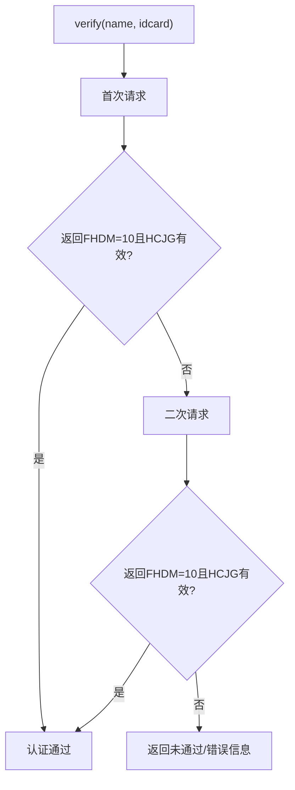
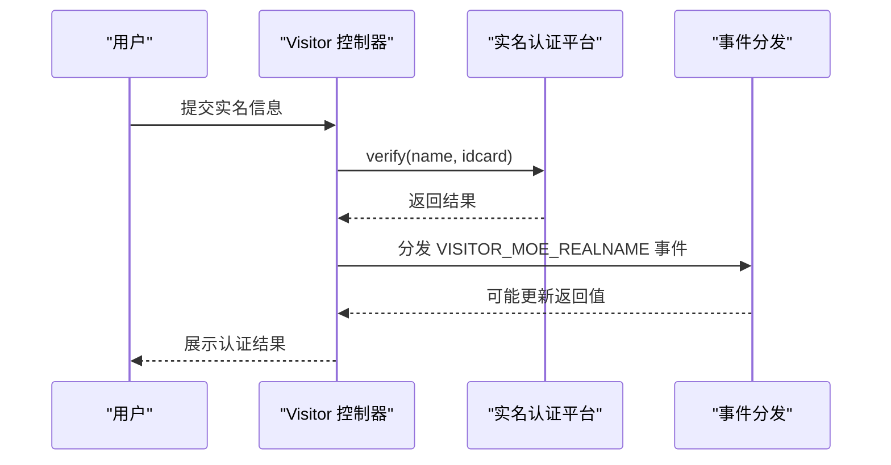
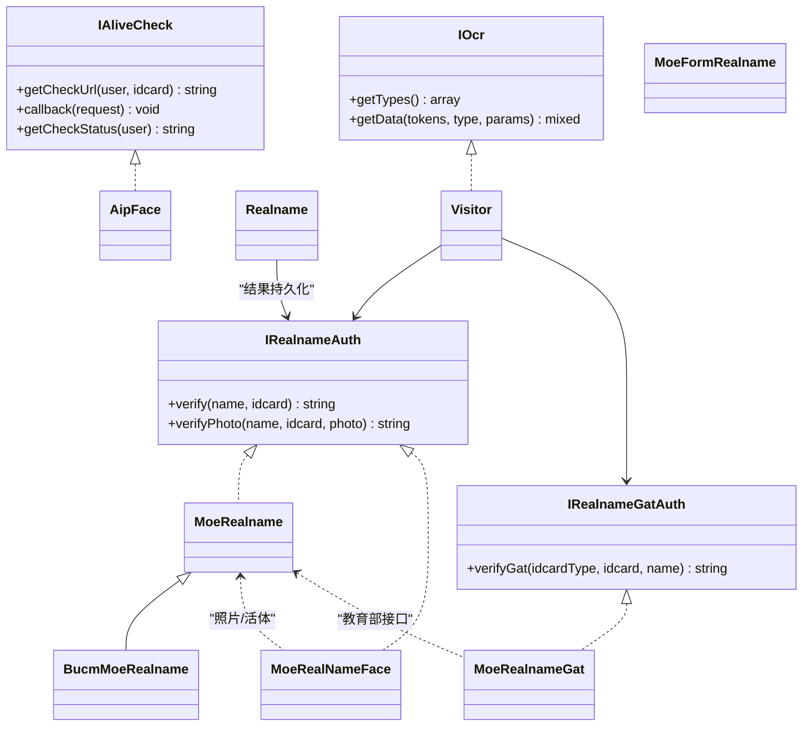

# 实名认证服务

<cite>
**本文引用的文件**
- [IRealnameAuth.php](file://process/src/services/platform/IRealnameAuth.php)
- [IRealnameGatAuth.php](file://process/src/services/platform/IRealnameGatAuth.php)
- [IAliveCheck.php](file://process/src/services/platform/IAliveCheck.php)
- [IOcr.php](file://process/src/services/platform/IOcr.php)
- [MoeRealname.php](file://process/src/services/platform/MoeRealname.php)
- [MoeRealNameFace.php](file://process/src/services/platform/MoeRealNameFace.php)
- [MoeRealnameGat.php](file://process/src/services/platform/MoeRealnameGat.php)
- [BucmMoeRealname.php](file://process/src/services/platform/BucmMoeRealname.php)
- [MoeFormRealname.php](file://process/src/services/platform/MoeFormRealname.php)
- [AipFace.php](file://process/src/lib/aip/AipFace.php)
- [Realname.php](file://process/src/modules/form/components/Realname.php)
- [Visitor.php](file://process_envs/cuc/product/http/api/Visitor.php)
- [Visitor.php（测试）](file://process_envs/cuc/test/http/api/Visitor.php)
- [ComplianceModel.php](file://process/src/models/ComplianceModel.php)
</cite>

## 目录
1. [引言](#引言)
2. [项目结构](#项目结构)
3. [核心组件](#核心组件)
4. [架构总览](#架构总览)
5. [详细组件分析](#详细组件分析)
6. [依赖关系分析](#依赖关系分析)
7. [性能考虑](#性能考虑)
8. [故障排查指南](#故障排查指南)
9. [结论](#结论)
10. [附录](#附录)

## 引言
本文件面向 htdNew 项目的实名认证服务，系统性梳理实名认证架构、OCR 识别技术与多地区认证支持，重点对比教育部实名认证、港澳台实名认证以及高校表单实名认证的实现差异；阐述 OCR 识别流程、人脸比对与活体检测机制；给出认证数据的隐私保护、数据脱敏与合规要求；并提供准确率优化、多模态识别与异常处理建议。

## 项目结构
实名认证相关代码主要分布在以下位置：
- 平台接口与实现：process/src/services/platform 下的接口与具体实现类
- 百度 AI 能力封装：process/src/lib/aip/AipFace.php
- 表单组件与事件：process/src/modules/form/components/Realname.php
- 场景接入与规则：process_envs/*/product/http/api/Visitor.php
- 合规模型：process/src/models/ComplianceModel.php

图示来源
- [IRealnameAuth.php](file://process/src/services/platform/IRealnameAuth.php#L1-L22)
- [IRealnameGatAuth.php](file://process/src/services/platform/IRealnameGatAuth.php#L1-L14)
- [IAliveCheck.php](file://process/src/services/platform/IAliveCheck.php#L1-L14)
- [IOcr.php](file://process/src/services/platform/IOcr.php#L1-L14)
- [MoeRealname.php](file://process/src/services/platform/MoeRealname.php#L1-L175)
- [MoeRealNameFace.php](file://process/src/services/platform/MoeRealNameFace.php#L1-L73)
- [MoeRealnameGat.php](file://process/src/services/platform/MoeRealnameGat.php#L1-L112)
- [BucmMoeRealname.php](file://process/src/services/platform/BucmMoeRealname.php#L1-L78)
- [MoeFormRealname.php](file://process/src/services/platform/MoeFormRealname.php#L152-L177)
- [AipFace.php](file://process/src/lib/aip/AipFace.php#L125-L649)
- [Realname.php](file://process/src/modules/form/components/Realname.php#L1-L67)
- [Visitor.php](file://process_envs/cuc/product/http/api/Visitor.php#L238-L270)

章节来源
- [IRealnameAuth.php](file://process/src/services/platform/IRealnameAuth.php#L1-L22)
- [IRealnameGatAuth.php](file://process/src/services/platform/IRealnameGatAuth.php#L1-L14)
- [MoeRealname.php](file://process/src/services/platform/MoeRealname.php#L1-L175)
- [MoeRealNameFace.php](file://process/src/services/platform/MoeRealNameFace.php#L1-L73)
- [MoeRealnameGat.php](file://process/src/services/platform/MoeRealnameGat.php#L1-L112)
- [BucmMoeRealname.php](file://process/src/services/platform/BucmMoeRealname.php#L1-L78)
- [AipFace.php](file://process/src/lib/aip/AipFace.php#L125-L649)
- [Realname.php](file://process/src/modules/form/components/Realname.php#L1-L67)
- [Visitor.php](file://process_envs/cuc/product/http/api/Visitor.php#L238-L270)

## 核心组件
- IRealnameAuth：定义“姓名+身份证”与“姓名+身份证+照片”的实名认证接口契约
- IRealnameGatAuth：定义港澳台实名认证接口契约
- IAliveCheck：定义人脸活体检测的检查、回调与状态查询接口
- IOcr：定义 OCR 数据获取的类型与参数约定
- MoeRealname：教育部实名认证（含照片比对与活体）
- MoeRealNameFace：教育部人脸识别（仅照片级校验）
- MoeRealnameGat：教育部港澳台实名认证
- BucmMoeRealname：教育部通用24小时实名认证（带重试逻辑）
- MoeFormRealname：表单三要素（姓名+身份证+手机号）认证
- AipFace：百度人脸/活体/比对等能力封装
- Realname 表单组件：表单中实名认证结果的展示与检索规则
- Visitor 控制器：根据配置选择平台并触发实名认证流程

章节来源
- [IRealnameAuth.php](file://process/src/services/platform/IRealnameAuth.php#L1-L22)
- [IRealnameGatAuth.php](file://process/src/services/platform/IRealnameGatAuth.php#L1-L14)
- [IAliveCheck.php](file://process/src/services/platform/IAliveCheck.php#L1-L14)
- [IOcr.php](file://process/src/services/platform/IOcr.php#L1-L14)
- [MoeRealname.php](file://process/src/services/platform/MoeRealname.php#L1-L175)
- [MoeRealNameFace.php](file://process/src/services/platform/MoeRealNameFace.php#L1-L73)
- [MoeRealnameGat.php](file://process/src/services/platform/MoeRealnameGat.php#L1-L112)
- [BucmMoeRealname.php](file://process/src/services/platform/BucmMoeRealname.php#L1-L78)
- [MoeFormRealname.php](file://process/src/services/platform/MoeFormRealname.php#L152-L177)
- [AipFace.php](file://process/src/lib/aip/AipFace.php#L125-L649)
- [Realname.php](file://process/src/modules/form/components/Realname.php#L1-L67)
- [Visitor.php](file://process_envs/cuc/product/http/api/Visitor.php#L238-L270)

## 架构总览
实名认证整体流程分为“接口层—平台实现—外部服务—场景接入”四个层次：
- 接口层：定义统一认证契约（姓名+身份证、港澳台、人脸活体、OCR）
- 平台实现：针对教育部、高校等不同来源的具体实现
- 外部服务：教育部接口、百度AI能力、第三方OCR
- 场景接入：控制器按配置选择平台并触发认证，结合表单组件与合规策略

图示来源
- [Visitor.php](file://process_envs/cuc/product/http/api/Visitor.php#L238-L270)
- [MoeRealname.php](file://process/src/services/platform/MoeRealname.php#L1-L175)
- [MoeRealNameFace.php](file://process/src/services/platform/MoeRealNameFace.php#L1-L73)
- [MoeRealnameGat.php](file://process/src/services/platform/MoeRealnameGat.php#L1-L112)
- [AipFace.php](file://process/src/lib/aip/AipFace.php#L125-L649)

## 详细组件分析

### 教育部实名认证（MoeRealname）
- 功能要点
  - “姓名+身份证”纯文本认证与“姓名+身份证+照片”的活体比对认证
  - 先申请业务流水号，再发起认证，最后解析返回码
  - 对返回码进行细粒度映射，区分“主流程”和“照片/活体”子项
- 关键流程
  - 获取业务流水号
  - 组装认证请求（含模式位）
  - 解析 bizPackage 中的 authResult 主/子码
- 错误处理
  - 主码非通过：直接返回错误描述
  - 子码非通过：映射到具体提示（如照片清晰度、格式、质量、建模失败等）

图示来源
- [MoeRealname.php](file://process/src/services/platform/MoeRealname.php#L1-L175)

章节来源
- [MoeRealname.php](file://process/src/services/platform/MoeRealname.php#L1-L175)

### 教育部人脸识别（MoeRealNameFace）
- 功能要点
  - 仅支持“姓名+身份证+照片”校验
  - 将 base64 照片剥离前缀后提交
  - 对返回码 e 进行判定，失败时返回 m 或兜底提示
- 适用场景
  - 仅需照片级一致性校验，无需活体

图示来源
- [MoeRealNameFace.php](file://process/src/services/platform/MoeRealNameFace.php#L1-L73)

章节来源
- [MoeRealNameFace.php](file://process/src/services/platform/MoeRealNameFace.php#L1-L73)

### 教育部港澳台实名认证（MoeRealnameGat）
- 功能要点
  - 两步式流程：申请流水 → 提交认证数据
  - 支持多种证件类型映射（港澳居民来往内地通行证、台湾居民来往大陆通行证、外国人永久居留身份证）
  - 返回 bizPackage.authResult[0] 判定是否通过
- 适用场景
  - 针对港澳台及特定国际证件的实名认证

图示来源
- [MoeRealnameGat.php](file://process/src/services/platform/MoeRealnameGat.php#L1-L112)

章节来源
- [MoeRealnameGat.php](file://process/src/services/platform/MoeRealnameGat.php#L1-L112)

### 教育部通用24小时实名认证（BucmMoeRealname）
- 功能要点
  - 在 MoeRealname 基础上增加重试逻辑：首次失败自动重试一次
  - 返回原始响应或“未通过”提示
- 适用场景
  - 对稳定性要求更高的环境（如部分高校）

图示来源
- [BucmMoeRealname.php](file://process/src/services/platform/BucmMoeRealname.php#L1-L78)

章节来源
- [BucmMoeRealname.php](file://process/src/services/platform/BucmMoeRealname.php#L1-L78)

### 表单三要素实名认证（MoeFormRealname）
- 功能要点
  - 验证“姓名+身份证+手机号”三要素
  - 通过中心化接口返回码判定
- 适用场景
  - 表单流程中的快速三要素校验

章节来源
- [MoeFormRealname.php](file://process/src/services/platform/MoeFormRealname.php#L152-L177)

### 百度 AI 能力（AipFace）
- 能力范围
  - 人脸检测、活体检测（在线图片/视频）、人脸比对、人脸库管理、人脸编辑/关键点等
- 在实名认证中的应用
  - 活体检测：在线图片活体 V4、视频活体检测
  - 人脸比对：基于身份证信息与照片进行比对
- 使用建议
  - 结合 MoeRealname 的照片/活体流程，使用活体检测接口提升安全性

章节来源
- [AipFace.php](file://process/src/lib/aip/AipFace.php#L125-L649)

### 场景接入与表单组件（Visitor + Realname）
- Visitor 控制器
  - 根据配置选择平台：先执行“姓名+身份证”认证，再按规则触发港澳台认证
  - 触发全局事件以扩展后续处理
- Realname 表单组件
  - 将认证结果持久化为 ticket，并提供检索与展示规则

图示来源
- [Visitor.php](file://process_envs/cuc/product/http/api/Visitor.php#L238-L270)
- [Realname.php](file://process/src/modules/form/components/Realname.php#L1-L67)

章节来源
- [Visitor.php](file://process_envs/cuc/product/http/api/Visitor.php#L238-L270)
- [Visitor.php（测试）](file://process_envs/cuc/test/http/api/Visitor.php#L238-L270)
- [Realname.php](file://process/src/modules/form/components/Realname.php#L1-L67)

## 依赖关系分析
- 平台实现依赖
  - MoeRealname 与 MoeRealNameFace 依赖外部教育部接口
  - MoeRealnameGat 依赖教育部港澳台认证接口
  - BucmMoeRealname 依赖 MoeRealname 并在其基础上增强重试
  - AipFace 为活体/比对提供底层能力
- 场景接入依赖
  - Visitor 控制器根据配置选择平台并触发认证
  - Realname 组件负责结果持久化与检索

图示来源
- [IRealnameAuth.php](file://process/src/services/platform/IRealnameAuth.php#L1-L22)
- [IRealnameGatAuth.php](file://process/src/services/platform/IRealnameGatAuth.php#L1-L14)
- [IAliveCheck.php](file://process/src/services/platform/IAliveCheck.php#L1-L14)
- [IOcr.php](file://process/src/services/platform/IOcr.php#L1-L14)
- [MoeRealname.php](file://process/src/services/platform/MoeRealname.php#L1-L175)
- [MoeRealNameFace.php](file://process/src/services/platform/MoeRealNameFace.php#L1-L73)
- [MoeRealnameGat.php](file://process/src/services/platform/MoeRealnameGat.php#L1-L112)
- [BucmMoeRealname.php](file://process/src/services/platform/BucmMoeRealname.php#L1-L78)
- [MoeFormRealname.php](file://process/src/services/platform/MoeFormRealname.php#L152-L177)
- [AipFace.php](file://process/src/lib/aip/AipFace.php#L125-L649)
- [Realname.php](file://process/src/modules/form/components/Realname.php#L1-L67)

## 性能考虑
- 请求重试
  - BucmMoeRealname 已内置一次重试，可降低偶发网络抖动导致的失败率
- 流水号复用
  - MoeRealname 先申请业务流水号再发起认证，避免重复申请开销
- 图像预处理
  - 建议在前端对照片进行压缩与格式标准化，减少传输体积与后端解码成本
- 并发与限流
  - 对外部接口调用增加并发控制与熔断策略，防止雪崩
- 缓存与去重
  - 对高频查询结果进行短期缓存，避免重复认证

## 故障排查指南
- 常见错误码定位
  - 主码非 0：直接返回错误描述
  - 子码非 0：根据子码映射定位问题（照片清晰度、格式、质量、建模失败、超时等）
- 日志与可观测性
  - 记录请求 URL、参数（去除敏感字段）、响应体与异常栈
  - 对外部接口调用增加超时与重试策略
- 事件扩展
  - Visitor 在认证后分发全局事件，可在事件监听器中补充审计日志与二次处理

章节来源
- [MoeRealname.php](file://process/src/services/platform/MoeRealname.php#L1-L175)
- [BucmMoeRealname.php](file://process/src/services/platform/BucmMoeRealname.php#L1-L78)
- [Visitor.php](file://process_envs/cuc/product/http/api/Visitor.php#L238-L270)

## 结论
htdNew 的实名认证体系以接口契约为核心，围绕教育部与高校场景提供了多实现路径：文本认证、照片+活体认证、人脸识别、港澳台认证与表单三要素认证。通过百度 AI 能力强化活体与比对，结合 Visitor 控制器与表单组件形成闭环。建议在生产环境中启用重试、限流与缓存策略，并完善日志与事件扩展以满足合规与可观测性需求。

## 附录

### 多地区与多模态支持
- 地区差异
  - 教育部通用认证：适用于全国范围
  - 港澳台认证：独立接口与证件类型映射
  - 高校定制：通过 BucmMoeRealname 等实现增强稳定性
- 多模态识别
  - 文本认证：姓名+身份证
  - 照片认证：姓名+身份证+照片
  - 活体检测：结合百度 AI 的在线图片/视频活体接口

章节来源
- [MoeRealname.php](file://process/src/services/platform/MoeRealname.php#L1-L175)
- [MoeRealNameFace.php](file://process/src/services/platform/MoeRealNameFace.php#L1-L73)
- [MoeRealnameGat.php](file://process/src/services/platform/MoeRealnameGat.php#L1-L112)
- [BucmMoeRealname.php](file://process/src/services/platform/BucmMoeRealname.php#L1-L78)
- [AipFace.php](file://process/src/lib/aip/AipFace.php#L125-L649)

### 隐私保护与合规
- 数据最小化
  - 仅在必要时采集与传输姓名、身份证、照片等敏感信息
- 数据脱敏
  - 日志与存储中对敏感字段进行脱敏处理（如隐藏中间数字）
- 合规要求
  - 遵循《个人信息保护法》与学校合规策略
  - 合规模型用于记录与管理合规控件配置

章节来源
- [ComplianceModel.php](file://process/src/models/ComplianceModel.php#L1-L32)