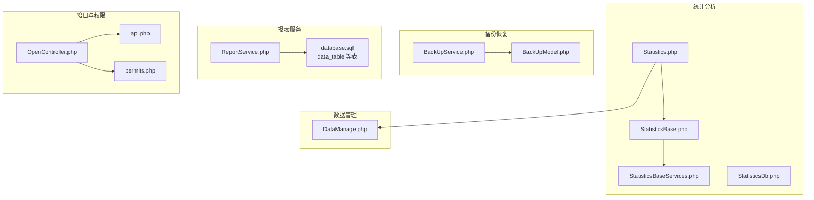
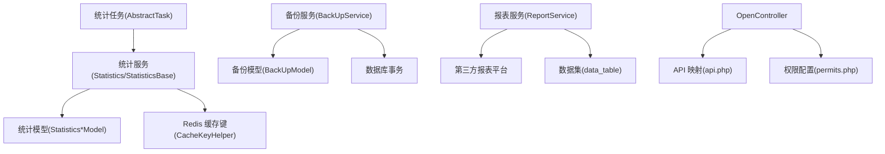
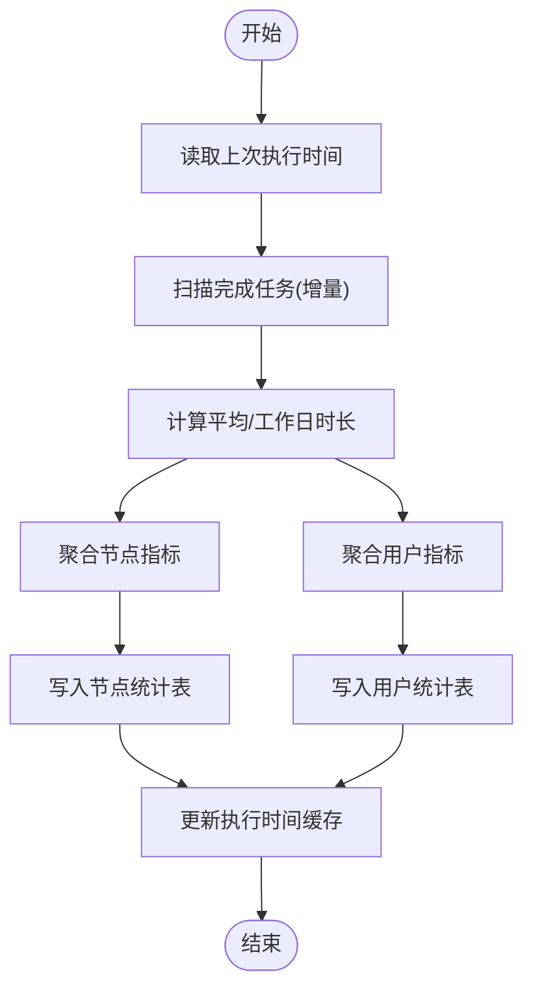
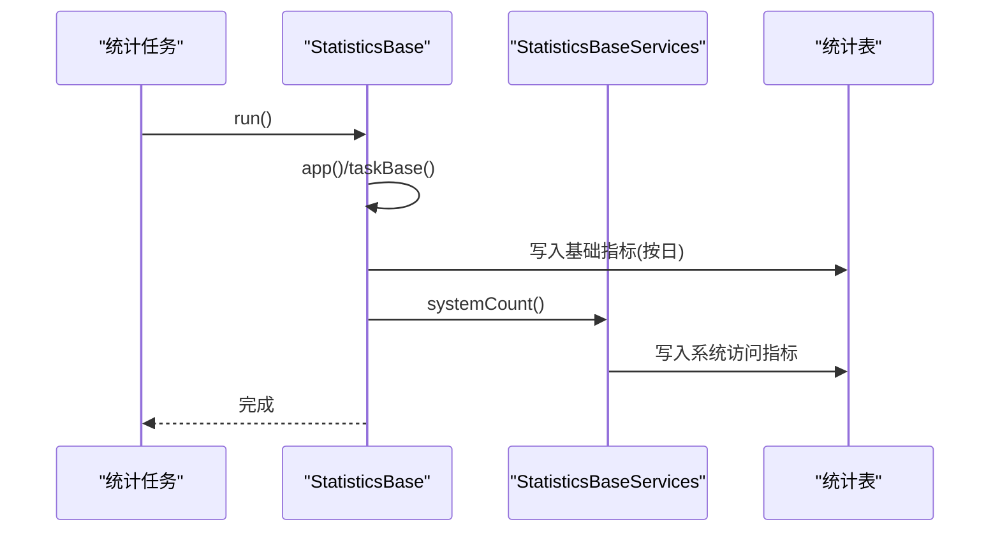
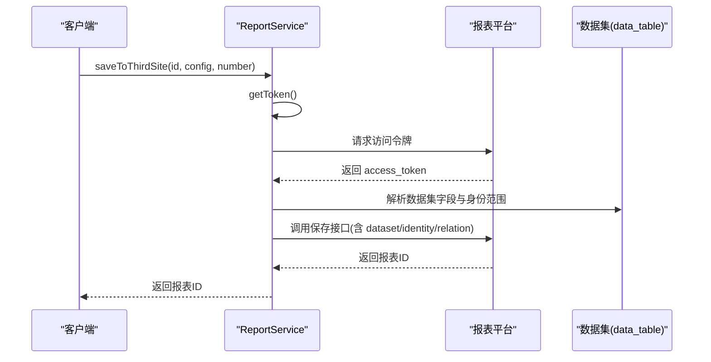
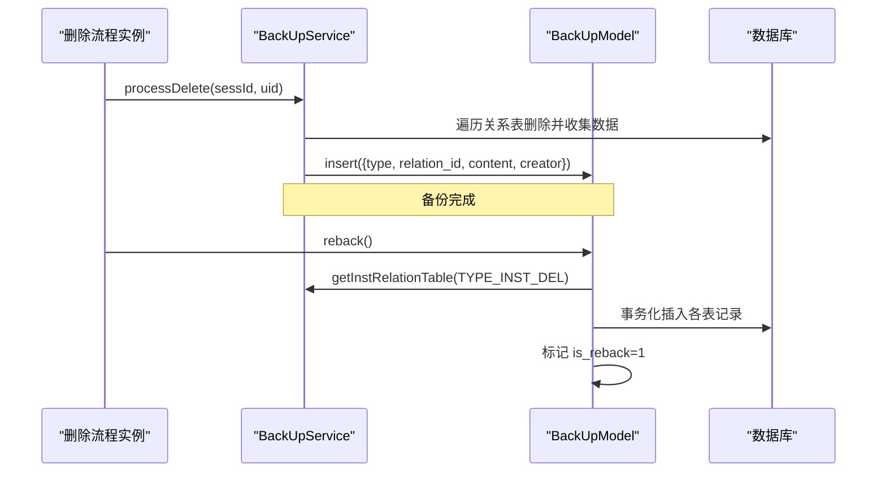
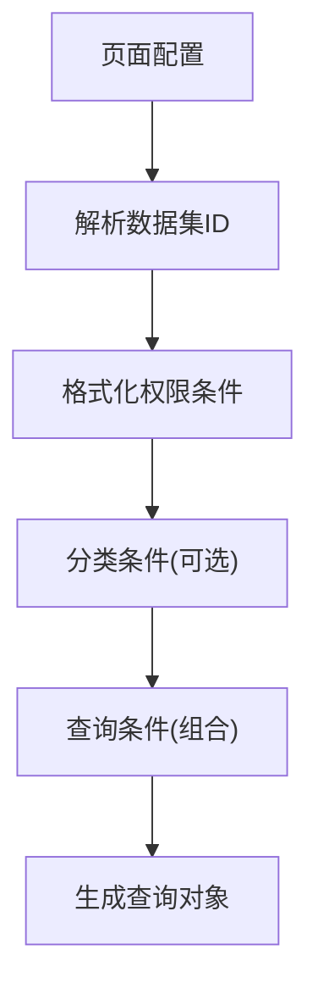
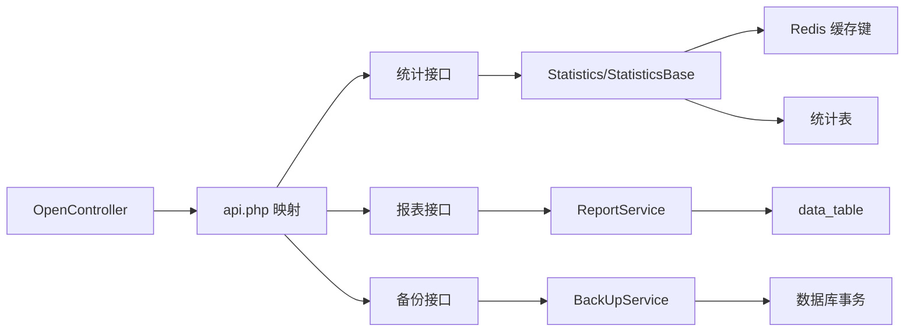

# 平台服务

<cite>
**本文引用的文件**
- [Statistics.php](file://process/src/services/Statistics.php)
- [StatisticsBase.php](file://process/src/services/StatisticsBase.php)
- [StatisticsBaseServices.php](file://process/src/services/StatisticsBaseServices.php)
- [StatisticsDb.php](file://process/src/services/StatisticsDb.php)
- [BackUpService.php](file://process/src/services/BackUpService.php)
- [BackUpModel.php](file://process/src/models/BackUpModel.php)
- [ReportService.php](file://process/src/services/ReportService.php)
- [DataManage.php](file://process/src/services/DataManage.php)
- [OpenController.php](file://process/src/http/OpenController.php)
- [api.php](file://process/src/config/api.php)
- [permits.php](file://process/src/config/permits.php)
- [database.sql](file://process/docs/sql/database.sql)
- [migration_20240716_170331_statistics.php](file://process/src/migrations/migration_20240716_170331_statistics.php)
- [migration_20241203_093730_paltform_add_classname.php](file://process/src/migrations/migration_20241203_093730_paltform_add_classname.php)
- [CommonTongji.php](file://process/src/services/platform/CommonTongji.php)
- [PushToJinZhiTaskCenter.php](file://process/src/services/task/PushToJinZhiTaskCenter.php)
</cite>

## 目录
1. [引言](#引言)
2. [项目结构](#项目结构)
3. [核心组件](#核心组件)
4. [架构总览](#架构总览)
5. [详细组件分析](#详细组件分析)
6. [依赖分析](#依赖分析)
7. [性能考虑](#性能考虑)
8. [故障排查指南](#故障排查指南)
9. [结论](#结论)
10. [附录](#附录)

## 引言
本文件面向 htdNew 项目的“平台服务”，系统化梳理平台级服务架构、统计分析与备份机制，覆盖通用统计服务、统计数据管理、报表服务与系统备份四大能力域。文档从架构、组件、数据流、接口规范、扩展机制、性能优化、监控与故障恢复等方面进行深入说明，并提供可视化图示帮助理解。

## 项目结构
平台服务主要分布在以下模块：
- 统计分析：Statistics、StatisticsBase、StatisticsBaseServices、StatisticsDb
- 备份恢复：BackUpService、BackUpModel
- 报表集成：ReportService、数据集与报表模型定义
- 数据管理：DataManage
- 接口路由：OpenController、api.php
- 权限控制：permits.php
- 数据库结构：database.sql、statistics 相关迁移脚本

图表来源
- [Statistics.php](file://process/src/services/Statistics.php#L1-L120)
- [StatisticsBase.php](file://process/src/services/StatisticsBase.php#L1-L120)
- [StatisticsBaseServices.php](file://process/src/services/StatisticsBaseServices.php#L1-L120)
- [BackUpService.php](file://process/src/services/BackUpService.php#L1-L128)
- [BackUpModel.php](file://process/src/models/BackUpModel.php#L1-L77)
- [ReportService.php](file://process/src/services/ReportService.php#L1-L120)
- [database.sql](file://process/docs/sql/database.sql#L1191-L1222)
- [OpenController.php](file://process/src/http/OpenController.php#L74-L139)
- [api.php](file://process/src/config/api.php#L770-L832)
- [permits.php](file://process/src/config/permits.php#L311-L329)

章节来源
- [OpenController.php](file://process/src/http/OpenController.php#L74-L139)
- [api.php](file://process/src/config/api.php#L770-L832)
- [permits.php](file://process/src/config/permits.php#L311-L329)

## 核心组件
- 通用统计服务：负责日志、访问、申请、任务节点与用户效率等维度的统计聚合与增量更新。
- 平台基础统计：将应用层指标汇总为平台级指标，支持按日/按月/按年分析。
- 报表服务：对接第三方报表平台，提供创建、同步、鉴权与权限统计能力。
- 备份与恢复：对流程实例删除进行全量关系表备份，并支持事务化恢复。
- 数据管理：基于页面配置与角色授权，动态生成数据查询条件与权限过滤。

章节来源
- [Statistics.php](file://process/src/services/Statistics.php#L1-L200)
- [StatisticsBase.php](file://process/src/services/StatisticsBase.php#L1-L120)
- [StatisticsBaseServices.php](file://process/src/services/StatisticsBaseServices.php#L1-L120)
- [ReportService.php](file://process/src/services/ReportService.php#L1-L120)
- [BackUpService.php](file://process/src/services/BackUpService.php#L1-L128)
- [BackUpModel.php](file://process/src/models/BackUpModel.php#L1-L77)
- [DataManage.php](file://process/src/services/DataManage.php#L1-L93)

## 架构总览
平台服务采用“任务驱动 + 模型聚合 + 外部集成”的分层架构：
- 任务层：定时或触发式统计任务，负责增量扫描与写入。
- 模型层：围绕统计数据表进行读写与聚合，提供缓存键与索引优化。
- 集成层：报表平台对接、第三方平台扩展、权限校验。
- 控制层：OpenController 将外部请求映射到具体统计/报表/备份接口。

图表来源
- [Statistics.php](file://process/src/services/Statistics.php#L1-L120)
- [StatisticsBase.php](file://process/src/services/StatisticsBase.php#L1-L120)
- [BackUpService.php](file://process/src/services/BackUpService.php#L1-L128)
- [BackUpModel.php](file://process/src/models/BackUpModel.php#L1-L77)
- [ReportService.php](file://process/src/services/ReportService.php#L1-L120)
- [database.sql](file://process/docs/sql/database.sql#L1191-L1222)
- [OpenController.php](file://process/src/http/OpenController.php#L74-L139)
- [api.php](file://process/src/config/api.php#L770-L832)
- [permits.php](file://process/src/config/permits.php#L311-L329)

## 详细组件分析

### 通用统计服务（Statistics）
职责与流程
- 周期性增量更新：基于 Redis 缓存键记录上次执行时间，仅处理增量数据。
- 访问与申请：从 Redis BitMap 与计数器中聚合 PC/Mobile 的访问与点击。
- 任务节点与用户效率：统计完成任务的时长、最大/最小耗时、工作日时长等。
- 平台级指标：计算人均申请、平均时长、催办/超时/驳回等关键指标。

关键实现要点
- 增量扫描：通过缓存键与时间窗口过滤新数据，减少全量扫描。
- 工作日时长：逐小时切片计算有效工作时长，规避节假日影响。
- 聚合写入：使用 PostgreSQL upsert 或条件更新，保证并发安全。

图表来源
- [Statistics.php](file://process/src/services/Statistics.php#L180-L320)

章节来源
- [Statistics.php](file://process/src/services/Statistics.php#L1-L200)
- [Statistics.php](file://process/src/services/Statistics.php#L200-L435)
- [Statistics.php](file://process/src/services/Statistics.php#L436-L800)

### 平台基础统计（StatisticsBase）
职责与流程
- 应用层指标到平台级指标的转换：按日将访问、申请、办结、审批等指标归档。
- 事项属性与分类：维护事项属性表，支持按部门/发布状态等维度聚合。
- 系统整体访问：从站点概览统计 PC/Mobile 点击与访问量。
- 任务节点效率：按节点维度统计完成数量与时长。

图表来源
- [StatisticsBase.php](file://process/src/services/StatisticsBase.php#L1-L120)
- [StatisticsBaseServices.php](file://process/src/services/StatisticsBaseServices.php#L1-L120)

章节来源
- [StatisticsBase.php](file://process/src/services/StatisticsBase.php#L1-L120)
- [StatisticsBase.php](file://process/src/services/StatisticsBase.php#L120-L256)
- [StatisticsBase.php](file://process/src/services/StatisticsBase.php#L257-L375)
- [StatisticsBaseServices.php](file://process/src/services/StatisticsBaseServices.php#L1-L120)
- [StatisticsBaseServices.php](file://process/src/services/StatisticsBaseServices.php#L120-L242)

### 报表服务（ReportService）
职责与流程
- 认证与鉴权：从配置读取报表平台地址、AppId、Secret；拉取/缓存访问令牌。
- 同步配置：将本地数据集与身份范围映射为第三方报表平台所需格式，创建/更新/删除报表。
- 权限统计：根据报表配置的用户/部门/岗位/标签等维度统计可见与导出人数。
- 登录跳转：生成登录到报表平台的带签名 URL，支持预览/分享/编辑场景。

图表来源
- [ReportService.php](file://process/src/services/ReportService.php#L1-L170)
- [database.sql](file://process/docs/sql/database.sql#L1191-L1222)

章节来源
- [ReportService.php](file://process/src/services/ReportService.php#L1-L120)
- [ReportService.php](file://process/src/services/ReportService.php#L120-L244)
- [ReportService.php](file://process/src/services/ReportService.php#L244-L376)
- [database.sql](file://process/docs/sql/database.sql#L1191-L1222)

### 备份与恢复（BackUpService / BackUpModel）
职责与流程
- 实例删除备份：遍历与流程实例相关的多张表，收集记录并写入备份表。
- 关系链遍历：通过预设的关系映射，按层级递推清理与恢复。
- 恢复机制：事务化写回，标记已恢复状态，防止重复恢复。

图表来源
- [BackUpService.php](file://process/src/services/BackUpService.php#L1-L128)
- [BackUpModel.php](file://process/src/models/BackUpModel.php#L1-L77)

章节来源
- [BackUpService.php](file://process/src/services/BackUpService.php#L1-L128)
- [BackUpModel.php](file://process/src/models/BackUpModel.php#L1-L77)

### 数据管理（DataManage）
职责与流程
- 页面绑定数据集：根据页面配置解析数据表 ID 与字段规则。
- 权限过滤：将用户角色映射为权限条件，结合分类筛选与远程数据规则生成最终查询。
- 绑定实例：识别字段采集规则中的会话 ID 绑定，用于跨实例联动。

图表来源
- [DataManage.php](file://process/src/services/DataManage.php#L1-L93)

章节来源
- [DataManage.php](file://process/src/services/DataManage.php#L1-L93)

## 依赖分析
- 统计服务依赖 Redis 缓存键与 PostgreSQL 统计表；通过缓存键实现增量更新。
- 备份服务依赖多模型关系映射，确保删除/恢复的完整性。
- 报表服务依赖数据集与身份配置，需与第三方平台保持配置一致。
- OpenController 通过 api.php 中的映射将外部请求路由到对应统计/报表/备份接口。
- 权限配置在 permits.php 中定义，控制报表与平台服务的访问权限。

图表来源
- [OpenController.php](file://process/src/http/OpenController.php#L74-L139)
- [api.php](file://process/src/config/api.php#L770-L832)
- [permits.php](file://process/src/config/permits.php#L311-L329)

章节来源
- [OpenController.php](file://process/src/http/OpenController.php#L74-L139)
- [api.php](file://process/src/config/api.php#L770-L832)
- [permits.php](file://process/src/config/permits.php#L311-L329)

## 性能考虑
- 增量更新：通过缓存键记录上次执行时间，仅扫描增量数据，降低全表扫描压力。
- 工作日时长计算：按小时切片统计，避免长时间窗口导致的复杂计算。
- 批量写入：使用 PostgreSQL upsert 或条件更新，减少多次往返。
- Redis BitMap：使用位图统计访问去重，内存占用低、查询快。
- 事务化恢复：备份恢复采用事务，保证一致性与原子性。

[本节为通用性能建议，无需列出章节来源]

## 故障排查指南
- 统计任务未更新
  - 检查 Redis 缓存键是否存在与有效期；确认任务执行日志与异常信息。
  - 参考：[Statistics.php](file://process/src/services/Statistics.php#L157-L170)
- 报表同步失败
  - 核对配置项（url/appid/secret）；检查令牌获取与返回码；确认数据集字段与身份范围映射。
  - 参考：[ReportService.php](file://process/src/services/ReportService.php#L1-L120)
- 备份恢复异常
  - 查看异常抛出与事务回滚信息；确认备份内容 JSON 是否完整；核对关系映射表是否覆盖。
  - 参考：[BackUpModel.php](file://process/src/models/BackUpModel.php#L46-L77)，[BackUpService.php](file://process/src/services/BackUpService.php#L71-L128)
- 权限不足
  - 核对 permits.php 中的权限键与接口映射；确认用户角色与报表权限配置。
  - 参考：[permits.php](file://process/src/config/permits.php#L311-L329)

章节来源
- [Statistics.php](file://process/src/services/Statistics.php#L157-L170)
- [ReportService.php](file://process/src/services/ReportService.php#L1-L120)
- [BackUpModel.php](file://process/src/models/BackUpModel.php#L46-L77)
- [BackUpService.php](file://process/src/services/BackUpService.php#L71-L128)
- [permits.php](file://process/src/config/permits.php#L311-L329)

## 结论
平台服务以“任务驱动 + 模型聚合 + 外部集成”为核心，实现了从应用层到平台级的统计指标沉淀，提供了与第三方报表平台的对接能力，并具备完善的流程实例备份与恢复机制。通过缓存键与增量扫描、BitMap 统计、upsert 写入与事务化恢复等策略，兼顾了准确性与性能。建议在生产环境中持续完善监控告警与权限审计，保障平台服务的稳定性与可追溯性。

[本节为总结性内容，无需列出章节来源]

## 附录

### 接口规范与调用方式
- 统计接口映射
  - 平台基本运行情况接口、平台数据总览、申请统计、流程统计、按日统计、按年/月统计等。
  - 参考：[OpenController.php](file://process/src/http/OpenController.php#L74-L139)，[api.php](file://process/src/config/api.php#L770-L832)
- 报表接口
  - 创建/更新/删除报表、列表查询、权限统计、登录跳转 URL 生成。
  - 参考：[ReportService.php](file://process/src/services/ReportService.php#L120-L376)
- 备份接口
  - 实例删除备份与恢复。
  - 参考：[BackUpService.php](file://process/src/services/BackUpService.php#L98-L128)，[BackUpModel.php](file://process/src/models/BackUpModel.php#L46-L77)

章节来源
- [OpenController.php](file://process/src/http/OpenController.php#L74-L139)
- [api.php](file://process/src/config/api.php#L770-L832)
- [ReportService.php](file://process/src/services/ReportService.php#L120-L376)
- [BackUpService.php](file://process/src/services/BackUpService.php#L98-L128)
- [BackUpModel.php](file://process/src/models/BackUpModel.php#L46-L77)

### 数据结构与表设计
- 统计基础表
  - 事项基础指标、事项汇总指标、申请明细、节点效率等。
  - 参考：[migration_20240716_170331_statistics.php](file://process/src/migrations/migration_20240716_170331_statistics.php#L34-L87)
- 报表与数据集
  - 报表表、数据集表、采集规则等。
  - 参考：[database.sql](file://process/docs/sql/database.sql#L1191-L1222)

章节来源
- [migration_20240716_170331_statistics.php](file://process/src/migrations/migration_20240716_170331_statistics.php#L34-L87)
- [database.sql](file://process/docs/sql/database.sql#L1191-L1222)

### 平台扩展与通用性设计
- 平台类扩展
  - 通过迁移脚本注册不同平台类（如短信、支付、实名认证等），统一扩展入口。
  - 参考：[migration_20241203_093730_paltform_add_classname.php](file://process/src/migrations/migration_20241203_093730_paltform_add_classname.php#L144-L163)
- 通用统计基类
  - 统一任务基类，便于新增统计维度时复用缓存键与增量逻辑。
  - 参考：[Statistics.php](file://process/src/services/Statistics.php#L1-L60)，[StatisticsBase.php](file://process/src/services/StatisticsBase.php#L1-L40)，[StatisticsDb.php](file://process/src/services/StatisticsDb.php#L1-L22)

章节来源
- [migration_20241203_093730_paltform_add_classname.php](file://process/src/migrations/migration_20241203_093730_paltform_add_classname.php#L144-L163)
- [Statistics.php](file://process/src/services/Statistics.php#L1-L60)
- [StatisticsBase.php](file://process/src/services/StatisticsBase.php#L1-L40)
- [StatisticsDb.php](file://process/src/services/StatisticsDb.php#L1-L22)

### 监控方案与故障恢复
- 监控建议
  - 统计任务执行时间与错误日志；Redis 缓存键存在性与过期；报表平台接口响应码与耗时。
- 故障恢复
  - 备份恢复采用事务化回放，失败自动回滚；重复恢复会抛出异常，避免二次覆盖。
  - 参考：[BackUpModel.php](file://process/src/models/BackUpModel.php#L46-L77)

章节来源
- [BackUpModel.php](file://process/src/models/BackUpModel.php#L46-L77)