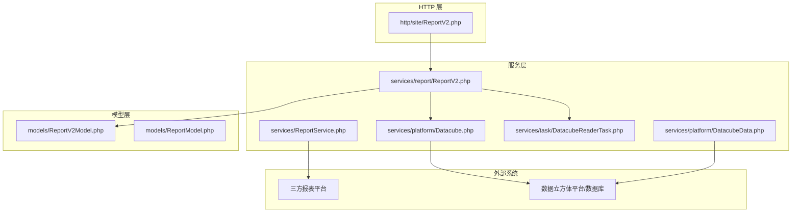
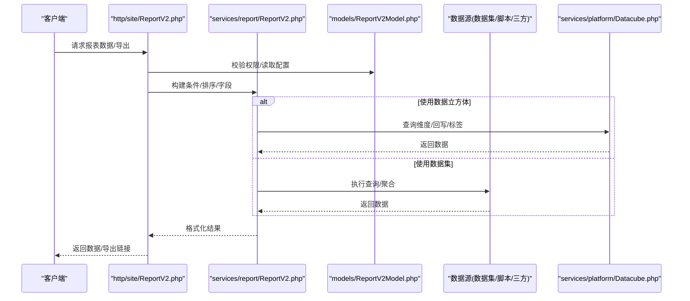
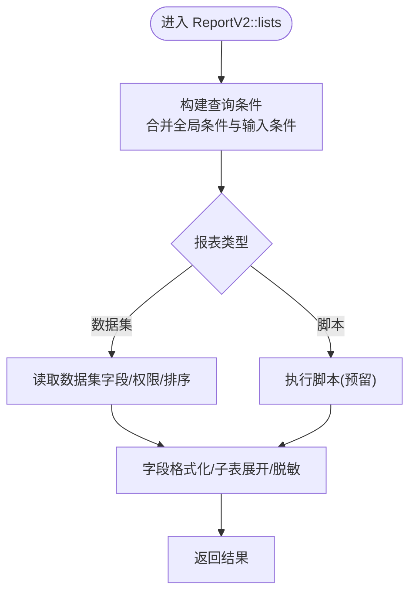
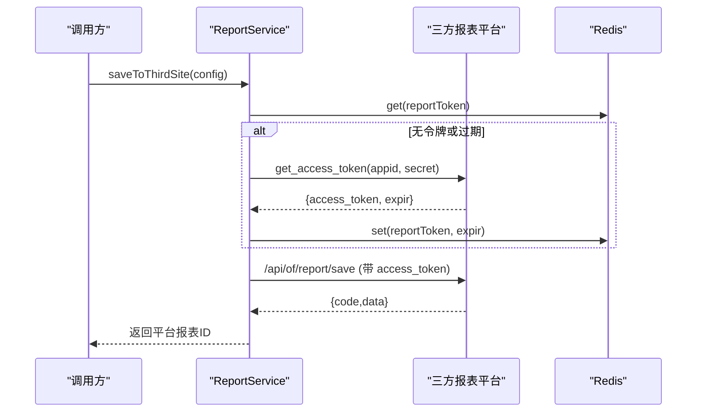
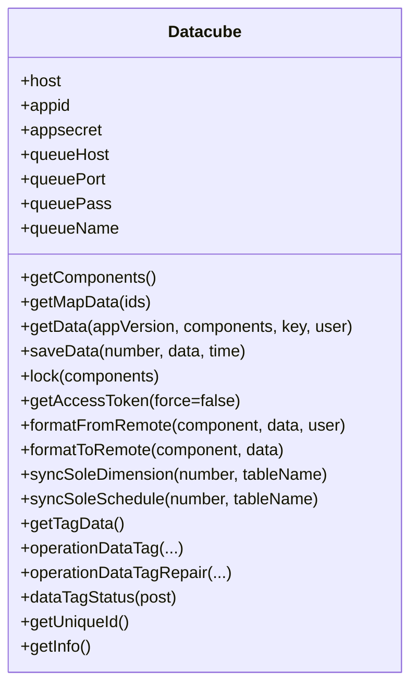
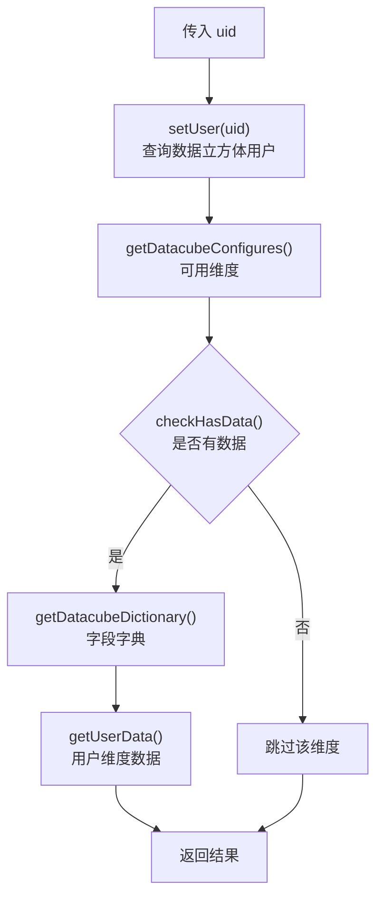
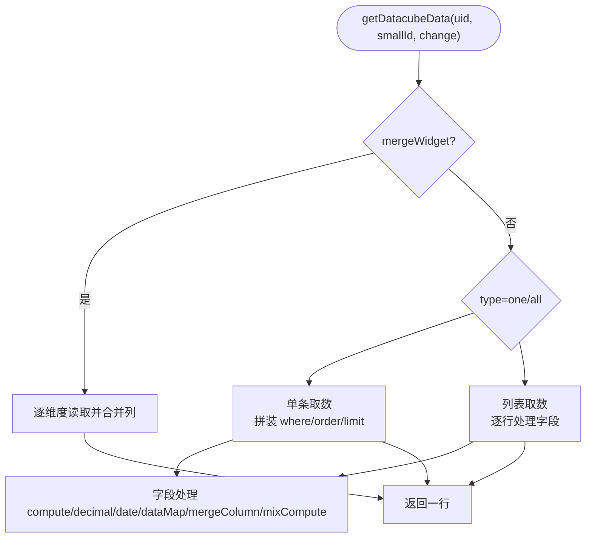
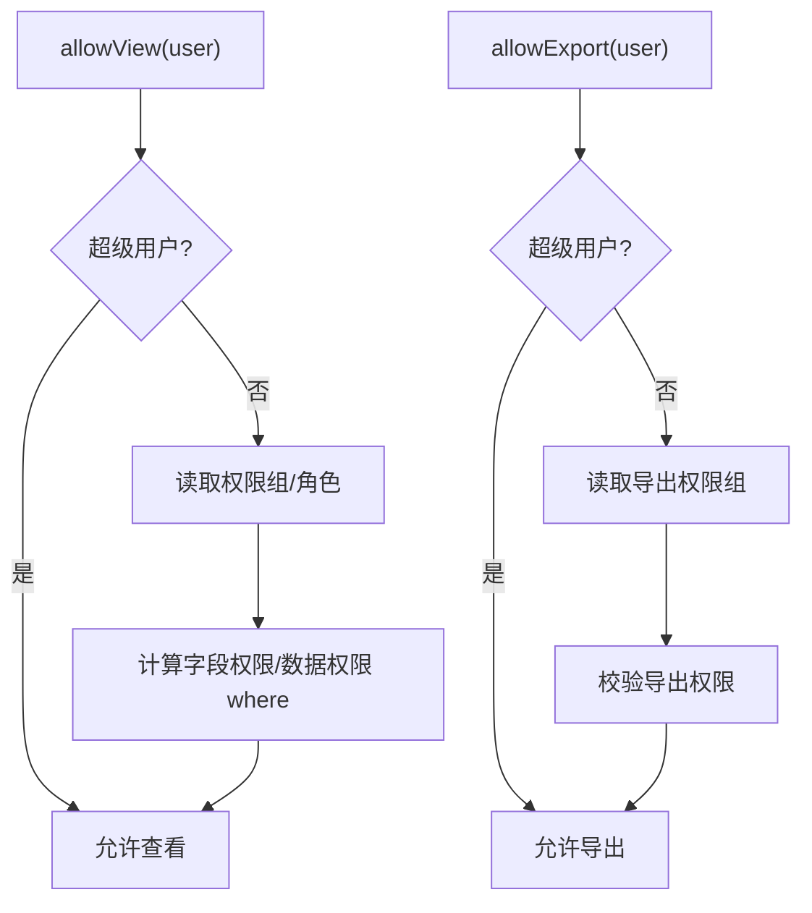
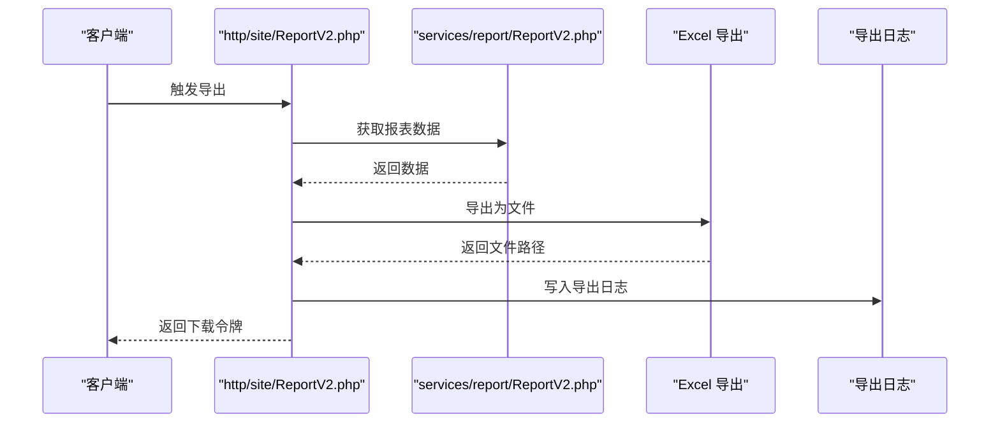
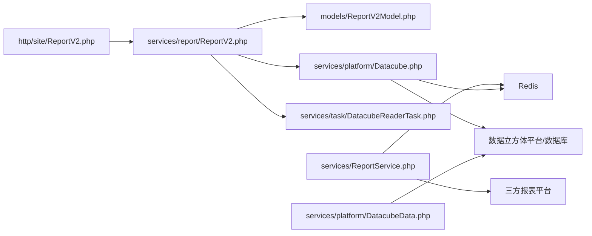

# 报表服务

<cite>
**本文引用的文件**
- [ReportService.php](file://process/src/services/ReportService.php)
- [ReportV2.php](file://process/src/services/report/ReportV2.php)
- [ReportV2.php（HTTP 接口）](file://process/src/http/site/ReportV2.php)
- [ReportV2Model.php](file://process/src/models/ReportV2Model.php)
- [ReportModel.php](file://process/src/models/ReportModel.php)
- [Datacube.php](file://process/src/services/platform/Datacube.php)
- [DatacubeData.php](file://process/src/services/platform/DatacubeData.php)
- [DatacubeReaderTask.php](file://process/src/services/tasK/DatacubeReaderTask.php)
- [database.sql](file://process/docs/sql/database.sql)
</cite>

## 目录
1. [简介](#简介)
2. [项目结构](#项目结构)
3. [核心组件](#核心组件)
4. [架构总览](#架构总览)
5. [详细组件分析](#详细组件分析)
6. [依赖分析](#依赖分析)
7. [性能考虑](#性能考虑)
8. [故障排查指南](#故障排查指南)
9. [结论](#结论)
10. [附录](#附录)

## 简介
本文件面向 htdNew 项目的报表服务，系统性梳理报表平台的整体架构、数据立方体机制与报表生成流程，重点覆盖以下内容：
- 报表核心能力：新版报表模型、查询与格式化、权限控制、导出流程
- 数据立方体：平台对接、数据读取、维度合并与字段变换、标签与回写
- 报表模板与配置：数据集来源、查询配置、结果配置、图表配置、页面配置
- 报表导出：Excel 导出、导出日志、导出标识更新
- 性能优化与大数据处理：缓存、分页、字段裁剪、权限过滤、Redis 令牌缓存

## 项目结构
围绕报表服务的关键目录与文件：
- 服务层
  - 报表平台对接：ReportService.php
  - 报表引擎与格式化：services/report/ReportV2.php
  - 平台数据立方体：services/platform/Datacube.php、DatacubeData.php
  - 数据立方体任务：services/task/DatacubeReaderTask.php
- 模型层
  - 报表模型：models/ReportV2Model.php、models/ReportModel.php
  - 数据库结构：docs/sql/database.sql
- HTTP 层
  - 报表数据查询与导出：http/site/ReportV2.php

图示来源
- [ReportV2.php](file://process/src/services/report/ReportV2.php#L1-L650)
- [ReportService.php](file://process/src/services/ReportService.php#L1-L376)
- [Datacube.php](file://process/src/services/platform/Datacube.php#L1-L449)
- [DatacubeData.php](file://process/src/services/platform/DatacubeData.php#L1-L168)
- [DatacubeReaderTask.php](file://process/src/services/tasK/DatacubeReaderTask.php#L1-L663)
- [ReportV2.php（HTTP 接口）](file://process/src/http/site/ReportV2.php#L1-L108)

章节来源
- [ReportV2.php](file://process/src/services/report/ReportV2.php#L1-L650)
- [ReportService.php](file://process/src/services/ReportService.php#L1-L376)
- [Datacube.php](file://process/src/services/platform/Datacube.php#L1-L449)
- [DatacubeData.php](file://process/src/services/platform/DatacubeData.php#L1-L168)
- [DatacubeReaderTask.php](file://process/src/services/tasK/DatacubeReaderTask.php#L1-L663)
- [ReportV2.php（HTTP 接口）](file://process/src/http/site/ReportV2.php#L1-L108)
- [ReportV2Model.php](file://process/src/models/ReportV2Model.php#L1-L624)
- [ReportModel.php](file://process/src/models/ReportModel.php#L1-L103)
- [database.sql](file://process/docs/sql/database.sql#L1191-L1222)

## 核心组件
- 报表服务入口与三方平台对接
  - ReportService：负责访问三方报表平台的鉴权、创建/修改/删除/列表查询、权限统计、登录跳转 URL 生成等
- 报表引擎与数据处理
  - ReportV2：负责条件构建、字段格式化、排序、数据集/脚本数据查询、图表数据聚合、变量解析
- 数据立方体平台对接
  - Datacube：对接数据立方体平台，提供组件结构、地图数据、维度数据查询、回写队列、令牌获取、组件值格式化/反格式化、维度/排班同步、数据标签操作
  - DatacubeData：对接本地数据立方体数据库，提供维度/字段清单、用户数据校验与读取、可用维度筛选
- 数据立方体任务
  - DatacubeReaderTask：通用数据源任务，支持维度字典、单条/列表取数、条件拼装、字段计算/取舍/日期格式化、列合并、混合计算、维度合并
- 报表模型
  - ReportV2Model：新版报表模型，包含数据源配置、全局条件、查询/结果/图表/页面配置、可见与导出范围、权限组与数据权限、导出标识更新
  - ReportModel：旧版报表模型（兼容类型/状态转换）

章节来源
- [ReportService.php](file://process/src/services/ReportService.php#L1-L376)
- [ReportV2.php](file://process/src/services/report/ReportV2.php#L1-L650)
- [Datacube.php](file://process/src/services/platform/Datacube.php#L1-L449)
- [DatacubeData.php](file://process/src/services/platform/DatacubeData.php#L1-L168)
- [DatacubeReaderTask.php](file://process/src/services/tasK/DatacubeReaderTask.php#L1-L663)
- [ReportV2Model.php](file://process/src/models/ReportV2Model.php#L1-L624)
- [ReportModel.php](file://process/src/models/ReportModel.php#L1-L103)

## 架构总览
报表服务由“HTTP 接口 -> 报表引擎 -> 数据源（数据集/脚本/三方/数据立方体）”构成，结合模型层的配置与权限控制，最终输出数据与导出能力。

图示来源
- [ReportV2.php（HTTP 接口）](file://process/src/http/site/ReportV2.php#L1-L108)
- [ReportV2.php](file://process/src/services/report/ReportV2.php#L1-L650)
- [Datacube.php](file://process/src/services/platform/Datacube.php#L1-L449)
- [ReportV2Model.php](file://process/src/models/ReportV2Model.php#L1-L624)

## 详细组件分析

### 报表核心：ReportV2 引擎
- 条件构建：支持全局条件与用户输入条件合并，形成最终查询条件树
- 字段格式化：按字段类型进行文本/数值/日期/枚举/数组等格式化
- 排序：支持显式排序与默认排序组合，保证稳定排序
- 数据源类型：
  - 数据集：从数据表读取，支持字段裁剪、权限过滤、导出标识更新
  - 脚本：预留扩展（当前返回空）
- 图表数据：基于配置的数据集聚合，支持分组、聚合方式、排序、上限等
- 变量解析：支持 report.viewer.* 等变量注入

图示来源
- [ReportV2.php](file://process/src/services/report/ReportV2.php#L212-L342)

章节来源
- [ReportV2.php](file://process/src/services/report/ReportV2.php#L1-L650)

### 报表平台对接：ReportService
- 令牌管理：通过缓存键获取/刷新三方平台 access_token，并持久化至 Redis
- 配置同步：将报表配置（名称、分页、数据集字段、身份维度、关联关系）提交至三方平台
- 删除/列表：支持删除三方报表与批量查询
- 权限控制：基于报表模型的 auth 配置，计算可见/导出人数与权限项
- 登录跳转：生成三方平台登录校验 URL，支持预览/分享/编辑三种类型

图示来源
- [ReportService.php](file://process/src/services/ReportService.php#L43-L170)

章节来源
- [ReportService.php](file://process/src/services/ReportService.php#L1-L376)

### 数据立方体平台：Datacube
- 组件与地图：获取组件结构、地图数据
- 维度数据：按条件查询维度数据，记录运行日志
- 回写队列：将组件值序列化后写入 Redis Stream，供下游处理
- 令牌与锁：获取访问令牌、锁定维度字段
- 格式化：针对日历、文件、用户搜索等组件进行双向格式化
- 同步与标签：维度/排班同步、数据标签列表与操作（含重试与状态记录）

图示来源
- [Datacube.php](file://process/src/services/platform/Datacube.php#L1-L449)

章节来源
- [Datacube.php](file://process/src/services/platform/Datacube.php#L1-L449)

### 数据立方体数据源：DatacubeData
- 用户绑定：根据当前用户工号在数据立方体用户表中查找对应用户
- 可用维度：筛选存在数据的维度，填充字典与用户数据
- 维度/字段：查询维度清单与字段清单
- 数据读取：按用户字段过滤，返回用户维度数据

图示来源
- [DatacubeData.php](file://process/src/services/platform/DatacubeData.php#L60-L151)

章节来源
- [DatacubeData.php](file://process/src/services/platform/DatacubeData.php#L1-L168)

### 数据立方体任务：DatacubeReaderTask
- 维度字典：聚合维度与字段，生成控件可用字段清单
- 单条/列表取数：支持 whereStr/whereCond/order/isTag/count/limit/offset 等参数
- 字段处理：compute（四则运算）、decimal（小数位）、date（日期格式）、dataMap（映射）、mergeColumn（列合并）、mixCompute（混合计算）
- 维度合并：将多个维度按列名对齐合并，支持各自维度的 where/order/compute/date/mergeColumn 参数

图示来源
- [DatacubeReaderTask.php](file://process/src/services/tasK/DatacubeReaderTask.php#L252-L422)
- [DatacubeReaderTask.php](file://process/src/services/tasK/DatacubeReaderTask.php#L424-L663)

章节来源
- [DatacubeReaderTask.php](file://process/src/services/tasK/DatacubeReaderTask.php#L1-L663)

### 报表模型与权限
- ReportV2Model：新版报表模型，包含数据源配置、全局条件、查询/结果/图表/页面配置、可见与导出范围、权限组与数据权限、导出标识更新
- 权限组与数据权限：支持部门/个人/二级/自定义/关联等多种数据权限，支持附加条件
- 导出标识：当结果集中包含导出标识字段时，更新为已导出状态

图示来源
- [ReportV2Model.php](file://process/src/models/ReportV2Model.php#L250-L295)
- [ReportV2Model.php](file://process/src/models/ReportV2Model.php#L333-L413)
- [ReportV2Model.php](file://process/src/models/ReportV2Model.php#L413-L571)

章节来源
- [ReportV2Model.php](file://process/src/models/ReportV2Model.php#L1-L624)

### 报表导出流程
- HTTP 层：调用报表引擎获取数据，构造 Excel 工作表，导出并记录导出日志
- 导出标识：若启用导出标识字段，更新数据集对应记录为已导出

图示来源
- [ReportV2.php（HTTP 接口）](file://process/src/http/site/ReportV2.php#L60-L94)
- [ReportV2.php](file://process/src/services/report/ReportV2.php#L297-L319)

章节来源
- [ReportV2.php（HTTP 接口）](file://process/src/http/site/ReportV2.php#L1-L108)
- [ReportV2.php](file://process/src/services/report/ReportV2.php#L297-L319)

## 依赖分析
- 组件耦合
  - ReportV2 引擎依赖 ReportV2Model 的配置与权限，依赖数据立方体平台或数据集
  - ReportService 依赖三方平台与 Redis 缓存
  - Datacube/DatacubeData 依赖外部平台/数据库与 Redis
  - DatacubeReaderTask 依赖数据库连接与用户信息
- 关键依赖链
  - HTTP -> ReportV2 引擎 -> 数据源（数据集/脚本/三方/数据立方体）
  - ReportV2 引擎 -> ReportV2Model（配置/权限）
  - ReportService -> 三方平台 -> Redis（令牌）
  - Datacube -> Redis（令牌/队列）-> 外部平台
  - DatacubeData -> 数据立方体数据库

图示来源
- [ReportV2.php（HTTP 接口）](file://process/src/http/site/ReportV2.php#L1-L108)
- [ReportV2.php](file://process/src/services/report/ReportV2.php#L1-L650)
- [ReportService.php](file://process/src/services/ReportService.php#L1-L376)
- [Datacube.php](file://process/src/services/platform/Datacube.php#L1-L449)
- [DatacubeData.php](file://process/src/services/platform/DatacubeData.php#L1-L168)
- [DatacubeReaderTask.php](file://process/src/services/tasK/DatacubeReaderTask.php#L1-L663)

章节来源
- [ReportV2.php（HTTP 接口）](file://process/src/http/site/ReportV2.php#L1-L108)
- [ReportV2.php](file://process/src/services/report/ReportV2.php#L1-L650)
- [ReportService.php](file://process/src/services/ReportService.php#L1-L376)
- [Datacube.php](file://process/src/services/platform/Datacube.php#L1-L449)
- [DatacubeData.php](file://process/src/services/platform/DatacubeData.php#L1-L168)
- [DatacubeReaderTask.php](file://process/src/services/tasK/DatacubeReaderTask.php#L1-L663)

## 性能考虑
- 缓存与令牌
  - ReportService 使用 Redis 缓存三方平台 access_token，避免频繁请求
  - Datacube 使用 Redis 缓存访问令牌，减少外部平台调用
- 分页与字段裁剪
  - ReportV2 在数据集查询时支持分页与字段裁剪，降低网络与存储压力
- 权限过滤
  - ReportV2 在查询前根据权限组与数据权限生成 where 条件，缩小数据集
- 大数据量处理
  - DatacubeReaderTask 支持 where/order/limit/offset/count，便于分页与聚合
  - 图表聚合支持 groupby/聚合函数/排序/上限，避免一次性全量传输
- 导出优化
  - 导出采用流式写入与文件落盘，避免内存峰值

[本节为通用指导，无需列出具体文件来源]

## 故障排查指南
- 三方平台访问失败
  - 检查 ReportService 的配置与 Redis 令牌缓存是否生效
  - 关注请求与响应日志，确认返回码与消息
- 数据立方体访问失败
  - 检查 Datacube 的 host/appid/appsecret/queue 配置
  - 关注 getAccessToken 与 requestWithAccessToken 的返回
- 权限不足
  - 确认 ReportV2Model 的 visible_roles/export_roles 与权限组配置
  - 检查数据权限（部门/个人/二级/自定义/关联）是否正确
- 导出异常
  - 确认导出日志是否写入
  - 若启用导出标识字段，确认数据集字段存在且更新成功

章节来源
- [ReportService.php](file://process/src/services/ReportService.php#L43-L170)
- [Datacube.php](file://process/src/services/platform/Datacube.php#L174-L200)
- [ReportV2Model.php](file://process/src/models/ReportV2Model.php#L250-L295)
- [ReportV2.php（HTTP 接口）](file://process/src/http/site/ReportV2.php#L60-L94)

## 结论
htdNew 报表服务通过清晰的服务分层与模型驱动，实现了从配置到执行再到导出的完整闭环。数据立方体平台与任务机制提供了强大的维度与字段处理能力，配合权限与导出标识，满足复杂场景下的报表需求。建议在生产环境中强化缓存与分页策略，持续监控三方平台与数据立方体的可用性与性能表现。

[本节为总结性内容，无需列出具体文件来源]

## 附录

### 报表模板与配置要点
- 数据源配置
  - 数据集：指定数据表 ID 与字段映射
  - 脚本：预留扩展（当前返回空）
  - 三方：通过 ReportService 同步至三方平台
- 查询配置
  - 支持全局条件与输入条件合并
  - 支持字段类型与排序开关
- 结果配置
  - 字段清单、对齐/宽度/排序、子表关联
- 图表配置
  - 分组字段、聚合方式、排序、上限
- 页面配置
  - 分页行数、锁定列、导出提示文案等

章节来源
- [ReportV2Model.php](file://process/src/models/ReportV2Model.php#L48-L84)
- [ReportV2.php](file://process/src/services/report/ReportV2.php#L62-L118)
- [ReportV2.php](file://process/src/services/report/ReportV2.php#L172-L209)
- [ReportV2.php](file://process/src/services/report/ReportV2.php#L344-L456)

### 数据库与报表表结构
- 报表表结构包含名称、类型、配置、平台 ID、状态、可见人群等字段
- 数据集表包含名称、描述、关联事项/部门、字段规则、查询规则等

章节来源
- [database.sql](file://process/docs/sql/database.sql#L1191-L1222)