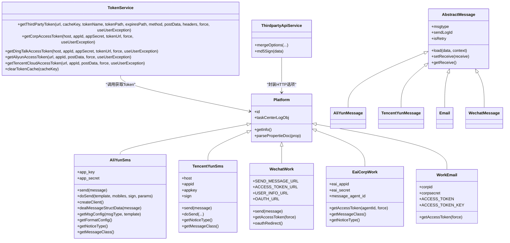
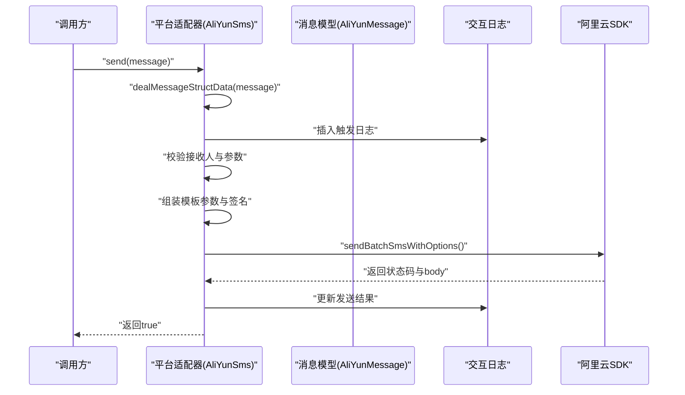
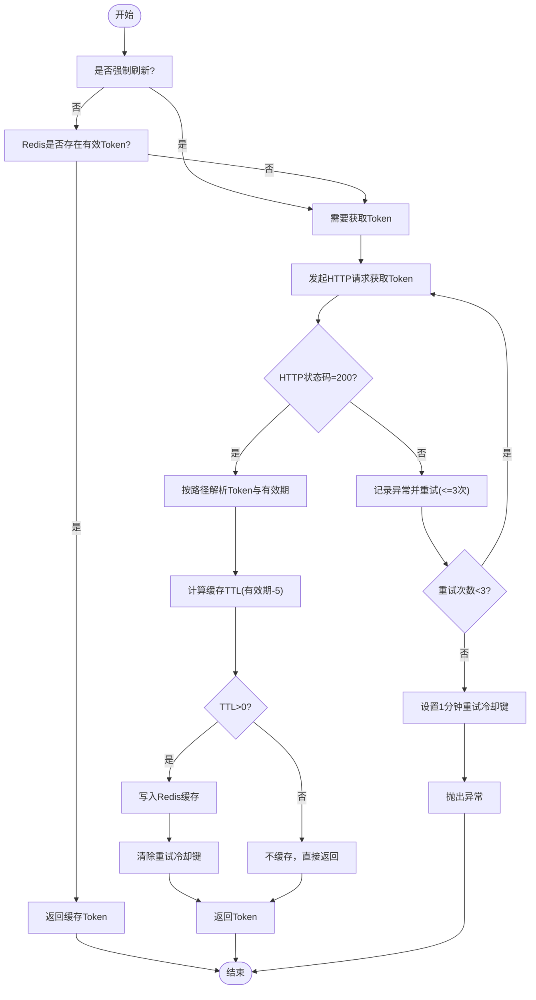
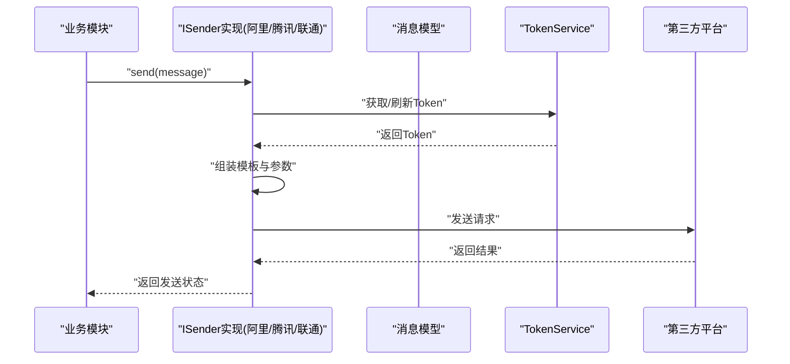
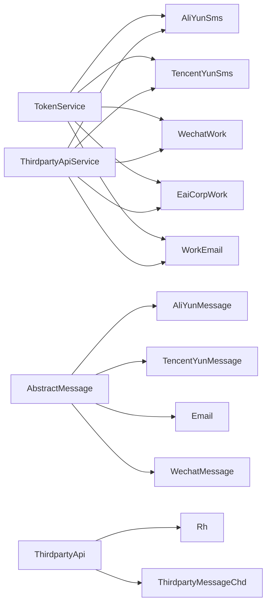

# 第三方集成服务

<cite>
**本文引用的文件**
- [process/src/services/platform/Platform.php](file://process/src/services/platform/Platform.php)
- [process/src/services/platform/AliYunSms.php](file://process/src/services/platform/AliYunSms.php)
- [process/src/services/platform/AliYunSmsOne.php](file://process/src/services/platform/AliYunSmsOne.php)
- [process/src/services/platform/TencentYunSms.php](file://process/src/services/platform/TencentYunSms.php)
- [process/src/services/platform/LianTongSms.php](file://process/src/services/platform/LianTongSms.php)
- [process/src/services/platform/WechatWork.php](file://process/src/services/platform/WechatWork.php)
- [process/src/services/platform/EaiCorpWork.php](file://process/src/services/platform/EaiCorpWork.php)
- [process/src/services/platform/WorkEmail.php](file://process/src/services/platform/WorkEmail.php)
- [process/src/services/platform/Rh.php](file://process/src/services/platform/Rh.php)
- [process/src/services/platform/ThirdpartyMessageChd.php](file://process/src/services/platform/ThirdpartyMessageChd.php)
- [process/src/services/api/TokenService.php](file://process/src/services/api/TokenService.php)
- [process/src/services/api/TokenServiceExample.php](file://process/src/services/api/TokenServiceExample.php)
- [process/src/services/ThirdpartyApiService.php](file://process/src/services/ThirdpartyApiService.php)
- [process/src/services/notice/message/AbstractMessage.php](file://process/src/services/notice/message/AbstractMessage.php)
- [process/src/services/notice/message/AliYunMessage.php](file://process/src/services/notice/message/AliYunMessage.php)
- [process/src/services/notice/message/TencentYunMessage.php](file://process/src/services/notice/message/TencentYunMessage.php)
- [process/src/services/notice/message/Email.php](file://process/src/services/notice/message/Email.php)
- [process/src/services/notice/message/WechatMessage.php](file://process/src/services/notice/message/WechatMessage.php)
- [process/src/http/system/ThirdpartyApi.php](file://process/src/http/system/ThirdpartyApi.php)
- [process_envs/ouc/product/thirdparty/ThirdSDKService.php](file://process_envs/ouc/product/thirdparty/ThirdSDKService.php)
- [process_envs/gmc/product/thirdparty/Door.php](file://process_envs/gmc/product/thirdparty/Door.php)
- [process_envs/gmc/product/thirdparty/Door_1.php](file://process_envs/gmc/product/thirdparty/Door_1.php)
- [process_envs/bua/product/thirdparty/TingJianDanInterface.php](file://process_envs/bua/product/thirdparty/TingJianDanInterface.php)
- [process_envs/cuc/product/thirdparty/AppointmentInterface.php](file://process_envs/cuc/product/thirdparty/AppointmentInterface.php)
</cite>

## 目录
1. [引言](#引言)
2. [项目结构](#项目结构)
3. [核心组件](#核心组件)
4. [架构总览](#架构总览)
5. [详细组件分析](#详细组件分析)
6. [依赖关系分析](#依赖关系分析)
7. [性能与成本优化](#性能与成本优化)
8. [故障排查指南](#故障排查指南)
9. [结论](#结论)
10. [附录](#附录)

## 引言
本文件面向 htdNew 项目的第三方集成服务，系统性阐述统一接口设计与适配器模式实现，覆盖短信服务（阿里云短信、腾讯云短信、联通短信）、邮件服务与微信企业号集成。文档重点包括：
- 统一抽象层与平台适配器设计
- 认证与 Token 管理、重试与限流策略
- API 调用封装、错误处理与日志追踪
- 服务降级、熔断与超时重试实践
- 监控指标、性能优化与成本控制建议

## 项目结构
第三方集成服务主要分布在以下目录与文件：
- 平台适配器层：位于 services/platform，按服务类型（短信、企业微信、邮件等）划分具体实现
- 通知消息模型层：位于 services/notice/message，采用适配器模式承载不同第三方的消息载体
- 通用 Token 服务：位于 services/api，提供统一的 Token 获取、缓存与重试机制
- 通用 HTTP 封装：位于 services/ThirdpartyApiService.php，提供签名、选项合并等基础能力
- 控制器入口：位于 http/system/ThirdpartyApi.php，提供第三方接口的增删改查与测试接口
- 环境特定集成：位于 process_envs/*/product/thirdparty，展示不同学校或业务线的定制化对接

```mermaid
graph TB
subgraph "平台适配器层"
P1["services/platform/Platform.php"]
P2["services/platform/AliYunSms.php"]
P3["services/platform/TencentYunSms.php"]
P4["services/platform/LianTongSms.php"]
P5["services/platform/WechatWork.php"]
P6["services/platform/EaiCorpWork.php"]
P7["services/platform/WorkEmail.php"]
P8["services/platform/Rh.php"]
P9["services/platform/ThirdpartyMessageChd.php"]
end
subgraph "通知消息模型层"
M1["services/notice/message/AbstractMessage.php"]
M2["services/notice/message/AliYunMessage.php"]
M3["services/notice/message/TencentYunMessage.php"]
M4["services/notice/message/Email.php"]
M5["services/notice/message/WechatMessage.php"]
end
subgraph "通用服务"
T1["services/api/TokenService.php"]
T2["services/api/TokenServiceExample.php"]
H1["services/ThirdpartyApiService.php"]
C1["http/system/ThirdpartyApi.php"]
end
subgraph "环境特定集成"
E1["process_envs/*/thirdparty/*"]
end
P1 --> P2
P1 --> P3
P1 --> P4
P1 --> P5
P1 --> P6
P1 --> P7
P1 --> P8
P1 --> P9
M1 --> M2
M1 --> M3
M1 --> M4
M1 --> M5
T1 --> P2
T1 --> P3
T1 --> P5
T1 --> P6
T1 --> P7
H1 --> P2
H1 --> P3
H1 --> P5
H1 --> P6
H1 --> P7
C1 --> P8
C1 --> P9
E1 --> P5
E1 --> P6
E1 --> P7
```

**图表来源**
- [process/src/services/platform/Platform.php](file://process/src/services/platform/Platform.php#L1-L93)
- [process/src/services/platform/AliYunSms.php](file://process/src/services/platform/AliYunSms.php#L1-L280)
- [process/src/services/platform/TencentYunSms.php](file://process/src/services/platform/TencentYunSms.php#L1-L243)
- [process/src/services/platform/LianTongSms.php](file://process/src/services/platform/LianTongSms.php#L202-L243)
- [process/src/services/platform/WechatWork.php](file://process/src/services/platform/WechatWork.php#L1-L40)
- [process/src/services/platform/EaiCorpWork.php](file://process/src/services/platform/EaiCorpWork.php#L49-L102)
- [process/src/services/platform/WorkEmail.php](file://process/src/services/platform/WorkEmail.php#L1-L37)
- [process/src/services/platform/Rh.php](file://process/src/services/platform/Rh.php#L545-L587)
- [process/src/services/platform/ThirdpartyMessageChd.php](file://process/src/services/platform/ThirdpartyMessageChd.php#L61-L126)
- [process/src/services/notice/message/AbstractMessage.php](file://process/src/services/notice/message/AbstractMessage.php#L1-L31)
- [process/src/services/notice/message/AliYunMessage.php](file://process/src/services/notice/message/AliYunMessage.php#L1-L29)
- [process/src/services/notice/message/TencentYunMessage.php](file://process/src/services/notice/message/TencentYunMessage.php#L1-L28)
- [process/src/services/notice/message/Email.php](file://process/src/services/notice/message/Email.php#L1-L37)
- [process/src/services/notice/message/WechatMessage.php](file://process/src/services/notice/message/WechatMessage.php#L1-L76)
- [process/src/services/api/TokenService.php](file://process/src/services/api/TokenService.php#L1-L329)
- [process/src/services/api/TokenServiceExample.php](file://process/src/services/api/TokenServiceExample.php#L1-L44)
- [process/src/services/ThirdpartyApiService.php](file://process/src/services/ThirdpartyApiService.php#L1-L76)
- [process/src/http/system/ThirdpartyApi.php](file://process/src/http/system/ThirdpartyApi.php#L74-L130)

**章节来源**
- [process/src/services/platform/Platform.php](file://process/src/services/platform/Platform.php#L1-L93)
- [process/src/services/ThirdpartyApiService.php](file://process/src/services/ThirdpartyApiService.php#L1-L76)
- [process/src/http/system/ThirdpartyApi.php](file://process/src/http/system/ThirdpartyApi.php#L74-L130)

## 核心组件
- 平台抽象基类：统一平台能力描述、表单元信息解析与日志结构
- 平台适配器：针对短信、企业微信、邮件等第三方服务的具体实现
- 通知消息模型：抽象消息体与各平台消息载体
- 通用 Token 服务：统一 Token 获取、缓存、重试与限流
- 通用 HTTP 封装：统一请求选项、签名与合并策略
- 控制器入口：第三方接口的注册、查询、保存与测试

**章节来源**
- [process/src/services/platform/Platform.php](file://process/src/services/platform/Platform.php#L1-L93)
- [process/src/services/api/TokenService.php](file://process/src/services/api/TokenService.php#L1-L329)
- [process/src/services/ThirdpartyApiService.php](file://process/src/services/ThirdpartyApiService.php#L1-L76)

## 架构总览
第三方集成采用“平台适配器 + 消息模型 + 通用服务”的分层架构：
- 抽象层：Platform 定义平台能力与配置元信息
- 适配层：各平台适配器实现具体发送逻辑与配置
- 消息层：AbstractMessage 及其子类承载消息体
- 通用层：TokenService、ThirdpartyApiService 提供认证、缓存与 HTTP 封装
- 入口层：控制器提供接口注册与测试

**图表来源**
- [process/src/services/platform/Platform.php](file://process/src/services/platform/Platform.php#L1-L93)
- [process/src/services/platform/AliYunSms.php](file://process/src/services/platform/AliYunSms.php#L1-L280)
- [process/src/services/platform/TencentYunSms.php](file://process/src/services/platform/TencentYunSms.php#L1-L243)
- [process/src/services/platform/WechatWork.php](file://process/src/services/platform/WechatWork.php#L1-L40)
- [process/src/services/platform/EaiCorpWork.php](file://process/src/services/platform/EaiCorpWork.php#L49-L102)
- [process/src/services/platform/WorkEmail.php](file://process/src/services/platform/WorkEmail.php#L1-L37)
- [process/src/services/notice/message/AbstractMessage.php](file://process/src/services/notice/message/AbstractMessage.php#L1-L31)
- [process/src/services/notice/message/AliYunMessage.php](file://process/src/services/notice/message/AliYunMessage.php#L1-L29)
- [process/src/services/notice/message/TencentYunMessage.php](file://process/src/services/notice/message/TencentYunMessage.php#L1-L28)
- [process/src/services/notice/message/Email.php](file://process/src/services/notice/message/Email.php#L1-L37)
- [process/src/services/notice/message/WechatMessage.php](file://process/src/services/notice/message/WechatMessage.php#L1-L76)
- [process/src/services/api/TokenService.php](file://process/src/services/api/TokenService.php#L1-L329)
- [process/src/services/ThirdpartyApiService.php](file://process/src/services/ThirdpartyApiService.php#L1-L76)

## 详细组件分析

### 平台适配器与统一接口设计
- 平台抽象：Platform 提供统一的平台信息描述、表单元信息解析与日志结构，便于在后台管理系统中动态渲染配置项
- 适配器职责：各平台适配器实现 send/doSend、消息体转换、平台能力标识与消息类映射
- 适配器示例：
  - 阿里云短信：支持批量发送、模板参数组装、签名与模板选择、交互日志记录
  - 腾讯云短信：支持自定义模板、签名与签名类型、HTTP 请求封装与调用日志
  - 企业微信：支持消息发送、Token 获取、OAuth 登录、二维码等能力
  - 邮件：提供收件人、主题、正文、抄送与附件等基础字段
  - 易联（EAI）企业号：提供 Token 获取与消息类映射
  - 工作邮箱：提供企业邮箱 Token 获取与错误码映射

**图表来源**
- [process/src/services/platform/AliYunSms.php](file://process/src/services/platform/AliYunSms.php#L87-L210)
- [process/src/services/notice/message/AliYunMessage.php](file://process/src/services/notice/message/AliYunMessage.php#L1-L29)

**章节来源**
- [process/src/services/platform/Platform.php](file://process/src/services/platform/Platform.php#L1-L93)
- [process/src/services/platform/AliYunSms.php](file://process/src/services/platform/AliYunSms.php#L1-L280)
- [process/src/services/platform/TencentYunSms.php](file://process/src/services/platform/TencentYunSms.php#L1-L243)
- [process/src/services/platform/WechatWork.php](file://process/src/services/platform/WechatWork.php#L1-L40)
- [process/src/services/platform/EaiCorpWork.php](file://process/src/services/platform/EaiCorpWork.php#L49-L102)
- [process/src/services/platform/WorkEmail.php](file://process/src/services/platform/WorkEmail.php#L1-L37)
- [process/src/services/notice/message/AbstractMessage.php](file://process/src/services/notice/message/AbstractMessage.php#L1-L31)
- [process/src/services/notice/message/AliYunMessage.php](file://process/src/services/notice/message/AliYunMessage.php#L1-L29)
- [process/src/services/notice/message/TencentYunMessage.php](file://process/src/services/notice/message/TencentYunMessage.php#L1-L28)
- [process/src/services/notice/message/Email.php](file://process/src/services/notice/message/Email.php#L1-L37)
- [process/src/services/notice/message/WechatMessage.php](file://process/src/services/notice/message/WechatMessage.php#L1-L76)

### 认证机制与 Token 管理
- 统一 Token 获取：TokenService 提供通用方法，支持 GET/POST、路径取值、有效期缓存、重试与限流
- 重试与限流：连续失败设置重试冷却键，避免频繁重试；成功后清除冷却键
- 缓存策略：基于接口返回有效期减去安全余量进行缓存，保证缓存时间大于 0
- 平台适配器通过 TokenService 获取并复用 Token，减少重复请求

**图表来源**
- [process/src/services/api/TokenService.php](file://process/src/services/api/TokenService.php#L33-L161)

**章节来源**
- [process/src/services/api/TokenService.php](file://process/src/services/api/TokenService.php#L1-L329)
- [process/src/services/api/TokenServiceExample.php](file://process/src/services/api/TokenServiceExample.php#L1-L44)

### API 调用封装与错误处理
- HTTP 选项合并：ThirdpartyApiService 提供选项合并与 MD5 签名工具，便于统一配置与签名
- 错误处理：平台适配器在发送前进行参数校验与异常捕获，记录交互日志并区分成功/失败状态
- 日志追踪：交互日志记录请求/响应、状态与追踪信息，便于问题定位

**章节来源**
- [process/src/services/ThirdpartyApiService.php](file://process/src/services/ThirdpartyApiService.php#L1-L76)
- [process/src/services/platform/AliYunSms.php](file://process/src/services/platform/AliYunSms.php#L133-L210)
- [process/src/services/platform/TencentYunSms.php](file://process/src/services/platform/TencentYunSms.php#L180-L243)

### 服务降级、熔断与超时重试策略
- 超时重试：TokenService 在网络异常或接口返回非 200 时自动重试，避免瞬时故障导致失败
- 冷却限流：连续失败设置 1 分钟重试冷却键，防止雪崩效应
- 参数降级：阿里云短信对批量条数进行限制，超过阈值直接抛错，避免大规模失败
- 熔断建议：可在上层引入计数器与滑动窗口策略，结合 Redis 实现快速失败与快速恢复

**章节来源**
- [process/src/services/api/TokenService.php](file://process/src/services/api/TokenService.php#L82-L161)
- [process/src/services/platform/AliYunSms.php](file://process/src/services/platform/AliYunSms.php#L106-L110)

### 短信服务集成（阿里云短信、腾讯云短信、联通短信）
- 阿里云短信：
  - 支持批量发送、模板参数组装、签名与模板选择
  - 通过适配器与消息模型解耦，便于扩展其他短信供应商
- 腾讯云短信：
  - 支持自定义模板、签名与签名类型
  - 提供统一的发送流程与调用日志
- 联通短信：
  - 提供能力标识与消息类映射，便于统一调度

**图表来源**
- [process/src/services/platform/AliYunSms.php](file://process/src/services/platform/AliYunSms.php#L87-L210)
- [process/src/services/platform/TencentYunSms.php](file://process/src/services/platform/TencentYunSms.php#L1-L243)
- [process/src/services/platform/LianTongSms.php](file://process/src/services/platform/LianTongSms.php#L202-L243)
- [process/src/services/api/TokenService.php](file://process/src/services/api/TokenService.php#L1-L329)

**章节来源**
- [process/src/services/platform/AliYunSms.php](file://process/src/services/platform/AliYunSms.php#L1-L280)
- [process/src/services/platform/AliYunSmsOne.php](file://process/src/services/platform/AliYunSmsOne.php#L1-L43)
- [process/src/services/platform/TencentYunSms.php](file://process/src/services/platform/TencentYunSms.php#L1-L243)
- [process/src/services/platform/LianTongSms.php](file://process/src/services/platform/LianTongSms.php#L202-L243)

### 邮件服务集成
- 邮件适配器提供收件人、主题、正文、抄送与附件字段，支持格式化渲染
- 可结合平台适配器实现 SMTP/IMAP 等邮件网关对接

**章节来源**
- [process/src/services/notice/message/Email.php](file://process/src/services/notice/message/Email.php#L1-L37)

### 微信企业号集成
- 企业微信适配器提供消息发送、Token 获取、OAuth 登录与二维码等能力
- 易联（EAI）企业号适配器提供 Token 获取与消息类映射
- 工作邮箱适配器提供企业邮箱 Token 获取与错误码映射

**章节来源**
- [process/src/services/platform/WechatWork.php](file://process/src/services/platform/WechatWork.php#L1-L40)
- [process/src/services/platform/EaiCorpWork.php](file://process/src/services/platform/EaiCorpWork.php#L49-L102)
- [process/src/services/platform/WorkEmail.php](file://process/src/services/platform/WorkEmail.php#L1-L37)

### 第三方服务的统一入口与测试
- 控制器提供第三方接口的查询、保存、删除与测试接口，便于在后台管理中维护与调试
- 结合平台适配器与消息模型，可快速接入新的第三方服务

**章节来源**
- [process/src/http/system/ThirdpartyApi.php](file://process/src/http/system/ThirdpartyApi.php#L74-L130)

### 环境特定集成示例
- 访客预约系统：ThirdSDKService 提供单例与黑名单查询接口
- 校园门禁：Door/Door_1 提供 Token 获取与权限设置接口
- 预约接口：AppointmentInterface 提供 Token 获取与预约列表查询
- 其他业务接口：TingJianDanInterface 展示参数校验与请求封装

**章节来源**
- [process_envs/ouc/product/thirdparty/ThirdSDKService.php](file://process_envs/ouc/product/thirdparty/ThirdSDKService.php#L1-L47)
- [process_envs/gmc/product/thirdparty/Door.php](file://process_envs/gmc/product/thirdparty/Door.php#L1-L38)
- [process_envs/gmc/product/thirdparty/Door_1.php](file://process_envs/gmc/product/thirdparty/Door_1.php#L1-L33)
- [process_envs/cuc/product/thirdparty/AppointmentInterface.php](file://process_envs/cuc/product/thirdparty/AppointmentInterface.php#L1-L43)
- [process_envs/bua/product/thirdparty/TingJianDanInterface.php](file://process_envs/bua/product/thirdparty/TingJianDanInterface.php#L1-L46)

## 依赖关系分析
- 平台适配器依赖：
  - TokenService：统一 Token 获取与缓存
  - ThirdpartyApiService：统一 HTTP 选项与签名
  - 消息模型：承载消息体与模板参数
- 控制器依赖：
  - 平台适配器：提供具体发送能力
  - 模型层：持久化第三方接口配置

**图表来源**
- [process/src/services/api/TokenService.php](file://process/src/services/api/TokenService.php#L1-L329)
- [process/src/services/ThirdpartyApiService.php](file://process/src/services/ThirdpartyApiService.php#L1-L76)
- [process/src/services/platform/AliYunSms.php](file://process/src/services/platform/AliYunSms.php#L1-L280)
- [process/src/services/platform/TencentYunSms.php](file://process/src/services/platform/TencentYunSms.php#L1-L243)
- [process/src/services/platform/WechatWork.php](file://process/src/services/platform/WechatWork.php#L1-L40)
- [process/src/services/platform/EaiCorpWork.php](file://process/src/services/platform/EaiCorpWork.php#L49-L102)
- [process/src/services/platform/WorkEmail.php](file://process/src/services/platform/WorkEmail.php#L1-L37)
- [process/src/http/system/ThirdpartyApi.php](file://process/src/http/system/ThirdpartyApi.php#L74-L130)
- [process/src/services/platform/Rh.php](file://process/src/services/platform/Rh.php#L545-L587)
- [process/src/services/platform/ThirdpartyMessageChd.php](file://process/src/services/platform/ThirdpartyMessageChd.php#L61-L126)

**章节来源**
- [process/src/services/platform/Rh.php](file://process/src/services/platform/Rh.php#L545-L587)
- [process/src/services/platform/ThirdpartyMessageChd.php](file://process/src/services/platform/ThirdpartyMessageChd.php#L61-L126)

## 性能与成本优化
- Token 缓存与复用：通过 TokenService 的 TTL 与缓存键复用，降低第三方调用频率
- 批量发送与限流：短信适配器对批量条数进行限制，避免超限导致失败与费用浪费
- 超时与重试：合理设置超时与重试次数，避免长时间阻塞与资源占用
- 监控与告警：结合交互日志与第三方返回状态，建立成功率、耗时与错误率监控
- 成本控制：按模板与签名维度统计发送量，结合阈值告警与预算控制

[本节为通用指导，无需列出具体文件来源]

## 故障排查指南
- Token 获取失败：
  - 检查重试冷却键是否生效，确认 HTTP 状态码与响应格式
  - 核对 tokenPath/expiresPath 是否正确，必要时清理缓存键
- 短信发送失败：
  - 校验模板参数与签名是否为空，检查批量条数是否超限
  - 查看交互日志中的请求/响应与状态码
- 企业微信/邮件接口异常：
  - 核对 Token 是否过期或被强制刷新
  - 检查 OAuth 回调地址与 agent_id 配置

**章节来源**
- [process/src/services/api/TokenService.php](file://process/src/services/api/TokenService.php#L45-L161)
- [process/src/services/platform/AliYunSms.php](file://process/src/services/platform/AliYunSms.php#L133-L210)
- [process/src/services/platform/WechatWork.php](file://process/src/services/platform/WechatWork.php#L1-L40)
- [process/src/services/platform/WorkEmail.php](file://process/src/services/platform/WorkEmail.php#L1-L37)

## 结论
htdNew 的第三方集成服务通过平台适配器与消息模型实现了高度解耦与可扩展的统一接口设计。配合 TokenService 的统一认证与缓存、ThirdpartyApiService 的 HTTP 封装以及完善的交互日志体系，能够在保障稳定性的同时快速接入多种第三方服务。建议在生产环境中进一步完善熔断与限流策略，并持续优化监控与成本控制。

[本节为总结性内容，无需列出具体文件来源]

## 附录
- 控制器接口：
  - 查询：返回第三方接口列表与总数
  - 保存：事务保存接口配置
  - 删除：事务删除接口配置
  - 详情：返回接口详情并解析参数
  - 测试：执行接口测试动作

**章节来源**
- [process/src/http/system/ThirdpartyApi.php](file://process/src/http/system/ThirdpartyApi.php#L74-L130)