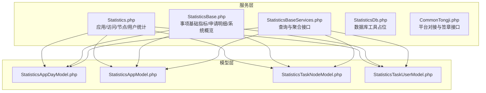
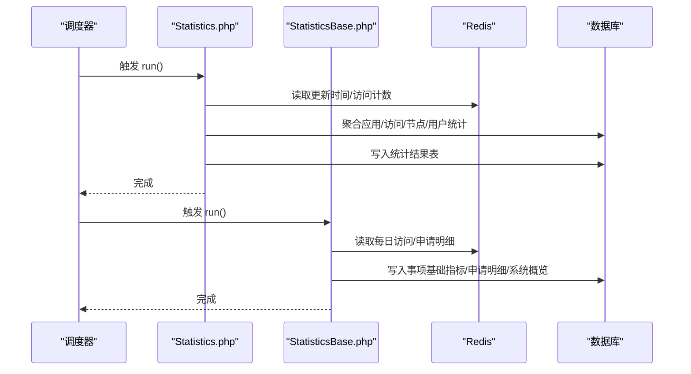
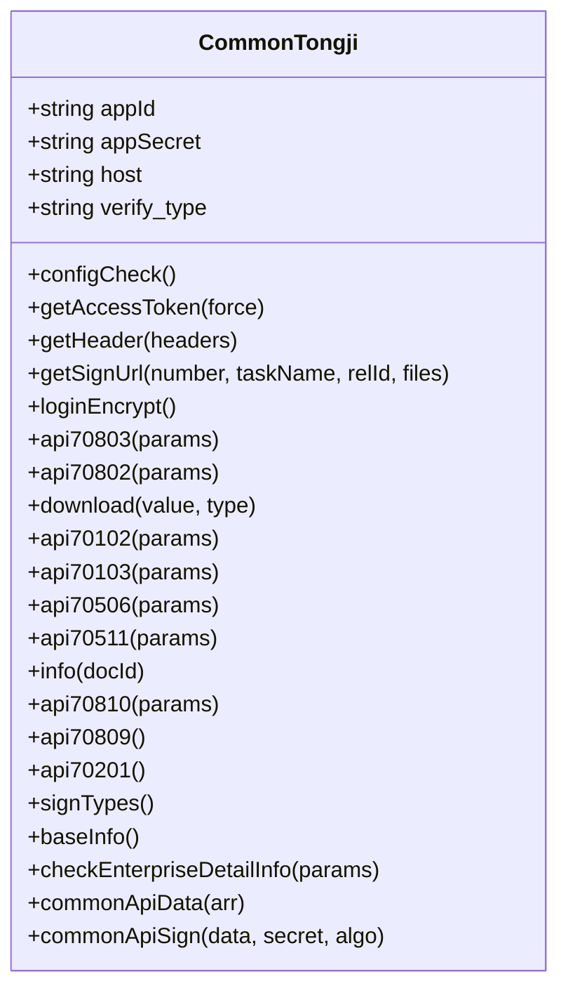
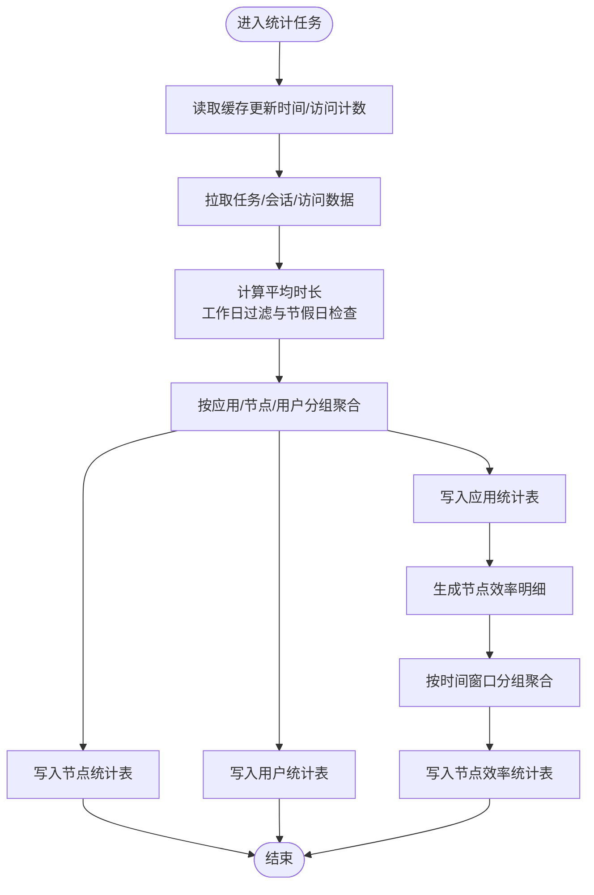
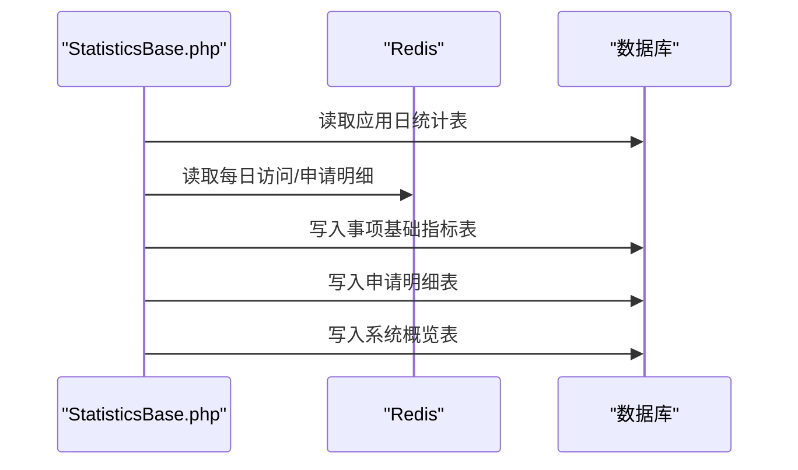
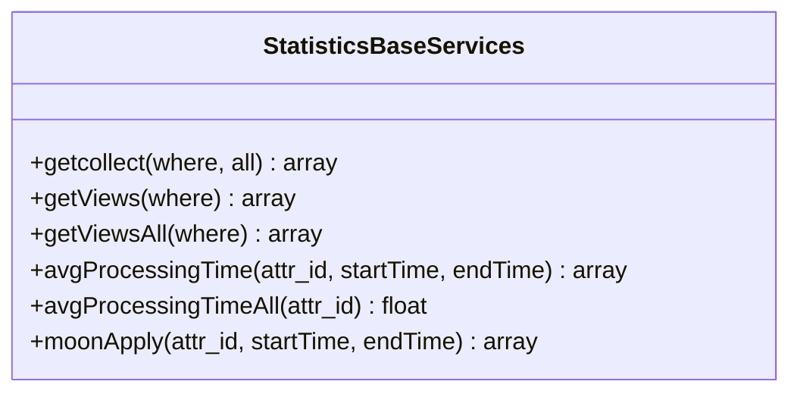
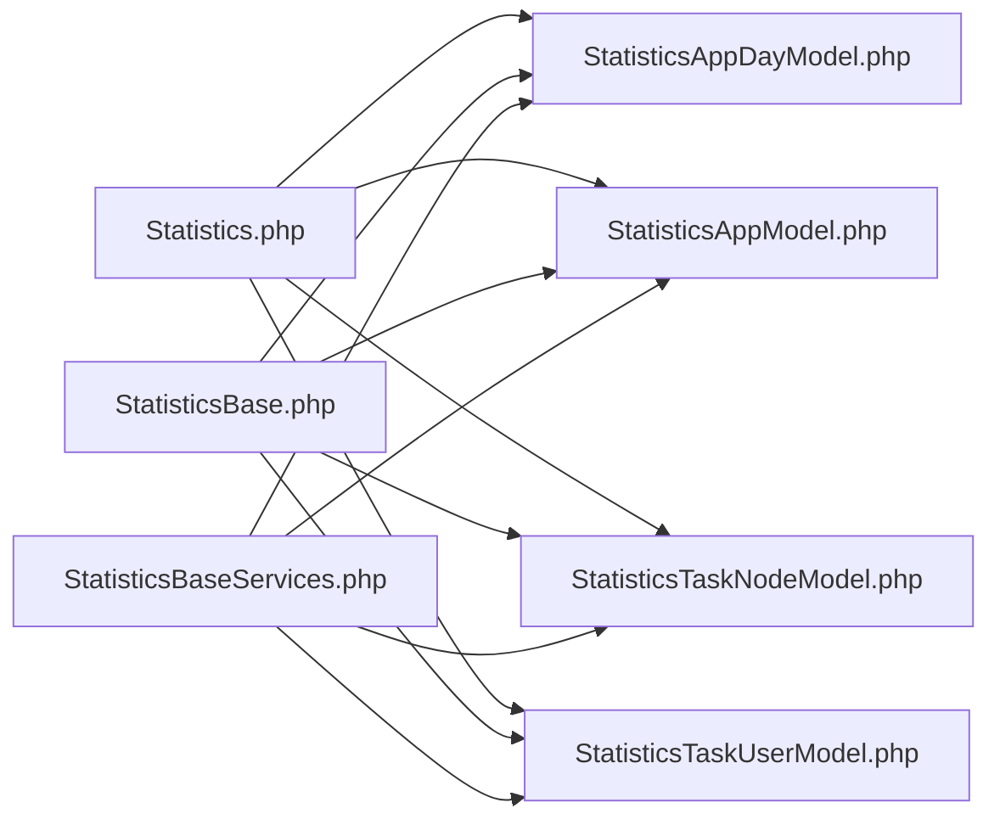

# 通用统计服务

<cite>
**本文引用的文件**
- [CommonTongji.php](file://process/src/services/platform/CommonTongji.php)
- [Statistics.php](file://process/src/services/Statistics.php)
- [StatisticsBase.php](file://process/src/services/StatisticsBase.php)
- [StatisticsDb.php](file://process/src/services/StatisticsDb.php)
- [StatisticsBaseServices.php](file://process/src/services/StatisticsBaseServices.php)
- [StatisticsAppDayModel.php](file://process/src/models/StatisticsAppDayModel.php)
- [StatisticsAppModel.php](file://process/src/models/StatisticsAppModel.php)
- [StatisticsTaskNodeModel.php](file://process/src/models/StatisticsTaskNodeModel.php)
- [StatisticsTaskUserModel.php](file://process/src/models/StatisticsTaskUserModel.php)
</cite>

## 目录
1. [简介](#简介)
2. [项目结构](#项目结构)
3. [核心组件](#核心组件)
4. [架构总览](#架构总览)
5. [详细组件分析](#详细组件分析)
6. [依赖关系分析](#依赖关系分析)
7. [性能考量](#性能考量)
8. [故障排查指南](#故障排查指南)
9. [结论](#结论)
10. [附录](#附录)

## 简介
本文件面向 htdNew 项目的通用统计服务，系统性梳理并解读以下模块的设计理念、架构实现与数据统计机制：
- 通用统计接口：CommonTongji.php 提供第三方平台对接与签章相关统计能力的抽象与示例。
- 统计计算逻辑：Statistics.php 实现应用维度、访问维度、任务节点与用户维度的统计聚合与落库。
- 基础统计功能：StatisticsBase.php 实现“事项基础指标”“申请明细”“系统概览”等基础统计口径。
- 统计数据库操作：StatisticsDb.php 作为数据库层工具类的占位入口，承载后续扩展。
- 统计服务封装：StatisticsBaseServices.php 提供对外查询与聚合接口，支撑报表与前端展示。

本文件还涵盖统计服务的数据采集策略、计算算法（含工作日时长与节假日过滤）、结果存储机制、性能优化与缓存策略、并发处理能力，以及扩展接口与自定义统计规则的实现方法。

## 项目结构
通用统计服务主要分布在 services 与 models 两大目录：
- services 层：统计任务调度与计算逻辑（Statistics.php、StatisticsBase.php、StatisticsDb.php、StatisticsBaseServices.php），以及平台对接示例（CommonTongji.php）。
- models 层：统计结果对应的模型定义（StatisticsAppDayModel.php、StatisticsAppModel.php、StatisticsTaskNodeModel.php、StatisticsTaskUserModel.php）。

图表来源
- [Statistics.php](file://process/src/services/Statistics.php#L1-L120)
- [StatisticsBase.php](file://process/src/services/StatisticsBase.php#L1-L120)
- [StatisticsBaseServices.php](file://process/src/services/StatisticsBaseServices.php#L1-L120)
- [StatisticsDb.php](file://process/src/services/StatisticsDb.php#L1-L22)
- [CommonTongji.php](file://process/src/services/platform/CommonTongji.php#L1-L120)
- [StatisticsAppDayModel.php](file://process/src/models/StatisticsAppDayModel.php#L1-L47)
- [StatisticsAppModel.php](file://process/src/models/StatisticsAppModel.php#L1-L80)
- [StatisticsTaskNodeModel.php](file://process/src/models/StatisticsTaskNodeModel.php#L1-L40)
- [StatisticsTaskUserModel.php](file://process/src/models/StatisticsTaskUserModel.php#L1-L43)

章节来源
- [Statistics.php](file://process/src/services/Statistics.php#L1-L120)
- [StatisticsBase.php](file://process/src/services/StatisticsBase.php#L1-L120)

## 核心组件
- 通用统计接口（CommonTongji.php）
  - 提供平台对接能力与签章相关接口示例，包含令牌获取、请求头注入、业务类型校验、CA 接口签名等。
  - 支持多种签章类型与用户标识方式配置，具备配置校验与异常抛出机制。
- 统计计算逻辑（Statistics.php）
  - 应用维度：日申请、累计统计、访问量、催办/超时/驳回、平均时长等。
  - 访问维度：基于 Redis BitMap 与计数器统计 PC/移动端访问与点击。
  - 节点与用户维度：按节点与审批人聚合完成数、耗时、最大/最小耗时、工作日耗时等。
  - 效能维度：节点效率明细与汇总，支持按时间窗口分组与节假日过滤。
- 基础统计功能（StatisticsBase.php）
  - 事项基础指标：日申请量、访问量、办结量、审批量等，按 attr_id 汇总。
  - 申请明细：按申请人维度统计，包含身份、部门、设备类型等。
  - 系统概览：整站访问与点击统计。
- 统计数据库操作（StatisticsDb.php）
  - 当前为工具类占位，后续可扩展数据库连接、事务与批量写入策略。
- 统计服务封装（StatisticsBaseServices.php）
  - 对外提供总体运行情况、终端访问情况、平均处理时长、月度申请趋势等聚合查询接口。

章节来源
- [CommonTongji.php](file://process/src/services/platform/CommonTongji.php#L120-L220)
- [Statistics.php](file://process/src/services/Statistics.php#L170-L260)
- [StatisticsBase.php](file://process/src/services/StatisticsBase.php#L90-L170)
- [StatisticsBaseServices.php](file://process/src/services/StatisticsBaseServices.php#L35-L122)

## 架构总览
通用统计服务采用“任务驱动 + 缓存先行 + 模型落库”的架构模式：
- 任务驱动：Statistics.php 与 StatisticsBase.php 继承任务基类，定时或手动触发统计任务。
- 缓存先行：大量访问与实时计数通过 Redis 快速累积，减少数据库压力；部分热点数据设置短 TTL。
- 模型落库：将聚合结果写入对应统计模型，形成稳定的历史数据集，供查询与报表使用。

图表来源
- [Statistics.php](file://process/src/services/Statistics.php#L30-L70)
- [StatisticsBase.php](file://process/src/services/StatisticsBase.php#L25-L60)

## 详细组件分析

### 通用统计接口（CommonTongji.php）
- 设计理念
  - 将第三方平台对接抽象为可配置的平台对象，集中处理令牌获取、请求头注入、业务类型校验与 CA 接口签名。
  - 通过配置项控制签章类型、用户标识方式与 CA 环境，确保不同部署环境的一致行为。
- 关键能力
  - 令牌获取与缓存：通过 host、appId、appSecret 获取 accessToken，并缓存至 Redis。
  - 签章与业务接口：提供获取签章 URL、静默签、拖拽签、文件下载、企业/人员信息查询、流程列表、业务类型查询等接口。
  - CA 通用接口：封装公共请求体与签名算法，支持多环境切换。
- 错误处理
  - 在配置校验阶段抛出用户异常，提示错误原因，便于快速定位问题。

图表来源
- [CommonTongji.php](file://process/src/services/platform/CommonTongji.php#L120-L220)
- [CommonTongji.php](file://process/src/services/platform/CommonTongji.php#L260-L420)
- [CommonTongji.php](file://process/src/services/platform/CommonTongji.php#L460-L540)
- [CommonTongji.php](file://process/src/services/platform/CommonTongji.php#L560-L650)
- [CommonTongji.php](file://process/src/services/platform/CommonTongji.php#L690-L775)

章节来源
- [CommonTongji.php](file://process/src/services/platform/CommonTongji.php#L120-L220)
- [CommonTongji.php](file://process/src/services/platform/CommonTongji.php#L260-L420)
- [CommonTongji.php](file://process/src/services/platform/CommonTongji.php#L460-L540)
- [CommonTongji.php](file://process/src/services/platform/CommonTongji.php#L560-L650)
- [CommonTongji.php](file://process/src/services/platform/CommonTongji.php#L690-L775)

### 统计计算逻辑（Statistics.php）
- 设计理念
  - 分层统计：先按任务历史与会话数据聚合，再写入应用/节点/用户等统计表，形成“明细 → 汇总”的闭环。
  - 缓存优先：访问量、点击量、未合并访问数均通过 Redis 快速累积，降低数据库写入压力。
- 关键流程
  - 应用统计：日申请、累计统计、访问量、催办/超时/驳回、平均时长等指标按应用维度计算并落库。
  - 访问统计：基于 Redis BitMap 统计访问人数，基于计数器统计访问次数，按日归档。
  - 节点与用户统计：按节点与审批人维度聚合完成数、耗时、最大/最小耗时、工作日耗时等。
  - 效能统计：节点效率明细与汇总，支持按 6/3/1 个月窗口分组，计算超时、催办、工作日耗时等。
- 计算算法
  - 平均时长：支持总体时长与工作日时长两种口径，按小时切片累加有效时长，考虑节假日过滤。
  - 工作日过滤：对跨小时区间逐小时判断是否节假日，仅计入有效时段。
  - 月/日周期：提供日期周期生成器，支持按日/月粒度聚合。

图表来源
- [Statistics.php](file://process/src/services/Statistics.php#L170-L260)
- [Statistics.php](file://process/src/services/Statistics.php#L220-L317)
- [Statistics.php](file://process/src/services/Statistics.php#L319-L435)
- [Statistics.php](file://process/src/services/Statistics.php#L437-L601)
- [Statistics.php](file://process/src/services/Statistics.php#L606-L667)
- [Statistics.php](file://process/src/services/Statistics.php#L669-L815)
- [Statistics.php](file://process/src/services/Statistics.php#L866-L1029)

章节来源
- [Statistics.php](file://process/src/services/Statistics.php#L170-L260)
- [Statistics.php](file://process/src/services/Statistics.php#L220-L317)
- [Statistics.php](file://process/src/services/Statistics.php#L319-L435)
- [Statistics.php](file://process/src/services/Statistics.php#L437-L601)
- [Statistics.php](file://process/src/services/Statistics.php#L606-L667)
- [Statistics.php](file://process/src/services/Statistics.php#L669-L815)
- [Statistics.php](file://process/src/services/Statistics.php#L866-L1029)

### 基础统计功能（StatisticsBase.php）
- 设计理念
  - 以“事项属性”为维度，建立统一的指标口径，支持按日/按月/按年汇总。
  - 将访问量、申请量、办结量、审批量等基础指标标准化，便于跨应用对比。
- 关键流程
  - 事项基础指标：按日从应用日统计表聚合访问量、申请量、办结量、审批量等，写入事项基础统计表。
  - 申请明细：按申请人维度写入申请明细表，包含身份、部门、设备类型、处理时长等。
  - 系统概览：从缓存与历史数据汇总整站访问与点击情况。
- 汇总与去重
  - 通过 distinct 计数与 Redis BitMap 去重，保证访问人数与申请人数准确。

图表来源
- [StatisticsBase.php](file://process/src/services/StatisticsBase.php#L90-L170)
- [StatisticsBase.php](file://process/src/services/StatisticsBase.php#L166-L214)
- [StatisticsBase.php](file://process/src/services/StatisticsBase.php#L217-L294)
- [StatisticsBase.php](file://process/src/services/StatisticsBase.php#L296-L375)

章节来源
- [StatisticsBase.php](file://process/src/services/StatisticsBase.php#L90-L170)
- [StatisticsBase.php](file://process/src/services/StatisticsBase.php#L166-L214)
- [StatisticsBase.php](file://process/src/services/StatisticsBase.php#L217-L294)
- [StatisticsBase.php](file://process/src/services/StatisticsBase.php#L296-L375)

### 统计服务封装（StatisticsBaseServices.php）
- 设计理念
  - 对外提供统一查询接口，屏蔽底层统计表结构差异，支持按条件聚合与时间范围筛选。
- 关键能力
  - 总体运行情况：支持“自上线以来”与“本月”两种口径，返回总访问、总申请、总办结、总访问人数、待办、年度办结率等。
  - 终端访问情况：返回移动端与桌面端访问量。
  - 平均处理时长：按月聚合申请处理时长，输出平均值序列。
  - 月度申请趋势：按月聚合申请总量，输出趋势序列。

图表来源
- [StatisticsBaseServices.php](file://process/src/services/StatisticsBaseServices.php#L35-L122)
- [StatisticsBaseServices.php](file://process/src/services/StatisticsBaseServices.php#L124-L242)

章节来源
- [StatisticsBaseServices.php](file://process/src/services/StatisticsBaseServices.php#L35-L122)
- [StatisticsBaseServices.php](file://process/src/services/StatisticsBaseServices.php#L124-L242)

### 统计数据库操作（StatisticsDb.php）
- 设计理念
  - 作为数据库层工具类占位，后续可扩展连接池、事务控制、批量写入、分库分表等能力。
- 当前状态
  - 仅声明使用单例 Trait，未实现具体方法。

章节来源
- [StatisticsDb.php](file://process/src/services/StatisticsDb.php#L1-L22)

## 依赖关系分析
- 组件耦合
  - Statistics.php 与 StatisticsBase.php 均依赖 Redis 与数据库，前者侧重应用/访问/节点/用户统计，后者侧重事项基础指标与系统概览。
  - StatisticsBaseServices.php 依赖各统计模型与 Redis 缓存，提供统一查询接口。
- 外部依赖
  - Redis：访问计数、BitMap、未合并访问数、更新时间等。
  - 数据库：PostgreSQL/通用 SQL，支持 upsert 与表达式更新。
- 潜在循环依赖
  - 服务层与模型层双向依赖（服务调用模型，模型可能读取缓存），但无直接循环调用，风险可控。

图表来源
- [Statistics.php](file://process/src/services/Statistics.php#L1-L120)
- [StatisticsBase.php](file://process/src/services/StatisticsBase.php#L1-L120)
- [StatisticsBaseServices.php](file://process/src/services/StatisticsBaseServices.php#L1-L120)
- [StatisticsAppDayModel.php](file://process/src/models/StatisticsAppDayModel.php#L1-L47)
- [StatisticsAppModel.php](file://process/src/models/StatisticsAppModel.php#L1-L80)
- [StatisticsTaskNodeModel.php](file://process/src/models/StatisticsTaskNodeModel.php#L1-L40)
- [StatisticsTaskUserModel.php](file://process/src/models/StatisticsTaskUserModel.php#L1-L43)

章节来源
- [Statistics.php](file://process/src/services/Statistics.php#L1-L120)
- [StatisticsBase.php](file://process/src/services/StatisticsBase.php#L1-L120)
- [StatisticsBaseServices.php](file://process/src/services/StatisticsBaseServices.php#L1-L120)

## 性能考量
- 缓存策略
  - 访问量与点击量：使用 Redis 计数器与 BitMap，按日维度键空间组织，避免热点冲突。
  - 未合并访问数：通过独立键与短 TTL 缓存，定期合并至统计表。
  - 应用访问数：模型层提供缓存读取与回源降级，减少数据库查询。
- 写入优化
  - PostgreSQL：使用 upsert 语法与表达式更新，减少多次往返。
  - 其他数据库：使用条件更新与插入，避免重复查询。
- 时间窗口与分组
  - 节点效率按 6/3/1 个月窗口分组，避免全量扫描；平均时长按小时切片，提高计算效率。
- 并发处理
  - 通过 Redis 原子计数与 BitMap 设置，保证高并发下的数据一致性。
  - 统计任务采用增量更新策略，基于上次更新时间切分数据，降低锁竞争。

[本节为通用性能讨论，不直接分析具体文件]

## 故障排查指南
- 常见问题
  - 统计未更新：检查 Redis 中更新时间键是否存在，确认统计任务是否正常执行。
  - 访问量异常：核对 Redis 计数器与 BitMap 键命名与维度，确认未合并访问数是否及时清理。
  - 平均时长异常：检查节假日配置与工作日过滤逻辑，确认任务历史数据完整性。
- 日志与告警
  - 统计任务捕获异常并记录日志，定位文件、消息与行号，便于快速修复。
- 平台对接
  - CommonTongji.php 在配置校验阶段抛出用户异常，需检查 appId/appSecret/host 与 CA 配置。

章节来源
- [Statistics.php](file://process/src/services/Statistics.php#L157-L171)
- [Statistics.php](file://process/src/services/Statistics.php#L312-L317)
- [CommonTongji.php](file://process/src/services/platform/CommonTongji.php#L150-L186)

## 结论
通用统计服务通过“任务驱动 + 缓存先行 + 模型落库”的架构，实现了从原始数据到指标报表的高效转换。Statistics.php 与 StatisticsBase.php 覆盖应用、访问、节点、用户与事项基础指标等多维统计，配合 StatisticsBaseServices.php 的统一查询接口，满足日常运营与决策分析需求。未来可在 StatisticsDb.php 中完善数据库层能力，并持续优化缓存键设计与写入策略，以应对更大规模的数据增长。

[本节为总结性内容，不直接分析具体文件]

## 附录
- 扩展接口建议
  - 新增统计口径：在 Statistics.php 或 StatisticsBase.php 中新增方法，遵循“增量更新 + 缓存 + 落库”的模式。
  - 自定义统计规则：在 Statistics.php 的 getAvgTime 中扩展节假日与工作日逻辑，或引入更复杂的时长计算规则。
  - 数据库优化：在 StatisticsDb.php 中实现批量写入、事务控制与索引优化。
- 自定义统计规则实现方法
  - 在 Statistics.php 中新增计算方法，复用现有 Redis 与模型层能力，确保与既有统计口径一致。
  - 在 StatisticsBase.php 中新增指标聚合逻辑，保持 attr_id 与日期维度的一致性。

[本节为概念性内容，不直接分析具体文件]