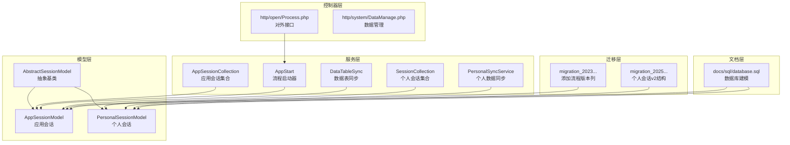
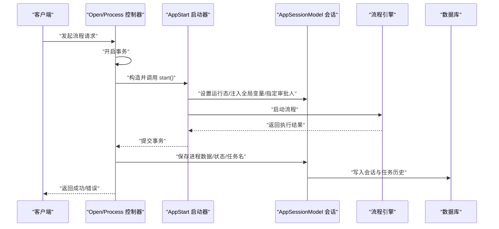
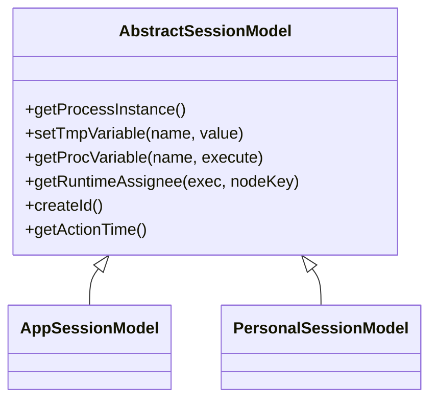
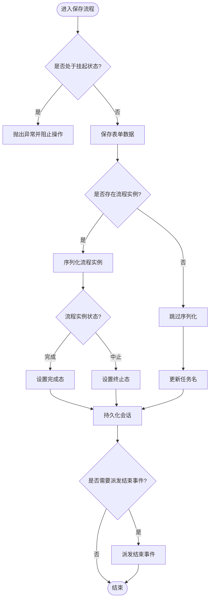
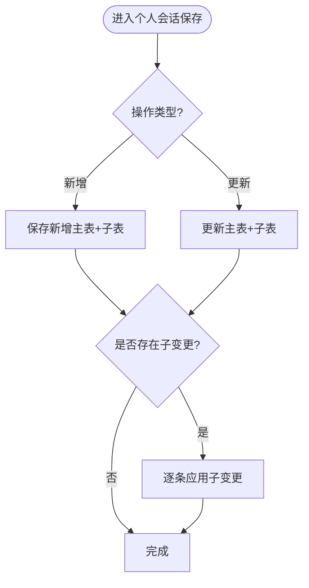
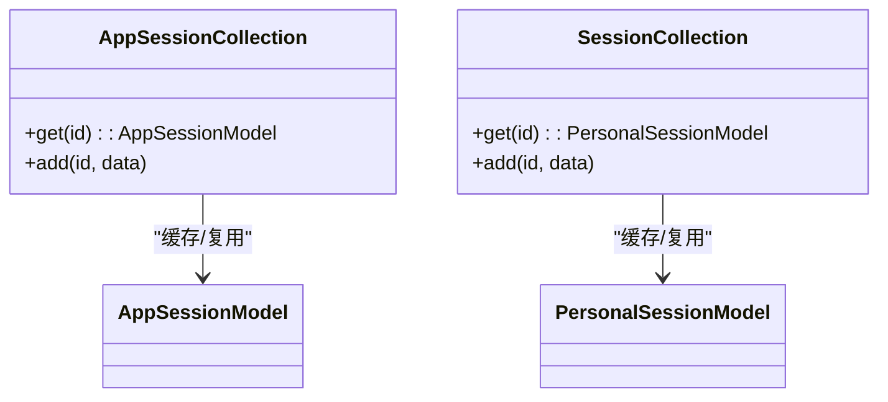
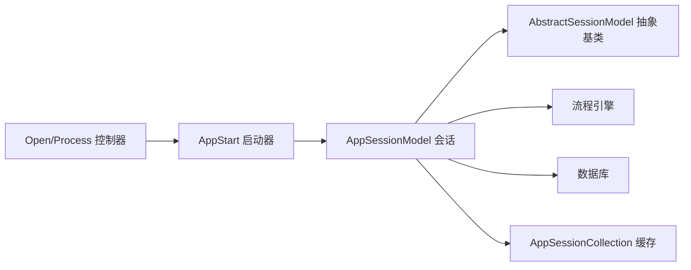

# 会话管理

<cite>
**本文引用的文件**
- [process/src/models/AppSessionModel.php](file://process/src/models/AppSessionModel.php)
- [process/src/models/PersonalSessionModel.php](file://process/src/models/PersonalSessionModel.php)
- [process/src/models/AbstractSessionModel.php](file://process/src/models/AbstractSessionModel.php)
- [process/src/services/AppSessionCollection.php](file://process/src/services/AppSessionCollection.php)
- [process/src/services/personal/SessionCollection.php](file://process/src/services/personal/SessionCollection.php)
- [process/src/migrations/migration_20230530_100642_session_add_prov_version.php](file://process/src/migrations/migration_20230530_100642_session_add_prov_version.php)
- [process/src/migrations/migration_20250730_102435_personal_v2.php](file://process/src/migrations/migration_20250730_102435_personal_v2.php)
- [process/docs/sql/database.sql](file://process/docs/sql/database.sql)
- [process/src/http/open/Process.php](file://process/src/http/open/Process.php)
- [process/src/services/AppStart.php](file://process/src/services/AppStart.php)
- [process/src/http/system/DataManage.php](file://process/src/http/system/DataManage.php)
- [process/src/models/TaskTrait.php](file://process/src/models/TaskTrait.php)
- [process/src/services/desktopManage/PersonalSyncService.php](file://process/src/services/desktopManage/PersonalSyncService.php)
- [process/src/services/task/DataTableSync.php](file://process/src/services/task/DataTableSync.php)
</cite>

## 目录
1. [简介](#简介)
2. [项目结构](#项目结构)
3. [核心组件](#核心组件)
4. [架构总览](#架构总览)
5. [详细组件分析](#详细组件分析)
6. [依赖分析](#依赖分析)
7. [性能考虑](#性能考虑)
8. [故障排查指南](#故障排查指南)
9. [结论](#结论)
10. [附录](#附录)

## 简介
本文件系统性梳理 htdNew 项目中的“会话管理”能力，围绕应用会话与个人会话两条主线展开，重点覆盖以下方面：
- 会话生命周期管理：创建、状态跟踪、数据采集与持久化、撤销/中止/完成等关键节点
- 会话集合类：单例缓存、批量操作、状态同步与数据聚合
- 会话状态模型：状态枚举、状态转换与验证规则
- 会话与流程实例的关系：会话绑定、流程启动、状态联动
- 开发指南：生命周期最佳实践、性能优化与并发控制策略

## 项目结构
会话相关代码主要分布在以下模块：
- 模型层：抽象会话基类与两类具体会话模型（应用会话、个人会话）
- 服务层：会话集合缓存、流程启动器、数据采集与同步工具
- 迁移层：数据库表结构演进与索引优化
- 控制器层：对外接口中触发流程启动与状态更新
- 文档层：数据库建模说明

图表来源
- [process/src/models/AppSessionModel.php](file://process/src/models/AppSessionModel.php#L1-L120)
- [process/src/models/PersonalSessionModel.php](file://process/src/models/PersonalSessionModel.php#L1-L120)
- [process/src/models/AbstractSessionModel.php](file://process/src/models/AbstractSessionModel.php#L1-L120)
- [process/src/services/AppSessionCollection.php](file://process/src/services/AppSessionCollection.php#L1-L32)
- [process/src/services/personal/SessionCollection.php](file://process/src/services/personal/SessionCollection.php#L1-L27)
- [process/src/services/AppStart.php](file://process/src/services/AppStart.php#L172-L199)
- [process/src/http/open/Process.php](file://process/src/http/open/Process.php#L108-L140)
- [process/src/migrations/migration_20230530_100642_session_add_prov_version.php](file://process/src/migrations/migration_20230530_100642_session_add_prov_version.php#L1-L27)
- [process/src/migrations/migration_20250730_102435_personal_v2.php](file://process/src/migrations/migration_20250730_102435_personal_v2.php#L80-L160)
- [process/docs/sql/database.sql](file://process/docs/sql/database.sql#L172-L201)

章节来源
- [process/src/models/AppSessionModel.php](file://process/src/models/AppSessionModel.php#L1-L120)
- [process/src/models/PersonalSessionModel.php](file://process/src/models/PersonalSessionModel.php#L1-L120)
- [process/src/models/AbstractSessionModel.php](file://process/src/models/AbstractSessionModel.php#L1-L120)

## 核心组件
- 抽象会话基类：统一流程实例加载、变量访问、审批人解析、时间一致性等通用逻辑
- 应用会话模型：承载应用实例的完整生命周期，包含状态枚举、撤销/中止/完成、快照、并发锁等
- 个人会话模型：面向个人数据中心的修改记录，支持主/子表批量落库、唯一性校验、权限与格式化展示
- 会话集合服务：协程单例缓存，按ID获取/复用会话实例，支撑批量操作与状态同步
- 流程启动器：负责流程启动前置准备、全局变量注入、初始审批人设定与启动
- 对外接口：封装事务、错误标记与流程启动入口
- 数据采集与同步：分页批量处理、父子表同步、批量提交与心跳更新

章节来源
- [process/src/models/AbstractSessionModel.php](file://process/src/models/AbstractSessionModel.php#L1-L284)
- [process/src/models/AppSessionModel.php](file://process/src/models/AppSessionModel.php#L96-L228)
- [process/src/models/PersonalSessionModel.php](file://process/src/models/PersonalSessionModel.php#L74-L122)
- [process/src/services/AppSessionCollection.php](file://process/src/services/AppSessionCollection.php#L1-L32)
- [process/src/services/personal/SessionCollection.php](file://process/src/services/personal/SessionCollection.php#L1-L27)
- [process/src/services/AppStart.php](file://process/src/services/AppStart.php#L172-L199)
- [process/src/http/open/Process.php](file://process/src/http/open/Process.php#L108-L140)
- [process/src/services/desktopManage/PersonalSyncService.php](file://process/src/services/desktopManage/PersonalSyncService.php#L450-L759)
- [process/src/services/task/DataTableSync.php](file://process/src/services/task/DataTableSync.php#L676-L703)

## 架构总览
下图展示了“会话管理”的端到端交互路径：控制器触发流程启动，启动器初始化流程并设置状态，引擎驱动流程推进，会话模型负责状态与数据的持久化。

图表来源
- [process/src/http/open/Process.php](file://process/src/http/open/Process.php#L108-L140)
- [process/src/services/AppStart.php](file://process/src/services/AppStart.php#L172-L199)
- [process/src/models/AppSessionModel.php](file://process/src/models/AppSessionModel.php#L456-L502)

## 详细组件分析

### 抽象会话基类（AbstractSessionModel）
- 职责
  - 统一流程实例加载与初始化
  - 提供临时/持久化流程变量读写
  - 解析运行时审批人，支持会签/顺序会签场景
  - 统一动作时间戳，保证同一操作的时间一致性
  - 会话ID生成策略
- 关键点
  - 流程实例序列化/反序列化存储于会话
  - 审批人优先从“指定审批人”映射中取，否则回退到节点配置
  - 通过协程上下文保证变量与时间的一致性

图表来源
- [process/src/models/AbstractSessionModel.php](file://process/src/models/AbstractSessionModel.php#L1-L284)
- [process/src/models/AppSessionModel.php](file://process/src/models/AppSessionModel.php#L642-L661)
- [process/src/models/PersonalSessionModel.php](file://process/src/models/PersonalSessionModel.php#L90-L107)

章节来源
- [process/src/models/AbstractSessionModel.php](file://process/src/models/AbstractSessionModel.php#L1-L284)

### 应用会话模型（AppSessionModel）
- 生命周期与状态
  - 状态枚举覆盖草稿、验证、运行中、完成、终止、撤销、驳回、等待支付等
  - 提供运行中/结束状态集合，便于筛选与判断
  - 支持挂起/恢复、撤销、中止、完成等终态处理
- 数据与快照
  - 表单数据的读取/合并/保存，支持覆盖与增量
  - 保存时根据流程实例状态自动更新会话状态
  - 收回操作基于快照回滚并清理后续任务
- 并发与权限
  - 保存前尝试获取会话级互斥锁
  - 提供多种读权限判定（发起人、代发起、附加用户、事项管理员、填报授权）

图表来源
- [process/src/models/AppSessionModel.php](file://process/src/models/AppSessionModel.php#L456-L502)
- [process/src/models/AppSessionModel.php](file://process/src/models/AppSessionModel.php#L569-L595)
- [process/src/models/AppSessionModel.php](file://process/src/models/AppSessionModel.php#L517-L549)

章节来源
- [process/src/models/AppSessionModel.php](file://process/src/models/AppSessionModel.php#L96-L228)
- [process/src/models/AppSessionModel.php](file://process/src/models/AppSessionModel.php#L300-L455)
- [process/src/models/AppSessionModel.php](file://process/src/models/AppSessionModel.php#L504-L595)

### 个人会话模型（PersonalSessionModel）
- 用途
  - 记录个人数据中心的修改（新增/更新/删除），支持主/子表批量落库
  - 通过唯一键约束去重，避免重复数据
  - 提供字段变更格式化展示，支持父子表差异对比
- 批量与聚合
  - 通过“个人子变更表”记录子表修改，最终一次性落库
  - 支持标签打标与来源标识，便于聚合与审计
- 权限与绑定
  - 与应用会话关联，继承应用会话的表单权限与维度权限
  - 支持桌面来源与个人来源的差异化权限

图表来源
- [process/src/models/PersonalSessionModel.php](file://process/src/models/PersonalSessionModel.php#L216-L362)
- [process/src/migrations/migration_20250730_102435_personal_v2.php](file://process/src/migrations/migration_20250730_102435_personal_v2.php#L84-L148)

章节来源
- [process/src/models/PersonalSessionModel.php](file://process/src/models/PersonalSessionModel.php#L74-L122)
- [process/src/models/PersonalSessionModel.php](file://process/src/models/PersonalSessionModel.php#L216-L362)
- [process/src/migrations/migration_20250730_102435_personal_v2.php](file://process/src/migrations/migration_20250730_102435_personal_v2.php#L84-L148)

### 会话集合类（AppSessionCollection / SessionCollection）
- 设计
  - 协程单例缓存，按ID懒加载并复用会话实例
  - 适用于高频读取与批量操作场景，降低重复实例化成本
- 适用范围
  - 应用会话集合：跨模块共享应用会话实例
  - 个人会话集合：个人数据中心场景下的会话缓存

图表来源
- [process/src/services/AppSessionCollection.php](file://process/src/services/AppSessionCollection.php#L1-L32)
- [process/src/services/personal/SessionCollection.php](file://process/src/services/personal/SessionCollection.php#L1-L27)

章节来源
- [process/src/services/AppSessionCollection.php](file://process/src/services/AppSessionCollection.php#L1-L32)
- [process/src/services/personal/SessionCollection.php](file://process/src/services/personal/SessionCollection.php#L1-L27)

### 会话状态模型与转换
- 应用会话状态
  - 草稿/验证/运行中/完成/终止/撤销/驳回/等待支付等
  - 运行中集合与结束集合明确区分
- 个人会话状态
  - 初始化/成功/中止/撤销/驳回
- 状态转换
  - 由流程引擎驱动：完成/中止时自动更新会话状态
  - 人工操作：撤销、中止、收回等
- 状态验证
  - 撤销前检查当前节点是否允许撤销
  - 挂起状态下禁止操作

章节来源
- [process/src/models/AppSessionModel.php](file://process/src/models/AppSessionModel.php#L96-L228)
- [process/src/models/PersonalSessionModel.php](file://process/src/models/PersonalSessionModel.php#L74-L84)
- [process/src/models/AppSessionModel.php](file://process/src/models/AppSessionModel.php#L665-L703)

### 会话与流程实例的关系
- 绑定与启动
  - 启动器在启动前设置会话状态为运行中，并注入全局变量与初始审批人
  - 启动后将流程实例序列化保存至会话
- 状态联动
  - 流程实例结束后，根据状态自动设置会话为完成或终止
- 任务与会话
  - 任务模型通过会话ID关联，会话状态变化影响任务生命周期

章节来源
- [process/src/services/AppStart.php](file://process/src/services/AppStart.php#L172-L199)
- [process/src/models/TaskTrait.php](file://process/src/models/TaskTrait.php#L83-L102)
- [process/src/models/AppSessionModel.php](file://process/src/models/AppSessionModel.php#L456-L502)

### 数据采集与批量操作
- 个人数据同步
  - 分页处理主表与子表，每页批量提交，减少事务压力
  - 子表按当前页绑定值筛选并同步，最后统一提交
- 数据管理页面
  - 支持勾选多个应用字段，建立引用关系并保持字段顺序
  - 通过事务保障配置变更原子性

章节来源
- [process/src/services/desktopManage/PersonalSyncService.php](file://process/src/services/desktopManage/PersonalSyncService.php#L450-L759)
- [process/src/services/task/DataTableSync.php](file://process/src/services/task/DataTableSync.php#L676-L703)
- [process/src/http/system/DataManage.php](file://process/src/http/system/DataManage.php#L180-L379)

## 依赖分析
- 组件耦合
  - 会话模型依赖抽象基类提供的流程实例与变量能力
  - 启动器依赖会话模型设置状态与注入变量
  - 控制器通过事务包裹启动流程，失败时回滚并标记错误
- 外部依赖
  - 数据库：会话表、任务表、个人会话/子变更表、数据表等
  - 引擎：流程引擎对象与事件处理器
- 潜在风险
  - 会话ID生成与序列化需保证一致性
  - 并发场景下互斥锁与协程上下文时间戳需正确使用

图表来源
- [process/src/http/open/Process.php](file://process/src/http/open/Process.php#L108-L140)
- [process/src/services/AppStart.php](file://process/src/services/AppStart.php#L172-L199)
- [process/src/models/AppSessionModel.php](file://process/src/models/AppSessionModel.php#L642-L661)
- [process/src/models/AbstractSessionModel.php](file://process/src/models/AbstractSessionModel.php#L1-L120)
- [process/src/services/AppSessionCollection.php](file://process/src/services/AppSessionCollection.php#L1-L32)

章节来源
- [process/src/http/open/Process.php](file://process/src/http/open/Process.php#L108-L140)
- [process/src/services/AppStart.php](file://process/src/services/AppStart.php#L172-L199)
- [process/src/models/AppSessionModel.php](file://process/src/models/AppSessionModel.php#L642-L661)
- [process/src/models/AbstractSessionModel.php](file://process/src/models/AbstractSessionModel.php#L1-L120)

## 性能考虑
- 单例缓存
  - 使用协程单例缓存会话实例，减少重复实例化与数据库查询
- 分页批量
  - 个人数据同步采用分页+批量提交，降低事务持有时间
- 索引优化
  - 会话表与任务表建立必要索引，提升查询效率
- 互斥锁
  - 保存前尝试获取会话级互斥锁，避免并发写冲突
- 时间一致性
  - 通过协程上下文统一动作时间戳，确保事件与状态时间一致

章节来源
- [process/src/services/AppSessionCollection.php](file://process/src/services/AppSessionCollection.php#L1-L32)
- [process/src/services/personal/SessionCollection.php](file://process/src/services/personal/SessionCollection.php#L1-L27)
- [process/src/services/desktopManage/PersonalSyncService.php](file://process/src/services/desktopManage/PersonalSyncService.php#L450-L759)
- [process/src/migrations/migration_20250730_102435_personal_v2.php](file://process/src/migrations/migration_20250730_102435_personal_v2.php#L84-L106)
- [process/docs/sql/database.sql](file://process/docs/sql/database.sql#L172-L201)
- [process/src/models/AppSessionModel.php](file://process/src/models/AppSessionModel.php#L632-L641)

## 故障排查指南
- 启动失败
  - 检查是否存在“无可用出口”或“无人选”的异常标记，确认节点配置与审批人设置
- 撤销失败
  - 核对当前节点是否允许撤销；若不允许，需调整节点配置
- 挂起状态不可操作
  - 挂起状态下会话保存会被拒绝，需先恢复后再操作
- 收回失败
  - 快照不存在或已被他人修改会导致收回失败，需重新发起或联系管理员
- 并发冲突
  - 若出现互斥锁竞争，建议重试或优化业务流程减少同时写入

章节来源
- [process/src/http/open/Process.php](file://process/src/http/open/Process.php#L108-L140)
- [process/src/models/AppSessionModel.php](file://process/src/models/AppSessionModel.php#L665-L703)
- [process/src/models/AppSessionModel.php](file://process/src/models/AppSessionModel.php#L517-L549)
- [process/src/models/AppSessionModel.php](file://process/src/models/AppSessionModel.php#L456-L502)

## 结论
htdNew 的会话管理以“抽象基类 + 两类会话模型 + 会话集合 + 启动器 + 对外接口”为核心，形成完整的生命周期闭环。通过协程单例缓存、分页批量、索引优化与互斥锁等手段，在保证一致性的同时兼顾性能。个人会话在个人数据中心场景提供了强大的主/子表批量落库与权限聚合能力。建议在扩展新场景时遵循现有模式，统一使用抽象基类能力与启动器流程，确保状态与数据的一致性。

## 附录
- 数据库建模要点
  - 应用会话表包含应用/版本/流程版本/状态/快照/进程数据等字段
  - 个人会话v2引入来源标识、标签、子变更表等，支撑个人数据中心的复杂场景
- 迁移与演进
  - 早期迁移为会话表增加流程版本字段
  - v2迁移完善个人会话结构与索引，支持更细粒度的权限与审计

章节来源
- [process/docs/sql/database.sql](file://process/docs/sql/database.sql#L172-L201)
- [process/src/migrations/migration_20230530_100642_session_add_prov_version.php](file://process/src/migrations/migration_20230530_100642_session_add_prov_version.php#L1-L27)
- [process/src/migrations/migration_20250730_102435_personal_v2.php](file://process/src/migrations/migration_20250730_102435_personal_v2.php#L84-L148)