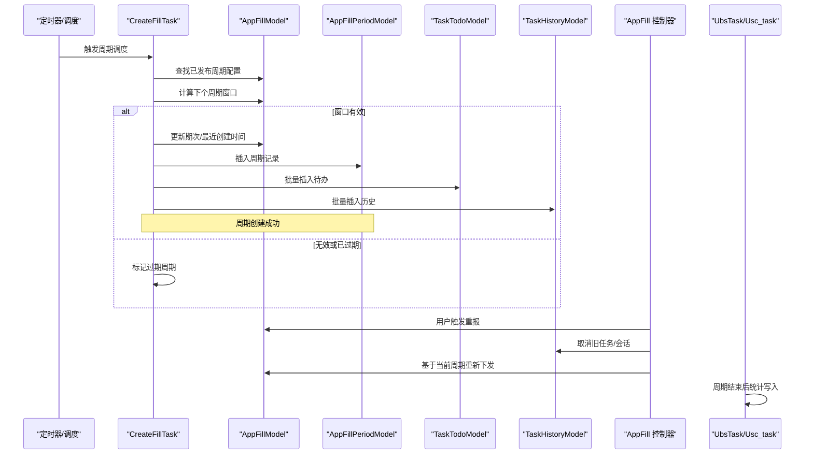
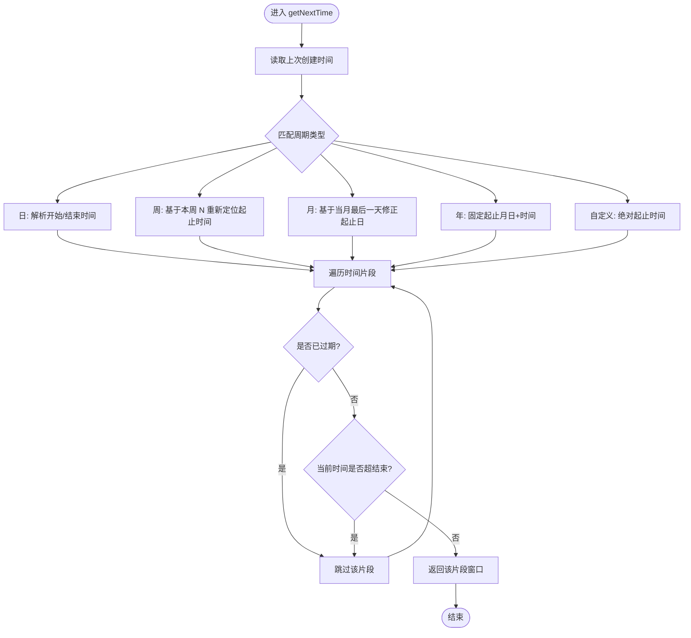
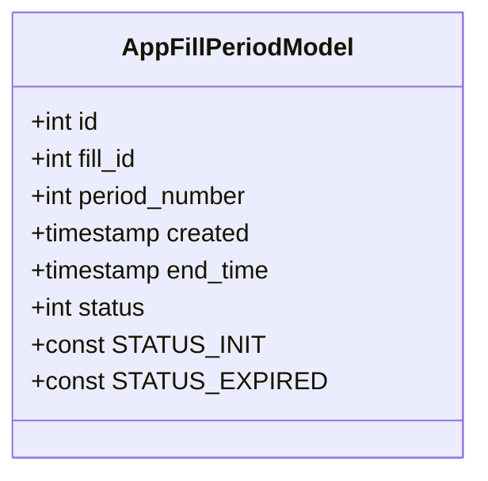
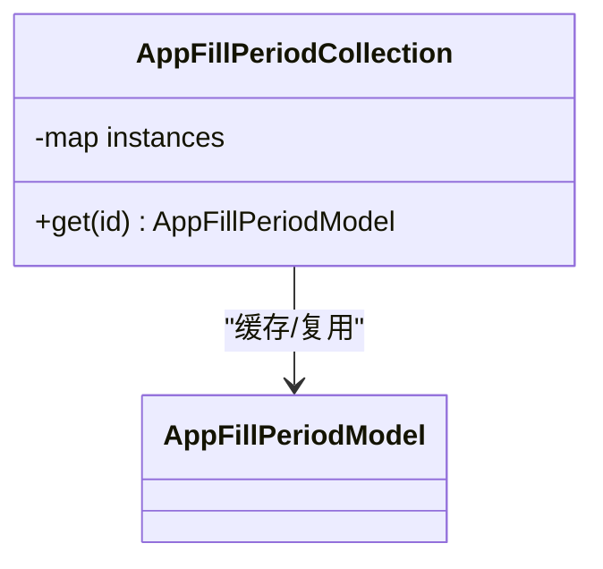
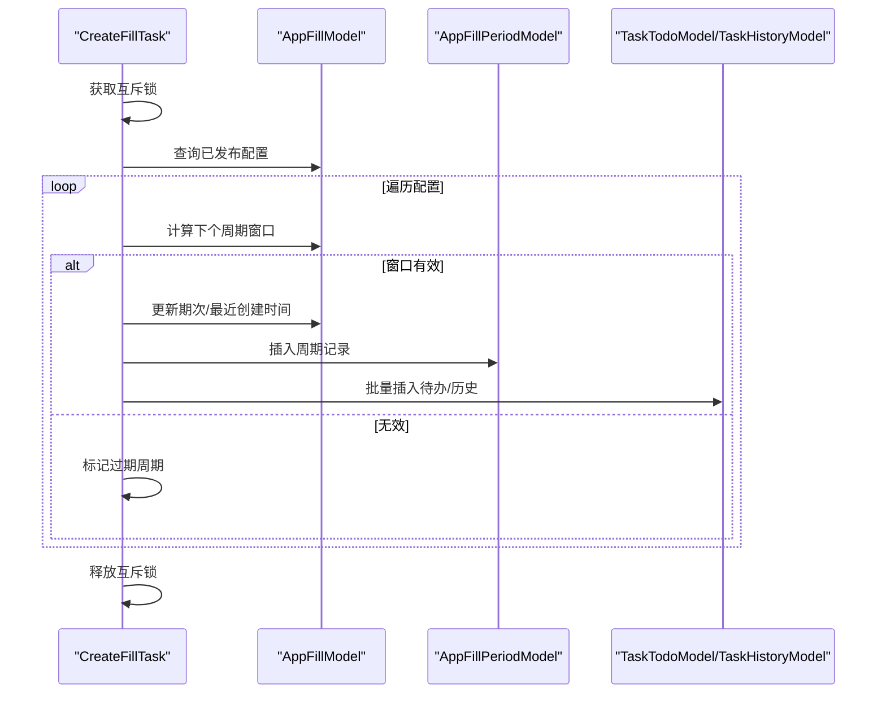
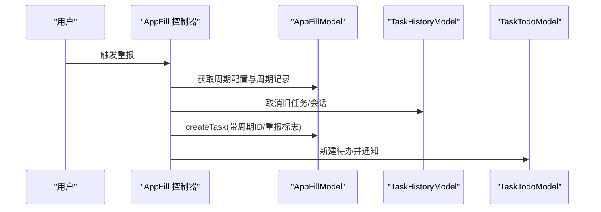
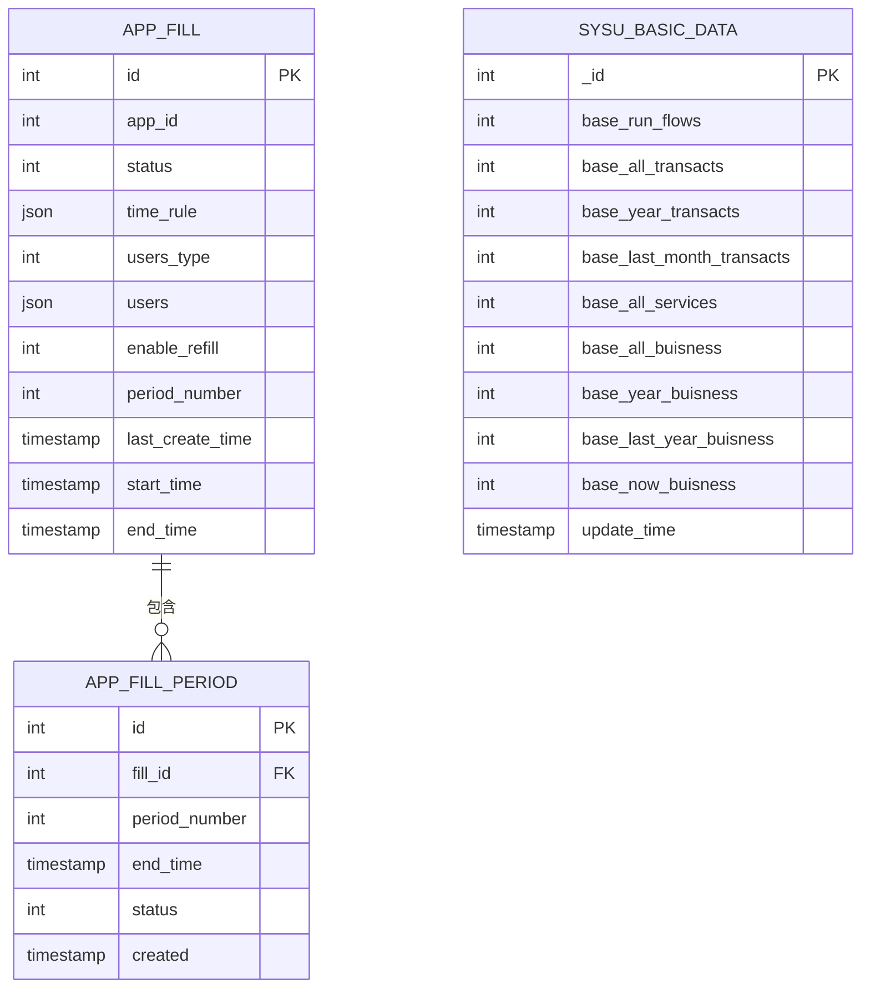
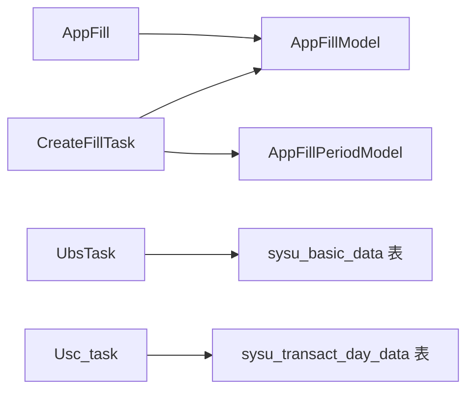

# 填充周期管理

<cite>
**本文引用的文件**
- [AppFillModel.php](file://process/src/models/AppFillModel.php)
- [AppFillPeriodModel.php](file://process/src/models/AppFillPeriodModel.php)
- [AppFillPeriodCollection.php](file://process/src/services/AppFillPeriodCollection.php)
- [CreateFillTask.php](file://process/src/services/task/CreateFillTask.php)
- [AppFill.php](file://process/src/http/site/AppFill.php)
- [database.sql](file://process/docs/sql/database.sql)
- [migration_20251024_22050_sysu.php](file://process/src/migrations/migration_20251024_22050_sysu.php)
- [UbsTask.php（sysu_test）](file://process_envs/sysu_test/product/task/UbsTask.php)
- [UbsTask.php（sysu_test2）](file://process_envs/sysu_test2/product/task/UbsTask.php)
- [UbsTask.php（sysu_test3）](file://process_envs/sysu_test3/product/task/UbsTask.php)
- [Usc_task.php](file://process_envs/sysu/product/task/Usc_task.php)
- [api.php](file://process/src/config/api.php)
</cite>

## 目录
1. [引言](#引言)
2. [项目结构](#项目结构)
3. [核心组件](#核心组件)
4. [架构总览](#架构总览)
5. [详细组件分析](#详细组件分析)
6. [依赖关系分析](#依赖关系分析)
7. [性能考虑](#性能考虑)
8. [故障排查指南](#故障排查指南)
9. [结论](#结论)
10. [附录](#附录)

## 引言
本文件围绕 htdNew 项目的“填充周期管理”能力，系统化阐述周期定义、数据收集与统计分析、周期集合类、周期模型与数据库表之间的关系，并给出使用示例与性能优化建议。该能力通过“周期”驱动定时任务下发、周期内任务执行与重报、以及周期结束后统计归档，形成完整的“周期—任务—统计”的闭环。

## 项目结构
与“填充周期管理”直接相关的核心文件分布如下：
- 模型层：AppFillModel（周期规则与任务下发）、AppFillPeriodModel（周期记录）
- 服务层：AppFillPeriodCollection（周期实例缓存）、CreateFillTask（周期调度与任务创建）
- 控制器/业务：AppFill（重报入口）、UbsTask/Usc_task（统计报表写入）
- 数据库：database.sql（周期表结构）、迁移脚本（统计表结构）

```mermaid
graph TB
subgraph "模型层"
M1["AppFillModel<br/>周期规则/任务下发"]
M2["AppFillPeriodModel<br/>周期记录"]
end
subgraph "服务层"
S1["AppFillPeriodCollection<br/>周期实例缓存"]
S2["CreateFillTask<br/>周期调度/任务创建/过期处理"]
end
subgraph "控制层/业务"
C1["AppFill<br/>重报入口"]
T1["UbsTask/Usc_task<br/>统计写入"]
end
subgraph "数据库"
D1["app_fill/app_fill_period<br/>周期表"]
D2["sysu_*_data<br/>统计表"]
end
M1 --> S2
M2 <- --> S2
S1 --> M2
S2 --> M2
S2 --> C1
C1 --> M1
T1 --> D2
M1 --> D1
M2 --> D1
```

图表来源
- [AppFillModel.php](file://process/src/models/AppFillModel.php#L1-L200)
- [AppFillPeriodModel.php](file://process/src/models/AppFillPeriodModel.php#L1-L36)
- [AppFillPeriodCollection.php](file://process/src/services/AppFillPeriodCollection.php#L1-L22)
- [CreateFillTask.php](file://process/src/services/task/CreateFillTask.php#L1-L161)
- [AppFill.php](file://process/src/http/site/AppFill.php#L168-L240)
- [database.sql](file://process/docs/sql/database.sql#L1866-L1875)

章节来源
- [AppFillModel.php](file://process/src/models/AppFillModel.php#L1-L200)
- [AppFillPeriodModel.php](file://process/src/models/AppFillPeriodModel.php#L1-L36)
- [AppFillPeriodCollection.php](file://process/src/services/AppFillPeriodCollection.php#L1-L22)
- [CreateFillTask.php](file://process/src/services/task/CreateFillTask.php#L1-L161)
- [AppFill.php](file://process/src/http/site/AppFill.php#L168-L240)
- [database.sql](file://process/docs/sql/database.sql#L1866-L1875)

## 核心组件
- 周期模型 AppFillModel
  - 负责周期规则解析、下一次周期窗口计算、任务下发与重报标志注入。
  - 关键点：周期类型（日/周/月/年/自定义）、时间片段、周末开关、用户/部门范围、是否启用重报、当前期次、最近创建时间等。
- 周期记录模型 AppFillPeriodModel
  - 记录某次周期的起止时间、状态、期次编号等，作为任务历史与统计的锚点。
- 周期集合类 AppFillPeriodCollection
  - 单例缓存周期模型实例，避免重复构造。
- 周期调度服务 CreateFillTask
  - 扫描已发布的周期配置，计算下一个周期窗口，批量创建待办与历史任务，同时标记过期周期。
- 重报入口 AppFill
  - 提供重报流程，取消旧会话与待办，基于当前周期重新下发任务并通知。
- 统计写入 UbsTask/Usc_task
  - 周期结束后，按年/月/日等维度统计业务量与人员分布，写入对应统计表。

章节来源
- [AppFillModel.php](file://process/src/models/AppFillModel.php#L1-L200)
- [AppFillPeriodModel.php](file://process/src/models/AppFillPeriodModel.php#L1-L36)
- [AppFillPeriodCollection.php](file://process/src/services/AppFillPeriodCollection.php#L1-L22)
- [CreateFillTask.php](file://process/src/services/task/CreateFillTask.php#L1-L161)
- [AppFill.php](file://process/src/http/site/AppFill.php#L168-L240)
- [Usc_task.php](file://process_envs/sysu/product/task/Usc_task.php#L340-L375)

## 架构总览
填充周期管理从“配置—调度—下发—重报—统计”全链路打通，形成稳定的周期闭环。



图表来源
- [CreateFillTask.php](file://process/src/services/task/CreateFillTask.php#L1-L161)
- [AppFillModel.php](file://process/src/models/AppFillModel.php#L120-L200)
- [AppFillPeriodModel.php](file://process/src/models/AppFillPeriodModel.php#L1-L36)
- [AppFill.php](file://process/src/http/site/AppFill.php#L168-L240)
- [Usc_task.php](file://process_envs/sysu/product/task/Usc_task.php#L340-L375)

## 详细组件分析

### 周期模型 AppFillModel
- 周期定义
  - 支持周期类型：日/周/月/年/自定义；每种类型支持一个或多个时间片段；可配置是否排除周末。
  - 时间片段格式随周期类型变化：日以“开始/结束时间”表示；周以“起止星期几+时间”表示；月以“起止日+时间”表示；年以“起止月日+时间”表示；自定义以“绝对起止时间”表示。
- 下次周期计算
  - 根据“上次创建时间”跳过已过期窗口，返回第一个尚未创建且当前时间未超过结束时间的窗口。
- 任务下发
  - 将周期窗口内的用户/部门拆解为待办与历史记录，注入周期 ID 与重报标志（如有）。
- 重报支持
  - 通过 flags 注入重报标识，配合重报入口完成重报流程。



图表来源
- [AppFillModel.php](file://process/src/models/AppFillModel.php#L120-L193)

章节来源
- [AppFillModel.php](file://process/src/models/AppFillModel.php#L1-L200)

### 周期记录模型 AppFillPeriodModel
- 字段说明
  - fill_id：所属周期配置 ID
  - period_number：期次编号（递增）
  - end_time：周期结束时间（用于剩余时间计算与过期判断）
  - status：周期状态（初始化/已过期）
  - created：创建时间
- 状态流转
  - 初始化 → 周期任务创建后保持初始化；若周期结束或配置结束，则标记为已过期。



图表来源
- [AppFillPeriodModel.php](file://process/src/models/AppFillPeriodModel.php#L1-L36)

章节来源
- [AppFillPeriodModel.php](file://process/src/models/AppFillPeriodModel.php#L1-L36)

### 周期集合类 AppFillPeriodCollection
- 单例缓存
  - 以周期配置 ID 为键缓存周期模型实例，避免重复构造。
- 使用场景
  - 在调度与重报流程中快速获取周期模型，减少重复初始化成本。



图表来源
- [AppFillPeriodCollection.php](file://process/src/services/AppFillPeriodCollection.php#L1-L22)

章节来源
- [AppFillPeriodCollection.php](file://process/src/services/AppFillPeriodCollection.php#L1-L22)

### 周期调度服务 CreateFillTask
- 主要职责
  - 扫描已发布周期配置，计算下个周期窗口，批量创建待办与历史任务。
  - 处理过期周期：对未完成的历史任务打上超时标志，更新周期状态为已过期。
- 关键流程
  - 加分布式互斥锁，避免并发重复执行。
  - 更新周期配置的期次与最近创建时间。
  - 插入周期记录，生成周期 ID。
  - 批量写入待办与历史任务，消息通知。
  - 扫描初始化周期，判定是否超时并标记。



图表来源
- [CreateFillTask.php](file://process/src/services/task/CreateFillTask.php#L1-L161)

章节来源
- [CreateFillTask.php](file://process/src/services/task/CreateFillTask.php#L1-L161)

### 重报入口 AppFill
- 流程要点
  - 校验任务状态与周期有效性。
  - 取消旧会话与待办，写入撤销日志。
  - 基于当前周期重新下发任务，并发送通知。



图表来源
- [AppFill.php](file://process/src/http/site/AppFill.php#L168-L240)

章节来源
- [AppFill.php](file://process/src/http/site/AppFill.php#L168-L240)

### 统计分析与数据收集
- 统计维度
  - 年/月/日维度的业务量与人员分布、终端使用情况、人群画像等。
- 写入策略
  - 周期结束后，按年/月/日等维度统计并写入对应统计表，部分环境提供多套统计任务脚本。
- 数据表结构
  - app_fill：周期配置表
  - app_fill_period：周期记录表
  - sysu_*_data：统计表（如年度/月度/近期/用户/终端等）



图表来源
- [database.sql](file://process/docs/sql/database.sql#L1866-L1875)
- [migration_20251024_22050_sysu.php](file://process/src/migrations/migration_20251024_22050_sysu.php#L34-L111)

章节来源
- [database.sql](file://process/docs/sql/database.sql#L1866-L1875)
- [migration_20251024_22050_sysu.php](file://process/src/migrations/migration_20251024_22050_sysu.php#L34-L111)
- [Usc_task.php](file://process_envs/sysu/product/task/Usc_task.php#L340-L375)

## 依赖关系分析
- 组件耦合
  - CreateFillTask 依赖 AppFillModel 的周期规则与任务下发逻辑，依赖 AppFillPeriodModel 的周期记录。
  - AppFill 控制器依赖 AppFillModel 的重报逻辑与周期记录。
  - 统计任务依赖 AppSessionModel 等业务模型进行计数与聚合。
- 外部依赖
  - 数据库：app_fill、app_fill_period、sysu_*_data 等。
  - 配置：API 文档中提供统计相关接口，便于前端调用。



图表来源
- [CreateFillTask.php](file://process/src/services/task/CreateFillTask.php#L1-L161)
- [AppFill.php](file://process/src/http/site/AppFill.php#L168-L240)
- [Usc_task.php](file://process_envs/sysu/product/task/Usc_task.php#L340-L375)
- [api.php](file://process/src/config/api.php#L802-L832)

章节来源
- [CreateFillTask.php](file://process/src/services/task/CreateFillTask.php#L1-L161)
- [AppFill.php](file://process/src/http/site/AppFill.php#L168-L240)
- [Usc_task.php](file://process_envs/sysu/product/task/Usc_task.php#L340-L375)
- [api.php](file://process/src/config/api.php#L802-L832)

## 性能考虑
- 批量写入
  - CreateFillTask 中采用批量插入待办与历史记录，降低数据库往返开销。
- 分布式互斥
  - 使用互斥锁避免并发重复调度，保障幂等。
- 索引优化
  - 周期表与统计表建立必要索引，提升查询与更新效率。
- 重报与过期处理
  - 对超时任务分批更新并打上标志，避免一次性大事务阻塞。

## 故障排查指南
- 周期未创建
  - 检查 AppFillModel 的周期规则与时间片段是否正确，确认“上次创建时间”是否导致窗口被跳过。
  - 确认 CreateFillTask 是否成功获取互斥锁并执行。
- 任务未下发
  - 核对用户/部门范围与职位 ID 是否匹配，确认 users_type 与 users 配置。
- 重报异常
  - 检查 AppFill 控制器中的取消旧会话与待办流程是否执行，确认 flags 是否包含重报标志。
- 统计缺失
  - 确认统计任务是否在周期结束后运行，检查统计表写入逻辑与时间范围。

章节来源
- [AppFillModel.php](file://process/src/models/AppFillModel.php#L120-L200)
- [CreateFillTask.php](file://process/src/services/task/CreateFillTask.php#L1-L161)
- [AppFill.php](file://process/src/http/site/AppFill.php#L168-L240)
- [Usc_task.php](file://process_envs/sysu/product/task/Usc_task.php#L340-L375)

## 结论
填充周期管理通过“周期规则—周期记录—任务下发—重报—统计”的完整链路，实现了稳定、可扩展的周期化数据收集与分析能力。建议在生产环境中完善监控与告警，持续优化批量写入与索引策略，确保高并发下的稳定性与性能。

## 附录
- 使用示例（步骤说明）
  - 配置周期：在 AppFillModel 中设置周期类型、时间片段、用户范围与是否启用重报。
  - 启动调度：确保 CreateFillTask 定时任务正常运行，观察 app_fill_period 是否按期创建。
  - 观察下发：检查待办与历史任务是否按预期批量插入。
  - 触发重报：在 AppFill 控制器中选择需要重报的任务，系统将基于当前周期重新下发。
  - 查看统计：周期结束后，查看 sysu_*_data 等统计表是否写入最新数据。
- 性能优化建议
  - 批量插入参数与批次大小根据数据库负载调整。
  - 为高频查询字段建立合适索引，避免全表扫描。
  - 对统计任务进行分区或分片，降低单次写入压力。