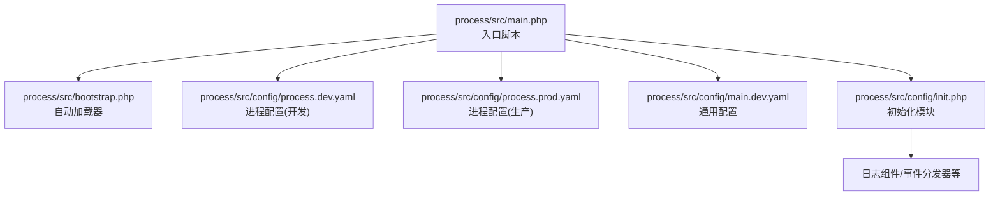
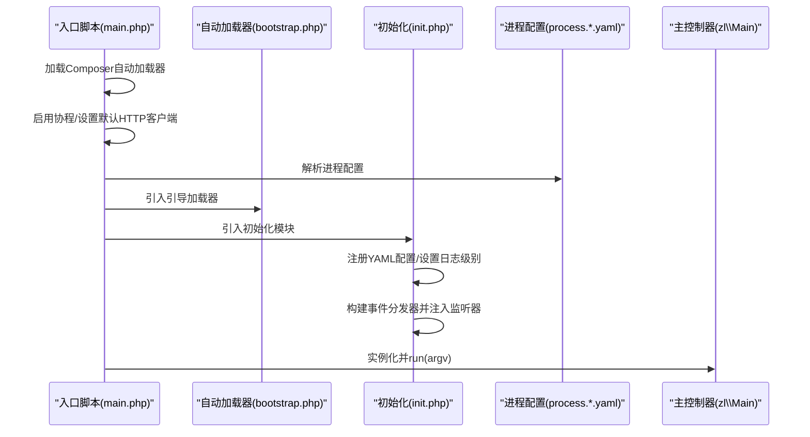
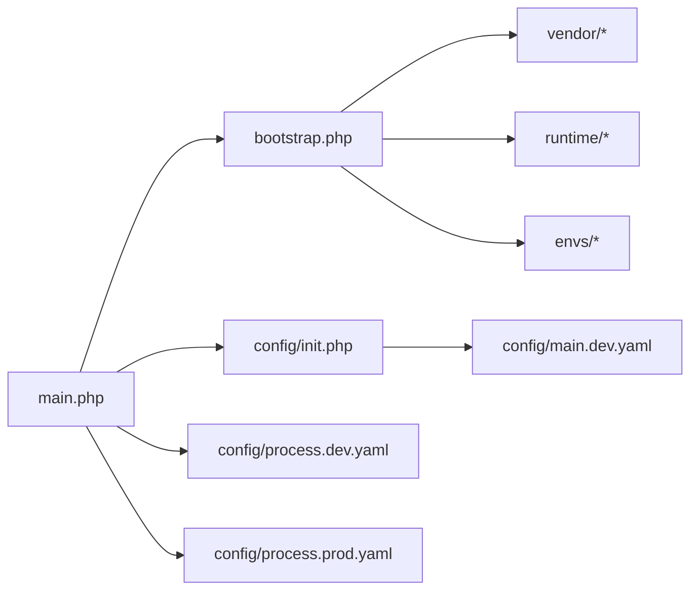

# 应用启动服务

<cite>
**本文引用的文件**
- [process\src\main.php](file://process\src\main.php)
- [process\src\bootstrap.php](file://process\src\bootstrap.php)
- [process\src\config\init.php](file://process\src\config\init.php)
- [process\src\config\process.dev.yaml](file://process\src\config\process.dev.yaml)
- [process\src\config\process.prod.yaml](file://process\src\config\process.prod.yaml)
- [process\src\config\main.dev.yaml](file://process\src\config\main.dev.yaml)
</cite>

## 目录
1. [引言](#引言)
2. [项目结构](#项目结构)
3. [核心组件](#核心组件)
4. [架构总览](#架构总览)
5. [详细组件分析](#详细组件分析)
6. [依赖关系分析](#依赖关系分析)
7. [性能考虑](#性能考虑)
8. [故障排除指南](#故障排除指南)
9. [结论](#结论)
10. [附录](#附录)

## 引言
本文件面向 htdNew 项目的“应用启动服务”，系统化梳理应用启动流程的设计与实现，覆盖启动条件检查、初始化过程、状态设置、启动策略、依赖检查与初始化顺序、与应用生命周期的关系（启动时机、失败处理与重试）、配置项（启动参数、超时、日志）以及使用与运维指南（启动流程、故障排除、性能监控）。文档以仓库中现有文件为依据，避免臆测，确保可追溯。

## 项目结构
应用启动相关的关键文件集中在 process\src 目录，主要由入口脚本、引导加载器、初始化模块与多套配置组成。入口脚本负责加载运行时、解析配置并委派到主控制器；引导加载器提供命名空间自动加载；初始化模块负责注册事件、设置日志级别等；配置文件定义进程模型、运行路径、日志路径、业务配置文件位置等。

图表来源
- [process\src\main.php](file://process\src\main.php#L1-L25)
- [process\src\bootstrap.php](file://process\src\bootstrap.php#L1-L40)
- [process\src\config\process.dev.yaml](file://process\src\config\process.dev.yaml#L1-L89)
- [process\src\config\process.prod.yaml](file://process\src\config\process.prod.yaml#L1-L80)
- [process\src\config\main.dev.yaml](file://process\src\config\main.dev.yaml#L1-L97)
- [process\src\config\init.php](file://process\src\config\init.php#L1-L48)

章节来源
- [process\src\main.php](file://process\src\main.php#L1-L25)
- [process\src\bootstrap.php](file://process\src\bootstrap.php#L1-L40)
- [process\src\config\process.dev.yaml](file://process\src\config\process.dev.yaml#L1-L89)
- [process\src\config\process.prod.yaml](file://process\src\config\process.prod.yaml#L1-L80)
- [process\src\config\main.dev.yaml](file://process\src\config\main.dev.yaml#L1-L97)
- [process\src\config\init.php](file://process\src\config\init.php#L1-L48)

## 核心组件
- 入口脚本：加载 Composer 自动加载器、启用协程、解析进程配置、设置默认 HTTP 客户端处理器、引入引导加载器，并调用主控制器执行。
- 引导加载器：基于命名空间与目录约定的自动加载，支持 vendor、runtime、envs 等路径映射。
- 初始化模块：注册 YAML 配置、设置日志级别、构建全局事件分发器并按环境注入事件监听器。
- 进程配置：定义运行时路径、日志路径、项目标识、客户与环境模型、命令行配置文件、各业务进程（主进程、HTTP、队列、定时任务等）的类、数量、CPU 亲和等。
- 通用配置：包含通用主机信息、HTTP 监听、数据库、Redis、权限、上传、日志、MQTT 等基础能力配置。

章节来源
- [process\src\main.php](file://process\src\main.php#L1-L25)
- [process\src\bootstrap.php](file://process\src\bootstrap.php#L1-L40)
- [process\src\config\init.php](file://process\src\config\init.php#L1-L48)
- [process\src\config\process.dev.yaml](file://process\src\config\process.dev.yaml#L1-L89)
- [process\src\config\process.prod.yaml](file://process\src\config\process.prod.yaml#L1-L80)
- [process\src\config\main.dev.yaml](file://process\src\config\main.dev.yaml#L1-L97)

## 架构总览
下图展示从入口到初始化再到进程配置的整体启动链路，体现启动时机、依赖与控制流。

图表来源
- [process\src\main.php](file://process\src\main.php#L1-L25)
- [process\src\bootstrap.php](file://process\src\bootstrap.php#L1-L40)
- [process\src\config\init.php](file://process\src\config\init.php#L1-L48)
- [process\src\config\process.dev.yaml](file://process\src\config\process.dev.yaml#L1-L89)
- [process\src\config\process.prod.yaml](file://process\src\config\process.prod.yaml#L1-L80)

## 详细组件分析

### 入口脚本（main.php）
- 职责
  - 启用协程能力，统一网络 I/O 行为。
  - 读取进程配置并注入基础路径与命名空间。
  - 设置默认 HTTP 客户端为 Swoole 协程版本。
  - 引入自动加载器与初始化模块。
  - 实例化主控制器并执行启动流程。
- 关键点
  - 进程配置来源于 YAML 文件，包含运行时路径、日志路径、项目/客户/环境标识、各业务进程的类与数量等。
  - ENVS_PATH 在入口阶段根据 customer 与 envModel 计算，影响后续环境特定事件与组件加载。
  - 通过主控制器的 run 方法承接 CLI 参数，驱动后续初始化与进程管理。

章节来源
- [process\src\main.php](file://process\src\main.php#L1-L25)
- [process\src\config\process.dev.yaml](file://process\src\config\process.dev.yaml#L1-L89)
- [process\src\config\process.prod.yaml](file://process\src\config\process.prod.yaml#L1-L80)

### 自动加载器（bootstrap.php）
- 职责
  - 提供命名空间到文件路径的映射加载，支持 vendor、runtime、envs 三类路径域。
  - 对未知命名空间按 src 下目录进行兜底加载。
- 启动相关意义
  - 保障主控制器与业务组件在启动早期即可被正确解析与实例化。
  - 与 ENVS_PATH 协同，使环境特定组件与事件在初始化阶段可用。

章节来源
- [process\src\bootstrap.php](file://process\src\bootstrap.php#L1-L40)

### 初始化模块（config/init.php）
- 职责
  - 注册并加载通用配置（main.yaml），设置日志级别。
  - 构建全局事件分发器，按环境注入事件监听器。
  - 定义项目主机常量与路径常量，便于后续组件使用。
- 启动相关意义
  - 在主控制器 run 之前完成日志与事件基础设施的准备，确保启动阶段的可观测性与可扩展性。
  - 事件监听器可拦截启动过程中的关键节点，实现插件化扩展。

章节来源
- [process\src\config\init.php](file://process\src\config\init.php#L1-L48)
- [process\src\config\main.dev.yaml](file://process\src\config\main.dev.yaml#L1-L97)

### 进程配置（process.dev.yaml / process.prod.yaml）
- 职责
  - 定义运行时路径、日志路径、项目标识、客户与环境模型。
  - 描述各业务进程（主进程、HTTP、队列、定时任务等）的类、名称、数量、CPU 亲和、业务配置文件路径等。
  - 生产与开发配置差异体现在进程数量、亲和绑定、是否启用部署进程等。
- 启动相关意义
  - 决定启动时创建哪些进程、如何分配资源，直接影响启动规模与启动耗时。
  - 业务配置文件路径允许在不重启主进程的情况下热更新业务行为。

章节来源
- [process\src\config\process.dev.yaml](file://process\src\config\process.dev.yaml#L1-L89)
- [process\src\config\process.prod.yaml](file://process\src\config\process.prod.yaml#L1-L80)

### 通用配置（main.dev.yaml）
- 职责
  - 提供通用主机信息、HTTP 监听、数据库、Redis、权限、上传、日志、MQTT 等基础能力配置。
- 启动相关意义
  - 为启动阶段的依赖（如数据库、缓存、存储）提供连接参数与行为约束。
  - 日志级别直接影响启动阶段的可观测性与调试成本。

章节来源
- [process\src\config\main.dev.yaml](file://process\src\config\main.dev.yaml#L1-L97)

## 依赖关系分析
- 入口脚本依赖自动加载器与初始化模块；初始化模块依赖通用配置与事件分发器；进程配置决定启动时创建的进程集合与资源分配。
- 自动加载器对 vendor、runtime、envs 的路径映射，确保启动早期组件可被解析。
- 进程配置与通用配置共同决定启动策略（进程数量、亲和、依赖连接等）。

图表来源
- [process\src\main.php](file://process\src\main.php#L1-L25)
- [process\src\bootstrap.php](file://process\src\bootstrap.php#L1-L40)
- [process\src\config\init.php](file://process\src\config\init.php#L1-L48)
- [process\src\config\process.dev.yaml](file://process\src\config\process.dev.yaml#L1-L89)
- [process\src\config\process.prod.yaml](file://process\src\config\process.prod.yaml#L1-L80)
- [process\src\config\main.dev.yaml](file://process\src\config\main.dev.yaml#L1-L97)

章节来源
- [process\src\main.php](file://process\src\main.php#L1-L25)
- [process\src\bootstrap.php](file://process\src\bootstrap.php#L1-L40)
- [process\src\config\init.php](file://process\src\config\init.php#L1-L48)
- [process\src\config\process.dev.yaml](file://process\src\config\process.dev.yaml#L1-L89)
- [process\src\config\process.prod.yaml](file://process\src\config\process.prod.yaml#L1-L80)
- [process\src\config\main.dev.yaml](file://process\src\config\main.dev.yaml#L1-L97)

## 性能考虑
- 协程启用：入口脚本启用协程，有助于提升并发与 I/O 密集场景下的吞吐，但需确保依赖库兼容协程模式。
- 进程数量与亲和：生产配置中 HTTP 进程数量与 CPU 亲和可显著影响启动与运行时性能，建议结合 CPU 核心数与业务峰值流量合理配置。
- 业务配置热更新：进程配置中的业务配置文件路径允许在不重启主进程的情况下调整业务行为，减少停机窗口。
- 日志级别：通用配置中的日志级别直接影响启动阶段的输出量与性能开销，建议在生产环境适度降低冗余日志。

## 故障排除指南
- 启动失败排查
  - 检查进程配置：确认 runtimePath、logPath、项目标识、客户与环境模型是否正确，业务进程类是否存在且可加载。
  - 检查依赖连接：确认数据库、Redis、存储等连接参数是否正确，网络连通性是否正常。
  - 检查事件监听器：初始化模块会按环境注入事件监听器，若监听器类缺失将导致启动异常。
- 日志定位
  - 通过通用配置设置的日志级别与日志路径，结合初始化模块的日志初始化逻辑，定位启动阶段的错误堆栈与告警。
- 重试与恢复
  - 进程配置中未显式声明重试机制；若需增强健壮性，可在业务层通过事件监听器或外部调度器实现指数退避重试。

章节来源
- [process\src\config\process.dev.yaml](file://process\src\config\process.dev.yaml#L1-L89)
- [process\src\config\process.prod.yaml](file://process\src\config\process.prod.yaml#L1-L80)
- [process\src\config\init.php](file://process\src\config\init.php#L1-L48)
- [process\src\config\main.dev.yaml](file://process\src\config\main.dev.yaml#L1-L97)

## 结论
htdNew 的应用启动服务以“入口脚本 + 自动加载器 + 初始化模块 + 进程配置 + 通用配置”为核心，形成清晰的启动链路。启动策略由进程配置决定，初始化模块负责基础设施准备，通用配置提供依赖参数。通过合理的资源配置与日志设置，可有效提升启动效率与可观测性；若需增强可靠性，可在业务层补充重试与健康检查机制。

## 附录

### 启动流程步骤
- 入口脚本加载自动加载器与初始化模块，解析进程配置并设置运行时参数。
- 初始化模块注册通用配置、设置日志级别、构建事件分发器并注入环境事件。
- 主控制器根据进程配置创建主进程与各业务进程，按需设置 CPU 亲和与数量。
- 启动完成后进入事件循环，处理请求与任务。

章节来源
- [process\src\main.php](file://process\src\main.php#L1-L25)
- [process\src\bootstrap.php](file://process\src\bootstrap.php#L1-L40)
- [process\src\config\init.php](file://process\src\config\init.php#L1-L48)
- [process\src\config\process.dev.yaml](file://process\src\config\process.dev.yaml#L1-L89)
- [process\src\config\process.prod.yaml](file://process\src\config\process.prod.yaml#L1-L80)

### 配置项速览（与启动相关）
- 进程配置
  - 运行时路径、日志路径、项目标识、客户与环境模型
  - 主进程、HTTP、队列、定时任务等进程的类、名称、数量、CPU 亲和、业务配置文件路径
- 通用配置
  - 通用主机信息、HTTP 监听、数据库、Redis、权限、上传、日志、MQTT 等

章节来源
- [process\src\config\process.dev.yaml](file://process\src\config\process.dev.yaml#L1-L89)
- [process\src\config\process.prod.yaml](file://process\src\config\process.prod.yaml#L1-L80)
- [process\src\config\main.dev.yaml](file://process\src\config\main.dev.yaml#L1-L97)