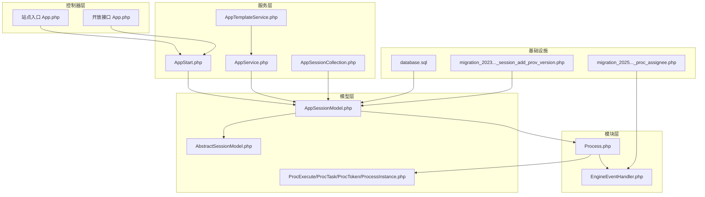
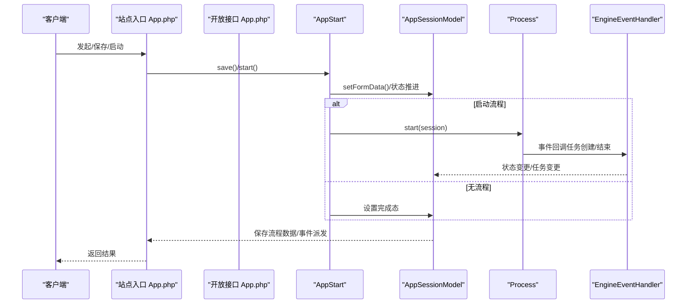
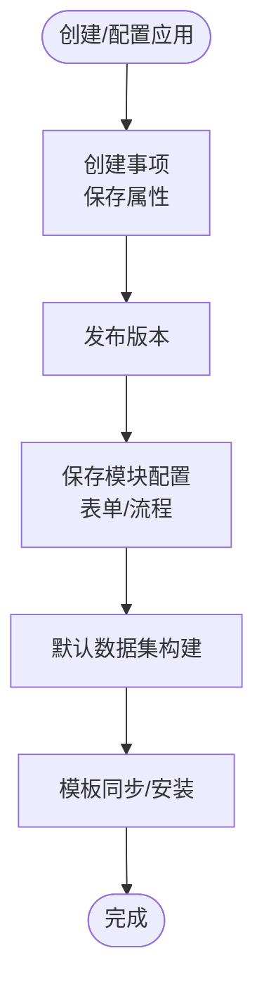
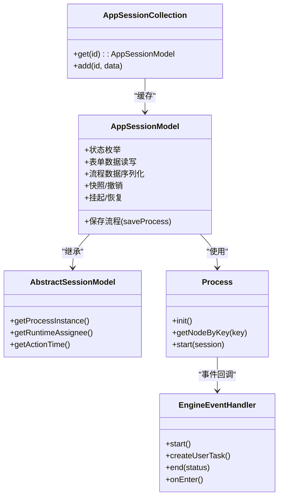
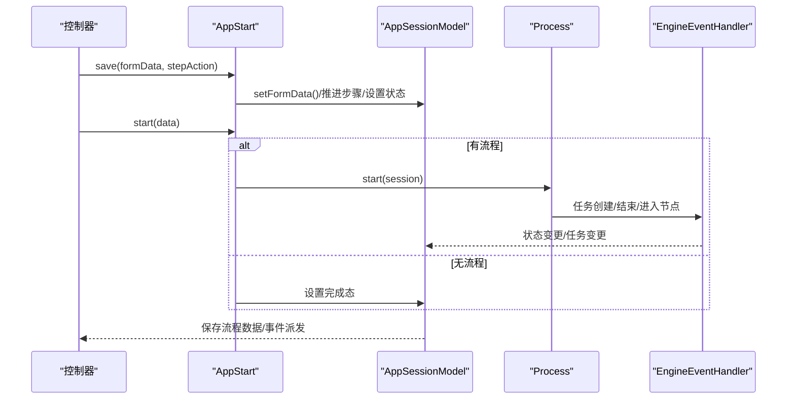
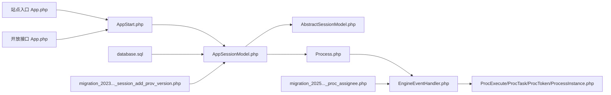

# 应用服务

<cite>
**本文引用的文件**
- [App.php（站点入口）](file://process/src/http/site/App.php)
- [App.php（开放接口）](file://process/src/http/open/App.php)
- [AppSessionModel.php](file://process/src/models/AppSessionModel.php)
- [AbstractSessionModel.php](file://process/src/models/AbstractSessionModel.php)
- [AppSessionCollection.php](file://process/src/services/AppSessionCollection.php)
- [AppTemplateService.php](file://process/src/services/AppTemplateService.php)
- [AppService.php](file://process/src/services/AppService.php)
- [AppStart.php](file://process/src/services/AppStart.php)
- [EngineEventHandler.php（流程事件处理器）](file://process/src/modules/process/EngineEventHandler.php)
- [Process.php（流程模块）](file://process/src/modules/Process.php)
- [ProcExecute.php](file://process/src/engine/ProcExecute.php)
- [ProcTask.php](file://process/src/engine/ProcTask.php)
- [ProcToken.php](file://process/src/engine/ProcToken.php)
- [ProcessInstance.php](file://process/src/engine/ProcessInstance.php)
- [database.sql（会话表结构）](file://process/docs/sql/database.sql)
- [migration_20230530_100642_session_add_prov_version.php](file://process/src/migrations/migration_20230530_100642_session_add_prov_version.php)
- [migration_20251119_090014_proc_assignee.php](file://process/src/migrations/migration_20251119_090014_proc_assignee.php)
- [Task.php（任务相关）](file://process/src/http/site/Task.php)
</cite>

## 目录
1. [简介](#简介)
2. [项目结构](#项目结构)
3. [核心组件](#核心组件)
4. [架构总览](#架构总览)
5. [详细组件分析](#详细组件分析)
6. [依赖关系分析](#依赖关系分析)
7. [性能考量](#性能考量)
8. [故障排查指南](#故障排查指南)
9. [结论](#结论)
10. [附录](#附录)

## 简介
本文件面向 htdNew 项目“应用服务”的实现与使用，系统性阐述应用生命周期管理、模板服务与会话管理机制。重点覆盖以下方面：
- 应用创建与配置：事项创建、版本发布、模块（表单/流程）保存与校验、默认数据集构建。
- 模板管理：模板库对接、模板安装与版本同步、令牌校验与推送策略。
- 会话管理：应用会话模型、会话集合缓存、流程引擎集成、状态流转与事件驱动。
- 填充周期管理：多步表单、草稿与预约绑定、发起前置校验与后置事件。
- 启动流程：站点与开放接口的发起与启动路径、并发互斥、异常处理与事务保障。
- 接口设计：控制器方法、参数与返回值规范、错误码与提示。
- 最佳实践与常见问题：幂等、并发、权限、数据一致性与性能优化建议。

## 项目结构
应用服务相关代码主要分布在以下目录与文件：
- 控制器层：站点入口与开放接口控制器，负责参数解析、权限校验、事务控制与返回封装。
- 服务层：应用服务、模板服务、会话集合、发起器等，负责业务编排与跨模型协调。
- 模型层：应用会话模型、抽象会话模型、流程引擎适配类与迁移脚本。
- 模块层：流程模块封装引擎节点与流程入口。
- 文档与SQL：数据库表结构与迁移脚本。

图表来源
- [App.php（站点入口）](file://process/src/http/site/App.php#L1-L220)
- [App.php（开放接口）](file://process/src/http/open/App.php#L540-L620)
- [AppSessionModel.php](file://process/src/models/AppSessionModel.php#L1-L120)
- [AbstractSessionModel.php](file://process/src/models/AbstractSessionModel.php#L40-L80)
- [AppSessionCollection.php](file://process/src/services/AppSessionCollection.php#L1-L31)
- [AppTemplateService.php](file://process/src/services/AppTemplateService.php#L1-L120)
- [AppService.php](file://process/src/services/AppService.php#L1-L120)
- [AppStart.php](file://process/src/services/AppStart.php#L1-L120)
- [EngineEventHandler.php（流程事件处理器）](file://process/src/modules/process/EngineEventHandler.php#L1-L120)
- [Process.php（流程模块）](file://process/src/modules/Process.php#L1-L47)
- [ProcExecute.php](file://process/src/engine/ProcExecute.php#L1-L11)
- [ProcTask.php](file://process/src/engine/ProcTask.php#L1-L11)
- [ProcToken.php](file://process/src/engine/ProcToken.php#L1-L11)
- [ProcessInstance.php](file://process/src/engine/ProcessInstance.php#L1-L11)
- [database.sql（会话表结构）](file://process/docs/sql/database.sql#L172-L201)
- [migration_20230530_100642_session_add_prov_version.php](file://process/src/migrations/migration_20230530_100642_session_add_prov_version.php#L1-L27)
- [migration_20251119_090014_proc_assignee.php](file://process/src/migrations/migration_20251119_090014_proc_assignee.php#L1-L32)

章节来源
- [App.php（站点入口）](file://process/src/http/site/App.php#L1-L220)
- [App.php（开放接口）](file://process/src/http/open/App.php#L540-L620)
- [AppSessionModel.php](file://process/src/models/AppSessionModel.php#L1-L120)
- [AppSessionCollection.php](file://process/src/services/AppSessionCollection.php#L1-L31)
- [AppTemplateService.php](file://process/src/services/AppTemplateService.php#L1-L120)
- [AppService.php](file://process/src/services/AppService.php#L1-L120)
- [AppStart.php](file://process/src/services/AppStart.php#L1-L120)
- [EngineEventHandler.php（流程事件处理器）](file://process/src/modules/process/EngineEventHandler.php#L1-L120)
- [Process.php（流程模块）](file://process/src/modules/Process.php#L1-L47)
- [ProcExecute.php](file://process/src/engine/ProcExecute.php#L1-L11)
- [ProcTask.php](file://process/src/engine/ProcTask.php#L1-L11)
- [ProcToken.php](file://process/src/engine/ProcToken.php#L1-L11)
- [ProcessInstance.php](file://process/src/engine/ProcessInstance.php#L1-L11)
- [database.sql（会话表结构）](file://process/docs/sql/database.sql#L172-L201)
- [migration_20230530_100642_session_add_prov_version.php](file://process/src/migrations/migration_20230530_100642_session_add_prov_version.php#L1-L27)
- [migration_20251119_090014_proc_assignee.php](file://process/src/migrations/migration_20251119_090014_proc_assignee.php#L1-L32)

## 核心组件
- 应用会话模型（AppSessionModel）
  - 负责会话状态、表单数据、流程数据、快照与任务变更标记。
  - 提供状态枚举、匿名用户处理、挂起/恢复、撤销/中止/结束、任务名格式化、流程变量读写等能力。
- 抽象会话模型（AbstractSessionModel）
  - 提供流程实例初始化、运行时审批人解析、协程上下文共享等通用能力。
- 会话集合（AppSessionCollection）
  - 协程单例缓存，按会话ID持有 AppSessionModel 实例，避免重复构造。
- 应用服务（AppService）
  - 事项创建与属性保存、版本发布、模块（表单/流程）保存与校验、默认数据集构建。
- 模板服务（AppTemplateService）
  - 模板库对接、模板安装、版本比对与推送、令牌校验与IP白名单校验。
- 发起器（AppStart）
  - 表单保存与多步流程推进、发起前置校验、流程启动与事件派发、预约绑定与编号占用校验。
- 流程模块与事件处理器（Process、EngineEventHandler）
  - 引擎节点映射、流程启动、任务创建、多实例分配、服务任务调度、事件回调与状态同步。
- 引擎适配类（ProcExecute/ProcTask/ProcToken/ProcessInstance）
  - 与外部引擎交互的适配层，承载序列化流程数据。

章节来源
- [AppSessionModel.php](file://process/src/models/AppSessionModel.php#L1-L200)
- [AbstractSessionModel.php](file://process/src/models/AbstractSessionModel.php#L40-L120)
- [AppSessionCollection.php](file://process/src/services/AppSessionCollection.php#L1-L31)
- [AppService.php](file://process/src/services/AppService.php#L1-L220)
- [AppTemplateService.php](file://process/src/services/AppTemplateService.php#L1-L220)
- [AppStart.php](file://process/src/services/AppStart.php#L1-L220)
- [EngineEventHandler.php（流程事件处理器）](file://process/src/modules/process/EngineEventHandler.php#L1-L120)
- [Process.php（流程模块）](file://process/src/modules/Process.php#L1-L47)
- [ProcExecute.php](file://process/src/engine/ProcExecute.php#L1-L11)
- [ProcTask.php](file://process/src/engine/ProcTask.php#L1-L11)
- [ProcToken.php](file://process/src/engine/ProcToken.php#L1-L11)
- [ProcessInstance.php](file://process/src/engine/ProcessInstance.php#L1-L11)

## 架构总览
应用服务围绕“控制器—服务—模型—模块—引擎”的分层展开，形成如下闭环：
- 控制器负责参数与权限校验、事务控制与返回封装。
- 服务层编排业务流程，协调模型与模块。
- 模型层承载数据与状态，维护会话与流程数据。
- 模块层封装流程引擎入口与事件处理。
- 引擎适配类确保序列化流程数据的兼容性。

图表来源
- [App.php（站点入口）](file://process/src/http/site/App.php#L70-L160)
- [App.php（开放接口）](file://process/src/http/open/App.php#L470-L540)
- [AppStart.php](file://process/src/services/AppStart.php#L120-L220)
- [AppSessionModel.php](file://process/src/models/AppSessionModel.php#L450-L520)
- [EngineEventHandler.php（流程事件处理器）](file://process/src/modules/process/EngineEventHandler.php#L70-L120)
- [Process.php（流程模块）](file://process/src/modules/Process.php#L1-L47)

## 详细组件分析

### 应用生命周期管理
- 事项创建与配置
  - 通过应用服务创建事项、保存属性、发布版本、保存模块（表单/流程）配置，并进行节点完整性校验与数据组件锁定。
  - 默认数据集构建：扫描已发布版本表单字段，生成默认数据集并更新采集规则。
- 版本与模块管理
  - 版本发布：将应用的公开版本ID指向目标版本。
  - 模块保存：流程节点校验与差异检测，防止删除已运行环节；表单插件与数据组件联动锁定。
- 模板服务
  - 模板库对接：模板列表、标签、详情、安装通知、问卷分类。
  - 模板安装：创建事项、版本、模块与流程/表单配置，启用版本。
  - 版本同步：本地版本与模板库版本比对，增量插入/更新。
  - 安全校验：令牌校验（时间戳+签名）、IP白名单校验。

图表来源
- [AppService.php](file://process/src/services/AppService.php#L1-L220)
- [AppTemplateService.php](file://process/src/services/AppTemplateService.php#L120-L220)
- [AppTemplateService.php](file://process/src/services/AppTemplateService.php#L280-L420)
- [AppTemplateService.php](file://process/src/services/AppTemplateService.php#L500-L596)

章节来源
- [AppService.php](file://process/src/services/AppService.php#L1-L220)
- [AppService.php](file://process/src/services/AppService.php#L220-L380)
- [AppService.php](file://process/src/services/AppService.php#L380-L532)
- [AppTemplateService.php](file://process/src/services/AppTemplateService.php#L1-L220)
- [AppTemplateService.php](file://process/src/services/AppTemplateService.php#L280-L420)
- [AppTemplateService.php](file://process/src/services/AppTemplateService.php#L500-L596)

### 模板服务
- 接口与安全
  - 模板库域名、接口路径、API密钥、IP白名单。
  - 令牌生成与校验（时间戳+签名），防止重放与篡改。
- 模板安装
  - 自动命名、图标、基础属性、发起配置、流程步骤等默认值注入。
  - 逐项创建模块与版本配置，最后启用版本。
- 版本同步
  - 本地版本列表与模板库版本列表比对，按需插入/更新。
  - 分批推送，失败重试与日志输出。

章节来源
- [AppTemplateService.php](file://process/src/services/AppTemplateService.php#L1-L120)
- [AppTemplateService.php](file://process/src/services/AppTemplateService.php#L120-L220)
- [AppTemplateService.php](file://process/src/services/AppTemplateService.php#L280-L420)
- [AppTemplateService.php](file://process/src/services/AppTemplateService.php#L500-L596)

### 会话管理机制
- 会话模型与状态
  - 会话表包含应用ID、版本ID、发起人、代发起人、部门、匿名标志、状态、扩展字段、流程数据、快照、步骤、创建/完成时间等。
  - 状态枚举覆盖草稿、验证、运行中、完成、终止、撤销、驳回、等待支付、等待支付审批、重报撤销、等待、删除等。
- 会话集合缓存
  - 协程单例缓存，按ID获取/添加实例，减少重复构造与查询。
- 流程引擎集成
  - 抽象会话模型提供流程实例初始化与运行时审批人解析。
  - 引擎事件处理器在任务创建、结束、进入节点等时机更新会话状态与任务变更标记。
- 会话生命周期
  - 发起保存：多步推进、草稿与预约绑定、事件派发。
  - 启动：若存在流程，初始化全局变量、设置运行态并启动流程；否则直接完成并派发结束事件。
  - 结束/中止/撤销：根据流程实例状态设置最终状态，清理任务与消息，派发通知。

图表来源
- [AppSessionModel.php](file://process/src/models/AppSessionModel.php#L1-L200)
- [AbstractSessionModel.php](file://process/src/models/AbstractSessionModel.php#L40-L120)
- [AppSessionCollection.php](file://process/src/services/AppSessionCollection.php#L1-L31)
- [EngineEventHandler.php（流程事件处理器）](file://process/src/modules/process/EngineEventHandler.php#L1-L120)
- [Process.php（流程模块）](file://process/src/modules/Process.php#L1-L47)

章节来源
- [AppSessionModel.php](file://process/src/models/AppSessionModel.php#L1-L200)
- [AppSessionModel.php](file://process/src/models/AppSessionModel.php#L450-L520)
- [AppSessionModel.php](file://process/src/models/AppSessionModel.php#L560-L620)
- [AbstractSessionModel.php](file://process/src/models/AbstractSessionModel.php#L40-L120)
- [AppSessionCollection.php](file://process/src/services/AppSessionCollection.php#L1-L31)
- [EngineEventHandler.php（流程事件处理器）](file://process/src/modules/process/EngineEventHandler.php#L70-L120)
- [Process.php（流程模块）](file://process/src/modules/Process.php#L1-L47)

### 填充周期管理
- 多步表单推进
  - 保存阶段：按步骤推进，支持下一步/上一步/暂存；暂存时设置等待态。
  - 完成阶段：进入验证态，派发发起前校验事件，允许业务拦截。
- 草稿与预约
  - 草稿ID缓存：保存当前会话使用的草稿ID，确保载入数据优先使用草稿。
  - 预约绑定：保留 reserve_id，避免重复申请。
- 编号占用
  - 发起前检查编号是否被占用，避免冲突。

章节来源
- [AppStart.php](file://process/src/services/AppStart.php#L1-L120)
- [AppStart.php](file://process/src/services/AppStart.php#L120-L220)
- [AppStart.php](file://process/src/services/AppStart.php#L220-L273)

### 启动流程与状态同步
- 站点入口与开放接口
  - 参数校验：应用状态、开放时间、权限、提交次数与人数限制。
  - 会话创建：首次发起生成新会话，后续发起复用现有会话并校验发起人。
  - 并发互斥：基于会话级互斥锁与Redis限流，避免重复请求。
- 启动路径
  - 若存在流程：设置运行态、初始化全局变量、设置审批人、启动流程；流程结束后派发结束事件。
  - 若无流程：直接完成并派发结束事件。
- 状态同步
  - 引擎事件处理器根据流程实例状态设置会话最终状态，更新任务名与最近审批人、时间，派发通知与消息忽略。

图表来源
- [App.php（站点入口）](file://process/src/http/site/App.php#L70-L160)
- [App.php（开放接口）](file://process/src/http/open/App.php#L470-L540)
- [AppStart.php](file://process/src/services/AppStart.php#L120-L220)
- [EngineEventHandler.php（流程事件处理器）](file://process/src/modules/process/EngineEventHandler.php#L70-L120)
- [AppSessionModel.php](file://process/src/models/AppSessionModel.php#L450-L520)

章节来源
- [App.php（站点入口）](file://process/src/http/site/App.php#L270-L370)
- [App.php（开放接口）](file://process/src/http/open/App.php#L540-L620)
- [AppStart.php](file://process/src/services/AppStart.php#L120-L220)
- [EngineEventHandler.php（流程事件处理器）](file://process/src/modules/process/EngineEventHandler.php#L70-L120)
- [AppSessionModel.php](file://process/src/models/AppSessionModel.php#L450-L520)

### 会话收集机制
- 会话集合缓存
  - 使用协程单例缓存会话实例，避免重复构造与数据库访问。
- 任务收集
  - 会话保存流程时，若有任务变更则更新最近审批人与时间，触发事件派发与采集。
- 个人任务与服务任务
  - 事件处理器支持创建个人任务与服务任务（定时/异步），并写入计划任务表或队列。

章节来源
- [AppSessionCollection.php](file://process/src/services/AppSessionCollection.php#L1-L31)
- [AppSessionModel.php](file://process/src/models/AppSessionModel.php#L450-L520)
- [EngineEventHandler.php（流程事件处理器）](file://process/src/modules/process/EngineEventHandler.php#L120-L220)
- [Task.php（任务相关）](file://process/src/http/site/Task.php#L410-L446)

## 依赖关系分析
- 控制器依赖服务层与会话集合，服务层依赖模型与模块。
- 模型依赖流程模块与引擎适配类，引擎事件处理器依赖任务与消息模块。
- 迁移脚本为会话表与流程分配表提供结构支撑。

图表来源
- [App.php（站点入口）](file://process/src/http/site/App.php#L1-L120)
- [App.php（开放接口）](file://process/src/http/open/App.php#L470-L540)
- [AppStart.php](file://process/src/services/AppStart.php#L1-L120)
- [AppSessionModel.php](file://process/src/models/AppSessionModel.php#L1-L120)
- [AbstractSessionModel.php](file://process/src/models/AbstractSessionModel.php#L40-L80)
- [Process.php（流程模块）](file://process/src/modules/Process.php#L1-L47)
- [EngineEventHandler.php（流程事件处理器）](file://process/src/modules/process/EngineEventHandler.php#L1-L120)
- [ProcExecute.php](file://process/src/engine/ProcExecute.php#L1-L11)
- [ProcTask.php](file://process/src/engine/ProcTask.php#L1-L11)
- [ProcToken.php](file://process/src/engine/ProcToken.php#L1-L11)
- [ProcessInstance.php](file://process/src/engine/ProcessInstance.php#L1-L11)
- [database.sql（会话表结构）](file://process/docs/sql/database.sql#L172-L201)
- [migration_20230530_100642_session_add_prov_version.php](file://process/src/migrations/migration_20230530_100642_session_add_prov_version.php#L1-L27)
- [migration_20251119_090014_proc_assignee.php](file://process/src/migrations/migration_20251119_090014_proc_assignee.php#L1-L32)

章节来源
- [App.php（站点入口）](file://process/src/http/site/App.php#L1-L120)
- [App.php（开放接口）](file://process/src/http/open/App.php#L470-L540)
- [AppSessionModel.php](file://process/src/models/AppSessionModel.php#L1-L120)
- [AbstractSessionModel.php](file://process/src/models/AbstractSessionModel.php#L40-L80)
- [Process.php（流程模块）](file://process/src/modules/Process.php#L1-L47)
- [EngineEventHandler.php（流程事件处理器）](file://process/src/modules/process/EngineEventHandler.php#L1-L120)
- [ProcExecute.php](file://process/src/engine/ProcExecute.php#L1-L11)
- [ProcTask.php](file://process/src/engine/ProcTask.php#L1-L11)
- [ProcToken.php](file://process/src/engine/ProcToken.php#L1-L11)
- [ProcessInstance.php](file://process/src/engine/ProcessInstance.php#L1-L11)
- [database.sql（会话表结构）](file://process/docs/sql/database.sql#L172-L201)
- [migration_20230530_100642_session_add_prov_version.php](file://process/src/migrations/migration_20230530_100642_session_add_prov_version.php#L1-L27)
- [migration_20251119_090014_proc_assignee.php](file://process/src/migrations/migration_20251119_090014_proc_assignee.php#L1-L32)

## 性能考量
- 会话缓存与互斥
  - 使用协程单例缓存会话实例，降低重复构造成本。
  - 会话级互斥锁与Redis限流，避免高并发重复请求。
- 事务与事件
  - 关键路径采用事务包裹，失败回滚；事件派发尽量在事务成功后进行。
- 序列化与索引
  - 流程数据序列化存储，注意序列化对象的向后兼容；为常用查询建立索引（如会话表的发起人、代发起人索引）。
- 任务与计划
  - 服务任务支持异步队列与定时任务，避免阻塞请求链路。

[本节为通用指导，不直接分析具体文件]

## 故障排查指南
- 常见错误与定位
  - 权限不足/未发布：检查应用状态、公开版本ID与权限校验。
  - 重复请求/互斥失败：查看会话互斥锁与Redis限流键。
  - 流程启动异常：检查流程节点完整性、审批人解析与引擎事件回调。
  - 模板同步失败：核对令牌校验、IP白名单与推送批次。
- 日志与追踪
  - 控制器与服务层均有日志记录与开发者请求日志，便于定位参数与异常堆栈。
- 回滚与恢复
  - 会话支持快照与撤销，流程结束/中止/撤销后清理任务与消息，必要时恢复历史状态。

章节来源
- [App.php（站点入口）](file://process/src/http/site/App.php#L1-L120)
- [App.php（开放接口）](file://process/src/http/open/App.php#L470-L540)
- [AppSessionModel.php](file://process/src/models/AppSessionModel.php#L250-L320)
- [AppSessionModel.php](file://process/src/models/AppSessionModel.php#L520-L620)
- [AppTemplateService.php](file://process/src/services/AppTemplateService.php#L500-L596)

## 结论
应用服务通过清晰的分层设计与事件驱动机制，实现了从应用创建、模板管理到会话生命周期与流程状态同步的完整闭环。借助会话缓存、并发互斥、事务与事件派发，系统在保证一致性的同时兼顾性能与可扩展性。模板服务提供了标准化的模板安装与版本同步能力，进一步提升事项复制与治理效率。

[本节为总结性内容，不直接分析具体文件]

## 附录

### 接口设计与参数规范（示例）
- 发起保存（站点/开放接口）
  - 方法：POST
  - 参数：app_id、sess_id（可选）、department_id、form_data、step_action、temp_save、draft_id、matter_session、number、agent_for、reserve_id 等。
  - 返回：包含会话ID、下一步步骤或指派信息、支付信息（如有）。
- 启动（站点/开放接口）
  - 方法：POST
  - 参数：sess_id、data（含 assignee 等）、draft_id、seal_scnu_sms_code、seal_scnu_sms_id 等。
  - 返回：空对象或支付状态提示。
- 模板服务
  - 获取模板列表/详情/标签：GET，带分页与排序参数。
  - 通知安装/问卷分类：GET/POST，带令牌校验。
  - 模板安装：POST，提交模板数据，返回事项ID。

章节来源
- [App.php（站点入口）](file://process/src/http/site/App.php#L70-L160)
- [App.php（开放接口）](file://process/src/http/open/App.php#L470-L540)
- [AppTemplateService.php](file://process/src/services/AppTemplateService.php#L80-L160)
- [AppTemplateService.php](file://process/src/services/AppTemplateService.php#L120-L220)

### 数据模型要点
- 会话表（app_session）
  - 关键字段：应用ID、应用版本ID、流程版本ID、发起人、代发起人、部门、匿名、状态、扩展字段、快照、步骤、流程数据、创建/完成时间。
  - 索引：发起人、代发起人（代发起>0时）、序列化ID序列。
- 流程分配表（proc_assignee）
  - 记录会话、执行ID、节点ID与审批人集合，支持多实例合并与顺序会签。

章节来源
- [database.sql（会话表结构）](file://process/docs/sql/database.sql#L172-L201)
- [migration_20251119_090014_proc_assignee.php](file://process/src/migrations/migration_20251119_090014_proc_assignee.php#L1-L32)