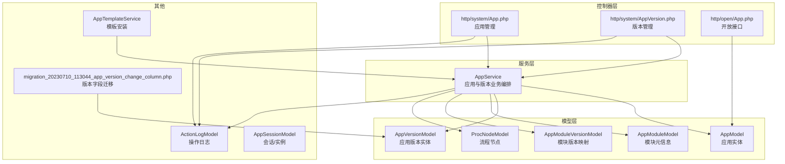
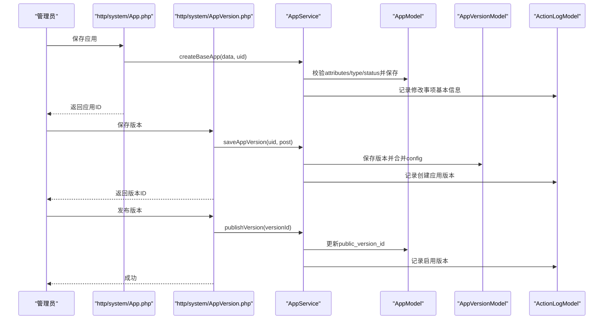
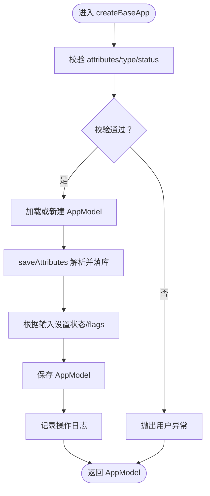
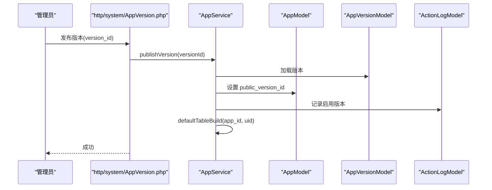
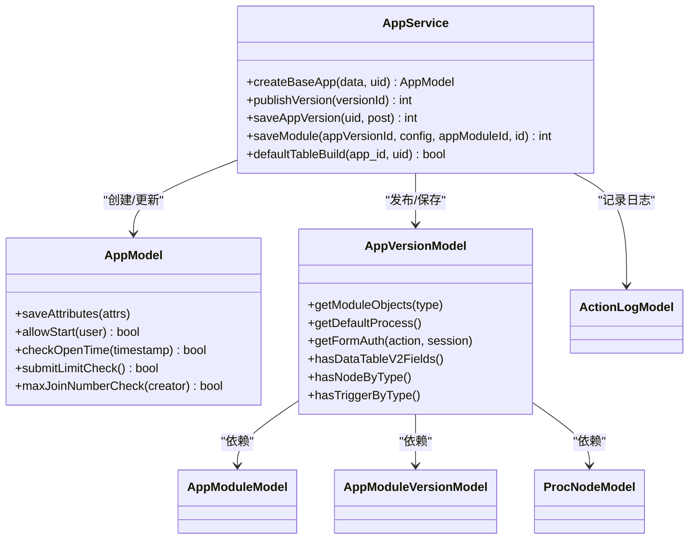

# 应用管理

<cite>
**本文引用的文件**
- [AppService.php](file://process/src/services/AppService.php)
- [AppModel.php](file://process/src/models/AppModel.php)
- [AppVersionModel.php](file://process/src/models/AppVersionModel.php)
- [App.php（系统控制器）](file://process/src/http/system/App.php)
- [AppVersion.php（系统控制器）](file://process/src/http/system/AppVersion.php)
- [App.php（开放接口控制器）](file://process/src/http/open/App.php)
- [AppTemplateService.php](file://process/src/services/AppTemplateService.php)
- [ActionLogModel.php](file://process/src/models/ActionLogModel.php)
- [AppSessionModel.php](file://process/src/models/AppSessionModel.php)
- [AppModuleModel.php](file://process/src/models/AppModuleModel.php)
- [AppModuleVersionModel.php](file://process/src/models/AppModuleVersionModel.php)
- [ProcNodeModel.php](file://process/src/models/ProcNodeModel.php)
- [migration_20230710_113044_app_version_change_column.php](file://process/src/migrations/migration_20230710_113044_app_version_change_column.php)
</cite>

## 目录
1. [简介](#简介)
2. [项目结构](#项目结构)
3. [核心组件](#核心组件)
4. [架构总览](#架构总览)
5. [组件详解](#组件详解)
6. [依赖关系分析](#依赖关系分析)
7. [性能考量](#性能考量)
8. [故障排查指南](#故障排查指南)
9. [结论](#结论)
10. [附录](#附录)

## 简介
本文件围绕 htdNew 项目的“应用管理”能力，系统性梳理应用生命周期管理机制，覆盖应用创建、配置管理、版本发布与状态控制。重点解析 createBaseApp 的实现逻辑（数据验证、属性保存、状态管理），阐述版本发布流程（版本关联、状态更新、操作日志记录），并说明应用模型的数据结构、属性类型与状态枚举。最后给出最佳实践，包括数据验证规则、异常处理策略与性能优化建议。

## 项目结构
应用管理相关代码主要分布在以下模块：
- 服务层：应用业务编排与流程控制（AppService）
- 模型层：应用与版本实体、权限与流程节点等（AppModel、AppVersionModel、AppModuleModel、AppModuleVersionModel、ProcNodeModel）
- 控制器层：系统后台与开放接口对应用与版本的维护入口（http/system/App.php、http/system/AppVersion.php、http/open/App.php）
- 模板与迁移：模板安装与版本字段类型迁移（AppTemplateService、migration_20230710_113044_app_version_change_column.php）

图表来源
- [AppService.php](file://process/src/services/AppService.php#L1-L120)
- [AppModel.php](file://process/src/models/AppModel.php#L1-L120)
- [AppVersionModel.php](file://process/src/models/AppVersionModel.php#L1-L120)
- [App.php（系统控制器）](file://process/src/http/system/App.php#L118-L164)
- [AppVersion.php（系统控制器）](file://process/src/http/system/AppVersion.php#L33-L56)
- [App.php（开放接口控制器）](file://process/src/http/open/App.php#L571-L605)
- [AppTemplateService.php](file://process/src/services/AppTemplateService.php#L1-L49)
- [ActionLogModel.php](file://process/src/models/ActionLogModel.php#L50-L90)
- [migration_20230710_113044_app_version_change_column.php](file://process/src/migrations/migration_20230710_113044_app_version_change_column.php#L1-L19)

章节来源
- [AppService.php](file://process/src/services/AppService.php#L1-L120)
- [AppModel.php](file://process/src/models/AppModel.php#L1-L120)
- [AppVersionModel.php](file://process/src/models/AppVersionModel.php#L1-L120)
- [App.php（系统控制器）](file://process/src/http/system/App.php#L118-L164)
- [AppVersion.php（系统控制器）](file://process/src/http/system/AppVersion.php#L33-L56)
- [App.php（开放接口控制器）](file://process/src/http/open/App.php#L571-L605)
- [AppTemplateService.php](file://process/src/services/AppTemplateService.php#L1-L49)
- [ActionLogModel.php](file://process/src/models/ActionLogModel.php#L50-L90)
- [migration_20230710_113044_app_version_change_column.php](file://process/src/migrations/migration_20230710_113044_app_version_change_column.php#L1-L19)

## 核心组件
- 应用模型 AppModel：定义应用状态、属性类型、可见/申请/禁用角色、发起限制、匿名与开放时间检查、测试/模拟用户等；提供 saveAttributes、addProcessFlag/addFillFlag 等能力。
- 应用版本模型 AppVersionModel：管理版本状态、模块集合、事件触发器、表单权限、流程节点、采集规则等；提供 getDefaultProcess、getFormAuth、getModuleObjects 等方法。
- 服务 AppService：应用创建 createBaseApp、版本发布 publishVersion、版本保存 saveAppVersion、模块保存 saveModule、默认数据集构建 defaultTableBuild 等。
- 控制器 http/system/App.php：应用保存、状态变更、列表与导出、克隆等。
- 控制器 http/system/AppVersion.php：版本保存、发布、删除、模块发布、权限配置、节点查询等。
- 开放接口 http/open/App.php：应用会话创建、权限校验、限制检查等。
- 模板服务 AppTemplateService：模板安装与推送。
- 日志 ActionLogModel：统一记录操作日志。

章节来源
- [AppModel.php](file://process/src/models/AppModel.php#L1-L120)
- [AppVersionModel.php](file://process/src/models/AppVersionModel.php#L1-L120)
- [AppService.php](file://process/src/services/AppService.php#L1-L120)
- [App.php（系统控制器）](file://process/src/http/system/App.php#L118-L201)
- [AppVersion.php（系统控制器）](file://process/src/http/system/AppVersion.php#L145-L290)
- [App.php（开放接口控制器）](file://process/src/http/open/App.php#L571-L605)
- [AppTemplateService.php](file://process/src/services/AppTemplateService.php#L1-L49)
- [ActionLogModel.php](file://process/src/models/ActionLogModel.php#L50-L90)

## 架构总览
应用管理采用“控制器-服务-模型”的分层设计：
- 控制器负责参数校验与授权检查，调用服务层完成业务编排。
- 服务层协调模型层持久化与缓存，保证事务一致性与幂等性。
- 模型层封装数据结构、约束与复杂查询，提供便捷的领域方法。
- 日志贯穿关键路径，确保可审计与可追踪。

图表来源
- [App.php（系统控制器）](file://process/src/http/system/App.php#L118-L164)
- [AppVersion.php（系统控制器）](file://process/src/http/system/AppVersion.php#L33-L56)
- [AppService.php](file://process/src/services/AppService.php#L32-L81)
- [ActionLogModel.php](file://process/src/models/ActionLogModel.php#L80-L90)

## 组件详解

### createBaseApp 方法实现逻辑
- 输入参数校验
  - attributes 必填且非空，否则抛出用户异常。
  - type 必须属于 AppModel::ATTR_TYPES，否则抛出用户异常。
  - status 必须属于 AppModel::ALL_STATUS，否则抛出用户异常。
- 实体初始化与保存
  - 若传入 id，则加载已有 AppModel；否则新建。
  - 调用 saveAttributes 将 attributes 解析并写入对应列（JSON/INT/STR 等按 Schema 转换）。
  - 若未传 id 或状态非未发布，则根据 data['status'] 更新状态；flags 可选覆盖。
  - 保存 AppModel 并记录操作日志。
- 关键点
  - 属性保存时对 attributes 的 base/visible_type/apply_type/disable_user 等进行格式化与落库。
  - 使用事务外的日志记录，确保变更可追溯。

图表来源
- [AppService.php](file://process/src/services/AppService.php#L32-L65)
- [AppModel.php](file://process/src/models/AppModel.php#L419-L465)
- [ActionLogModel.php](file://process/src/models/ActionLogModel.php#L80-L90)

章节来源
- [AppService.php](file://process/src/services/AppService.php#L32-L65)
- [AppModel.php](file://process/src/models/AppModel.php#L419-L465)

### 应用版本发布流程
- 发布入口
  - http/system/AppVersion.php::publishVersion 接收 version_id，进行权限校验与前置检查（如数据组件存在但缺少节点/触发器时拒绝发布）。
- 业务处理
  - AppService::publishVersion 加载版本并设置 AppModel.public_version_id，随后记录“启用版本”日志。
  - 发布后自动触发 defaultTableBuild，确保默认数据集与字段采集规则同步。
- 关键点
  - 发布前对版本状态与模块完整性进行校验，避免脏数据发布。
  - 发布成功后清理/重建相关缓存与依赖。

图表来源
- [AppVersion.php（系统控制器）](file://process/src/http/system/AppVersion.php#L266-L290)
- [AppService.php](file://process/src/services/AppService.php#L73-L81)
- [ActionLogModel.php](file://process/src/models/ActionLogModel.php#L80-L90)

章节来源
- [AppVersion.php（系统控制器）](file://process/src/http/system/AppVersion.php#L266-L290)
- [AppService.php](file://process/src/services/AppService.php#L73-L81)

### 应用模型数据结构与属性类型
- 状态枚举
  -  草稿、未发布、待审核、已发布、隐藏。
- 属性类型
  - base、info、start、files、process、aigc 等。
- 关键字段
  - attributes（JSON）、type、status、flags、public_version_id、visible_roles/apply_roles/disable_roles、identity、categorys、depart_id/depart_ids、test_users/simulate_users 等。
- 能力方法
  - saveAttributes：解析 attributes 并按 Schema 转换写入列。
  - allowStart/allowView：基于角色与属性进行访问控制。
  - checkOpenTime：按日/周/月/年/自定义周期校验开放时间。
  - submitLimitCheck/maxJoinNumberCheck：提交次数与参与人数限制。
  - addProcessFlag/addFillFlag/addQuestFlag：按模块能力设置 flags。

章节来源
- [AppModel.php](file://process/src/models/AppModel.php#L1-L120)
- [AppModel.php](file://process/src/models/AppModel.php#L419-L465)
- [AppModel.php](file://process/src/models/AppModel.php#L651-L750)
- [AppModel.php](file://process/src/models/AppModel.php#L911-L980)

### 版本模型数据结构与能力
- 字段
  - app_id、version、status（显示/隐藏）、config（JSON）、operator、remarks 等。
- 能力方法
  - initModules/getModuleObjects：按启用状态聚合表单/流程模块。
  - getDefaultProcess/getFormAuth：获取默认流程与表单权限。
  - dispatch：事件触发器派发。
  - hasDataTableV2Fields/hasNodeByType/hasTriggerByType：数据组件与节点/触发器存在性检查。
- 迁移
  - app_version 的 modules 字段类型从普通文本改为 JSONB，便于存储复杂结构。

章节来源
- [AppVersionModel.php](file://process/src/models/AppVersionModel.php#L1-L120)
- [AppVersionModel.php](file://process/src/models/AppVersionModel.php#L114-L142)
- [AppVersionModel.php](file://process/src/models/AppVersionModel.php#L244-L261)
- [AppVersionModel.php](file://process/src/models/AppVersionModel.php#L351-L379)
- [migration_20230710_113044_app_version_change_column.php](file://process/src/migrations/migration_20230710_113044_app_version_change_column.php#L1-L19)

### 开放接口中的应用会话创建
- 校验步骤
  - 检查服务时间（checkOpenTime）。
  - 校验是否存在已发布版本与状态。
  - 校验发起权限（allowStart）。
  - 校验提交次数与参与人数限制。
- 会话创建
  - 生成 AppSessionModel，设置 app_id、app_version_id、creator、agent、anonymous 等。
  - extra 字段记录设备类型等上下文信息。

章节来源
- [App.php（开放接口控制器）](file://process/src/http/open/App.php#L571-L605)
- [AppModel.php](file://process/src/models/AppModel.php#L651-L750)
- [AppModel.php](file://process/src/models/AppModel.php#L911-L980)
- [AppSessionModel.php](file://process/src/models/AppSessionModel.php)

### 模板安装与应用克隆
- 模板安装
  - AppTemplateService 提供模板列表、详情、安装等能力；安装时通过模板数据构造应用与版本。
- 应用克隆
  - http/system/App.php::clone 支持克隆应用与版本，处理模块映射、流程节点、表单数据源等。

章节来源
- [AppTemplateService.php](file://process/src/services/AppTemplateService.php#L1-L49)
- [App.php（系统控制器）](file://process/src/http/system/App.php#L657-L800)

## 依赖关系分析
- 控制器依赖服务层：系统控制器与开放接口控制器均通过 AppService 协调模型层。
- 服务层依赖模型层：AppService 在 createBaseApp/publishVersion/saveAppVersion 等方法中直接操作 AppModel/AppVersionModel。
- 模型层相互依赖：AppVersionModel 依赖 AppModuleModel/AppModuleVersionModel/ProcNodeModel 等组织模块与流程。
- 日志贯穿关键路径：ActionLogModel 在应用保存、版本发布、权限配置等处统一记录。

图表来源
- [AppService.php](file://process/src/services/AppService.php#L32-L221)
- [AppModel.php](file://process/src/models/AppModel.php#L419-L465)
- [AppVersionModel.php](file://process/src/models/AppVersionModel.php#L114-L142)
- [ActionLogModel.php](file://process/src/models/ActionLogModel.php#L80-L90)

章节来源
- [AppService.php](file://process/src/services/AppService.php#L32-L221)
- [AppModel.php](file://process/src/models/AppModel.php#L419-L465)
- [AppVersionModel.php](file://process/src/models/AppVersionModel.php#L114-L142)

## 性能考量
- 缓存与延迟
  - 发布版本后涉及缓存更新，存在约 0–3 秒延迟，控制器层通过协程上下文提示刷新授权，避免权限不一致。
- 查询与索引
  - attributes 为 JSON 字段，常用条件（如 attributes->'start'->'hall_show'）建议在数据库层面建立合适索引以提升检索效率。
- 事务与幂等
  - 关键操作（保存应用、保存版本、发布版本、默认数据集构建）均在事务中执行，确保一致性；部分方法具备幂等特性（如 initModules）。
- 日志与可观测性
  - 统一日志记录，便于定位问题与审计；建议结合日志级别与采样策略控制开销。

章节来源
- [App.php（系统控制器）](file://process/src/http/system/App.php#L44-L50)
- [AppVersion.php（系统控制器）](file://process/src/http/system/AppVersion.php#L26-L31)
- [AppService.php](file://process/src/services/AppService.php#L521-L532)

## 故障排查指南
- 发布失败
  - 若版本存在数据组件但缺少流程节点或个人保存触发器，发布接口会返回特定错误提示，需补充流程或触发器后再发布。
- 权限不足
  - 控制器在保存/发布/克隆等操作前进行授权校验，无权限将抛出用户异常；请确认用户对 app_id 的 app.edit 权限。
- 属性校验失败
  - createBaseApp 对 attributes/type/status 进行严格校验，若不符合要求会抛出用户异常；请核对传参格式与取值范围。
- 会话创建失败
  - 开放接口在创建会话前进行服务时间、发布状态、发起权限、提交次数与参与人数限制检查；请根据返回提示调整配置或参数。

章节来源
- [AppVersion.php（系统控制器）](file://process/src/http/system/AppVersion.php#L274-L276)
- [App.php（系统控制器）](file://process/src/http/system/App.php#L166-L201)
- [AppService.php](file://process/src/services/AppService.php#L32-L65)
- [App.php（开放接口控制器）](file://process/src/http/open/App.php#L571-L605)

## 结论
htdNew 的应用管理以服务层为核心，通过严格的参数校验、完备的状态与权限控制、完善的日志记录与事务保障，实现了从应用创建到版本发布的全链路闭环。建议在生产环境中配合缓存策略、数据库索引与日志采样，持续优化性能与稳定性。

## 附录
- 最佳实践清单
  - 数据验证：在服务层集中校验 attributes/type/status，避免脏数据进入模型层。
  - 异常处理：对用户可控的错误（如参数非法、权限不足）抛出用户异常；对系统内部错误记录日志并返回通用错误。
  - 性能优化：对高频查询字段建立索引；合理使用缓存与延迟刷新；对批量操作使用事务。
  - 可审计性：关键路径统一记录 ActionLog，保留操作人、模型、类型与明细。
  - 版本治理：发布前进行完整性检查（流程节点/触发器/数据组件），确保线上稳定。