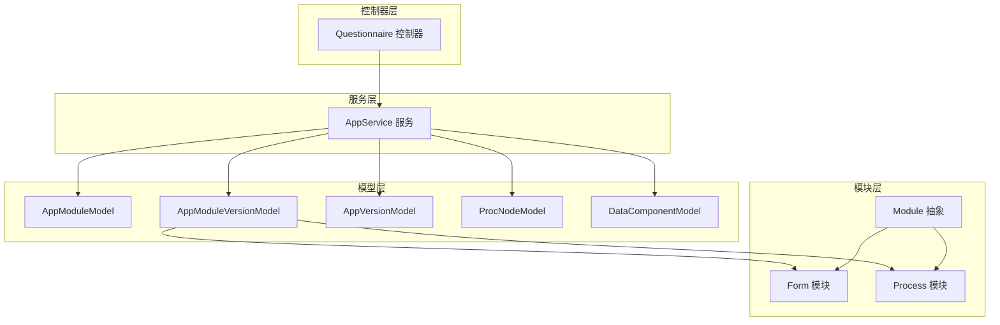
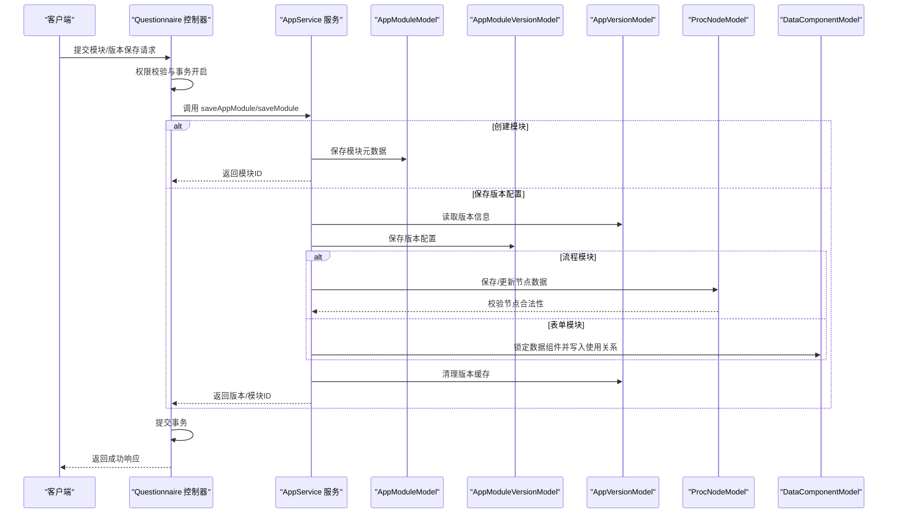
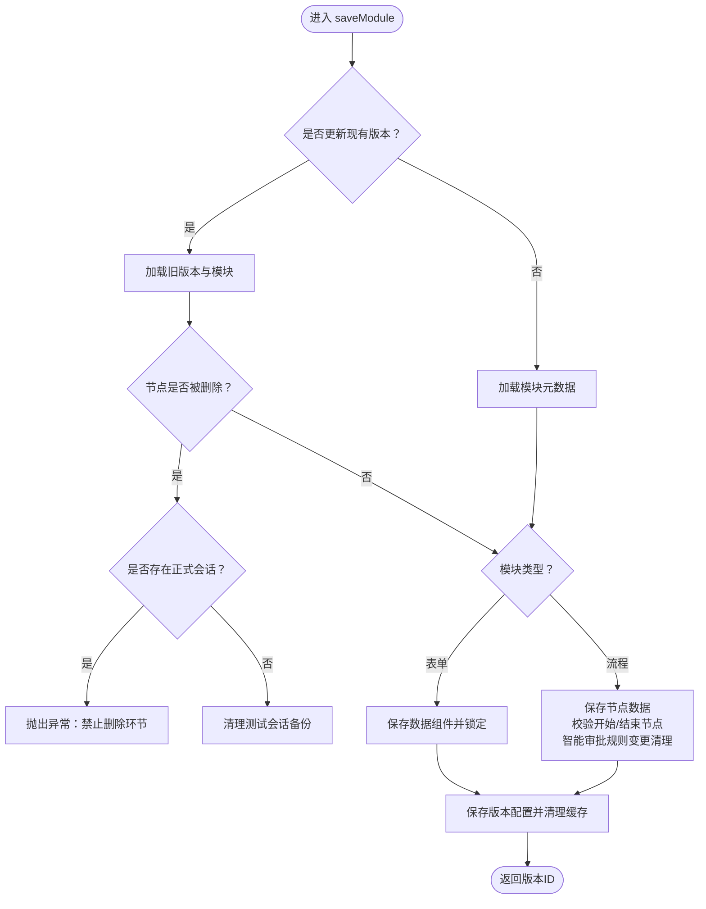
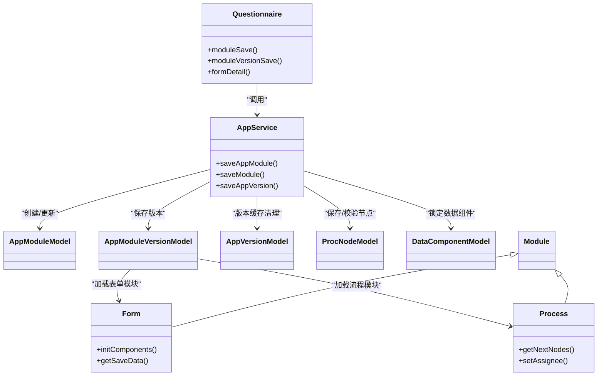
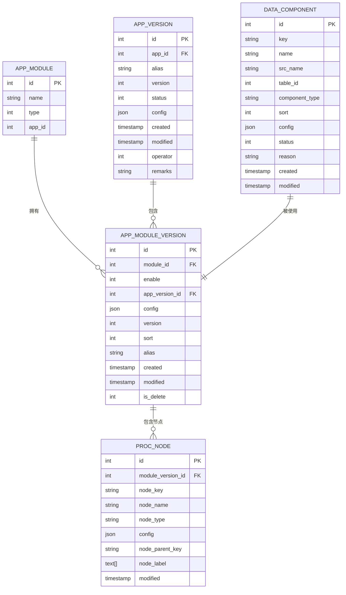

# 模块管理

<cite>
**本文引用的文件**
- [AppService.php](file://process/src/services/AppService.php)
- [Questionnaire.php](file://process/src/http/site/Questionnaire.php)
- [AppModuleModel.php](file://process/src/models/AppModuleModel.php)
- [AppModuleVersionModel.php](file://process/src/models/AppModuleVersionModel.php)
- [AppVersionModel.php](file://process/src/models/AppVersionModel.php)
- [ProcNodeModel.php](file://process/src/models/ProcNodeModel.php)
- [Form.php](file://process/src/modules/Form.php)
- [Process.php](file://process/src/modules/Process.php)
- [Component.php](file://process/src/modules/form/components/Component.php)
- [Module.php](file://process/src/modules/Module.php)
- [database.sql](file://process/docs/sql/database.sql)
</cite>

## 目录
1. [引言](#引言)
2. [项目结构](#项目结构)
3. [核心组件](#核心组件)
4. [架构总览](#架构总览)
5. [详细组件分析](#详细组件分析)
6. [依赖分析](#依赖分析)
7. [性能考量](#性能考量)
8. [故障排查指南](#故障排查指南)
9. [结论](#结论)
10. [附录](#附录)

## 引言
本文件面向 htdNew 项目的“模块管理”能力，聚焦于表单与流程两类模块的创建、配置保存与版本管理。文档围绕以下目标展开：
- 解释 saveAppModule 与 saveModule 的实现逻辑，涵盖模块类型判断、配置合并与数据组件锁定。
- 说明流程模块的版本管理策略，包括版本创建、配置更新与节点数据处理。
- 阐述流程模块的特殊处理逻辑，如节点验证、智能审批规则变更清理、会话清理。
- 提供模块管理的开发指南，包含配置规范、数据验证与错误处理机制。

## 项目结构
模块管理涉及的服务层、模型层与控制器层协同工作：
- 控制器层负责接收请求、鉴权与事务封装，典型入口为站点控制器。
- 服务层承担业务编排，如模块创建、版本保存、节点与数据组件处理。
- 模型层承载数据持久化与基础校验，包括模块、版本、节点与数据组件等。
- 模块层抽象表单与流程两类业务对象，提供统一的配置加载与事件初始化。

图表来源
- [Questionnaire.php](file://process/src/http/site/Questionnaire.php#L458-L526)
- [AppService.php](file://process/src/services/AppService.php#L89-L221)
- [AppModuleModel.php](file://process/src/models/AppModuleModel.php#L1-L61)
- [AppModuleVersionModel.php](file://process/src/models/AppModuleVersionModel.php#L1-L120)
- [AppVersionModel.php](file://process/src/models/AppVersionModel.php#L1-L200)
- [ProcNodeModel.php](file://process/src/models/ProcNodeModel.php#L1-L120)
- [Form.php](file://process/src/modules/Form.php#L1-L120)
- [Process.php](file://process/src/modules/Process.php#L1-L120)
- [Module.php](file://process/src/modules/Module.php#L1-L34)

章节来源
- [Questionnaire.php](file://process/src/http/site/Questionnaire.php#L458-L526)
- [AppService.php](file://process/src/services/AppService.php#L89-L221)

## 核心组件
- 服务层 AppService：提供模块与版本的创建、保存、节点与数据组件处理、版本发布等能力。
- 控制器层 Questionnaire：封装权限校验与事务，调用 AppService 完成模块与版本保存。
- 模型层：
  - AppModuleModel：模块元数据与类型约束。
  - AppModuleVersionModel：模块版本持久化与克隆。
  - AppVersionModel：版本聚合、事件分发、场景权限与流程/表单模块索引。
  - ProcNodeModel：流程节点配置、审批人计算、节点校验与超时处理。
  - DataComponentModel：数据组件元信息。
- 模块层：
  - Form：表单组件加载、权限过滤、保存数据构建与校验。
  - Process：流程引擎入口、下一节点推导、审批人设置与跳过任务处理。
  - Module：模块抽象基类，提供版本与模块对象访问。

章节来源
- [AppService.php](file://process/src/services/AppService.php#L89-L221)
- [AppModuleModel.php](file://process/src/models/AppModuleModel.php#L1-L61)
- [AppModuleVersionModel.php](file://process/src/models/AppModuleVersionModel.php#L1-L120)
- [AppVersionModel.php](file://process/src/models/AppVersionModel.php#L1-L200)
- [ProcNodeModel.php](file://process/src/models/ProcNodeModel.php#L1-L120)
- [Form.php](file://process/src/modules/Form.php#L1-L120)
- [Process.php](file://process/src/modules/Process.php#L1-L120)
- [Module.php](file://process/src/modules/Module.php#L1-L34)

## 架构总览
模块管理的关键流程如下：
- 控制器接收请求，进行权限校验与事务包裹。
- 服务层根据模块类型分别处理：表单保存数据组件并锁定；流程保存节点数据并校验开始/结束节点。
- 版本模型负责版本号生成与缓存清理；节点模型负责节点校验与智能审批规则变更清理。
- 模块层 Form/Process 提供组件加载与流程引擎交互。

图表来源
- [Questionnaire.php](file://process/src/http/site/Questionnaire.php#L458-L526)
- [AppService.php](file://process/src/services/AppService.php#L89-L221)
- [AppModuleModel.php](file://process/src/models/AppModuleModel.php#L1-L61)
- [AppModuleVersionModel.php](file://process/src/models/AppModuleVersionModel.php#L1-L120)
- [AppVersionModel.php](file://process/src/models/AppVersionModel.php#L1-L200)
- [ProcNodeModel.php](file://process/src/models/ProcNodeModel.php#L1-L120)
- [DataComponentModel.php](file://process/src/models/DataComponentModel.php#L1-L48)

## 详细组件分析

### 服务层：AppService
- saveAppModule：创建或更新模块元数据，返回模块ID。
- saveModule：
  - 类型判断：根据模块类型分别处理流程与表单。
  - 流程模块特殊处理：
    - 节点变更检测：若删除旧节点且存在正式会话，抛出异常阻止删除。
    - 会话清理：删除正式会话时清理测试会话备份。
    - 开始/结束节点校验：确保流程图包含开始与结束节点。
    - 智能审批规则变更：当节点配置中的智能审批规则或重点信息发生变更，清理旧的分析数据。
  - 表单模块特殊处理：
    - 数据组件锁定：校验组件与表的可重复性约束，写入使用关系，并向第三方平台锁定字段。
  - 版本缓存清理：保存后清理版本缓存，保证配置生效。
- saveAppVersion：合并配置片段，生成版本号并记录操作日志。

图表来源
- [AppService.php](file://process/src/services/AppService.php#L156-L221)
- [AppService.php](file://process/src/services/AppService.php#L223-L322)
- [AppService.php](file://process/src/services/AppService.php#L324-L342)

章节来源
- [AppService.php](file://process/src/services/AppService.php#L89-L221)
- [AppService.php](file://process/src/services/AppService.php#L223-L342)

### 控制器层：Questionnaire
- moduleSave：保存模块元数据，带权限校验与事务。
- moduleVersionSave：保存模块版本配置，带权限校验与事务。
- formDetail：读取模块版本详情，流程模块补充节点数据与数据占用标记。

章节来源
- [Questionnaire.php](file://process/src/http/site/Questionnaire.php#L458-L526)
- [Questionnaire.php](file://process/src/http/site/Questionnaire.php#L479-L498)
- [Questionnaire.php](file://process/src/http/site/Questionnaire.php#L500-L532)

### 模型层：模块与版本
- AppModuleModel：定义模块类型（表单/流程），约束名称长度与表单重复性。
- AppModuleVersionModel：版本持久化，生成版本号，保存后更新所属版本的修改时间；支持克隆并携带节点数据。
- AppVersionModel：版本聚合，维护模块对象索引与事件分发；提供默认流程、场景权限与采集规则初始化。

章节来源
- [AppModuleModel.php](file://process/src/models/AppModuleModel.php#L1-L61)
- [AppModuleVersionModel.php](file://process/src/models/AppModuleVersionModel.php#L1-L120)
- [AppVersionModel.php](file://process/src/models/AppVersionModel.php#L1-L200)

### 模块层：Form 与 Process
- Form：加载表单组件，按权限过滤与校验，构建保存数据；支持默认值与重复表子组件初始化。
- Process：初始化节点映射，推导下一节点，设置审批人并支持跳过任务；封装流程引擎入口。

章节来源
- [Form.php](file://process/src/modules/Form.php#L1-L120)
- [Process.php](file://process/src/modules/Process.php#L1-L120)
- [Module.php](file://process/src/modules/Module.php#L1-L34)

### 节点与数据组件
- ProcNodeModel：节点配置校验（审批人、表达式）、超时任务调度、加签与跳过任务支持。
- DataComponentModel：数据组件元信息，配合 AppService 的数据组件锁定逻辑。

章节来源
- [ProcNodeModel.php](file://process/src/models/ProcNodeModel.php#L1-L120)
- [DataComponentModel.php](file://process/src/models/DataComponentModel.php#L1-L48)

## 依赖分析
模块管理的依赖关系如下：
- 控制器依赖服务层完成业务编排。
- 服务层依赖模型层进行数据持久化与校验。
- 模块层依赖模型层加载配置与事件。
- 流程模块依赖节点模型进行校验与规则清理。
- 表单模块依赖组件模型进行数据组件锁定与权限过滤。

图表来源
- [Questionnaire.php](file://process/src/http/site/Questionnaire.php#L458-L526)
- [AppService.php](file://process/src/services/AppService.php#L89-L221)
- [AppModuleModel.php](file://process/src/models/AppModuleModel.php#L1-L61)
- [AppModuleVersionModel.php](file://process/src/models/AppModuleVersionModel.php#L1-L120)
- [AppVersionModel.php](file://process/src/models/AppVersionModel.php#L1-L200)
- [ProcNodeModel.php](file://process/src/models/ProcNodeModel.php#L1-L120)
- [DataComponentModel.php](file://process/src/models/DataComponentModel.php#L1-L48)
- [Form.php](file://process/src/modules/Form.php#L1-L120)
- [Process.php](file://process/src/modules/Process.php#L1-L120)
- [Module.php](file://process/src/modules/Module.php#L1-L34)

## 性能考量
- 版本缓存清理：保存模块/版本后清理版本缓存，避免脏读，但需注意频繁保存带来的缓存抖动。
- 节点批量处理：保存节点时进行旧节点ID集合比对与差异删除，建议在大规模节点场景下关注数据库删除开销。
- 数据组件锁定：批量锁定字段时按表粒度聚合，减少第三方平台调用次数。
- 事务边界：控制器层统一开启/回滚事务，避免部分保存导致的数据不一致。

[本节为通用指导，不直接分析具体文件]

## 故障排查指南
- 权限不足：控制器在保存模块与版本前进行权限校验，若无权限将抛出异常。检查用户授权与应用授权范围。
- 无可用审批人：流程节点校验要求审批人存在，否则抛出异常。检查节点配置与审批人来源。
- 节点删除受限：若流程存在正式会话，删除环节将被阻止。需清理相关会话或切换为测试模式。
- 智能审批规则变更：节点配置中的智能审批规则或重点信息变更会清理旧分析数据，避免历史数据污染。
- 表单数据组件锁定失败：当组件与表的可重复性不匹配时抛出异常。检查组件类型与数据表配置。

章节来源
- [Questionnaire.php](file://process/src/http/site/Questionnaire.php#L458-L526)
- [ProcNodeModel.php](file://process/src/models/ProcNodeModel.php#L444-L464)
- [AppService.php](file://process/src/services/AppService.php#L156-L221)
- [AppService.php](file://process/src/services/AppService.php#L223-L342)

## 结论
htdNew 的模块管理以服务层为核心，结合控制器层的权限与事务控制、模型层的数据持久化与校验、以及模块层的配置加载与引擎交互，实现了表单与流程模块的完整生命周期管理。流程模块在节点变更与智能审批规则方面具备完善的保护与清理机制，表单模块在数据组件层面提供了严格的可重复性与锁定保障。遵循本文的配置规范与开发指南，可有效提升模块管理的稳定性与可维护性。

[本节为总结性内容，不直接分析具体文件]

## 附录

### 配置规范与约定
- 模块类型：
  - 表单：TYPE_FORM
  - 流程：TYPE_PROCESS
- 版本号生成：AppVersionModel 在新建时自动生成版本号；AppModuleVersionModel 在新建时自动生成版本号。
- 节点数据：
  - 流程模块保存时，节点数据包含节点键、名称、类型、父节点键、配置与标签等。
  - 节点校验包括审批人存在性与表达式合法性。
- 数据组件：
  - 组件与表的可重复性必须匹配，否则抛出异常。
  - 使用关系写入后，向第三方平台锁定字段，防止外部修改。

章节来源
- [AppModuleModel.php](file://process/src/models/AppModuleModel.php#L1-L61)
- [AppModuleVersionModel.php](file://process/src/models/AppModuleVersionModel.php#L1-L120)
- [AppVersionModel.php](file://process/src/models/AppVersionModel.php#L1-L200)
- [ProcNodeModel.php](file://process/src/models/ProcNodeModel.php#L1-L120)
- [Component.php](file://process/src/modules/form/components/Component.php#L1-L120)
- [AppService.php](file://process/src/services/AppService.php#L223-L342)

### 数据模型概览

图表来源
- [AppModuleModel.php](file://process/src/models/AppModuleModel.php#L1-L61)
- [AppModuleVersionModel.php](file://process/src/models/AppModuleVersionModel.php#L1-L120)
- [AppVersionModel.php](file://process/src/models/AppVersionModel.php#L1-L200)
- [ProcNodeModel.php](file://process/src/models/ProcNodeModel.php#L1-L120)
- [DataComponentModel.php](file://process/src/models/DataComponentModel.php#L1-L48)
- [database.sql](file://process/docs/sql/database.sql#L269-L310)