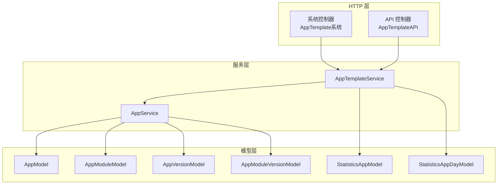
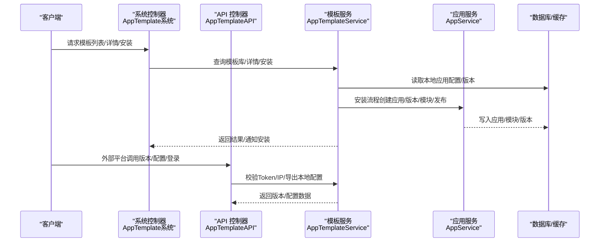
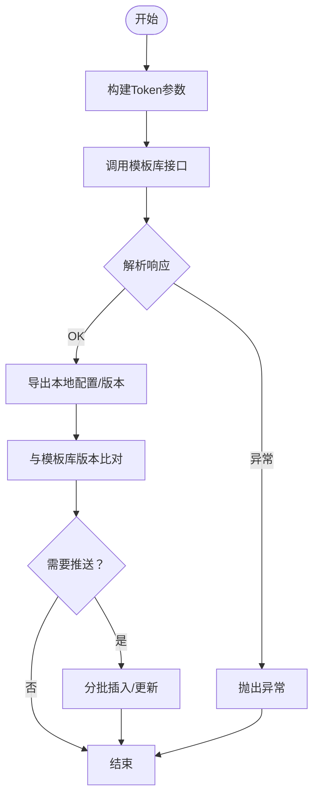
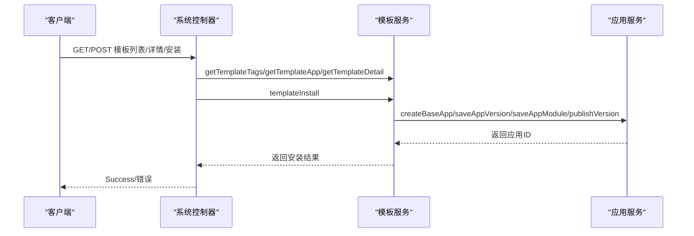
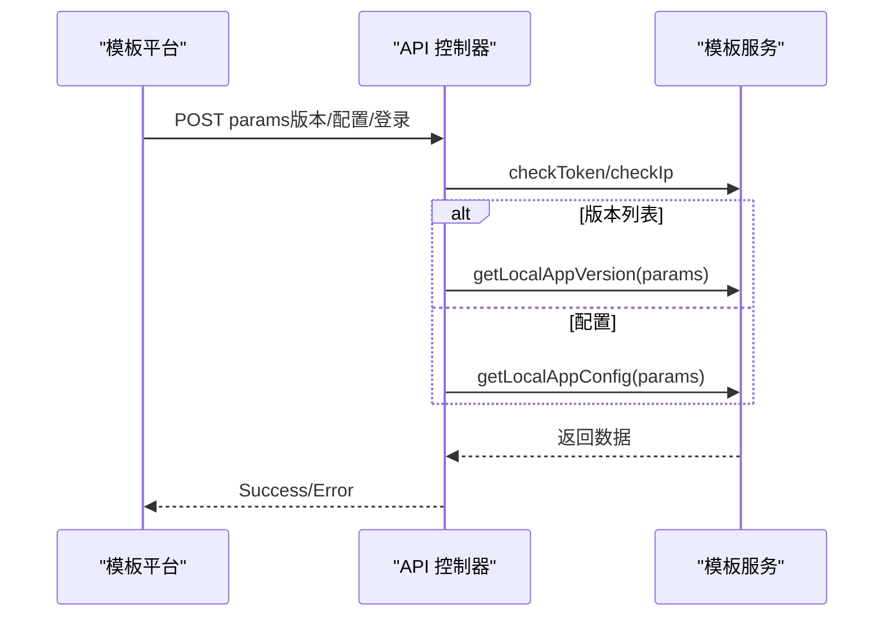
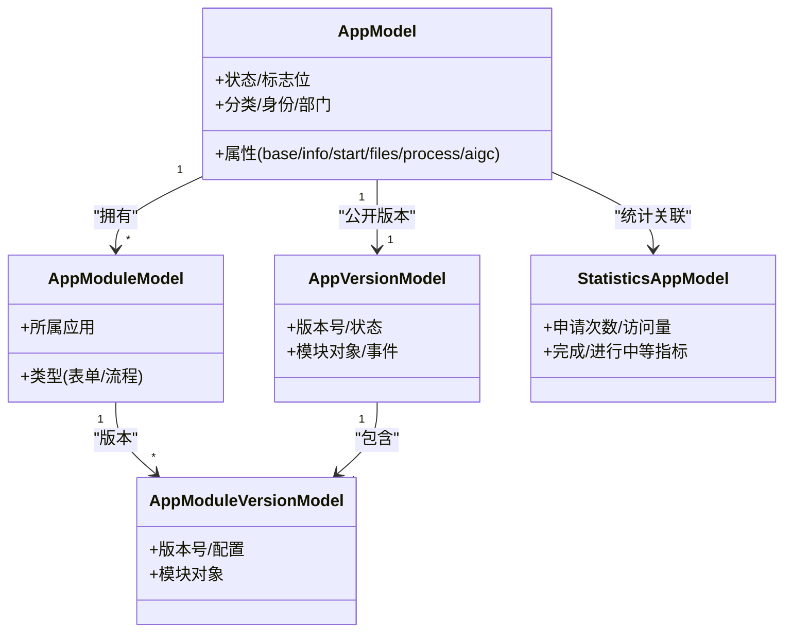
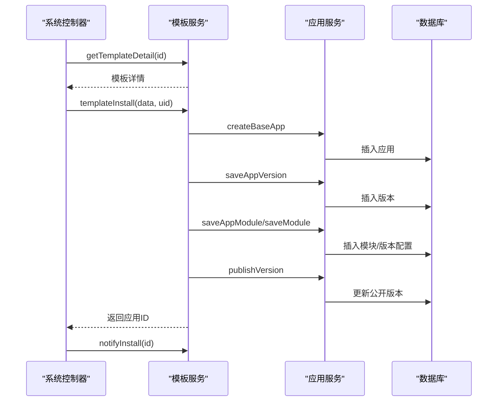
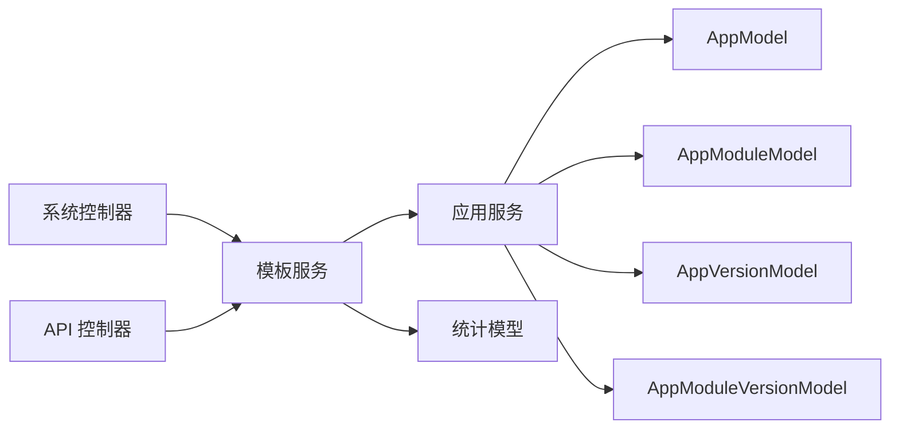

# 模板服务

<cite>
**本文引用的文件**
- [AppTemplateService.php](file://process/src/services/AppTemplateService.php)
- [AppTemplate.php（系统）](file://process/src/http/system/AppTemplate.php)
- [AppTemplate.php（API）](file://process/src/http/api/AppTemplate.php)
- [AppModel.php](file://process/src/models/AppModel.php)
- [AppModuleModel.php](file://process/src/models/AppModuleModel.php)
- [AppVersionModel.php](file://process/src/models/AppVersionModel.php)
- [AppModuleVersionModel.php](file://process/src/models/AppModuleVersionModel.php)
- [StatisticsAppModel.php](file://process/src/models/StatisticsAppModel.php)
- [StatisticsAppDayModel.php](file://process/src/models/StatisticsAppDayModel.php)
- [FormTemplateModel.php](file://process/src/models/FormTemplateModel.php)
- [FileTemplate.php](file://process/src/services/FileTemplate.php)
- [AppService.php](file://process/src/services/AppService.php)
- [Statistics.php](file://process/src/services/Statistics.php)
</cite>

## 目录
1. [简介](#简介)
2. [项目结构](#项目结构)
3. [核心组件](#核心组件)
4. [架构总览](#架构总览)
5. [详细组件分析](#详细组件分析)
6. [依赖关系分析](#依赖关系分析)
7. [性能考量](#性能考量)
8. [故障排查指南](#故障排查指南)
9. [结论](#结论)
10. [附录](#附录)

## 简介
本文件面向 htdNew 项目的“模板服务”，系统化阐述事项模板的设计原理与实现机制，覆盖模板创建、配置管理、使用统计、版本控制与与应用的关系。重点包括：
- 模板数据结构与分类体系
- 模板版本控制策略
- 模板与应用的映射与安装流程
- 查询接口、过滤与排序规则
- 使用示例、最佳实践、性能优化与扩展性建议

## 项目结构
模板服务位于 process/src/services 下，围绕 AppTemplateService 提供模板库交互、本地模板配置导出、版本对比与推送、安装与通知等功能；HTTP 层通过系统控制器与 API 控制器分别提供前端查询与外部平台对接。

图表来源
- [AppTemplate.php（系统）](file://process/src/http/system/AppTemplate.php#L1-L104)
- [AppTemplate.php（API）](file://process/src/http/api/AppTemplate.php#L1-L89)
- [AppTemplateService.php](file://process/src/services/AppTemplateService.php#L1-L596)
- [AppService.php](file://process/src/services/AppService.php#L76-L124)
- [AppModel.php](file://process/src/models/AppModel.php#L1-L200)
- [AppModuleModel.php](file://process/src/models/AppModuleModel.php#L1-L61)
- [AppVersionModel.php](file://process/src/models/AppVersionModel.php#L1-L200)
- [AppModuleVersionModel.php](file://process/src/models/AppModuleVersionModel.php#L43-L95)
- [StatisticsAppModel.php](file://process/src/models/StatisticsAppModel.php#L1-L136)
- [StatisticsAppDayModel.php](file://process/src/models/StatisticsAppDayModel.php#L1-L47)

章节来源
- [AppTemplate.php（系统）](file://process/src/http/system/AppTemplate.php#L1-L104)
- [AppTemplate.php（API）](file://process/src/http/api/AppTemplate.php#L1-L89)
- [AppTemplateService.php](file://process/src/services/AppTemplateService.php#L1-L596)

## 核心组件
- 模板服务 AppTemplateService：负责模板库交互、令牌校验、IP 白名单、本地模板配置导出、版本对比与推送、安装流程编排与事务控制。
- 系统控制器 AppTemplate（系统）：提供模板列表、标签、详情与安装能力，支持关键词、标签、问卷分类等过滤与分页。
- API 控制器 AppTemplate（API）：对外提供模板平台接口，支持版本列表与配置拉取、登录与安全校验。
- 应用服务 AppService：封装应用、模块、版本的创建与发布，作为模板安装的底层操作。
- 模型层：AppModel、AppModuleModel、AppVersionModel、AppModuleVersionModel 等支撑模板与应用的元数据与版本管理。
- 统计模型：StatisticsAppModel、StatisticsAppDayModel 提供使用次数、访问量等统计指标。

章节来源
- [AppTemplateService.php](file://process/src/services/AppTemplateService.php#L1-L596)
- [AppTemplate.php（系统）](file://process/src/http/system/AppTemplate.php#L1-L104)
- [AppTemplate.php（API）](file://process/src/http/api/AppTemplate.php#L1-L89)
- [AppService.php](file://process/src/services/AppService.php#L76-L124)
- [AppModel.php](file://process/src/models/AppModel.php#L1-L200)
- [AppModuleModel.php](file://process/src/models/AppModuleModel.php#L1-L61)
- [AppVersionModel.php](file://process/src/models/AppVersionModel.php#L1-L200)
- [AppModuleVersionModel.php](file://process/src/models/AppModuleVersionModel.php#L43-L95)
- [StatisticsAppModel.php](file://process/src/models/StatisticsAppModel.php#L1-L136)
- [StatisticsAppDayModel.php](file://process/src/models/StatisticsAppDayModel.php#L1-L47)

## 架构总览
模板服务采用“HTTP 控制器 → 服务层 → 模型层”的分层架构。系统控制器负责业务入口与参数处理，API 控制器负责外部平台对接与安全校验，服务层统一编排模板库交互与本地应用安装，模型层承载数据结构与版本演进。

图表来源
- [AppTemplate.php（系统）](file://process/src/http/system/AppTemplate.php#L1-L104)
- [AppTemplate.php（API）](file://process/src/http/api/AppTemplate.php#L1-L89)
- [AppTemplateService.php](file://process/src/services/AppTemplateService.php#L1-L596)
- [AppService.php](file://process/src/services/AppService.php#L76-L124)

## 详细组件分析

### 模板服务 AppTemplateService
- 模板库常量与安全机制：定义模板库域名、接口路径、API 密钥、Token 生成与校验、IP 白名单校验。
- 模板查询与详情：封装模板库列表、标签、详情接口调用，统一参数签名与代理转发。
- 本地配置导出：导出本地应用的版本、模块配置、统计指标与标签，用于模板平台同步或推送。
- 版本对比与推送：周期性推送本地应用版本与模块修改时间，与模板库进行差异比对并批量插入/更新。
- 模板安装：以事务方式完成应用创建、版本创建、模块保存与发布，兼容表单/流程两种模块类型。
- 使用统计：聚合申请次数、访问量、发起人数等指标，支持问卷与普通应用区分。

图表来源
- [AppTemplateService.php](file://process/src/services/AppTemplateService.php#L1-L596)

章节来源
- [AppTemplateService.php](file://process/src/services/AppTemplateService.php#L1-L596)

### 系统控制器 AppTemplate（系统）
- 模板标签：调用模板服务获取标签列表。
- 模板列表：支持关键词、标签、是否问卷、分类等过滤，分页返回模板列表。
- 模板详情：获取模板详情，返回名称、标签与模块集合。
- 模板安装：获取模板详情，组装安装数据，调用模板服务安装并通知模板库。

图表来源
- [AppTemplate.php（系统）](file://process/src/http/system/AppTemplate.php#L1-L104)
- [AppTemplateService.php](file://process/src/services/AppTemplateService.php#L1-L596)
- [AppService.php](file://process/src/services/AppService.php#L76-L124)

章节来源
- [AppTemplate.php（系统）](file://process/src/http/system/AppTemplate.php#L1-L104)

### API 控制器 AppTemplate（API）
- 对外接口：接收模板平台请求，校验 Token 与来源 IP，返回本地应用版本列表或配置。
- 登录接口：基于预设账号与 Token 校验，完成登录态切换。

图表来源
- [AppTemplate.php（API）](file://process/src/http/api/AppTemplate.php#L1-L89)
- [AppTemplateService.php](file://process/src/services/AppTemplateService.php#L1-L596)

章节来源
- [AppTemplate.php（API）](file://process/src/http/api/AppTemplate.php#L1-L89)

### 模板数据结构与分类体系
- 应用与模块：应用包含多个模块，模块分为表单与流程两类，每类模块对应不同的配置结构。
- 版本模型：每个模块有版本模型，记录配置、修改时间等，版本号由模块内递增。
- 分类与标签：应用具备部门、身份、分类等属性，形成服务范围与标签集合，用于筛选与展示。
- 问卷分类：问卷应用具备独立分类字段，用于问卷平台同步。

图表来源
- [AppModel.php](file://process/src/models/AppModel.php#L1-L200)
- [AppModuleModel.php](file://process/src/models/AppModuleModel.php#L1-L61)
- [AppVersionModel.php](file://process/src/models/AppVersionModel.php#L1-L200)
- [AppModuleVersionModel.php](file://process/src/models/AppModuleVersionModel.php#L43-L95)
- [StatisticsAppModel.php](file://process/src/models/StatisticsAppModel.php#L1-L136)

章节来源
- [AppModel.php](file://process/src/models/AppModel.php#L1-L200)
- [AppModuleModel.php](file://process/src/models/AppModuleModel.php#L1-L61)
- [AppVersionModel.php](file://process/src/models/AppVersionModel.php#L1-L200)
- [AppModuleVersionModel.php](file://process/src/models/AppModuleVersionModel.php#L43-L95)
- [StatisticsAppModel.php](file://process/src/models/StatisticsAppModel.php#L1-L136)

### 模板版本控制
- 版本生成：模块版本号在新增时自增，版本修改时间随模块版本更新而更新。
- 公开版本：应用公开版本指向当前生效的版本，用于模板平台同步与安装。
- 版本对比：模板服务根据应用与模块的修改时间计算版本号，用于与模板库进行差异比对。
- 问卷特殊处理：问卷应用版本号以当日零点为基准，确保同日多次修改不重复推送。

章节来源
- [AppModuleVersionModel.php](file://process/src/models/AppModuleVersionModel.php#L43-L95)
- [AppTemplateService.php](file://process/src/services/AppTemplateService.php#L280-L419)

### 模板与应用的关系与安装流程
- 安装步骤：创建应用 → 创建版本 → 保存模块（表单/流程） → 启用版本 → 事务提交。
- 模块配置：表单模块保存表格与插件配置，流程模块保存流程图与 SVG 等配置。
- 安装通知：安装完成后向模板库发送通知，标记安装成功。

图表来源
- [AppTemplate.php（系统）](file://process/src/http/system/AppTemplate.php#L41-L79)
- [AppTemplateService.php](file://process/src/services/AppTemplateService.php#L139-L277)
- [AppService.php](file://process/src/services/AppService.php#L76-L124)

章节来源
- [AppTemplate.php（系统）](file://process/src/http/system/AppTemplate.php#L41-L79)
- [AppTemplateService.php](file://process/src/services/AppTemplateService.php#L139-L277)
- [AppService.php](file://process/src/services/AppService.php#L76-L124)

### 查询接口、过滤条件与排序规则
- 系统控制器（模板平台）：
  - 过滤：关键词（模糊）、标签（交集）、是否问卷、问卷分类。
  - 分页：page、pageSize。
  - 排序：order 数组。
- API 控制器（模板平台对接）：
  - 参数 params：支持 is_version_list 标记以返回版本列表或配置列表。
  - 安全校验：checkToken、checkIp。
- 本地导出：
  - getLocalAppVersion：返回应用与模块的最新修改时间，用于版本比对。
  - getLocalAppConfig：返回应用的模块配置、统计指标与标签，用于模板平台同步。

章节来源
- [AppTemplate.php（系统）](file://process/src/http/system/AppTemplate.php#L21-L39)
- [AppTemplate.php（API）](file://process/src/http/api/AppTemplate.php#L24-L51)
- [AppTemplateService.php](file://process/src/services/AppTemplateService.php#L280-L419)

### 使用示例与最佳实践
- 模板设计规范
  - 模块命名：表单模块名称在同一应用内唯一，避免重复。
  - 配置结构：表单模块保存 table 与 plugins，流程模块保存 proc/xml/svg。
  - 标签与分类：合理设置部门、身份、分类，提升筛选与统计准确性。
- 安装流程
  - 先获取模板详情，确认模块集合后再执行安装。
  - 安装过程在事务中执行，失败自动回滚，确保数据一致性。
- 性能优化
  - 批量推送：模板服务按批次推送应用配置，减少单次请求压力。
  - 缓存与索引：利用模型缓存与数据库索引，降低查询成本。
  - 版本比对：仅比较修改时间，避免全量导出。
- 扩展性考虑
  - 新增模块类型：在 AppModuleModel 中扩展类型枚举，并在模板安装逻辑中补充配置保存分支。
  - 统计扩展：在统计模型中增加新指标，结合模板服务导出字段扩展。

章节来源
- [AppModuleModel.php](file://process/src/models/AppModuleModel.php#L1-L61)
- [AppTemplateService.php](file://process/src/services/AppTemplateService.php#L240-L277)
- [Statistics.php](file://process/src/services/Statistics.php#L743-L770)

## 依赖关系分析
- 控制器依赖服务：系统控制器与 API 控制器均依赖模板服务进行模板库交互与本地配置导出。
- 服务依赖应用服务：模板安装流程依赖应用服务完成应用、版本与模块的创建与发布。
- 模型依赖：应用模型、模块模型、版本模型与统计模型共同构成模板与应用的数据基础。
- 外部依赖：模板库接口、HTTP 代理配置、Redis 缓存与数据库。

图表来源
- [AppTemplate.php（系统）](file://process/src/http/system/AppTemplate.php#L1-L104)
- [AppTemplate.php（API）](file://process/src/http/api/AppTemplate.php#L1-L89)
- [AppTemplateService.php](file://process/src/services/AppTemplateService.php#L1-L596)
- [AppService.php](file://process/src/services/AppService.php#L76-L124)
- [AppModel.php](file://process/src/models/AppModel.php#L1-L200)
- [AppModuleModel.php](file://process/src/models/AppModuleModel.php#L1-L61)
- [AppVersionModel.php](file://process/src/models/AppVersionModel.php#L1-L200)
- [AppModuleVersionModel.php](file://process/src/models/AppModuleVersionModel.php#L43-L95)
- [StatisticsAppModel.php](file://process/src/models/StatisticsAppModel.php#L1-L136)

章节来源
- [AppTemplate.php（系统）](file://process/src/http/system/AppTemplate.php#L1-L104)
- [AppTemplate.php（API）](file://process/src/http/api/AppTemplate.php#L1-L89)
- [AppTemplateService.php](file://process/src/services/AppTemplateService.php#L1-L596)
- [AppService.php](file://process/src/services/AppService.php#L76-L124)

## 性能考量
- 批处理推送：模板服务按 10 个一组分批推送，降低网络与数据库压力。
- 版本比对：仅依据修改时间进行版本比对，避免全量导出。
- 缓存命中：统计模型与部分查询使用 Redis 缓存，减少数据库访问。
- 事务控制：安装流程在事务中执行，失败回滚，避免中间状态污染。

章节来源
- [AppTemplateService.php](file://process/src/services/AppTemplateService.php#L502-L576)
- [StatisticsAppModel.php](file://process/src/models/StatisticsAppModel.php#L86-L136)
- [Statistics.php](file://process/src/services/Statistics.php#L743-L770)

## 故障排查指南
- Token 校验失败：检查时间戳是否过期、签名算法是否一致、API 密钥是否正确。
- IP 白名单拒绝：确认来源 IP 是否匹配白名单模式，或临时关闭白名单校验定位问题。
- 安装失败：查看安装流程中的异常栈，关注模块重复命名、配置缺失等问题。
- 推送失败：检查版本比对返回结果，确认 insert/update 列表非空且逐批推送成功。
- 统计异常：核对 Redis 缓存键与数据库统计表是否一致，必要时清理缓存重试。

章节来源
- [AppTemplateService.php](file://process/src/services/AppTemplateService.php#L426-L501)
- [AppTemplate.php（系统）](file://process/src/http/system/AppTemplate.php#L41-L79)
- [AppTemplate.php（API）](file://process/src/http/api/AppTemplate.php#L24-L51)

## 结论
模板服务通过清晰的分层设计与严格的版本控制机制，实现了模板库与本地应用的双向同步与安装。系统控制器与 API 控制器分别满足内部查询与外部平台对接需求，配合完善的统计与缓存策略，保障了性能与可维护性。未来可在模块类型扩展、统计指标丰富与推送策略优化方面持续演进。

## 附录
- 相关模型与服务文件可用于进一步扩展与集成：
  - 表单模板模型：用于表单类模板的存储与校验。
  - 文件模板服务：用于生成各类导入/导出模板文件，辅助模板设计与数据治理。
  - 统计服务：提供应用日统计与基础指标采集，支撑模板使用效果评估。

章节来源
- [FormTemplateModel.php](file://process/src/models/FormTemplateModel.php#L1-L57)
- [FileTemplate.php](file://process/src/services/FileTemplate.php#L1-L460)
- [Statistics.php](file://process/src/services/Statistics.php#L743-L770)