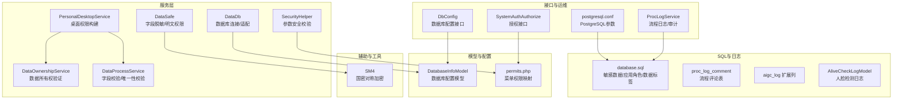
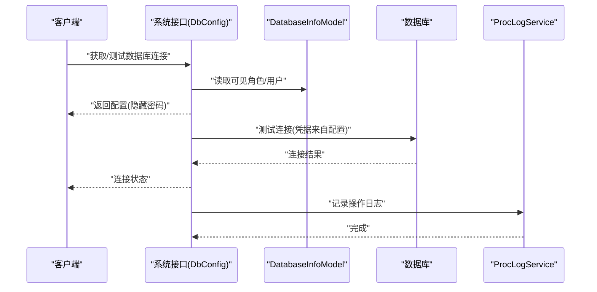
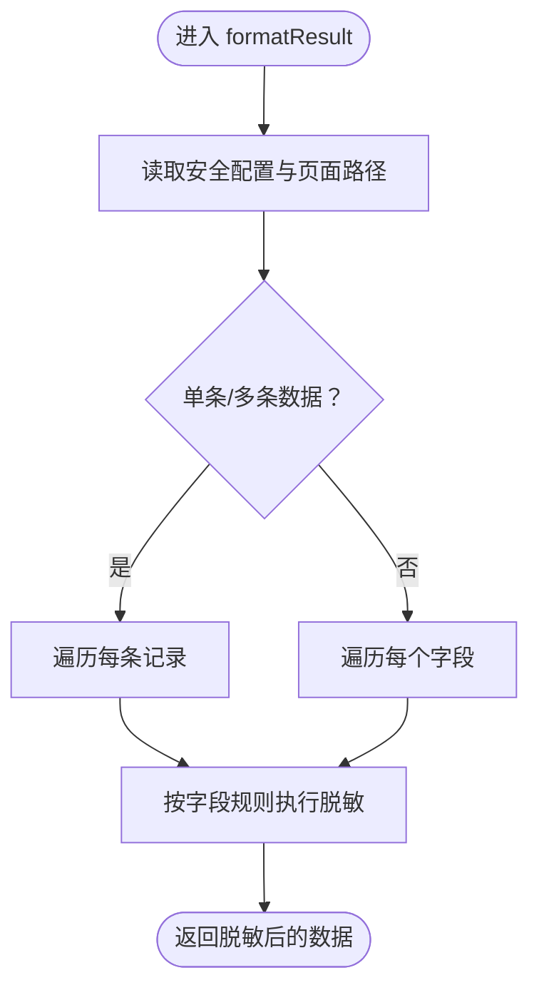
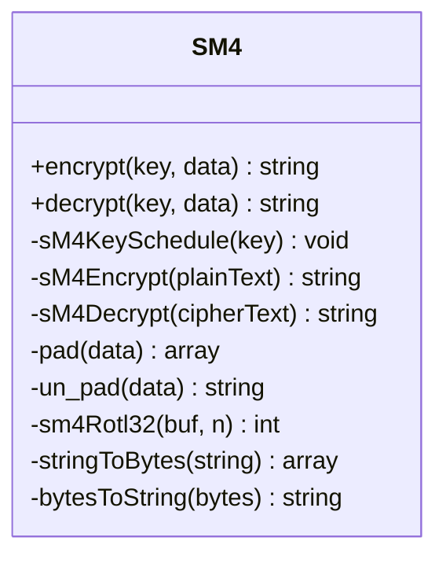
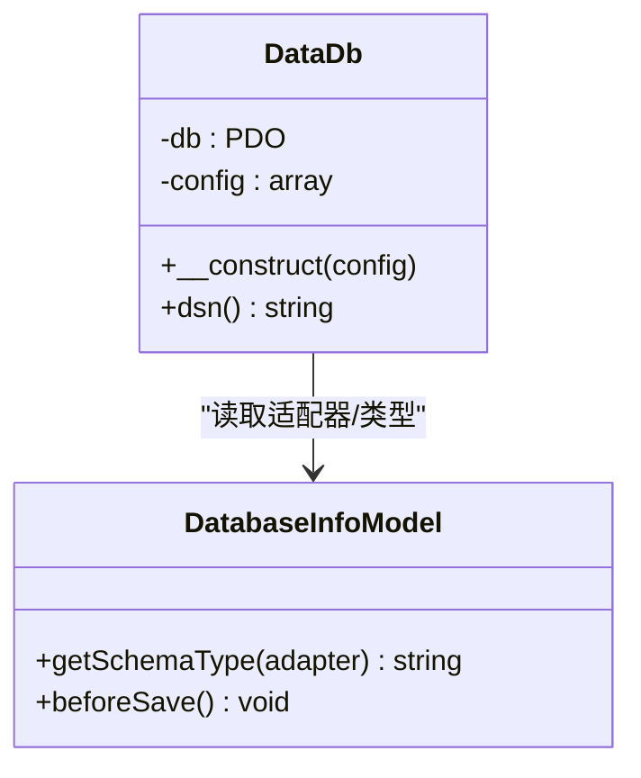
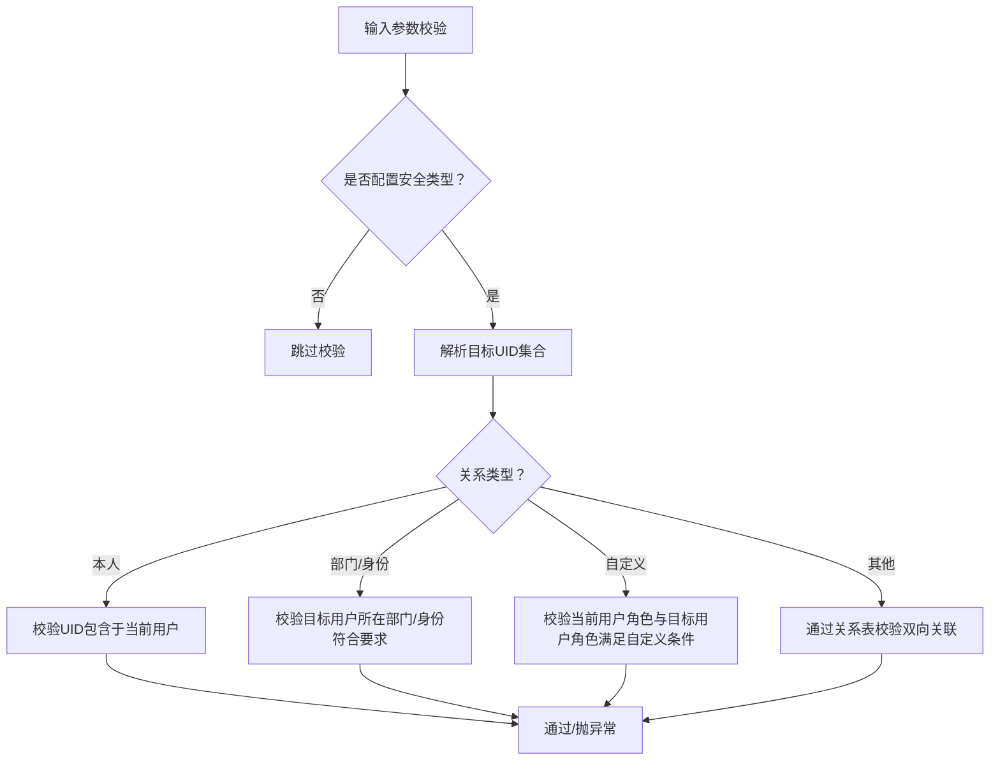
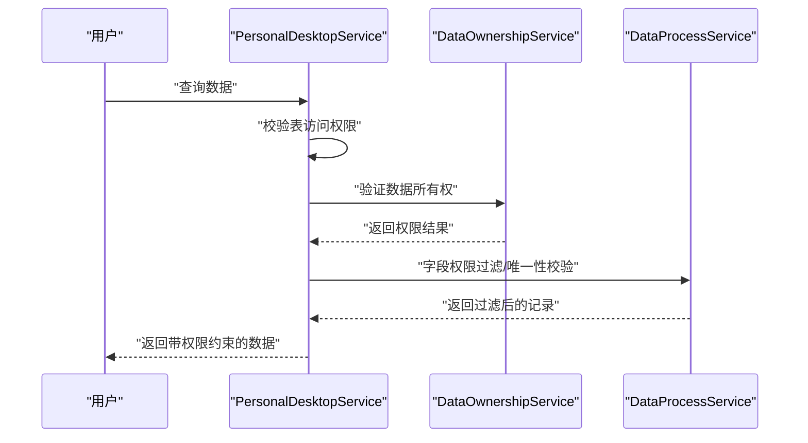
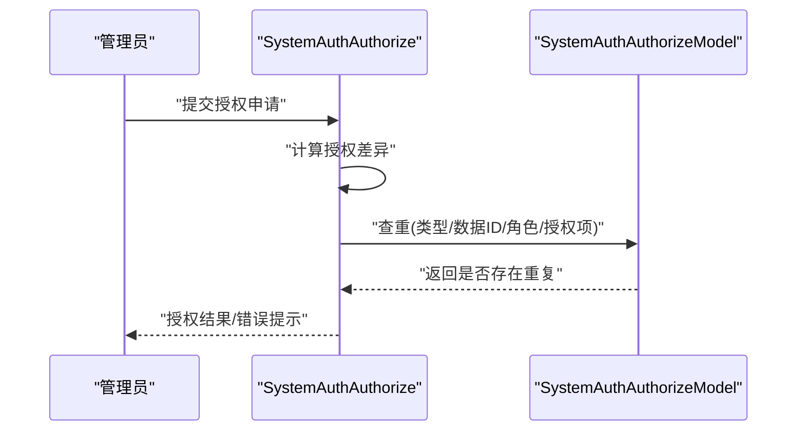
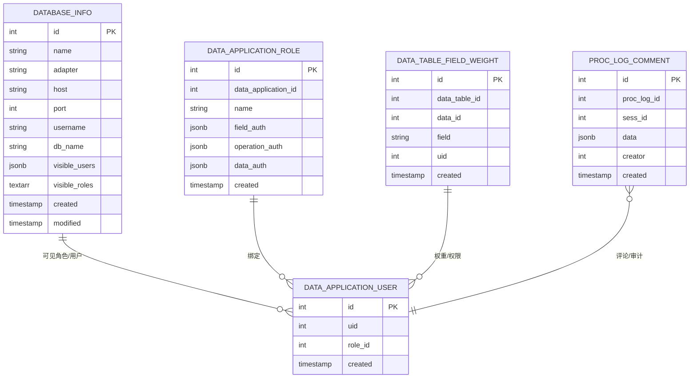
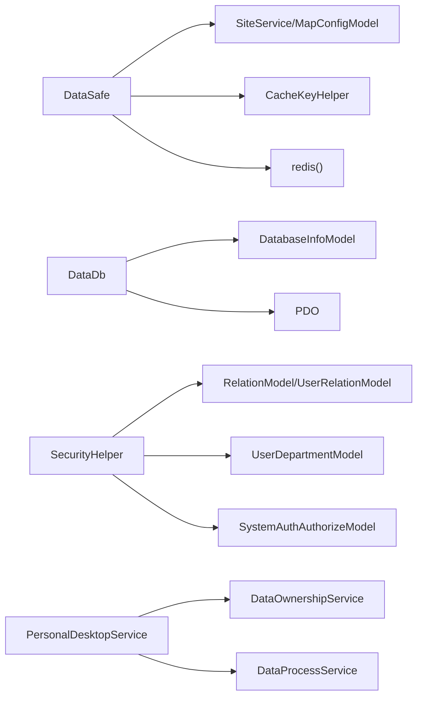

# 数据安全

<cite>
**本文引用的文件**
- [process/src/services/DataSafe.php](file://process/src/services/DataSafe.php)
- [process/src/helpers/SM4.php](file://process/src/helpers/SM4.php)
- [process/src/services/DataDb.php](file://process/src/services/DataDb.php)
- [process/src/models/DatabaseInfoModel.php](file://process/src/models/DatabaseInfoModel.php)
- [process/src/http/system/DbConfig.php](file://process/src/http/system/DbConfig.php)
- [process/docs/sql/database.sql](file://process/docs/sql/database.sql)
- [process/src/helpers/SecurityHelper.php](file://process/src/helpers/SecurityHelper.php)
- [process/src/config/permits.php](file://process/src/config/permits.php)
- [process/src/services/desktopManage/DataOwnershipService.php](file://process/src/services/desktopManage/DataOwnershipService.php)
- [process/src/services/desktopManage/PersonalDesktopService.php](file://process/src/services/desktopManage/PersonalDesktopService.php)
- [process/src/services/desktopManage/DataProcessService.php](file://process/src/services/desktopManage/DataProcessService.php)
- [process/src/services/ProcLogService.php](file://process/src/services/ProcLogService.php)
- [process/docker/services/postgres/postgresql.conf](file://process/docker/services/postgres/postgresql.conf)
- [process/src/migrations/migration_20250805_add_proc_log_comment.php](file://process/src/migrations/migration_20250805_add_proc_log_comment.php)
- [process/src/migrations/migration_20250427_aigc_log_add_like.php](file://process/src/migrations/migration_20250427_aigc_log_add_like.php)
- [process/src/http/system/SystemAuthAuthorize.php](file://process/src/http/system/SystemAuthAuthorize.php)
- [process/src/services/task/CheckDataApplication.php](file://process/src/services/task/CheckDataApplication.php)
- [process/src/models/AliveCheckLogModel.php](file://process/src/models/AliveCheckLogModel.php)
</cite>

## 目录
1. [引言](#引言)
2. [项目结构](#项目结构)
3. [核心组件](#核心组件)
4. [架构总览](#架构总览)
5. [详细组件分析](#详细组件分析)
6. [依赖关系分析](#依赖关系分析)
7. [性能考量](#性能考量)
8. [故障排查指南](#故障排查指南)
9. [结论](#结论)
10. [附录](#附录)

## 引言
本文件面向 htdNew 项目的“数据安全”主题，系统性梳理并说明以下方面：
- DataSafe 类的数据安全策略与实现，包括字段脱敏、明文查看权限控制、二次校验配置等
- DataDb 的数据库安全机制，包括连接配置、访问控制与安全审计
- 数据传输安全、存储安全与访问权限控制的技术实现
- 安全验证、数据脱敏与合规检查机制
- 数据安全的配置选项、策略与风险评估方法
- 实际应用场景与代码示例路径（以文件路径代替具体代码）

## 项目结构
围绕数据安全的关键目录与文件如下：
- 服务层：DataSafe、DataDb、SecurityHelper、桌面管理相关服务
- 辅助与工具：SM4 对称加密
- 数据模型与配置：DatabaseInfoModel、权限配置 permits.php
- 系统接口：数据库配置接口 DbConfig、授权接口 SystemAuthAuthorize
- SQL 文档：数据库表结构定义（含敏感数据日志、应用角色与用户、数据标签等）
- 运维与日志：ProcLogService、AIGC 日志迁移、AliveCheckLogModel
- Docker 配置：PostgreSQL 参数

图表来源
- [process/src/services/DataSafe.php](file://process/src/services/DataSafe.php#L1-L206)
- [process/src/helpers/SM4.php](file://process/src/helpers/SM4.php#L1-L177)
- [process/src/services/DataDb.php](file://process/src/services/DataDb.php#L1-L38)
- [process/src/models/DatabaseInfoModel.php](file://process/src/models/DatabaseInfoModel.php#L40-L85)
- [process/src/http/system/DbConfig.php](file://process/src/http/system/DbConfig.php#L92-L137)
- [process/src/helpers/SecurityHelper.php](file://process/src/helpers/SecurityHelper.php#L1-L118)
- [process/src/config/permits.php](file://process/src/config/permits.php#L1-L385)
- [process/src/services/desktopManage/DataOwnershipService.php](file://process/src/services/desktopManage/DataOwnershipService.php#L1-L40)
- [process/src/services/desktopManage/PersonalDesktopService.php](file://process/src/services/desktopManage/PersonalDesktopService.php#L226-L253)
- [process/src/services/desktopManage/DataProcessService.php](file://process/src/services/desktopManage/DataProcessService.php#L275-L296)
- [process/src/services/ProcLogService.php](file://process/src/services/ProcLogService.php#L589-L611)
- [process/docker/services/postgres/postgresql.conf](file://process/docker/services/postgres/postgresql.conf#L368-L400)
- [process/src/migrations/migration_20250805_add_proc_log_comment.php](file://process/src/migrations/migration_20250805_add_proc_log_comment.php#L1-L28)
- [process/src/migrations/migration_20250427_aigc_log_add_like.php](file://process/src/migrations/migration_20250427_aigc_log_add_like.php#L1-L28)
- [process/src/http/system/SystemAuthAuthorize.php](file://process/src/http/system/SystemAuthAuthorize.php#L41-L66)
- [process/src/models/AliveCheckLogModel.php](file://process/src/models/AliveCheckLogModel.php#L1-L41)

章节来源
- [process/src/services/DataSafe.php](file://process/src/services/DataSafe.php#L1-L206)
- [process/src/helpers/SM4.php](file://process/src/helpers/SM4.php#L1-L177)
- [process/src/services/DataDb.php](file://process/src/services/DataDb.php#L1-L38)
- [process/src/models/DatabaseInfoModel.php](file://process/src/models/DatabaseInfoModel.php#L40-L85)
- [process/src/http/system/DbConfig.php](file://process/src/http/system/DbConfig.php#L92-L137)
- [process/src/helpers/SecurityHelper.php](file://process/src/helpers/SecurityHelper.php#L1-L118)
- [process/src/config/permits.php](file://process/src/config/permits.php#L1-L385)
- [process/src/services/desktopManage/DataOwnershipService.php](file://process/src/services/desktopManage/DataOwnershipService.php#L1-L40)
- [process/src/services/desktopManage/PersonalDesktopService.php](file://process/src/services/desktopManage/PersonalDesktopService.php#L226-L253)
- [process/src/services/desktopManage/DataProcessService.php](file://process/src/services/desktopManage/DataProcessService.php#L275-L296)
- [process/src/services/ProcLogService.php](file://process/src/services/ProcLogService.php#L589-L611)
- [process/docker/services/postgres/postgresql.conf](file://process/docker/services/postgres/postgresql.conf#L368-L400)
- [process/src/migrations/migration_20250805_add_proc_log_comment.php](file://process/src/migrations/migration_20250805_add_proc_log_comment.php#L1-L28)
- [process/src/migrations/migration_20250427_aigc_log_add_like.php](file://process/src/migrations/migration_20250427_aigc_log_add_like.php#L1-L28)
- [process/src/http/system/SystemAuthAuthorize.php](file://process/src/http/system/SystemAuthAuthorize.php#L41-L66)
- [process/src/models/AliveCheckLogModel.php](file://process/src/models/AliveCheckLogModel.php#L1-L41)

## 核心组件
- DataSafe：负责字段脱敏、明文查看权限控制、二次校验配置读取
- SM4：国密对称加密工具，支持加密/解密
- DataDb：数据库连接封装，支持多种适配器（MySQL、PostgreSQL、Oracle）
- SecurityHelper：参数安全校验，基于部门/身份/自定义关系的范围控制
- 桌面管理相关服务：数据所有权验证、数据权限构建与字段校验
- ProcLogService：流程日志与审计信息组装
- permissions 配置：菜单权限映射，支撑访问控制
- 数据库表结构：敏感数据日志、应用角色与用户、数据标签等

章节来源
- [process/src/services/DataSafe.php](file://process/src/services/DataSafe.php#L1-L206)
- [process/src/helpers/SM4.php](file://process/src/helpers/SM4.php#L1-L177)
- [process/src/services/DataDb.php](file://process/src/services/DataDb.php#L1-L38)
- [process/src/helpers/SecurityHelper.php](file://process/src/helpers/SecurityHelper.php#L1-L118)
- [process/src/config/permits.php](file://process/src/config/permits.php#L1-L385)

## 架构总览
数据安全贯穿“输入校验—字段脱敏—访问控制—存储保护—传输加固—审计追踪”的闭环。

图表来源
- [process/src/http/system/DbConfig.php](file://process/src/http/system/DbConfig.php#L92-L137)
- [process/src/models/DatabaseInfoModel.php](file://process/src/models/DatabaseInfoModel.php#L40-L85)
- [process/src/services/ProcLogService.php](file://process/src/services/ProcLogService.php#L589-L611)

## 详细组件分析

### DataSafe：字段脱敏与明文权限
- 字段脱敏策略
  - 基于安全配置与页面白名单，对指定字段执行中间遮罩或局部遮罩
  - 支持手机号、身份证、工号、姓名、邮箱等常见字段的差异化脱敏规则
- 明文查看权限
  - 通过请求参数与缓存键判断是否允许查看明文
  - 权限有效期可按小时、按自然日或固定周期配置
- 二次校验配置
  - 读取安全配置并进行缓存一致性校验，防止配置被篡改

图表来源
- [process/src/services/DataSafe.php](file://process/src/services/DataSafe.php#L49-L185)

章节来源
- [process/src/services/DataSafe.php](file://process/src/services/DataSafe.php#L1-L206)

### SM4：国密对称加密
- 提供对称加解密能力，支持分块处理与 PKCS#7 填充
- 适用于本地数据保护与内部传输场景

图表来源
- [process/src/helpers/SM4.php](file://process/src/helpers/SM4.php#L1-L177)

章节来源
- [process/src/helpers/SM4.php](file://process/src/helpers/SM4.php#L1-L177)

### DataDb：数据库连接与适配
- 支持 MySQL、PostgreSQL、Oracle/SID 多种适配器
- 通过配置对象构造 PDO 连接，便于统一接入与扩展

图表来源
- [process/src/services/DataDb.php](file://process/src/services/DataDb.php#L1-L38)
- [process/src/models/DatabaseInfoModel.php](file://process/src/models/DatabaseInfoModel.php#L40-L85)

章节来源
- [process/src/services/DataDb.php](file://process/src/services/DataDb.php#L1-L38)
- [process/src/models/DatabaseInfoModel.php](file://process/src/models/DatabaseInfoModel.php#L40-L85)

### SecurityHelper：参数安全校验
- 基于用户关系（部门/身份/自定义）限制参数范围
- 支持“仅本人”、“下级部门”、“学生/教职工”等关系类型
- 未满足条件抛出异常，避免越权访问

图表来源
- [process/src/helpers/SecurityHelper.php](file://process/src/helpers/SecurityHelper.php#L1-L118)

章节来源
- [process/src/helpers/SecurityHelper.php](file://process/src/helpers/SecurityHelper.php#L1-L118)

### 桌面管理与数据权限
- 数据所有权验证：根据模型字段与用户工号判定归属，必要时通过子表共享判定
- 桌面权限构建：结合用户角色与数据表访问权限，动态拼装查询条件
- 字段与唯一性校验：在子表写入前进行字段权限过滤与唯一组合校验

图表来源
- [process/src/services/desktopManage/PersonalDesktopService.php](file://process/src/services/desktopManage/PersonalDesktopService.php#L226-L253)
- [process/src/services/desktopManage/DataOwnershipService.php](file://process/src/services/desktopManage/DataOwnershipService.php#L1-L40)
- [process/src/services/desktopManage/DataProcessService.php](file://process/src/services/desktopManage/DataProcessService.php#L275-L296)

章节来源
- [process/src/services/desktopManage/PersonalDesktopService.php](file://process/src/services/desktopManage/PersonalDesktopService.php#L226-L253)
- [process/src/services/desktopManage/DataOwnershipService.php](file://process/src/services/desktopManage/DataOwnershipService.php#L1-L40)
- [process/src/services/desktopManage/DataProcessService.php](file://process/src/services/desktopManage/DataProcessService.php#L275-L296)

### 授权与访问控制
- 菜单权限映射：通过 permits.php 将路径映射到角色集合，统一鉴权
- 授权接口：校验授权差异并去重，防止重复授权

图表来源
- [process/src/http/system/SystemAuthAuthorize.php](file://process/src/http/system/SystemAuthAuthorize.php#L41-L66)
- [process/src/config/permits.php](file://process/src/config/permits.php#L1-L385)

章节来源
- [process/src/http/system/SystemAuthAuthorize.php](file://process/src/http/system/SystemAuthAuthorize.php#L41-L66)
- [process/src/config/permits.php](file://process/src/config/permits.php#L1-L385)

### 数据库配置与安全审计
- 数据库配置接口：读取可见角色/用户，隐藏密码返回；支持测试连接
- 敏感数据日志：记录规则ID、用户UID、明文数据与时间
- 应用角色与用户：支持字段级、操作级、数据级权限配置
- 数据标签与第三方用章：记录平台、组件、状态等审计要素
- 流程日志评论：支持按会话维度记录评论，便于审计回溯

图表来源
- [process/docs/sql/database.sql](file://process/docs/sql/database.sql#L843-L2086)
- [process/src/migrations/migration_20250805_add_proc_log_comment.php](file://process/src/migrations/migration_20250805_add_proc_log_comment.php#L1-L28)

章节来源
- [process/src/http/system/DbConfig.php](file://process/src/http/system/DbConfig.php#L92-L137)
- [process/docs/sql/database.sql](file://process/docs/sql/database.sql#L843-L2086)
- [process/src/migrations/migration_20250805_add_proc_log_comment.php](file://process/src/migrations/migration_20250805_add_proc_log_comment.php#L1-L28)

### 数据传输与存储安全
- 传输安全：建议在生产环境启用 TLS/SSL；PostgreSQL 可通过参数调整日志级别与安全输出
- 存储安全：数据库凭据通过配置模型管理，接口返回时隐藏密码；敏感数据日志仅记录必要字段并建立索引
- 日志与审计：流程日志、AI生成日志扩展列、人脸检测日志等均具备审计能力

章节来源
- [process/docker/services/postgres/postgresql.conf](file://process/docker/services/postgres/postgresql.conf#L368-L400)
- [process/src/http/system/DbConfig.php](file://process/src/http/system/DbConfig.php#L92-L137)
- [process/src/migrations/migration_20250427_aigc_log_add_like.php](file://process/src/migrations/migration_20250427_aigc_log_add_like.php#L1-L28)
- [process/src/models/AliveCheckLogModel.php](file://process/src/models/AliveCheckLogModel.php#L1-L41)

## 依赖关系分析
- 组件耦合
  - DataSafe 依赖配置中心与缓存键助手，用于脱敏与明文权限
  - DataDb 依赖 DatabaseInfoModel 的适配器类型，统一连接构造
  - SecurityHelper 依赖用户关系模型与角色集合，实现参数范围校验
  - 桌面管理服务依赖权限服务与数据表配置，动态拼装查询条件
- 外部依赖
  - PDO 驱动（MySQL/PG/OCI）
  - Redis（用于明文权限缓存）
  - PostgreSQL（日志与审计表）

图表来源
- [process/src/services/DataSafe.php](file://process/src/services/DataSafe.php#L1-L206)
- [process/src/services/DataDb.php](file://process/src/services/DataDb.php#L1-L38)
- [process/src/helpers/SecurityHelper.php](file://process/src/helpers/SecurityHelper.php#L1-L118)
- [process/src/services/desktopManage/PersonalDesktopService.php](file://process/src/services/desktopManage/PersonalDesktopService.php#L226-L253)
- [process/src/services/desktopManage/DataOwnershipService.php](file://process/src/services/desktopManage/DataOwnershipService.php#L1-L40)
- [process/src/services/desktopManage/DataProcessService.php](file://process/src/services/desktopManage/DataProcessService.php#L275-L296)

章节来源
- [process/src/services/DataSafe.php](file://process/src/services/DataSafe.php#L1-L206)
- [process/src/services/DataDb.php](file://process/src/services/DataDb.php#L1-L38)
- [process/src/helpers/SecurityHelper.php](file://process/src/helpers/SecurityHelper.php#L1-L118)
- [process/src/services/desktopManage/PersonalDesktopService.php](file://process/src/services/desktopManage/PersonalDesktopService.php#L226-L253)
- [process/src/services/desktopManage/DataOwnershipService.php](file://process/src/services/desktopManage/DataOwnershipService.php#L1-L40)
- [process/src/services/desktopManage/DataProcessService.php](file://process/src/services/desktopManage/DataProcessService.php#L275-L296)

## 性能考量
- 脱敏与权限过滤在请求链路中执行，建议结合缓存与批量处理降低开销
- 数据库连接采用 PDO，建议复用连接池与合理设置超时
- 审计日志写入应异步化或批量落盘，避免阻塞主业务

## 故障排查指南
- 明文查看无效
  - 检查明文权限缓存键与有效期配置
  - 参考路径：[process/src/services/DataSafe.php](file://process/src/services/DataSafe.php#L17-L41)
- 脱敏规则未生效
  - 校验安全配置与页面白名单
  - 参考路径：[process/src/services/DataSafe.php](file://process/src/services/DataSafe.php#L49-L185)
- 授权失败或重复授权
  - 检查授权差异计算与去重逻辑
  - 参考路径：[process/src/http/system/SystemAuthAuthorize.php](file://process/src/http/system/SystemAuthAuthorize.php#L41-L66)
- 数据库连接失败
  - 校验适配器类型与凭据，确认接口返回隐藏密码
  - 参考路径：[process/src/http/system/DbConfig.php](file://process/src/http/system/DbConfig.php#L92-L137)
- 审计日志缺失
  - 检查流程日志评论表与 AI 日志扩展列是否创建
  - 参考路径：[process/src/migrations/migration_20250805_add_proc_log_comment.php](file://process/src/migrations/migration_20250805_add_proc_log_comment.php#L1-L28)、[process/src/migrations/migration_20250427_aigc_log_add_like.php](file://process/src/migrations/migration_20250427_aigc_log_add_like.php#L1-L28)

章节来源
- [process/src/services/DataSafe.php](file://process/src/services/DataSafe.php#L17-L41)
- [process/src/services/DataSafe.php](file://process/src/services/DataSafe.php#L49-L185)
- [process/src/http/system/SystemAuthAuthorize.php](file://process/src/http/system/SystemAuthAuthorize.php#L41-L66)
- [process/src/http/system/DbConfig.php](file://process/src/http/system/DbConfig.php#L92-L137)
- [process/src/migrations/migration_20250805_add_proc_log_comment.php](file://process/src/migrations/migration_20250805_add_proc_log_comment.php#L1-L28)
- [process/src/migrations/migration_20250427_aigc_log_add_like.php](file://process/src/migrations/migration_20250427_aigc_log_add_like.php#L1-L28)

## 结论
htdNew 的数据安全体系以“配置驱动 + 多层防护”为核心：
- 在入口处通过权限映射与参数校验限制越权
- 在传输与存储层面通过加密与最小暴露原则降低泄露风险
- 在审计层面通过日志与评论机制实现全流程可追溯
建议在生产环境中进一步强化 TLS、密钥轮换与合规检查自动化，持续完善风险评估与演练机制。

## 附录
- 实际应用场景示例（以路径代替代码）
  - 字段脱敏：[process/src/services/DataSafe.php](file://process/src/services/DataSafe.php#L49-L185)
  - 明文权限授予：[process/src/services/DataSafe.php](file://process/src/services/DataSafe.php#L29-L41)
  - 数据库连接测试：[process/src/http/system/DbConfig.php](file://process/src/http/system/DbConfig.php#L117-L137)
  - 参数安全校验：[process/src/helpers/SecurityHelper.php](file://process/src/helpers/SecurityHelper.php#L23-L118)
  - 数据所有权验证：[process/src/services/desktopManage/DataOwnershipService.php](file://process/src/services/desktopManage/DataOwnershipService.php#L1-L40)
  - 桌面权限构建：[process/src/services/desktopManage/PersonalDesktopService.php](file://process/src/services/desktopManage/PersonalDesktopService.php#L226-L253)
  - 字段与唯一性校验：[process/src/services/desktopManage/DataProcessService.php](file://process/src/services/desktopManage/DataProcessService.php#L275-L296)
  - 授权接口：[process/src/http/system/SystemAuthAuthorize.php](file://process/src/http/system/SystemAuthAuthorize.php#L41-L66)
  - 敏感数据日志表：[process/docs/sql/database.sql](file://process/docs/sql/database.sql#L843-L866)
  - 应用角色与用户表：[process/docs/sql/database.sql](file://process/docs/sql/database.sql#L2049-L2066)
  - 数据标签与第三方用章：[process/docs/sql/database.sql](file://process/docs/sql/database.sql#L2076-L2086)
  - 流程日志评论表：[process/src/migrations/migration_20250805_add_proc_log_comment.php](file://process/src/migrations/migration_20250805_add_proc_log_comment.php#L1-L28)
  - AI 日志扩展列：[process/src/migrations/migration_20250427_aigc_log_add_like.php](file://process/src/migrations/migration_20250427_aigc_log_add_like.php#L1-L28)
  - 人脸检测日志模型：[process/src/models/AliveCheckLogModel.php](file://process/src/models/AliveCheckLogModel.php#L1-L41)