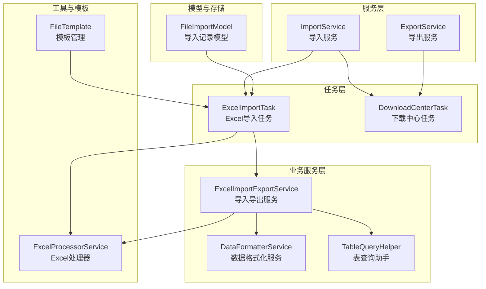
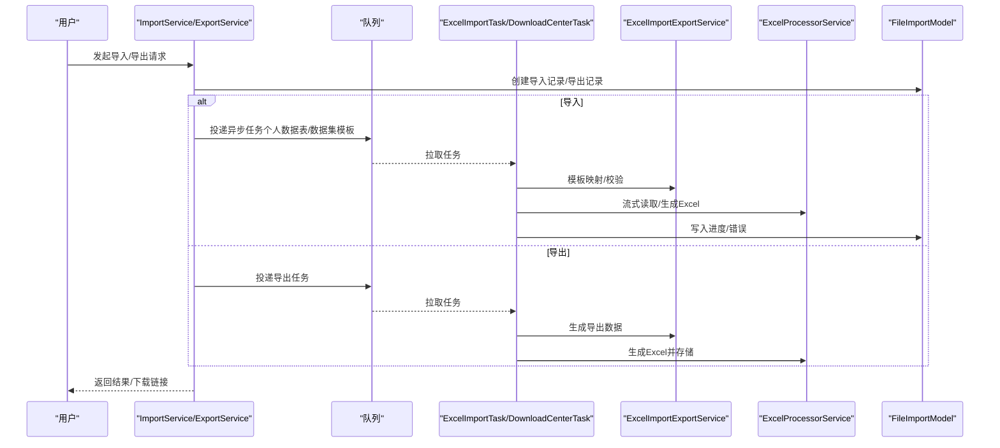
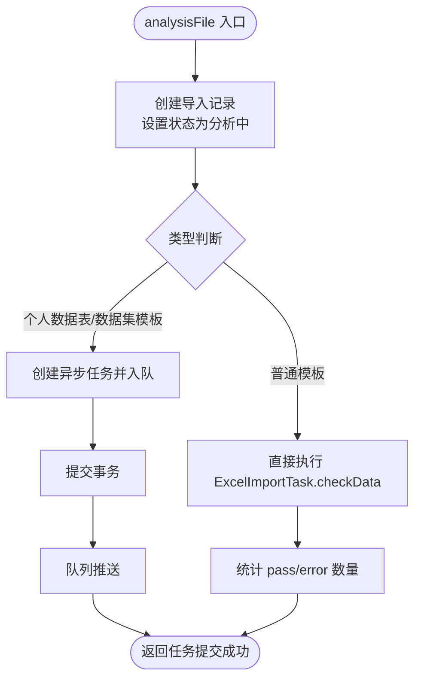
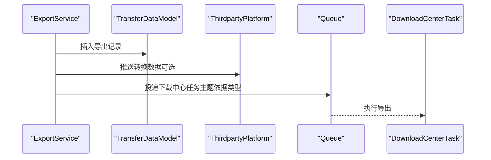
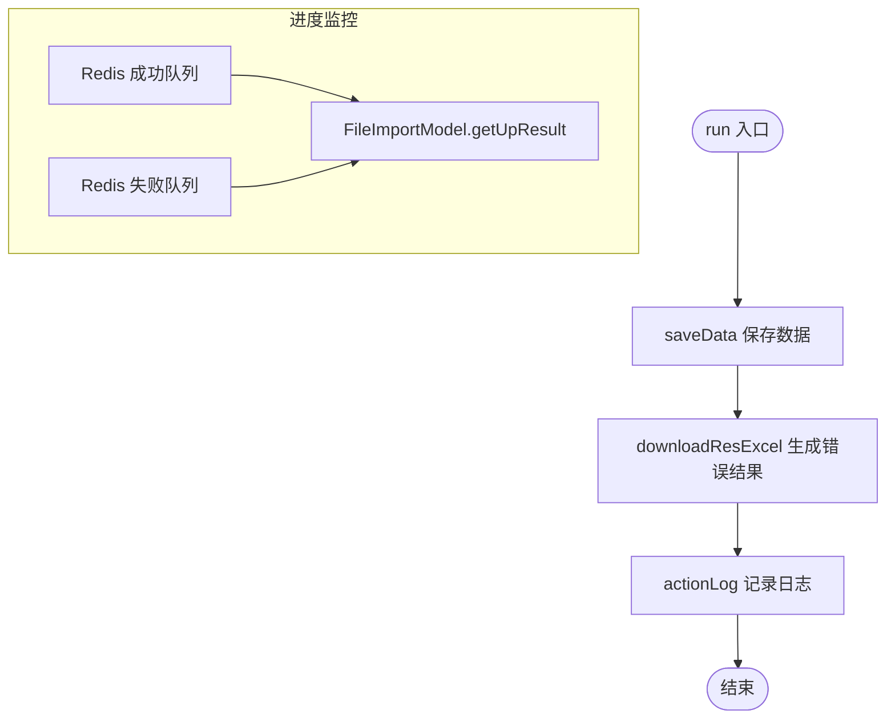
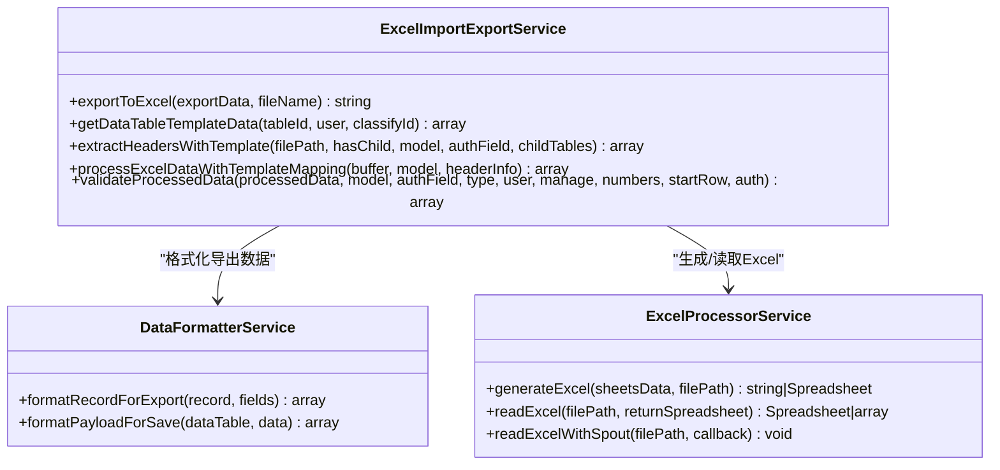
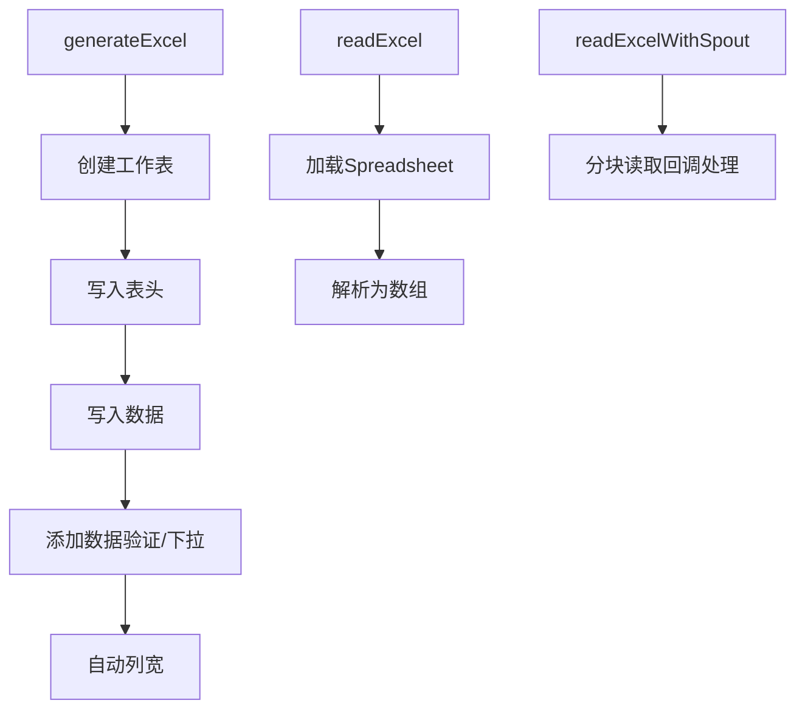
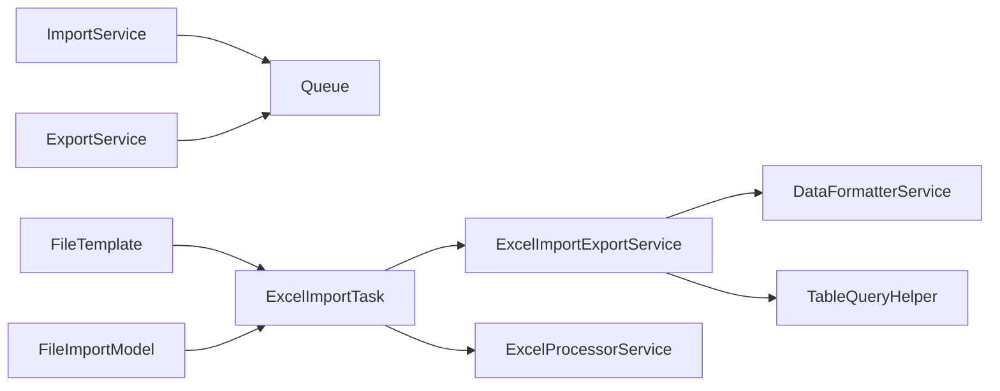

# 数据导入导出

<cite>
**本文引用的文件**
- [ImportService.php](file://process/src/services/ImportService.php)
- [ExportService.php](file://process/src/services/ExportService.php)
- [ExcelImportTask.php](file://process/src/services/task/ExcelImportTask.php)
- [ExcelImportExportService.php](file://process/src/services/desktopManage/ExcelImportExportService.php)
- [ExcelProcessorService.php](file://process/src/services/excel/ExcelProcessorService.php)
- [FileTemplate.php](file://process/src/services/FileTemplate.php)
- [FileImportModel.php](file://process/src/models/FileImportModel.php)
- [DataFormatterService.php](file://process/src/services/desktopManage/DataFormatterService.php)
- [TableQueryHelper.php](file://process/src/services/desktopManage/helpers/TableQueryHelper.php)
- [DownloadCenterTask.php](file://process/src/services/task/DownloadCenterTask.php)
</cite>

## 目录
1. [简介](#简介)
2. [项目结构](#项目结构)
3. [核心组件](#核心组件)
4. [架构总览](#架构总览)
5. [详细组件分析](#详细组件分析)
6. [依赖关系分析](#依赖关系分析)
7. [性能考虑](#性能考虑)
8. [故障排查指南](#故障排查指南)
9. [结论](#结论)
10. [附录](#附录)

## 简介
本文件面向 htdNew 项目的“数据导入导出”能力，围绕 ImportService 与 ExportService 的职责边界、实现机制与运行流程展开，重点覆盖：
- Excel 导入导出、数据格式转换与批量处理
- 数据验证、错误处理与进度监控
- 文件上传处理、数据映射与格式适配
- 接口规范、参数配置与性能优化策略
- 实际应用场景与关键流程图示

## 项目结构
与导入导出相关的核心模块分布如下：
- 服务层
  - ImportService：统一入口，负责异步/同步导入任务调度与结果反馈
  - ExportService：统一入口，负责导出任务提交与第三方平台对接
- 任务层
  - ExcelImportTask：具体执行 Excel 导入的后台任务，含解析、转换、校验、结果生成与日志
  - DownloadCenterTask：导出任务的后台处理，负责生成文件并归档
- 业务服务层
  - ExcelImportExportService：导入导出模板构建、表头提取、数据映射与校验、导出生成
  - DataFormatterService：数据格式化（导入前转换、导出时格式化）
  - TableQueryHelper：数据表结构辅助（字段过滤、子表查询等）
- 工具与模板
  - ExcelProcessorService：基于 PhpSpreadsheet/Spout 的 Excel 生成与流式读取
  - FileTemplate：静态模板管理与失败列追加

图表来源
- [ImportService.php](file://process/src/services/ImportService.php#L1-L82)
- [ExportService.php](file://process/src/services/ExportService.php#L1-L65)
- [ExcelImportTask.php](file://process/src/services/task/ExcelImportTask.php#L1-L200)
- [ExcelImportExportService.php](file://process/src/services/desktopManage/ExcelImportExportService.php#L1-L200)
- [ExcelProcessorService.php](file://process/src/services/excel/ExcelProcessorService.php#L1-L200)
- [FileTemplate.php](file://process/src/services/FileTemplate.php#L1-L200)
- [FileImportModel.php](file://process/src/models/FileImportModel.php#L1-L95)

章节来源
- [ImportService.php](file://process/src/services/ImportService.php#L1-L82)
- [ExportService.php](file://process/src/services/ExportService.php#L1-L65)
- [ExcelImportTask.php](file://process/src/services/task/ExcelImportTask.php#L1-L200)
- [ExcelImportExportService.php](file://process/src/services/desktopManage/ExcelImportExportService.php#L1-L200)
- [ExcelProcessorService.php](file://process/src/services/excel/ExcelProcessorService.php#L1-L200)
- [FileTemplate.php](file://process/src/services/FileTemplate.php#L1-L200)
- [FileImportModel.php](file://process/src/models/FileImportModel.php#L1-L95)

## 核心组件
- ImportService
  - 职责：接收导入请求，创建导入记录，按类型选择同步或异步处理；对个人数据表与数据集模板采用异步队列，对普通 Excel 模板直接执行
  - 关键点：事务封装、队列投递、返回进度或即时结果
- ExportService
  - 职责：创建导出记录，根据类型选择队列主题，触发下载中心任务；对接第三方平台推送
  - 关键点：事务封装、队列投递、第三方平台对接
- ExcelImportTask
  - 职责：执行导入全流程（初始化、解析、转换、校验、生成错误结果、落库统计、日志）
  - 关键点：Spout 流式读取、模板映射、错误收集、Redis 缓存进度
- ExcelImportExportService
  - 职责：模板构建、表头提取、字段权限与必填标记、数据映射与校验、导出生成
  - 关键点：字段过滤、权限控制、子表处理、导出文件生成与存储
- ExcelProcessorService
  - 职责：Excel 生成（Spreadsheet）、低内存读取（PhpSpreadsheet）、Spout 流式读取
  - 关键点：内存优化、列宽自适应、数据验证、下拉选项
- DataFormatterService
  - 职责：导入前转换（如人员搜索字段）、导出格式化（字典映射、时间格式、来源标识、标签）
  - 关键点：字段类型识别、映射配置、格式化覆盖
- TableQueryHelper
  - 职责：子表查询、字段过滤、有效字段提取、查询条件构建
  - 关键点：字段删除过滤、批量子表查询、特殊字段处理
- FileTemplate
  - 职责：模板文件管理、失败列追加、静态模板映射
  - 关键点：模板类型枚举、错误列配置、文件生成
- FileImportModel
  - 职责：导入记录持久化、缓存键生成、进度查询
  - 关键点：状态机、Redis 进度统计、结果 token 校验

章节来源
- [ImportService.php](file://process/src/services/ImportService.php#L1-L82)
- [ExportService.php](file://process/src/services/ExportService.php#L1-L65)
- [ExcelImportTask.php](file://process/src/services/task/ExcelImportTask.php#L1-L200)
- [ExcelImportExportService.php](file://process/src/services/desktopManage/ExcelImportExportService.php#L1-L200)
- [ExcelProcessorService.php](file://process/src/services/excel/ExcelProcessorService.php#L1-L200)
- [DataFormatterService.php](file://process/src/services/desktopManage/DataFormatterService.php#L1-L200)
- [TableQueryHelper.php](file://process/src/services/desktopManage/helpers/TableQueryHelper.php#L1-L200)
- [FileTemplate.php](file://process/src/services/FileTemplate.php#L1-L200)
- [FileImportModel.php](file://process/src/models/FileImportModel.php#L1-L95)

## 架构总览
导入与导出均通过服务层发起，任务层执行，业务服务层完成数据映射与格式化，工具层负责 Excel 生成与读取。

图表来源
- [ImportService.php](file://process/src/services/ImportService.php#L1-L82)
- [ExportService.php](file://process/src/services/ExportService.php#L1-L65)
- [ExcelImportTask.php](file://process/src/services/task/ExcelImportTask.php#L1-L200)
- [ExcelImportExportService.php](file://process/src/services/desktopManage/ExcelImportExportService.php#L1-L200)
- [ExcelProcessorService.php](file://process/src/services/excel/ExcelProcessorService.php#L1-L200)
- [FileImportModel.php](file://process/src/models/FileImportModel.php#L1-L95)

## 详细组件分析

### ImportService 分析
- 功能要点
  - 创建导入记录并设置状态
  - 根据类型选择处理路径：个人数据表/数据集模板走异步队列；普通模板直接执行
  - 异步场景返回任务提交成功与记录 ID；同步场景返回即时统计
- 错误处理
  - 事务包裹，异常回滚并抛出用户异常
- 性能与并发
  - 对大体量导入采用队列异步，避免阻塞请求线程

图表来源
- [ImportService.php](file://process/src/services/ImportService.php#L1-L82)

章节来源
- [ImportService.php](file://process/src/services/ImportService.php#L1-L82)

### ExportService 分析
- 功能要点
  - 创建导出记录，按类型设置显示名称
  - 推送第三方平台（若启用），并投递下载中心任务
  - 根据类型选择队列主题（低优先级或普通）
- 错误处理
  - 事务包裹，异常记录日志并抛出用户异常
- 集成点
  - 第三方平台对接（推送转换数据）

图表来源
- [ExportService.php](file://process/src/services/ExportService.php#L1-L65)
- [DownloadCenterTask.php](file://process/src/services/task/DownloadCenterTask.php#L2275-L2316)

章节来源
- [ExportService.php](file://process/src/services/ExportService.php#L1-L65)
- [DownloadCenterTask.php](file://process/src/services/task/DownloadCenterTask.php#L2275-L2316)

### ExcelImportTask 分析
- 初始化与参数校验
  - 校验类型与必要参数（如 identity、table_id、id）
- 执行流程
  - saveData：保存数据（由业务服务完成）
  - downloadResExcel：生成错误明细结果
  - actionLog：记录导入日志
- 进度与结果
  - 使用 Redis 列表维护成功/失败队列，FileImportModel 提供进度查询
- 流式读取与映射
  - 使用 Spout 流式读取，按块处理，先映射再校验，降低内存占用

图表来源
- [ExcelImportTask.php](file://process/src/services/task/ExcelImportTask.php#L1-L200)
- [FileImportModel.php](file://process/src/models/FileImportModel.php#L1-L95)

章节来源
- [ExcelImportTask.php](file://process/src/services/task/ExcelImportTask.php#L1-L200)
- [FileImportModel.php](file://process/src/models/FileImportModel.php#L1-L95)

### ExcelImportExportService 分析
- 字段与权限
  - 过滤不支持导入的字段类型（图片/附件），隐藏字段与只读字段处理
  - 必填字段标记与权限控制
- 模板与表头
  - 生成填写须知、字段说明、下拉选项与数据验证
  - 支持主表与子表字段映射
- 数据映射与校验
  - 按模板映射 Excel 列到字段，结合权限与范围进行校验
- 导出生成
  - 生成 Excel 并保存至存储，返回相对路径

图表来源
- [ExcelImportExportService.php](file://process/src/services/desktopManage/ExcelImportExportService.php#L1-L200)
- [ExcelImportExportService.php](file://process/src/services/desktopManage/ExcelImportExportService.php#L1825-L1845)
- [ExcelImportExportService.php](file://process/src/services/desktopManage/ExcelImportExportService.php#L1930-L1957)
- [DataFormatterService.php](file://process/src/services/desktopManage/DataFormatterService.php#L1-L200)
- [ExcelProcessorService.php](file://process/src/services/excel/ExcelProcessorService.php#L1-L200)

章节来源
- [ExcelImportExportService.php](file://process/src/services/desktopManage/ExcelImportExportService.php#L1-L200)
- [ExcelImportExportService.php](file://process/src/services/desktopManage/ExcelImportExportService.php#L1825-L1845)
- [ExcelImportExportService.php](file://process/src/services/desktopManage/ExcelImportExportService.php#L1930-L1957)
- [DataFormatterService.php](file://process/src/services/desktopManage/DataFormatterService.php#L1-L200)
- [ExcelProcessorService.php](file://process/src/services/excel/ExcelProcessorService.php#L1-L200)

### ExcelProcessorService 分析
- 生成 Excel
  - 移除默认工作表，逐表写入标题、表头、数据，自动列宽，添加数据验证
- 读取 Excel
  - 低内存模式读取，支持返回 Spreadsheet 或解析后的数组
- 流式读取
  - 使用 Spout 对超大数据进行分块读取，回调处理每块数据，显著降低内存峰值

图表来源
- [ExcelProcessorService.php](file://process/src/services/excel/ExcelProcessorService.php#L1-L200)

章节来源
- [ExcelProcessorService.php](file://process/src/services/excel/ExcelProcessorService.php#L1-L200)

### FileTemplate 与模板管理
- 模板类型
  - 定义多种导入模板类型（用户、岗位、数据集、个人数据表等）
- 模板文件
  - 静态模板路径与错误列配置；动态生成模板文件并返回文件名与路径
- 失败列追加
  - 在已有 Excel 上追加错误列，便于回传给用户

章节来源
- [FileTemplate.php](file://process/src/services/FileTemplate.php#L1-L200)

### 数据格式化与映射
- 导入前转换
  - 人员搜索字段标准化（编号或@姓名），缺失则抛错
- 导出格式化
  - 字典映射、时间格式（至今）、来源标识、标签 ID 转名称
- 字段过滤与权限
  - 仅对可见且可写字段进行处理，隐藏/只读字段跳过

章节来源
- [DataFormatterService.php](file://process/src/services/desktopManage/DataFormatterService.php#L1-L200)
- [TableQueryHelper.php](file://process/src/services/desktopManage/helpers/TableQueryHelper.php#L1-L200)

## 依赖关系分析
- 组件耦合
  - ImportService/ExportService 作为门面，依赖队列与模型
  - ExcelImportTask 依赖业务服务与工具服务，承担主要执行逻辑
  - ExcelImportExportService 依赖数据格式化与表查询助手，负责模板与映射
- 外部依赖
  - PhpSpreadsheet：Excel 生成与读取
  - Spout：超大数据流式读取
  - Redis：进度与错误队列
  - 存储：临时文件与最终导出文件

图表来源
- [ImportService.php](file://process/src/services/ImportService.php#L1-L82)
- [ExportService.php](file://process/src/services/ExportService.php#L1-L65)
- [ExcelImportTask.php](file://process/src/services/task/ExcelImportTask.php#L1-L200)
- [ExcelImportExportService.php](file://process/src/services/desktopManage/ExcelImportExportService.php#L1-L200)
- [ExcelProcessorService.php](file://process/src/services/excel/ExcelProcessorService.php#L1-L200)
- [DataFormatterService.php](file://process/src/services/desktopManage/DataFormatterService.php#L1-L200)
- [TableQueryHelper.php](file://process/src/services/desktopManage/helpers/TableQueryHelper.php#L1-L200)
- [FileTemplate.php](file://process/src/services/FileTemplate.php#L1-L200)
- [FileImportModel.php](file://process/src/models/FileImportModel.php#L1-L95)

章节来源
- [ImportService.php](file://process/src/services/ImportService.php#L1-L82)
- [ExportService.php](file://process/src/services/ExportService.php#L1-L65)
- [ExcelImportTask.php](file://process/src/services/task/ExcelImportTask.php#L1-L200)
- [ExcelImportExportService.php](file://process/src/services/desktopManage/ExcelImportExportService.php#L1-L200)
- [ExcelProcessorService.php](file://process/src/services/excel/ExcelProcessorService.php#L1-L200)
- [DataFormatterService.php](file://process/src/services/desktopManage/DataFormatterService.php#L1-L200)
- [TableQueryHelper.php](file://process/src/services/desktopManage/helpers/TableQueryHelper.php#L1-L200)
- [FileTemplate.php](file://process/src/services/FileTemplate.php#L1-L200)
- [FileImportModel.php](file://process/src/models/FileImportModel.php#L1-L95)

## 性能考虑
- 流式读取
  - 使用 Spout 对超大数据进行分块读取，回调处理，避免一次性加载全量数据
- 内存优化
  - 低内存模式读取 Excel，仅解析数据
- 缓存与队列
  - Redis 列表存储成功/失败项，减少数据库压力
  - 异步队列处理个人数据表与数据集模板导入，提升吞吐
- 导出文件
  - 生成临时文件后上传存储，避免长时间持有大文件句柄

章节来源
- [ExcelProcessorService.php](file://process/src/services/excel/ExcelProcessorService.php#L1-L200)
- [ExcelImportTask.php](file://process/src/services/task/ExcelImportTask.php#L687-L708)
- [FileImportModel.php](file://process/src/models/FileImportModel.php#L1-L95)

## 故障排查指南
- 常见错误与定位
  - Excel 表头为空：检查模板映射与表头提取逻辑
  - 参数异常：确认 type、identity、table_id、id 等参数是否齐全
  - 用户不存在：人员搜索字段未匹配到编号或姓名不可用
- 进度与结果
  - 通过 FileImportModel 的 getUpResult 获取百分比、总数、成功/失败数量
- 日志与审计
  - ExcelImportTask 记录导入日志，便于问题回溯

章节来源
- [ExcelImportTask.php](file://process/src/services/task/ExcelImportTask.php#L1-L200)
- [FileImportModel.php](file://process/src/models/FileImportModel.php#L1-L95)
- [DataFormatterService.php](file://process/src/services/desktopManage/DataFormatterService.php#L1-L200)

## 结论
htdNew 的导入导出体系以服务层为入口，任务层为执行单元，业务服务与工具层协同完成模板构建、数据映射、格式化与导出生成。通过异步队列、流式读取与 Redis 进度监控，系统在保证用户体验的同时兼顾了高并发与大数据场景下的稳定性与性能。

## 附录

### 接口规范与参数配置
- 导入接口（ImportService.analysisFile）
  - 输入
    - type：导入类型（参考模板类型枚举）
    - condition：导入条件（不同类型对应不同字段）
    - token：上传文件 token
  - 输出
    - 异步类型：返回任务提交成功与记录 ID
    - 同步类型：返回即时统计（总数、成功、失败）
- 导出接口（ExportService.analysisFile）
  - 输入
    - type：导出类型
    - condition：导出条件
  - 输出
    - 返回导出记录 ID，后续通过下载中心获取文件

章节来源
- [ImportService.php](file://process/src/services/ImportService.php#L1-L82)
- [ExportService.php](file://process/src/services/ExportService.php#L1-L65)
- [FileTemplate.php](file://process/src/services/FileTemplate.php#L1-L200)

### 实际应用场景与示例路径
- Excel 文件处理
  - 模板生成与失败列追加：参见模板管理相关方法
    - [FileTemplate.php](file://process/src/services/FileTemplate.php#L148-L184)
- 数据验证与错误处理
  - 表头校验与参数校验：参见任务初始化与异常抛出
    - [ExcelImportTask.php](file://process/src/services/task/ExcelImportTask.php#L90-L111)
- 批量处理
  - 流式读取与分块处理：参见流式读取回调
    - [ExcelProcessorService.php](file://process/src/services/excel/ExcelProcessorService.php#L1-L200)
    - [ExcelImportTask.php](file://process/src/services/task/ExcelImportTask.php#L687-L708)
- 数据映射与格式适配
  - 模板映射与权限校验：参见业务服务映射与校验
    - [ExcelImportExportService.php](file://process/src/services/desktopManage/ExcelImportExportService.php#L1930-L1957)
  - 导出格式化：参见导出格式化服务
    - [DataFormatterService.php](file://process/src/services/desktopManage/DataFormatterService.php#L118-L182)