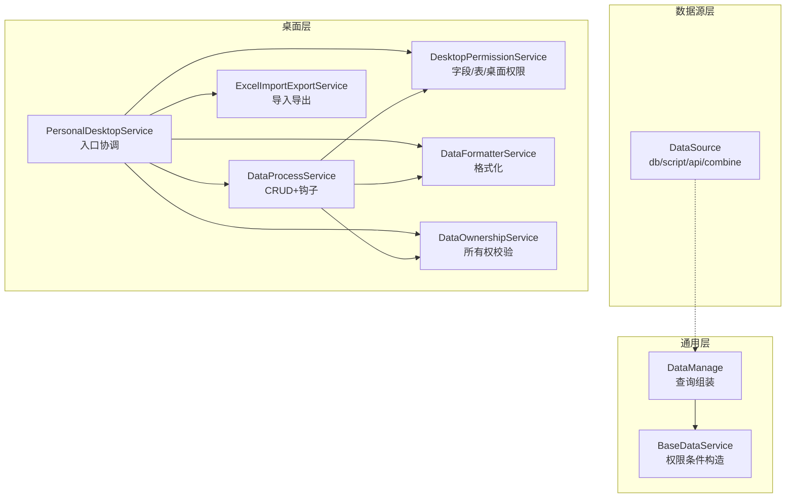
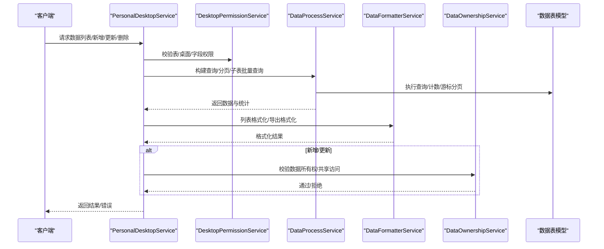
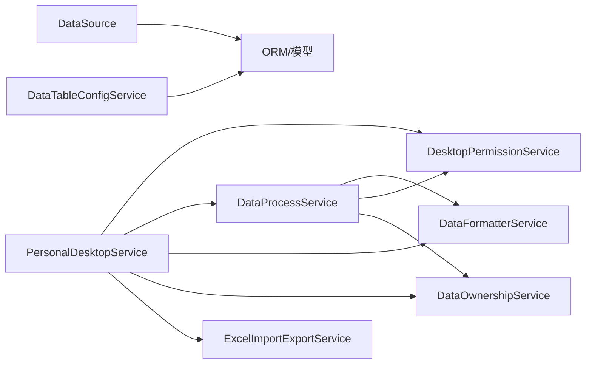

# 数据服务

<cite>
**本文引用的文件**
- [BaseDataService.php](file://process/src/services/BaseDataService.php)
- [DataManage.php](file://process/src/services/DataManage.php)
- [DataSource.php](file://process/src/services/DataSource.php)
- [DataTableConfigService.php](file://process/src/services/DataTableConfigService.php)
- [PersonalDesktopService.php](file://process/src/services/desktopManage/PersonalDesktopService.php)
- [DataProcessService.php](file://process/src/services/desktopManage/DataProcessService.php)
- [DataFormatterService.php](file://process/src/services/desktopManage/DataFormatterService.php)
- [DesktopPermissionService.php](file://process/src/services/desktopManage/DesktopPermissionService.php)
- [DataOwnershipService.php](file://process/src/services/desktopManage/DataOwnershipService.php)
- [ExcelImportExportService.php](file://process/src/services/desktopManage/ExcelImportExportService.php)
- [DataTable.php](file://process/src/http/system/DataTable.php)
- [database.sql](file://process/docs/sql/database.sql)
- [permits.php](file://process/src/config/permits.php)
- [migration_20251213_120000_data_table_sync_add_type.php](file://process/src/migrations/migration_20251213_120000_data_table_sync_add_type.php)
- [migration_20251210_134435_data_table_permit.php](file://process/src/migrations/migration_20251210_134435_data_table_permit.php)
- [OpenController.php](file://process/src/http/OpenController.php)
</cite>

## 目录
1. [简介](#简介)
2. [项目结构](#项目结构)
3. [核心组件](#核心组件)
4. [架构总览](#架构总览)
5. [详细组件分析](#详细组件分析)
6. [依赖分析](#依赖分析)
7. [性能考虑](#性能考虑)
8. [故障排查指南](#故障排查指南)
9. [结论](#结论)
10. [附录](#附录)

## 简介
本文件面向 htdNew 项目的“数据服务”，系统化梳理数据管理架构、数据源配置与数据安全机制，覆盖数据管理操作、基础数据服务、数据源处理、表格配置管理、导入导出等能力，并给出接口规范、参数配置、错误处理与性能优化建议。文档兼顾技术深度与可读性，既适用于开发者，也便于业务与运维人员理解。

## 项目结构
数据服务相关代码主要分布在以下模块：
- 通用数据服务与权限基类：BaseDataService、DataManage
- 数据源接入：DataSource
- 表格配置管理：DataTableConfigService、System 控制器中的数据表同步与索引维护
- 个人桌面数据服务：PersonalDesktopService 及其子服务（DataProcessService、DesktopPermissionService、DataFormatterService、DataOwnershipService、ExcelImportExportService）

图表来源
- [BaseDataService.php](file://process/src/services/BaseDataService.php#L1-L220)
- [DataManage.php](file://process/src/services/DataManage.php#L1-L93)
- [DataSource.php](file://process/src/services/DataSource.php#L1-L611)
- [PersonalDesktopService.php](file://process/src/services/desktopManage/PersonalDesktopService.php#L1-L721)
- [DataProcessService.php](file://process/src/services/desktopManage/DataProcessService.php#L1-L943)
- [DataFormatterService.php](file://process/src/services/desktopManage/DataFormatterService.php#L1-L603)
- [DesktopPermissionService.php](file://process/src/services/desktopManage/DesktopPermissionService.php#L1-L473)
- [DataOwnershipService.php](file://process/src/services/desktopManage/DataOwnershipService.php#L1-L106)
- [ExcelImportExportService.php](file://process/src/services/desktopManage/ExcelImportExportService.php#L1-L800)

章节来源
- [BaseDataService.php](file://process/src/services/BaseDataService.php#L1-L220)
- [DataManage.php](file://process/src/services/DataManage.php#L1-L93)
- [DataSource.php](file://process/src/services/DataSource.php#L1-L611)
- [PersonalDesktopService.php](file://process/src/services/desktopManage/PersonalDesktopService.php#L1-L721)
- [DataProcessService.php](file://process/src/services/desktopManage/DataProcessService.php#L1-L943)
- [DataFormatterService.php](file://process/src/services/desktopManage/DataFormatterService.php#L1-L603)
- [DesktopPermissionService.php](file://process/src/services/desktopManage/DesktopPermissionService.php#L1-L473)
- [DataOwnershipService.php](file://process/src/services/desktopManage/DataOwnershipService.php#L1-L106)
- [ExcelImportExportService.php](file://process/src/services/desktopManage/ExcelImportExportService.php#L1-L800)

## 核心组件
- 权限与范围基类：BaseDataService 提供数据权限范围条件构造（部门/本人/自定义/依据数据表等），支持个人桌面与通用场景。
- 数据管理：DataManage 聚合页面配置、角色授权与分类条件，生成查询条件。
- 数据源接入：DataSource 支持 db/script/api/combine 类型，参数解析、函数聚合、结果格式化与运行日志。
- 表格配置管理：DataTableConfigService 将配置转换为 SQL，支持字段增删改、唯一索引、注释等。
- 个人桌面服务：PersonalDesktopService 作为入口，协调权限、查询、格式化、所有权与导入导出。
- 数据处理：DataProcessService 实现 CRUD、钩子、游标分页、批量子表查询与性能日志。
- 字段格式化：DataFormatterService 统一列表/导出/显示格式化。
- 权限服务：DesktopPermissionService 合并桌面/分类/表权限，过滤隐藏字段，校验必填。
- 所有权服务：DataOwnershipService 校验数据归属与共享子表访问。
- 导入导出：ExcelImportExportService 支持模板生成、字段过滤、必填标记、子表合并导出与格式化。

章节来源
- [BaseDataService.php](file://process/src/services/BaseDataService.php#L1-L220)
- [DataManage.php](file://process/src/services/DataManage.php#L1-L93)
- [DataSource.php](file://process/src/services/DataSource.php#L1-L611)
- [DataTableConfigService.php](file://process/src/services/DataTableConfigService.php#L1-L258)
- [PersonalDesktopService.php](file://process/src/services/desktopManage/PersonalDesktopService.php#L1-L721)
- [DataProcessService.php](file://process/src/services/desktopManage/DataProcessService.php#L1-L943)
- [DataFormatterService.php](file://process/src/services/desktopManage/DataFormatterService.php#L1-L603)
- [DesktopPermissionService.php](file://process/src/services/desktopManage/DesktopPermissionService.php#L1-L473)
- [DataOwnershipService.php](file://process/src/services/desktopManage/DataOwnershipService.php#L1-L106)
- [ExcelImportExportService.php](file://process/src/services/desktopManage/ExcelImportExportService.php#L1-L800)

## 架构总览
数据服务围绕“权限—查询—格式化—导入导出”的闭环展开，个人桌面服务作为中枢协调各子服务，确保数据访问安全与一致性。

图表来源
- [PersonalDesktopService.php](file://process/src/services/desktopManage/PersonalDesktopService.php#L200-L350)
- [DataProcessService.php](file://process/src/services/desktopManage/DataProcessService.php#L100-L200)
- [DataFormatterService.php](file://process/src/services/desktopManage/DataFormatterService.php#L1-L200)
- [DesktopPermissionService.php](file://process/src/services/desktopManage/DesktopPermissionService.php#L1-L120)
- [DataOwnershipService.php](file://process/src/services/desktopManage/DataOwnershipService.php#L60-L106)

## 详细组件分析

### 权限与范围基类：BaseDataService
- 功能要点
  - 通用数据权限范围条件构造：支持“全部/本部门/本部门及子部门/二级部门/本人/自定义/依据数据表/指定关系”等。
  - 个人桌面范围条件：支持“自定义范围+个人添加范围（按创建时间）”。
  - 与远程数据条件拼装：支持上下文注入与表达式求值。
- 关键路径
  - formatAuthConfig：通用场景
  - personalDeskTopFormatAuthConfig：个人桌面场景
  - personalDeskTopFormatRangeConfig：个人桌面范围条件

章节来源
- [BaseDataService.php](file://process/src/services/BaseDataService.php#L1-L220)

### 数据管理：DataManage
- 功能要点
  - 从页面配置提取数据表与授权，拼装 where 条件（含分类 scope 与 auth 范围）。
  - 提供绑定应用 ID、角色授权查找等辅助方法。
- 关键路径
  - getQuery：组装查询
  - getDataTable/getAuth：读取配置

章节来源
- [DataManage.php](file://process/src/services/DataManage.php#L1-L93)

### 数据源接入：DataSource
- 功能要点
  - 支持类型：db（数据库）、script（脚本）、api（第三方接口）、combine（组合）。
  - 参数解析：@process/@configure/@creator/@const 等占位替换。
  - 查询条件：递归构建 where 三元组，支持函数聚合与键链式取值。
  - 结果格式化：列表/单项统一格式化，码表映射、用户/部门解析、规则转换。
  - 运行日志：成功/失败记录请求、响应或错误。
- 关键路径
  - readData：入口，路由到不同类型
  - dbData/scriptData/apiData/combineData：具体实现
  - sqlWhere/viewParseArguments/replaceArguments：参数与 where 构建
  - formatDataList/formatData：格式化

章节来源
- [DataSource.php](file://process/src/services/DataSource.php#L1-L611)

### 表格配置管理：DataTableConfigService
- 功能要点
  - 将字段配置转换为 SQL：新增/删除/变更字段、唯一索引、注释。
  - 字段名长度与重复校验、类型合法性校验。
  - 事务后刷新模型与缓存。
- 关键路径
  - saveConfig/configToSql：配置转 SQL
  - saveSearchConfig：保存查询配置

章节来源
- [DataTableConfigService.php](file://process/src/services/DataTableConfigService.php#L1-L258)

### 个人桌面服务：PersonalDesktopService
- 功能要点
  - 权限入口：校验桌面/分类/表访问，合并字段权限，构建数据权限条件。
  - 查询入口：处理特殊条件（部门/工号/姓名）、排序优先级（分类>表>兜底）。
  - CRUD 入口：新增/更新/删除，结合所有权与共享子表校验。
  - 导入导出：委托 ExcelImportExportService 生成模板与导出数据。
- 关键路径
  - addData/updateData/deleteData：CRUD
  - getDataList：查询与格式化
  - buildDataAuthConditions/buildPersonalDesktopConditions：数据权限条件
  - validateDataPermission：所有权/共享访问校验

章节来源
- [PersonalDesktopService.php](file://process/src/services/desktopManage/PersonalDesktopService.php#L1-L721)

### 数据处理：DataProcessService
- 功能要点
  - 钩子：beforeRead/afterRead/beforeWrite/afterWrite。
  - 查询：游标分页（大数据深分页）与 offset 分页切换。
  - 子表批量查询与权限过滤、格式化。
  - 唯一约束校验（主表/子表）。
  - 性能日志：慢查询告警。
- 关键路径
  - getDataList：查询与分页
  - addData/updateData/deleteData：CRUD
  - batchQuerySubTableData：批量子表查询
  - getCursorPaginatedData/generateNextCursor：游标分页

章节来源
- [DataProcessService.php](file://process/src/services/desktopManage/DataProcessService.php#L1-L943)

### 字段格式化：DataFormatterService
- 功能要点
  - 列表格式化：时间戳、搜索用户、多选/单选、标签等。
  - 导出格式化：覆盖原字段值，支持“至今”等特殊展示。
  - 保存前格式化：人员搜索字段标准化。
- 关键路径
  - formatDataList/formatRecord：列表/单条格式化
  - formatDataListForExport/formatRecordForExport：导出格式化
  - formatPayloadForSave：保存前格式化

章节来源
- [DataFormatterService.php](file://process/src/services/desktopManage/DataFormatterService.php#L1-L603)

### 权限服务：DesktopPermissionService
- 功能要点
  - 合并字段权限：表默认 + 分类覆盖，必填优先。
  - 层级权限结构：主表字段 + children 子表权限。
  - 隐藏字段过滤：仅保留可读/可写字段。
  - 必填校验与可写过滤：写入前验证。
- 关键路径
  - mergeAuthField/mergeAuthFieldHierarchy：权限合并
  - filterHiddenFields：隐藏字段过滤
  - validateAndFilterFields：写入前校验

章节来源
- [DesktopPermissionService.php](file://process/src/services/desktopManage/DesktopPermissionService.php#L1-L473)

### 所有权服务：DataOwnershipService
- 功能要点
  - 个人桌面：校验 __number 或共享子表访问。
  - 管理桌面：校验 data_auth 范围。
  - 统一模型获取与权限判定。
- 关键路径
  - validateAndGetModel：获取并校验模型
  - validateDataOwnership：所有权校验

章节来源
- [DataOwnershipService.php](file://process/src/services/desktopManage/DataOwnershipService.php#L1-L106)

### 导入导出：ExcelImportExportService
- 功能要点
  - 模板生成：主表+子表字段、必填标记、填写须知、下拉选项。
  - 导出准备：字段权限过滤、子表合并导出、人员/部门补全。
  - 字段过滤：附件/图片/隐藏字段过滤。
  - 格式化：导出时字段值格式化。
- 关键路径
  - generateTemplate/generateDataTableTemplate：模板生成
  - prepareDataTableExportData：导出数据准备
  - buildCommonTemplateData/generateCommonInstructionsText：模板与说明

章节来源
- [ExcelImportExportService.php](file://process/src/services/desktopManage/ExcelImportExportService.php#L1-L800)

## 依赖分析
- 组件耦合
  - PersonalDesktopService 依赖 DesktopPermissionService、DataProcessService、DataFormatterService、DataOwnershipService、ExcelImportExportService。
  - DataProcessService 依赖 DesktopPermissionService、DataFormatterService、DataOwnershipService。
  - DataSource 依赖模型与运行日志模型，提供 db/script/api/combine。
  - DataTableConfigService 依赖数据表模型与迁移工具。
- 外部依赖
  - 数据库：PostgreSQL（通过 ORM 模型与迁移）。
  - 文件存储：导出/导入临时文件与 token 管理。
  - 第三方接口：通过 ThirdpartyApiModel 发起请求。
- 循环依赖
  - 未发现直接循环依赖；服务间通过接口/配置传递解耦。

图表来源
- [PersonalDesktopService.php](file://process/src/services/desktopManage/PersonalDesktopService.php#L1-L120)
- [DataProcessService.php](file://process/src/services/desktopManage/DataProcessService.php#L1-L120)
- [DataSource.php](file://process/src/services/DataSource.php#L1-L120)
- [DataTableConfigService.php](file://process/src/services/DataTableConfigService.php#L1-L80)

章节来源
- [PersonalDesktopService.php](file://process/src/services/desktopManage/PersonalDesktopService.php#L1-L200)
- [DataProcessService.php](file://process/src/services/desktopManage/DataProcessService.php#L1-L200)
- [DataSource.php](file://process/src/services/DataSource.php#L1-L200)
- [DataTableConfigService.php](file://process/src/services/DataTableConfigService.php#L1-L120)

## 性能考虑
- 分页策略
  - 大数据集深分页自动切换游标分页，降低 OFFSET 开销。
  - 子表批量查询分批处理，避免 IN 过长。
- 查询优化
  - 通过迁移为 data_table_sync 增加 type 字段并建立复合索引，加速同步关联。
  - 个人桌面/管理桌面分别构建高效权限条件，减少扫描范围。
- 格式化与导出
  - 导出前对子表数据进行合并与序列化，避免前端多次渲染。
  - 慢查询日志记录与告警，便于定位瓶颈。
- 并发与缓存
  - 个人桌面请求级缓存桌面类型信息，减少重复查询。
  - 字典/用户映射缓存复用，降低重复查询成本。

章节来源
- [DataProcessService.php](file://process/src/services/desktopManage/DataProcessService.php#L120-L220)
- [migration_20251213_120000_data_table_sync_add_type.php](file://process/src/migrations/migration_20251213_120000_data_table_sync_add_type.php#L1-L25)
- [PersonalDesktopService.php](file://process/src/services/desktopManage/PersonalDesktopService.php#L320-L360)

## 故障排查指南
- 数据源读取异常
  - 现象：接口返回异常或运行日志记录错误。
  - 排查：确认类型与配置、参数解析占位符、函数聚合键链是否正确。
  - 参考路径：[DataSource.php](file://process/src/services/DataSource.php#L120-L140)
- 权限不足
  - 现象：访问被拒绝或无权限。
  - 排查：核对桌面/分类/表权限配置、data_auth 范围、字段权限合并。
  - 参考路径：[DesktopPermissionService.php](file://process/src/services/desktopManage/DesktopPermissionService.php#L1-L120)
- 数据归属问题
  - 现象：更新/删除被拒。
  - 排查：个人桌面需 __number 归属或共享子表访问；管理桌面需在 data_auth 范围内。
  - 参考路径：[DataOwnershipService.php](file://process/src/services/desktopManage/DataOwnershipService.php#L60-L106)
- 导入导出失败
  - 现象：模板生成/导出报错或数据不完整。
  - 排查：字段过滤（附件/图片/隐藏）、必填标记、子表字段映射、权限字段合并。
  - 参考路径：[ExcelImportExportService.php](file://process/src/services/desktopManage/ExcelImportExportService.php#L1-L200)

章节来源
- [DataSource.php](file://process/src/services/DataSource.php#L120-L140)
- [DesktopPermissionService.php](file://process/src/services/desktopManage/DesktopPermissionService.php#L1-L120)
- [DataOwnershipService.php](file://process/src/services/desktopManage/DataOwnershipService.php#L60-L106)
- [ExcelImportExportService.php](file://process/src/services/desktopManage/ExcelImportExportService.php#L1-L200)

## 结论
htdNew 的数据服务以“权限—查询—格式化—导入导出”为主线，通过 PersonalDesktopService 协调各子服务，形成可扩展、可审计、可优化的数据管理能力。配合迁移工具与运行日志，能够稳定支撑多场景的数据采集、展示与治理。

## 附录

### 数据安全策略
- 桌面/分类/表三级权限控制，字段权限合并与隐藏字段过滤。
- 个人桌面基于 __number 与共享子表访问校验；管理桌面基于 data_auth 范围校验。
- 写入前必填校验与可写过滤，唯一约束校验（主表/子表）。
- 运行日志记录请求/响应/错误，便于审计与追踪。

章节来源
- [DesktopPermissionService.php](file://process/src/services/desktopManage/DesktopPermissionService.php#L1-L200)
- [DataOwnershipService.php](file://process/src/services/desktopManage/DataOwnershipService.php#L1-L106)
- [DataSource.php](file://process/src/services/DataSource.php#L100-L140)

### 数据验证规则
- 字段必填：表默认必填优先，写入前严格校验。
- 字段权限：仅可写字段参与写入，隐藏字段过滤。
- 唯一约束：主表与子表唯一字段组合校验，新增场景仅 payload 内去重校验，更新场景结合数据库校验。

章节来源
- [DesktopPermissionService.php](file://process/src/services/desktopManage/DesktopPermissionService.php#L430-L473)
- [DataProcessService.php](file://process/src/services/desktopManage/DataProcessService.php#L240-L340)

### 数据同步机制
- data_table_sync 增加 type 字段并建立索引，支持按表与类型快速检索。
- 同步配置变更时，重建主/子表关联字段索引，保证查询效率。

章节来源
- [migration_20251213_120000_data_table_sync_add_type.php](file://process/src/migrations/migration_20251213_120000_data_table_sync_add_type.php#L1-L25)
- [DataTable.php](file://process/src/http/system/DataTable.php#L1648-L1687)

### 接口规范与参数配置
- 数据列表
  - 方法：getDataList
  - 参数：tableId、classifyId、conditions、offset、limit、user、sort
  - 返回：data、total、page、limit、next_cursor（游标分页）
  - 参考路径：[PersonalDesktopService.php](file://process/src/services/desktopManage/PersonalDesktopService.php#L210-L318)
- 新增数据
  - 方法：addData
  - 参数：tableId、classifyId、data、userRoles、user、claimId
  - 返回：msg、data_id、process_data
  - 参考路径：[PersonalDesktopService.php](file://process/src/services/desktopManage/PersonalDesktopService.php#L150-L208)
- 更新数据
  - 方法：updateData
  - 参数：tableId、classifyId、dataId、data、userRoles、user
  - 返回：操作提示
  - 参考路径：[PersonalDesktopService.php](file://process/src/services/desktopManage/PersonalDesktopService.php#L506-L550)
- 删除数据
  - 方法：deleteData
  - 参数：tableId、classifyId、dataId、userRoles、user
  - 返回：布尔
  - 参考路径：[PersonalDesktopService.php](file://process/src/services/desktopManage/PersonalDesktopService.php#L471-L504)
- 导入导出
  - 模板：generateTemplate/generateDataTableTemplate
  - 导出：prepareDataTableExportData
  - 参数：tableId、fields、ids、whereConditions、user、classifyId
  - 参考路径：[ExcelImportExportService.php](file://process/src/services/desktopManage/ExcelImportExportService.php#L380-L766)

### 错误处理
- 统一异常抛出：UserException，包含明确错误信息。
- 运行日志：DataSource 成功/失败记录请求、响应或错误，便于排障。
- 性能告警：慢查询日志记录，超阈值告警。

章节来源
- [DataSource.php](file://process/src/services/DataSource.php#L110-L140)
- [DataProcessService.php](file://process/src/services/desktopManage/DataProcessService.php#L180-L200)

### 数据源配置与权限映射
- 数据源类型与配置
  - db：数据库连接 id 与表名、where 条件、排序
  - script：脚本模型 id
  - api：第三方接口模型 id
  - combine：组合多个数据源
  - 参考路径：[DataSource.php](file://process/src/services/DataSource.php#L140-L232)
- 权限映射与字段规则
  - 字段权限：表默认 + 分类覆盖
  - 字典映射：码表/选项映射
  - 规则转换：number_uid/uid_name/did_dname/json_encode/date 等
  - 参考路径：[DesktopPermissionService.php](file://process/src/services/desktopManage/DesktopPermissionService.php#L90-L170)，[DataFormatterService.php](file://process/src/services/desktopManage/DataFormatterService.php#L320-L420)

### 表格配置管理
- 字段增删改：根据配置生成 SQL，支持唯一索引与注释。
- 查询配置：排序/筛选字段配置持久化。
- 参考路径：[DataTableConfigService.php](file://process/src/services/DataTableConfigService.php#L70-L120)

### 安全与访问控制
- 系统路由权限映射：/system/data-* 与微应用/报表/外部对接等权限标识。
- 开放接口：/open/* 与归档数据导出等开放端点。
- 参考路径：[permits.php](file://process/src/config/permits.php#L57-L107)，[OpenController.php](file://process/src/http/OpenController.php#L117-L139)