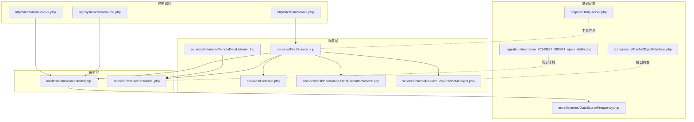
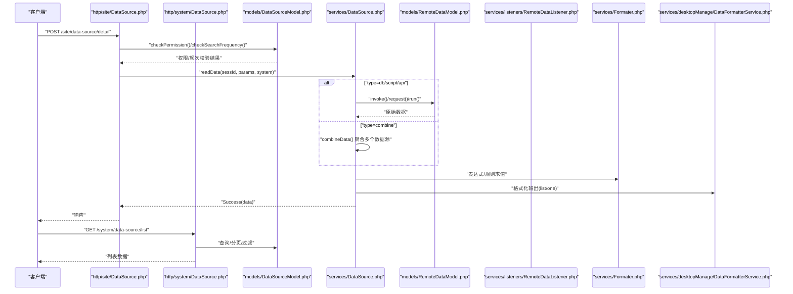
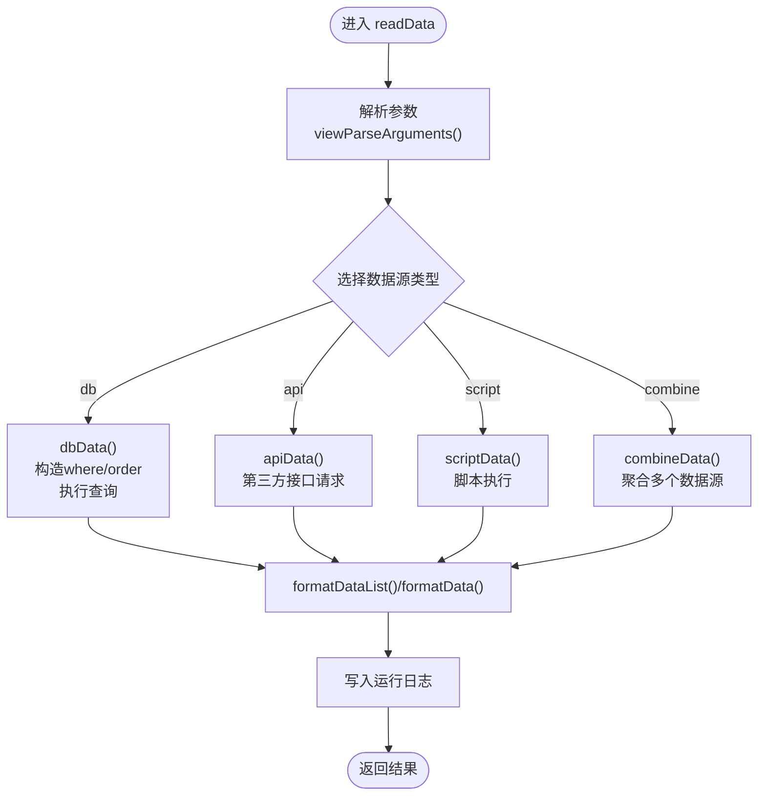
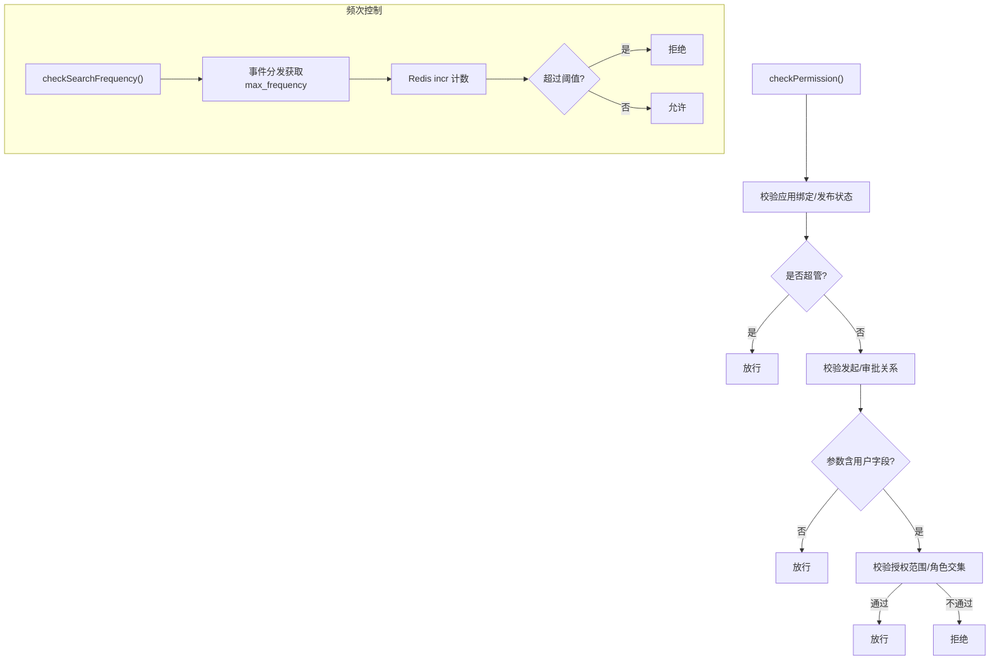
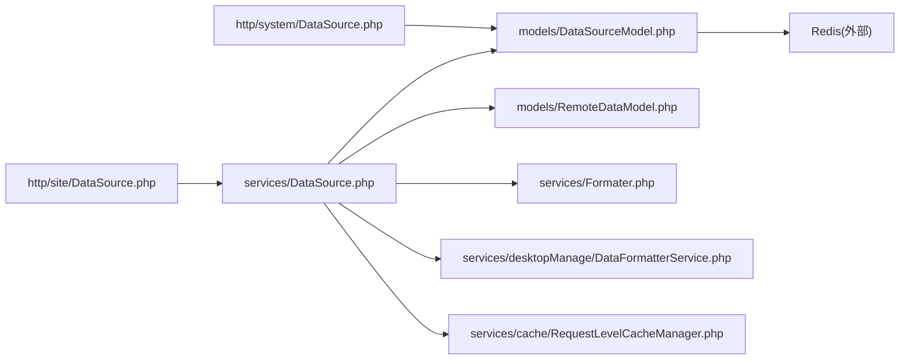

# 数据源处理

<cite>
**本文引用的文件**
- [process/src/services/DataSource.php](file://process/src/services/DataSource.php)
- [process/src/http/site/DataSource.php](file://process/src/http/site/DataSource.php)
- [process/src/models/DataSourceModel.php](file://process/src/models/DataSourceModel.php)
- [process/src/http/system/DataSource.php](file://process/src/http/system/DataSource.php)
- [process/src/services/cache/RequestLevelCacheManager.php](file://process/src/services/cache/RequestLevelCacheManager.php)
- [process/src/components/CacheObjectInterface.php](file://process/src/components/CacheObjectInterface.php)
- [process/src/services/desktopManage/DataFormatterService.php](file://process/src/services/desktopManage/DataFormatterService.php)
- [process/src/services/Formater.php](file://process/src/services/Formater.php)
- [process/src/services/listeners/RemoteDataListener.php](file://process/src/services/listeners/RemoteDataListener.php)
- [process/src/migrations/migration_20240827_093941_open_ability.php](file://process/src/migrations/migration_20240827_093941_open_ability.php)
- [process/src/helpers/UtilityHelper.php](file://process/src/helpers/UtilityHelper.php)
- [process/src/http/site/DataSourceV2.php](file://process/src/http/site/DataSourceV2.php)
- [process/src/models/RemoteDataModel.php](file://process/src/models/RemoteDataModel.php)
- [process_envs/seu/product/listeners/DataSourceFrequency.php](file://process_envs/seu/product/listeners/DataSourceFrequency.php)
</cite>

## 目录
1. [引言](#引言)
2. [项目结构](#项目结构)
3. [核心组件](#核心组件)
4. [架构总览](#架构总览)
5. [详细组件分析](#详细组件分析)
6. [依赖分析](#依赖分析)
7. [性能考虑](#性能考虑)
8. [故障排查指南](#故障排查指南)
9. [结论](#结论)
10. [附录](#附录)

## 引言
本文件围绕 htdNew 项目的“数据源处理”能力，系统性梳理 DataSource 类及其周边组件在远程数据获取、数据源配置、数据转换、生命周期管理、缓存策略与错误处理等方面的实现机制。文档面向不同技术背景读者，既提供高层架构视图，也给出关键流程的代码级图示与定位路径，便于快速理解与落地实践。

## 项目结构
与数据源处理相关的关键目录与文件分布如下：
- 服务层：数据源读取与格式化逻辑集中在服务层，核心类为 DataSource；另有远程数据调用与表达式求值辅助类。
- 控制器层：对外提供数据源详情读取接口，分别面向站点与系统端。
- 模型层：数据源元数据与权限、频次控制等逻辑位于模型层。
- 缓存层：请求级缓存管理器与缓存对象接口支撑运行期缓存策略。
- 工具与迁移：提供通用工具与历史数据迁移能力，保障数据源演进。

图表来源
- [process/src/http/site/DataSource.php](file://process/src/http/site/DataSource.php#L1-L37)
- [process/src/http/system/DataSource.php](file://process/src/http/system/DataSource.php#L1-L50)
- [process/src/http/site/DataSourceV2.php](file://process/src/http/site/DataSourceV2.php#L1-L49)
- [process/src/services/DataSource.php](file://process/src/services/DataSource.php#L1-L120)
- [process/src/models/DataSourceModel.php](file://process/src/models/DataSourceModel.php#L1-L120)
- [process/src/services/cache/RequestLevelCacheManager.php](file://process/src/services/cache/RequestLevelCacheManager.php#L1-L55)
- [process/src/components/CacheObjectInterface.php](file://process/src/components/CacheObjectInterface.php#L1-L8)
- [process/src/services/desktopManage/DataFormatterService.php](file://process/src/services/desktopManage/DataFormatterService.php#L1-L120)
- [process/src/services/Formater.php](file://process/src/services/Formater.php)
- [process/src/services/listeners/RemoteDataListener.php](file://process/src/services/listeners/RemoteDataListener.php#L57-L109)
- [process/src/migrations/migration_20240827_093941_open_ability.php](file://process/src/migrations/migration_20240827_093941_open_ability.php#L1-L233)
- [process_envs/seu/product/listeners/DataSourceFrequency.php](file://process_envs/seu/product/listeners/DataSourceFrequency.php#L1-L15)

章节来源
- [process/src/http/site/DataSource.php](file://process/src/http/site/DataSource.php#L1-L37)
- [process/src/http/system/DataSource.php](file://process/src/http/system/DataSource.php#L1-L50)
- [process/src/http/site/DataSourceV2.php](file://process/src/http/site/DataSourceV2.php#L1-L49)
- [process/src/services/DataSource.php](file://process/src/services/DataSource.php#L1-L120)
- [process/src/models/DataSourceModel.php](file://process/src/models/DataSourceModel.php#L1-L120)
- [process/src/services/cache/RequestLevelCacheManager.php](file://process/src/services/cache/RequestLevelCacheManager.php#L1-L55)
- [process/src/components/CacheObjectInterface.php](file://process/src/components/CacheObjectInterface.php#L1-L8)
- [process/src/services/desktopManage/DataFormatterService.php](file://process/src/services/desktopManage/DataFormatterService.php#L1-L120)
- [process/src/services/Formater.php](file://process/src/services/Formater.php)
- [process/src/services/listeners/RemoteDataListener.php](file://process/src/services/listeners/RemoteDataListener.php#L57-L109)
- [process/src/migrations/migration_20240827_093941_open_ability.php](file://process/src/migrations/migration_20240827_093941_open_ability.php#L1-L233)
- [process_envs/seu/product/listeners/DataSourceFrequency.php](file://process_envs/seu/product/listeners/DataSourceFrequency.php#L1-L15)

## 核心组件
- DataSource 服务：统一入口负责解析数据源配置、按类型路由到具体读取方法（数据库、HTTP、脚本、组合）、参数替换与系统上下文注入、数据格式化与规则转换、运行日志记录与异常包装。
- DataSourceModel：数据源元数据模型，提供权限校验、当日查询频次控制、缓存读取等能力。
- 控制器层：站点与系统端分别暴露数据源详情接口，前置做权限与频次检查，随后委派给 DataSource 服务执行。
- 缓存层：RequestLevelCacheManager 提供请求级缓存，避免静态缓存导致的数据一致性问题；CacheObjectInterface 定义缓存对象版本与过期策略接口。
- 远程数据与表达式：RemoteDataModel 支持多种远程数据类型（表格、数据库、HTTP、脚本）并支持异步调用；Formater 提供表达式求值能力；RemoteDataListener 负责参数求值与远程数据读取。
- 数据格式化：DataFormatterService 提供列表与导出场景下的字段格式化能力，确保输出符合前端/导出预期。

章节来源
- [process/src/services/DataSource.php](file://process/src/services/DataSource.php#L1-L120)
- [process/src/models/DataSourceModel.php](file://process/src/models/DataSourceModel.php#L120-L220)
- [process/src/http/site/DataSource.php](file://process/src/http/site/DataSource.php#L1-L37)
- [process/src/http/system/DataSource.php](file://process/src/http/system/DataSource.php#L1-L50)
- [process/src/services/cache/RequestLevelCacheManager.php](file://process/src/services/cache/RequestLevelCacheManager.php#L1-L55)
- [process/src/components/CacheObjectInterface.php](file://process/src/components/CacheObjectInterface.php#L1-L8)
- [process/src/services/desktopManage/DataFormatterService.php](file://process/src/services/desktopManage/DataFormatterService.php#L1-L120)
- [process/src/services/Formater.php](file://process/src/services/Formater.php)
- [process/src/services/listeners/RemoteDataListener.php](file://process/src/services/listeners/RemoteDataListener.php#L57-L109)
- [process/src/models/RemoteDataModel.php](file://process/src/models/RemoteDataModel.php#L113-L158)

## 架构总览
下图展示了从控制器到服务、再到远程数据与本地数据源的调用链路，以及数据格式化与缓存策略的交互。

图表来源
- [process/src/http/site/DataSource.php](file://process/src/http/site/DataSource.php#L1-L37)
- [process/src/http/system/DataSource.php](file://process/src/http/system/DataSource.php#L1-L50)
- [process/src/models/DataSourceModel.php](file://process/src/models/DataSourceModel.php#L120-L220)
- [process/src/services/DataSource.php](file://process/src/services/DataSource.php#L60-L120)
- [process/src/models/RemoteDataModel.php](file://process/src/models/RemoteDataModel.php#L133-L158)
- [process/src/services/listeners/RemoteDataListener.php](file://process/src/services/listeners/RemoteDataListener.php#L57-L109)
- [process/src/services/Formater.php](file://process/src/services/Formater.php)
- [process/src/services/desktopManage/DataFormatterService.php](file://process/src/services/desktopManage/DataFormatterService.php#L1-L120)

## 详细组件分析

### DataSource 类：数据源读取与格式化
- 职责边界
  - 解析数据源配置，按类型路由到 db/script/api/combine。
  - 参数解析与替换，支持 @process/@configure/@creator/@const 等占位符。
  - 组件类型适配：list/one 的差异处理与聚合函数处理。
  - 规则转换与格式化：基于字典映射、函数表达式、日期转换等。
  - 日志记录与异常包装：成功/失败均写入运行日志，抛出统一异常。
- 关键流程
  - readData：入口，负责参数解析、方法分发、聚合处理、格式化与日志。
  - dbData：构建 where/order，执行查询，返回 list/one 格式化结果。
  - apiData/scriptData：调用第三方接口/脚本，提取 data 字段，再格式化。
  - combineData：聚合多个数据源结果。
  - formatDataList/formatData：针对不同组件类型进行字段映射、字典转换、用户/部门解析、特殊控件格式化。
  - getRuleData/getFunctionRuleData：规则转换与表达式求值。
  - sqlWhere/viewParseArguments/replaceArguments/replaceParams：参数解析与替换。
- 性能与健壮性
  - 通过 RequestLevelCacheManager 与 DataSourceModel 缓存减少重复查询。
  - 对异常进行捕获并记录，保证上层统一处理。
  - 对返回数据进行严格校验，避免非数组异常。

图表来源
- [process/src/services/DataSource.php](file://process/src/services/DataSource.php#L60-L220)
- [process/src/services/DataSource.php](file://process/src/services/DataSource.php#L233-L391)
- [process/src/services/DataSource.php](file://process/src/services/DataSource.php#L426-L447)
- [process/src/services/DataSource.php](file://process/src/services/DataSource.php#L522-L611)

章节来源
- [process/src/services/DataSource.php](file://process/src/services/DataSource.php#L1-L120)
- [process/src/services/DataSource.php](file://process/src/services/DataSource.php#L120-L220)
- [process/src/services/DataSource.php](file://process/src/services/DataSource.php#L233-L391)
- [process/src/services/DataSource.php](file://process/src/services/DataSource.php#L426-L447)
- [process/src/services/DataSource.php](file://process/src/services/DataSource.php#L522-L611)

### DataSourceModel：权限与频次控制
- 权限校验
  - 校验应用绑定、发起/审批关系、参数中涉及的用户授权范围等。
- 查询频次控制
  - 通过事件分发获取全局最大频次配置，使用 Redis incr 计数并在当日结束时过期。
  - Redis 异常时默认放行，避免雪崩。
- 缓存读取
  - 通过缓存接口获取数据源配置，降低数据库压力。

图表来源
- [process/src/models/DataSourceModel.php](file://process/src/models/DataSourceModel.php#L149-L220)
- [process/src/models/DataSourceModel.php](file://process/src/models/DataSourceModel.php#L322-L377)
- [process_envs/seu/product/listeners/DataSourceFrequency.php](file://process_envs/seu/product/listeners/DataSourceFrequency.php#L1-L15)

章节来源
- [process/src/models/DataSourceModel.php](file://process/src/models/DataSourceModel.php#L149-L220)
- [process/src/models/DataSourceModel.php](file://process/src/models/DataSourceModel.php#L322-L377)
- [process_envs/seu/product/listeners/DataSourceFrequency.php](file://process_envs/seu/product/listeners/DataSourceFrequency.php#L1-L15)

### 控制器层：接口规范与调用
- 站点端接口
  - 输入：id/app_id/task_id/sess_id/depart_id/params。
  - 前置校验：权限与频次。
  - 输出：Success(data)。
- 系统端接口
  - 列表查询：支持应用过滤、名称模糊、创建人过滤、分页。
- V2 接口
  - 新增 app_version_id/form_id/form_key 等参数，增强版本化与表单维度的数据源读取能力。

章节来源
- [process/src/http/site/DataSource.php](file://process/src/http/site/DataSource.php#L1-L37)
- [process/src/http/system/DataSource.php](file://process/src/http/system/DataSource.php#L1-L50)
- [process/src/http/site/DataSourceV2.php](file://process/src/http/site/DataSourceV2.php#L1-L49)

### 缓存策略：请求级缓存与对象缓存
- 请求级缓存
  - RequestLevelCacheManager 提供 get/set/delete，支持 TTL 与回调未命中自动填充。
- 对象缓存接口
  - CacheObjectInterface 定义版本与过期时间接口，便于缓存对象统一管理。
- 数据源缓存
  - DataSourceModel 与 DataSource 读取配置时使用缓存，减少数据库访问。

章节来源
- [process/src/services/cache/RequestLevelCacheManager.php](file://process/src/services/cache/RequestLevelCacheManager.php#L1-L55)
- [process/src/components/CacheObjectInterface.php](file://process/src/components/CacheObjectInterface.php#L1-L8)
- [process/src/services/DataSource.php](file://process/src/services/DataSource.php#L40-L60)

### 数据格式化与验证
- 表达式与规则
  - Formater 提供表达式求值能力，配合 DataSource 的 getFunctionRuleData 实现复杂规则转换。
- 列表/单条格式化
  - DataFormatterService 在导出与列表场景对字段进行格式化，包括时间、标签、人员搜索等。
- 字段清洗
  - DataFormatterService 中包含字符串清洗逻辑，避免数据库写入异常。

章节来源
- [process/src/services/Formater.php](file://process/src/services/Formater.php)
- [process/src/services/DataSource.php](file://process/src/services/DataSource.php#L392-L458)
- [process/src/services/desktopManage/DataFormatterService.php](file://process/src/services/desktopManage/DataFormatterService.php#L1-L120)

### 远程数据与迁移
- 远程数据模型
  - RemoteDataModel 支持多种类型（表格/数据库/HTTP/脚本），并提供 invoke/invokeAsync。
- 远程监听器
  - RemoteDataListener 负责参数表达式求值与远程数据读取。
- 历史迁移
  - migration_20240827_093941_open_ability 将 thirdparty_api/thirdparty_script 迁移到 remote_data，保持兼容。

章节来源
- [process/src/models/RemoteDataModel.php](file://process/src/models/RemoteDataModel.php#L113-L158)
- [process/src/services/listeners/RemoteDataListener.php](file://process/src/services/listeners/RemoteDataListener.php#L57-L109)
- [process/src/migrations/migration_20240827_093941_open_ability.php](file://process/src/migrations/migration_20240827_093941_open_ability.php#L1-L233)

## 依赖分析
- 组件耦合
  - DataSource 依赖 DataSourceModel、RemoteDataModel、Formater、DataFormatterService、RequestLevelCacheManager 等。
  - 控制器层仅承担参数校验与委派职责，低耦合高内聚。
- 外部依赖
  - Redis 用于频次控制与缓存。
  - 第三方 API/脚本用于远程数据获取。
- 循环依赖
  - 当前结构未见明显循环依赖；若新增组件建议遵循“控制器 → 服务 → 模型/外部”的单向依赖。

图表来源
- [process/src/http/site/DataSource.php](file://process/src/http/site/DataSource.php#L1-L37)
- [process/src/http/system/DataSource.php](file://process/src/http/system/DataSource.php#L1-L50)
- [process/src/services/DataSource.php](file://process/src/services/DataSource.php#L1-L120)
- [process/src/models/DataSourceModel.php](file://process/src/models/DataSourceModel.php#L1-L120)
- [process/src/models/RemoteDataModel.php](file://process/src/models/RemoteDataModel.php#L113-L158)
- [process/src/services/desktopManage/DataFormatterService.php](file://process/src/services/desktopManage/DataFormatterService.php#L1-L120)
- [process/src/services/cache/RequestLevelCacheManager.php](file://process/src/services/cache/RequestLevelCacheManager.php#L1-L55)

## 性能考虑
- 缓存优先
  - 使用 DataSourceModel 与 RequestLevelCacheManager 缓存数据源配置与中间结果，降低数据库与网络开销。
- 异步与批量
  - RemoteDataModel 支持异步调用，适合批量或后台任务场景。
- 参数预处理
  - 在 DataSource 中提前解析参数与表达式，减少下游重复计算。
- 导出与格式化
  - DataFormatterService 的格式化逻辑尽量在导出前完成，避免前端渲染压力。

[本节为通用指导，无需列出章节来源]

## 故障排查指南
- 常见问题定位
  - 权限/频次被拒：检查 DataSourceModel 的权限与频次判定逻辑。
  - 远程接口异常：查看 DataSource 的异常捕获与日志记录，确认返回数据结构。
  - 表达式/规则错误：核对 Formater 表达式与 DataSource 的规则转换逻辑。
- 日志与监控
  - DataSource 在成功/失败时写入运行日志，便于追踪。
  - Redis 频次控制异常时默认放行，注意观察日志与告警。
- 快速修复建议
  - 参数占位符解析失败：检查 @process/@configure/@creator/@const 的使用是否正确。
  - 字段映射缺失：确认数据源 field 配置与字典映射是否完整。

章节来源
- [process/src/services/DataSource.php](file://process/src/services/DataSource.php#L103-L138)
- [process/src/models/DataSourceModel.php](file://process/src/models/DataSourceModel.php#L322-L377)

## 结论
htdNew 的数据源处理体系以 DataSource 为核心，结合控制器层的前置校验、模型层的权限与频次控制、服务层的参数解析与格式化、以及缓存与远程数据能力，形成了稳定、可扩展的数据获取与转换闭环。通过清晰的职责划分与日志/异常机制，系统在保证易用性的同时兼顾了性能与可靠性。

[本节为总结性内容，无需列出章节来源]

## 附录

### 接口规范与参数
- 站点端数据源详情
  - 方法：POST
  - 路径：/site/data-source/detail
  - 参数：id、app_id、task_id、sess_id、depart_id、params
  - 响应：Success(data)
- 系统端数据源列表
  - 方法：GET
  - 路径：/system/data-source/list
  - 查询参数：app_id、name、username、分页
  - 响应：列表数据

章节来源
- [process/src/http/site/DataSource.php](file://process/src/http/site/DataSource.php#L1-L37)
- [process/src/http/system/DataSource.php](file://process/src/http/system/DataSource.php#L1-L50)

### 配置参数与数据结构要点
- 数据源类型：db/script/api/combine
- 组件类型：list/one
- 字段映射与规则：dict_id、rule、column/value/name、function
- 表达式：通过 Formater 求值，支持复杂逻辑
- 远程数据：支持 HTTP/数据库/脚本/表格等多种类型

章节来源
- [process/src/services/DataSource.php](file://process/src/services/DataSource.php#L33-L58)
- [process/src/services/DataSource.php](file://process/src/services/DataSource.php#L233-L391)
- [process/src/models/RemoteDataModel.php](file://process/src/models/RemoteDataModel.php#L113-L158)