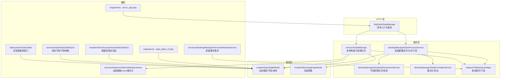
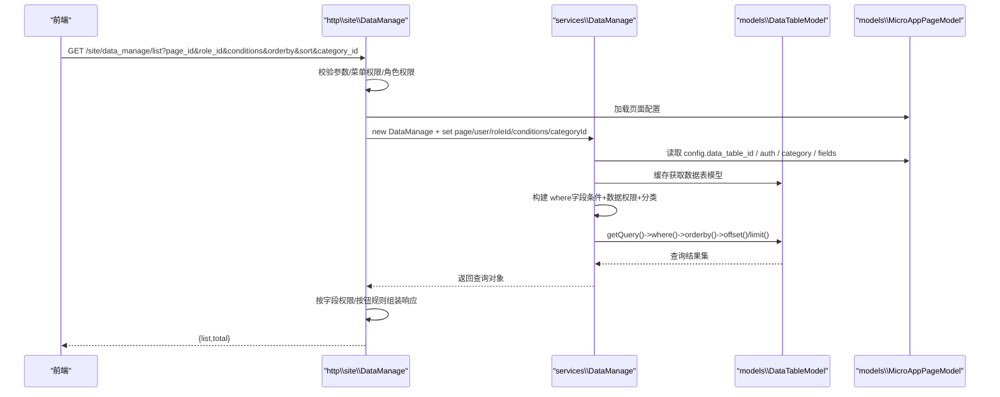
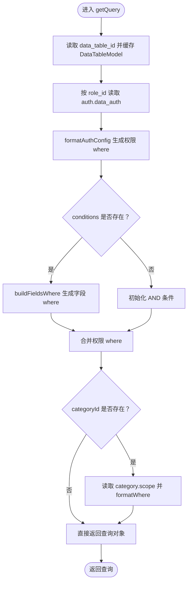
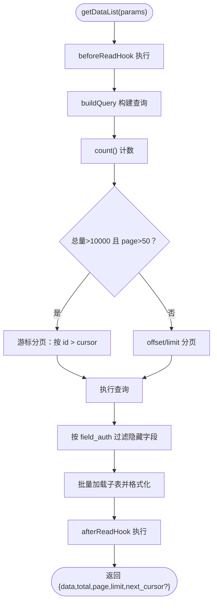
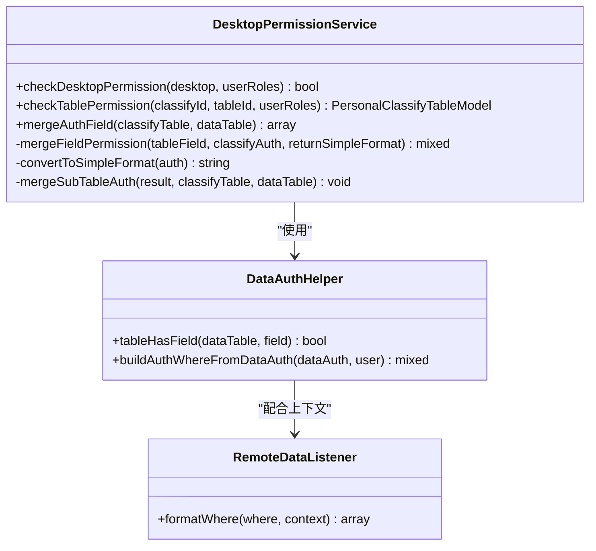
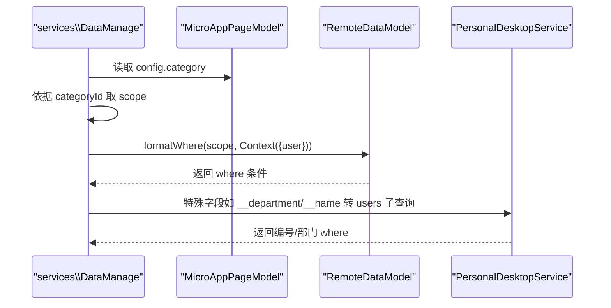
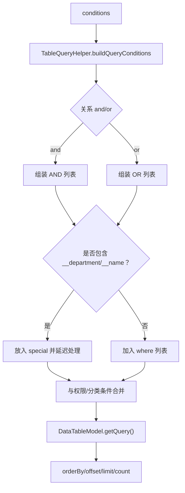
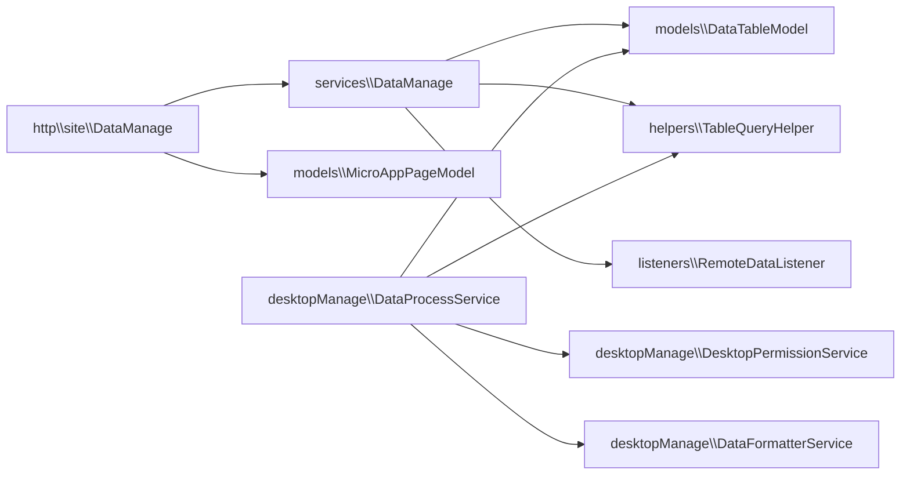

# 数据管理操作

<cite>
**本文引用的文件**
- [DataManage.php](file://process/src/services/DataManage.php)
- [DataManage.php](file://process/src/http/site/DataManage.php)
- [DataTableModel.php](file://process/src/models/DataTableModel.php)
- [MicroAppPageModel.php](file://process/src/models/MicroAppPageModel.php)
- [DataProcessService.php](file://process/src/services/desktopManage/DataProcessService.php)
- [DesktopPermissionService.php](file://process/src/services/desktopManage/DesktopPermissionService.php)
- [DataFormatterService.php](file://process/src/services/desktopManage/DataFormatterService.php)
- [TableQueryHelper.php](file://process/src/services/desktopManage/helpers/TableQueryHelper.php)
- [PersonalDesktopService.php](file://process/src/services/desktopManage/PersonalDesktopService.php)
- [DataTable.php](file://process/src/http/system/DataTable.php)
- [RemoteDataListener.php](file://process/src/services/listeners/RemoteDataListener.php)
- [DataTableSync.php](file://process/src/services/task/DataTableSync.php)
- [DataTableV2.php](file://process/src/modules/form/components/DataTableV2.php)
- [migration_20240529_092216_data_table_v2.php](file://process/src/migrations/migration_20240529_092216_data_table_v2.php)
- [migration_20250405_103428_micro_app.php](file://process/src/migrations/migration_20250405_103428_micro_app.php)
</cite>

## 目录
1. [简介](#简介)
2. [项目结构](#项目结构)
3. [核心组件](#核心组件)
4. [架构总览](#架构总览)
5. [详细组件分析](#详细组件分析)
6. [依赖关系分析](#依赖关系分析)
7. [性能考量](#性能考量)
8. [故障排查指南](#故障排查指南)
9. [结论](#结论)
10. [附录](#附录)

## 简介
本文件围绕 htdNew 项目的“数据管理”能力，系统梳理 DataManage 类及其周边组件在“页面配置—数据查询—权限控制—分类过滤—数据表绑定—操作流程—接口规范—错误处理—查询优化—实际使用场景”的全链路实现。重点解释：
- DataManage 在服务层如何解析页面配置、构建查询条件、合并权限与分类过滤；
- HTTP 层 DataManage 如何承接前端请求、校验角色与菜单权限、调用服务层并返回结果；
- 桌面侧 DataProcessService 如何在大数据量场景下进行查询构建、游标分页、子表批量加载与字段过滤；
- 数据表绑定、分类条件、远程数据权限表达式、导入导出与日志审计等关键能力。

## 项目结构
围绕数据管理的关键文件分布如下：
- 服务层 DataManage：负责从页面配置提取数据表、角色、字段权限、分类过滤，统一构建查询；
- HTTP 层 DataManage：负责鉴权、参数校验、按钮与字段权限下发、CRUD 与导入导出；
- 模型层 DataTableModel：动态生成数据表模型、字段元信息、查询构造；
- 桌面服务 DataProcessService：统一的桌面数据读写、权限过滤、游标分页、子表批量加载；
- 辅助组件：TableQueryHelper、DesktopPermissionService、DataFormatterService、PersonalDesktopService；
- 页面模型 MicroAppPageModel：承载页面配置（字段、排序、权限、分类等）；
- 系统级接口与迁移：系统数据表接口、导入导出、微应用数据管理日志表等。



图表来源
- [DataManage.php](file://process/src/http/site/DataManage.php#L46-L150)
- [DataManage.php](file://process/src/services/DataManage.php#L23-L93)
- [DataProcessService.php](file://process/src/services/desktopManage/DataProcessService.php#L100-L198)
- [DesktopPermissionService.php](file://process/src/services/desktopManage/DesktopPermissionService.php#L1-L120)
- [DataFormatterService.php](file://process/src/services/desktopManage/DataFormatterService.php#L1-L120)
- [TableQueryHelper.php](file://process/src/services/desktopManage/helpers/TableQueryHelper.php#L140-L200)
- [DataTableModel.php](file://process/src/models/DataTableModel.php#L552-L577)
- [MicroAppPageModel.php](file://process/src/models/MicroAppPageModel.php#L1-L120)
- [PersonalDesktopService.php](file://process/src/services/desktopManage/PersonalDesktopService.php#L415-L441)
- [DataTable.php](file://process/src/http/system/DataTable.php#L2212-L2227)
- [RemoteDataListener.php](file://process/src/services/listeners/RemoteDataListener.php#L227-L259)
- [DataTableSync.php](file://process/src/services/task/DataTableSync.php#L1018-L1049)
- [DataTableV2.php](file://process/src/modules/form/components/DataTableV2.php#L1-L32)
- [migration_20240529_092216_data_table_v2.php](file://process/src/migrations/migration_20240529_092216_data_table_v2.php#L1-L29)
- [migration_20250405_103428_micro_app.php](file://process/src/migrations/migration_20250405_103428_micro_app.php#L62-L82)

章节来源
- [DataManage.php](file://process/src/http/site/DataManage.php#L46-L150)
- [DataManage.php](file://process/src/services/DataManage.php#L23-L93)
- [DataTableModel.php](file://process/src/models/DataTableModel.php#L552-L577)

## 核心组件
- 服务层 DataManage：从页面配置提取 data_table_id、auth、fields、sort 等，构建 where 条件（含字段条件、数据权限条件、分类条件），返回 DataTableModel 的查询对象。
- HTTP 层 DataManage：接收前端分页、排序、条件、分类参数，校验角色与菜单权限，调用服务层 getQuery，再按字段权限与按钮规则组装返回数据。
- 桌面服务 DataProcessService：统一构建查询、计数、分页（偏深分页游标）、子表批量加载与格式化、字段权限过滤、钩子扩展点。
- 模型层 DataTableModel：动态生成数据表模型类、字段元信息、查询构造、唯一键/索引、内置系统字段等。
- 辅助组件：TableQueryHelper 提供查询条件解析、子表查询；DesktopPermissionService 合并字段权限；DataFormatterService 格式化导出与保存；PersonalDesktopService 提供编号/部门特殊条件拼装；RemoteDataListener 格式化远程数据 where 表达式；DataTableSync/DataTableV2 支持数据表绑定与字典映射。

章节来源
- [DataManage.php](file://process/src/services/DataManage.php#L23-L93)
- [DataManage.php](file://process/src/http/site/DataManage.php#L46-L150)
- [DataProcessService.php](file://process/src/services/desktopManage/DataProcessService.php#L100-L198)
- [DataTableModel.php](file://process/src/models/DataTableModel.php#L1-L120)
- [TableQueryHelper.php](file://process/src/services/desktopManage/helpers/TableQueryHelper.php#L140-L200)
- [DesktopPermissionService.php](file://process/src/services/desktopManage/DesktopPermissionService.php#L90-L132)
- [DataFormatterService.php](file://process/src/services/desktopManage/DataFormatterService.php#L1-L120)
- [PersonalDesktopService.php](file://process/src/services/desktopManage/PersonalDesktopService.php#L415-L441)
- [RemoteDataListener.php](file://process/src/services/listeners/RemoteDataListener.php#L227-L259)
- [DataTableSync.php](file://process/src/services/task/DataTableSync.php#L1018-L1049)
- [DataTableV2.php](file://process/src/modules/form/components/DataTableV2.php#L1-L32)

## 架构总览
数据管理从“页面配置”出发，经“权限与条件合并”，到“查询构建与执行”，再到“字段权限过滤与子表加载”，最终输出给前端或导出。



图表来源
- [DataManage.php](file://process/src/http/site/DataManage.php#L46-L150)
- [DataManage.php](file://process/src/services/DataManage.php#L23-L93)
- [DataTableModel.php](file://process/src/models/DataTableModel.php#L552-L577)
- [MicroAppPageModel.php](file://process/src/models/MicroAppPageModel.php#L1-L120)

## 详细组件分析

### 服务层 DataManage：查询构建与权限合并
- 数据表绑定：通过页面配置 data_table_id 获取 DataTableModel 实例。
- 权限条件：根据页面配置 auth（按 role_id）提取 data_auth，调用 formatAuthConfig 合并为 where 条件。
- 字段条件：若 conditions 存在，调用 DataTableModel::buildFieldsWhere 将字段条件转为 SQL where。
- 分类过滤：若 categoryId 存在，读取 page.config.category，按 scope 构建 where 条件并通过 RemoteDataModel::formatWhere 评估上下文。
- 返回查询：将 where、排序、分页组合，返回 DataTableModel 的查询对象。



图表来源
- [DataManage.php](file://process/src/services/DataManage.php#L23-L93)
- [DataTableModel.php](file://process/src/models/DataTableModel.php#L552-L577)
- [RemoteDataListener.php](file://process/src/services/listeners/RemoteDataListener.php#L227-L259)

章节来源
- [DataManage.php](file://process/src/services/DataManage.php#L23-L93)

### HTTP 层 DataManage：接口规范与操作流程
- 接口路径：GET /site/data_manage/list，参数：
  - page_id：页面 ID
  - role_id：角色 ID
  - conditions：字段条件数组
  - orderby/sort：排序字段与方向
  - category_id：分类 ID
- 校验逻辑：
  - 校验 orderby/sort 合法性；
  - 校验用户角色与菜单权限；
  - 读取页面配置，获取按钮与字段权限；
  - 调用服务层 getQuery，执行分页查询与计数；
  - 按字段权限隐藏列，按行按钮规则生成行级按钮集合。
- 其他接口：
  - info：返回顶部按钮、字段权限、操作权限、绑定会话键信息；
  - detail/save/delete：基于页面绑定的数据表执行 CRUD；
  - analysis/export/log/options/apps/remind*：导入分析、导出、日志、选项、绑定应用、催办等。

```mermaid
sequenceDiagram
participant FE as "前端"
participant C as "http\\site\\DataManage"
participant M as "MicroAppPageModel"
participant S as "services\\DataManage"
participant D as "DataTableModel"
FE->>C : list(offset,limit)
C->>C : 参数校验/菜单/角色校验
C->>M : 读取页面配置
C->>S : new S; set page,user,roleId,conditions,categoryId
S->>S : getQuery()
S->>D : getQuery().where(...).orderby(...).offset(...).limit(...)
D-->>S : 结果集
S-->>C : 查询对象
C->>C : 按字段权限/按钮规则组装
C-->>FE : {list,total}
```

图表来源
- [DataManage.php](file://process/src/http/site/DataManage.php#L46-L150)
- [DataManage.php](file://process/src/services/DataManage.php#L23-L93)
- [DataTableModel.php](file://process/src/models/DataTableModel.php#L552-L577)

章节来源
- [DataManage.php](file://process/src/http/site/DataManage.php#L46-L150)

### 桌面服务 DataProcessService：查询优化与子表加载
- 性能监控：记录 before_hook/query_build/count/data_query/field_filter/subtable_attach/after_hook 总耗时；
- 分页策略：大数据集且深分页时采用游标分页，否则使用 offset/limit；
- 子表批量加载：按主表 ID 分批查询子表，权限过滤后再按 pid 组合；
- 字段权限过滤：按表 ID 分组的 field_auth 过滤隐藏字段；
- 钩子扩展：beforeRead/afterRead/beforeWrite/afterWrite 四个钩子贯穿读写流程。



图表来源
- [DataProcessService.php](file://process/src/services/desktopManage/DataProcessService.php#L100-L198)
- [DataProcessService.php](file://process/src/services/desktopManage/DataProcessService.php#L548-L577)
- [DataProcessService.php](file://process/src/services/desktopManage/DataProcessService.php#L587-L714)

章节来源
- [DataProcessService.php](file://process/src/services/desktopManage/DataProcessService.php#L100-L198)

### 权限控制与字段权限合并
- 字段权限合并：DesktopPermissionService.mergeAuthField 将表默认权限与分类表权限合并，支持必填与可写/只读/隐藏的降级策略；
- 简化权限格式：convertToSimpleFormat 将权限对象转为 q/w/r/h；
- 数据权限表达式：DataAuthHelper.buildAuthWhereFromDataAuth 支持自定义/按数据表两种模式，结合上下文替换变量；
- 远程数据 where：RemoteDataListener.formatWhere 将 datatable.N. 语法替换为具体表别名，再按上下文求值。



图表来源
- [DesktopPermissionService.php](file://process/src/services/desktopManage/DesktopPermissionService.php#L90-L132)
- [DesktopPermissionService.php](file://process/src/services/desktopManage/DesktopPermissionService.php#L194-L229)
- [DataAuthHelper.php](file://process/src/services/desktopManage/helpers/DataAuthHelper.php#L1-L42)
- [RemoteDataListener.php](file://process/src/services/listeners/RemoteDataListener.php#L227-L259)

章节来源
- [DesktopPermissionService.php](file://process/src/services/desktopManage/DesktopPermissionService.php#L90-L132)
- [DataAuthHelper.php](file://process/src/services/desktopManage/helpers/DataAuthHelper.php#L1-L42)
- [RemoteDataListener.php](file://process/src/services/listeners/RemoteDataListener.php#L227-L259)

### 分类过滤与数据表绑定
- 分类过滤：服务层 DataManage 读取 page.config.category，按 categoryId 取 scope，通过 RemoteDataModel::formatWhere 评估上下文生成 where；
- 数据表绑定：页面配置 fields.collectRule 中包含 __sessid 的字段即表示与会话/应用绑定；服务层 getBindApps 可提取绑定的应用 ID；
- 桌面编号/部门条件：PersonalDesktopService.buildNumberFieldConditions 将 __department/__name 等特殊字段转为 users 表子查询条件；
- 系统接口与绑定：http\system\DataTable 提供数据表字段与过滤条件映射；DataTableV2 支持 data_table_id/table_type/明细/共享表绑定渲染。



图表来源
- [DataManage.php](file://process/src/services/DataManage.php#L40-L47)
- [RemoteDataListener.php](file://process/src/services/listeners/RemoteDataListener.php#L227-L259)
- [PersonalDesktopService.php](file://process/src/services/desktopManage/PersonalDesktopService.php#L415-L441)
- [DataTableV2.php](file://process/src/modules/form/components/DataTableV2.php#L1-L32)
- [DataTable.php](file://process/src/http/system/DataTable.php#L2212-L2227)

章节来源
- [DataManage.php](file://process/src/services/DataManage.php#L40-L47)
- [PersonalDesktopService.php](file://process/src/services/desktopManage/PersonalDesktopService.php#L415-L441)
- [DataTableV2.php](file://process/src/modules/form/components/DataTableV2.php#L1-L32)
- [DataTable.php](file://process/src/http/system/DataTable.php#L2212-L2227)

### 查询条件构建与优化
- 条件解析：TableQueryHelper.buildQueryConditions 支持 and/or 关系、in/not in、between、ILIKE、数组字段多值匹配、特殊字段（__department/__name）分流；
- 动态模型：DataTableModel::getQuery 生成模型类并构造 ActiveQuery，支持 orderBy/offset/limit/count；
- 游标分页：DataProcessService 在大数据深分页场景下切换游标分页，避免 offset 过深导致性能问题；
- 子表批量加载：DataProcessService.batchQuerySubTableData 分批查询子表并按 pid 组合，减少 N+1 查询。



图表来源
- [TableQueryHelper.php](file://process/src/services/desktopManage/helpers/TableQueryHelper.php#L140-L200)
- [DataTableModel.php](file://process/src/models/DataTableModel.php#L552-L577)
- [DataProcessService.php](file://process/src/services/desktopManage/DataProcessService.php#L100-L198)

章节来源
- [TableQueryHelper.php](file://process/src/services/desktopManage/helpers/TableQueryHelper.php#L140-L200)
- [DataTableModel.php](file://process/src/models/DataTableModel.php#L552-L577)
- [DataProcessService.php](file://process/src/services/desktopManage/DataProcessService.php#L100-L198)

### 数据表绑定与字典映射
- 绑定字段：DataTableSync.getBindApps/getValue 支持从页面 fields.collectRule 中识别 __sessid 绑定，并按 dictionary 映射字段值；
- 字典/表单映射：http\system\DataTable 提供字段与过滤条件映射，支持 selectableData/where/order_by；
- 组件绑定：DataTableV2 支持 data_table_id、table_type（个人/共享/明细），并渲染明细/共享子表。

章节来源
- [DataTableSync.php](file://process/src/services/task/DataTableSync.php#L1018-L1049)
- [DataTable.php](file://process/src/http/system/DataTable.php#L2212-L2227)
- [DataTableV2.php](file://process/src/modules/form/components/DataTableV2.php#L1-L32)

## 依赖关系分析
- 低耦合高内聚：HTTP 层仅负责参数校验与调用服务层；服务层专注查询构建与权限合并；模型层专注动态模型与字段元信息；
- 关键依赖链：
  - http\site\DataManage → services\DataManage → models\DataTableModel + helpers\TableQueryHelper + listeners\RemoteDataListener
  - desktopManage\DataProcessService → models\DataTableModel + desktopManage\DesktopPermissionService + desktopManage\DataFormatterService + helpers\TableQueryHelper
  - 页面配置 MicroAppPageModel → 字段权限/排序/分类/按钮



图表来源
- [DataManage.php](file://process/src/http/site/DataManage.php#L46-L150)
- [DataManage.php](file://process/src/services/DataManage.php#L23-L93)
- [DataProcessService.php](file://process/src/services/desktopManage/DataProcessService.php#L100-L198)
- [DesktopPermissionService.php](file://process/src/services/desktopManage/DesktopPermissionService.php#L1-L120)
- [DataFormatterService.php](file://process/src/services/desktopManage/DataFormatterService.php#L1-L120)
- [TableQueryHelper.php](file://process/src/services/desktopManage/helpers/TableQueryHelper.php#L140-L200)
- [DataTableModel.php](file://process/src/models/DataTableModel.php#L552-L577)
- [MicroAppPageModel.php](file://process/src/models/MicroAppPageModel.php#L1-L120)

章节来源
- [DataManage.php](file://process/src/http/site/DataManage.php#L46-L150)
- [DataManage.php](file://process/src/services/DataManage.php#L23-L93)
- [DataProcessService.php](file://process/src/services/desktopManage/DataProcessService.php#L100-L198)

## 性能考量
- 游标分页：当 total > 10000 且 page > 50 时切换游标分页，避免深分页 OFFSET 过大；
- 子表批量加载：按主表 ID 分批查询子表，减少 IN 查询长度，降低数据库压力；
- 权限过滤前置：先过滤隐藏字段，再格式化/导出，减少无效数据传输；
- 模型缓存：DataTableModel 缓存数据表模型类与字段配置，避免重复生成；
- 日志告警：慢查询（>500ms）与子表慢查询（>200ms）记录性能日志，便于定位瓶颈。

章节来源
- [DataProcessService.php](file://process/src/services/desktopManage/DataProcessService.php#L100-L198)
- [DataProcessService.php](file://process/src/services/desktopManage/DataProcessService.php#L587-L714)

## 故障排查指南
- 未配置字段/数据表：DataTableModel::getQuery 抛出异常提示未配置字段；
- 角色/菜单权限不足：http\site\DataManage 校验失败返回错误；
- 字段权限隐藏：按 field_auth 隐藏列，确保不越权；
- 导入/导出异常：analysis/export 接口返回错误或资源 ID；
- 日志审计：操作日志写入 micro_app_data_manage_log，支持关键词/时间区间检索；
- 数据权限表达式：remote data where 未生效时检查 formatWhere 上下文与 datatable.N. 语法。

章节来源
- [DataManage.php](file://process/src/http/site/DataManage.php#L337-L419)
- [migration_20250405_103428_micro_app.php](file://process/src/migrations/migration_20250405_103428_micro_app.php#L62-L82)

## 结论
htdNew 的数据管理以“页面配置为中心”，通过服务层 DataManage 统一构建查询与权限合并，结合桌面服务 DataProcessService 的查询优化与子表加载，形成从“页面配置—数据查询—权限控制—分类过滤—数据表绑定—操作流程—接口规范—错误处理—查询优化—实际使用场景”的完整闭环。建议在复杂场景下充分利用游标分页、子表批量加载与权限过滤钩子，持续关注性能日志并优化 where 条件与索引设计。

## 附录
- 页面配置关键字段：data_table_id、auth（含 data_auth/field_auth/operation_auth）、fields（含 collectRule）、category、sort；
- 常用系统字段：__number/__name/__departname/__created 等，支持特殊条件拼装；
- 迁移要点：数据表版本升级、微应用数据管理日志表、索引优化。

章节来源
- [migration_20240529_092216_data_table_v2.php](file://process/src/migrations/migration_20240529_092216_data_table_v2.php#L1-L29)
- [migration_20250405_103428_micro_app.php](file://process/src/migrations/migration_20250405_103428_micro_app.php#L62-L82)