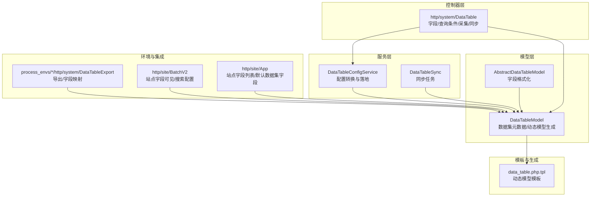
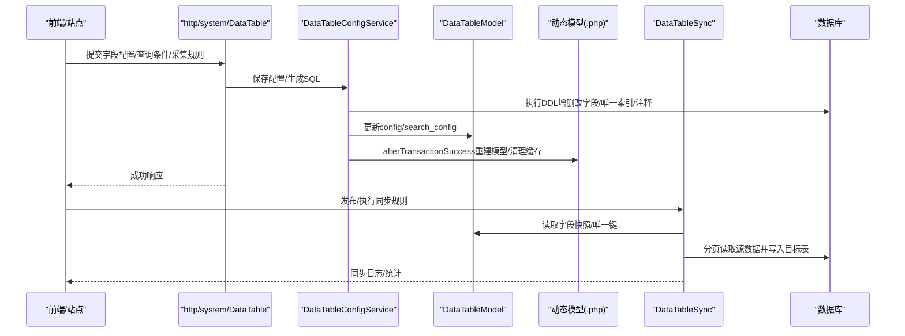
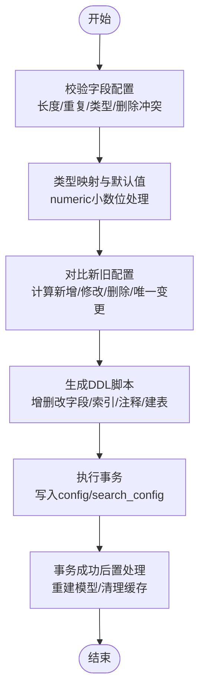
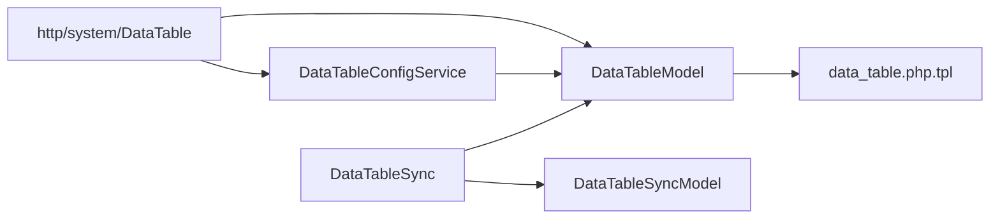

# 数据表配置管理

<cite>
**本文引用的文件**
- [DataTableConfigService.php](file://process/src/services/DataTableConfigService.php)
- [DataTableModel.php](file://process/src/models/DataTableModel.php)
- [AbstractDataTableModel.php](file://process/src/models/AbstractDataTableModel.php)
- [DataTable.php（系统控制器）](file://process/src/http/system/DataTable.php)
- [DataTableSync.php](file://process/src/services/task/DataTableSync.php)
- [DataTableSyncModel.php](file://process/src/models/DataTableSyncModel.php)
- [data_table.php.tpl](file://process/src/commands/data_table.php.tpl)
- [ClaimService.php](file://process/src/services/claim/ClaimService.php)
- [BatchV2.php](file://process/src/http/site/BatchV2.php)
- [App.php（站点控制器）](file://process/src/http/site/App.php)
- [DataTableExport.php（环境特定）](file://process_envs/buaa/product/http/system/DataTableExport.php)
- [ExcelImportExportService.php](file://process/src/services/desktopManage/ExcelImportExportService.php)
</cite>

## 目录
1. [简介](#简介)
2. [项目结构](#项目结构)
3. [核心组件](#核心组件)
4. [架构总览](#架构总览)
5. [详细组件分析](#详细组件分析)
6. [依赖关系分析](#依赖关系分析)
7. [性能考量](#性能考量)
8. [故障排查指南](#故障排查指南)
9. [结论](#结论)
10. [附录](#附录)

## 简介
本文件围绕 htdNew 项目的“数据表配置管理”主题，系统梳理 DataTableConfigService 的配置管理与字段处理机制，覆盖数据表结构配置、字段属性管理、界面组件配置、配置验证、版本管理与配置同步等技术实现，并提供接口规范、配置模板与扩展机制说明，辅以实际应用场景与代码示例路径，帮助读者快速理解与落地。

## 项目结构
与“数据表配置管理”直接相关的核心模块分布如下：
- 服务层：DataTableConfigService（配置转换与落地）、DataTableSync（同步任务）
- 模型层：DataTableModel（数据集元数据与动态模型生成）、AbstractDataTableModel（字段格式化）
- 控制器层：http/system/DataTable（系统侧数据集与字段管理、查询条件、采集规则、同步列表等）
- 模板与生成：data_table.php.tpl（动态数据模型生成）
- 环境与集成：process_envs 下的导出/站点控制器等对配置的消费

图表来源
- [DataTableConfigService.php](file://process/src/services/DataTableConfigService.php#L1-L258)
- [DataTableModel.php](file://process/src/models/DataTableModel.php#L1-L200)
- [AbstractDataTableModel.php](file://process/src/models/AbstractDataTableModel.php#L1-L84)
- [DataTable.php（系统控制器）](file://process/src/http/system/DataTable.php#L546-L618)
- [data_table.php.tpl](file://process/src/commands/data_table.php.tpl#L1-L23)
- [DataTableExport.php（环境特定）](file://process_envs/buaa/product/http/system/DataTableExport.php#L52-L69)
- [BatchV2.php](file://process/src/http/site/BatchV2.php#L257-L289)
- [App.php（站点控制器）](file://process/src/http/site/App.php#L855-L886)

章节来源
- [DataTableConfigService.php](file://process/src/services/DataTableConfigService.php#L1-L258)
- [DataTableModel.php](file://process/src/models/DataTableModel.php#L1-L200)
- [data_table.php.tpl](file://process/src/commands/data_table.php.tpl#L1-L23)

## 核心组件
- DataTableConfigService：负责将前端提交的配置转换为 SQL，执行字段增删改、唯一索引维护、注释更新，并在事务成功后触发动态模型重建与缓存清理。
- DataTableModel：承载数据集元信息（config、search_config、权限等），提供动态模型生成、版本号计算、唯一字段提取、内置字段集合等能力。
- AbstractDataTableModel：在保存前对特定格式字段（如人员搜索）做序列化/反序列化处理，保证入库与出库一致性。
- http/system/DataTable：系统侧数据集管理入口，提供字段配置保存、查询条件保存、采集规则管理、同步规则列表与详情、默认数据集快速创建等接口。
- DataTableSync/DataTableSyncModel：同步规则配置校验与分页策略、唯一键映射校验、主/子表同步与删除收尾、日志与心跳管理。

章节来源
- [DataTableConfigService.php](file://process/src/services/DataTableConfigService.php#L1-L258)
- [DataTableModel.php](file://process/src/models/DataTableModel.php#L406-L520)
- [AbstractDataTableModel.php](file://process/src/models/AbstractDataTableModel.php#L1-L84)
- [DataTable.php（系统控制器）](file://process/src/http/system/DataTable.php#L546-L618)
- [DataTableSync.php](file://process/src/services/task/DataTableSync.php#L1-L200)
- [DataTableSyncModel.php](file://process/src/models/DataTableSyncModel.php#L99-L161)

## 架构总览
下图展示了“配置管理—模型生成—动态查询—同步/导出”的整体流程。

图表来源
- [DataTable.php（系统控制器）](file://process/src/http/system/DataTable.php#L546-L618)
- [DataTableConfigService.php](file://process/src/services/DataTableConfigService.php#L1-L120)
- [DataTableModel.php](file://process/src/models/DataTableModel.php#L558-L630)
- [DataTableSync.php](file://process/src/services/task/DataTableSync.php#L380-L432)

## 详细组件分析

### DataTableConfigService：配置转换与落地
- 功能要点
  - 字段配置校验：长度限制、重复字段、类型合法性、删除字段冲突。
  - 类型转换：根据字段类型映射到数据库列类型，支持 numeric 小数位数。
  - DDL 生成：新增/修改/删除字段、唯一索引维护、列注释更新、建表脚本。
  - 唯一性约束：在存在历史数据时禁止修改字段类型；对唯一字段变更进行索引重建。
  - 事务后置：事务成功后重建动态模型文件并清理旧版本文件，确保运行时模型与配置一致。
- 关键流程（字段配置保存）

图表来源
- [DataTableConfigService.php](file://process/src/services/DataTableConfigService.php#L105-L237)

章节来源
- [DataTableConfigService.php](file://process/src/services/DataTableConfigService.php#L1-L258)

### DataTableModel：数据集元数据与动态模型
- 数据结构
  - config：字段配置数组，包含 field、fieldName、type、format、unique、decimal、searchType、required、permit、options、default_value、validation 等。
  - search_config：查询条件配置（排序、筛选字段等）。
  - 内置字段：BUILDIN_FIELDS、DEFAULT_FIELDS、PERSONAL_BUILDIN_FIELDS、SHARE_BUILDIN_FIELDS、DETAIL_BUILDIN_FIELDS 等。
- 版本管理
  - 通过 id_时间戳 生成版本号，动态模型文件命名基于版本号，旧文件清理策略保证幂等。
  - 支持生成动态模型文件（data_table.php.tpl），运行时按需 autoload。
- 字段与权限
  - 提供 getUniqueFields/getUniqueKeys、getCustomerFields、getFields/_getFields 等便捷方法。
  - 支持默认数据集快速创建与字段补齐。

章节来源
- [DataTableModel.php](file://process/src/models/DataTableModel.php#L1-L200)
- [DataTableModel.php](file://process/src/models/DataTableModel.php#L406-L520)
- [DataTableModel.php](file://process/src/models/DataTableModel.php#L632-L713)
- [data_table.php.tpl](file://process/src/commands/data_table.php.tpl#L1-L23)

### AbstractDataTableModel：字段格式化与用户搜索
- 在保存前对特定格式字段（如人员搜索）进行序列化/反序列化，保证入库为统一格式、出库为对象结构。
- 提供默认用户结构与解析逻辑，兼容系统内外部人员输入。

章节来源
- [AbstractDataTableModel.php](file://process/src/models/AbstractDataTableModel.php#L1-L84)

### http/system/DataTable：系统侧配置入口
- 字段配置保存：校验字段英文名、保留字段、重复字段；保存 config 与 children 子表配置；升级表结构与默认索引；更新采集规则字段名。
- 查询条件保存：保存 search_config。
- 采集规则：支持启用/禁用、复制、删除、日志查询、详情补全缺失字段。
- 同步规则：提供同步列表、详情、校验（cron、数据源、分页辅助字段自增校验）。
- 默认数据集：快速创建与字段补齐。

章节来源
- [DataTable.php（系统控制器）](file://process/src/http/system/DataTable.php#L546-L618)
- [DataTable.php（系统控制器）](file://process/src/http/system/DataTable.php#L637-L648)
- [DataTable.php（系统控制器）](file://process/src/http/system/DataTable.php#L1200-L1600)

### DataTableSync/DataTableSyncModel：同步与校验
- 字段快照：构建主表/子表字段快照，支持“同步字段”与“核对字段”两类配置。
- 唯一键映射校验：在分页同步前校验主表唯一键配置完整性与有效性。
- 分页与删除收尾：支持数据库/远端数据源分页读取、批量提交、删除收尾。
- 日志与心跳：轻量日志文件与 Redis 列表记录，支持心跳刷新与清理。

章节来源
- [DataTableSync.php](file://process/src/services/task/DataTableSync.php#L1-L200)
- [DataTableSync.php](file://process/src/services/task/DataTableSync.php#L217-L348)
- [DataTableSync.php](file://process/src/services/task/DataTableSync.php#L380-L432)
- [DataTableSyncModel.php](file://process/src/models/DataTableSyncModel.php#L99-L161)
- [DataTableSyncModel.php](file://process/src/models/DataTableSyncModel.php#L163-L234)

### 配置验证、版本管理与配置同步
- 验证规则
  - 字段英文名正则、保留字段禁止、重复字段禁止、类型合法性、唯一字段变更与历史数据类型修改限制。
  - 同步规则配置校验：数据源、SQL/表字段、分页辅助字段自增校验、cron 状态联动。
- 版本管理
  - 动态模型文件按版本号命名，事务成功后清理旧版本文件，避免脏缓存。
- 配置同步
  - 字段快照用于区分“直接更新”与“核对更新”，支持主表/子表同步与删除收尾。

章节来源
- [DataTableConfigService.php](file://process/src/services/DataTableConfigService.php#L105-L237)
- [DataTableSync.php](file://process/src/services/task/DataTableSync.php#L217-L348)
- [DataTableSyncModel.php](file://process/src/models/DataTableSyncModel.php#L99-L161)

### 字段类型处理、验证规则与显示配置
- 字段类型
  - 数据库类型映射：varchar、int8、numeric、timestamp、date、jsonb、数组类型等。
  - 前端展示类型：input、textarea、select、radio、checkbox、timestamp/date/datetime/year/month/files/images/searchuser 等。
- 验证规则
  - 英文名正则、保留字段、重复字段、类型合法性、唯一字段冲突、历史数据类型修改限制。
- 显示配置
  - format 控制前端展示类型；searchType 与 visible/searchable 由站点控制器/导出逻辑映射。
  - 人员搜索字段在入库前统一格式化，出库时解析为对象结构。

章节来源
- [DataTableModel.php](file://process/src/models/DataTableModel.php#L406-L520)
- [AbstractDataTableModel.php](file://process/src/models/AbstractDataTableModel.php#L1-L84)
- [BatchV2.php](file://process/src/http/site/BatchV2.php#L257-L289)
- [App.php（站点控制器）](file://process/src/http/site/App.php#L855-L886)
- [DataTableExport.php（环境特定）](file://process_envs/buaa/product/http/system/DataTableExport.php#L52-L69)

### 接口规范与配置模板
- 接口规范（节选）
  - 字段配置保存：POST /system/data-table/field-config-save（含 children 与 magic_control）
  - 查询条件保存：POST /system/data-table/search-config-save
  - 采集规则：启用/禁用/删除/复制/日志/详情
  - 同步规则：列表/详情/校验（cron、数据源、分页辅助字段）
- 配置模板
  - 动态模型模板：data_table.php.tpl，生成运行时模型类，包含列定义与表名映射。

章节来源
- [DataTable.php（系统控制器）](file://process/src/http/system/DataTable.php#L546-L618)
- [DataTable.php（系统控制器）](file://process/src/http/system/DataTable.php#L1200-L1600)
- [data_table.php.tpl](file://process/src/commands/data_table.php.tpl#L1-L23)

### 扩展机制
- 动态模型扩展：通过模板生成运行时模型类，支持字段增删后的自动适配。
- 采集规则扩展：支持按 app_version_id 维度启用/禁用，支持默认规则复制。
- 同步规则扩展：支持数据库/远端数据源、SQL/表字段两种同步方式，支持子表同步与分页辅助字段自增校验。

章节来源
- [data_table.php.tpl](file://process/src/commands/data_table.php.tpl#L1-L23)
- [DataTable.php（系统控制器）](file://process/src/http/system/DataTable.php#L1200-L1600)
- [DataTableSyncModel.php](file://process/src/models/DataTableSyncModel.php#L99-L161)

### 实际应用场景与代码示例路径
- 数据表配置
  - 字段配置保存：[字段配置保存](file://process/src/http/system/DataTable.php#L546-L618)
  - 查询条件保存：[查询条件保存](file://process/src/http/system/DataTable.php#L637-L648)
- 字段设置
  - 字段列表与唯一性：[字段列表](file://process/src/http/system/DataTable.php#L659-L671)
  - 默认数据集快速创建：[快速创建](file://process/src/http/system/DataTable.php#L1426-L1477)
- 界面组件配置
  - 站点字段可见/搜索映射：[站点字段映射](file://process/src/http/site/BatchV2.php#L257-L289)
  - 站点默认数据集字段：[默认字段](file://process/src/http/site/App.php#L855-L886)
  - 导出字段映射与选项：[导出映射](file://process_envs/buaa/product/http/system/DataTableExport.php#L52-L69)
- 配置模板与动态模型
  - 模板文件：[模板](file://process/src/commands/data_table.php.tpl#L1-L23)
  - 动态模型生成与清理：[生成/清理](file://process/src/models/DataTableModel.php#L558-L630)
- 配置同步
  - 同步规则校验与分页：[校验/分页](file://process/src/models/DataTableSyncModel.php#L163-L234)
  - 同步执行与日志：[执行/日志](file://process/src/services/task/DataTableSync.php#L380-L432)

## 依赖关系分析
- 组件耦合
  - http/system/DataTable 依赖 DataTableConfigService 与 DataTableModel 完成字段配置与动态模型重建。
  - DataTableConfigService 依赖 DataTableModel 的类型映射与版本号计算，DDL 执行后依赖事务后置钩子重建模型。
  - DataTableSync 依赖 DataTableModel 的字段快照与唯一键集合，依赖 DataTableSyncModel 的配置校验。
- 外部依赖
  - 数据库：PostgreSQL（类型映射、索引、注释）。
  - Redis：同步心跳与日志列表。
  - 文件系统：动态模型文件生成与清理。

图表来源
- [DataTable.php（系统控制器）](file://process/src/http/system/DataTable.php#L546-L618)
- [DataTableConfigService.php](file://process/src/services/DataTableConfigService.php#L1-L120)
- [DataTableModel.php](file://process/src/models/DataTableModel.php#L558-L630)
- [DataTableSync.php](file://process/src/services/task/DataTableSync.php#L380-L432)
- [DataTableSyncModel.php](file://process/src/models/DataTableSyncModel.php#L99-L161)
- [data_table.php.tpl](file://process/src/commands/data_table.php.tpl#L1-L23)

## 性能考量
- 动态模型重建
  - 仅在事务成功后重建，避免频繁 IO；旧版本文件清理降低磁盘压力。
- 同步性能
  - 分页读取与批量提交，减少内存峰值；分页辅助字段自增校验避免无效扫描。
  - 日志与心跳采用轻量写入，避免阻塞主流程。
- 字段处理
  - 仅对新增字段执行 DDL，避免不必要的 alter；唯一索引重建按差集执行。

[本节为通用指导，无需列出章节来源]

## 故障排查指南
- 字段配置失败
  - 检查字段英文名正则、保留字段、重复字段、类型合法性。
  - 若存在历史数据，禁止修改字段类型；唯一字段变更需确保唯一性。
- 动态模型未生效
  - 确认事务已提交且 afterTransactionSuccess 已触发；检查动态模型文件是否生成与缓存是否清理。
- 同步异常
  - 校验 cron 状态、数据源连通性、分页辅助字段是否自增；查看同步日志与 Redis 最新日志列表。
- 导出/站点字段映射异常
  - 确认组件 key 与 data_table_field 映射正确；重复表字段需特殊处理。

章节来源
- [DataTableConfigService.php](file://process/src/services/DataTableConfigService.php#L105-L237)
- [DataTableModel.php](file://process/src/models/DataTableModel.php#L558-L630)
- [DataTableSync.php](file://process/src/services/task/DataTableSync.php#L380-L432)
- [DataTableSyncModel.php](file://process/src/models/DataTableSyncModel.php#L163-L234)
- [DataTableExport.php（环境特定）](file://process_envs/buaa/product/http/system/DataTableExport.php#L52-L69)

## 结论
本项目通过“配置即代码”的设计，将数据表结构与字段属性以 JSON 形式存储于 DataTableModel.config，配合 DataTableConfigService 的 DDL 生成与事务后置重建机制，实现了灵活、可追溯、可扩展的数据表配置管理。结合 DataTableSync 的字段快照与分页策略，进一步保障了配置变更与数据同步的稳定性与性能。建议在生产环境中严格遵循字段命名规范、类型映射与唯一性约束，并利用动态模型版本化与缓存清理机制，确保运行时一致性与可维护性。

[本节为总结性内容，无需列出章节来源]

## 附录
- 字段配置关键字段说明
  - field：英文字段名（唯一、非保留）
  - fieldName：中文显示名
  - type：数据库类型（varchar/int8/numeric/timestamp/jsonb/数组等）
  - format：前端展示类型（input/select/radio/checkbox/timestamp/date/files/images/searchuser 等）
  - unique：是否唯一
  - decimal：numeric 小数位
  - searchType：搜索类型（兼容字段）
  - required/permit/options/default_value/validation：业务与展示控制
- 查询条件配置（search_config）
  - 排序字段与规则、筛选字段与默认值、是否显示/排序等

[本节为概览性内容，无需列出章节来源]