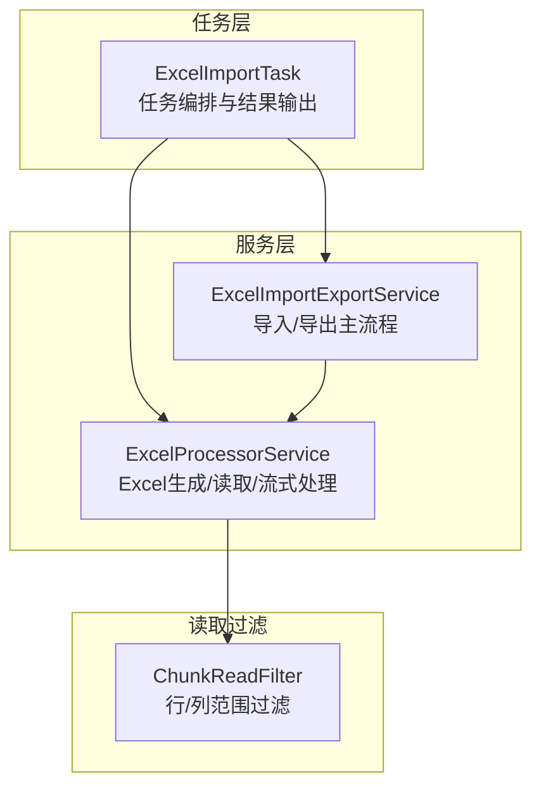
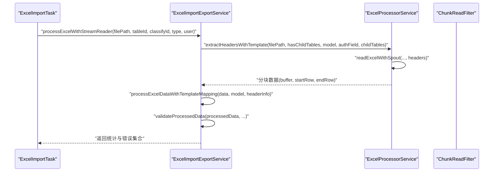
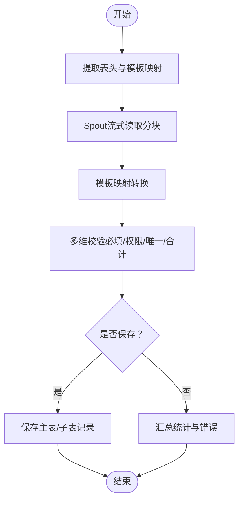
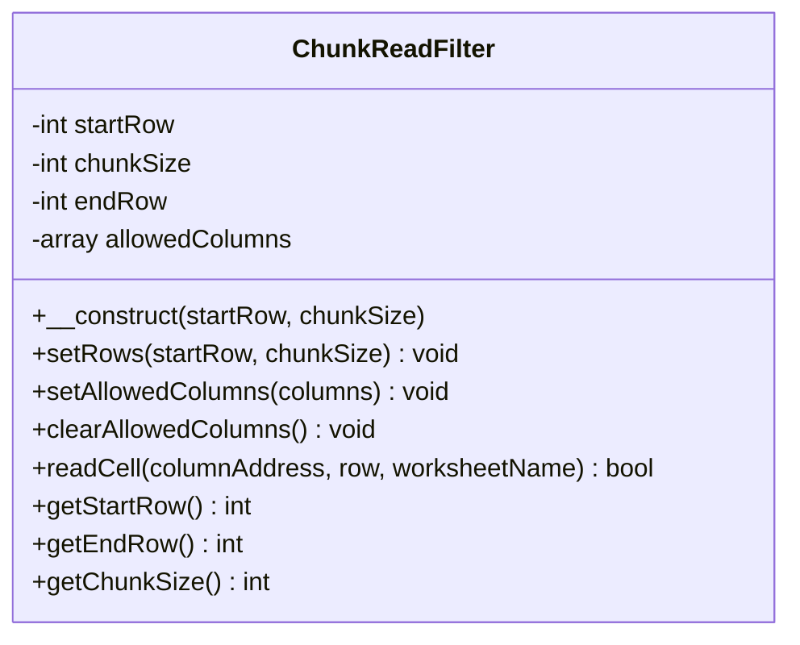
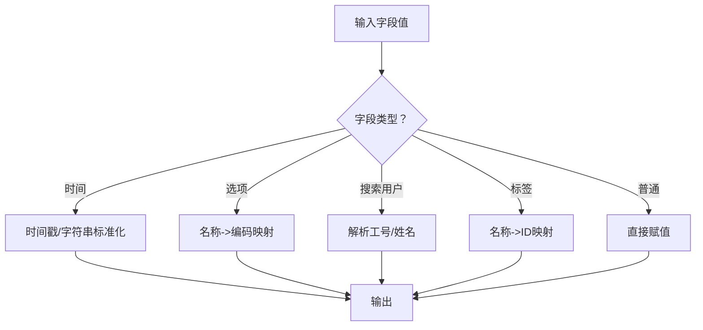
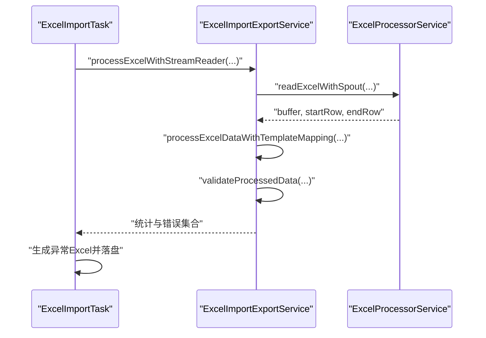
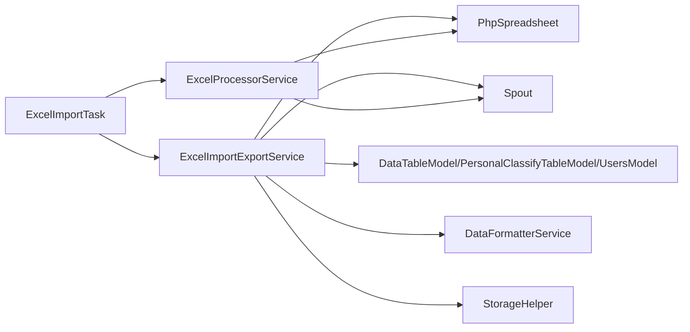

# Excel导入导出服务

<cite>
**本文引用的文件**
- [ExcelImportExportService.php](file://process/src/services/desktopManage/ExcelImportExportService.php)
- [ChunkReadFilter.php](file://process/src/services/desktopManage/ChunkReadFilter.php)
- [ExcelProcessorService.php](file://process/src/services/excel/ExcelProcessorService.php)
- [ExcelImportTask.php](file://process/src/services/task/ExcelImportTask.php)
</cite>

## 目录
1. [简介](#简介)
2. [项目结构](#项目结构)
3. [核心组件](#核心组件)
4. [架构总览](#架构总览)
5. [详细组件分析](#详细组件分析)
6. [依赖分析](#依赖分析)
7. [性能考虑](#性能考虑)
8. [故障排查指南](#故障排查指南)
9. [结论](#结论)
10. [附录](#附录)

## 简介
本文件面向Excel导入导出服务，围绕批量数据处理、分块读取与数据格式化机制展开，系统性阐述ExcelImportExportService的实现原理与工程实践，包括：
- 大数据量处理策略与内存优化技术
- 分块读取与Spout流式读取的结合
- 数据格式化与转换算法
- 导入/导出接口设计、错误处理与进度监控
- 性能优化建议与大文件处理最佳实践

## 项目结构
本服务涉及的核心模块与职责如下：
- ExcelImportExportService：导入导出主流程控制、模板解析、数据校验与保存、导出生成
- ExcelProcessorService：Excel文件生成与读取、表头解析、Spout流式读取、列宽自适应与样式设置
- ChunkReadFilter：基于PhpOffice\PhpSpreadsheet的IReadFilter实现，限定行/列范围，降低内存占用
- ExcelImportTask：任务调度层，负责调用服务、分块读取、结果缓存与异常Excel生成

图表来源
- [ExcelImportTask.php](file://process/src/services/task/ExcelImportTask.php#L640-L719)
- [ExcelImportExportService.php](file://process/src/services/desktopManage/ExcelImportExportService.php#L1858-L1969)
- [ExcelProcessorService.php](file://process/src/services/excel/ExcelProcessorService.php#L665-L741)
- [ChunkReadFilter.php](file://process/src/services/desktopManage/ChunkReadFilter.php#L1-L109)

章节来源
- [ExcelImportTask.php](file://process/src/services/task/ExcelImportTask.php#L640-L719)
- [ExcelImportExportService.php](file://process/src/services/desktopManage/ExcelImportExportService.php#L1858-L1969)
- [ExcelProcessorService.php](file://process/src/services/excel/ExcelProcessorService.php#L665-L741)
- [ChunkReadFilter.php](file://process/src/services/desktopManage/ChunkReadFilter.php#L1-L109)

## 核心组件
- ExcelImportExportService
  - 模板构建与说明生成
  - 表头提取与模板映射（支持主表/子表字段）
  - 分块读取与Spout流式读取
  - 数据转换与验证（必填、范围权限、唯一性、子表合计校验）
  - 保存逻辑（新增/更新/子表拆分）
  - 导出生成（模板+数据）
- ExcelProcessorService
  - 生成Excel（模板数据结构 -> Spreadsheet）
  - 读取Excel（低内存模式）
  - 表头解析（Spout读取第2/3行）
  - 流式读取（Spout Reader）
  - 列宽自适应与样式设置
- ChunkReadFilter
  - 限制行范围与允许列集合，避免全量加载
- ExcelImportTask
  - 任务入口，调用服务完成导入核查与结果输出

章节来源
- [ExcelImportExportService.php](file://process/src/services/desktopManage/ExcelImportExportService.php#L1-L220)
- [ExcelProcessorService.php](file://process/src/services/excel/ExcelProcessorService.php#L1-L120)
- [ChunkReadFilter.php](file://process/src/services/desktopManage/ChunkReadFilter.php#L1-L109)
- [ExcelImportTask.php](file://process/src/services/task/ExcelImportTask.php#L640-L719)

## 架构总览
整体流程由任务层发起，服务层协调Spout与PhpSpreadsheet完成读取与生成，再经由导入导出服务完成数据转换、校验与保存。

图表来源
- [ExcelImportTask.php](file://process/src/services/task/ExcelImportTask.php#L640-L719)
- [ExcelImportExportService.php](file://process/src/services/desktopManage/ExcelImportExportService.php#L1858-L1969)
- [ExcelProcessorService.php](file://process/src/services/excel/ExcelProcessorService.php#L665-L741)

## 详细组件分析

### ExcelImportExportService 实现原理
- 模板与说明生成
  - 构建模板索引（主表/子表字段、必填标记、下拉选项）
  - 生成“填写须知”文本，按字段类型与格式生成详细说明
- 表头提取与模板映射
  - 使用Spout读取第2/3行作为表头来源，自动推断是否存在子表布局
  - 通过模板索引定位字段映射，支持主表与子表字段
  - 对导入文件表头进行合法性校验（模板未定义字段、唯一字段缺失等）
- 分块读取与Spout流式读取
  - 采用Spout逐块读取，避免一次性加载整个文件
  - 读取缓冲区后立即进行映射与转换，边读边处理
- 数据转换与验证
  - 将扁平化数据转换为包含children的结构，按换行符拆分子表多行
  - 必填项、范围权限、唯一性、子表合计规则等多维校验
  - 保存前对字段进行类型转换与编码映射
- 保存与导出
  - 保存逻辑区分新增/更新/子表拆分，支持唯一键与主键更新
  - 导出时使用模板数据结构生成Excel，自动列宽与样式

图表来源
- [ExcelImportExportService.php](file://process/src/services/desktopManage/ExcelImportExportService.php#L2106-L2333)
- [ExcelImportExportService.php](file://process/src/services/desktopManage/ExcelImportExportService.php#L2456-L2583)
- [ExcelImportExportService.php](file://process/src/services/desktopManage/ExcelImportExportService.php#L2585-L2808)

章节来源
- [ExcelImportExportService.php](file://process/src/services/desktopManage/ExcelImportExportService.php#L1-L220)
- [ExcelImportExportService.php](file://process/src/services/desktopManage/ExcelImportExportService.php#L2106-L2333)
- [ExcelImportExportService.php](file://process/src/services/desktopManage/ExcelImportExportService.php#L2456-L2583)
- [ExcelImportExportService.php](file://process/src/services/desktopManage/ExcelImportExportService.php#L2585-L2808)

### 分块读取与ChunkReadFilter
- ChunkReadFilter
  - 通过setRows设定行范围，setAllowedColumns限定列集合，仅读取必要单元格
  - readCell根据行列与列索引判断是否读取，显著降低内存占用
- 与Spout结合
  - 服务层使用Spout逐块读取，避免全量加载
  - 读取完成后及时释放资源，减少峰值内存

图表来源
- [ChunkReadFilter.php](file://process/src/services/desktopManage/ChunkReadFilter.php#L1-L109)

章节来源
- [ChunkReadFilter.php](file://process/src/services/desktopManage/ChunkReadFilter.php#L1-L109)
- [ExcelProcessorService.php](file://process/src/services/excel/ExcelProcessorService.php#L665-L741)

### 数据格式化与转换算法
- 时间字段
  - 支持秒/毫秒时间戳与字符串格式，统一转换为标准时间格式
- 选项字段
  - 名称到编码映射，支持单选/多选/复选场景
- 搜索用户字段
  - 兼容“姓名（工号）”等多种输入形式，解析为系统可识别格式
- 标签字段
  - 名称到ID映射，支持批量去重与缺失校验
- 子表数据
  - 按换行符拆分多行，补齐为二维记录，支持唯一性与合计校验

图表来源
- [ExcelImportExportService.php](file://process/src/services/desktopManage/ExcelImportExportService.php#L1404-L1582)
- [ExcelImportExportService.php](file://process/src/services/desktopManage/ExcelImportExportService.php#L1583-L1622)
- [ExcelImportExportService.php](file://process/src/services/desktopManage/ExcelImportExportService.php#L2819-L2871)

章节来源
- [ExcelImportExportService.php](file://process/src/services/desktopManage/ExcelImportExportService.php#L1404-L1582)
- [ExcelImportExportService.php](file://process/src/services/desktopManage/ExcelImportExportService.php#L1583-L1622)
- [ExcelImportExportService.php](file://process/src/services/desktopManage/ExcelImportExportService.php#L2819-L2871)

### 导入/导出接口设计与错误处理
- 导入接口
  - 通过processExcelWithStreamReader完成分块读取、映射、校验与保存
  - 错误行与原因写入结果，支持生成异常Excel反馈
- 导出接口
  - 通过exportToExcel生成Excel文件，支持模板+数据结构
- 错误处理
  - 模板不匹配、表头为空、唯一字段缺失、范围权限不足、子表合计不符等均抛出明确异常
  - 任务层将异常行写入错误集合并生成异常Excel

图表来源
- [ExcelImportTask.php](file://process/src/services/task/ExcelImportTask.php#L640-L719)
- [ExcelImportExportService.php](file://process/src/services/desktopManage/ExcelImportExportService.php#L1858-L1969)

章节来源
- [ExcelImportTask.php](file://process/src/services/task/ExcelImportTask.php#L306-L485)
- [ExcelImportExportService.php](file://process/src/services/desktopManage/ExcelImportExportService.php#L1820-L1847)

### 进度监控机制
- 任务层通过Redis缓存分块处理结果，实时统计总数、成功数与错误数
- 导入核查阶段将分块数据写入缓存队列，保存阶段逐条处理并回写状态
- 异常Excel生成时记录文件token，便于下载与审计

章节来源
- [ExcelImportTask.php](file://process/src/services/task/ExcelImportTask.php#L220-L363)
- [ExcelImportTask.php](file://process/src/services/task/ExcelImportTask.php#L364-L485)

## 依赖分析
- 外部库
  - PhpOffice\PhpSpreadsheet：读取/写入Xlsx、样式与数据验证
  - Box\Spout：高性能流式读取，适合大文件
- 内部依赖
  - DataTableModel、PersonalClassifyTableModel、UsersModel等模型用于权限与数据查询
  - DataFormatterService：导出专用数据格式化
  - StorageHelper：临时文件与持久化存储

图表来源
- [ExcelImportExportService.php](file://process/src/services/desktopManage/ExcelImportExportService.php#L1-L120)
- [ExcelProcessorService.php](file://process/src/services/excel/ExcelProcessorService.php#L1-L60)
- [ExcelImportTask.php](file://process/src/services/task/ExcelImportTask.php#L1-L60)

章节来源
- [ExcelImportExportService.php](file://process/src/services/desktopManage/ExcelImportExportService.php#L1-L120)
- [ExcelProcessorService.php](file://process/src/services/excel/ExcelProcessorService.php#L1-L60)
- [ExcelImportTask.php](file://process/src/services/task/ExcelImportTask.php#L1-L60)

## 性能考虑
- 内存优化
  - 仅读取必要列与行，避免全量加载
  - Spout流式读取，分块处理，及时释放资源
  - 低内存模式读取，忽略样式与数据验证
- I/O优化
  - 仅读取表头与数据起始行，预估数据起始行与列范围
  - 使用列索引映射，减少字符串匹配开销
- CPU优化
  - 模板映射与字段转换集中处理，避免重复查询
  - 子表数据按字段聚合后统一校验，减少多次遍历
- 存储优化
  - 临时文件写入后及时清理，避免磁盘膨胀
  - 导出文件上传至存储后清理本地临时文件

章节来源
- [ExcelProcessorService.php](file://process/src/services/excel/ExcelProcessorService.php#L665-L741)
- [ExcelImportExportService.php](file://process/src/services/desktopManage/ExcelImportExportService.php#L858-L935)
- [ExcelImportTask.php](file://process/src/services/task/ExcelImportTask.php#L306-L363)

## 故障排查指南
- 常见问题
  - 表头为空：确认文件是否包含有效表头，或模板是否正确
  - 模板不匹配：检查导入文件表头与模板index是否一致
  - 唯一字段缺失：导入文件必须包含ID或至少一个唯一值字段
  - 范围权限不足：管理桌面需提供合法工号，且具备授权范围
  - 子表合计不符：核对子表字段合计规则与目标值
- 定位手段
  - 查看异常Excel，定位具体行与错误原因
  - 检查任务层Redis缓存中的错误队列
  - 核对Spout读取的headers与templateMapping映射
- 处理建议
  - 修正模板或导入文件，确保表头与字段类型一致
  - 重新生成模板并引导用户按模板填写
  - 对超大文件采用更大分块尺寸，平衡内存与CPU

章节来源
- [ExcelImportExportService.php](file://process/src/services/desktopManage/ExcelImportExportService.php#L2324-L2333)
- [ExcelImportExportService.php](file://process/src/services/desktopManage/ExcelImportExportService.php#L2366-L2400)
- [ExcelImportTask.php](file://process/src/services/task/ExcelImportTask.php#L306-L363)

## 结论
本服务通过Spout流式读取与PhpSpreadsheet低内存模式，结合ChunkReadFilter的行/列过滤，实现了对大文件的高效导入；通过模板映射与多维校验保障数据质量；通过任务层的进度监控与异常Excel生成，提升了用户体验与可运维性。建议在生产环境中配合合理的分块大小、缓存清理与存储策略，持续优化性能与稳定性。

## 附录
- 最佳实践
  - 导入前先生成模板，确保表头与字段类型一致
  - 大文件导入采用较大分块尺寸，结合内存监控
  - 导入后及时清理临时文件与过期缓存
  - 对子表数据进行合计校验，避免业务规则偏差