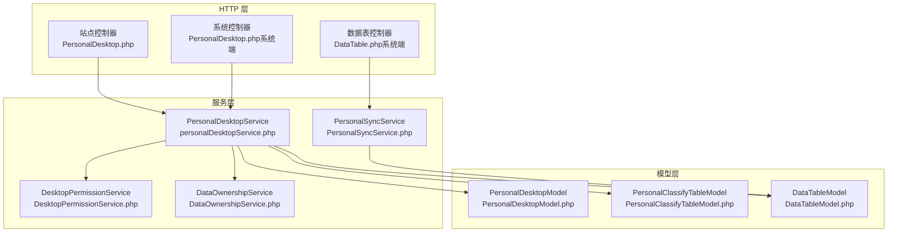
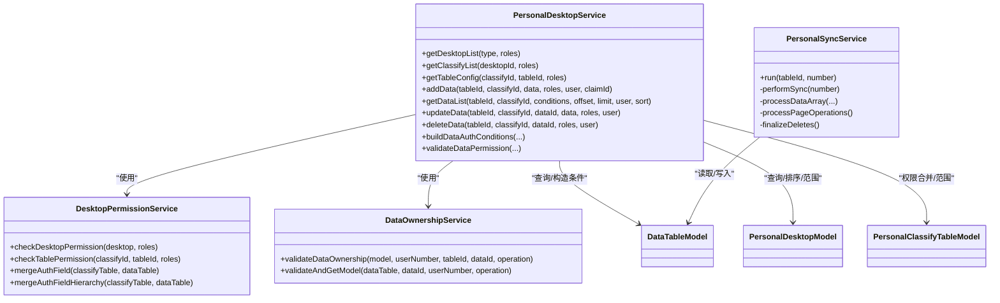
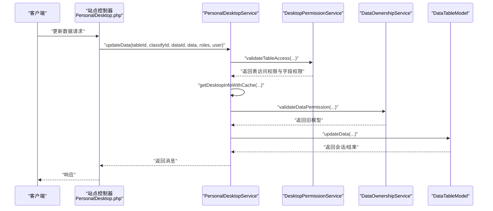
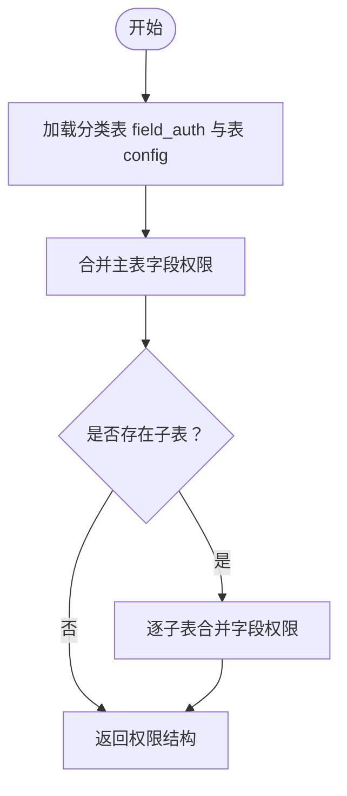
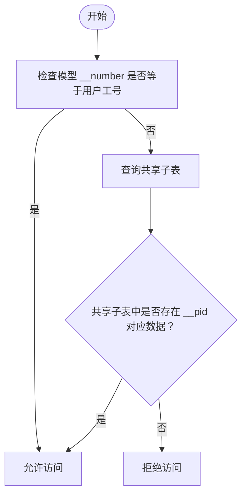
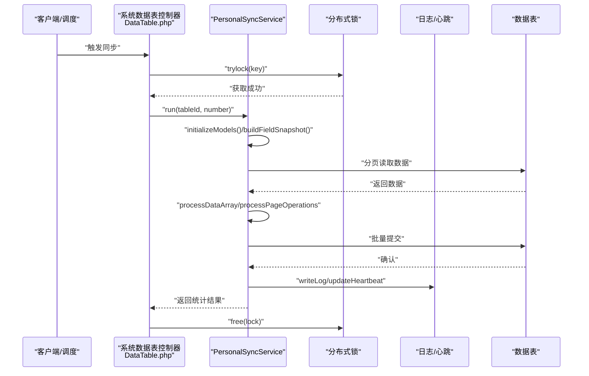
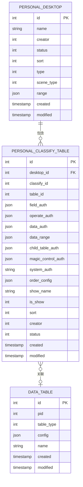
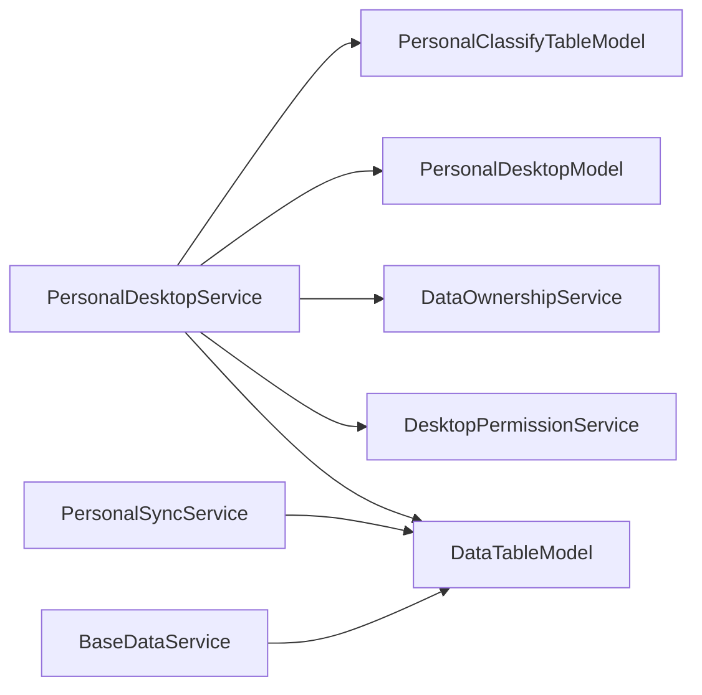

# 个人桌面服务

<cite>
**本文档引用的文件**
- [PersonalDesktop.php](file://process/src/http/site/PersonalDesktop.php)
- [PersonalDesktop.php（系统端）](file://process/src/http/system/PersonalDesktop.php)
- [PersonalDesktopService.php](file://process/src/services/desktopManage/PersonalDesktopService.php)
- [PersonalSyncService.php](file://process/src/services/desktopManage/PersonalSyncService.php)
- [DesktopPermissionService.php](file://process/src/services/desktopManage/DesktopPermissionService.php)
- [DataOwnershipService.php](file://process/src/services/desktopManage/DataOwnershipService.php)
- [PersonalDesktopModel.php](file://process/src/models/PersonalDesktopModel.php)
- [PersonalClassifyTableModel.php](file://process/src/models/PersonalClassifyTableModel.php)
- [DataTableModel.php](file://process/src/models/DataTableModel.php)
- [BaseDataService.php](file://process/src/services/BaseDataService.php)
- [DataTable.php（系统端）](file://process/src/http/system/DataTable.php)
</cite>

## 目录
1. [简介](#简介)
2. [项目结构](#项目结构)
3. [核心组件](#核心组件)
4. [架构总览](#架构总览)
5. [详细组件分析](#详细组件分析)
6. [依赖关系分析](#依赖关系分析)
7. [性能考量](#性能考量)
8. [故障排查指南](#故障排查指南)
9. [结论](#结论)
10. [附录](#附录)

## 简介
本文件面向个人桌面服务的使用者与开发者，系统化阐述个人桌面的个性化配置、数据所有权管理与同步机制。重点覆盖以下方面：
- 个人桌面的个性化配置与权限继承
- 数据所有权验证与数据隔离策略
- 实时同步与单人同步算法、冲突处理与一致性保障
- 数据模型设计与字段权限合并机制
- 配置接口与扩展开发建议

## 项目结构
个人桌面服务由“HTTP 控制器层 + 服务编排层 + 权限与数据服务层 + 模型层”构成，围绕 PersonalDesktopService 作为统一入口，协调 DesktopPermissionService、DataOwnershipService、DataProcessService、DataFormatterService 等服务完成权限校验、数据处理与格式化。

图表来源
- [PersonalDesktop.php](file://process/src/http/site/PersonalDesktop.php#L1-L120)
- [PersonalDesktop.php（系统端）](file://process/src/http/system/PersonalDesktop.php#L1-L120)
- [PersonalDesktopService.php](file://process/src/services/desktopManage/PersonalDesktopService.php#L1-L120)
- [DesktopPermissionService.php](file://process/src/services/desktopManage/DesktopPermissionService.php#L1-L120)
- [DataOwnershipService.php](file://process/src/services/desktopManage/DataOwnershipService.php#L1-L60)
- [PersonalDesktopModel.php](file://process/src/models/PersonalDesktopModel.php#L1-L60)
- [PersonalClassifyTableModel.php](file://process/src/models/PersonalClassifyTableModel.php#L1-L80)
- [DataTableModel.php](file://process/src/models/DataTableModel.php#L1-L60)

章节来源
- [PersonalDesktop.php](file://process/src/http/site/PersonalDesktop.php#L1-L120)
- [PersonalDesktop.php（系统端）](file://process/src/http/system/PersonalDesktop.php#L1-L120)
- [PersonalDesktopService.php](file://process/src/services/desktopManage/PersonalDesktopService.php#L1-L120)

## 核心组件
- PersonalDesktopService：个人桌面统一入口，负责权限校验、数据列表查询、增删改、数据权限条件构建、字段权限合并、数据所有权验证等。
- DesktopPermissionService：桌面/分类/表权限校验与字段权限合并，支持层级化字段权限结构。
- DataOwnershipService：个人桌面数据所有权验证，支持通过共享子表继承访问权限。
- PersonalSyncService：单人同步主流程，支持远程/本地数据源、分页、父子表同步、批量提交、心跳与日志。
- 模型层：PersonalDesktopModel、PersonalClassifyTableModel、DataTableModel 提供数据结构与权限配置载体。

章节来源
- [PersonalDesktopService.php](file://process/src/services/desktopManage/PersonalDesktopService.php#L1-L120)
- [DesktopPermissionService.php](file://process/src/services/desktopManage/DesktopPermissionService.php#L1-L120)
- [DataOwnershipService.php](file://process/src/services/desktopManage/DataOwnershipService.php#L1-L60)
- [PersonalDesktopModel.php](file://process/src/models/PersonalDesktopModel.php#L1-L60)
- [PersonalClassifyTableModel.php](file://process/src/models/PersonalClassifyTableModel.php#L1-L80)
- [DataTableModel.php](file://process/src/models/DataTableModel.php#L1-L60)

## 架构总览
个人桌面服务采用“控制器-服务-模型”的分层架构，通过 PersonalDesktopService 统一编排权限与数据处理，结合 DesktopPermissionService 的权限合并与 DataOwnershipService 的所有权验证，确保个人桌面的数据隔离与权限继承。

图表来源
- [PersonalDesktopService.php](file://process/src/services/desktopManage/PersonalDesktopService.php#L1-L200)
- [DesktopPermissionService.php](file://process/src/services/desktopManage/DesktopPermissionService.php#L1-L200)
- [DataOwnershipService.php](file://process/src/services/desktopManage/DataOwnershipService.php#L1-L106)
- [PersonalSyncService.php](file://process/src/services/desktopManage/PersonalSyncService.php#L1-L120)
- [PersonalDesktopModel.php](file://process/src/models/PersonalDesktopModel.php#L1-L89)
- [PersonalClassifyTableModel.php](file://process/src/models/PersonalClassifyTableModel.php#L1-L120)
- [DataTableModel.php](file://process/src/models/DataTableModel.php#L1-L60)

## 详细组件分析

### PersonalDesktopService 功能与实现
- 权限入口与配置获取
  - getDesktopList/getClassifyList/getTableConfig：基于 DesktopPermissionService 与 PersonalClassifyTableModel 合并权限，返回桌面/分类/表配置。
- 数据读写与权限控制
  - addData/updateData/deleteData：先通过 DesktopPermissionService 校验表访问权限，再调用 DataProcessService 完成实际写入；个人桌面通过 DataOwnershipService 验证数据所有权，管理桌面通过 data_auth 范围控制。
  - getDataList：构建查询条件，优先使用分类排序配置，其次使用表自身 search_config->sort，兜底 id desc；同时通过 buildDataAuthConditions 构建数据权限条件，支持 __number 子查询与共享子表继承。
- 数据权限条件构建
  - buildDataAuthConditions/buildPersonalDesktopConditions：个人桌面按 __number 限制，支持 data_range 与共享子表继承；管理桌面按 data_auth 范围限制。
  - processSpecialConditions/buildNumberFieldConditions：支持 __department/__number/__name 特殊字段合并与子查询，兼容共享子表场景。
- 数据所有权验证
  - validateDataPermission：个人桌面通过 DataOwnershipService.validateAndGetModel 校验；管理桌面通过 data_auth 范围校验。

图表来源
- [PersonalDesktop.php](file://process/src/http/site/PersonalDesktop.php#L480-L560)
- [PersonalDesktopService.php](file://process/src/services/desktopManage/PersonalDesktopService.php#L500-L721)
- [DesktopPermissionService.php](file://process/src/services/desktopManage/DesktopPermissionService.php#L1-L120)
- [DataOwnershipService.php](file://process/src/services/desktopManage/DataOwnershipService.php#L60-L106)
- [DataTableModel.php](file://process/src/models/DataTableModel.php#L1-L60)

章节来源
- [PersonalDesktopService.php](file://process/src/services/desktopManage/PersonalDesktopService.php#L110-L721)
- [PersonalDesktop.php](file://process/src/http/site/PersonalDesktop.php#L480-L560)

### DesktopPermissionService 权限合并机制
- 桌面/表权限校验：checkDesktopPermission/checkTablePermission 基于桌面 uid_range 与用户角色取交集判断。
- 字段权限合并：mergeAuthField/mergeAuthFieldHierarchy 将表字段默认权限与分类表 field_auth 合并，支持子表层级结构；决定字段最终权限时遵循“表字段隐藏优先、表字段只读优先、分类配置覆盖可写”的规则。
- 子表权限：getSubTableAuthHierarchy 逐子表合并字段权限，形成 children 结构。

图表来源
- [DesktopPermissionService.php](file://process/src/services/desktopManage/DesktopPermissionService.php#L90-L200)
- [DesktopPermissionService.php](file://process/src/services/desktopManage/DesktopPermissionService.php#L298-L400)

章节来源
- [DesktopPermissionService.php](file://process/src/services/desktopManage/DesktopPermissionService.php#L1-L200)
- [DesktopPermissionService.php](file://process/src/services/desktopManage/DesktopPermissionService.php#L298-L400)

### DataOwnershipService 数据所有权验证
- 个人桌面数据所有权：若模型 __number 与用户工号一致即通过；否则检查是否存在共享子表，通过共享子表中 __pid 与数据主键的关联判断继承访问权限。
- validateAndGetModel：对共享表追加 __number 隔离条件；对普通表进一步调用 validateDataOwnership 校验。

图表来源
- [DataOwnershipService.php](file://process/src/services/desktopManage/DataOwnershipService.php#L1-L106)

章节来源
- [DataOwnershipService.php](file://process/src/services/desktopManage/DataOwnershipService.php#L1-L106)

### PersonalSyncService 同步机制与冲突处理
- 主入口 run：按发布的一次性同步规则逐条执行，使用分布式锁隔离不同规则；初始化日志、心跳、持久化标记与字段快照。
- performSync：校验主表唯一键映射，选择远程或本地数据源，分页读取与格式化，先主表后子表，批量提交，最后统一删除处理。
- 字段快照与核对：buildFieldSnapshot 支持“同步字段”与“核对字段”，hasCheckData 标记是否启用核对；addedMainSyncFields/addedChildSyncFields 识别新增字段直接更新。
- 日志与监控：safeWriteLog/sanitizeForJson 输出结构化日志，Redis 保留最近若干条；updateHeartbeat 心跳维持，异常捕获与错误聚合。
- 冲突与一致性：通过唯一键映射与字段快照核对，新增字段直接更新，其余字段按“变更核对+差异更新”策略减少冲突；批量提交与事务封装保证原子性。

图表来源
- [PersonalSyncService.php](file://process/src/services/desktopManage/PersonalSyncService.php#L90-L226)
- [PersonalSyncService.php](file://process/src/services/desktopManage/PersonalSyncService.php#L399-L484)
- [PersonalSyncService.php](file://process/src/services/desktopManage/PersonalSyncService.php#L565-L600)
- [DataTable.php（系统端）](file://process/src/http/system/DataTable.php#L1648-L1687)

章节来源
- [PersonalSyncService.php](file://process/src/services/desktopManage/PersonalSyncService.php#L90-L226)
- [PersonalSyncService.php](file://process/src/services/desktopManage/PersonalSyncService.php#L399-L484)
- [PersonalSyncService.php](file://process/src/services/desktopManage/PersonalSyncService.php#L565-L600)
- [DataTable.php（系统端）](file://process/src/http/system/DataTable.php#L1648-L1687)

### 数据模型设计与字段权限
- PersonalDesktopModel：桌面实体，包含名称、类型（个人/管理）、场景类型、排序、范围配置等。
- PersonalClassifyTableModel：桌面-分类-表关联，承载字段权限、操作权限、数据权限、数据范围、排序配置、子表总权限等。
- DataTableModel：数据表配置与字段元信息，提供字段权限合并、唯一键、表类型（普通/个人/微应用/共享/明细）等能力。

图表来源
- [PersonalDesktopModel.php](file://process/src/models/PersonalDesktopModel.php#L1-L89)
- [PersonalClassifyTableModel.php](file://process/src/models/PersonalClassifyTableModel.php#L1-L120)
- [DataTableModel.php](file://process/src/models/DataTableModel.php#L1-L60)

章节来源
- [PersonalDesktopModel.php](file://process/src/models/PersonalDesktopModel.php#L1-L89)
- [PersonalClassifyTableModel.php](file://process/src/models/PersonalClassifyTableModel.php#L1-L120)
- [DataTableModel.php](file://process/src/models/DataTableModel.php#L1-L60)

### 配置接口与扩展开发
- 站点端接口（用户侧）
  - 列表/分类/表配置：list/classifyList/tableConfig
  - 数据增删改：addData/updateData/deleteData
  - 数据列表：dataList（支持条件过滤与排序）
  - 同步触发：sync（单人同步）
- 系统端接口（管理侧）
  - 桌面 CRUD：create/update/delete/list
  - 桌面排序：sort
  - 分类列表：classifyList
- 扩展建议
  - 自定义字段权限：在 PersonalClassifyTableModel.field_auth 中按表 ID 与字段名配置 permit/required。
  - 自定义数据范围：管理桌面通过 data_auth.range 与 depart_key 等实现部门/子部门范围控制。
  - 自定义排序：分类表 order_config 或表 search_config.sort 优先级高于兜底排序。
  - 自定义同步：通过 DataTableSyncModel.config 配置 dictionary/data_sync/is_sync_change_no_check 等字段快照与核对策略。

章节来源
- [PersonalDesktop.php](file://process/src/http/site/PersonalDesktop.php#L276-L560)
- [PersonalDesktop.php（系统端）](file://process/src/http/system/PersonalDesktop.php#L60-L200)
- [DataTable.php（系统端）](file://process/src/http/system/DataTable.php#L1648-L1687)

## 依赖关系分析
- PersonalDesktopService 依赖 DesktopPermissionService 与 DataOwnershipService 完成权限与所有权校验；依赖 DataTableModel/PersonalDesktopModel/PersonalClassifyTableModel 构建查询与权限条件。
- PersonalSyncService 依赖 DataTableModel 读取/写入数据，依赖 Redis/分布式锁进行并发控制与心跳维护。
- BaseDataService 提供数据权限配置格式化工具，支持 depart_key 等范围控制。

图表来源
- [PersonalDesktopService.php](file://process/src/services/desktopManage/PersonalDesktopService.php#L1-L120)
- [DesktopPermissionService.php](file://process/src/services/desktopManage/DesktopPermissionService.php#L1-L120)
- [DataOwnershipService.php](file://process/src/services/desktopManage/DataOwnershipService.php#L1-L60)
- [PersonalSyncService.php](file://process/src/services/desktopManage/PersonalSyncService.php#L1-L120)
- [BaseDataService.php](file://process/src/services/BaseDataService.php#L1-L39)

章节来源
- [PersonalDesktopService.php](file://process/src/services/desktopManage/PersonalDesktopService.php#L1-L120)
- [DesktopPermissionService.php](file://process/src/services/desktopManage/DesktopPermissionService.php#L1-L120)
- [DataOwnershipService.php](file://process/src/services/desktopManage/DataOwnershipService.php#L1-L60)
- [PersonalSyncService.php](file://process/src/services/desktopManage/PersonalSyncService.php#L1-L120)
- [BaseDataService.php](file://process/src/services/BaseDataService.php#L1-L39)

## 性能考量
- 查询性能
  - getDataList 对排序优先级与条件构建做了多层优化，避免全表扫描；建议合理设置索引与分页大小。
  - buildDataAuthConditions 与 buildNumberFieldConditions 通过子查询与共享子表关联，注意在大数据量场景下对 __number 与 __pid 字段建立索引。
- 同步性能
  - PersonalSyncService 采用分页读取与批量提交，减少内存峰值；建议根据数据量调整分页大小与重试策略。
  - 日志与心跳写入 Redis，注意日志轮转与 Redis 列表长度控制，避免内存膨胀。
- 并发控制
  - 使用分布式锁隔离 add/update/delete/sort/sync 等关键操作，避免竞态；建议锁粒度与超时时间结合业务压力评估。

## 故障排查指南
- 权限相关
  - “无权限访问该表/桌面”：检查桌面 uid_range 与用户角色交集；确认分类表关联是否存在。
  - “没有权限操作此数据/记录不存在或无权限”：管理桌面需满足 data_auth 范围；个人桌面需满足数据所有权或共享子表继承。
- 同步相关
  - “同步任务进行中，请稍后重试”：检查分布式锁是否释放；查看 Redis 心跳键是否存在。
  - “读取数据不是数组/数据集不存在”：确认同步规则配置与数据源可用性。
  - “主表唯一键配置不完整”：检查 dictionary/unique keys 映射是否完整。
- 查询相关
  - “查询条件包含不安全字符或关键字”：客户端输入需符合字段名与值规范；服务端已做严格过滤。
- 日志定位
  - 查看同步日志文件与 Redis 最近日志列表，定位 stage 与错误上下文。

章节来源
- [PersonalDesktop.php](file://process/src/http/site/PersonalDesktop.php#L55-L86)
- [PersonalDesktopService.php](file://process/src/services/desktopManage/PersonalDesktopService.php#L670-L721)
- [PersonalSyncService.php](file://process/src/services/desktopManage/PersonalSyncService.php#L120-L226)
- [PersonalSyncService.php](file://process/src/services/desktopManage/PersonalSyncService.php#L565-L600)

## 结论
个人桌面服务通过“统一入口 + 权限合并 + 所有权验证 + 同步引擎”的架构，实现了：
- 个性化配置与权限继承：分类表与表字段权限可按角色与表维度灵活配置；
- 数据所有权与隔离：个人桌面以 __number 为核心隔离，支持共享子表继承；
- 实时同步与一致性：分页读取、字段快照核对、批量提交与心跳监控，降低冲突概率；
- 可扩展性：通过模型与服务层清晰分离，便于接入新数据源与自定义权限策略。

## 附录
- 关键流程图与序列图见前述章节，对应文件路径与行号已在各图下方标注，便于进一步阅读源码实现细节。