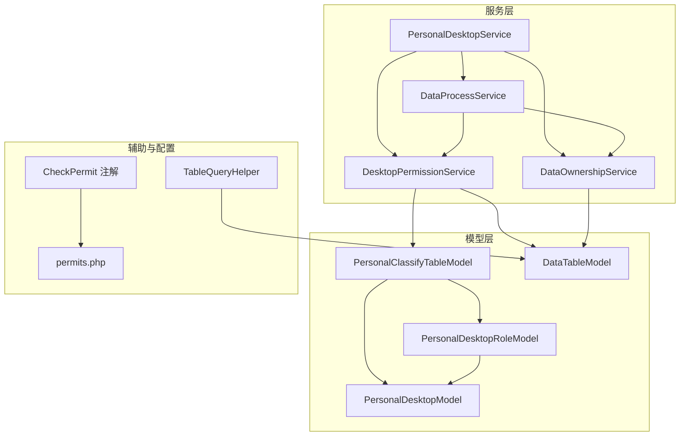
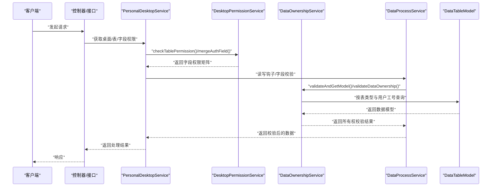
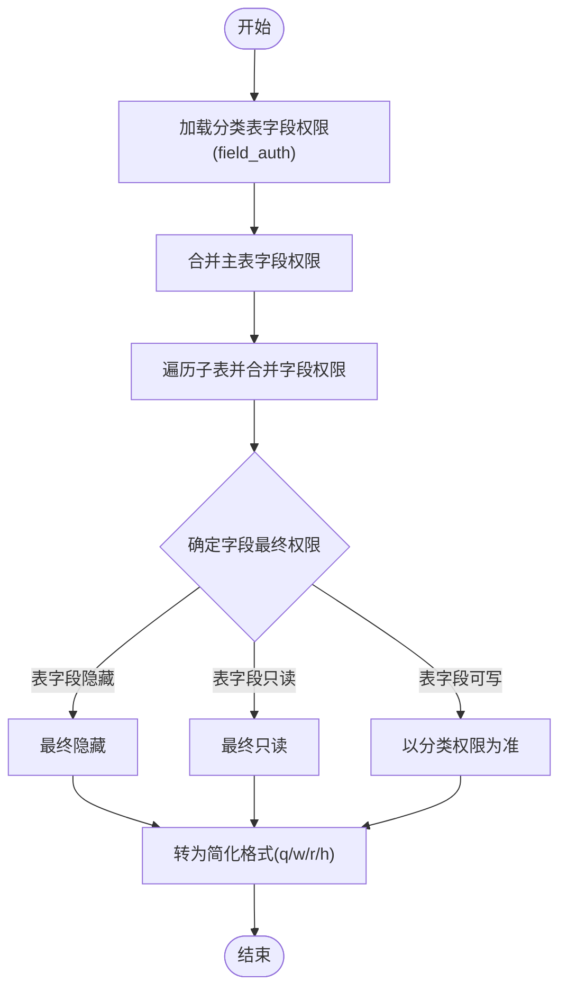
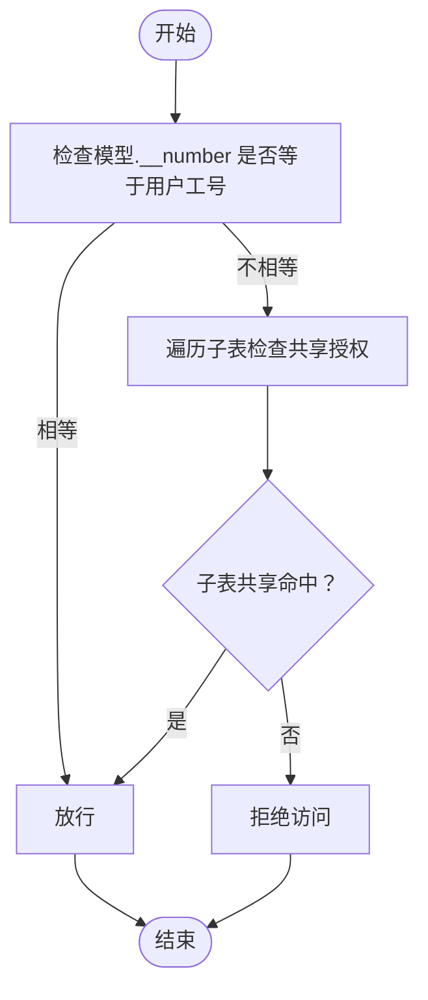
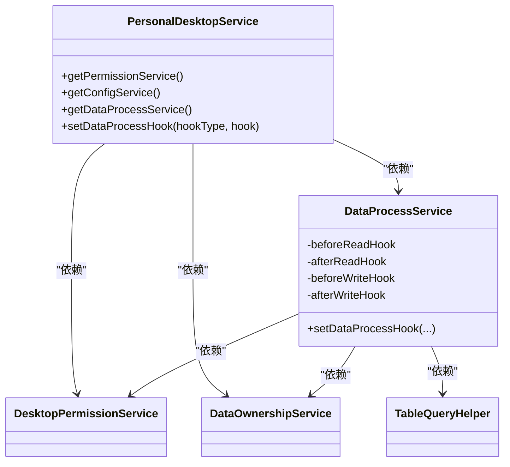
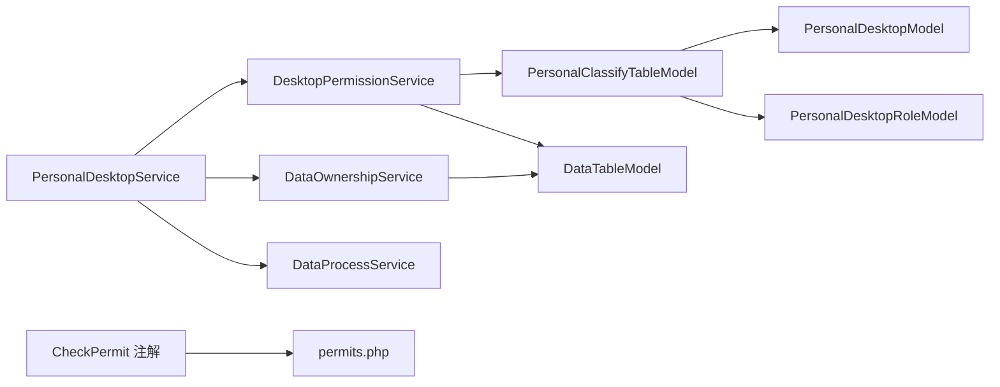

# 数据权限服务

<cite>
**本文档引用的文件**
- [DesktopPermissionService.php](file://process/src/services/desktopManage/DesktopPermissionService.php)
- [DataOwnershipService.php](file://process/src/services/desktopManage/DataOwnershipService.php)
- [PersonalDesktopService.php](file://process/src/services/desktopManage/PersonalDesktopService.php)
- [DataProcessService.php](file://process/src/services/desktopManage/DataProcessService.php)
- [PersonalDesktopModel.php](file://process/src/models/PersonalDesktopModel.php)
- [PersonalClassifyTableModel.php](file://process/src/models/PersonalClassifyTableModel.php)
- [DataTableModel.php](file://process/src/models/DataTableModel.php)
- [PersonalDesktopRoleModel.php](file://process/src/models/PersonalDesktopRoleModel.php)
- [TableQueryHelper.php](file://process/src/services/desktopManage/helpers/TableQueryHelper.php)
- [CheckPermit.php](file://process/src/annotations/CheckPermit.php)
- [permits.php](file://process/src/config/permits.php)
</cite>

## 目录
1. [简介](#简介)
2. [项目结构](#项目结构)
3. [核心组件](#核心组件)
4. [架构总览](#架构总览)
5. [详细组件分析](#详细组件分析)
6. [依赖关系分析](#依赖关系分析)
7. [性能考虑](#性能考虑)
8. [故障排查指南](#故障排查指南)
9. [结论](#结论)
10. [附录](#附录)

## 简介
本文件面向“桌面数据权限服务”，系统性梳理桌面级权限控制、字段级权限过滤与数据所有权管理机制。重点覆盖以下方面：
- DesktopPermissionService 的权限矩阵设计、字段级权限合并与过滤策略
- DataOwnershipService 的数据所有权验证与共享子表授权机制
- 权限继承规则（基于角色与分类表配置）、动态权限验证流程
- 接口设计与调用链路、权限缓存与性能优化策略
- 安全最佳实践与审计日志建议方案

## 项目结构
围绕桌面数据权限的核心模块分布如下：
- 服务层
  - DesktopPermissionService：桌面/表/字段权限校验与合并
  - DataOwnershipService：数据所有权与共享授权验证
  - PersonalDesktopService：聚合入口，协调权限与数据处理
  - DataProcessService：数据读写钩子与权限前置校验
- 模型层
  - PersonalDesktopModel：桌面元数据与范围(uid_range)
  - PersonalClassifyTableModel：分类-表关联及权限配置(field_auth、data_auth等)
  - DataTableModel：数据表结构、内置字段与类型
  - PersonalDesktopRoleModel：角色与角色权限配置(auth_config、users)
- 辅助与配置
  - TableQueryHelper：子表查询与字段过滤辅助
  - CheckPermit 注解：菜单级权限拦截
  - permits.php：菜单/接口权限映射

图表来源
- [PersonalDesktopService.php](file://process/src/services/desktopManage/PersonalDesktopService.php#L1-L120)
- [DataProcessService.php](file://process/src/services/desktopManage/DataProcessService.php#L1-L120)
- [DesktopPermissionService.php](file://process/src/services/desktopManage/DesktopPermissionService.php#L1-L120)
- [DataOwnershipService.php](file://process/src/services/desktopManage/DataOwnershipService.php#L1-L80)
- [PersonalDesktopModel.php](file://process/src/models/PersonalDesktopModel.php#L1-L89)
- [PersonalClassifyTableModel.php](file://process/src/models/PersonalClassifyTableModel.php#L1-L120)
- [DataTableModel.php](file://process/src/models/DataTableModel.php#L1-L120)
- [PersonalDesktopRoleModel.php](file://process/src/models/PersonalDesktopRoleModel.php#L1-L104)
- [TableQueryHelper.php](file://process/src/services/desktopManage/helpers/TableQueryHelper.php#L1-L120)
- [CheckPermit.php](file://process/src/annotations/CheckPermit.php#L1-L27)
- [permits.php](file://process/src/config/permits.php#L1-L120)

章节来源
- [PersonalDesktopService.php](file://process/src/services/desktopManage/PersonalDesktopService.php#L1-L120)
- [DataProcessService.php](file://process/src/services/desktopManage/DataProcessService.php#L1-L120)
- [DesktopPermissionService.php](file://process/src/services/desktopManage/DesktopPermissionService.php#L1-L120)
- [DataOwnershipService.php](file://process/src/services/desktopManage/DataOwnershipService.php#L1-L80)
- [PersonalDesktopModel.php](file://process/src/models/PersonalDesktopModel.php#L1-L89)
- [PersonalClassifyTableModel.php](file://process/src/models/PersonalClassifyTableModel.php#L1-L120)
- [DataTableModel.php](file://process/src/models/DataTableModel.php#L1-L120)
- [PersonalDesktopRoleModel.php](file://process/src/models/PersonalDesktopRoleModel.php#L1-L104)
- [TableQueryHelper.php](file://process/src/services/desktopManage/helpers/TableQueryHelper.php#L1-L120)
- [CheckPermit.php](file://process/src/annotations/CheckPermit.php#L1-L27)
- [permits.php](file://process/src/config/permits.php#L1-L120)

## 核心组件
- DesktopPermissionService
  - 负责桌面级权限校验、表级权限校验、字段级权限合并与过滤
  - 提供层级与平铺两种字段权限结构输出，支持必填与隐藏字段处理
- DataOwnershipService
  - 基于数据模型内置字段进行所有权判定
  - 支持共享子表的“通过子表共享获得权限”的授权路径
- PersonalDesktopService
  - 作为聚合入口，组合权限、配置、数据处理与所有权服务
- DataProcessService
  - 提供数据读写钩子，结合权限与所有权服务进行前置校验
- 模型与角色
  - PersonalDesktopModel：桌面范围(uid_range)与状态
  - PersonalClassifyTableModel：分类-表关联与权限配置(field_auth、data_auth、operate_auth)
  - PersonalDesktopRoleModel：角色与角色权限配置(auth_config、users)
  - DataTableModel：数据表结构、内置字段与类型

章节来源
- [DesktopPermissionService.php](file://process/src/services/desktopManage/DesktopPermissionService.php#L1-L120)
- [DataOwnershipService.php](file://process/src/services/desktopManage/DataOwnershipService.php#L1-L80)
- [PersonalDesktopService.php](file://process/src/services/desktopManage/PersonalDesktopService.php#L1-L120)
- [DataProcessService.php](file://process/src/services/desktopManage/DataProcessService.php#L1-L120)
- [PersonalDesktopModel.php](file://process/src/models/PersonalDesktopModel.php#L1-L89)
- [PersonalClassifyTableModel.php](file://process/src/models/PersonalClassifyTableModel.php#L1-L120)
- [DataTableModel.php](file://process/src/models/DataTableModel.php#L1-L120)
- [PersonalDesktopRoleModel.php](file://process/src/models/PersonalDesktopRoleModel.php#L1-L104)

## 架构总览
桌面数据权限服务的整体调用链如下：
- 控制器/接口层通过注解或路由层进行菜单级权限拦截
- 业务服务层（PersonalDesktopService）协调 DesktopPermissionService 与 DataOwnershipService
- DataProcessService 在读写前执行字段权限校验与必填验证
- 模型层提供数据表结构、角色与桌面范围等基础数据

图表来源
- [PersonalDesktopService.php](file://process/src/services/desktopManage/PersonalDesktopService.php#L1-L120)
- [DesktopPermissionService.php](file://process/src/services/desktopManage/DesktopPermissionService.php#L1-L120)
- [DataOwnershipService.php](file://process/src/services/desktopManage/DataOwnershipService.php#L1-L80)
- [DataProcessService.php](file://process/src/services/desktopManage/DataProcessService.php#L1-L120)
- [DataTableModel.php](file://process/src/models/DataTableModel.php#L1-L120)

## 详细组件分析

### DesktopPermissionService 权限矩阵与字段过滤
- 权限矩阵设计
  - 桌面级：通过 PersonalDesktopModel 的 uid_range 与角色集合(users)进行交集判断
  - 表级：检查分类与桌面状态，再通过 PersonalClassifyTableModel 的 field_auth 与 operate_auth 进行合并
  - 字段级：支持两种输出格式（按表ID分组与层级结构），并兼容表字段默认配置
- 字段级权限控制
  - 合并策略：表字段默认权限优先级高于分类字段；若表字段为隐藏，则最终隐藏；若表字段为只读，则分类字段不可提升为可写
  - 必填字段强制策略：表字段若为必填，则字段最终必填且可写
  - 简化格式：将权限对象转换为字符(q/w/r/h)，便于前端快速渲染
- 动态权限验证
  - 读取过滤：filterHiddenFields 根据权限矩阵隐藏不可读字段
  - 写入校验：validateAndFilterFields 仅保留可写字段，并在需要时校验必填

图表来源
- [DesktopPermissionService.php](file://process/src/services/desktopManage/DesktopPermissionService.php#L90-L220)

章节来源
- [DesktopPermissionService.php](file://process/src/services/desktopManage/DesktopPermissionService.php#L1-L220)

### DataOwnershipService 数据所有权与共享授权
- 数据所有权判定
  - 若数据模型内置字段 __number 与当前用户工号一致，则直接放行
  - 对于非共享表，进一步检查是否通过子表共享获得权限
- 共享授权路径
  - 遍历子表，若子表为共享类型，则以用户工号与父记录ID为条件查询，若命中则认为拥有权限
- 模型获取与二次校验
  - 对共享表追加用户隔离条件，非共享表额外调用 validateDataOwnership 进行所有权校验
  - 记录不存在或无权限时抛出异常

图表来源
- [DataOwnershipService.php](file://process/src/services/desktopManage/DataOwnershipService.php#L1-L106)

章节来源
- [DataOwnershipService.php](file://process/src/services/desktopManage/DataOwnershipService.php#L1-L106)

### PersonalDesktopService 与 DataProcessService 的集成
- PersonalDesktopService
  - 组合 DesktopPermissionService、DataOwnershipService、DesktopConfigService、DataProcessService
  - 作为统一入口协调权限与数据处理
- DataProcessService
  - 提供 before/after 读写钩子，结合 DesktopPermissionService 与 DataOwnershipService 实施动态权限验证
  - 通过 TableQueryHelper 统一处理子表查询与字段过滤

图表来源
- [PersonalDesktopService.php](file://process/src/services/desktopManage/PersonalDesktopService.php#L1-L120)
- [DataProcessService.php](file://process/src/services/desktopManage/DataProcessService.php#L1-L120)
- [TableQueryHelper.php](file://process/src/services/desktopManage/helpers/TableQueryHelper.php#L1-L120)

章节来源
- [PersonalDesktopService.php](file://process/src/services/desktopManage/PersonalDesktopService.php#L1-L120)
- [DataProcessService.php](file://process/src/services/desktopManage/DataProcessService.php#L1-L120)
- [TableQueryHelper.php](file://process/src/services/desktopManage/helpers/TableQueryHelper.php#L1-L120)

### 权限继承规则与数据访问策略
- 角色与桌面范围
  - PersonalDesktopRoleModel 将 auth_user 范围归一化为 users 数组，用于桌面级权限交集判断
- 分类-表关联与权限继承
  - PersonalClassifyTableModel 在新建时初始化 field_auth、operate_auth、data_auth 等配置
  - 通过 PersonalDesktopRoleModel.auth_config 对具体分类-表的权限进行覆盖与继承
- 数据访问策略
  - 桌面级：桌面状态正常且用户角色与 uid_range 交集非空
  - 表级：分类存在、桌面正常、分类-表关联存在且状态正常
  - 字段级：表字段默认权限与分类字段权限合并，遵循“表字段限制更严格”的原则
  - 数据级：共享表按用户隔离；非共享表需所有权校验

章节来源
- [PersonalDesktopRoleModel.php](file://process/src/models/PersonalDesktopRoleModel.php#L1-L104)
- [PersonalClassifyTableModel.php](file://process/src/models/PersonalClassifyTableModel.php#L1-L120)
- [PersonalDesktopModel.php](file://process/src/models/PersonalDesktopModel.php#L1-L89)
- [DesktopPermissionService.php](file://process/src/services/desktopManage/DesktopPermissionService.php#L1-L120)
- [DataOwnershipService.php](file://process/src/services/desktopManage/DataOwnershipService.php#L1-L80)

### 接口设计与权限缓存机制
- 接口层
  - CheckPermit 注解基于用户菜单权限进行拦截，配合 permits.php 的菜单/接口映射
- 权限缓存
  - PersonalDesktopRoleModel 在保存时归一化 auth_config，并将 auth_user 范围缓存到 users，减少运行时计算
  - PersonalDesktopModel 将 range 转换为 uid_range，便于快速交集判断
- 性能优化
  - 字段权限合并采用按表ID分组与层级两种输出，前端可按需选择，减少重复计算
  - DataProcessService 使用钩子在读写前一次性完成权限校验，避免多次数据库往返

章节来源
- [CheckPermit.php](file://process/src/annotations/CheckPermit.php#L1-L27)
- [permits.php](file://process/src/config/permits.php#L1-L120)
- [PersonalDesktopRoleModel.php](file://process/src/models/PersonalDesktopRoleModel.php#L1-L104)
- [PersonalDesktopModel.php](file://process/src/models/PersonalDesktopModel.php#L1-L89)
- [DesktopPermissionService.php](file://process/src/services/desktopManage/DesktopPermissionService.php#L1-L120)
- [DataProcessService.php](file://process/src/services/desktopManage/DataProcessService.php#L1-L120)

## 依赖关系分析
- 组件耦合
  - PersonalDesktopService 与 DataProcessService 通过 DesktopPermissionService 与 DataOwnershipService 解耦
  - DesktopPermissionService 依赖 PersonalClassifyTableModel 与 DataTableModel 的配置
  - DataOwnershipService 依赖 DataTableModel 的表类型与内置字段约定
- 外部依赖
  - 模型层依赖 ORM 与数据库 schema 定义
  - 注解与配置文件提供菜单级权限拦截与映射

图表来源
- [PersonalDesktopService.php](file://process/src/services/desktopManage/PersonalDesktopService.php#L1-L120)
- [DesktopPermissionService.php](file://process/src/services/desktopManage/DesktopPermissionService.php#L1-L120)
- [DataOwnershipService.php](file://process/src/services/desktopManage/DataOwnershipService.php#L1-L80)
- [PersonalClassifyTableModel.php](file://process/src/models/PersonalClassifyTableModel.php#L1-L120)
- [DataTableModel.php](file://process/src/models/DataTableModel.php#L1-L120)
- [PersonalDesktopModel.php](file://process/src/models/PersonalDesktopModel.php#L1-L89)
- [PersonalDesktopRoleModel.php](file://process/src/models/PersonalDesktopRoleModel.php#L1-L104)
- [CheckPermit.php](file://process/src/annotations/CheckPermit.php#L1-L27)
- [permits.php](file://process/src/config/permits.php#L1-L120)

章节来源
- [PersonalDesktopService.php](file://process/src/services/desktopManage/PersonalDesktopService.php#L1-L120)
- [DesktopPermissionService.php](file://process/src/services/desktopManage/DesktopPermissionService.php#L1-L120)
- [DataOwnershipService.php](file://process/src/services/desktopManage/DataOwnershipService.php#L1-L80)
- [PersonalClassifyTableModel.php](file://process/src/models/PersonalClassifyTableModel.php#L1-L120)
- [DataTableModel.php](file://process/src/models/DataTableModel.php#L1-L120)
- [PersonalDesktopModel.php](file://process/src/models/PersonalDesktopModel.php#L1-L89)
- [PersonalDesktopRoleModel.php](file://process/src/models/PersonalDesktopRoleModel.php#L1-L104)
- [CheckPermit.php](file://process/src/annotations/CheckPermit.php#L1-L27)
- [permits.php](file://process/src/config/permits.php#L1-L120)

## 性能考虑
- 字段权限合并
  - 采用按表ID分组的权限结构，避免重复遍历；必要时使用层级结构以减少前端渲染成本
- 查询与过滤
  - TableQueryHelper 批量查询子表，减少多次数据库往返
  - 读取过滤与写入校验在内存中完成，降低数据库压力
- 缓存与归一化
  - 角色权限配置在保存时归一化，运行时直接读取
  - 桌面范围(uid_range)与角色范围(users)在保存时归一化，运行时交集判断高效

[本节为通用性能讨论，无需列出章节来源]

## 故障排查指南
- 常见问题定位
  - 桌面/表权限异常：确认桌面状态、分类-表关联状态与角色权限配置
  - 字段权限不符合预期：检查表字段默认权限与分类字段权限的合并规则
  - 数据不存在或无权限：核对共享表隔离条件与所有权校验逻辑
- 异常抛出与提示
  - 未匹配到桌面中表格访问权限：通常由分类-表关联与角色权限配置不一致导致
  - 记录不存在或无权限：多发生在非共享表的修改/删除场景
- 建议排查步骤
  - 核对 permits.php 与 CheckPermit 注解的菜单权限映射
  - 核对 PersonalDesktopRoleModel.auth_config 是否完整归一化
  - 核对 PersonalClassifyTableModel.field_auth 的结构与字段名一致性

章节来源
- [PersonalClassifyTableModel.php](file://process/src/models/PersonalClassifyTableModel.php#L150-L220)
- [DataOwnershipService.php](file://process/src/services/desktopManage/DataOwnershipService.php#L70-L106)
- [permits.php](file://process/src/config/permits.php#L1-L120)
- [CheckPermit.php](file://process/src/annotations/CheckPermit.php#L1-L27)

## 结论
桌面数据权限服务通过“角色-桌面-分类-表-字段”五层权限矩阵，结合字段级合并与数据所有权校验，实现了灵活而可控的数据访问策略。服务层与模型层职责清晰，配合注解与配置实现菜单级与数据级双重安全防护。通过归一化与缓存机制，整体具备良好的扩展性与性能表现。

[本节为总结性内容，无需列出章节来源]

## 附录
- 安全最佳实践
  - 菜单级权限与数据级权限双保险：接口层使用注解拦截，业务层进行字段与数据级校验
  - 最小权限原则：字段权限尽量设为只读或隐藏，必要时才开放可写
  - 共享表隔离：共享表必须按用户工号隔离，避免越权访问
  - 审计日志：建议在关键节点（读取、写入、删除）记录操作人、目标表、字段变更与权限判定结果
- 审计日志实现建议
  - 日志字段建议包含：操作人、时间、IP、接口路径、表ID、数据ID、字段变更、权限判定结果、异常信息
  - 建议使用异步队列落库，避免阻塞主业务链路

[本节为通用建议，无需列出章节来源]