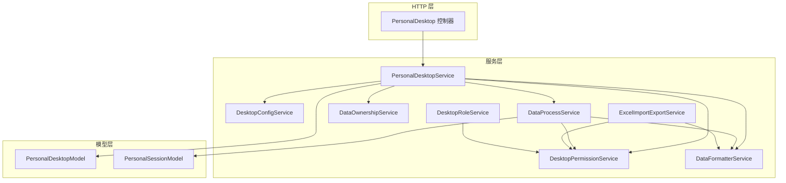
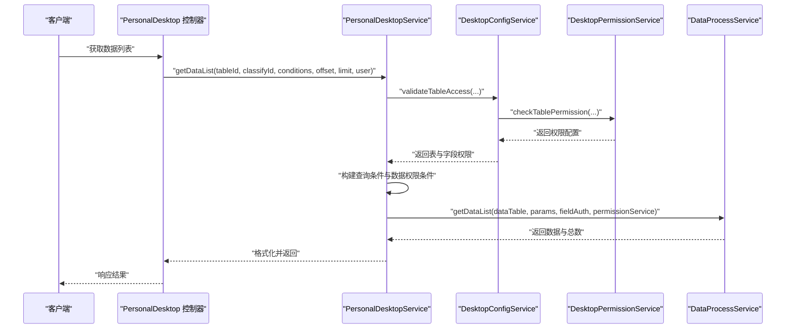
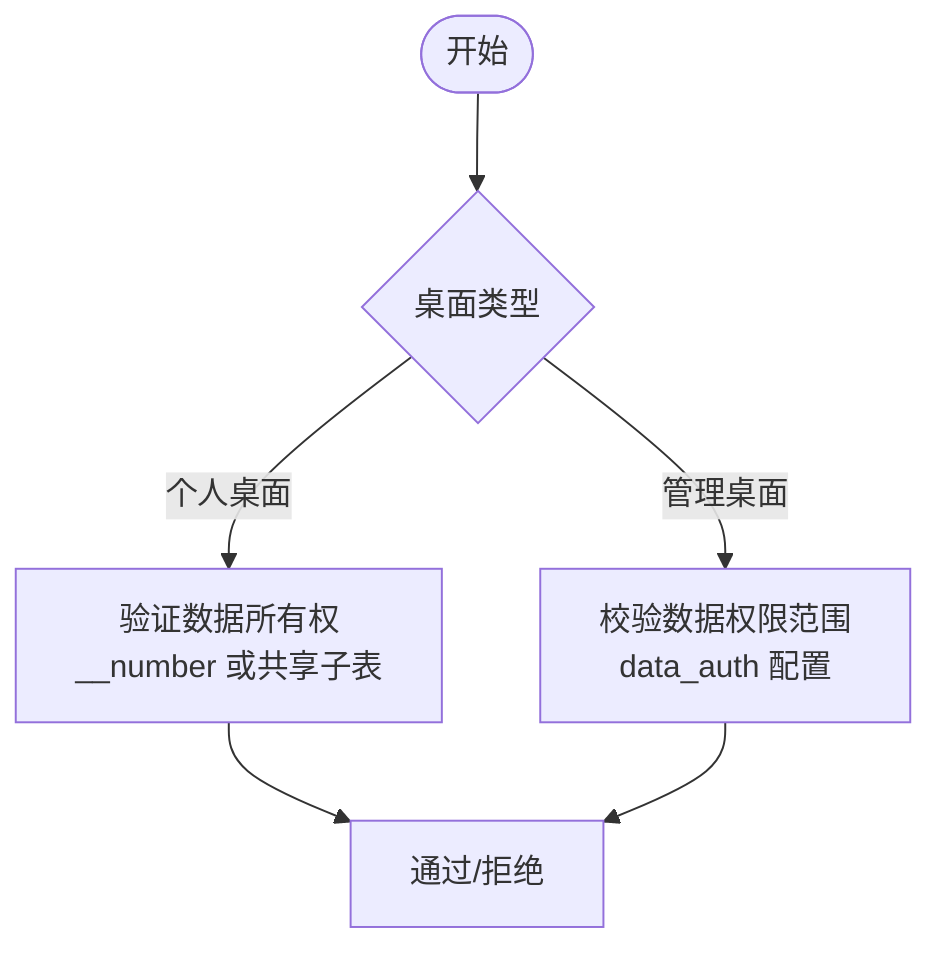
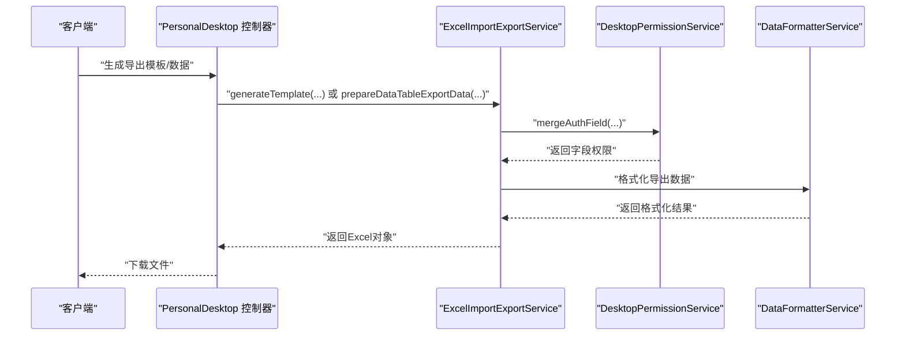
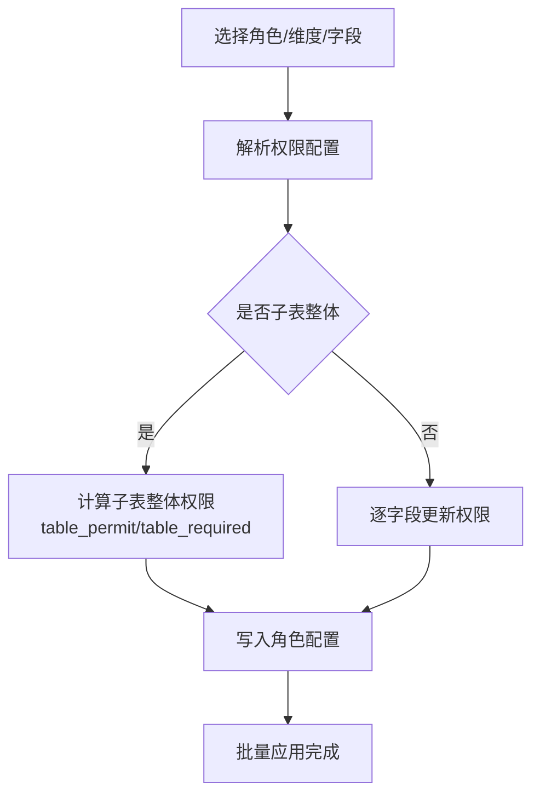
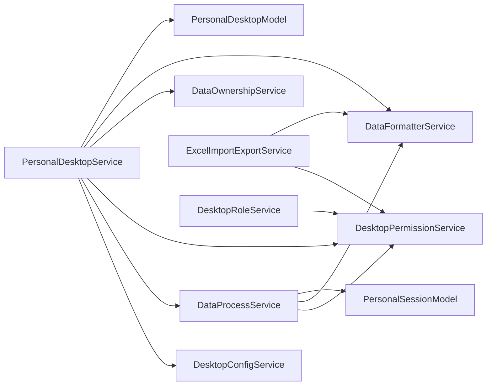

# 桌面管理服务

<cite>
**本文引用的文件**
- [PersonalDesktopService.php](file://process/src/services/desktopManage/PersonalDesktopService.php)
- [DesktopConfigService.php](file://process/src/services/desktopManage/DesktopConfigService.php)
- [DesktopPermissionService.php](file://process/src/services/desktopManage/DesktopPermissionService.php)
- [DataProcessService.php](file://process/src/services/desktopManage/DataProcessService.php)
- [DataOwnershipService.php](file://process/src/services/desktopManage/DataOwnershipService.php)
- [DataFormatterService.php](file://process/src/services/desktopManage/DataFormatterService.php)
- [ExcelImportExportService.php](file://process/src/services/desktopManage/ExcelImportExportService.php)
- [DesktopRoleService.php](file://process/src/services/desktopManage/DesktopRoleService.php)
- [PersonalDesktop.php](file://process/src/http/system/PersonalDesktop.php)
- [PersonalDesktopModel.php](file://process/src/models/PersonalDesktopModel.php)
- [PersonalSessionModel.php](file://process/src/models/PersonalSessionModel.php)
</cite>

## 目录
1. [简介](#简介)
2. [项目结构](#项目结构)
3. [核心组件](#核心组件)
4. [架构总览](#架构总览)
5. [详细组件分析](#详细组件分析)
6. [依赖分析](#依赖分析)
7. [性能考虑](#性能考虑)
8. [故障排查指南](#故障排查指南)
9. [结论](#结论)
10. [附录](#附录)

## 简介
本文件面向 htdNew 项目的“桌面管理服务”，系统化梳理桌面个性化配置、数据权限管理与批量操作机制。重点覆盖以下方面：
- 桌面配置管理：桌面/分类/维度（数据表）的展示与排序、字段权限与系统权限配置、数据范围与数据权限配置。
- 个人桌面服务：统一入口协调权限、配置、数据处理与格式化，提供数据增删改查、特殊条件处理与权限条件构建。
- 数据权限控制：基于桌面类型（个人/管理）与数据范围/数据权限配置，结合用户工号与子表共享机制进行数据所有权与访问控制。
- Excel 导入导出：模板生成、填写须知、字段映射与导出数据格式化，支持主表与子表结构。
- 批量操作：角色与权限的批量配置、批量字段权限更新、批量数据权限配置等。

## 项目结构
桌面管理服务位于 process/src/services/desktopManage 目录，围绕“服务层”组织，配合 http/system 控制器与 models 层模型协同工作。

图表来源
- [PersonalDesktop.php](file://process/src/http/system/PersonalDesktop.php#L1-L120)
- [PersonalDesktopService.php](file://process/src/services/desktopManage/PersonalDesktopService.php#L1-L120)
- [DesktopConfigService.php](file://process/src/services/desktopManage/DesktopConfigService.php#L1-L60)
- [DataProcessService.php](file://process/src/services/desktopManage/DataProcessService.php#L1-L120)
- [DesktopPermissionService.php](file://process/src/services/desktopManage/DesktopPermissionService.php#L1-L60)
- [DataOwnershipService.php](file://process/src/services/desktopManage/DataOwnershipService.php#L1-L40)
- [DataFormatterService.php](file://process/src/services/desktopManage/DataFormatterService.php#L1-L40)
- [ExcelImportExportService.php](file://process/src/services/desktopManage/ExcelImportExportService.php#L1-L60)
- [DesktopRoleService.php](file://process/src/services/desktopManage/DesktopRoleService.php#L1-L60)
- [PersonalDesktopModel.php](file://process/src/models/PersonalDesktopModel.php#L1-L60)
- [PersonalSessionModel.php](file://process/src/models/PersonalSessionModel.php#L365-L401)

章节来源
- [PersonalDesktop.php](file://process/src/http/system/PersonalDesktop.php#L1-L120)
- [PersonalDesktopService.php](file://process/src/services/desktopManage/PersonalDesktopService.php#L1-L120)

## 核心组件
- PersonalDesktopService：个人桌面统一入口，负责桌面/分类/表配置获取、数据增删改查、权限与数据范围条件构建、特殊条件处理与性能监控。
- DesktopConfigService：桌面配置与表配置的获取、字段权限合并、子表配置、表权限合并（层级格式）。
- DesktopPermissionService：桌面/表权限校验、字段权限合并（含层级）、隐藏字段过滤、字段必填校验与过滤。
- DataProcessService：数据 CRUD 与钩子、分页策略（偏移/游标）、子表批量查询与格式化、唯一性约束校验、__number 字段规范化。
- DataOwnershipService：个人桌面数据所有权验证，支持共享子表场景。
- DataFormatterService：列表与导出数据格式化、人员搜索字段解析、码表/选项映射、时间戳与标签格式化。
- ExcelImportExportService：Excel 模板生成、填写须知、导出数据准备与格式化、字段权限合并。
- DesktopRoleService：角色管理、批量字段权限配置、批量数据权限配置、批量系统权限配置、角色维度排序。
- 控制器 PersonalDesktop：系统端桌面管理接口，事务封装、分布式锁、角色与权限配置接口。

章节来源
- [PersonalDesktopService.php](file://process/src/services/desktopManage/PersonalDesktopService.php#L1-L120)
- [DesktopConfigService.php](file://process/src/services/desktopManage/DesktopConfigService.php#L1-L120)
- [DesktopPermissionService.php](file://process/src/services/desktopManage/DesktopPermissionService.php#L1-L120)
- [DataProcessService.php](file://process/src/services/desktopManage/DataProcessService.php#L1-L120)
- [DataOwnershipService.php](file://process/src/services/desktopManage/DataOwnershipService.php#L1-L60)
- [DataFormatterService.php](file://process/src/services/desktopManage/DataFormatterService.php#L1-L120)
- [ExcelImportExportService.php](file://process/src/services/desktopManage/ExcelImportExportService.php#L1-L120)
- [DesktopRoleService.php](file://process/src/services/desktopManage/DesktopRoleService.php#L1-L120)
- [PersonalDesktop.php](file://process/src/http/system/PersonalDesktop.php#L1-L120)

## 架构总览
桌面管理服务采用“控制器-服务-模型”的分层架构，服务层内部再细分为配置、权限、数据处理、格式化、Excel 导出与角色管理等子服务，职责清晰、耦合度低。

```mermaid
classDiagram
class PersonalDesktopService {
+getDesktopList(type, userRoles)
+getClassifyList(desktopId, userRoles)
+getTableConfig(classifyId, tableId, userRoles)
+getDataList(tableId, classifyId, conditions, offset, limit, user)
+addData(tableId, classifyId, data, userRoles, user, claimId)
+updateData(tableId, classifyId, dataId, data, userRoles, user)
+deleteData(tableId, classifyId, dataId, userRoles, user)
+buildDataAuthConditions(desktop, classifyTable, dataTable, user, processedConditions)
+validateDataPermission(dataTable, dataId, classifyId, userNumber, user, operation)
}
class DesktopConfigService {
+getDesktopList(type, userRoles, permissionService)
+getClassifyList(desktopId, userRoles, permissionService)
+getTableConfig(classifyId, tableId, userRoles, permissionService)
+validateTableAccess(classifyId, tableId, userRoles, permissionService)
+mergeAuthFieldHierarchy(classifyTable, dataTable)
}
class DesktopPermissionService {
+checkDesktopPermission(desktop, userRoles)
+checkTablePermission(classifyId, tableId, userRoles)
+mergeAuthField(classifyTable, dataTable)
+mergeAuthFieldHierarchy(classifyTable, dataTable)
+filterHiddenFields(data, fieldAuth, tableId)
+validateAndFilterFields(data, fieldAuth, table, validateRequired)
}
class DataProcessService {
+getDataList(dataTable, params, fieldAuth, permissionService)
+addData(dataTable, data, fieldAuth, permissionService, user, classifyId, claimId)
+updateData(dataTable, id, data, fieldAuth, permissionService, oldData, classifyId, user)
+deleteData(dataTable, dataId, model, classifyId, user)
+setBeforeReadHook(hook)
+setAfterReadHook(hook)
+setBeforeWriteHook(hook)
+setAfterWriteHook(hook)
}
class DataOwnershipService {
+validateAndGetModel(dataTable, dataId, userNumber, operation)
}
class DataFormatterService {
+formatDataList(data, dataTable)
+formatRecord(record, fields)
+formatDataListForExport(data, fields)
+formatRecordForExport(record, fields)
+formatPayloadForSave(dataTable, data)
}
class ExcelImportExportService {
+generateTemplate(tableId, classifyId, user, isExportTemplate)
+generateDataTableTemplate(tableId, user, excel, hiddenFields, forceNumberRequired)
+prepareDataTableExportData(tableId, fields, ids, whereConditions, user, classifyId)
+mergeAuthField(model, classifyId, user)
}
class DesktopRoleService {
+getRoleList(desktopId, offset, limit)
+saveRole(data, creator)
+deleteRole(id)
+sortRole(id, page, pageSize, currentPosition)
+configFieldAuthRole(roleId, classifyTableId, fieldAuth, systemAuth, childTableAuth, magicControlAuth)
+batchUpdateFieldAuthBySelections(tableId, items, permit, required)
+batchConfigDataAuth(desktopId, roles, tables, dataAuth, modifyModuleSign)
+batchConfigSystemAuth(desktopId, roles, tables, systemAuth)
+configOperateAuthRole(roleId, ids, operateAuth, all, desktopId, classifyId)
+configDataAuthRole(roleId, classifyTableId, dataAuth, modifyModuleSign)
+configTableIsshow(roleId, classifyTableId, isshow)
+sortClassifyTableRole(roleId, classifyTableId, page, pageSize, currentPosition)
}
PersonalDesktopService --> DesktopConfigService : "调用"
PersonalDesktopService --> DataProcessService : "调用"
PersonalDesktopService --> DesktopPermissionService : "调用"
PersonalDesktopService --> DataOwnershipService : "调用"
PersonalDesktopService --> DataFormatterService : "调用"
DataProcessService --> DesktopPermissionService : "调用"
DataProcessService --> DataFormatterService : "调用"
ExcelImportExportService --> DesktopPermissionService : "调用"
ExcelImportExportService --> DataFormatterService : "调用"
DesktopRoleService --> DesktopPermissionService : "调用"
```

图表来源
- [PersonalDesktopService.php](file://process/src/services/desktopManage/PersonalDesktopService.php#L1-L200)
- [DesktopConfigService.php](file://process/src/services/desktopManage/DesktopConfigService.php#L1-L200)
- [DesktopPermissionService.php](file://process/src/services/desktopManage/DesktopPermissionService.php#L1-L200)
- [DataProcessService.php](file://process/src/services/desktopManage/DataProcessService.php#L1-L200)
- [DataOwnershipService.php](file://process/src/services/desktopManage/DataOwnershipService.php#L1-L60)
- [DataFormatterService.php](file://process/src/services/desktopManage/DataFormatterService.php#L1-L120)
- [ExcelImportExportService.php](file://process/src/services/desktopManage/ExcelImportExportService.php#L1-L200)
- [DesktopRoleService.php](file://process/src/services/desktopManage/DesktopRoleService.php#L1-L200)

## 详细组件分析

### 个人桌面服务（PersonalDesktopService）
- 职责与流程
  - 统一入口：协调配置、权限、数据处理与格式化服务，提供桌面/分类/表配置获取与数据 CRUD。
  - 权限与范围：根据桌面类型（个人/管理）构建数据权限条件，支持数据范围与数据权限配置。
  - 特殊条件：支持 __department/__number/__name 的合并查询与子查询条件构建。
  - 性能监控：对数据列表接口进行性能监控与告警。
- 关键能力
  - 获取桌面/分类/表配置
  - 数据增删改查与会话处理
  - 数据权限条件构建与所有权验证
  - 特殊条件处理与子表条件构建
  - 钩子扩展（读取前后、写入前后）

图表来源
- [PersonalDesktop.php](file://process/src/http/system/PersonalDesktop.php#L1-L120)
- [PersonalDesktopService.php](file://process/src/services/desktopManage/PersonalDesktopService.php#L200-L350)
- [DesktopConfigService.php](file://process/src/services/desktopManage/DesktopConfigService.php#L350-L431)
- [DataProcessService.php](file://process/src/services/desktopManage/DataProcessService.php#L99-L198)

章节来源
- [PersonalDesktopService.php](file://process/src/services/desktopManage/PersonalDesktopService.php#L1-L721)
- [DesktopConfigService.php](file://process/src/services/desktopManage/DesktopConfigService.php#L1-L431)
- [DataProcessService.php](file://process/src/services/desktopManage/DataProcessService.php#L1-L800)

### 数据权限控制（DesktopPermissionService 与 DataOwnershipService）
- 权限合并策略
  - 字段权限合并：表字段默认权限与分类表权限合并，遵循“表字段不可写时不可强写”的规则。
  - 层级权限：支持返回主表字段与子表字段的层级权限结构，便于前端渲染。
  - 隐藏字段过滤：读取阶段过滤无读权限字段，写入阶段仅保留可写字段并校验必填。
- 数据所有权与范围
  - 个人桌面：通过 __number 字段与共享子表机制验证数据所有权。
  - 管理桌面：仅校验数据权限范围，不验证所有权。
- 数据范围与数据权限
  - 支持按桌面类型构建不同范围条件，管理桌面支持 data_auth 配置。

图表来源
- [PersonalDesktopService.php](file://process/src/services/desktopManage/PersonalDesktopService.php#L552-L721)
- [DataOwnershipService.php](file://process/src/services/desktopManage/DataOwnershipService.php#L1-L106)
- [DesktopPermissionService.php](file://process/src/services/desktopManage/DesktopPermissionService.php#L1-L200)

章节来源
- [DesktopPermissionService.php](file://process/src/services/desktopManage/DesktopPermissionService.php#L1-L473)
- [DataOwnershipService.php](file://process/src/services/desktopManage/DataOwnershipService.php#L1-L106)
- [PersonalDesktopService.php](file://process/src/services/desktopManage/PersonalDesktopService.php#L552-L721)

### Excel 导入导出（ExcelImportExportService）
- 模板生成
  - 合并字段权限，生成填写须知与模板索引，支持主表与子表字段顺序与下拉选项。
  - 管理桌面强制 __number 字段必填，个人桌面隐藏 __number 字段。
- 导出数据
  - 支持主表与子表导出，子表数据按字段拼接为一行多值，支持时间戳“至今”友好显示与标签转换。
  - 支持按字段过滤与排序配置，自动补全 __name/__department 字段。

图表来源
- [ExcelImportExportService.php](file://process/src/services/desktopManage/ExcelImportExportService.php#L387-L800)
- [DesktopPermissionService.php](file://process/src/services/desktopManage/DesktopPermissionService.php#L480-L560)
- [DataFormatterService.php](file://process/src/services/desktopManage/DataFormatterService.php#L112-L243)

章节来源
- [ExcelImportExportService.php](file://process/src/services/desktopManage/ExcelImportExportService.php#L1-L800)
- [DataFormatterService.php](file://process/src/services/desktopManage/DataFormatterService.php#L1-L243)

### 角色与权限批量配置（DesktopRoleService）
- 字段权限批量更新：支持主表字段、子表字段与子表整体权限批量配置，自动维护子表整体权限。
- 数据权限批量配置：支持按角色与维度批量配置 data_auth，支持保留/替换补充权限。
- 系统权限批量配置：支持 __name/__department 系统字段权限批量配置。
- 角色维度排序：支持角色维度下的分类关联表排序，写入到角色配置的 sort 字段。

图表来源
- [DesktopRoleService.php](file://process/src/services/desktopManage/DesktopRoleService.php#L273-L489)
- [DesktopRoleService.php](file://process/src/services/desktopManage/DesktopRoleService.php#L491-L666)

章节来源
- [DesktopRoleService.php](file://process/src/services/desktopManage/DesktopRoleService.php#L1-L800)

### 数据处理与格式化（DataProcessService 与 DataFormatterService）
- 数据处理
  - 读取钩子/写入钩子扩展点，支持读取前后与写入前后处理。
  - 分页策略：大数据集且深分页时自动切换游标分页，降低 OFFSET 开销。
  - 子表批量查询与格式化，按主表 ID 分批查询，避免 IN 过长。
  - 唯一性约束校验：主表与子表唯一字段组合校验。
  - __number 字段规范化：个人桌面写入时自动填充用户工号，管理桌面写入时校验工号存在。
- 数据格式化
  - 列表格式化：人员搜索字段解析、码表/选项映射、时间戳格式化、标签转换。
  - 导出格式化：将内部值映射为展示值，支持“至今”友好显示与多值拼接。

章节来源
- [DataProcessService.php](file://process/src/services/desktopManage/DataProcessService.php#L1-L800)
- [DataFormatterService.php](file://process/src/services/desktopManage/DataFormatterService.php#L1-L603)

## 依赖分析
- 服务间依赖
  - PersonalDesktopService 依赖 DesktopConfigService、DesktopPermissionService、DataProcessService、DataOwnershipService、DataFormatterService。
  - DataProcessService 依赖 DesktopPermissionService 与 DataFormatterService。
  - ExcelImportExportService 依赖 DesktopPermissionService 与 DataFormatterService。
  - DesktopRoleService 依赖 DesktopPermissionService。
- 模型依赖
  - PersonalDesktopModel 提供桌面类型常量与基础字段。
  - PersonalSessionModel 提供会话与权限上下文（如桌面权限、表单权限）。

图表来源
- [PersonalDesktopService.php](file://process/src/services/desktopManage/PersonalDesktopService.php#L1-L120)
- [DesktopConfigService.php](file://process/src/services/desktopManage/DesktopConfigService.php#L1-L60)
- [DataProcessService.php](file://process/src/services/desktopManage/DataProcessService.php#L1-L60)
- [DesktopPermissionService.php](file://process/src/services/desktopManage/DesktopPermissionService.php#L1-L60)
- [DataOwnershipService.php](file://process/src/services/desktopManage/DataOwnershipService.php#L1-L40)
- [DataFormatterService.php](file://process/src/services/desktopManage/DataFormatterService.php#L1-L40)
- [ExcelImportExportService.php](file://process/src/services/desktopManage/ExcelImportExportService.php#L1-L60)
- [DesktopRoleService.php](file://process/src/services/desktopManage/DesktopRoleService.php#L1-L60)
- [PersonalDesktopModel.php](file://process/src/models/PersonalDesktopModel.php#L1-L60)
- [PersonalSessionModel.php](file://process/src/models/PersonalSessionModel.php#L365-L401)

章节来源
- [PersonalDesktopModel.php](file://process/src/models/PersonalDesktopModel.php#L1-L89)
- [PersonalSessionModel.php](file://process/src/models/PersonalSessionModel.php#L365-L401)

## 性能考虑
- 分页优化：当总记录数较大且页码较深时，自动切换游标分页，避免 OFFSET 过大导致的性能问题。
- 子表批量查询：按主表 ID 分批查询子表数据，减少单次查询长度与内存占用。
- 性能监控：读取与子表查询阶段记录耗时，超过阈值时输出性能日志，便于定位慢查询。
- 字段权限过滤：在读取阶段即过滤隐藏字段，减少后续处理开销。

章节来源
- [DataProcessService.php](file://process/src/services/desktopManage/DataProcessService.php#L100-L198)
- [DataProcessService.php](file://process/src/services/desktopManage/DataProcessService.php#L580-L714)

## 故障排查指南
- 权限相关
  - “没有权限访问该表/桌面”：检查桌面/表权限校验与角色配置。
  - “没有权限操作此数据/记录不存在或无权限”：检查数据权限范围与个人数据所有权。
- 字段权限
  - “字段为必填项”：检查字段权限 required 配置与写入数据。
  - “隐藏字段”：确认字段权限 permit 设置为隐藏时不会出现在读取结果中。
- 数据范围
  - “个人桌面数据范围”：确认 __number 字段与共享子表条件是否满足。
  - “管理桌面数据范围”：确认 data_auth 配置是否覆盖目标数据。
- Excel 导出
  - “导出数据为空”：检查字段过滤与排序配置，确认子表数据是否按预期拼接。
- 性能问题
  - “接口超时/慢查询”：关注性能日志，检查分页策略与查询条件。

章节来源
- [DesktopPermissionService.php](file://process/src/services/desktopManage/DesktopPermissionService.php#L433-L473)
- [PersonalDesktopService.php](file://process/src/services/desktopManage/PersonalDesktopService.php#L675-L721)
- [DataProcessService.php](file://process/src/services/desktopManage/DataProcessService.php#L199-L260)
- [ExcelImportExportService.php](file://process/src/services/desktopManage/ExcelImportExportService.php#L647-L766)

## 结论
桌面管理服务通过清晰的服务分层与完善的权限体系，实现了桌面个性化配置、数据权限控制与批量操作的统一管理。PersonalDesktopService 作为统一入口，协调配置、权限、数据处理与格式化，满足个人桌面与管理桌面的不同需求；ExcelImportExportService 提供完整的导入导出能力；DesktopRoleService 支持角色与权限的批量配置，提升管理效率。建议在实际部署中结合性能监控持续优化查询与分页策略，并完善异常与日志体系。

## 附录
- 接口设计要点
  - 控制器层统一使用事务与分布式锁，保证并发安全。
  - 服务层通过权限合并与字段过滤，确保数据安全与一致性。
  - Excel 模板与导出数据遵循字段权限与展示规则，避免敏感信息泄露。
- 用户体验优化
  - 列表接口支持排序配置与分页策略，提升交互流畅度。
  - Excel 模板提供填写须知与下拉选项，降低用户操作成本。
- 扩展开发建议
  - 通过钩子扩展点（读取/写入前后）实现业务定制。
  - 基于角色维度排序与批量配置能力，快速适配多场景桌面需求。