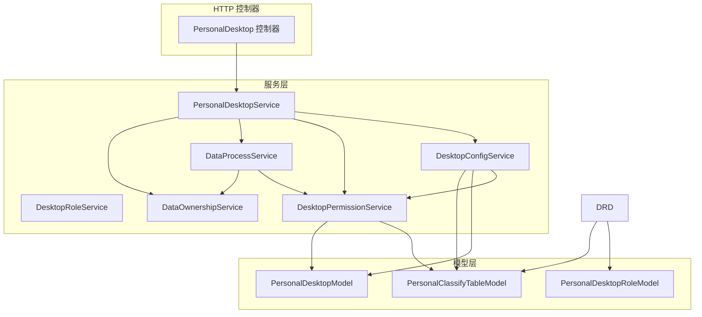
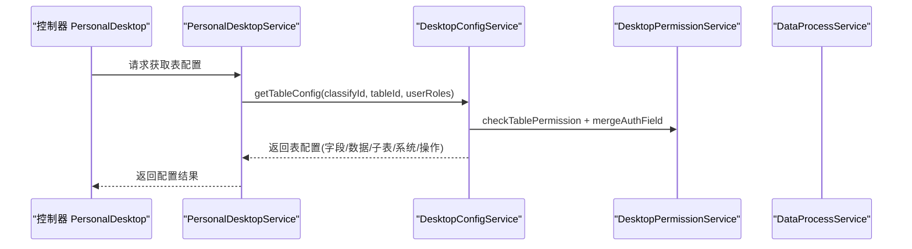
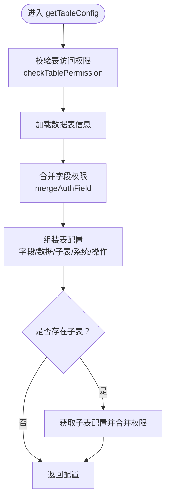
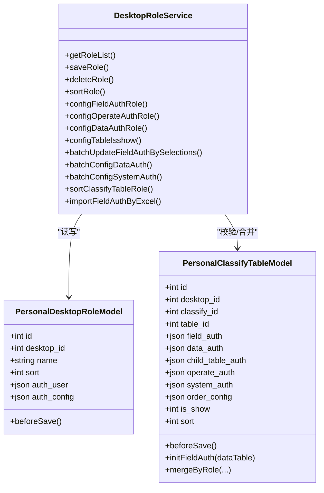
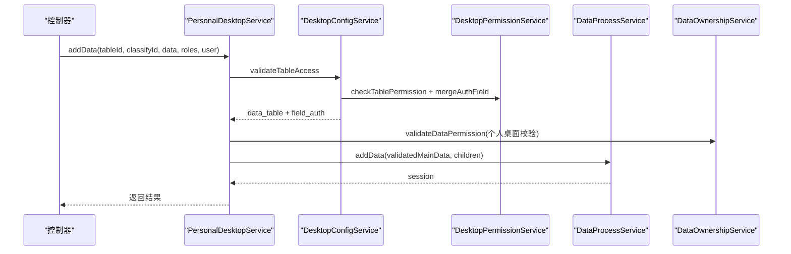
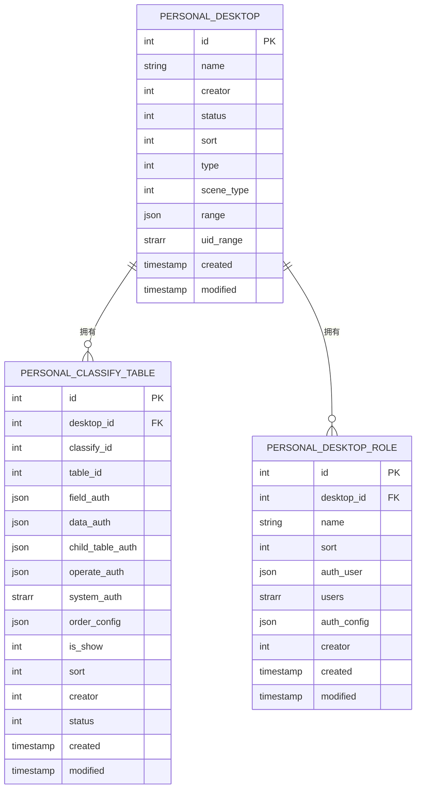
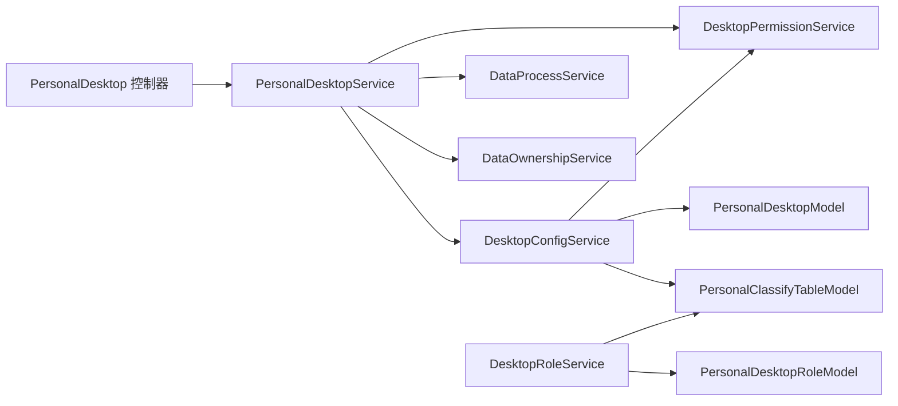

# 桌面配置服务

<cite>
**本文引用的文件**
- [DesktopConfigService.php](file://process/src/services/desktopManage/DesktopConfigService.php)
- [DesktopRoleService.php](file://process/src/services/desktopManage/DesktopRoleService.php)
- [PersonalDesktopService.php](file://process/src/services/desktopManage/PersonalDesktopService.php)
- [DesktopPermissionService.php](file://process/src/services/desktopManage/DesktopPermissionService.php)
- [DataProcessService.php](file://process/src/services/desktopManage/DataProcessService.php)
- [DataOwnershipService.php](file://process/src/services/desktopManage/DataOwnershipService.php)
- [PersonalDesktopModel.php](file://process/src/models/PersonalDesktopModel.php)
- [PersonalDesktopRoleModel.php](file://process/src/models/PersonalDesktopRoleModel.php)
- [PersonalClassifyTableModel.php](file://process/src/models/PersonalClassifyTableModel.php)
- [PersonalDesktop.php](file://process/src/http/system/PersonalDesktop.php)
</cite>

## 目录
1. [简介](#简介)
2. [项目结构](#项目结构)
3. [核心组件](#核心组件)
4. [架构总览](#架构总览)
5. [详细组件分析](#详细组件分析)
6. [依赖关系分析](#依赖关系分析)
7. [性能考量](#性能考量)
8. [故障排查指南](#故障排查指南)
9. [结论](#结论)
10. [附录](#附录)

## 简介
本文件面向桌面配置服务，系统化阐述桌面角色管理、配置模板管理与权限分配机制。重点覆盖 DesktopConfigService 与 DesktopRoleService 的实现原理，包括配置项的存储结构、角色权限体系、数据权限控制策略，以及配置服务的接口设计、参数校验与错误处理。同时提供数据模型设计、配置项动态生成与权限验证流程的可视化图示，并给出最佳实践与性能优化建议。

## 项目结构
桌面配置服务位于 process/src/services/desktopManage 目录，围绕“桌面-分类-维度（分类表关联）-数据表”的层次展开，配合模型层与控制器层共同完成配置读取、权限合并、数据读写与权限校验。

图表来源
- [PersonalDesktop.php](file://process/src/http/system/PersonalDesktop.php#L1-L120)
- [PersonalDesktopService.php](file://process/src/services/desktopManage/PersonalDesktopService.php#L1-L120)
- [DesktopConfigService.php](file://process/src/services/desktopManage/DesktopConfigService.php#L1-L80)
- [DesktopRoleService.php](file://process/src/services/desktopManage/DesktopRoleService.php#L1-L80)
- [DesktopPermissionService.php](file://process/src/services/desktopManage/DesktopPermissionService.php#L1-L60)
- [DataProcessService.php](file://process/src/services/desktopManage/DataProcessService.php#L1-L120)
- [DataOwnershipService.php](file://process/src/services/desktopManage/DataOwnershipService.php#L1-L60)
- [PersonalDesktopModel.php](file://process/src/models/PersonalDesktopModel.php#L1-L60)
- [PersonalClassifyTableModel.php](file://process/src/models/PersonalClassifyTableModel.php#L1-L80)
- [PersonalDesktopRoleModel.php](file://process/src/models/PersonalDesktopRoleModel.php#L1-L60)

章节来源
- [PersonalDesktop.php](file://process/src/http/system/PersonalDesktop.php#L1-L120)
- [PersonalDesktopService.php](file://process/src/services/desktopManage/PersonalDesktopService.php#L1-L120)

## 核心组件
- DesktopConfigService：负责桌面、分类、表配置的获取与合并，输出字段权限、数据权限、子表配置等。
- DesktopRoleService：负责桌面角色的增删改查、角色维度排序、字段/操作/数据/系统权限批量配置。
- PersonalDesktopService：作为入口协调配置、权限、数据处理与所有权验证服务，提供数据增删改查与权限条件构建。
- DesktopPermissionService：负责桌面/表权限校验与字段权限合并（支持主表/子表层级）。
- DataProcessService：封装数据读写流程，提供钩子扩展、游标分页、子表批量查询与权限过滤。
- DataOwnershipService：验证个人桌面数据所有权，支持共享子表穿透校验。
- 模型层：PersonalDesktopModel、PersonalClassifyTableModel、PersonalDesktopRoleModel，承载配置存储与归一化逻辑。

章节来源
- [DesktopConfigService.php](file://process/src/services/desktopManage/DesktopConfigService.php#L1-L120)
- [DesktopRoleService.php](file://process/src/services/desktopManage/DesktopRoleService.php#L1-L120)
- [PersonalDesktopService.php](file://process/src/services/desktopManage/PersonalDesktopService.php#L1-L120)
- [DesktopPermissionService.php](file://process/src/services/desktopManage/DesktopPermissionService.php#L1-L120)
- [DataProcessService.php](file://process/src/services/desktopManage/DataProcessService.php#L1-L120)
- [DataOwnershipService.php](file://process/src/services/desktopManage/DataOwnershipService.php#L1-L80)
- [PersonalDesktopModel.php](file://process/src/models/PersonalDesktopModel.php#L1-L80)
- [PersonalClassifyTableModel.php](file://process/src/models/PersonalClassifyTableModel.php#L1-L120)
- [PersonalDesktopRoleModel.php](file://process/src/models/PersonalDesktopRoleModel.php#L1-L100)

## 架构总览
桌面配置服务采用“控制器-服务-模型-权限/数据处理”的分层架构。控制器负责参数解析与事务控制，服务层负责业务编排，模型层负责持久化与配置归一化，权限与数据处理服务分别承担权限合并与数据读写能力。

图表来源
- [PersonalDesktop.php](file://process/src/http/system/PersonalDesktop.php#L1-L120)
- [PersonalDesktopService.php](file://process/src/services/desktopManage/PersonalDesktopService.php#L120-L200)
- [DesktopConfigService.php](file://process/src/services/desktopManage/DesktopConfigService.php#L170-L260)
- [DesktopPermissionService.php](file://process/src/services/desktopManage/DesktopPermissionService.php#L43-L120)
- [DataProcessService.php](file://process/src/services/desktopManage/DataProcessService.php#L100-L180)

## 详细组件分析

### DesktopConfigService：桌面/分类/表配置与权限合并
- 功能要点
  - 桌面列表：按类型与用户角色范围过滤，返回可访问桌面清单。
  - 分类列表：按桌面ID获取分类与维度（分类表关联）列表，合并角色维度排序与显示状态。
  - 表配置：合并字段权限（主表/子表）、数据权限、系统权限、子表配置、查询配置、操作权限、魔术控件权限等。
  - 权限合并：基于分类表关联与数据表字段配置，生成最终字段权限（支持层级格式）。
- 数据模型
  - 依赖 PersonalDesktopModel、PersonalClassifyTableModel、DataTableModel、DataTableSyncModel。
- 性能与优化
  - 批量查询分类表与表信息，减少多次数据库往返。
  - 支持子表配置按需加载与权限过滤。

图表来源
- [DesktopConfigService.php](file://process/src/services/desktopManage/DesktopConfigService.php#L170-L260)
- [DesktopConfigService.php](file://process/src/services/desktopManage/DesktopConfigService.php#L286-L350)
- [DesktopPermissionService.php](file://process/src/services/desktopManage/DesktopPermissionService.php#L90-L140)

章节来源
- [DesktopConfigService.php](file://process/src/services/desktopManage/DesktopConfigService.php#L1-L200)
- [DesktopPermissionService.php](file://process/src/services/desktopManage/DesktopPermissionService.php#L90-L220)

### DesktopRoleService：桌面角色与权限配置
- 功能要点
  - 角色管理：列表、新增/编辑、删除、排序。
  - 字段权限：按表字段、子表字段、子表整体批量配置，支持 Excel 导入。
  - 操作权限：按维度或范围批量配置。
  - 数据权限：按角色与维度配置数据范围/补充范围。
  - 系统权限：支持系统字段授权（如姓名、部门）。
  - 维度排序：按角色维度独立排序，写入 auth_config 的 sort。
- 存储结构
  - 角色模型 PersonalDesktopRoleModel.auth_config 以“分类表ID”为键，保存 field_auth、child_table_auth、operate_auth、data_auth、system_auth、order_config、is_show、sort、magic_control_auth 等。
  - 分类表模型 PersonalClassifyTableModel.field_auth 以“表ID”为键，保存字段权限数组。
- 并发与一致性
  - 使用分布式锁保护关键写操作（新增/编辑/删除/排序）。
  - beforeSave 归一化 auth_config，确保每个维度均有配置项。

图表来源
- [DesktopRoleService.php](file://process/src/services/desktopManage/DesktopRoleService.php#L1-L200)
- [PersonalDesktopRoleModel.php](file://process/src/models/PersonalDesktopRoleModel.php#L1-L100)
- [PersonalClassifyTableModel.php](file://process/src/models/PersonalClassifyTableModel.php#L1-L160)

章节来源
- [DesktopRoleService.php](file://process/src/services/desktopManage/DesktopRoleService.php#L1-L220)
- [PersonalDesktopRoleModel.php](file://process/src/models/PersonalDesktopRoleModel.php#L1-L100)
- [PersonalClassifyTableModel.php](file://process/src/models/PersonalClassifyTableModel.php#L1-L160)

### PersonalDesktopService：入口编排与数据权限控制
- 功能要点
  - 获取桌面/分类/表配置。
  - 数据增删改：统一参数校验、字段权限过滤、唯一性校验、子表变更追踪、会话记录与审核流程。
  - 数据权限条件构建：个人桌面按工号与共享子表穿透，管理桌面按 data_auth 范围。
  - 数据所有权验证：个人桌面严格校验数据归属。
- 错误处理
  - 桌面/表/维度不存在、无权限访问、记录不存在或无权限等均抛出用户异常。
- 性能监控
  - 列表查询阶段记录权限验证耗时与总耗时，超阈值告警。

图表来源
- [PersonalDesktopService.php](file://process/src/services/desktopManage/PersonalDesktopService.php#L150-L220)
- [DataProcessService.php](file://process/src/services/desktopManage/DataProcessService.php#L200-L340)
- [DataOwnershipService.php](file://process/src/services/desktopManage/DataOwnershipService.php#L68-L106)

章节来源
- [PersonalDesktopService.php](file://process/src/services/desktopManage/PersonalDesktopService.php#L150-L360)
- [DataProcessService.php](file://process/src/services/desktopManage/DataProcessService.php#L200-L520)
- [DataOwnershipService.php](file://process/src/services/desktopManage/DataOwnershipService.php#L1-L106)

### DesktopPermissionService：权限合并与字段验证
- 功能要点
  - 桌面/表权限校验：基于用户角色与桌面 uid_range/users 范围交集判断。
  - 字段权限合并：主表字段默认值与分类表配置优先级合并，支持只读/隐藏/可写/必填规则。
  - 层级权限格式：输出主表字段与子表字段的权限字符（q/w/r/h）。
  - 字段过滤与必填校验：读取时过滤隐藏字段，写入时按权限过滤并校验必填。
- 复杂度与边界
  - 合并算法线性遍历字段配置，复杂度 O(F)（F 为字段数）。
  - 子表权限合并按子表数量线性扩展。

章节来源
- [DesktopPermissionService.php](file://process/src/services/desktopManage/DesktopPermissionService.php#L1-L220)
- [DesktopPermissionService.php](file://process/src/services/desktopManage/DesktopPermissionService.php#L220-L473)

### 数据模型设计与存储结构
- PersonalDesktopModel：桌面基本信息、类型、场景类型、范围配置、用户范围（uid_range）。
- PersonalClassifyTableModel：维度与数据表关联，字段权限、数据权限、子表总权限、系统权限、排序、显示开关等。
- PersonalDesktopRoleModel：角色信息与 auth_config，auth_user 归一化为 users 数组，便于快速权限匹配。

图表来源
- [PersonalDesktopModel.php](file://process/src/models/PersonalDesktopModel.php#L1-L80)
- [PersonalClassifyTableModel.php](file://process/src/models/PersonalClassifyTableModel.php#L1-L120)
- [PersonalDesktopRoleModel.php](file://process/src/models/PersonalDesktopRoleModel.php#L1-L100)

章节来源
- [PersonalDesktopModel.php](file://process/src/models/PersonalDesktopModel.php#L1-L80)
- [PersonalClassifyTableModel.php](file://process/src/models/PersonalClassifyTableModel.php#L1-L160)
- [PersonalDesktopRoleModel.php](file://process/src/models/PersonalDesktopRoleModel.php#L1-L100)

### 接口设计、参数校验与错误处理
- 控制器层（PersonalDesktop.php）
  - 使用注解与工具类进行分页、参数提取与响应包装。
  - 对关键写操作使用分布式锁防并发冲突。
  - 对必填参数进行前置校验，异常统一转为用户异常。
- 服务层
  - 参数校验与异常抛出集中在各服务方法内部，保证调用方无需重复校验。
  - 事务包裹写操作，失败回滚并抛出用户异常。
- 错误处理
  - 桌面/表/维度不存在、无权限访问、记录不存在或无权限、必填字段缺失、唯一性冲突等均有明确错误信息。

章节来源
- [PersonalDesktop.php](file://process/src/http/system/PersonalDesktop.php#L1-L120)
- [PersonalDesktop.php](file://process/src/http/system/PersonalDesktop.php#L700-L820)
- [PersonalDesktopService.php](file://process/src/services/desktopManage/PersonalDesktopService.php#L1-L120)

## 依赖关系分析
- 低耦合高内聚
  - DesktopConfigService 与 DesktopPermissionService 解耦，前者专注配置读取，后者专注权限合并。
  - PersonalDesktopService 作为编排者，聚合多个服务，职责清晰。
- 关键依赖链
  - 控制器 → PersonalDesktopService → DesktopConfigService/PermissionService/DataProcessService
  - DesktopRoleService 依赖模型层进行配置归一化与维度合并。
- 循环依赖规避
  - 通过服务间接口调用与模型层静态查询避免循环依赖。

图表来源
- [PersonalDesktop.php](file://process/src/http/system/PersonalDesktop.php#L1-L120)
- [PersonalDesktopService.php](file://process/src/services/desktopManage/PersonalDesktopService.php#L1-L120)
- [DesktopConfigService.php](file://process/src/services/desktopManage/DesktopConfigService.php#L1-L80)
- [DesktopRoleService.php](file://process/src/services/desktopManage/DesktopRoleService.php#L1-L80)
- [PersonalDesktopModel.php](file://process/src/models/PersonalDesktopModel.php#L1-L60)
- [PersonalClassifyTableModel.php](file://process/src/models/PersonalClassifyTableModel.php#L1-L80)
- [PersonalDesktopRoleModel.php](file://process/src/models/PersonalDesktopRoleModel.php#L1-L60)

章节来源
- [PersonalDesktopService.php](file://process/src/services/desktopManage/PersonalDesktopService.php#L1-L120)
- [DesktopConfigService.php](file://process/src/services/desktopManage/DesktopConfigService.php#L1-L120)
- [DesktopRoleService.php](file://process/src/services/desktopManage/DesktopRoleService.php#L1-L120)

## 性能考量
- 查询优化
  - 批量查询分类表与表信息，减少 N+1 查询。
  - 列表查询支持游标分页（大数据集深度分页）与 offset 分页切换。
- 权限过滤
  - 读取阶段统一过滤隐藏字段，避免前端渲染冗余数据。
- 性能监控
  - 记录权限验证耗时、查询耗时、子表查询耗时，超阈值告警。
- 建议
  - 对高频维度配置启用缓存（如分类表与字段权限）。
  - 对超大表的深度分页使用游标分页，避免 offset 过深导致的性能退化。
  - 对唯一性校验建立合适索引，减少重复数据插入成本。

章节来源
- [DataProcessService.php](file://process/src/services/desktopManage/DataProcessService.php#L100-L198)
- [DataProcessService.php](file://process/src/services/desktopManage/DataProcessService.php#L580-L714)
- [PersonalDesktopService.php](file://process/src/services/desktopManage/PersonalDesktopService.php#L210-L318)

## 故障排查指南
- 常见问题
  - 无权限访问：检查桌面 uid_range 与用户角色交集，确认分类表关联是否存在。
  - 字段权限异常：核对分类表 field_auth 与数据表字段默认配置合并规则。
  - 数据权限不生效：检查 manage 桌面 data_auth 配置与个人桌面 __number 条件。
  - 唯一性冲突：检查字段 unique 配置与提交数据是否违反唯一约束。
- 定位手段
  - 查看服务层日志与性能日志，定位慢查询与权限验证耗时。
  - 使用控制器事务包裹与分布式锁，避免并发导致的状态不一致。
- 处理建议
  - 对必填字段缺失与隐藏字段读取异常，完善前端提示与后端校验。
  - 对共享子表穿透校验失败，检查子表与主表关联字段与用户工号。

章节来源
- [DesktopPermissionService.php](file://process/src/services/desktopManage/DesktopPermissionService.php#L430-L473)
- [DataProcessService.php](file://process/src/services/desktopManage/DataProcessService.php#L881-L943)
- [DataOwnershipService.php](file://process/src/services/desktopManage/DataOwnershipService.php#L1-L106)
- [PersonalDesktopService.php](file://process/src/services/desktopManage/PersonalDesktopService.php#L319-L360)

## 结论
桌面配置服务通过清晰的分层设计与完善的权限合并机制，实现了桌面角色管理、配置模板管理与数据权限控制的统一编排。DesktopConfigService 与 DesktopRoleService 提供了灵活的配置能力，PersonalDesktopService 则在数据读写与权限控制之间建立了稳健的桥梁。结合性能监控与错误处理策略，整体具备良好的可维护性与扩展性。

## 附录
- 最佳实践
  - 角色与维度配置应遵循最小权限原则，优先使用系统权限与数据权限控制范围。
  - 字段权限与必填规则应在表结构层面定义，避免运行期频繁变更。
  - 对高频接口启用缓存与游标分页，降低数据库压力。
- 扩展建议
  - 引入配置版本管理与审计日志，追踪角色与维度权限变更。
  - 支持配置导入导出（除 Excel 外，增加标准 JSON/CSV 导出）。