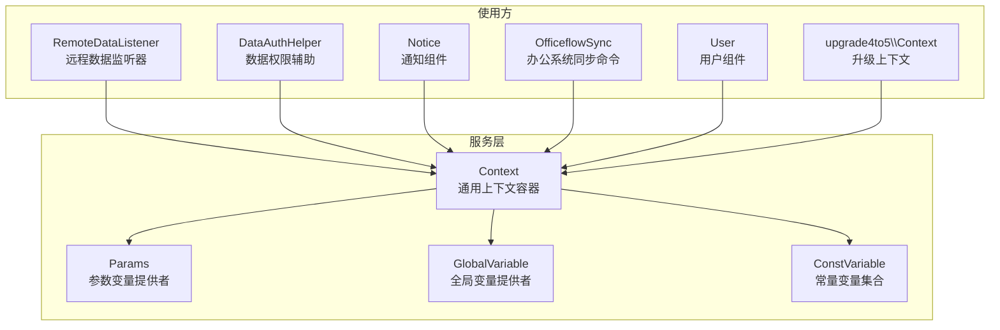
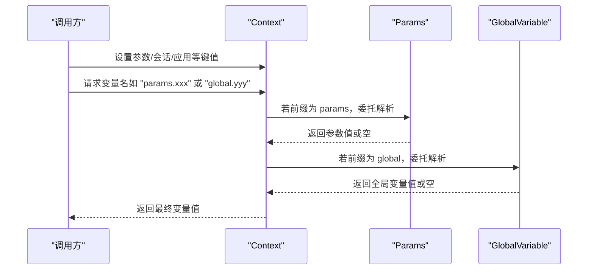
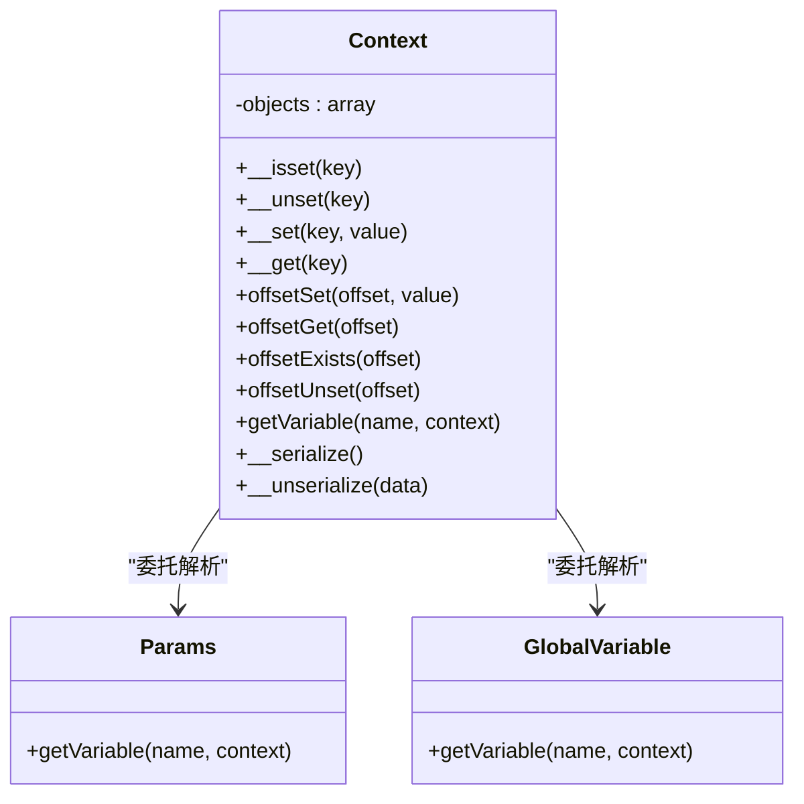
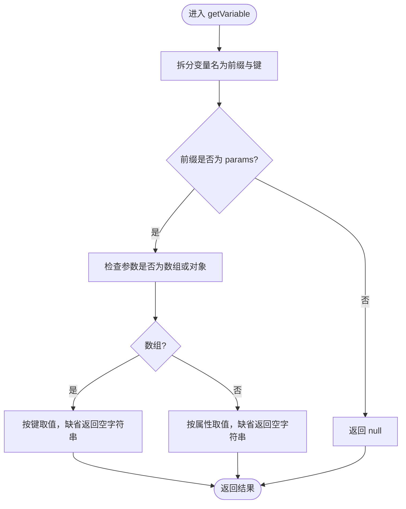
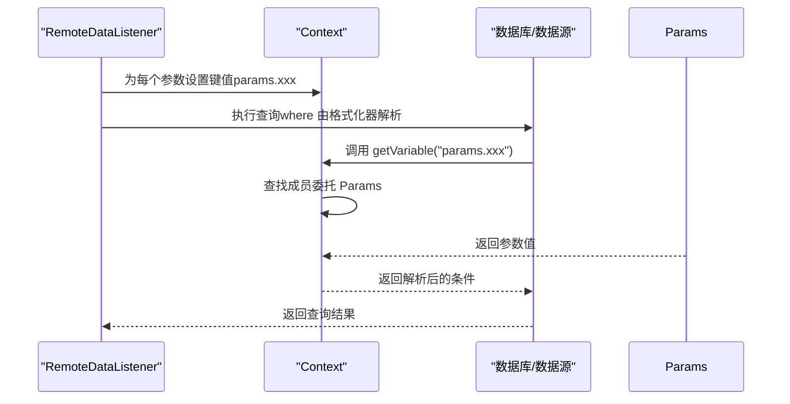
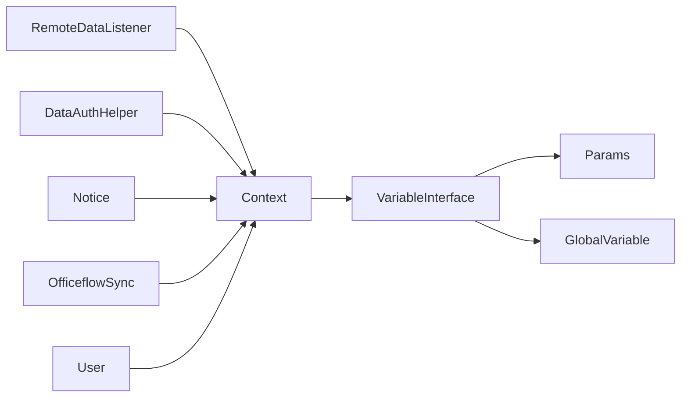

# 上下文管理服务

<cite>
**本文引用的文件**
- [Context.php](file://process/src/services/Context.php)
- [Params.php](file://process/src/services/Params.php)
- [GlobalVariable.php](file://process/src/services/GlobalVariable.php)
- [ConstVariable.php](file://process/src/services/ConstVariable.php)
- [RemoteDataListener.php](file://process/src/services/listeners/RemoteDataListener.php)
- [DataAuthHelper.php](file://process/src/services/desktopManage/helpers/DataAuthHelper.php)
- [Notice.php](file://process/src/components/Notice.php)
- [OfficeflowSync.php](file://process/src/commands/OfficeflowSync.php)
- [User.php](file://process/src/components/User.php)
- [Context.php（升级工具）](file://process/src/services/upgrade4to5/Context.php)
</cite>

## 目录
1. [简介](#简介)
2. [项目结构](#项目结构)
3. [核心组件](#核心组件)
4. [架构总览](#架构总览)
5. [详细组件分析](#详细组件分析)
6. [依赖分析](#依赖分析)
7. [性能考量](#性能考量)
8. [故障排除指南](#故障排除指南)
9. [结论](#结论)
10. [附录](#附录)

## 简介
本文件面向 htdNew 项目的“上下文管理服务”，系统性梳理 Context 的设计与实现，覆盖上下文数据传递、参数管理、全局变量处理、生命周期与隔离共享机制、参数校验与默认值处理、性能优化与并发安全等主题，并提供最佳实践、调试技巧与故障排除建议。目标是帮助开发者在复杂业务流程中正确、高效地使用上下文。

## 项目结构
围绕上下文的关键文件分布如下：
- 服务层上下文与变量提供者
  - Context：通用上下文容器，支持数组式访问与变量解析
  - Params：从请求/调用参数中解析变量
  - GlobalVariable：从全局变量模型中解析变量
  - ConstVariable：常量变量集合（用户、会话、表单、流程等）
- 使用方
  - RemoteDataListener：远程数据读取时将参数注入上下文并解析 where 条件
  - DataAuthHelper：在数据范围计算中构造上下文并传入格式化器
  - Notice：通知发送时携带上下文，用于日志与模板渲染
  - OfficeflowSync：命令行同步流程中多次复用上下文
  - User：协程环境下的上下文获取
  - upgrade4to5/Context：跨版本迁移过程中的公共上下文数据

图表来源
- [Context.php](file://process/src/services/Context.php#L1-L77)
- [Params.php](file://process/src/services/Params.php#L1-L24)
- [GlobalVariable.php](file://process/src/services/GlobalVariable.php#L1-L20)
- [ConstVariable.php](file://process/src/services/ConstVariable.php#L1-L393)
- [RemoteDataListener.php](file://process/src/services/listeners/RemoteDataListener.php#L106-L144)
- [DataAuthHelper.php](file://process/src/services/desktopManage/helpers/DataAuthHelper.php#L213-L213)
- [Notice.php](file://process/src/components/Notice.php#L21-L21)
- [OfficeflowSync.php](file://process/src/commands/OfficeflowSync.php#L45-L45)
- [User.php](file://process/src/components/User.php#L179-L179)
- [Context.php（升级工具）](file://process/src/services/upgrade4to5/Context.php#L1-L18)

章节来源
- [Context.php](file://process/src/services/Context.php#L1-L77)
- [Params.php](file://process/src/services/Params.php#L1-L24)
- [GlobalVariable.php](file://process/src/services/GlobalVariable.php#L1-L20)
- [ConstVariable.php](file://process/src/services/ConstVariable.php#L1-L393)

## 核心组件
- Context（通用上下文容器）
  - 支持属性与数组两种访问方式（ArrayAccess），内部以关联数组存储键值对
  - 实现变量解析接口，按名称查找变量值；若某成员实现了变量接口，则委托其解析
  - 提供序列化/反序列化钩子，便于持久化或跨进程传递
- Params（参数变量提供者）
  - 通过 params 前缀访问，支持数组与对象两种形态
  - 解析形如 params.key 的变量名，返回对应参数值
- GlobalVariable（全局变量提供者）
  - 通过 global 前缀访问，从全局变量模型中读取值
- ConstVariable（常量变量集合）
  - 定义大量系统级常量变量，涵盖用户、会话、表单、流程等场景
  - 提供变量清单生成能力，用于前端选择与模板渲染

章节来源
- [Context.php](file://process/src/services/Context.php#L1-L77)
- [Params.php](file://process/src/services/Params.php#L1-L24)
- [GlobalVariable.php](file://process/src/services/GlobalVariable.php#L1-L20)
- [ConstVariable.php](file://process/src/services/ConstVariable.php#L74-L115)

## 架构总览
上下文在系统中的角色是“变量解析中枢”。调用方将参数、会话、应用等信息封装到 Context 中，再由 Context 逐个委托给实现 VariableInterface 的提供者进行解析。典型流程如下：

图表来源
- [Context.php](file://process/src/services/Context.php#L52-L65)
- [Params.php](file://process/src/services/Params.php#L12-L23)
- [GlobalVariable.php](file://process/src/services/GlobalVariable.php#L11-L19)

## 详细组件分析

### 组件一：Context（通用上下文容器）
- 设计要点
  - 采用数组式存储，支持 isset/unset、数组访问与变量解析
  - 变量解析遵循“先委托后匹配”的策略：若成员实现变量接口则优先委托，否则按键名直接匹配
  - 序列化/反序列化钩子用于跨边界传递与恢复
- 生命周期与隔离共享
  - 作为轻量容器，通常在一次请求/任务周期内创建与销毁
  - 可通过序列化在不同执行单元间传递，但需注意成员对象是否可序列化
- 并发与内存
  - 单线程/协程内使用时无需额外锁；跨协程/进程需谨慎传递
  - 成员过多会增加内存占用，建议按需注入

图表来源
- [Context.php](file://process/src/services/Context.php#L1-L77)
- [Params.php](file://process/src/services/Params.php#L1-L24)
- [GlobalVariable.php](file://process/src/services/GlobalVariable.php#L1-L20)

章节来源
- [Context.php](file://process/src/services/Context.php#L1-L77)

### 组件二：Params（参数变量提供者）
- 功能
  - 从构造函数注入的参数中解析 params.xxx 形式的变量名
  - 支持数组与对象两种形态，默认值为空字符串
- 参数验证与默认值
  - 通过数组/对象键存在性判断返回默认值
  - 无显式类型转换逻辑，保持原始类型
- 使用场景
  - 远程数据读取时将 params.xxx 注入 Context，供 where 条件表达式使用

图表来源
- [Params.php](file://process/src/services/Params.php#L12-L23)

章节来源
- [Params.php](file://process/src/services/Params.php#L1-L24)

### 组件三：GlobalVariable（全局变量提供者）
- 功能
  - 通过 global.xxx 前缀从全局变量模型中读取值
  - 未命中返回 null
- 适用场景
  - 配置类变量、开关类变量、运行时动态变量等

章节来源
- [GlobalVariable.php](file://process/src/services/GlobalVariable.php#L1-L20)

### 组件四：ConstVariable（常量变量集合）
- 功能
  - 提供用户、会话、表单、流程等多类变量清单
  - 支持根据应用版本与场景生成变量集合
- 价值
  - 为前端变量选择与模板渲染提供统一来源
  - 与 Context/VariableInterface 结合，形成“常量变量”解析链路

章节来源
- [ConstVariable.php](file://process/src/services/ConstVariable.php#L74-L115)
- [ConstVariable.php](file://process/src/services/ConstVariable.php#L168-L193)

### 使用场景一：远程数据读取（参数注入与变量解析）
- 流程
  - 将 params.xxx 注入 Context
  - 在 where 条件格式化时，通过 Context.getVariable 解析变量
- 关键点
  - 参数键命名规范（params.key）确保被 Params 正确识别
  - where 表达式中可直接引用 params.xxx，Context 会委托 Params 解析

图表来源
- [RemoteDataListener.php](file://process/src/services/listeners/RemoteDataListener.php#L106-L144)
- [Context.php](file://process/src/services/Context.php#L52-L65)
- [Params.php](file://process/src/services/Params.php#L12-L23)

章节来源
- [RemoteDataListener.php](file://process/src/services/listeners/RemoteDataListener.php#L106-L144)

### 使用场景二：数据权限与范围计算（上下文构造与传递）
- 流程
  - 在数据范围计算前，基于用户等信息构造 Context
  - 将 Context 传入格式化器，解析 where 条件中的变量
- 关键点
  - Context 中注入 user 等上下文对象，供变量解析链路使用
  - 通过 Context 的委托机制，实现灵活的数据权限控制

章节来源
- [DataAuthHelper.php](file://process/src/services/desktopManage/helpers/DataAuthHelper.php#L213-L213)
- [Context.php](file://process/src/services/Context.php#L52-L65)

### 使用场景三：通知发送（携带上下文）
- 流程
  - 通知组件接收 Context，从中读取 session/app 等上下文信息
  - 用于日志记录、模板渲染与发送平台选择
- 关键点
  - 通过 Context 访问 session.is_test 等标志位，决定是否屏蔽测试实例的消息

章节来源
- [Notice.php](file://process/src/components/Notice.php#L21-L24)
- [Notice.php](file://process/src/components/Notice.php#L48-L51)

### 使用场景四：命令行同步（多次复用上下文）
- 流程
  - 在不同同步阶段创建 Context，注入相关配置与状态
  - 多次复用同一上下文，减少重复初始化成本
- 关键点
  - 上下文作为“状态载体”，贯穿整个同步流程

章节来源
- [OfficeflowSync.php](file://process/src/commands/OfficeflowSync.php#L45-L45)
- [OfficeflowSync.php](file://process/src/commands/OfficeflowSync.php#L68-L72)
- [OfficeflowSync.php](file://process/src/commands/OfficeflowSync.php#L77-L82)
- [OfficeflowSync.php](file://process/src/commands/OfficeflowSync.php#L88-L93)
- [OfficeflowSync.php](file://process/src/commands/OfficeflowSync.php#L149-L157)

### 使用场景五：协程环境下的上下文获取
- 流程
  - 在协程环境中通过框架提供的上下文获取入口，获得当前协程的 Context
- 关键点
  - 协程隔离天然保证上下文不互相污染

章节来源
- [User.php](file://process/src/components/User.php#L179-L179)

### 使用场景六：升级工具中的公共上下文
- 说明
  - upgrade4to5/Context 用于多次同步之间的公共数据共享，承载版本映射、节点映射等状态

章节来源
- [Context.php（升级工具）](file://process/src/services/upgrade4to5/Context.php#L1-L18)

## 依赖分析
- 组件耦合关系
  - Context 与 VariableInterface：Context 作为变量解析中枢，依赖实现该接口的提供者
  - Params/GlobalVariable：分别负责 params/global 前缀变量解析
  - 使用方（RemoteDataListener、DataAuthHelper、Notice、OfficeflowSync、User）均依赖 Context
- 外部依赖
  - 数据库/数据源：在 where 条件解析中被调用
  - 日志系统：在通知组件中用于调试输出

图表来源
- [Context.php](file://process/src/services/Context.php#L52-L65)
- [Params.php](file://process/src/services/Params.php#L12-L23)
- [GlobalVariable.php](file://process/src/services/GlobalVariable.php#L11-L19)
- [RemoteDataListener.php](file://process/src/services/listeners/RemoteDataListener.php#L106-L144)
- [DataAuthHelper.php](file://process/src/services/desktopManage/helpers/DataAuthHelper.php#L213-L213)
- [Notice.php](file://process/src/components/Notice.php#L21-L24)
- [OfficeflowSync.php](file://process/src/commands/OfficeflowSync.php#L45-L45)
- [User.php](file://process/src/components/User.php#L179-L179)

## 性能考量
- 内存占用
  - Context 仅保存键值对，内存开销与注入的变量数量成正比
  - 建议按需注入，避免将大对象（如完整表数据）直接放入 Context
- 变量解析路径
  - getVariable 会遍历所有成员，若成员数量较多，建议减少非必要成员
  - 对频繁解析的变量，可考虑缓存解析结果（在调用方层面）
- 序列化/反序列化
  - __serialize/__unserialize 便于跨边界传递，但需确保成员对象可序列化
  - 反序列化时可重置数据库从库策略，避免误用从库导致的异常
- 并发安全
  - 单线程/协程内使用无需额外锁；跨协程/进程共享 Context 时应避免并发写入
  - 对共享只读上下文，可通过冻结或不可变结构降低风险

章节来源
- [Context.php](file://process/src/services/Context.php#L67-L77)

## 故障排除指南
- 变量解析为空
  - 检查变量名前缀是否正确（params/global）
  - 确认 Context 中已注入对应键值
  - 若使用 Params，请确认参数形态（数组/对象）与键名一致
- where 条件无法解析
  - 确认参数键命名规范（params.key），以便 Params 正确识别
  - 检查 Context.getVariable 是否被调用，以及成员委托链是否正确
- 通知未发送或被屏蔽
  - 检查 session.is_test 标志位，测试实例可能被屏蔽
  - 查看日志输出，确认 Context 中是否存在 session/app 对象
- 协程上下文丢失
  - 确认通过框架提供的协程上下文入口获取 Context
  - 避免在协程外直接传递 Context，应在协程内重新获取

章节来源
- [Params.php](file://process/src/services/Params.php#L12-L23)
- [Context.php](file://process/src/services/Context.php#L52-L65)
- [Notice.php](file://process/src/components/Notice.php#L21-L24)
- [User.php](file://process/src/components/User.php#L179-L179)

## 结论
Context 作为 htdNew 项目中的变量解析中枢，提供了统一、可扩展的上下文数据传递与变量解析能力。通过 Params 与 GlobalVariable 等提供者，Context 能够灵活适配多种变量来源。结合远程数据读取、数据权限计算、通知发送等场景，Context 有效支撑了复杂业务流程的参数管理与数据隔离共享。建议在实践中遵循“按需注入、明确前缀、避免大对象、关注序列化与并发”的原则，以获得更佳的性能与稳定性。

## 附录
- 最佳实践
  - 参数命名：统一使用 params.key 前缀，便于 Params 识别
  - 变量组织：将只读上下文对象放入 Context，避免频繁 IO
  - 生命周期：在请求/任务边界内创建与销毁 Context，避免跨边界滥用
  - 调试：在关键节点打印 Context 键值，定位变量解析问题
- 调试技巧
  - 在 RemoteDataListener 中打印注入的 params.xxx，核对 where 条件解析
  - 在 Notice 组件中检查 session/app 对象，确认日志与发送行为
- 常见问题
  - 变量名拼写错误：导致前缀不匹配，解析失败
  - 参数形态不一致：数组与对象混用导致取值为空
  - 协程上下文混淆：跨协程传递 Context 导致数据错乱