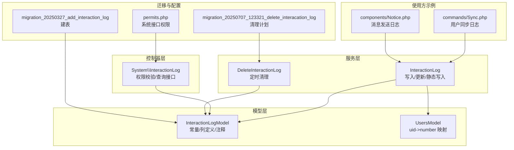
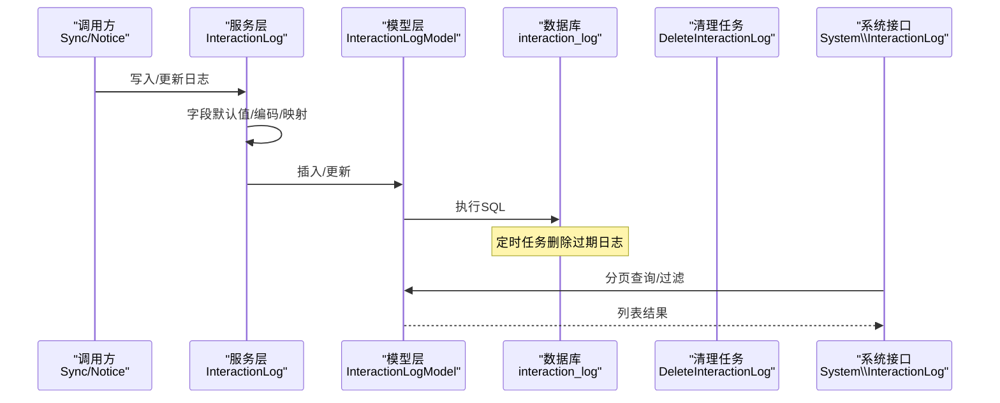
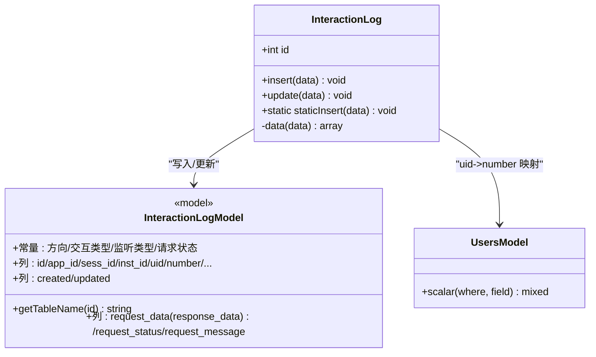
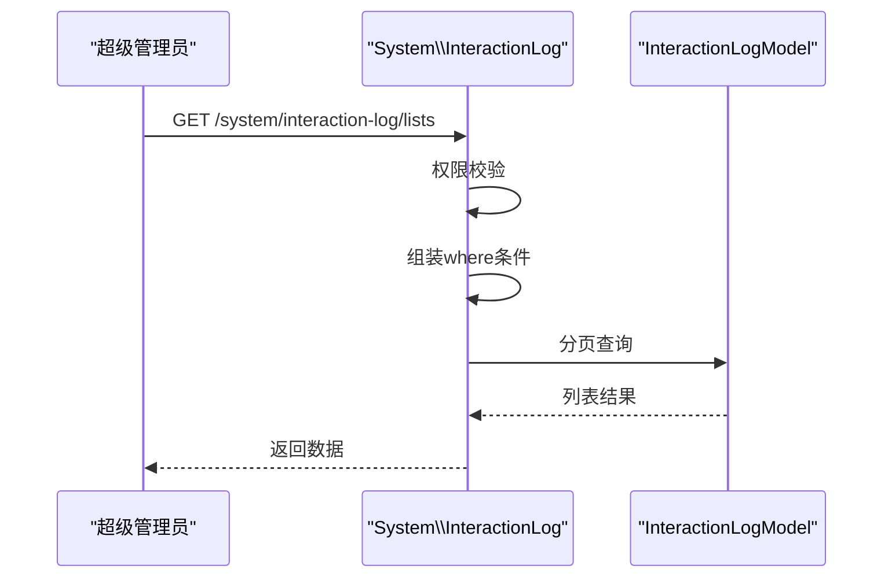
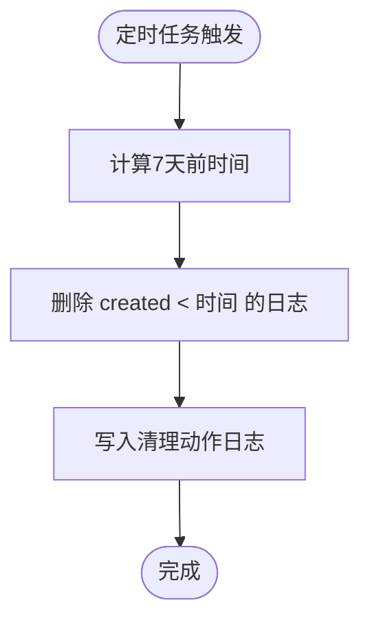
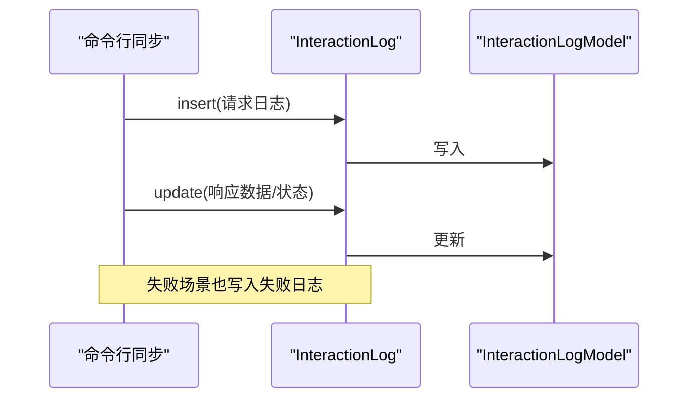
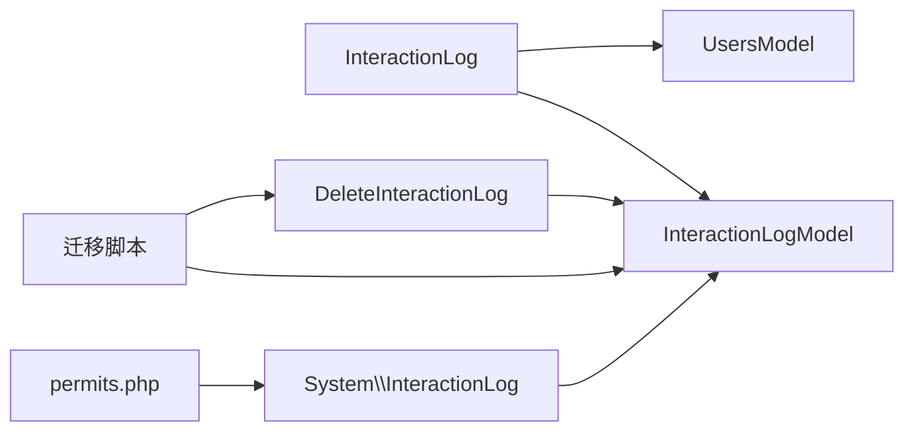

# 交互日志服务

<cite>
**本文引用的文件**
- [InteractionLog.php](file://process/src/services/InteractionLog.php)
- [InteractionLogModel.php](file://process/src/models/InteractionLogModel.php)
- [InteractionLog.php](file://process/src/http/system/InteractionLog.php)
- [DeleteInteractionLog.php](file://process/src/services/task/DeleteInteractionLog.php)
- [Sync.php](file://process/src/commands/Sync.php)
- [Notice.php](file://process/src/components/Notice.php)
- [permits.php](file://process/src/config/permits.php)
- [UsersModel.php](file://process/src/models/UsersModel.php)
- [20250327_add_interaction_log.php](file://process/src/migrations/migration_20250327_add_interaction_log.php)
- [20250707_123321_delete_interacation_log.php](file://process/src/migrations/migration_20250707_123321_delete_interacation_log.php)
</cite>

## 目录
1. [简介](#简介)
2. [项目结构](#项目结构)
3. [核心组件](#核心组件)
4. [架构总览](#架构总览)
5. [详细组件分析](#详细组件分析)
6. [依赖关系分析](#依赖关系分析)
7. [性能考量](#性能考量)
8. [故障排查指南](#故障排查指南)
9. [结论](#结论)
10. [附录](#附录)

## 简介
本文件面向 htdNew 项目的交互日志服务，围绕 InteractionLog 的设计原理与实现机制展开，覆盖用户交互记录、操作审计与行为追踪的全链路流程。内容包括：
- 数据结构与存储策略
- 查询与检索优化
- 日志记录触发条件、数据格式与隐私保护
- 性能与容量管理、清理策略
- 配置项、使用示例与分析方法

## 项目结构
交互日志服务由“服务层”“模型层”“HTTP 控制器层”“任务清理层”“迁移脚本”以及“使用方示例”共同组成，职责清晰、边界明确。

**图表来源**
- [InteractionLog.php](file://process/src/services/InteractionLog.php#L1-L65)
- [InteractionLogModel.php](file://process/src/models/InteractionLogModel.php#L1-L92)
- [InteractionLog.php](file://process/src/http/system/InteractionLog.php#L1-L78)
- [DeleteInteractionLog.php](file://process/src/services/task/DeleteInteractionLog.php#L1-L24)
- [Sync.php](file://process/src/commands/Sync.php#L150-L349)
- [Notice.php](file://process/src/components/Notice.php#L390-L406)
- [20250327_add_interaction_log.php](file://process/src/migrations/migration_20250327_add_interaction_log.php#L1-L41)
- [20250707_123321_delete_interacation_log.php](file://process/src/migrations/migration_20250707_123321_delete_interacation_log.php#L1-L37)
- [permits.php](file://process/src/config/permits.php#L130-L140)

**章节来源**
- [InteractionLog.php](file://process/src/services/InteractionLog.php#L1-L65)
- [InteractionLogModel.php](file://process/src/models/InteractionLogModel.php#L1-L92)
- [InteractionLog.php](file://process/src/http/system/InteractionLog.php#L1-L78)
- [DeleteInteractionLog.php](file://process/src/services/task/DeleteInteractionLog.php#L1-L24)
- [Sync.php](file://process/src/commands/Sync.php#L150-L349)
- [Notice.php](file://process/src/components/Notice.php#L390-L406)
- [permits.php](file://process/src/config/permits.php#L130-L140)
- [20250327_add_interaction_log.php](file://process/src/migrations/migration_20250327_add_interaction_log.php#L1-L41)
- [20250707_123321_delete_interacation_log.php](file://process/src/migrations/migration_20250707_123321_delete_interacation_log.php#L1-L37)

## 核心组件
- 服务层 InteractionLog：封装交互日志的插入、更新与一次性写入，负责字段默认值、JSON 编码、uid->number 映射等预处理。
- 模型层 InteractionLogModel：定义交互日志表的常量枚举、列类型与注释，统一表名。
- 控制器层 System\InteractionLog：提供系统级查询接口，支持分页、多维过滤与权限控制。
- 清理任务 DeleteInteractionLog：定期删除过期日志并记录清理动作。
- 使用方示例：命令行同步模块与通知组件在关键节点写入交互日志。

**章节来源**
- [InteractionLog.php](file://process/src/services/InteractionLog.php#L1-L65)
- [InteractionLogModel.php](file://process/src/models/InteractionLogModel.php#L1-L92)
- [InteractionLog.php](file://process/src/http/system/InteractionLog.php#L1-L78)
- [DeleteInteractionLog.php](file://process/src/services/task/DeleteInteractionLog.php#L1-L24)

## 架构总览
交互日志从“使用方”产生，经“服务层”标准化后写入“模型层”，最终持久化到数据库；“控制器层”提供审计查询能力；“清理任务”保障容量健康。

**图表来源**
- [InteractionLog.php](file://process/src/services/InteractionLog.php#L1-L65)
- [InteractionLogModel.php](file://process/src/models/InteractionLogModel.php#L1-L92)
- [DeleteInteractionLog.php](file://process/src/services/task/DeleteInteractionLog.php#L1-L24)
- [InteractionLog.php](file://process/src/http/system/InteractionLog.php#L1-L78)

## 详细组件分析

### 服务层：InteractionLog
- 设计要点
  - 支持两阶段写入：insert 记录初始状态，update 在后续阶段补充结果。
  - 提供静态一次性写入方法，简化无业务逻辑场景。
  - 默认值填充：方向、交互类型、监听类型等缺失时自动补全。
  - JSON 编码：对 request_data/response_data 自动 JSON_UNESCAPED_UNICODE 编码。
  - 用户映射：当提供 uid 时，自动查询用户工号 number 并回填。
- 关键路径
  - 插入：[insert](file://process/src/services/InteractionLog.php#L21-L27)
  - 更新：[update](file://process/src/services/InteractionLog.php#L29-L33)
  - 预处理：[data](file://process/src/services/InteractionLog.php#L36-L51)
  - 静态写入：[staticInsert](file://process/src/services/InteractionLog.php#L59-L65)

**图表来源**
- [InteractionLog.php](file://process/src/services/InteractionLog.php#L1-L65)
- [InteractionLogModel.php](file://process/src/models/InteractionLogModel.php#L1-L92)
- [UsersModel.php](file://process/src/models/UsersModel.php#L1-L200)

**章节来源**
- [InteractionLog.php](file://process/src/services/InteractionLog.php#L1-L65)
- [UsersModel.php](file://process/src/models/UsersModel.php#L1-L200)

### 模型层：InteractionLogModel
- 常量与枚举
  - 交互方向：push、pull、other
  - 交互类型：api、db、excel、other
  - 监听类型：listener、datasource、validator、user、other
  - 请求状态：success、fail
- 列定义与注释
  - 主键与时间戳：id、created、updated
  - 业务维度：app_id、inst_id、sess_id、uid、number
  - 行为描述：direction、interaction_type、type、type_name、type_addr
  - 数据载体：request_data、response_data（jsonb）
  - 文本描述：request_status、request_message
- 表名
  - 固定返回：interaction_log

**章节来源**
- [InteractionLogModel.php](file://process/src/models/InteractionLogModel.php#L1-L92)

### 控制器层：System\InteractionLog
- 权限控制
  - 仅超级管理员可访问查询接口。
- 查询能力
  - 支持按方向、交互类型、监听类型、请求状态过滤。
  - 支持按时间范围、文本模糊匹配 request_data、response_data、request_message。
  - 支持按 app_id、inst_id、sess_id、number 精确过滤。
  - 分页参数 offset、limit，按 id 倒序。
- 关键路径
  - 权限前置校验：[beforeAction](file://process/src/http/system/InteractionLog.php#L11-L18)
  - 枚举下拉构造：[where](file://process/src/http/system/InteractionLog.php#L20-L29)
  - 列表查询：[lists](file://process/src/http/system/InteractionLog.php#L38-L78)

**图表来源**
- [InteractionLog.php](file://process/src/http/system/InteractionLog.php#L1-L78)
- [InteractionLogModel.php](file://process/src/models/InteractionLogModel.php#L1-L92)
- [permits.php](file://process/src/config/permits.php#L130-L140)

**章节来源**
- [InteractionLog.php](file://process/src/http/system/InteractionLog.php#L1-L78)
- [permits.php](file://process/src/config/permits.php#L130-L140)

### 清理任务：DeleteInteractionLog
- 触发周期
  - 通过迁移脚本注册定时任务，每 10 分钟执行一次。
- 清理策略
  - 删除 7 天前的交互日志。
  - 成功清理后，插入一条“删除7天前交互日志”的记录，便于审计。
- 关键路径
  - 定时任务入口：[run](file://process/src/services/task/DeleteInteractionLog.php#L10-L24)
  - 迁移脚本注册：[safeUp](file://process/src/migrations/migration_20250707_123321_delete_interacation_log.php#L9-L31)

**图表来源**
- [DeleteInteractionLog.php](file://process/src/services/task/DeleteInteractionLog.php#L1-L24)
- [20250707_123321_delete_interacation_log.php](file://process/src/migrations/migration_20250707_123321_delete_interacation_log.php#L1-L37)

**章节来源**
- [DeleteInteractionLog.php](file://process/src/services/task/DeleteInteractionLog.php#L1-L24)
- [20250707_123321_delete_interacation_log.php](file://process/src/migrations/migration_20250707_123321_delete_interacation_log.php#L1-L37)

### 使用方示例：命令行同步与通知
- 命令行同步
  - 在部门同步失败时写入失败日志。
  - 在用户分页同步开始时写入请求日志，在成功时更新响应数据与状态。
  - 关键路径：
    - 失败写入：[Sync.php](file://process/src/commands/Sync.php#L150-L172)
    - 成功写入：[Sync.php](file://process/src/commands/Sync.php#L186-L200)
    - 分页写入/更新：[Sync.php](file://process/src/commands/Sync.php#L258-L276)
- 通知组件
  - 在消息发送无效时写入交互日志，便于追踪。
  - 关键路径：
    - 无效发送日志：[Notice.php](file://process/src/components/Notice.php#L390-L406)

**图表来源**
- [Sync.php](file://process/src/commands/Sync.php#L150-L349)
- [Notice.php](file://process/src/components/Notice.php#L390-L406)
- [InteractionLog.php](file://process/src/services/InteractionLog.php#L1-L65)
- [InteractionLogModel.php](file://process/src/models/InteractionLogModel.php#L1-L92)

**章节来源**
- [Sync.php](file://process/src/commands/Sync.php#L150-L349)
- [Notice.php](file://process/src/components/Notice.php#L390-L406)

## 依赖关系分析
- 服务层依赖模型层进行数据持久化，并依赖用户模型进行 uid->number 映射。
- 控制器层依赖模型层进行查询，并受权限配置约束。
- 清理任务依赖模型层进行批量删除与审计写入。
- 迁移脚本负责建表与定时任务注册。

**图表来源**
- [InteractionLog.php](file://process/src/services/InteractionLog.php#L1-L65)
- [InteractionLogModel.php](file://process/src/models/InteractionLogModel.php#L1-L92)
- [UsersModel.php](file://process/src/models/UsersModel.php#L1-L200)
- [InteractionLog.php](file://process/src/http/system/InteractionLog.php#L1-L78)
- [DeleteInteractionLog.php](file://process/src/services/task/DeleteInteractionLog.php#L1-L24)
- [20250327_add_interaction_log.php](file://process/src/migrations/migration_20250327_add_interaction_log.php#L1-L41)
- [20250707_123321_delete_interacation_log.php](file://process/src/migrations/migration_20250707_123321_delete_interacation_log.php#L1-L37)
- [permits.php](file://process/src/config/permits.php#L130-L140)

**章节来源**
- [InteractionLog.php](file://process/src/services/InteractionLog.php#L1-L65)
- [InteractionLogModel.php](file://process/src/models/InteractionLogModel.php#L1-L92)
- [UsersModel.php](file://process/src/models/UsersModel.php#L1-L200)
- [InteractionLog.php](file://process/src/http/system/InteractionLog.php#L1-L78)
- [DeleteInteractionLog.php](file://process/src/services/task/DeleteInteractionLog.php#L1-L24)
- [20250327_add_interaction_log.php](file://process/src/migrations/migration_20250327_add_interaction_log.php#L1-L41)
- [20250707_123321_delete_interacation_log.php](file://process/src/migrations/migration_20250707_123321_delete_interacation_log.php#L1-L37)
- [permits.php](file://process/src/config/permits.php#L130-L140)

## 性能考量
- 存储层
  - request_data/response_data 使用 jsonb 存储，便于灵活扩展与检索；但需注意字段过大可能影响 IO。
  - 建议对高频查询字段建立索引（如 created、type、request_status、number）以提升查询效率。
- 写入路径
  - 服务层对数组类型的请求/响应数据进行 JSON 编码，避免重复处理。
  - 对于长列表或大对象，建议在上游裁剪或脱敏后再写入，降低存储与网络压力。
- 查询路径
  - 控制器支持多维过滤与模糊匹配，建议结合分页 limit 与 created 时间范围，避免全表扫描。
  - 对 request_data/response_data 的模糊匹配使用 ::varchar 转换，注意其对性能的影响。
- 清理策略
  - 定时删除 7 天前日志，减少历史数据膨胀；同时保留一条清理动作日志，便于审计。
- 并发与异步
  - 命令行同步模块使用协程并发，交互日志写入应尽量非阻塞；必要时可采用异步队列落库。

[本节为通用性能建议，不直接分析具体文件]

## 故障排查指南
- 权限不足
  - 系统接口仅超级管理员可访问，若报无权限，请确认当前用户角色。
  - 参考：[permits.php](file://process/src/config/permits.php#L130-L140)
- 日志未入库
  - 检查服务层 data 预处理逻辑：空字段会自动 unset，确保必要字段已设置。
  - 检查 JSON 编码是否成功，避免非法数据导致写入失败。
  - 参考：[InteractionLog.php](file://process/src/services/InteractionLog.php#L36-L51)
- 查询不到数据
  - 确认过滤条件是否正确（如 app_id、inst_id、sess_id、number、时间范围）。
  - request_data/response_data 的模糊匹配使用字符串转换，注意大小写与特殊字符。
  - 参考：[InteractionLog.php](file://process/src/http/system/InteractionLog.php#L38-L78)
- 清理任务未生效
  - 检查迁移脚本是否执行，确认定时任务已注册。
  - 参考：[20250707_123321_delete_interacation_log.php](file://process/src/migrations/migration_20250707_123321_delete_interacation_log.php#L9-L31)
- 数据脱敏与隐私
  - 建议在写入前对敏感字段进行脱敏处理（如手机号、身份证号），避免明文存储。
  - 对于超长日志，建议只保留必要摘要信息。

**章节来源**
- [permits.php](file://process/src/config/permits.php#L130-L140)
- [InteractionLog.php](file://process/src/services/InteractionLog.php#L36-L51)
- [InteractionLog.php](file://process/src/http/system/InteractionLog.php#L38-L78)
- [20250707_123321_delete_interacation_log.php](file://process/src/migrations/migration_20250707_123321_delete_interacation_log.php#L9-L31)

## 结论
交互日志服务通过“服务层预处理 + 模型层持久化 + 控制器审计 + 任务清理”的闭环，实现了对用户交互、系统事件的全过程记录与可追溯。配合合理的索引、分页与清理策略，可在保证可观测性的同时兼顾性能与成本。

[本节为总结性内容，不直接分析具体文件]

## 附录

### 数据结构与字段说明
- 核心字段
  - 业务标识：app_id、inst_id、sess_id、uid、number
  - 行为描述：direction、interaction_type、type、type_name、type_addr
  - 数据载体：request_data、response_data（jsonb）
  - 状态与描述：request_status、request_message
  - 时间戳：created、updated
- 字段来源
  - [InteractionLogModel.php](file://process/src/models/InteractionLogModel.php#L50-L92)

**章节来源**
- [InteractionLogModel.php](file://process/src/models/InteractionLogModel.php#L50-L92)

### 存储策略与迁移
- 建表脚本
  - 创建 interaction_log 表，包含上述字段与默认值。
  - 参考：[20250327_add_interaction_log.php](file://process/src/migrations/migration_20250327_add_interaction_log.php#L1-L41)
- 清理策略
  - 注册定时任务，每 10 分钟删除 7 天前日志，并记录清理动作。
  - 参考：[20250707_123321_delete_interacation_log.php](file://process/src/migrations/migration_20250707_123321_delete_interacation_log.php#L9-L31)

**章节来源**
- [20250327_add_interaction_log.php](file://process/src/migrations/migration_20250327_add_interaction_log.php#L1-L41)
- [20250707_123321_delete_interacation_log.php](file://process/src/migrations/migration_20250707_123321_delete_interacation_log.php#L1-L37)

### 查询与权限
- 查询接口
  - 支持多维过滤与分页，返回字段包含交互方向、交互类型、监听类型、请求状态枚举。
  - 参考：[InteractionLog.php](file://process/src/http/system/InteractionLog.php#L20-L78)
- 权限
  - 仅超级管理员可访问。
  - 参考：[permits.php](file://process/src/config/permits.php#L130-L140)

**章节来源**
- [InteractionLog.php](file://process/src/http/system/InteractionLog.php#L20-L78)
- [permits.php](file://process/src/config/permits.php#L130-L140)

### 使用示例与最佳实践
- 命令行同步
  - 在关键节点写入请求日志并在成功后更新响应数据与状态。
  - 参考：[Sync.php](file://process/src/commands/Sync.php#L150-L349)
- 通知组件
  - 在无效发送场景写入交互日志，便于追踪。
  - 参考：[Notice.php](file://process/src/components/Notice.php#L390-L406)
- 最佳实践
  - 对大对象进行裁剪与脱敏；
  - 合理使用分页与时间范围过滤；
  - 对高频查询字段建立索引；
  - 定期评估清理策略与保留周期。

**章节来源**
- [Sync.php](file://process/src/commands/Sync.php#L150-L349)
- [Notice.php](file://process/src/components/Notice.php#L390-L406)