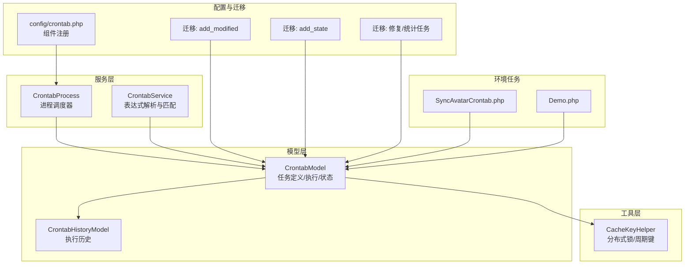
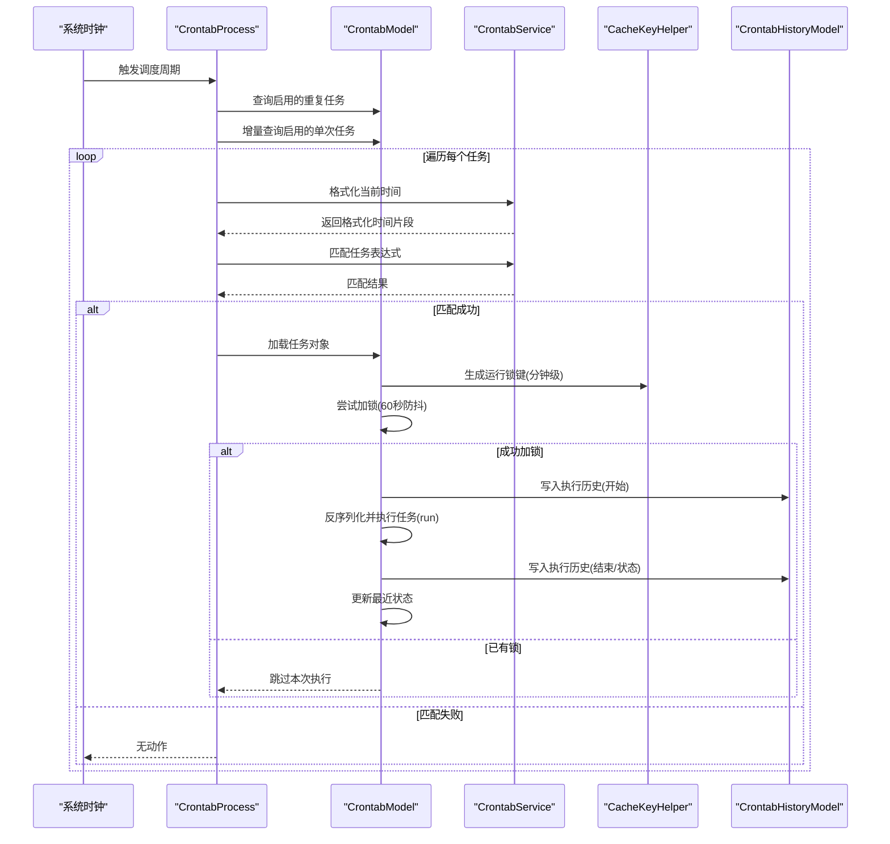
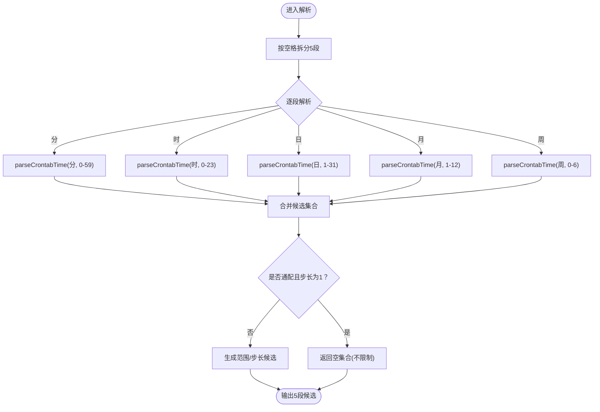
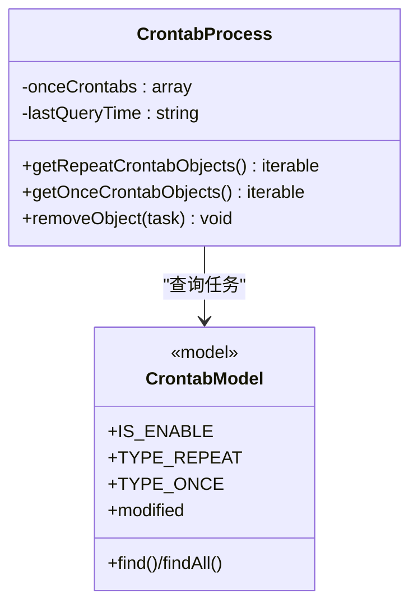
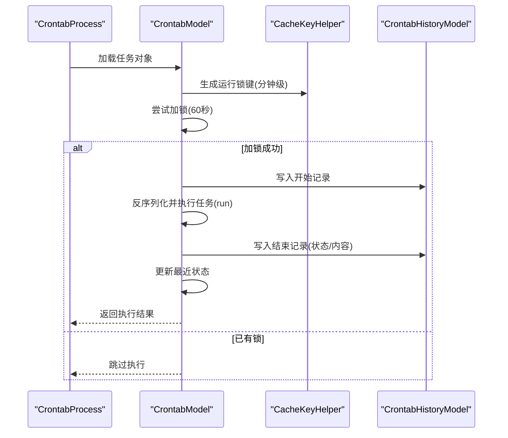
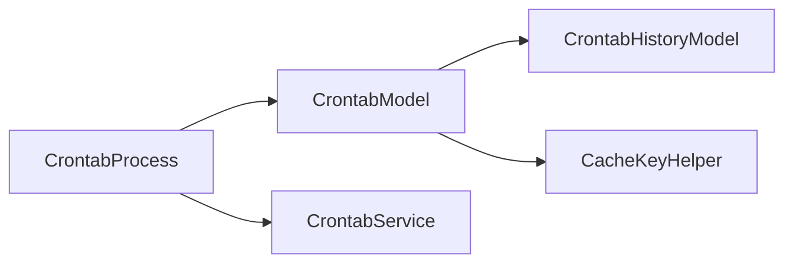

# 定时任务服务

<cite>
**本文引用的文件**
- [process/src/services/CrontabService.php](file://process/src/services/CrontabService.php)
- [process/src/services/crontab/CrontabProcess.php](file://process/src/services/crontab/CrontabProcess.php)
- [process/src/models/CrontabModel.php](file://process/src/models/CrontabModel.php)
- [process/src/models/CrontabHistoryModel.php](file://process/src/models/CrontabHistoryModel.php)
- [process/src/helpers/CacheKeyHelper.php](file://process/src/helpers/CacheKeyHelper.php)
- [process/src/config/crontab.php](file://process/src/config/crontab.php)
- [process/src/migrations/migration_20230702_162124_crontab_add_modified.php](file://process/src/migrations/migration_20230702_162124_crontab_add_modified.php)
- [process/src/migrations/migration_20230703_105223_crontab_add_state.php](file://process/src/migrations/migration_20230703_105223_crontab_add_state.php)
- [process/src/migrations/migration_20231123_145410_crontab.php](file://process/src/migrations/migration_20231123_145410_crontab.php)
- [process/src/migrations/migration_20251203145531_crontab_statistics.php](file://process/src/migrations/migration_20251203145531_crontab_statistics.php)
- [process_envs/buaa/product/crontab/SyncAvatarCrontab.php](file://process_envs/buaa/product/crontab/SyncAvatarCrontab.php)
- [process_envs/uestc/product/crontab/Demo.php](file://process_envs/uestc/product/crontab/Demo.php)
</cite>

## 目录
1. [简介](#简介)
2. [项目结构](#项目结构)
3. [核心组件](#核心组件)
4. [架构总览](#架构总览)
5. [组件详解](#组件详解)
6. [依赖关系分析](#依赖关系分析)
7. [性能考量](#性能考量)
8. [故障排查指南](#故障排查指南)
9. [结论](#结论)
10. [附录](#附录)

## 简介
本文件面向 htdNew 项目的定时任务服务，系统性阐述 CrontabService 的实现原理与工作机制，覆盖 crontab 时间解析算法、时间格式化处理、任务调度逻辑、配置管理、执行历史记录与性能监控、表达式解析规则与范围校验、调度精度控制、生命周期管理、异常处理与重试策略、配置示例、调试方法与性能优化建议。目标是帮助开发者快速理解并高效使用定时任务能力。

## 项目结构
定时任务相关的核心代码分布于以下模块：
- 服务层：CrontabService（表达式解析与匹配）、CrontabProcess（进程调度器）
- 模型层：CrontabModel（任务定义与执行）、CrontabHistoryModel（执行历史）
- 工具层：CacheKeyHelper（分布式锁与周期性键）
- 配置层：crontab.php（组件注册）
- 迁移层：数据库结构演进（新增字段、索引、状态位等）
- 环境任务：process_envs 下各环境的 crontab 示例任务

图表来源
- [process/src/services/CrontabService.php](file://process/src/services/CrontabService.php#L1-L84)
- [process/src/services/crontab/CrontabProcess.php](file://process/src/services/crontab/CrontabProcess.php#L1-L47)
- [process/src/models/CrontabModel.php](file://process/src/models/CrontabModel.php#L1-L223)
- [process/src/models/CrontabHistoryModel.php](file://process/src/models/CrontabHistoryModel.php#L1-L40)
- [process/src/helpers/CacheKeyHelper.php](file://process/src/helpers/CacheKeyHelper.php#L321-L324)
- [process/src/config/crontab.php](file://process/src/config/crontab.php#L1-L10)
- [process/src/migrations/migration_20230702_162124_crontab_add_modified.php](file://process/src/migrations/migration_20230702_162124_crontab_add_modified.php#L1-L19)
- [process/src/migrations/migration_20230703_105223_crontab_add_state.php](file://process/src/migrations/migration_20230703_105223_crontab_add_state.php#L1-L25)
- [process/src/migrations/migration_20251203145531_crontab_statistics.php](file://process/src/migrations/migration_20251203145531_crontab_statistics.php#L1-L32)
- [process_envs/buaa/product/crontab/SyncAvatarCrontab.php](file://process_envs/buaa/product/crontab/SyncAvatarCrontab.php#L1-L74)
- [process_envs/uestc/product/crontab/Demo.php](file://process_envs/uestc/product/crontab/Demo.php#L1-L28)

章节来源
- [process/src/config/crontab.php](file://process/src/config/crontab.php#L1-L10)

## 核心组件
- CrontabService：负责将 crontab 表达式解析为可比较的时间候选集，并与当前时间格式进行匹配判断；提供获取当前格式化时间的能力。
- CrontabProcess：继承自框架进程级 Crontab，负责从数据库加载启用的重复/单次任务，支持增量查询单次任务以提升效率。
- CrontabModel：任务实体，包含任务类型、规则、启用状态、最近执行状态、任务序列化体等；提供执行入口、分布式锁、历史记录写入、状态更新。
- CrontabHistoryModel：执行历史记录，包含任务 ID、开始/结束时间、状态、失败内容等。
- CacheKeyHelper：提供运行锁键（按分钟粒度）与其它业务键，用于避免并发重复执行。
- 迁移脚本：维护数据库结构演进，包括新增修改时间、状态字段、索引、系统任务标记等。

章节来源
- [process/src/services/CrontabService.php](file://process/src/services/CrontabService.php#L1-L84)
- [process/src/services/crontab/CrontabProcess.php](file://process/src/services/crontab/CrontabProcess.php#L1-L47)
- [process/src/models/CrontabModel.php](file://process/src/models/CrontabModel.php#L1-L223)
- [process/src/models/CrontabHistoryModel.php](file://process/src/models/CrontabHistoryModel.php#L1-L40)
- [process/src/helpers/CacheKeyHelper.php](file://process/src/helpers/CacheKeyHelper.php#L321-L324)
- [process/src/migrations/migration_20230702_162124_crontab_add_modified.php](file://process/src/migrations/migration_20230702_162124_crontab_add_modified.php#L1-L19)
- [process/src/migrations/migration_20230703_105223_crontab_add_state.php](file://process/src/migrations/migration_20230703_105223_crontab_add_state.php#L1-L25)

## 架构总览
定时任务从“表达式解析”到“进程调度”，再到“模型执行与历史记录”的整体流程如下：

图表来源
- [process/src/services/crontab/CrontabProcess.php](file://process/src/services/crontab/CrontabProcess.php#L1-L47)
- [process/src/services/CrontabService.php](file://process/src/services/CrontabService.php#L1-L84)
- [process/src/models/CrontabModel.php](file://process/src/models/CrontabModel.php#L157-L216)
- [process/src/models/CrontabHistoryModel.php](file://process/src/models/CrontabHistoryModel.php#L1-L40)
- [process/src/helpers/CacheKeyHelper.php](file://process/src/helpers/CacheKeyHelper.php#L321-L324)

## 组件详解

### CrontabService：表达式解析与匹配
- 功能要点
  - 将 crontab 表达式按空格拆分为 5 段（分、时、日、月、周），分别解析为候选集合。
  - 支持语法：*, -（范围）、/（步长）、,（多值）。
  - 当某段为通配符且步长为 1 时，返回空集合表示“不限制该维度”。
  - 提供当前时间格式化方法，返回“分-时-日-月-周”的数组形式。
  - 匹配逻辑：若某段无候选，则视为匹配；否则需在候选集中找到当前时间对应值。

- 复杂度与性能
  - 解析复杂度取决于表达式中逗号分隔数量与范围大小；最坏情况下为 O(k)，k 为展开后的候选数。
  - 由于通配符不产生候选集合，匹配为 O(1)。

- 关键路径参考
  - [checkCrontabTime/getFormatTime/formatCrontab/parseCrontabTime](file://process/src/services/CrontabService.php#L16-L84)

图表来源
- [process/src/services/CrontabService.php](file://process/src/services/CrontabService.php#L32-L84)

章节来源
- [process/src/services/CrontabService.php](file://process/src/services/CrontabService.php#L16-L84)

### CrontabProcess：进程调度器
- 功能要点
  - 重复任务：查询启用的重复任务集合。
  - 单次任务：基于上次查询时间进行增量查询，减少全量扫描开销。
  - 缓存单次任务集合，便于周期内复用。
  - 提供移除对象接口占位，后续可扩展清理逻辑。

- 关键路径参考
  - [getRepeatCrontabObjects/getOnceCrontabObjects](file://process/src/services/crontab/CrontabProcess.php#L13-L40)

图表来源
- [process/src/services/crontab/CrontabProcess.php](file://process/src/services/crontab/CrontabProcess.php#L1-L47)
- [process/src/models/CrontabModel.php](file://process/src/models/CrontabModel.php#L1-L120)

章节来源
- [process/src/services/crontab/CrontabProcess.php](file://process/src/services/crontab/CrontabProcess.php#L13-L40)

### CrontabModel：任务定义与执行
- 数据结构与字段
  - 字段：id、name、type、rule（JSON，含重复任务的 start/end/crontabs 或单次任务 runtime）、enable、task（序列化任务体）、last_state、created、modified、creator。
  - 状态：启用/禁用、最近执行状态（成功/失败/执行中）。
- 执行流程
  - 分布式锁：按分钟级键尝试 NX 加锁，避免并发重复执行。
  - 执行前置检查：确认任务存在且启用。
  - 记录历史：开始/结束时间、状态、失败内容。
  - 更新最近状态：成功/失败。
  - 单次任务：执行完成后禁用。
- 关键路径参考
  - [execTask/execTask 入口与状态更新](file://process/src/models/CrontabModel.php#L157-L216)
  - [addOnceTask/addRepeatTask/saveRepeatTask](file://process/src/models/CrontabModel.php#L62-L107)
  - [getStart/getEnd/getCrontabes/getTime](file://process/src/models/CrontabModel.php#L136-L149)

图表来源
- [process/src/models/CrontabModel.php](file://process/src/models/CrontabModel.php#L157-L216)
- [process/src/helpers/CacheKeyHelper.php](file://process/src/helpers/CacheKeyHelper.php#L321-L324)
- [process/src/models/CrontabHistoryModel.php](file://process/src/models/CrontabHistoryModel.php#L1-L40)

章节来源
- [process/src/models/CrontabModel.php](file://process/src/models/CrontabModel.php#L62-L216)

### CrontabHistoryModel：执行历史
- 字段：id、crontab_id、system_crontab、content、created、finished、status。
- 状态：执行中、成功、失败、忽略。
- 关键路径参考
  - [常量与表名](file://process/src/models/CrontabHistoryModel.php#L1-L40)

章节来源
- [process/src/models/CrontabHistoryModel.php](file://process/src/models/CrontabHistoryModel.php#L1-L40)

### CacheKeyHelper：分布式锁与周期键
- runCrontab：按“年月日时分+任务ID”生成分钟级锁键，避免同一分钟内重复执行。
- 关键路径参考
  - [runCrontab](file://process/src/helpers/CacheKeyHelper.php#L321-L324)

章节来源
- [process/src/helpers/CacheKeyHelper.php](file://process/src/helpers/CacheKeyHelper.php#L321-L324)

### 配置与迁移
- 组件注册：通过 config/crontab.php 将 CLI 组件合并到组件体系。
- 数据库迁移：
  - 新增 modified 字段（修改时间）。
  - 新增 last_state 字段（最近执行状态），重命名字段、建立索引、设置系统任务标记。
  - 历史修复与统计任务初始化。
- 关键路径参考
  - [config/crontab.php](file://process/src/config/crontab.php#L1-L10)
  - [migration_20230702_162124_crontab_add_modified](file://process/src/migrations/migration_20230702_162124_crontab_add_modified.php#L1-L19)
  - [migration_20230703_105223_crontab_add_state](file://process/src/migrations/migration_20230703_105223_crontab_add_state.php#L1-L25)
  - [migration_20231123_145410_crontab](file://process/src/migrations/migration_20231123_145410_crontab.php#L1-L26)
  - [migration_20251203145531_crontab_statistics](file://process/src/migrations/migration_20251203145531_crontab_statistics.php#L1-L32)

章节来源
- [process/src/config/crontab.php](file://process/src/config/crontab.php#L1-L10)
- [process/src/migrations/migration_20230702_162124_crontab_add_modified.php](file://process/src/migrations/migration_20230702_162124_crontab_add_modified.php#L1-L19)
- [process/src/migrations/migration_20230703_105223_crontab_add_state.php](file://process/src/migrations/migration_20230703_105223_crontab_add_state.php#L1-L25)
- [process/src/migrations/migration_20231123_145410_crontab.php](file://process/src/migrations/migration_20231123_145410_crontab.php#L1-L26)
- [process/src/migrations/migration_20251203145531_crontab_statistics.php](file://process/src/migrations/migration_20251203145531_crontab_statistics.php#L1-L32)

### 环境任务示例
- SyncAvatarCrontab：从外部数据源拉取头像并上传存储，更新用户头像字段。
- Demo：演示如何调用远程接口并聚合数据。
- 关键路径参考
  - [SyncAvatarCrontab.php](file://process_envs/buaa/product/crontab/SyncAvatarCrontab.php#L1-L74)
  - [Demo.php](file://process_envs/uestc/product/crontab/Demo.php#L1-L28)

章节来源
- [process_envs/buaa/product/crontab/SyncAvatarCrontab.php](file://process_envs/buaa/product/crontab/SyncAvatarCrontab.php#L1-L74)
- [process_envs/uestc/product/crontab/Demo.php](file://process_envs/uestc/product/crontab/Demo.php#L1-L28)

## 依赖关系分析
- 组件耦合
  - CrontabProcess 依赖 CrontabModel 进行任务查询与加载。
  - CrontabModel 依赖 CrontabHistoryModel 记录执行历史，依赖 CacheKeyHelper 实现分布式锁。
  - CrontabService 与 CrontabModel 解耦，仅在调度侧被调用进行表达式匹配。
- 外部依赖
  - Redis：用于分布式锁（NX EX）。
  - 数据库：crontab、crontab_history 表。
  - 框架进程 Crontab 基类：提供调度骨架。

图表来源
- [process/src/services/crontab/CrontabProcess.php](file://process/src/services/crontab/CrontabProcess.php#L1-L47)
- [process/src/services/CrontabService.php](file://process/src/services/CrontabService.php#L1-L84)
- [process/src/models/CrontabModel.php](file://process/src/models/CrontabModel.php#L1-L223)
- [process/src/models/CrontabHistoryModel.php](file://process/src/models/CrontabHistoryModel.php#L1-L40)
- [process/src/helpers/CacheKeyHelper.php](file://process/src/helpers/CacheKeyHelper.php#L321-L324)

章节来源
- [process/src/services/crontab/CrontabProcess.php](file://process/src/services/crontab/CrontabProcess.php#L1-L47)
- [process/src/services/CrontabService.php](file://process/src/services/CrontabService.php#L1-L84)
- [process/src/models/CrontabModel.php](file://process/src/models/CrontabModel.php#L1-L223)

## 性能考量
- 表达式解析
  - 优先使用通配符而非显式列举，减少候选集合规模。
  - 合理设置步长，避免过大范围导致候选过多。
- 增量查询单次任务
  - 利用 lastQueryTime 与 modified 字段进行增量扫描，降低数据库压力。
- 分布式锁
  - 使用分钟级键避免频繁加锁竞争；锁超时时间应覆盖最长可能执行时间。
- 执行历史
  - 建议对 crontab_id 建立索引，便于按任务查询历史。
- 并发控制
  - 单任务在同一分钟内不会重复执行，避免资源争用。
- 数据库与索引
  - 迁移脚本已创建 crontab_history.crontab_id 索引，确保历史查询性能。

章节来源
- [process/src/migrations/migration_20230703_105223_crontab_add_state.php](file://process/src/migrations/migration_20230703_105223_crontab_add_state.php#L1-L25)
- [process/src/services/crontab/CrontabProcess.php](file://process/src/services/crontab/CrontabProcess.php#L22-L39)
- [process/src/helpers/CacheKeyHelper.php](file://process/src/helpers/CacheKeyHelper.php#L321-L324)

## 故障排查指南
- 任务未执行
  - 检查任务 enable 状态与 type 类型是否正确。
  - 核对表达式是否与当前时间匹配（可使用 CrontabService 的匹配逻辑辅助验证）。
  - 查看 crontab_history 中是否存在执行记录及失败内容。
- 并发重复执行
  - 检查 Redis 分布式锁是否生效（键是否存在、TTL 是否合理）。
  - 确认分钟级键生成逻辑与当前时间一致。
- 执行失败
  - 查看 CrontabHistoryModel 的 content 字段，定位异常堆栈。
  - 确认任务对象的 run 方法是否抛出异常。
- 单次任务未清理
  - 单次任务执行后会自动禁用，如仍可见请检查执行流程是否提前退出。
- 增量查询无效
  - 确认 modified 字段是否更新，lastQueryTime 是否按预期推进。

章节来源
- [process/src/models/CrontabModel.php](file://process/src/models/CrontabModel.php#L157-L216)
- [process/src/models/CrontabHistoryModel.php](file://process/src/models/CrontabHistoryModel.php#L1-L40)
- [process/src/helpers/CacheKeyHelper.php](file://process/src/helpers/CacheKeyHelper.php#L321-L324)

## 结论
htdNew 的定时任务服务以简洁高效的表达式解析为核心，结合进程级调度、模型化的任务执行与历史记录、以及分钟级分布式锁，实现了稳定可靠的调度能力。通过迁移脚本完善了数据库结构与索引，配合增量查询与锁机制，兼顾了性能与可靠性。建议在生产环境中遵循表达式优化、索引维护与异常监控的最佳实践，持续保障任务稳定性与可观测性。

## 附录

### crontab 表达式解析规则与范围校验
- 语法支持
  - 通配符：* 表示任意值。
  - 范围：a-b 表示区间。
  - 步长：*/n 表示每隔 n 个单位。
  - 多值：a,b,c 表示多个候选。
- 时间范围
  - 分：0-59
  - 时：0-23
  - 日：1-31
  - 月：1-12
  - 周：0-6（周日为 0）
- 匹配策略
  - 若某段为通配符且步长为 1，则该维度不限制。
  - 否则生成候选集合，当前时间必须落入候选集合才视为匹配。

章节来源
- [process/src/services/CrontabService.php](file://process/src/services/CrontabService.php#L32-L84)

### 调度精度控制
- 精度：按分钟级粒度进行匹配与执行（分钟级锁键）。
- 建议
  - 将高频任务的表达式尽量落在更粗的粒度上，避免过于频繁触发。
  - 对长耗时任务，适当延长锁超时时间，避免跨周期重入。

章节来源
- [process/src/helpers/CacheKeyHelper.php](file://process/src/helpers/CacheKeyHelper.php#L321-L324)
- [process/src/services/CrontabService.php](file://process/src/services/CrontabService.php#L27-L30)

### 生命周期管理
- 创建
  - 单次：通过 CrontabModel::addOnceTask 设置 runtime。
  - 重复：通过 CrontabModel::addRepeatTask 设置 rule.start/end/crontabs。
- 启停
  - 修改 enable 字段控制启停。
- 清理
  - 单次任务执行后自动禁用；历史记录可通过迁移脚本清理策略维护。

章节来源
- [process/src/models/CrontabModel.php](file://process/src/models/CrontabModel.php#L62-L107)

### 异常处理与重试机制
- 异常捕获
  - 执行过程中捕获 Throwable，记录失败详情与堆栈至历史表。
- 状态更新
  - 成功/失败均更新最近状态；执行中状态由历史记录体现。
- 重试策略
  - 当前实现未内置自动重试；可在任务 run 中自行实现重试逻辑，并通过历史记录追踪。

章节来源
- [process/src/models/CrontabModel.php](file://process/src/models/CrontabModel.php#L197-L216)
- [process/src/models/CrontabHistoryModel.php](file://process/src/models/CrontabHistoryModel.php#L1-L40)

### 配置示例与调试方法
- 配置示例
  - 重复任务：rule.crontabs 为表达式数组；可设置 start/end 控制有效时段。
  - 单次任务：rule.runtime 为执行时间戳或时间字符串。
  - 任务体：task 字段存放序列化后的任务对象。
- 调试方法
  - 使用 CrontabService 的匹配逻辑验证表达式与当前时间是否匹配。
  - 查看 crontab_history 中的 created/finished/status/content 字段定位问题。
  - 在任务 run 中增加日志输出，结合系统日志定位异常。

章节来源
- [process/src/models/CrontabModel.php](file://process/src/models/CrontabModel.php#L28-L46)
- [process/src/services/CrontabService.php](file://process/src/services/CrontabService.php#L16-L30)
- [process/src/models/CrontabHistoryModel.php](file://process/src/models/CrontabHistoryModel.php#L1-L40)

### 性能优化建议
- 表达式优化：优先使用通配符与步长，避免大范围列举。
- 增量查询：充分利用 modified 与 lastQueryTime，减少全量扫描。
- 索引维护：确保 crontab_history.crontab_id 索引可用。
- 锁策略：根据任务最长执行时间调整锁超时，避免过短导致误判。
- 任务拆分：将长任务拆分为多个短任务，降低单次执行风险与锁占用时间。

章节来源
- [process/src/migrations/migration_20230703_105223_crontab_add_state.php](file://process/src/migrations/migration_20230703_105223_crontab_add_state.php#L1-L25)
- [process/src/services/crontab/CrontabProcess.php](file://process/src/services/crontab/CrontabProcess.php#L22-L39)
- [process/src/helpers/CacheKeyHelper.php](file://process/src/helpers/CacheKeyHelper.php#L321-L324)