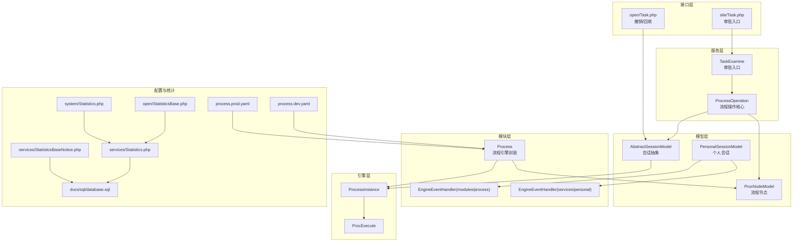
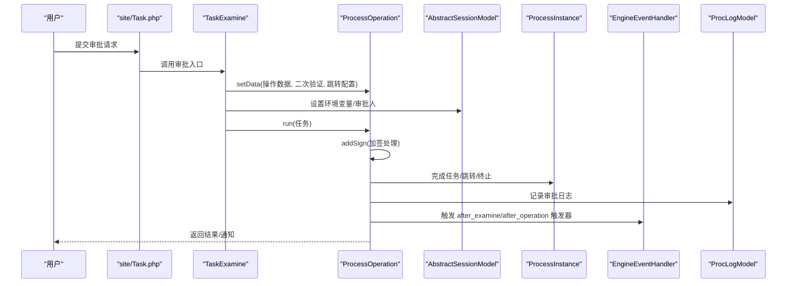
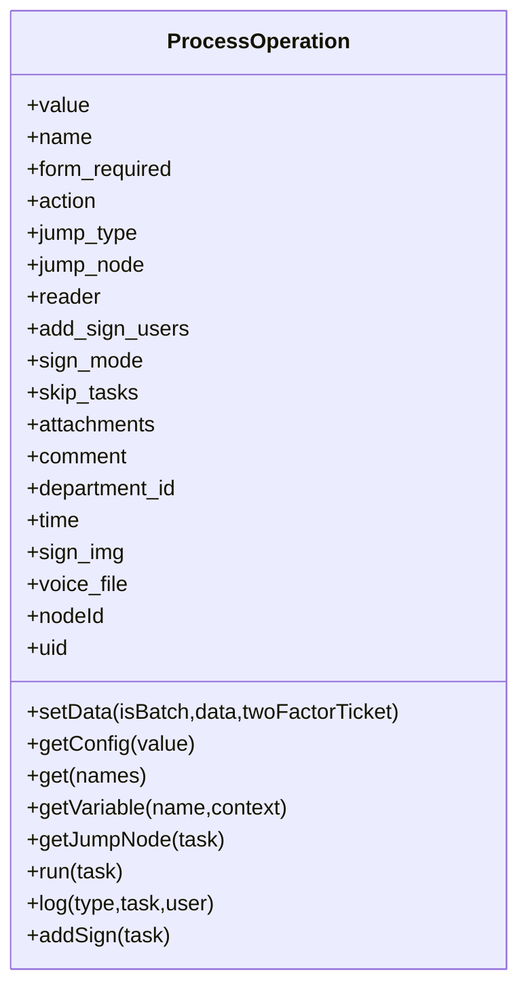
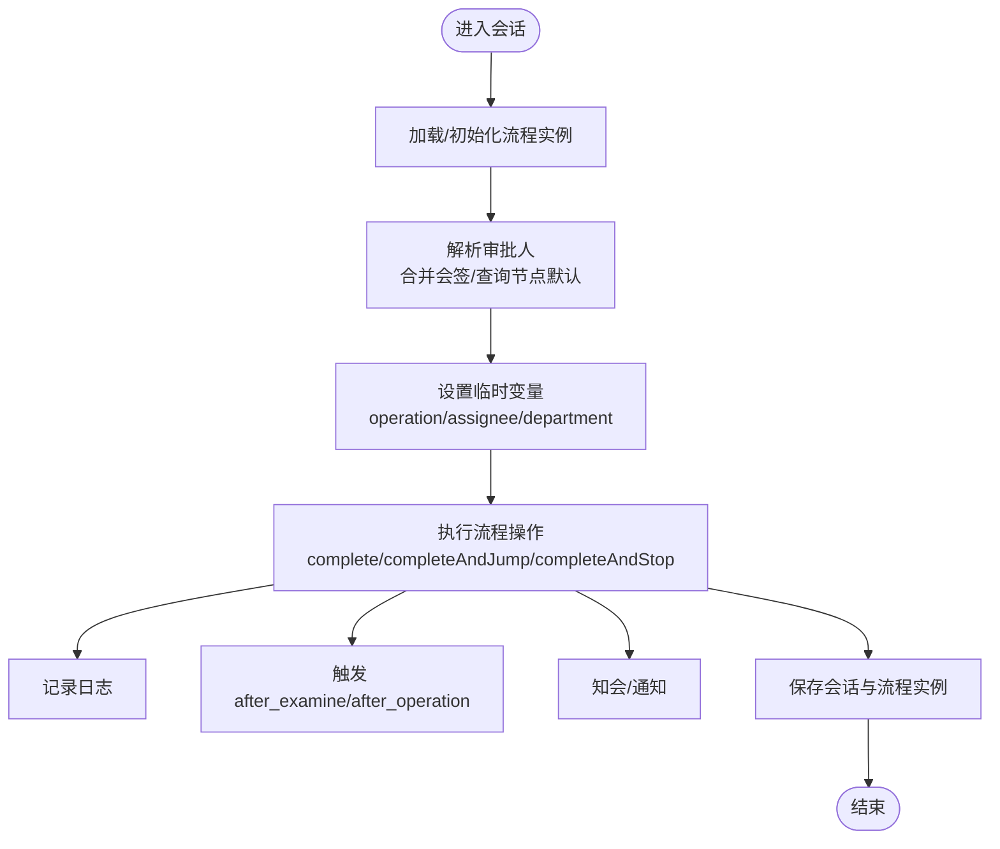
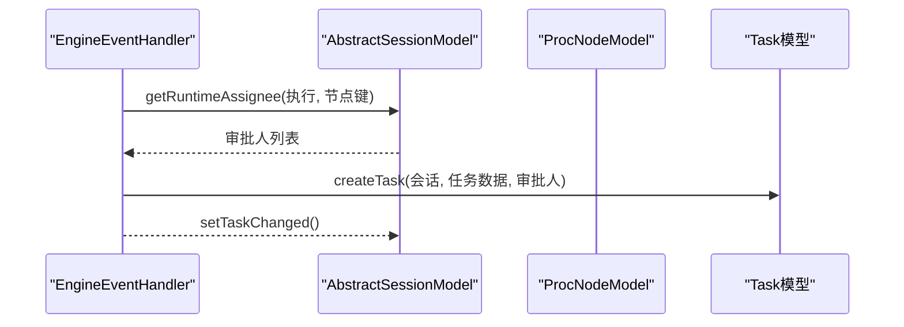
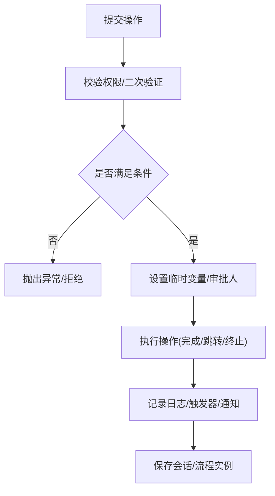
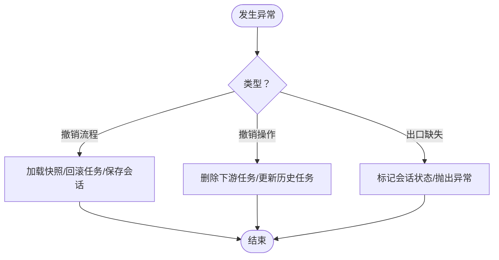
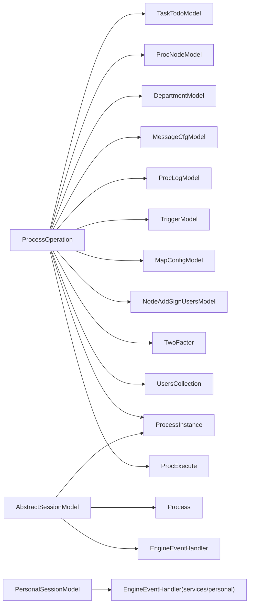
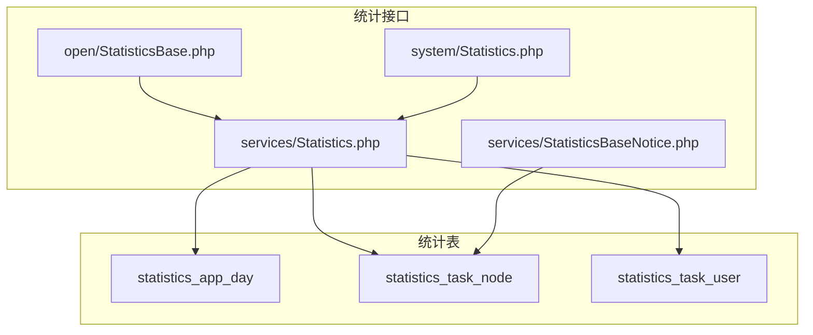

# 流程操作服务

<cite>
**本文引用的文件**
- [ProcessOperation.php](file://process/src/services/ProcessOperation.php)
- [AbstractSessionModel.php](file://process/src/models/AbstractSessionModel.php)
- [AbstractSessionModel.php（PersonalSessionModel.php）](file://process/src/models/PersonalSessionModel.php)
- [EngineEventHandler.php（modules/process）](file://process/src/modules/process/EngineEventHandler.php)
- [EngineEventHandler.php（services/personal)】](file://process/src/services/personal/EngineEventHandler.php)
- [ProcNodeModel.php](file://process/src/models/ProcNodeModel.php)
- [TaskExamine.php](file://process/src/services/TaskExamine.php)
- [Process.php](file://process/src/modules/Process.php)
- [ProcExecute.php](file://process/src/engine/ProcExecute.php)
- [ProcessInstance.php](file://process/src/engine/ProcessInstance.php)
- [Task.php（open）](file://process/src/http/open/Task.php)
- [Task.php（site）](file://process/src/http/site/Task.php)
- [process.dev.yaml](file://process/src/config/process.dev.yaml)
- [process.prod.yaml](file://process/src/config/process.prod.yaml)
- [SystemAuthAuthorizeModel.php](file://process/src/models/SystemAuthAuthorizeModel.php)
- [api.php](file://process/src/config/api.php)
- [StatisticsBase.php](file://process/src/http/open/StatisticsBase.php)
- [Statistics.php（system）](file://process/src/http/system/Statistics.php)
- [Statistics.php（services）](file://process/src/services/Statistics.php)
- [StatisticsBaseNotice.php](file://process/src/services/StatisticsBaseNotice.php)
- [database.sql](file://process/docs/sql/database.sql)
</cite>

## 目录
1. [简介](#简介)
2. [项目结构](#项目结构)
3. [核心组件](#核心组件)
4. [架构总览](#架构总览)
5. [详细组件分析](#详细组件分析)
6. [依赖关系分析](#依赖关系分析)
7. [性能与监控](#性能与监控)
8. [故障排查指南](#故障排查指南)
9. [结论](#结论)
10. [附录](#附录)

## 简介
本文件围绕 htdNew 项目中的流程操作服务，系统性阐述 ProcessOperation 的核心功能与实现机制，覆盖流程实例管理、任务执行控制、流程状态转换、生命周期管理、节点执行逻辑、并行/串行处理策略、权限控制、会签处理、异常恢复、配置管理、性能监控与故障诊断，并提供使用示例、最佳实践与常见问题解决方案。

## 项目结构
流程操作服务位于 process/src 目录下，主要涉及以下模块：
- services 层：流程操作核心类 ProcessOperation，以及与流程节点、会话、日志、触发器等交互的服务层逻辑
- models 层：会话抽象模型 AbstractSessionModel、个人会话 PersonalSessionModel、流程节点 ProcNodeModel 等
- modules 层：流程引擎封装 Process，事件处理器 EngineEventHandler
- engine 层：对底层引擎对象的轻量包装（ProcessInstance、ProcExecute）
- http 层：对外接口，如 open/Task.php 提供撤销、回收等能力；site/Task.php 提供审批入口
- config 层：进程与运行时配置（process.dev.yaml、process.prod.yaml）
- services/statistics 与 http/system、http/open 下的统计接口：提供流程监控与报表能力

**图表来源**
- [ProcessOperation.php](file://process/src/services/ProcessOperation.php#L1-L375)
- [AbstractSessionModel.php](file://process/src/models/AbstractSessionModel.php#L1-L152)
- [PersonalSessionModel.php](file://process/src/models/PersonalSessionModel.php#L72-L122)
- [ProcNodeModel.php](file://process/src/models/ProcNodeModel.php#L41-L89)
- [Process.php](file://process/src/modules/Process.php#L1-L47)
- [EngineEventHandler.php（modules/process）](file://process/src/modules/process/EngineEventHandler.php#L82-L121)
- [EngineEventHandler.php（services/personal)】](file://process/src/services/personal/EngineEventHandler.php#L74-L115)
- [ProcessInstance.php](file://process/src/engine/ProcessInstance.php#L1-L11)
- [ProcExecute.php](file://process/src/engine/ProcExecute.php#L1-L11)
- [Task.php（open）](file://process/src/http/open/Task.php#L106-L146)
- [Task.php（site）](file://process/src/http/site/Task.php#L269-L305)
- [process.dev.yaml](file://process/src/config/process.dev.yaml#L1-L89)
- [process.prod.yaml](file://process/src/config/process.prod.yaml#L1-L80)
- [StatisticsBase.php](file://process/src/http/open/StatisticsBase.php#L73-L116)
- [Statistics.php（system）](file://process/src/http/system/Statistics.php#L465-L499)
- [Statistics.php（services）](file://process/src/services/Statistics.php#L360-L382)
- [StatisticsBaseNotice.php](file://process/src/services/StatisticsBaseNotice.php#L402-L428)
- [database.sql](file://process/docs/sql/database.sql#L1313-L1345)

**章节来源**
- [ProcessOperation.php](file://process/src/services/ProcessOperation.php#L1-L375)
- [AbstractSessionModel.php](file://process/src/models/AbstractSessionModel.php#L1-L152)
- [Process.php](file://process/src/modules/Process.php#L1-L47)

## 核心组件
- ProcessOperation：流程操作的核心载体，负责接收用户提交的操作数据、校验配置、设置上下文、执行默认/跳转/终止动作、记录日志、触发器、知会、加签等
- AbstractSessionModel/PersonalSessionModel：会话抽象与个人会话，承载流程实例、审批人解析、临时变量、快照与持久化
- ProcNodeModel：流程节点模型，提供节点配置、会签类型判断、任务创建等
- Process：流程引擎封装，提供节点映射、引擎对象获取、节点查找等
- EngineEventHandler：事件处理器，负责创建任务、多实例数据、子流程等
- ProcessInstance/ProcExecute：对底层引擎对象的包装，确保序列化兼容
- TaskExamine：审批入口服务，负责设置环境变量、设置审批人、执行操作、快照与消息通知
- open/Task.php 与 site/Task.php：对外接口，提供撤销/回收与审批入口

**章节来源**
- [ProcessOperation.php](file://process/src/services/ProcessOperation.php#L1-L375)
- [AbstractSessionModel.php](file://process/src/models/AbstractSessionModel.php#L1-L152)
- [ProcNodeModel.php](file://process/src/models/ProcNodeModel.php#L41-L89)
- [Process.php](file://process/src/modules/Process.php#L1-L47)
- [EngineEventHandler.php（modules/process）](file://process/src/modules/process/EngineEventHandler.php#L82-L121)
- [ProcessInstance.php](file://process/src/engine/ProcessInstance.php#L1-L11)
- [ProcExecute.php](file://process/src/engine/ProcExecute.php#L1-L11)
- [TaskExamine.php](file://process/src/services/TaskExamine.php#L183-L220)
- [Task.php（open）](file://process/src/http/open/Task.php#L106-L146)
- [Task.php（site）](file://process/src/http/site/Task.php#L269-L305)

## 架构总览
ProcessOperation 作为流程操作的统一入口，贯穿“数据校验—上下文设置—执行动作—日志与触发—通知与加签”的完整链路。其与会话模型、节点模型、引擎封装、事件处理器协同，形成从“用户提交”到“流程推进/终止/跳转”的闭环。

**图表来源**
- [Task.php（site）](file://process/src/http/site/Task.php#L269-L305)
- [TaskExamine.php](file://process/src/services/TaskExamine.php#L183-L220)
- [ProcessOperation.php](file://process/src/services/ProcessOperation.php#L232-L304)
- [AbstractSessionModel.php](file://process/src/models/AbstractSessionModel.php#L1-L152)
- [EngineEventHandler.php（modules/process）](file://process/src/modules/process/EngineEventHandler.php#L82-L121)

## 详细组件分析

### ProcessOperation 组件分析
- 数据与配置
  - setData：根据操作值加载节点配置，校验表单必填、二次验证、跳转节点合法性，填充操作对象属性（意见、附件、手写签批、语音留言、加签人员、跳过任务等）
  - getConfig/get：基于节点配置返回操作元信息与变量访问（operation、assignee、department、name_comment、time、voice_file、sign_img 等）
- 执行与状态转换
  - run：设置协程上下文，执行加签，完成任务；根据 action 执行默认完成、跳转（含 jump_type）或终止；记录日志；触发 after_examine/after_operation 触发器；知会与通知
  - getJumpNode：支持跳转至来源节点（source）
- 加签与并行/串行处理
  - addSign：保存加签数据，支持并行加签向引擎追加实例；设置上下文标志位，便于后续流程识别
- 日志与通知
  - log：根据加签模式调整日志类型，记录审批意见、附件、签批与语音文件等

**图表来源**
- [ProcessOperation.php](file://process/src/services/ProcessOperation.php#L1-L375)

**章节来源**
- [ProcessOperation.php](file://process/src/services/ProcessOperation.php#L108-L158)
- [ProcessOperation.php](file://process/src/services/ProcessOperation.php#L161-L165)
- [ProcessOperation.php](file://process/src/services/ProcessOperation.php#L167-L215)
- [ProcessOperation.php](file://process/src/services/ProcessOperation.php#L216-L227)
- [ProcessOperation.php](file://process/src/services/ProcessOperation.php#L232-L304)
- [ProcessOperation.php](file://process/src/services/ProcessOperation.php#L306-L333)
- [ProcessOperation.php](file://process/src/services/ProcessOperation.php#L337-L375)

### 会话与流程实例管理
- AbstractSessionModel
  - getProcessInstance：延迟加载流程实例，初始化引擎与事件处理器
  - getRuntimeAssignee：根据节点类型与上下文，合并会签审批人或查询实时审批人
  - setTmpVariable/getProcVariableSimple：临时变量与流程变量读取
- PersonalSessionModel
  - getHandler：返回个人事件处理器
  - saveProcess：序列化并持久化流程实例

**图表来源**
- [AbstractSessionModel.php](file://process/src/models/AbstractSessionModel.php#L1-L152)
- [PersonalSessionModel.php](file://process/src/models/PersonalSessionModel.php#L72-L122)
- [ProcessOperation.php](file://process/src/services/ProcessOperation.php#L232-L304)

**章节来源**
- [AbstractSessionModel.php](file://process/src/models/AbstractSessionModel.php#L32-L72)
- [AbstractSessionModel.php](file://process/src/models/AbstractSessionModel.php#L56-L112)
- [AbstractSessionModel.php](file://process/src/models/AbstractSessionModel.php#L123-L152)
- [PersonalSessionModel.php](file://process/src/models/PersonalSessionModel.php#L90-L107)

### 节点执行逻辑与并行/串行处理
- ProcNodeModel
  - isMultiInstance/isSequence：判断节点是否为多实例（会签）、是否为顺序会签
  - 会签类型常量：竞争、并行会签、串行会签
- 引擎事件处理器
  - createUserTask：根据节点与审批人创建任务，支持多实例数据获取
  - createSubProcess：预留子流程创建
  - getUserTaskMultiInstanceData：获取多实例审批人数据

**图表来源**
- [ProcNodeModel.php](file://process/src/models/ProcNodeModel.php#L41-L89)
- [EngineEventHandler.php（modules/process）](file://process/src/modules/process/EngineEventHandler.php#L82-L121)
- [EngineEventHandler.php（services/personal)】](file://process/src/services/personal/EngineEventHandler.php#L74-L115)

**章节来源**
- [ProcNodeModel.php](file://process/src/models/ProcNodeModel.php#L41-L89)
- [EngineEventHandler.php（modules/process）](file://process/src/modules/process/EngineEventHandler.php#L82-L121)
- [EngineEventHandler.php（services/personal)】](file://process/src/services/personal/EngineEventHandler.php#L74-L115)

### 生命周期管理与权限控制
- 生命周期
  - 会话加载流程实例 → 设置临时变量 → 执行操作 → 记录日志 → 触发器 → 保存会话
- 权限控制
  - 系统授权模型提供流程监控相关权限项（查看、修改、终止、完成）
  - 接口权限配置包含流程监控相关 API（督办跳转、更换审批人等）

**图表来源**
- [SystemAuthAuthorizeModel.php](file://process/src/models/SystemAuthAuthorizeModel.php#L126-L163)
- [api.php](file://process/src/config/api.php#L561-L598)

**章节来源**
- [SystemAuthAuthorizeModel.php](file://process/src/models/SystemAuthAuthorizeModel.php#L126-L163)
- [api.php](file://process/src/config/api.php#L561-L598)

### 会签处理与异常恢复
- 会签处理
  - 并行/串行会签由节点配置决定；addSign 支持并行加签向引擎追加实例
- 异常恢复
  - open/Task.php 提供撤销流程与撤销操作（针对加签、待处理、处理加签）
  - site/Task.php 在找不到合适出口或审批人缺失时抛出明确异常并打标

**图表来源**
- [Task.php（open）](file://process/src/http/open/Task.php#L106-L146)
- [Task.php（site）](file://process/src/http/site/Task.php#L269-L305)

**章节来源**
- [Task.php（open）](file://process/src/http/open/Task.php#L106-L146)
- [Task.php（site）](file://process/src/http/site/Task.php#L269-L305)

## 依赖关系分析
- ProcessOperation 依赖
  - 模型：TaskTodoModel、ProcNodeModel、DepartmentModel、MessageCfgModel、ProcLogModel、TriggerModel、MapConfigModel、NodeAddSignUsersModel
  - 服务：TwoFactor、UsersCollection
  - 引擎：ProcessInstance、ProcExecute
- 会话与引擎
  - AbstractSessionModel 依赖 Process 与 EngineEventHandler，间接依赖底层引擎对象
- 接口与统计
  - open/Task.php 与 site/Task.php 依赖会话与任务模型，统计接口依赖统计服务与数据库表

**图表来源**
- [ProcessOperation.php](file://process/src/services/ProcessOperation.php#L1-L375)
- [AbstractSessionModel.php](file://process/src/models/AbstractSessionModel.php#L1-L152)
- [PersonalSessionModel.php](file://process/src/models/PersonalSessionModel.php#L72-L122)
- [Process.php](file://process/src/modules/Process.php#L1-L47)

**章节来源**
- [ProcessOperation.php](file://process/src/services/ProcessOperation.php#L1-L375)
- [AbstractSessionModel.php](file://process/src/models/AbstractSessionModel.php#L1-L152)

## 性能与监控
- 运行时配置
  - process.dev.yaml/process.prod.yaml 提供进程数量、CPU 亲和、业务配置文件路径等，影响并发与稳定性
- 统计与报表
  - open/StatisticsBase.php/system/Statistics.php/services/Statistics.php 提供节点效率、平均处理时长、月申请量等指标
  - StatisticsBaseNotice.php 提供模板化报表生成
  - database.sql 定义统计表结构（应用日统计、节点统计、用户节点统计等）

**图表来源**
- [process.dev.yaml](file://process/src/config/process.dev.yaml#L1-L89)
- [process.prod.yaml](file://process/src/config/process.prod.yaml#L1-L80)
- [StatisticsBase.php](file://process/src/http/open/StatisticsBase.php#L73-L116)
- [Statistics.php（system）](file://process/src/http/system/Statistics.php#L465-L499)
- [Statistics.php（services）](file://process/src/services/Statistics.php#L360-L382)
- [StatisticsBaseNotice.php](file://process/src/services/StatisticsBaseNotice.php#L402-L428)
- [database.sql](file://process/docs/sql/database.sql#L1313-L1345)

**章节来源**
- [process.dev.yaml](file://process/src/config/process.dev.yaml#L1-L89)
- [process.prod.yaml](file://process/src/config/process.prod.yaml#L1-L80)
- [StatisticsBase.php](file://process/src/http/open/StatisticsBase.php#L73-L116)
- [Statistics.php（system）](file://process/src/http/system/Statistics.php#L465-L499)
- [Statistics.php（services）](file://process/src/services/Statistics.php#L360-L382)
- [StatisticsBaseNotice.php](file://process/src/services/StatisticsBaseNotice.php#L402-L428)
- [database.sql](file://process/docs/sql/database.sql#L1313-L1345)

## 故障排查指南
- 常见异常与定位
  - 找不到合适的出口：site/Task.php 抛出异常并标记会话状态
  - 无法找到处理人：EngineEventHandler 抛出异常并提示联系管理员
  - 撤销/回收失败：open/Task.php 对已处理任务返回错误提示
- 日志与审计
  - ProcessOperation.log 记录审批日志，包含任务、操作、意见、附件、签批与语音文件
  - 统计接口可用于定位异常节点与异常时段
- 快照与回滚
  - 会话支持快照与加载，便于在异常时回滚到上一状态

**章节来源**
- [Task.php（site）](file://process/src/http/site/Task.php#L269-L305)
- [EngineEventHandler.php（modules/process）](file://process/src/modules/process/EngineEventHandler.php#L82-L121)
- [Task.php（open）](file://process/src/http/open/Task.php#L106-L146)
- [ProcessOperation.php](file://process/src/services/ProcessOperation.php#L306-L333)

## 结论
ProcessOperation 以“配置驱动 + 上下文隔离 + 触发器扩展”的方式，实现了流程操作的标准化与可扩展性。通过与会话模型、节点模型、引擎封装、事件处理器的协作，能够稳定地支撑默认完成、跳转、终止、加签、知会、通知等复杂场景。配合完善的权限控制、统计监控与异常恢复机制，可满足生产环境对流程治理与可观测性的要求。

## 附录
- 使用示例（步骤说明）
  - 审批入口：调用 site/Task.php 提交审批，内部通过 TaskExamine 设置环境变量与审批人，再调用 ProcessOperation::run 执行
  - 撤销/回收：调用 open/Task.php 的撤销接口，按类型区分撤销流程或撤销具体操作
  - 监控与报表：通过 open/StatisticsBase.php 或 system/Statistics.php 获取节点效率、平均处理时长等指标
- 最佳实践
  - 明确节点配置（会签类型、跳转规则、表单必填），避免运行期异常
  - 合理使用临时变量与流程变量，保持上下文一致性
  - 对关键节点启用触发器与日志，便于审计与回溯
  - 利用统计接口定期巡检流程瓶颈与异常节点
- 常见问题
  - “找不到处理人”：检查节点审批人策略与会话 runtime assignee 解析逻辑
  - “无法跳转”：确认跳转节点与 jump_type 配置是否匹配
  - “加签无效”：确认 sign_mode 与 add_sign_users 配置，并检查引擎实例追加逻辑