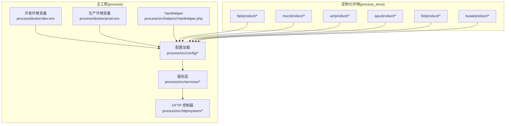
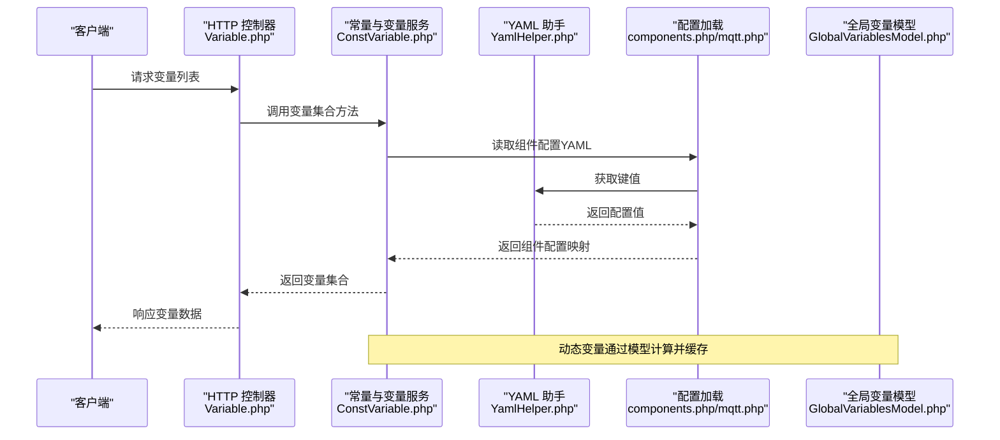
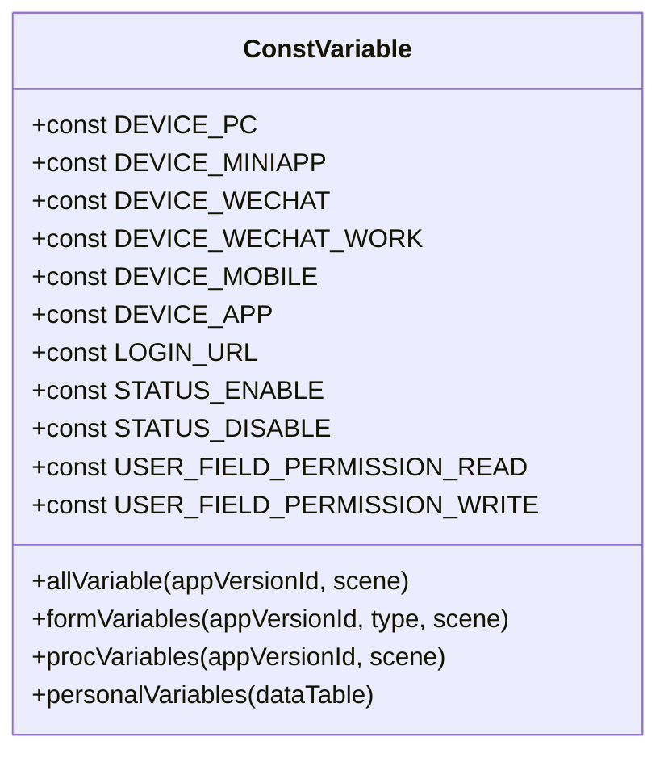
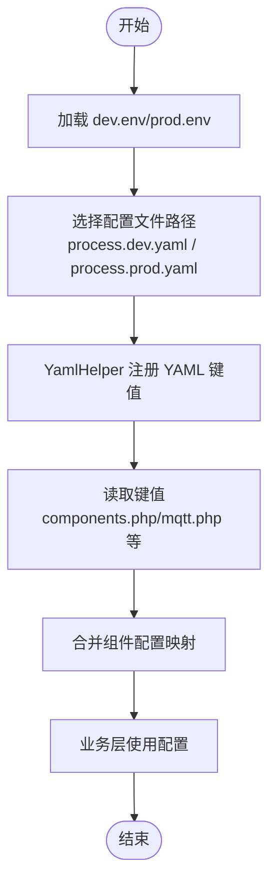
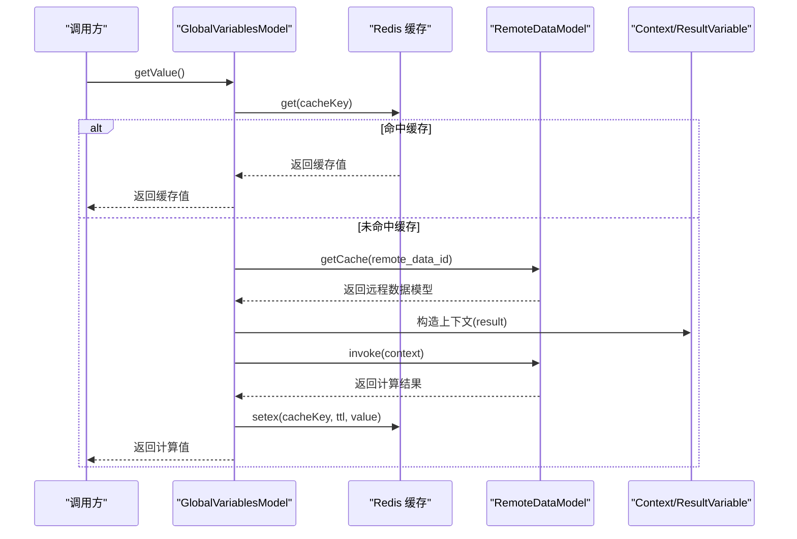
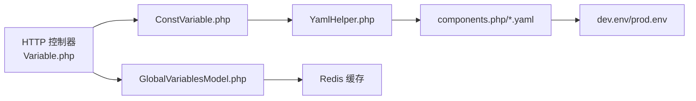

# 环境服务

<cite>
**本文引用的文件**
- [process/README.MD](file://process/README.MD)
- [process/src/services/Envs.php](file://process/src/services/Envs.php)
- [process/src/services/ConstVariable.php](file://process/src/services/ConstVariable.php)
- [process/src/http/system/Variable.php](file://process/src/http/system/Variable.php)
- [process/src/helpers/YamlHelper.php](file://process/src/helpers/YamlHelper.php)
- [process/src/config/mqtt.php](file://process/src/config/mqtt.php)
- [process/docker/dev.env](file://process/docker/dev.env)
- [process/docker/prod.env](file://process/docker/prod.env)
- [process_envs/bpi/product/components.php](file://process_envs/bpi/product/components.php)
- [process_envs/bpi/product/variables/FdyOrBzrVariable.php](file://process_envs/bpi/product/variables/FdyOrBzrVariable.php)
- [process_envs/bpi/product/events.php](file://process_envs/bpi/product/events.php)
- [process_envs/bpi/product/datasource/BpiUserInfoDataSource.php](file://process_envs/bpi/product/datasource/BpiUserInfoDataSource.php)
- [process_envs/bpi/product/task/SyncJobTask.php](file://process_envs/bpi/product/task/SyncJobTask.php)
- [process_envs/bpi/product/commands/Sync.php](file://process_envs/bpi/product/commands/Sync.php)
- [process_envs/bpi/product/listeners/ChangeUserLogOutEventListener.php](file://process_envs/bpi/product/listeners/ChangeUserLogOutEventListener.php)
- [process_envs/muc/product/components.php](file://process_envs/muc/product/components.php)
- [process_envs/uir/product/components.php](file://process_envs/uir/product/components.php)
- [process_envs/qau/product/components.php](file://process_envs/qau/product/components.php)
- [process_envs/bit/product/components.php](file://process_envs/bit/product/components.php)
- [process_envs/buaa/product/components.php](file://process_envs/buaa/product/components.php)
- [process/src/models/GlobalVariablesModel.php](file://process/src/models/GlobalVariablesModel.php)
- [process/src/http/system/GlobalVariable.php](file://process/src/http/system/GlobalVariable.php)
</cite>

## 目录
1. [简介](#简介)
2. [项目结构](#项目结构)
3. [核心组件](#核心组件)
4. [架构总览](#架构总览)
5. [详细组件分析](#详细组件分析)
6. [依赖关系分析](#依赖关系分析)
7. [性能考虑](#性能考虑)
8. [故障排查指南](#故障排查指南)
9. [结论](#结论)
10. [附录](#附录)

## 简介
本文件面向 htdNew 项目的“环境服务”，聚焦以下目标：
- 深入解释 Envs 与 ConstVariable 的实现机制，涵盖环境变量管理、常量定义与配置加载。
- 说明环境切换、配置继承与覆盖机制。
- 阐述环境变量的安全处理、敏感信息保护与动态更新策略。
- 提供性能优化、缓存机制与一致性保障方案。
- 给出最佳实践、部署指南与故障诊断方法。

## 项目结构
htdNew 采用“主工程 + 多客户定制”的分层组织方式：
- 主工程位于 process/，包含通用框架、HTTP 控制器、服务层与配置加载逻辑。
- 定制化环境位于 process_envs/<客户>/<环境>/，按产品/测试/预发布等模式组织，支持按需覆盖与扩展。
- Docker 环境通过 dev.env/prod.env 注入运行时参数，驱动容器与配置文件路径选择。

图表来源
- [process/README.MD](file://process/README.MD#L151-L158)
- [process/docker/dev.env](file://process/docker/dev.env#L1-L50)
- [process/docker/prod.env](file://process/docker/prod.env#L1-L46)
- [process/src/helpers/YamlHelper.php](file://process/src/helpers/YamlHelper.php#L1-L7)
- [process/src/config/mqtt.php](file://process/src/config/mqtt.php#L1-L9)

章节来源
- [process/README.MD](file://process/README.MD#L151-L158)
- [process/docker/dev.env](file://process/docker/dev.env#L1-L50)
- [process/docker/prod.env](file://process/docker/prod.env#L1-L46)

## 核心组件
- Envs（已废弃）：早期用于按环境名拼装路径与模型类名的工具类，当前已注释掉核心逻辑，保留注释以示废弃状态。
- ConstVariable：集中定义设备类型、登录入口、用户字段权限等常量，并提供变量集合查询接口（如系统变量、流程变量、待办变量等），由 HTTP 控制器调用。
- YamlHelper：对底层 YAML 辅助库的轻量封装，统一从 YAML 中读取键值。
- 配置加载：通过 include components.php 或具体配置文件（如 mqtt.php）读取 YAML，实现按环境覆盖与合并。
- 全局变量模型：支持静态值与远程数据动态值两类，动态值具备缓存与上下文计算能力。

章节来源
- [process/src/services/Envs.php](file://process/src/services/Envs.php#L1-L44)
- [process/src/services/ConstVariable.php](file://process/src/services/ConstVariable.php#L1-L52)
- [process/src/helpers/YamlHelper.php](file://process/src/helpers/YamlHelper.php#L1-L7)
- [process/src/config/mqtt.php](file://process/src/config/mqtt.php#L1-L9)
- [process/src/models/GlobalVariablesModel.php](file://process/src/models/GlobalVariablesModel.php#L1-L53)

## 架构总览
环境服务的整体工作流如下：
- 运行时通过 dev.env/prod.env 设置关键环境变量（如容器镜像、配置文件路径、日志目录等）。
- 配置加载阶段，YamlHelper 读取 YAML 并注册命名空间，components.php 返回键值映射，供各模块 include 使用。
- 业务层通过 ConstVariable 提供变量集合；HTTP 层通过控制器聚合变量并返回给前端。
- 全局变量模型支持静态值与远程数据动态值，动态值通过缓存键提升性能。

图表来源
- [process/src/http/system/Variable.php](file://process/src/http/system/Variable.php#L1-L265)
- [process/src/services/ConstVariable.php](file://process/src/services/ConstVariable.php#L1-L52)
- [process/src/helpers/YamlHelper.php](file://process/src/helpers/YamlHelper.php#L1-L7)
- [process/src/config/mqtt.php](file://process/src/config/mqtt.php#L1-L9)
- [process/src/models/GlobalVariablesModel.php](file://process/src/models/GlobalVariablesModel.php#L1-L53)

## 详细组件分析

### Envs（已废弃）
- 设计意图：根据环境名动态拼接路径与模型类名，便于多环境隔离。
- 当前状态：核心逻辑被注释，仅保留注释说明其已废弃。
- 影响：不再参与运行时路径解析与类加载，建议删除或迁移至其他机制。

章节来源
- [process/src/services/Envs.php](file://process/src/services/Envs.php#L1-L44)

### ConstVariable（常量与变量服务）
- 角色定位：集中定义设备类型、登录入口、用户字段权限等常量；提供变量集合查询接口，供 HTTP 控制器聚合展示。
- 关键点：
  - 设备类型常量与枚举，便于前端/移动端适配。
  - 登录入口常量，统一登录跳转路径。
  - 用户字段权限常量，控制只读/可写。
  - 变量集合方法（如系统变量、流程变量、待办变量等）由 HTTP 控制器调用，形成统一的变量视图。

图表来源
- [process/src/services/ConstVariable.php](file://process/src/services/ConstVariable.php#L1-L52)

章节来源
- [process/src/services/ConstVariable.php](file://process/src/services/ConstVariable.php#L1-L52)
- [process/src/http/system/Variable.php](file://process/src/http/system/Variable.php#L1-L265)

### YamlHelper（YAML 助手）
- 角色定位：对底层 YAML 辅助库进行轻量封装，提供统一的 get/注册能力。
- 在配置加载中的作用：被 components.php 与具体配置文件（如 mqtt.php）调用，读取键值并返回给业务层。

章节来源
- [process/src/helpers/YamlHelper.php](file://process/src/helpers/YamlHelper.php#L1-L7)
- [process/src/config/mqtt.php](file://process/src/config/mqtt.php#L1-L9)

### 配置加载与环境切换
- Docker 环境变量：dev.env/prod.env 定义镜像版本、端口、配置文件路径、日志目录等，决定运行时加载的 YAML 文件与容器行为。
- YAML 注册与读取：各定制化环境的 components.php 通过 YamlHelper 注册 YAML 并读取键值，形成组件配置映射。
- 配置覆盖机制：同一键在不同环境文件中出现时，后注册/后读取的值覆盖先前值，实现“低优先级默认值 + 高优先级覆盖”的层次化配置。

图表来源
- [process/docker/dev.env](file://process/docker/dev.env#L1-L50)
- [process/docker/prod.env](file://process/docker/prod.env#L1-L46)
- [process_envs/bpi/product/components.php](file://process_envs/bpi/product/components.php#L1-L7)
- [process_envs/muc/product/components.php](file://process_envs/muc/product/components.php#L1-L7)
- [process_envs/uir/product/components.php](file://process_envs/uir/product/components.php#L1-L7)
- [process_envs/qau/product/components.php](file://process_envs/qau/product/components.php#L1-L6)
- [process_envs/bit/product/components.php](file://process_envs/bit/product/components.php#L1-L6)
- [process_envs/buaa/product/components.php](file://process_envs/buaa/product/components.php#L1-L6)
- [process/src/config/mqtt.php](file://process/src/config/mqtt.php#L1-L9)

章节来源
- [process/docker/dev.env](file://process/docker/dev.env#L1-L50)
- [process/docker/prod.env](file://process/docker/prod.env#L1-L46)
- [process_envs/bpi/product/components.php](file://process_envs/bpi/product/components.php#L1-L7)
- [process_envs/muc/product/components.php](file://process_envs/muc/product/components.php#L1-L7)
- [process_envs/uir/product/components.php](file://process_envs/uir/product/components.php#L1-L7)
- [process_envs/qau/product/components.php](file://process_envs/qau/product/components.php#L1-L6)
- [process_envs/bit/product/components.php](file://process_envs/bit/product/components.php#L1-L6)
- [process_envs/buaa/product/components.php](file://process_envs/buaa/product/components.php#L1-L6)
- [process/src/config/mqtt.php](file://process/src/config/mqtt.php#L1-L9)

### 全局变量模型（动态更新与缓存）
- 结构：支持静态值与动态值两类；动态值通过远程数据模型计算，结果写入缓存并设置过期时间。
- 缓存键：以变量 ID 为后缀生成唯一键，避免冲突。
- 上下文：动态值计算时注入上下文对象，确保数据链路完整。

图表来源
- [process/src/models/GlobalVariablesModel.php](file://process/src/models/GlobalVariablesModel.php#L1-L53)

章节来源
- [process/src/models/GlobalVariablesModel.php](file://process/src/models/GlobalVariablesModel.php#L1-L53)

### HTTP 控制器与变量聚合
- Variable 控制器：提供 all/common/global/notice/functions/report/personal 等接口，内部调用 ConstVariable 的变量集合方法，形成统一的变量视图返回给前端。
- 与全局变量联动：当需要全局变量时，控制器从数据库查询并组装键值前缀，最终返回给前端。

章节来源
- [process/src/http/system/Variable.php](file://process/src/http/system/Variable.php#L1-L265)
- [process/src/http/system/GlobalVariable.php](file://process/src/http/system/GlobalVariable.php#L1-L48)

## 依赖关系分析
- 组件耦合：
  - HTTP 控制器依赖 ConstVariable 提供变量集合。
  - 配置加载依赖 YamlHelper 与各环境的 components.php。
  - 全局变量模型依赖 Redis 缓存与远程数据模型。
- 外部依赖：
  - Docker 环境变量影响配置文件路径与容器镜像版本。
  - YAML 文件作为配置源，components.php 作为键值映射入口。

图表来源
- [process/src/http/system/Variable.php](file://process/src/http/system/Variable.php#L1-L265)
- [process/src/services/ConstVariable.php](file://process/src/services/ConstVariable.php#L1-L52)
- [process/src/helpers/YamlHelper.php](file://process/src/helpers/YamlHelper.php#L1-L7)
- [process/src/models/GlobalVariablesModel.php](file://process/src/models/GlobalVariablesModel.php#L1-L53)
- [process/docker/dev.env](file://process/docker/dev.env#L1-L50)
- [process/docker/prod.env](file://process/docker/prod.env#L1-L46)

章节来源
- [process/src/http/system/Variable.php](file://process/src/http/system/Variable.php#L1-L265)
- [process/src/services/ConstVariable.php](file://process/src/services/ConstVariable.php#L1-L52)
- [process/src/helpers/YamlHelper.php](file://process/src/helpers/YamlHelper.php#L1-L7)
- [process/src/models/GlobalVariablesModel.php](file://process/src/models/GlobalVariablesModel.php#L1-L53)
- [process/docker/dev.env](file://process/docker/dev.env#L1-L50)
- [process/docker/prod.env](file://process/docker/prod.env#L1-L46)

## 性能考虑
- 缓存策略：
  - 全局变量动态值使用 Redis 缓存，减少重复远程调用与计算开销。
  - 建议为高频变量设置合理的过期时间，平衡实时性与性能。
- 配置加载：
  - YAML 注册与读取尽量集中在启动阶段完成，避免运行时频繁 IO。
  - 对于大体量配置，建议拆分为多个文件并通过 include 组织，降低单文件体积。
- 一致性保障：
  - 通过 Docker 环境变量统一指定配置文件路径，避免因路径差异导致的不一致。
  - 对于跨环境共享的键，建议在默认 YAML 中提供稳定值，仅在特定环境覆盖。

[本节为通用指导，无需列出章节来源]

## 故障排查指南
- 环境变量未生效：
  - 检查 dev.env/prod.env 是否正确挂载到容器，确认配置文件路径与镜像版本。
  - 确认 components.php 中是否正确注册 YAML 并读取键值。
- 变量集合为空或异常：
  - 检查 ConstVariable 的变量集合方法调用参数（场景、类型、版本 ID）是否正确。
  - 查看 HTTP 控制器异常捕获与日志输出，定位上游错误。
- 全局变量动态值不更新：
  - 检查 Redis 缓存键是否存在与过期时间设置。
  - 确认远程数据模型返回结果与上下文构造是否正确。
- 配置覆盖不生效：
  - 确认 YAML 注册顺序与读取顺序，后注册的键值会覆盖先前值。
  - 检查 components.php 返回的映射是否包含目标键。

章节来源
- [process/docker/dev.env](file://process/docker/dev.env#L1-L50)
- [process/docker/prod.env](file://process/docker/prod.env#L1-L46)
- [process/src/http/system/Variable.php](file://process/src/http/system/Variable.php#L1-L265)
- [process/src/models/GlobalVariablesModel.php](file://process/src/models/GlobalVariablesModel.php#L1-L53)

## 结论
- Envs 已废弃，建议移除或重构替代方案。
- ConstVariable 提供了统一的变量集合与常量定义，是前端变量视图的核心来源。
- YAML + components.php 的组合实现了灵活的配置加载与覆盖，配合 Docker 环境变量可实现稳定的环境切换。
- 全局变量模型通过 Redis 缓存与上下文计算，兼顾性能与一致性。
- 建议在现有基础上完善安全与可观测性（敏感信息脱敏、缓存监控、配置变更审计）。

[本节为总结，无需列出章节来源]

## 附录

### 最佳实践清单
- 环境管理
  - 使用 dev.env/prod.env 明确区分开发与生产配置，避免硬编码。
  - 对跨环境共享的键，在默认 YAML 中提供稳定值，仅在特定环境覆盖。
- 配置加载
  - 将常用键集中于 components.php 返回映射，减少分散读取。
  - 对大体量配置拆分文件，按模块 include，提升可维护性。
- 变量与常量
  - 将设备类型、登录入口、权限常量收敛到 ConstVariable，统一管理。
  - 通过 HTTP 控制器聚合变量，保持接口一致性。
- 安全与敏感信息
  - 不在 YAML 中存储明文敏感信息；必要时通过环境变量注入并在运行时替换。
  - 对动态变量的远程调用增加超时与重试策略，避免阻塞。
- 性能与一致性
  - 为动态变量设置合理 TTL，结合缓存命中率监控持续优化。
  - 通过 Docker 环境变量固定配置文件路径，避免路径漂移导致的不一致。

[本节为通用指导，无需列出章节来源]