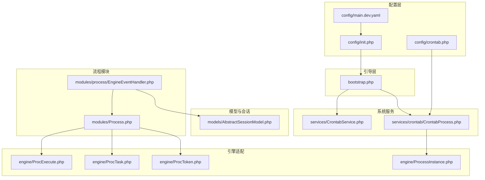
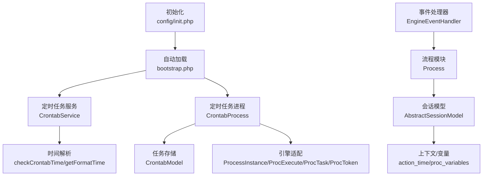
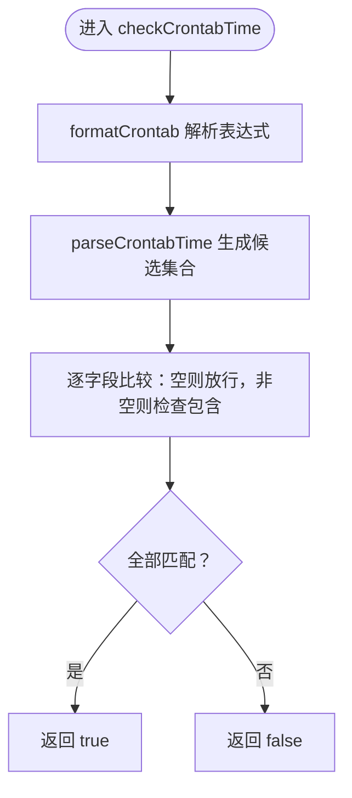
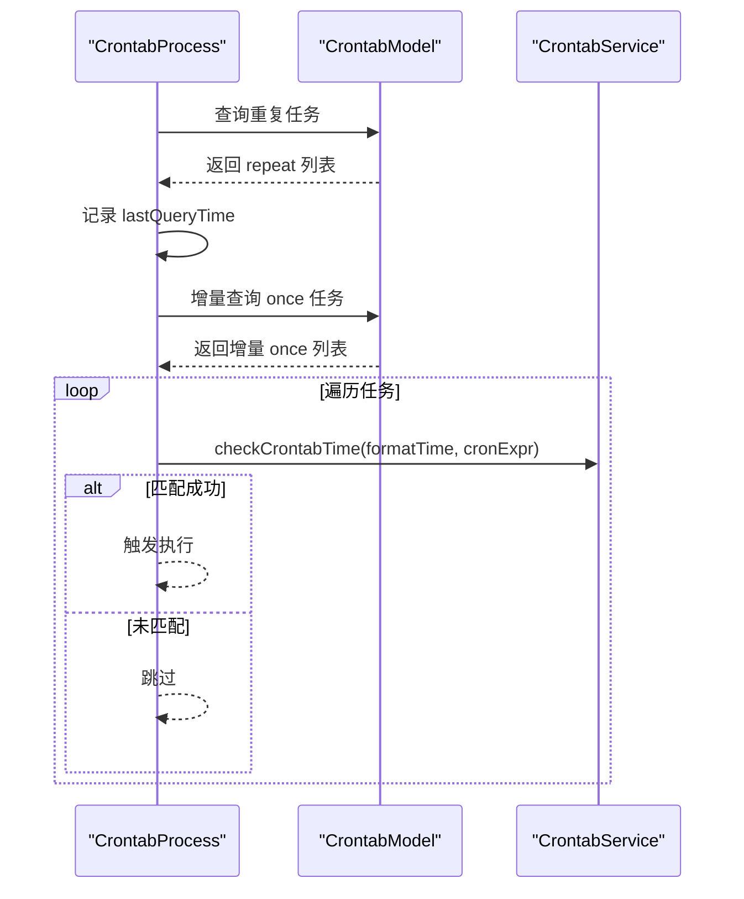
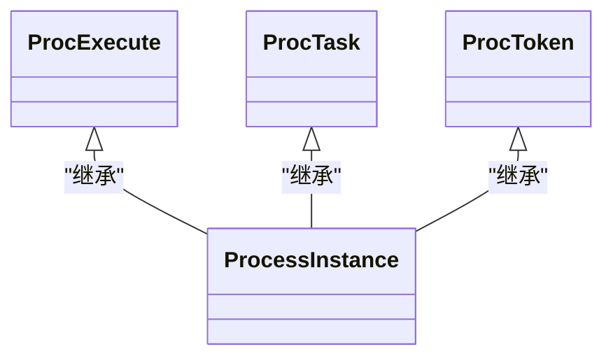
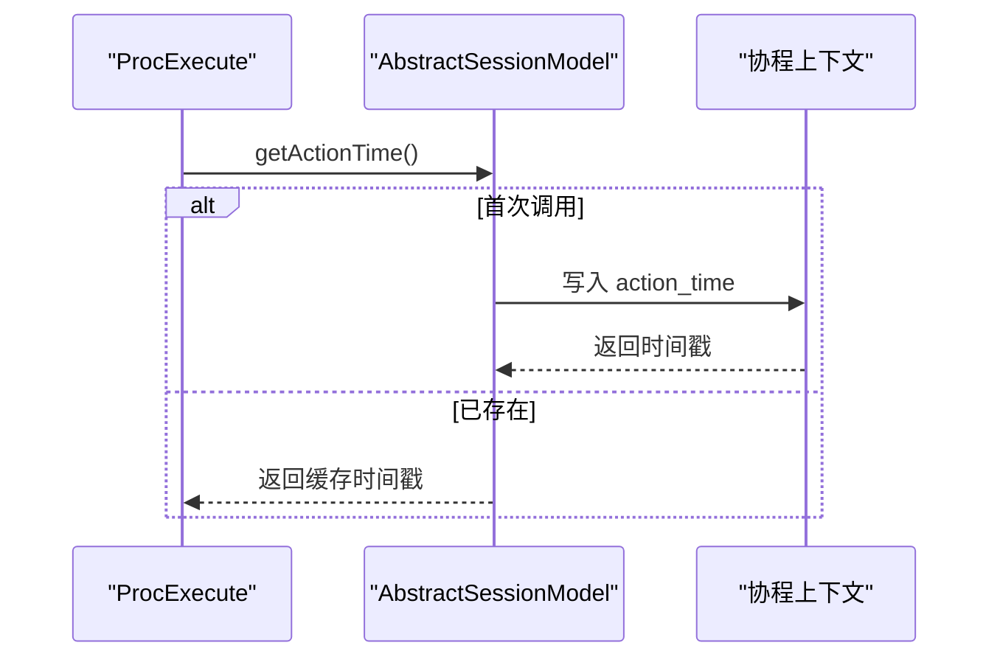
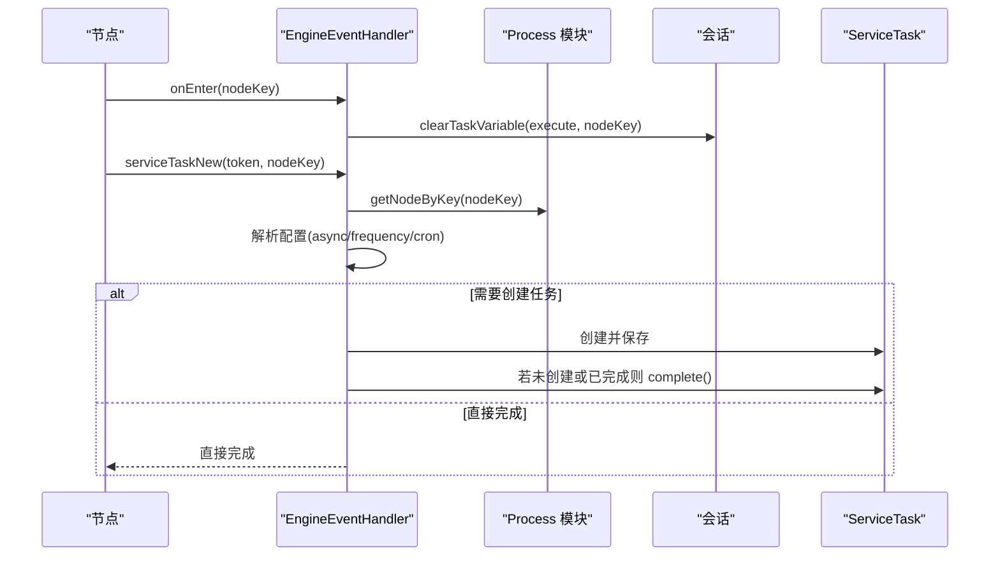
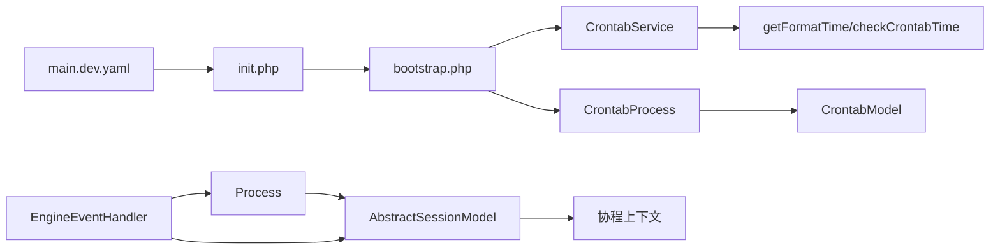

# 系统服务

<cite>
**本文引用的文件**
- [process\src\services\CrontabService.php](file://process\src\services\CrontabService.php)
- [process\src\services\crontab\CrontabProcess.php](file://process\src\services\crontab\CrontabProcess.php)
- [process\src\config\crontab.php](file://process\src\config\crontab.php)
- [process\src\config\init.php](file://process\src\config\init.php)
- [process\src\bootstrap.php](file://process\src\bootstrap.php)
- [process\src\config\main.dev.yaml](file://process\src\config\main.dev.yaml)
- [process\src\engine\ProcExecute.php](file://process\src\engine\ProcExecute.php)
- [process\src\engine\ProcTask.php](file://process\src\engine\ProcTask.php)
- [process\src\engine\ProcToken.php](file://process\src\engine\ProcToken.php)
- [process\src\engine\ProcessInstance.php](file://process\src\engine\ProcessInstance.php)
- [process\src\models\AbstractSessionModel.php](file://process\src\models\AbstractSessionModel.php)
- [process\src\modules\Process.php](file://process\src\modules\Process.php)
- [process\src\modules\process\EngineEventHandler.php](file://process\src\modules\process\EngineEventHandler.php)
- [process\src\migrations\migration_20251119_090014_proc_assignee.php](file://process\src\migrations\migration_20251119_090014_proc_assignee.php)
- [process\src\migrations\migration_20230530_100642_session_add_prov_version.php](file://process\src\migrations\migration_20230530_100642_session_add_prov_version.php)
- [process\docs\sql\database.sql](file://process\docs\sql\database.sql)
- [process\src\services\task\ProcessBatchOperate.php](file://process\src\services\task\ProcessBatchOperate.php)
</cite>

## 目录
1. [引言](#引言)
2. [项目结构](#项目结构)
3. [核心组件](#核心组件)
4. [架构总览](#架构总览)
5. [详细组件分析](#详细组件分析)
6. [依赖关系分析](#依赖关系分析)
7. [性能考量](#性能考量)
8. [故障排查指南](#故障排查指南)
9. [结论](#结论)
10. [附录](#附录)

## 引言
本文件面向 htdNew 项目的系统服务，聚焦系统级服务架构、定时任务管理与上下文处理机制。文档围绕以下目标展开：
- 系统服务核心功能：定时任务服务、流程操作处理、交互日志记录与参数管理
- 生命周期管理、环境变量处理与上下文传递机制
- 配置管理、接口设计与性能监控
- 运维监控与故障诊断实践

## 项目结构
htdNew 采用模块化与分层架构，系统服务主要位于 process/src/services 与 process/src/engine 下，配合 config 提供运行期配置与初始化逻辑；process_envs 下按学校/产品维度扩展任务与事件。

图表来源
- [process\src\config\init.php](file://process\src\config\init.php#L1-L48)
- [process\src\config\main.dev.yaml](file://process\src\config\main.dev.yaml#L1-L97)
- [process\src\config\crontab.php](file://process\src\config\crontab.php#L1-L10)
- [process\src\bootstrap.php](file://process\src\bootstrap.php#L1-L40)
- [process\src\services\CrontabService.php](file://process\src\services\CrontabService.php#L1-L84)
- [process\src\services\crontab\CrontabProcess.php](file://process\src\services\crontab\CrontabProcess.php#L1-L47)
- [process\src\engine\ProcExecute.php](file://process\src\engine\ProcExecute.php#L1-L11)
- [process\src\engine\ProcTask.php](file://process\src\engine\ProcTask.php#L1-L11)
- [process\src\engine\ProcToken.php](file://process\src\engine\ProcToken.php#L1-L11)
- [process\src\engine\ProcessInstance.php](file://process\src\engine\ProcessInstance.php#L1-L11)
- [process\src\models\AbstractSessionModel.php](file://process\src\models\AbstractSessionModel.php#L110-L160)
- [process\src\modules\Process.php](file://process\src\modules\Process.php#L1-L47)
- [process\src\modules\process\EngineEventHandler.php](file://process\src\modules\process\EngineEventHandler.php#L166-L302)

章节来源
- [process\src\config\init.php](file://process\src\config\init.php#L1-L48)
- [process\src\config\main.dev.yaml](file://process\src\config\main.dev.yaml#L1-L97)
- [process\src\config\crontab.php](file://process\src\config\crontab.php#L1-L10)
- [process\src\bootstrap.php](file://process\src\bootstrap.php#L1-L40)

## 核心组件
- 定时任务服务：解析 crontab 表达式、生成格式化时间、匹配执行时机
- 定时任务进程：拉取重复/一次性任务、增量查询、调度执行
- 引擎适配：对流程引擎对象进行轻量封装，保证序列化兼容
- 会话与上下文：统一动作时间、变量读写与清理
- 流程模块与事件处理器：流程节点进入/离开、服务任务创建与执行
- 批量操作与日志：批量挂起/删除、操作日志记录

章节来源
- [process\src\services\CrontabService.php](file://process\src\services\CrontabService.php#L1-L84)
- [process\src\services\crontab\CrontabProcess.php](file://process\src\services\crontab\CrontabProcess.php#L1-L47)
- [process\src\engine\ProcExecute.php](file://process\src\engine\ProcExecute.php#L1-L11)
- [process\src\engine\ProcTask.php](file://process\src\engine\ProcTask.php#L1-L11)
- [process\src\engine\ProcToken.php](file://process\src\engine\ProcToken.php#L1-L11)
- [process\src\engine\ProcessInstance.php](file://process\src\engine\ProcessInstance.php#L1-L11)
- [process\src\models\AbstractSessionModel.php](file://process\src\models\AbstractSessionModel.php#L110-L160)
- [process\src\modules\process\EngineEventHandler.php](file://process\src\modules\process\EngineEventHandler.php#L166-L302)
- [process\src\services\task\ProcessBatchOperate.php](file://process\src\services\task\ProcessBatchOperate.php#L48-L84)

## 架构总览
系统服务围绕“配置加载—引导注册—服务编排—流程引擎—会话上下文”展开，定时任务通过独立进程扫描数据库任务并触发执行；流程模块负责节点事件与任务创建，上下文贯穿于会话变量与动作时间。

图表来源
- [process\src\config\init.php](file://process\src\config\init.php#L1-L48)
- [process\src\bootstrap.php](file://process\src\bootstrap.php#L1-L40)
- [process\src\services\CrontabService.php](file://process\src\services\CrontabService.php#L1-L84)
- [process\src\services\crontab\CrontabProcess.php](file://process\src\services\crontab\CrontabProcess.php#L1-L47)
- [process\src\engine\ProcessInstance.php](file://process\src\engine\ProcessInstance.php#L1-L11)
- [process\src\engine\ProcExecute.php](file://process\src\engine\ProcExecute.php#L1-L11)
- [process\src\engine\ProcTask.php](file://process\src\engine\ProcTask.php#L1-L11)
- [process\src\engine\ProcToken.php](file://process\src\engine\ProcToken.php#L1-L11)
- [process\src\modules\process\EngineEventHandler.php](file://process\src\modules\process\EngineEventHandler.php#L166-L302)
- [process\src\modules\Process.php](file://process\src\modules\Process.php#L1-L47)
- [process\src\models\AbstractSessionModel.php](file://process\src\models\AbstractSessionModel.php#L110-L160)

## 详细组件分析

### 定时任务服务（CrontabService）
- 功能要点
  - 解析 crontab 时间表达式，支持 “*”、“-”、“/”、“,” 组合
  - 生成格式化时间数组（分、时、日、月、周），用于匹配
  - 匹配规则：若某字段为空表示允许任意值，否则必须在候选集合内
- 性能特征
  - 表达式解析为候选集合，匹配为集合包含判断，整体复杂度与字段粒度成正比
  - 对于“*”或全范围且步长为1的情况，跳过构建集合以减少开销
- 使用场景
  - 与 CrontabProcess 协作，驱动重复/一次性任务执行

图表来源
- [process\src\services\CrontabService.php](file://process\src\services\CrontabService.php#L1-L84)

章节来源
- [process\src\services\CrontabService.php](file://process\src\services\CrontabService.php#L1-L84)

### 定时任务进程（CrontabProcess）
- 功能要点
  - 重复任务：查询 enable 且 type=repeat 的任务集合
  - 一次性任务：基于 lastQueryTime 增量查询，缓存至 onceCrontabs，避免重复触发
  - 移除对象：预留接口（待实现）
- 数据来源
  - 依赖 CrontabModel 查询任务，结合 CrontabService 的解析能力
- 生命周期
  - 进程启动后持续轮询，按配置周期扫描任务并触发执行

图表来源
- [process\src\services\crontab\CrontabProcess.php](file://process\src\services\crontab\CrontabProcess.php#L1-L47)
- [process\src\services\CrontabService.php](file://process\src\services\CrontabService.php#L1-L84)

章节来源
- [process\src\services\crontab\CrontabProcess.php](file://process\src\services\crontab\CrontabProcess.php#L1-L47)
- [process\src\config\crontab.php](file://process\src\config\crontab.php#L1-L10)

### 引擎适配（ProcExecute/ProcTask/ProcToken/ProcessInstance）
- 设计意图
  - 对上游流程引擎对象进行轻量封装，确保序列化/反序列化兼容
  - 保持与业务模型的桥接，避免直接耦合第三方库
- 关系图

图表来源
- [process\src\engine\ProcessInstance.php](file://process\src\engine\ProcessInstance.php#L1-L11)
- [process\src\engine\ProcExecute.php](file://process\src\engine\ProcExecute.php#L1-L11)
- [process\src\engine\ProcTask.php](file://process\src\engine\ProcTask.php#L1-L11)
- [process\src\engine\ProcToken.php](file://process\src\engine\ProcToken.php#L1-L11)

章节来源
- [process\src\engine\ProcessInstance.php](file://process\src\engine\ProcessInstance.php#L1-L11)
- [process\src\engine\ProcExecute.php](file://process\src\engine\ProcExecute.php#L1-L11)
- [process\src\engine\ProcTask.php](file://process\src\engine\ProcTask.php#L1-L11)
- [process\src\engine\ProcToken.php](file://process\src\engine\ProcToken.php#L1-L11)

### 会话与上下文（AbstractSessionModel）
- 功能要点
  - 统一动作时间：通过协程上下文缓存 action_time，确保同一操作的时间一致性
  - 变量读写：支持按名称检索/设置流程变量，支持清理指定节点的变量
  - 与流程引擎交互：提供任务操作访问器，支撑节点进入/离开时的变量清理
- 关键路径
  - 获取动作时间：AbstractSessionModel::getActionTime
  - 清理任务变量：AbstractSessionModel::clearTaskVariable

图表来源
- [process\src\models\AbstractSessionModel.php](file://process\src\models\AbstractSessionModel.php#L110-L160)

章节来源
- [process\src\models\AbstractSessionModel.php](file://process\src\models\AbstractSessionModel.php#L110-L160)

### 流程模块与事件处理（Process/EngineEventHandler）
- 功能要点
  - Process：构建流程节点索引、默认开始事件、节点查找与引擎节点映射
  - EngineEventHandler：节点进入/离开回调、服务任务创建（含同步/异步、定时频率等配置）、手动任务完成判定
- 关键路径
  - 节点进入清理变量：EngineEventHandler::onEnter
  - 服务任务创建与执行：EngineEventHandler::serviceTaskNew

图表来源
- [process\src\modules\Process.php](file://process\src\modules\Process.php#L1-L47)
- [process\src\modules\process\EngineEventHandler.php](file://process\src\modules\process\EngineEventHandler.php#L166-L302)
- [process\src\models\AbstractSessionModel.php](file://process\src\models\AbstractSessionModel.php#L110-L160)

章节来源
- [process\src\modules\Process.php](file://process\src\modules\Process.php#L1-L47)
- [process\src\modules\process\EngineEventHandler.php](file://process\src\modules\process\EngineEventHandler.php#L166-L302)
- [process\src\models\AbstractSessionModel.php](file://process\src\models\AbstractSessionModel.php#L110-L160)

### 批量操作与日志（ProcessBatchOperate）
- 功能要点
  - 批量挂起：校验权限、状态，执行挂起并记录日志
  - 批量删除：事务包装、权限校验、备份与删除
- 日志记录
  - 使用统一日志接口记录操作类型与用户信息，便于审计与追踪

章节来源
- [process\src\services\task\ProcessBatchOperate.php](file://process\src\services\task\ProcessBatchOperate.php#L48-L84)

## 依赖关系分析
- 配置与引导
  - main.dev.yaml 提供通用配置（schema/host、数据库、Redis、日志级别等）
  - init.php 注册 YAML 配置、设置日志级别、初始化全局事件分发器
  - bootstrap.php 实现自动加载，按命名空间与目录映射加载类
- 定时任务
  - crontab.php 合并组件配置，CrontabProcess 依赖 CrontabModel 与 CrontabService
- 引擎与会话
  - Process/EngineEventHandler 依赖 AbstractSessionModel 与协程上下文，间接依赖引擎适配类
- 数据迁移
  - 迁移脚本定义会话与流程相关表结构，支撑运行期数据存储

图表来源
- [process\src\config\main.dev.yaml](file://process\src\config\main.dev.yaml#L1-L97)
- [process\src\config\init.php](file://process\src\config\init.php#L1-L48)
- [process\src\bootstrap.php](file://process\src\bootstrap.php#L1-L40)
- [process\src\services\CrontabService.php](file://process\src\services\CrontabService.php#L1-L84)
- [process\src\services\crontab\CrontabProcess.php](file://process\src\services\crontab\CrontabProcess.php#L1-L47)
- [process\src\models\AbstractSessionModel.php](file://process\src\models\AbstractSessionModel.php#L110-L160)
- [process\src\modules\Process.php](file://process\src\modules\Process.php#L1-L47)
- [process\src\modules\process\EngineEventHandler.php](file://process\src\modules\process\EngineEventHandler.php#L166-L302)

章节来源
- [process\src\config\main.dev.yaml](file://process\src\config\main.dev.yaml#L1-L97)
- [process\src\config\init.php](file://process\src\config\init.php#L1-L48)
- [process\src\bootstrap.php](file://process\src\bootstrap.php#L1-L40)
- [process\src\services\CrontabService.php](file://process\src\services\CrontabService.php#L1-L84)
- [process\src\services\crontab\CrontabProcess.php](file://process\src\services\crontab\CrontabProcess.php#L1-L47)
- [process\src\models\AbstractSessionModel.php](file://process\src\models\AbstractSessionModel.php#L110-L160)
- [process\src\modules\Process.php](file://process\src\modules\Process.php#L1-L47)
- [process\src\modules\process\EngineEventHandler.php](file://process\src\modules\process\EngineEventHandler.php#L166-L302)

## 性能考量
- 定时任务
  - 表达式解析仅在必要时生成候选集合，避免全量枚举
  - 增量查询一次性任务，减少全表扫描
- 引擎适配
  - 封装第三方对象，降低耦合并提升序列化稳定性
- 会话上下文
  - 动作时间缓存避免重复计算，变量读写按需加载
- 配置与引导
  - YAML 注册与事件分发集中初始化，减少运行期开销

## 故障排查指南
- 定时任务未触发
  - 检查 CrontabModel 是否启用且类型正确
  - 核对表达式与当前时间是否匹配
  - 查看一次性任务增量查询时间 lastQueryTime 是否推进
- 服务任务异常
  - 检查 EngineEventHandler::serviceTaskNew 配置项（async/frequency/crontabs）
  - 确认手动任务创建与完成逻辑是否按预期执行
- 会话变量异常
  - 核对 AbstractSessionModel::clearTaskVariable 的节点键是否正确
  - 检查协程上下文中 action_time 是否被覆盖
- 权限与日志
  - 批量操作失败时查看日志记录与权限校验分支
- 数据结构
  - 确认会话与流程相关表结构与迁移脚本一致

章节来源
- [process\src\services\CrontabService.php](file://process\src\services\CrontabService.php#L1-L84)
- [process\src\services\crontab\CrontabProcess.php](file://process\src\services\crontab\CrontabProcess.php#L1-L47)
- [process\src\modules\process\EngineEventHandler.php](file://process\src\modules\process\EngineEventHandler.php#L166-L302)
- [process\src\models\AbstractSessionModel.php](file://process\src\models\AbstractSessionModel.php#L110-L160)
- [process\src\services\task\ProcessBatchOperate.php](file://process\src\services\task\ProcessBatchOperate.php#L48-L84)
- [process\src\migrations\migration_20251119_090014_proc_assignee.php](file://process\src\migrations\migration_20251119_090014_proc_assignee.php#L1-L32)
- [process\src\migrations\migration_20230530_100642_session_add_prov_version.php](file://process\src\migrations\migration_20230530_100642_session_add_prov_version.php#L1-L27)
- [process\docs\sql\database.sql](file://process\docs\sql\database.sql#L172-L201)

## 结论
htdNew 的系统服务以“配置—引导—服务—引擎—会话”为主线，形成稳定的定时任务与流程处理体系。通过上下文与会话模型统一时间与变量，借助事件处理器实现灵活的任务创建与节点控制；配合批量操作与日志记录，满足生产级运维与监控需求。建议在部署时关注配置加载顺序、定时任务增量策略与权限校验链路，以获得更佳的稳定性与可观测性。

## 附录
- 配置参考
  - 通用配置：schema/host、前端前缀、监听地址与端口
  - 数据库与缓存：PostgreSQL/Redis 连接参数
  - 日志：日志级别
  - 队列：消费者数量配置
- 初始化流程
  - YAML 注册 → 日志级别设置 → 全局事件分发器初始化
- 自动加载
  - 命名空间到目录映射，支持 vendor、runtime、envs 等路径

章节来源
- [process\src\config\main.dev.yaml](file://process\src\config\main.dev.yaml#L1-L97)
- [process\src\config\init.php](file://process\src\config\init.php#L1-L48)
- [process\src\bootstrap.php](file://process\src\bootstrap.php#L1-L40)