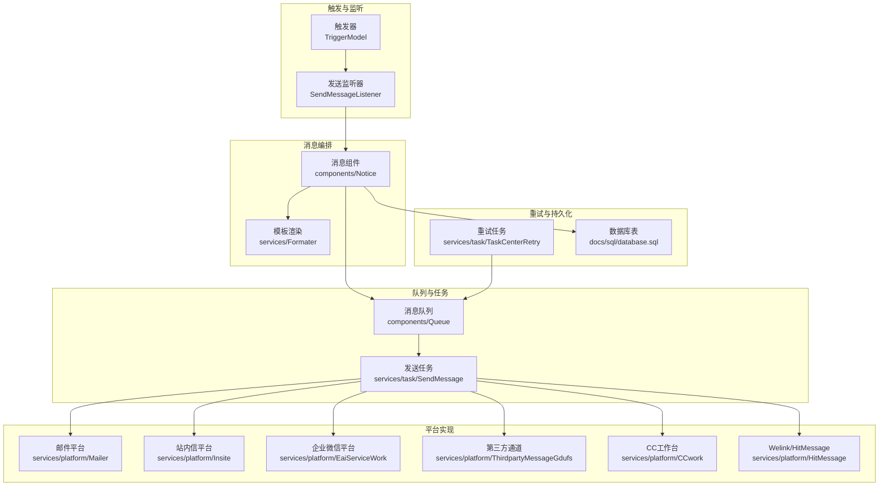
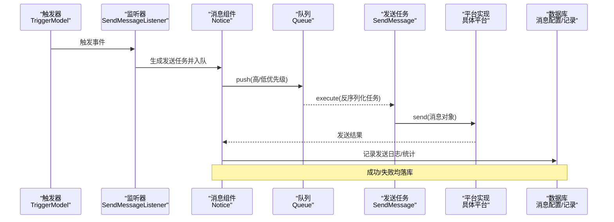
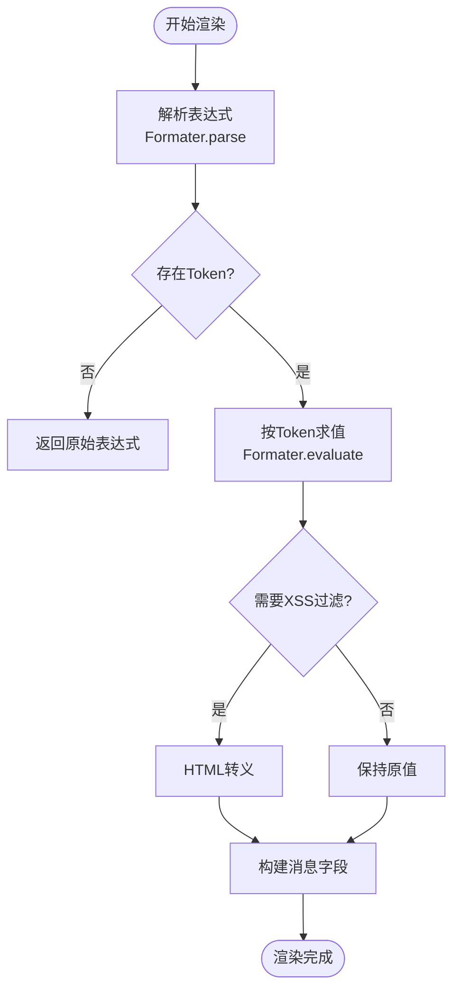
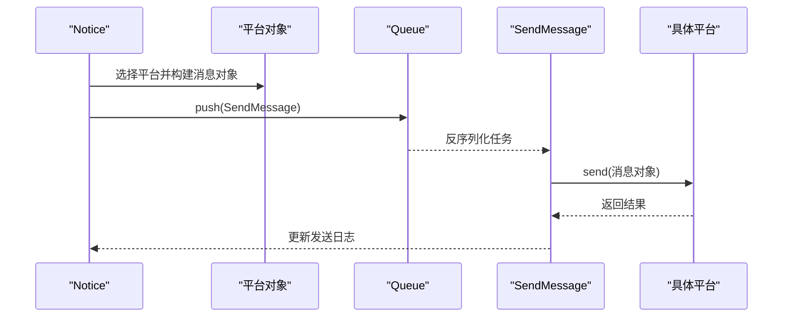
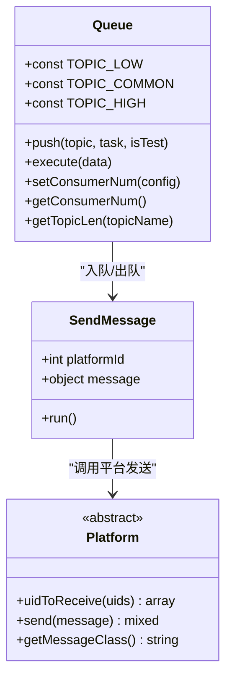
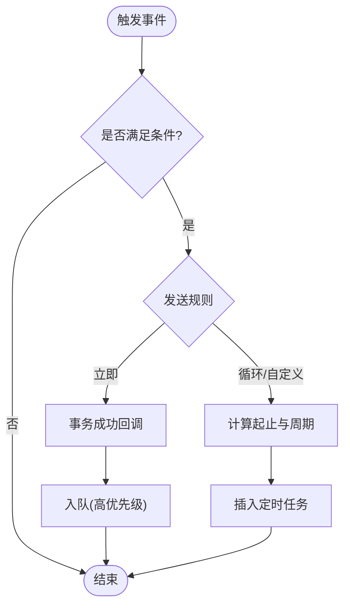
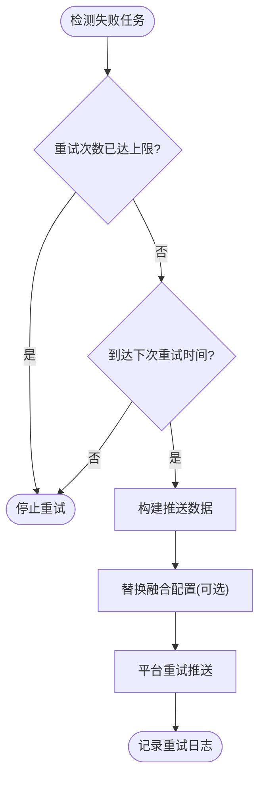
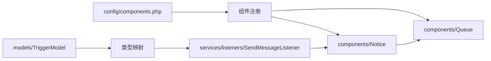

# 消息处理机制

<cite>
**本文引用的文件**
- [components/Notice.php](file://process/src/components/Notice.php)
- [components/Queue.php](file://process/src/components/Queue.php)
- [services/Formater.php](file://process/src/services/Formater.php)
- [services/task/SendMessage.php](file://process/src/services/task/SendMessage.php)
- [services/listeners/SendMessageListener.php](file://process/src/services/listeners/SendMessageListener.php)
- [services/platform/Mailer.php](file://process/src/services/platform/Mailer.php)
- [services/platform/Insite.php](file://process/src/services/platform/Insite.php)
- [services/platform/EaiServiceWork.php](file://process/src/services/platform/EaiServiceWork.php)
- [services/platform/ThirdpartyMessageGdufs.php](file://process/src/services/platform/ThirdpartyMessageGdufs.php)
- [services/platform/CCwork.php](file://process/src/services/platform/CCwork.php)
- [services/platform/HitMessage.php](file://process/src/services/platform/HitMessage.php)
- [services/task/TaskCenterRetry.php](file://process/src/services/task/TaskCenterRetry.php)
- [process_envs/sysu/product/task/PushToSchoolAgency.php](file://process_envs/sysu/product/task/PushToSchoolAgency.php)
- [process_envs/sysu_test/product/task/PushToSchoolAgency.php](file://process_envs/sysu_test/product/task/PushToSchoolAgency.php)
- [config/components.php](file://process/src/config/components.php)
- [config/queue.php](file://process/src/config/queue.php)
- [docs/sql/database.sql](file://process/docs/sql/database.sql)
- [services/task/ServiceTask.php](file://process/src/services/task/ServiceTask.php)
- [models/TriggerModel.php](file://process/src/models/TriggerModel.php)
</cite>

## 目录
1. [引言](#引言)
2. [项目结构](#项目结构)
3. [核心组件](#核心组件)
4. [架构总览](#架构总览)
5. [详细组件分析](#详细组件分析)
6. [依赖关系分析](#依赖关系分析)
7. [性能考量](#性能考量)
8. [故障排查指南](#故障排查指南)
9. [结论](#结论)
10. [附录](#附录)

## 引言
本文件系统性梳理 htdNew 项目中的消息处理机制，覆盖从“消息创建”到“发送完成”的全流程，包括消息模板渲染、内容过滤与格式化、消息队列处理、消息状态流转、重试与失败回退、监控与告警、性能优化与扩展建议。文档面向不同技术背景读者，既提供高层概览，也给出关键路径与图示，便于快速定位实现细节。

## 项目结构
消息处理相关代码主要分布在以下模块：
- 组件层：消息编排与发送入口（Notice）、消息队列封装（Queue）
- 平台层：邮件、站内信、企业微信、第三方通道等具体发送平台
- 任务层：消息发送任务（SendMessage）、定时重试任务（TaskCenterRetry）
- 监听器层：基于事件触发的消息发送监听器（SendMessageListener）
- 配置层：组件注册与队列消费者配置
- 数据模型与SQL：消息配置、发送记录、站内消息表等

图表来源
- [models/TriggerModel.php](file://process/src/models/TriggerModel.php#L107-L146)
- [services/task/ServiceTask.php](file://process/src/services/task/ServiceTask.php#L105-L136)
- [services/listeners/SendMessageListener.php](file://process/src/services/listeners/SendMessageListener.php#L1-L274)
- [components/Notice.php](file://process/src/components/Notice.php#L1-L406)
- [services/Formater.php](file://process/src/services/Formater.php#L1-L246)
- [components/Queue.php](file://process/src/components/Queue.php#L1-L173)
- [services/task/SendMessage.php](file://process/src/services/task/SendMessage.php#L1-L19)
- [services/platform/Mailer.php](file://process/src/services/platform/Mailer.php#L1-L128)
- [services/platform/Insite.php](file://process/src/services/platform/Insite.php#L1-L129)
- [services/platform/EaiServiceWork.php](file://process/src/services/platform/EaiServiceWork.php#L105-L140)
- [services/platform/ThirdpartyMessageGdufs.php](file://process/src/services/platform/ThirdpartyMessageGdufs.php#L1-L43)
- [services/platform/CCwork.php](file://process/src/services/platform/CCwork.php#L85-L132)
- [services/platform/HitMessage.php](file://process/src/services/platform/HitMessage.php#L1-L53)
- [services/task/TaskCenterRetry.php](file://process/src/services/task/TaskCenterRetry.php#L113-L185)
- [docs/sql/database.sql](file://process/docs/sql/database.sql#L502-L539)

章节来源
- [config/components.php](file://process/src/config/components.php#L1-L34)
- [config/queue.php](file://process/src/config/queue.php#L1-L13)

## 核心组件
- 消息组件 Notice：负责按配置筛选平台、构建消息对象、过滤接收人、异步入队发送
- 消息队列 Queue：封装 Redis Stream 的入队、出队与消费者数量管理
- 模板渲染 Formater：解析表达式、变量与函数，支持 XSS 过滤
- 发送任务 SendMessage：从队列取出消息并调用具体平台发送
- 发送监听器 SendMessageListener：根据触发条件与规则（立即/定时/循环/自定义）调度消息发送
- 平台实现：邮件、站内信、企业微信、第三方通道、Welink/HitMessage 等
- 重试任务 TaskCenterRetry：失败重试、时间窗口控制、替换融合配置
- 数据库表：消息配置、发送记录、站内消息与类型

章节来源
- [components/Notice.php](file://process/src/components/Notice.php#L1-L406)
- [components/Queue.php](file://process/src/components/Queue.php#L1-L173)
- [services/Formater.php](file://process/src/services/Formater.php#L1-L246)
- [services/task/SendMessage.php](file://process/src/services/task/SendMessage.php#L1-L19)
- [services/listeners/SendMessageListener.php](file://process/src/services/listeners/SendMessageListener.php#L1-L274)
- [services/platform/Mailer.php](file://process/src/services/platform/Mailer.php#L1-L128)
- [services/platform/Insite.php](file://process/src/services/platform/Insite.php#L1-L129)
- [services/platform/EaiServiceWork.php](file://process/src/services/platform/EaiServiceWork.php#L105-L140)
- [services/platform/ThirdpartyMessageGdufs.php](file://process/src/services/platform/ThirdpartyMessageGdufs.php#L1-L43)
- [services/platform/CCwork.php](file://process/src/services/platform/CCwork.php#L85-L132)
- [services/platform/HitMessage.php](file://process/src/services/platform/HitMessage.php#L1-L53)
- [services/task/TaskCenterRetry.php](file://process/src/services/task/TaskCenterRetry.php#L113-L185)
- [docs/sql/database.sql](file://process/docs/sql/database.sql#L502-L539)

## 架构总览
消息处理从“触发器”开始，经“监听器”生成发送任务，由“消息组件”构建消息对象并入队，最终由“发送任务”调用“平台实现”完成发送；失败时通过“重试任务”按时间窗口与次数策略重推。

图表来源
- [models/TriggerModel.php](file://process/src/models/TriggerModel.php#L107-L146)
- [services/task/ServiceTask.php](file://process/src/services/task/ServiceTask.php#L105-L136)
- [services/listeners/SendMessageListener.php](file://process/src/services/listeners/SendMessageListener.php#L1-L274)
- [components/Notice.php](file://process/src/components/Notice.php#L1-L406)
- [components/Queue.php](file://process/src/components/Queue.php#L1-L173)
- [services/task/SendMessage.php](file://process/src/services/task/SendMessage.php#L1-L19)
- [docs/sql/database.sql](file://process/docs/sql/database.sql#L502-L539)

## 详细组件分析

### 消息模板渲染与格式化
- 表达式解析：Formater 支持变量与函数组合，解析大括号表达式，按 Token 流求值
- XSS 过滤：可对非字符串变量进行安全处理，必要时进行 HTML 转义
- 渲染入口：AbstractMessage::load 与各平台消息类的 load 方法统一调用 Formater::getValue 完成渲染
- 平台差异：如微信模板消息对换行进行统一处理，确保字段值符合平台要求

图表来源
- [services/Formater.php](file://process/src/services/Formater.php#L1-L246)
- [services/notice/message/AbstractMessage.php](file://process/src/services/notice/message/AbstractMessage.php#L1-L31)
- [services/notice/message/WechatTemplateMessage.php](file://process/src/services/notice/message/WechatTemplateMessage.php#L53-L90)

章节来源
- [services/Formater.php](file://process/src/services/Formater.php#L1-L246)
- [services/notice/message/AbstractMessage.php](file://process/src/services/notice/message/AbstractMessage.php#L1-L31)
- [services/notice/message/WechatTemplateMessage.php](file://process/src/services/notice/message/WechatTemplateMessage.php#L53-L90)

### 消息编排与发送入口（Notice）
- 平台筛选：按应用 ID 与默认配置合并，过滤启用的通知平台
- 接收人过滤：按平台能力与用户设置过滤可用接收账号
- 异步发送：将发送任务入队（低优先级），避免阻塞主流程
- 同步发送：可直接调用平台 send，捕获异常并返回错误
- 日志与回退：记录交互日志，失败时可走重试流程

图表来源
- [components/Notice.php](file://process/src/components/Notice.php#L1-L406)
- [services/task/SendMessage.php](file://process/src/services/task/SendMessage.php#L1-L19)
- [components/Queue.php](file://process/src/components/Queue.php#L1-L173)

章节来源
- [components/Notice.php](file://process/src/components/Notice.php#L1-L406)

### 消息队列与任务执行（Queue 与 SendMessage）
- 入队：支持 JSON/序列化两种编码方式，当前采用 serialize 存储任务体
- 出队：反序列化任务并调用 run 执行
- 消费者配置：支持运行时动态设置消费者数量并热重载
- 任务类型：SendMessage 依据平台 ID 选择具体平台对象执行发送

图表来源
- [components/Queue.php](file://process/src/components/Queue.php#L1-L173)
- [services/task/SendMessage.php](file://process/src/services/task/SendMessage.php#L1-L19)

章节来源
- [components/Queue.php](file://process/src/components/Queue.php#L1-L173)
- [services/task/SendMessage.php](file://process/src/services/task/SendMessage.php#L1-L19)

### 发送监听器与调度（SendMessageListener）
- 条件与规则：支持立即发送、一次性定时、循环定时、自定义时间点
- 事务后入队：在数据库事务成功后再入队，保证一致性
- 重复表推送：支持按重复表逐条生成发送任务
- 时间计算：基于会话变量或表单字段计算起止时间，并支持设定每日固定时间

图表来源
- [services/listeners/SendMessageListener.php](file://process/src/services/listeners/SendMessageListener.php#L1-L274)

章节来源
- [services/listeners/SendMessageListener.php](file://process/src/services/listeners/SendMessageListener.php#L1-L274)

### 平台实现要点
- 邮件（Mailer）：基于 SMTP，支持附件与 CC，消息对象为 Email
- 站内信（Insite）：写入站内信表与已读表，支持与融合平台联动
- 企业微信（EaiServiceWork）：模板消息构建与发送，支持 accessToken 管理
- 第三方通道（ThirdpartyMessageGdufs/CCwork/HitMessage）：按平台规范构造请求并发送

章节来源
- [services/platform/Mailer.php](file://process/src/services/platform/Mailer.php#L1-L128)
- [services/platform/Insite.php](file://process/src/services/platform/Insite.php#L1-L129)
- [services/platform/EaiServiceWork.php](file://process/src/services/platform/EaiServiceWork.php#L105-L140)
- [services/platform/ThirdpartyMessageGdufs.php](file://process/src/services/platform/ThirdpartyMessageGdufs.php#L1-L43)
- [services/platform/CCwork.php](file://process/src/services/platform/CCwork.php#L85-L132)
- [services/platform/HitMessage.php](file://process/src/services/platform/HitMessage.php#L1-L53)

### 重试机制与失败回退（TaskCenterRetry）
- 失败判定：根据任务日志状态与失败时间计算下次重试时间
- 重试次数：受配置上限控制，超过上限不再重试
- 替换融合配置：失败时可切换到融合平台对象进行重试
- 重试入队：构造推送数据后再次入队，交由平台实现重发

图表来源
- [services/task/TaskCenterRetry.php](file://process/src/services/task/TaskCenterRetry.php#L113-L185)

章节来源
- [services/task/TaskCenterRetry.php](file://process/src/services/task/TaskCenterRetry.php#L113-L185)

### Kafka 推送与重复推送防护（环境示例）
- 重复推送防护：基于消息体哈希设置短时缓存键，避免重复推送
- 异常重试：发送异常时有限次重试并记录日志
- 推送记录：将请求与响应写入推送记录表，便于审计与回溯

章节来源
- [process_envs/sysu/product/task/PushToSchoolAgency.php](file://process_envs/sysu/product/task/PushToSchoolAgency.php#L475-L509)
- [process_envs/sysu_test/product/task/PushToSchoolAgency.php](file://process_envs/sysu_test/product/task/PushToSchoolAgency.php#L552-L596)

## 依赖关系分析
- 组件注册：components.php 中注册 notice 与 queue 组件，供全局使用
- 配置加载：queue.php 读取 YAML 配置并注入默认消费者设置
- 触发链路：TriggerModel 根据类型映射到具体监听器，再由监听器驱动消息发送

图表来源
- [config/components.php](file://process/src/config/components.php#L1-L34)
- [config/queue.php](file://process/src/config/queue.php#L1-L13)
- [models/TriggerModel.php](file://process/src/models/TriggerModel.php#L107-L146)

章节来源
- [config/components.php](file://process/src/config/components.php#L1-L34)
- [config/queue.php](file://process/src/config/queue.php#L1-L13)
- [models/TriggerModel.php](file://process/src/models/TriggerModel.php#L107-L146)

## 性能考量
- 队列优先级：高优先级用于紧急消息，低优先级用于常规消息，避免阻塞关键路径
- 异步发送：默认异步入队，减少主流程等待时间
- 消费者动态调整：通过缓存键设置消费者数量，结合 reload 实现热扩容
- 序列化策略：当前采用 serialize，注意任务对象构造参数必须具备默认值，避免入队失败
- 平台幂等：站内信与第三方通道应具备幂等校验，避免重复推送
- 日志与监控：发送记录表与交互日志用于观测与告警，建议接入统一监控

[本节为通用指导，无需列出具体文件来源]

## 故障排查指南
- 模板渲染异常：检查表达式语法与变量是否存在，确认 XSS 过滤是否启用
- 接收人为空：核对平台过滤逻辑与用户设置，确认 uidToReceive 返回值
- 队列积压：查看 Topic 长度与消费者数量，评估是否需要扩容或降级
- 发送失败：查看发送记录表与平台返回，结合重试任务确认是否已重试
- 重复推送：检查重复推送防护逻辑与缓存键过期时间
- 平台鉴权：企业微信 accessToken 有效期与刷新策略，确保可用

章节来源
- [components/Notice.php](file://process/src/components/Notice.php#L1-L406)
- [components/Queue.php](file://process/src/components/Queue.php#L1-L173)
- [services/platform/EaiServiceWork.php](file://process/src/services/platform/EaiServiceWork.php#L105-L140)
- [process_envs/sysu/product/task/PushToSchoolAgency.php](file://process_envs/sysu/product/task/PushToSchoolAgency.php#L475-L509)

## 结论
htdNew 的消息处理机制以“监听器-编排-队列-平台”为主线，结合模板渲染、接收人过滤、异步发送与重试回退，形成完整的消息生命周期闭环。通过数据库记录与交互日志，可实现可观测与可追溯。建议在生产环境中配合监控告警、限流与幂等策略，持续优化性能与稳定性。

[本节为总结性内容，无需列出具体文件来源]

## 附录
- 数据库表结构参考：消息配置、消息发送记录、站内消息与类型
- 触发器类型映射：根据触发类型选择对应监听器类

章节来源
- [docs/sql/database.sql](file://process/docs/sql/database.sql#L502-L539)
- [models/TriggerModel.php](file://process/src/models/TriggerModel.php#L107-L146)