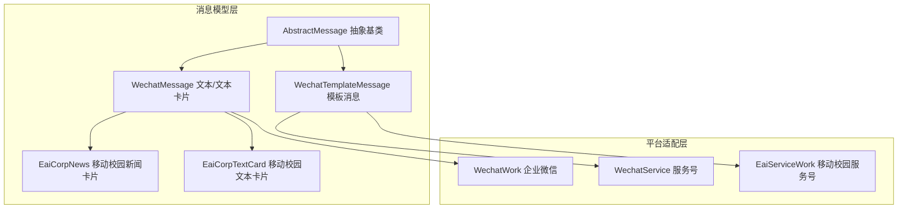
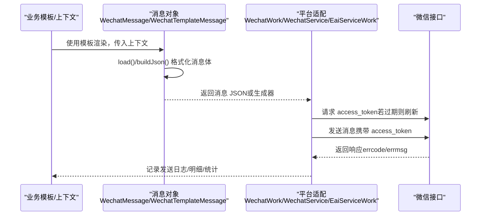
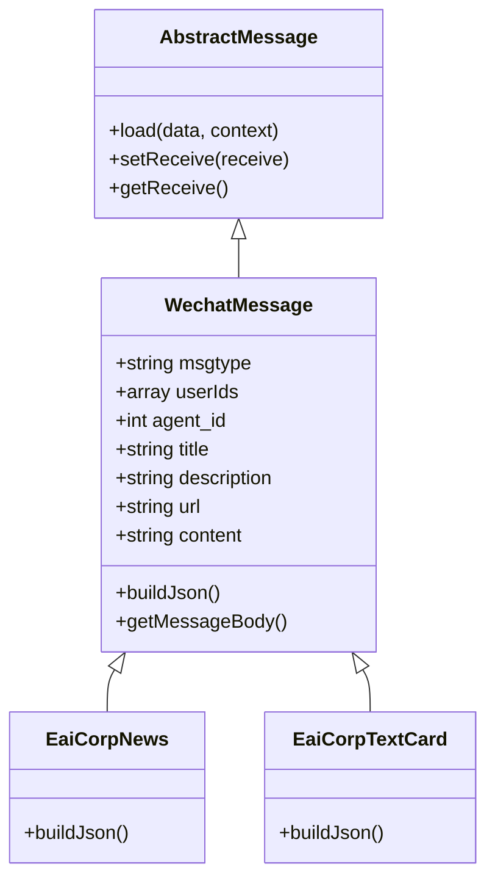
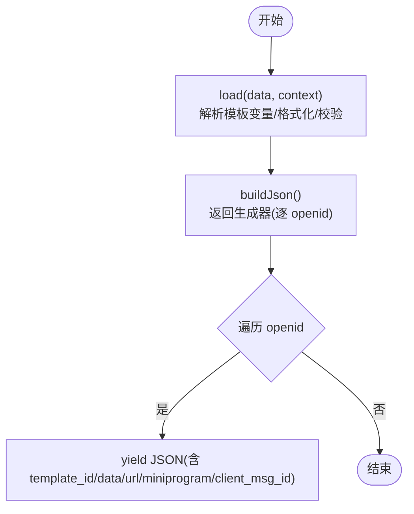
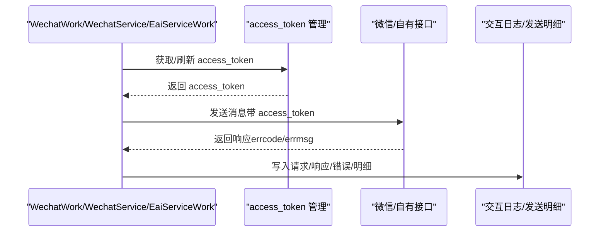
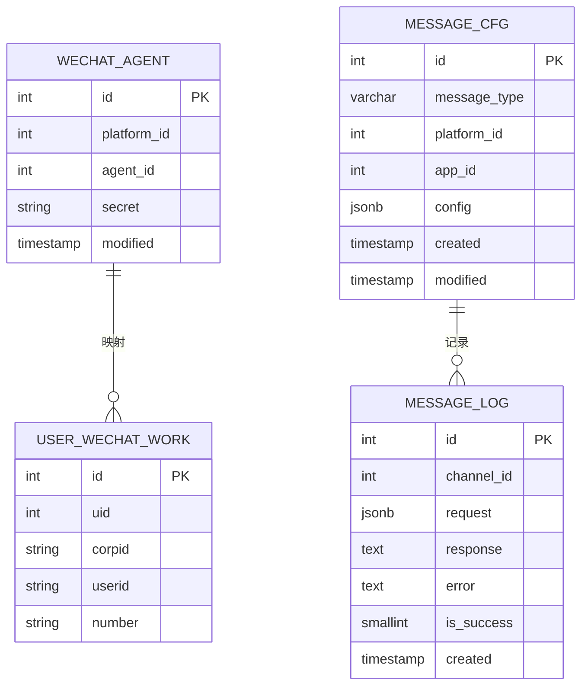

# 微信消息渠道

<cite>
**本文引用的文件**
- [WechatMessage.php](file://process/src/services/notice/message/WechatMessage.php)
- [WechatTemplateMessage.php](file://process/src/services/notice/message/WechatTemplateMessage.php)
- [AbstractMessage.php](file://process/src/services/notice/message/AbstractMessage.php)
- [WechatWork.php](file://process/src/services/platform/WechatWork.php)
- [WechatService.php](file://process/src/services/platform/WechatService.php)
- [EaiServiceWork.php](file://process/src/services/platform/EaiServiceWork.php)
- [EaiCorpNews.php](file://process/src/services/notice/message/EaiCorpNews.php)
- [EaiCorpTextCard.php](file://process/src/services/notice/message/EaiCorpTextCard.php)
- [WechatAgentModel.php](file://process/src/models/WechatAgentModel.php)
- [migration_20250410_wechat.php](file://process/src/migrations/migration_20250410_wechat.php)
- [database.sql](file://process/docs/sql/database.sql)
</cite>

## 目录
1. [引言](#引言)
2. [项目结构](#项目结构)
3. [核心组件](#核心组件)
4. [架构总览](#架构总览)
5. [详细组件分析](#详细组件分析)
6. [依赖关系分析](#依赖关系分析)
7. [性能考虑](#性能考虑)
8. [故障排查指南](#故障排查指南)
9. [结论](#结论)
10. [附录](#附录)

## 引言
本文件面向 htdNew 项目的微信消息渠道，系统性梳理 WechatMessage 与 WechatTemplateMessage 两类消息的实现机制，覆盖以下要点：
- 企业微信（WechatWork）与服务号（WechatService、EaiServiceWork）的消息通道集成
- 消息模板配置、模板 ID 绑定、数据绑定与发送流程
- 两类消息类型的使用场景与实现差异
- 错误处理、发送限制与频率控制策略
- 模板设计指南与最佳实践

## 项目结构
微信消息渠道由“消息模型层”和“平台适配层”组成：
- 消息模型层：抽象消息基类与两类具体消息实现，负责将业务数据格式化为微信 API 的请求体
- 平台适配层：企业微信、服务号、移动校园服务号等平台类，负责调用微信官方接口并处理返回

图表来源
- [AbstractMessage.php](file://process/src/services/notice/message/AbstractMessage.php#L1-L31)
- [WechatMessage.php](file://process/src/services/notice/message/WechatMessage.php#L1-L76)
- [WechatTemplateMessage.php](file://process/src/services/notice/message/WechatTemplateMessage.php#L1-L90)
- [EaiCorpNews.php](file://process/src/services/notice/message/EaiCorpNews.php#L1-L66)
- [EaiCorpTextCard.php](file://process/src/services/notice/message/EaiCorpTextCard.php#L1-L32)
- [WechatWork.php](file://process/src/services/platform/WechatWork.php#L1-L570)
- [WechatService.php](file://process/src/services/platform/WechatService.php#L1-L426)
- [EaiServiceWork.php](file://process/src/services/platform/EaiServiceWork.php#L1-L289)

章节来源
- [WechatMessage.php](file://process/src/services/notice/message/WechatMessage.php#L1-L76)
- [WechatTemplateMessage.php](file://process/src/services/notice/message/WechatTemplateMessage.php#L1-L90)
- [AbstractMessage.php](file://process/src/services/notice/message/AbstractMessage.php#L1-L31)
- [WechatWork.php](file://process/src/services/platform/WechatWork.php#L1-L570)
- [WechatService.php](file://process/src/services/platform/WechatService.php#L1-L426)
- [EaiServiceWork.php](file://process/src/services/platform/EaiServiceWork.php#L1-L289)
- [EaiCorpNews.php](file://process/src/services/notice/message/EaiCorpNews.php#L1-L66)
- [EaiCorpTextCard.php](file://process/src/services/notice/message/EaiCorpTextCard.php#L1-L32)

## 核心组件
- 抽象消息基类 AbstractMessage
  - 提供统一的 load 方法，基于模板上下文对消息属性进行格式化赋值，并注入发送日志 ID
  - 定义 setReceive/getReceive 接口，由子类实现接收方标识（用户 ID 或 openid）
- WechatMessage（企业微信文本/文本卡片）
  - 支持 msgtype=text/textcard，封装 title/description/url/content 等字段
  - 通过 WechatAgentModel 获取 agent_id，构建企业微信消息 JSON
- WechatTemplateMessage（服务号/移动校园模板消息）
  - 支持 template_id、data 数据绑定、url 跳转、miniprogram 小程序跳转、client_msg_id 去重
  - buildJson 返回生成器，逐个 openid 产出单条消息 JSON，满足“一次只发一人”的限制
- 平台适配类
  - WechatWork：企业微信消息发送、access_token 管理、OAuth、JS-SDK 票据
  - WechatService：服务号模板消息发送、access_token 管理、OAuth、JS-SDK 票据
  - EaiServiceWork：移动校园服务号通道，对接自有网关发送模板消息

章节来源
- [AbstractMessage.php](file://process/src/services/notice/message/AbstractMessage.php#L1-L31)
- [WechatMessage.php](file://process/src/services/notice/message/WechatMessage.php#L1-L76)
- [WechatTemplateMessage.php](file://process/src/services/notice/message/WechatTemplateMessage.php#L1-L90)
- [WechatWork.php](file://process/src/services/platform/WechatWork.php#L1-L570)
- [WechatService.php](file://process/src/services/platform/WechatService.php#L1-L426)
- [EaiServiceWork.php](file://process/src/services/platform/EaiServiceWork.php#L1-L289)

## 架构总览
下图展示从“消息模板渲染到微信 API 发送”的端到端流程，以及两类消息在不同平台上的差异。

图表来源
- [AbstractMessage.php](file://process/src/services/notice/message/AbstractMessage.php#L1-L31)
- [WechatMessage.php](file://process/src/services/notice/message/WechatMessage.php#L1-L76)
- [WechatTemplateMessage.php](file://process/src/services/notice/message/WechatTemplateMessage.php#L1-L90)
- [WechatWork.php](file://process/src/services/platform/WechatWork.php#L243-L366)
- [WechatService.php](file://process/src/services/platform/WechatService.php#L241-L291)
- [EaiServiceWork.php](file://process/src/services/platform/EaiServiceWork.php#L178-L198)

## 详细组件分析

### WechatMessage（企业微信文本/文本卡片）
- 关键属性
  - msgtype：text 或 textcard
  - receive：userIds（企业微信用户工号/ID）
  - agent_id：来自 WechatAgentModel 缓存
  - 文本字段：title/description/url（卡片）、content（纯文本）
- 构建流程
  - load：从上下文注入 agent_id（可选），并按模板变量格式化
  - buildJson：组装 touser、agentid、msgtype 与对应 body
  - getMessageBody：根据 msgtype 返回不同结构
- 使用场景
  - 企业微信应用消息，适合公告、通知、待办等
- 与移动校园扩展
  - EaiCorpNews/EaiCorpTextCard 重载 buildJson，适配移动校园自有消息通道

图表来源
- [AbstractMessage.php](file://process/src/services/notice/message/AbstractMessage.php#L1-L31)
- [WechatMessage.php](file://process/src/services/notice/message/WechatMessage.php#L1-L76)
- [EaiCorpNews.php](file://process/src/services/notice/message/EaiCorpNews.php#L1-L66)
- [EaiCorpTextCard.php](file://process/src/services/notice/message/EaiCorpTextCard.php#L1-L32)

章节来源
- [WechatMessage.php](file://process/src/services/notice/message/WechatMessage.php#L1-L76)
- [EaiCorpNews.php](file://process/src/services/notice/message/EaiCorpNews.php#L1-L66)
- [EaiCorpTextCard.php](file://process/src/services/notice/message/EaiCorpTextCard.php#L1-L32)

### WechatTemplateMessage（服务号/移动校园模板消息）
- 关键属性
  - template_id：模板 ID
  - data：键值对数组，键为模板变量名，值为替换文本；支持 {{xxx.DATA}} 语法
  - receive：openids（服务号/小程序用户）
  - url/miniprogram：跳转配置
  - client_msg_id：去重 ID（同一 openid+client_msg_id 10 分钟内仅发一次）
- 构建流程
  - load：解析模板变量，将换行符规范化，校验 url 非空
  - buildJson：返回生成器，逐个 openid 产出完整消息 JSON
- 使用场景
  - 服务号/小程序模板消息，适合审批、考勤、订单等强结构化通知
- 与移动校园扩展
  - EaiServiceWork 通过自有网关发送模板消息，内部将 openid 映射为学工号并封装 content

图表来源
- [WechatTemplateMessage.php](file://process/src/services/notice/message/WechatTemplateMessage.php#L1-L90)
- [WechatService.php](file://process/src/services/platform/WechatService.php#L241-L291)
- [EaiServiceWork.php](file://process/src/services/platform/EaiServiceWork.php#L178-L198)

章节来源
- [WechatTemplateMessage.php](file://process/src/services/notice/message/WechatTemplateMessage.php#L1-L90)
- [WechatService.php](file://process/src/services/platform/WechatService.php#L1-L426)
- [EaiServiceWork.php](file://process/src/services/platform/EaiServiceWork.php#L1-L289)

### 平台适配层（WechatWork/WechatService/EaiServiceWork）
- WechatWork（企业微信）
  - access_token 管理：支持私有化部署事件回调与公共 API 获取
  - 发送流程：自动追加 access_token，处理过期重试；记录交互日志与发送明细
  - OAuth：支持静默/手动授权，获取工号字段映射
  - JS-SDK：提供 jsapi_ticket 与签名计算
- WechatService（服务号）
  - access_token 管理：标准接口获取与缓存
  - 发送流程：逐条发送（生成器），记录成功/失败明细与汇总
  - OAuth：支持基础授权与用户信息授权
  - JS-SDK：提供 jsapi_ticket 与签名计算
- EaiServiceWork（移动校园服务号）
  - access_token 管理：对接自有网关
  - 发送流程：将 openid 映射为学工号，封装 content 后调用自有消息接口
  - OAuth：基于自有授权接口获取工号

图表来源
- [WechatWork.php](file://process/src/services/platform/WechatWork.php#L176-L241)
- [WechatWork.php](file://process/src/services/platform/WechatWork.php#L243-L366)
- [WechatService.php](file://process/src/services/platform/WechatService.php#L136-L239)
- [WechatService.php](file://process/src/services/platform/WechatService.php#L241-L291)
- [EaiServiceWork.php](file://process/src/services/platform/EaiServiceWork.php#L128-L198)

章节来源
- [WechatWork.php](file://process/src/services/platform/WechatWork.php#L1-L570)
- [WechatService.php](file://process/src/services/platform/WechatService.php#L1-L426)
- [EaiServiceWork.php](file://process/src/services/platform/EaiServiceWork.php#L1-L289)

## 依赖关系分析
- 模型与平台
  - WechatAgentModel：存储企业微信应用的 agent_id/secret，被 WechatWork 与 EaiServiceWork 使用
  - user_wechat_work 表：存储用户与企业微信的映射（uid、corpid、userid、number）
- 数据库与消息记录
  - message_cfg/message_log：消息配置与发送记录表，用于记录渠道、请求、响应、错误与成功状态
- 依赖链
  - 消息对象 -> 平台适配 -> 微信接口 -> 日志与统计

图表来源
- [WechatAgentModel.php](file://process/src/models/WechatAgentModel.php#L1-L31)
- [migration_20250410_wechat.php](file://process/src/migrations/migration_20250410_wechat.php#L1-L43)
- [database.sql](file://process/docs/sql/database.sql#L502-L539)

章节来源
- [WechatAgentModel.php](file://process/src/models/WechatAgentModel.php#L1-L31)
- [migration_20250410_wechat.php](file://process/src/migrations/migration_20250410_wechat.php#L1-L43)
- [database.sql](file://process/docs/sql/database.sql#L502-L539)

## 性能考虑
- access_token 缓存
  - 企业微信与服务号均采用 Redis 缓存 access_token，并在过期前安全时间刷新，避免频繁请求
- 发送重试
  - 企业微信在 access_token 过期时自动重试；发送失败时按明细记录，便于后续补发
- 生成器发送
  - 模板消息通过生成器逐条发送，降低内存峰值与网络拥塞风险
- 批量映射
  - 企业微信将用户 ID 映射为工号，减少无效接收人导致的失败重试

章节来源
- [WechatWork.php](file://process/src/services/platform/WechatWork.php#L176-L241)
- [WechatWork.php](file://process/src/services/platform/WechatWork.php#L243-L366)
- [WechatService.php](file://process/src/services/platform/WechatService.php#L136-L239)
- [WechatTemplateMessage.php](file://process/src/services/notice/message/WechatTemplateMessage.php#L66-L90)

## 故障排查指南
- 常见错误码与处理
  - 企业微信：ERR_ACCESS_TOKEN_EXPIRE（42021）触发 access_token 刷新重试
  - 服务号：ERR_ACCESS_TOKEN_EXPIRE（40001）触发 access_token 刷新重试
- 失败原因定位
  - invaliduser/unlicenseduser：接收人不在应用可见范围或无基础接口许可
  - 模板消息 url 为空：模板消息必须提供 url 字段
- 日志与统计
  - 交互日志记录请求/响应与错误信息
  - 发送明细与汇总记录成功/失败数量，便于回溯与报表
- 建议排查步骤
  - 检查 access_token 是否正确、是否过期
  - 校验 touser/openid 是否有效
  - 校验模板消息的 template_id、data、url
  - 查看 message_log 与发送明细表定位失败原因

章节来源
- [WechatWork.php](file://process/src/services/platform/WechatWork.php#L215-L241)
- [WechatWork.php](file://process/src/services/platform/WechatWork.php#L243-L366)
- [WechatService.php](file://process/src/services/platform/WechatService.php#L182-L239)
- [WechatTemplateMessage.php](file://process/src/services/notice/message/WechatTemplateMessage.php#L45-L64)
- [database.sql](file://process/docs/sql/database.sql#L502-L539)

## 结论
- WechatMessage 适用于企业微信的文本/卡片消息，强调简洁与易用
- WechatTemplateMessage 适用于服务号/小程序模板消息，强调结构化与可追踪
- 平台适配层统一了 access_token 管理、发送重试与日志统计，保证稳定性
- 建议在模板设计中严格遵循“变量命名规范 + URL 必填 + 去重 ID”三要素，提升发送成功率与用户体验

## 附录

### 配置参数与模板 ID 设置
- 企业微信（WechatWork）
  - 需配置 corpid、contacts_secret、message_agent_id 等
  - 消息类型通过 getFormatConfig 返回，支持 text/textcard
- 服务号（WechatService）
  - 需配置 appid、appsecret
  - 通过 getTemplateList 获取模板列表，选择模板 ID
- 移动校园服务号（EaiServiceWork）
  - 需配置 eai_appid、eai_secret、domain、message_agent_id
  - 模板 ID 由平台提供

章节来源
- [WechatWork.php](file://process/src/services/platform/WechatWork.php#L1-L570)
- [WechatService.php](file://process/src/services/platform/WechatService.php#L1-L426)
- [EaiServiceWork.php](file://process/src/services/platform/EaiServiceWork.php#L1-L289)

### 数据绑定与发送流程
- 模板变量
  - WechatTemplateMessage.load 支持 {{xxx.DATA}} 语法，自动格式化换行
  - 企业微信文本卡片通过 title/description/url/content 直接绑定
- 发送限制与频率控制
  - 服务号模板消息一次仅能发送给一个 openid，需逐条发送
  - 企业微信支持批量 touser（以 | 分隔），但需确保接收人有效
  - client_msg_id 实现模板消息去重（同一 openid+client_msg_id 10 分钟内仅发一次）

章节来源
- [WechatTemplateMessage.php](file://process/src/services/notice/message/WechatTemplateMessage.php#L1-L90)
- [WechatMessage.php](file://process/src/services/notice/message/WechatMessage.php#L1-L76)

### 使用场景与实现差异
- 企业微信文本卡片
  - 适合公告、待办、通知等，支持图文跳转
  - 通过 WechatMessage.buildJson 输出标准企业微信消息体
- 服务号模板消息
  - 适合审批、考勤、订单等强结构化通知
  - 通过 WechatTemplateMessage.buildJson 逐条发送，支持 miniprogram 跳转与去重
- 移动校园扩展
  - EaiServiceWork 通过自有网关发送，内部将 openid 映射为学工号

章节来源
- [WechatMessage.php](file://process/src/services/notice/message/WechatMessage.php#L1-L76)
- [WechatTemplateMessage.php](file://process/src/services/notice/message/WechatTemplateMessage.php#L1-L90)
- [EaiServiceWork.php](file://process/src/services/platform/EaiServiceWork.php#L178-L198)
- [EaiCorpNews.php](file://process/src/services/notice/message/EaiCorpNews.php#L1-L66)
- [EaiCorpTextCard.php](file://process/src/services/notice/message/EaiCorpTextCard.php#L1-L32)

### 模板设计指南与最佳实践
- 变量命名
  - 服务号模板使用 {{keywordN.DATA}} 形式，确保与平台解析一致
  - 企业微信文本卡片使用 title/description/url/content 字段，避免复杂换行
- URL 规范
  - 模板消息必须提供 url，建议使用 HTTPS 与短链
- 去重与限流
  - 使用 client_msg_id 避免重复推送
  - 控制发送速率，避免触发微信频率限制
- 错误监控
  - 关注 invaliduser/unlicenseduser 等错误，及时修正接收人
  - 记录 message_log 与发送明细，定期复盘

章节来源
- [WechatTemplateMessage.php](file://process/src/services/notice/message/WechatTemplateMessage.php#L1-L90)
- [WechatService.php](file://process/src/services/platform/WechatService.php#L1-L426)
- [WechatWork.php](file://process/src/services/platform/WechatWork.php#L1-L570)
- [database.sql](file://process/docs/sql/database.sql#L502-L539)