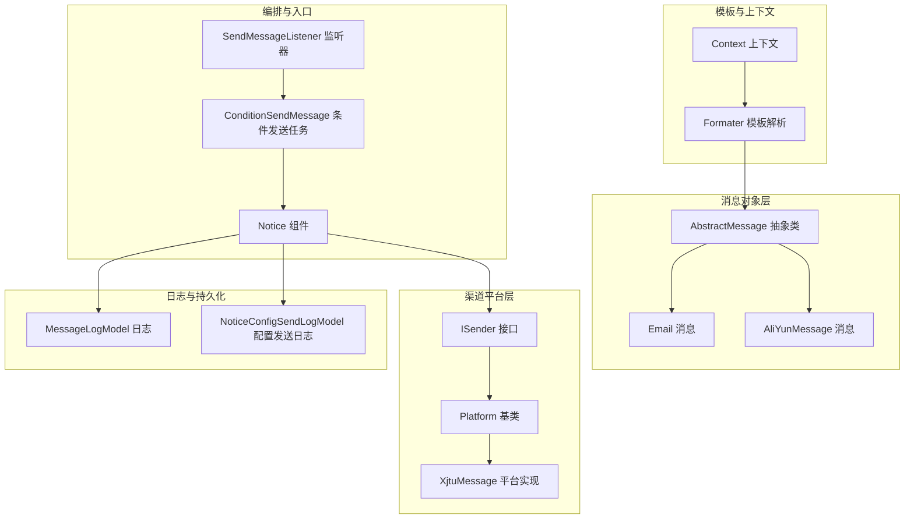
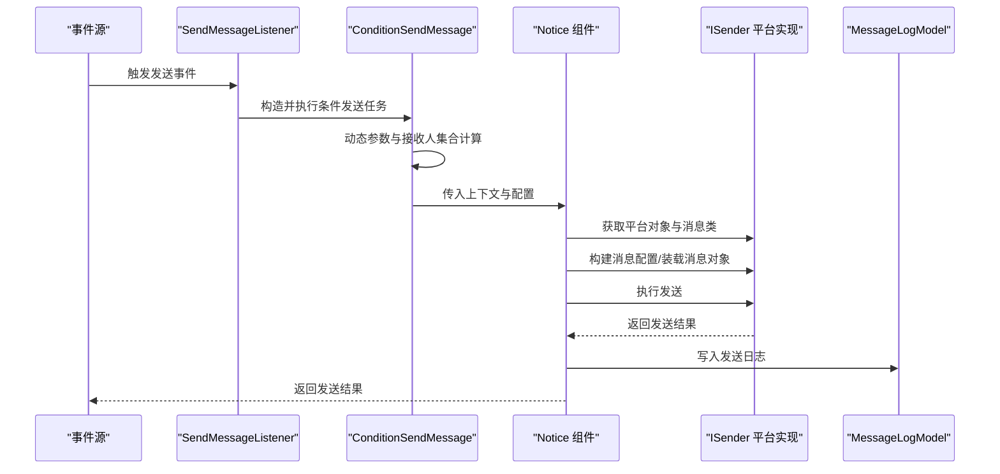
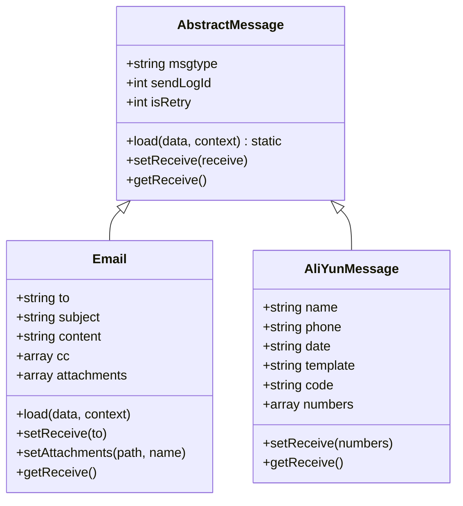
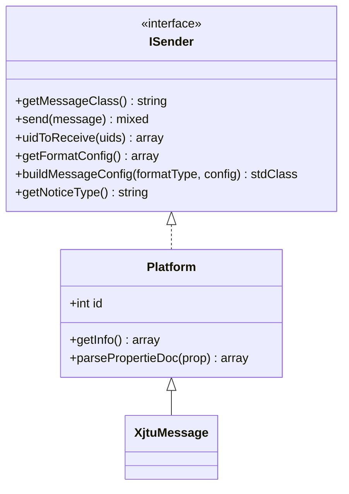
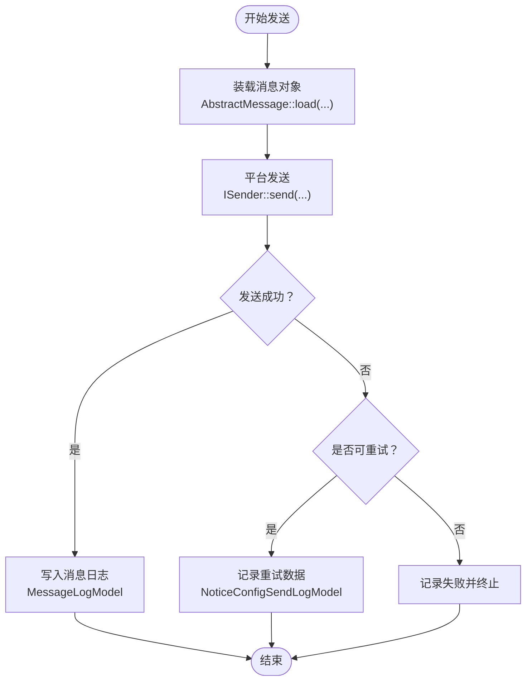
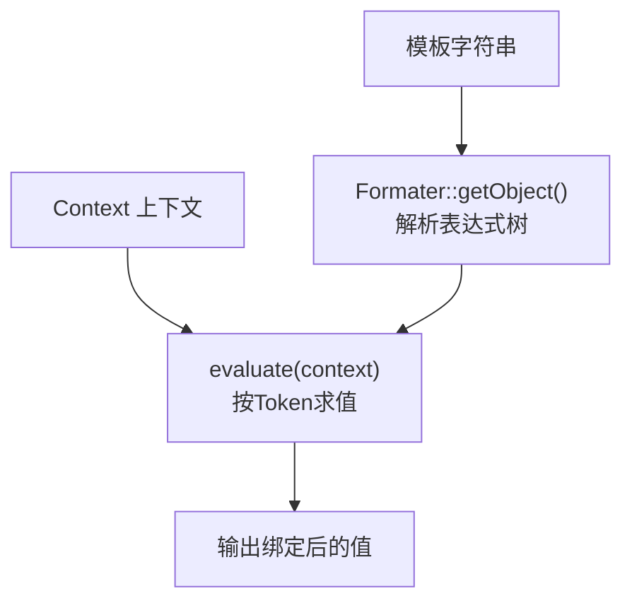
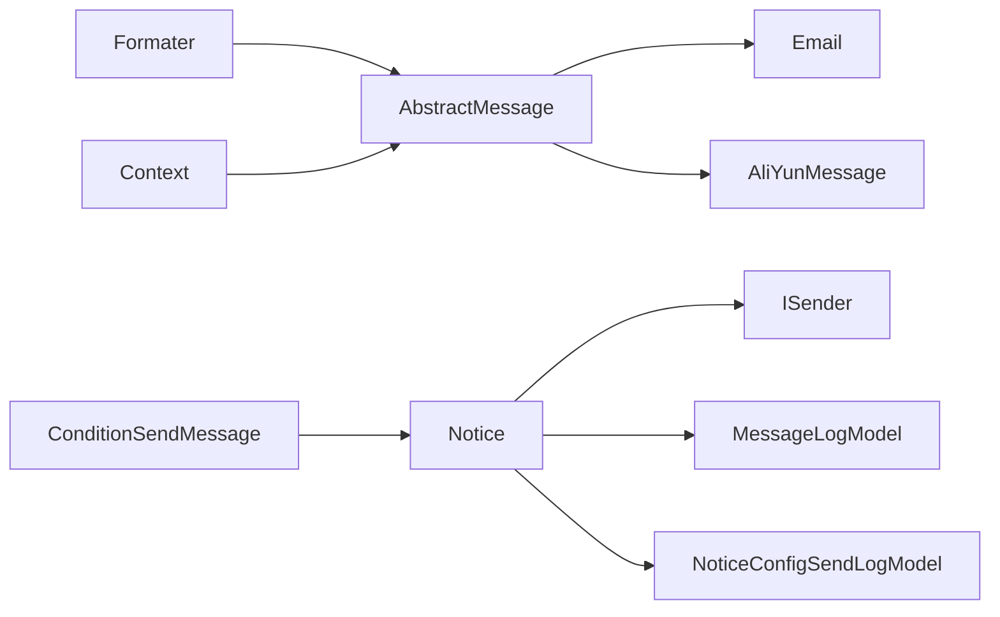

# 消息渠道基础架构

<cite>
**本文引用的文件**
- [AbstractMessage.php](file://process/src/services/notice/message/AbstractMessage.php)
- [Email.php](file://process/src/services/notice/message/Email.php)
- [AliYunMessage.php](file://process/src/services/notice/message/AliYunMessage.php)
- [ISender.php](file://process/src/services/platform/ISender.php)
- [Platform.php](file://process/src/services/platform/Platform.php)
- [Formater.php](file://process/src/services/Formater.php)
- [Context.php](file://process/src/services/Context.php)
- [SendMessageListener.php](file://process/src/services/listeners/SendMessageListener.php)
- [ConditionSendMessage.php](file://process/src/services/task/ConditionSendMessage.php)
- [Notice.php](file://process/src/components/Notice.php)
- [MessageLogModel.php](file://process/src/models/MessageLogModel.php)
- [NoticeConfigSendLogModel.php](file://process/src/models/NoticeConfigSendLogModel.php)
- [database.sql](file://process/docs/sql/database.sql)
- [MessageConfig.php](file://process/src/http/system/MessageConfig.php)
- [XjtuMessage.php](file://process/src/services/platform/XjtuMessage.php)
</cite>

## 目录
1. [引言](#引言)
2. [项目结构](#项目结构)
3. [核心组件](#核心组件)
4. [架构总览](#架构总览)
5. [详细组件分析](#详细组件分析)
6. [依赖关系分析](#依赖关系分析)
7. [性能考量](#性能考量)
8. [故障排查指南](#故障排查指南)
9. [结论](#结论)
10. [附录](#附录)

## 引言
本文件面向 htdNew 项目“消息渠道基础架构”的设计与实现，系统性阐述消息对象抽象层、模板与上下文绑定、渠道接口与实现、发送日志与重试、以及扩展接入规范与最佳实践。目标读者既包括一线开发，也包括对技术细节感兴趣的非专业读者。

## 项目结构
消息子系统围绕“消息对象抽象 + 渠道平台接口 + 上下文与模板解析 + 发送流程编排 + 日志与重试”展开，关键目录与职责如下：
- services/notice/message：消息对象抽象与具体消息类型（如 Email、AliYunMessage 等）
- services/platform：渠道平台抽象与接口（ISender）、平台基类（Platform）及各高校/第三方平台实现
- services：Formater 模板解析、Context 上下文容器
- services/listeners：事件监听器，负责触发发送流程
- services/task：条件发送任务，负责动态参数与接收人集合计算
- components：对外组件入口（如 Notice），封装异步/同步发送与平台对接
- models：消息日志模型、配置发送日志模型
- http/system：消息配置相关接口，暴露变量与格式配置
- docs/sql：数据库表结构（message_cfg、message_log、message_insite 等）

图表来源
- [AbstractMessage.php](file://process/src/services/notice/message/AbstractMessage.php#L1-L31)
- [Email.php](file://process/src/services/notice/message/Email.php#L1-L37)
- [AliYunMessage.php](file://process/src/services/notice/message/AliYunMessage.php#L1-L29)
- [ISender.php](file://process/src/services/platform/ISender.php#L1-L50)
- [Platform.php](file://process/src/services/platform/Platform.php#L1-L93)
- [Formater.php](file://process/src/services/Formater.php#L1-L246)
- [Context.php](file://process/src/services/Context.php#L1-L77)
- [SendMessageListener.php](file://process/src/services/listeners/SendMessageListener.php#L46-L76)
- [ConditionSendMessage.php](file://process/src/services/task/ConditionSendMessage.php#L81-L118)
- [Notice.php](file://process/src/components/Notice.php#L344-L380)
- [MessageLogModel.php](file://process/src/models/MessageLogModel.php#L1-L33)
- [NoticeConfigSendLogModel.php](file://process/src/models/NoticeConfigSendLogModel.php#L1-L55)

章节来源
- [AbstractMessage.php](file://process/src/services/notice/message/AbstractMessage.php#L1-L31)
- [ISender.php](file://process/src/services/platform/ISender.php#L1-L50)
- [Platform.php](file://process/src/services/platform/Platform.php#L1-L93)
- [Formater.php](file://process/src/services/Formater.php#L1-L246)
- [Context.php](file://process/src/services/Context.php#L1-L77)
- [SendMessageListener.php](file://process/src/services/listeners/SendMessageListener.php#L46-L76)
- [ConditionSendMessage.php](file://process/src/services/task/ConditionSendMessage.php#L81-L118)
- [Notice.php](file://process/src/components/Notice.php#L344-L380)
- [MessageLogModel.php](file://process/src/models/MessageLogModel.php#L1-L33)
- [NoticeConfigSendLogModel.php](file://process/src/models/NoticeConfigSendLogModel.php#L1-L55)

## 核心组件
- 消息对象抽象与加载
  - AbstractMessage 提供统一的 load(data, context) 工厂方法，基于 Formater 对模板字段进行上下文求值，并注入 sendLogId 等运行期元数据；同时约定 setReceive()/getReceive() 作为接收方管理接口。
  - 具体消息类型（如 Email、AliYunMessage）继承该抽象类，按自身字段完成属性绑定与接收方设置。
- 渠道平台接口
  - ISender 定义平台必须实现的方法族：getMessageClass、send、uidToReceive、getFormatConfig、buildMessageConfig、getNoticeType。
  - Platform 为平台实现提供通用能力（如注解解析辅助、常量定义等）。
- 模板与上下文
  - Formater 支持表达式解析、函数调用、变量替换与 XSS 过滤；Context 实现可序列化数组访问，提供 getVariable 查找链。
- 发送编排与入口
  - SendMessageListener 触发条件发送任务；ConditionSendMessage 计算动态参数、接收人集合与发送配置；Notice 组件负责异步/同步发送、平台对象构建与消息装载。
- 日志与重试
  - MessageLogModel 记录每次发送的请求、响应、错误与成功标记；NoticeConfigSendLogModel 记录配置发送日志与重试策略。

章节来源
- [AbstractMessage.php](file://process/src/services/notice/message/AbstractMessage.php#L1-L31)
- [Email.php](file://process/src/services/notice/message/Email.php#L1-L37)
- [AliYunMessage.php](file://process/src/services/notice/message/AliYunMessage.php#L1-L29)
- [ISender.php](file://process/src/services/platform/ISender.php#L1-L50)
- [Platform.php](file://process/src/services/platform/Platform.php#L1-L93)
- [Formater.php](file://process/src/services/Formater.php#L1-L246)
- [Context.php](file://process/src/services/Context.php#L1-L77)
- [SendMessageListener.php](file://process/src/services/listeners/SendMessageListener.php#L46-L76)
- [ConditionSendMessage.php](file://process/src/services/task/ConditionSendMessage.php#L81-L118)
- [Notice.php](file://process/src/components/Notice.php#L344-L380)
- [MessageLogModel.php](file://process/src/models/MessageLogModel.php#L1-L33)
- [NoticeConfigSendLogModel.php](file://process/src/models/NoticeConfigSendLogModel.php#L1-L55)

## 架构总览
消息从事件监听到渠道发送的整体流程如下：

图表来源
- [SendMessageListener.php](file://process/src/services/listeners/SendMessageListener.php#L46-L76)
- [ConditionSendMessage.php](file://process/src/services/task/ConditionSendMessage.php#L81-L118)
- [Notice.php](file://process/src/components/Notice.php#L344-L380)
- [ISender.php](file://process/src/services/platform/ISender.php#L1-L50)
- [MessageLogModel.php](file://process/src/models/MessageLogModel.php#L1-L33)

## 详细组件分析

### 消息对象抽象与加载机制
- 设计要点
  - load(data, context)：遍历 data 键值，若消息对象存在同名属性，则通过 Formater::getValue 在给定上下文中解析模板表达式，完成属性赋值；同时注入 sendLogId。
  - 接收者管理：抽象类定义 setReceive($receive)/getReceive()，由具体消息类型实现（如 Email 的 to，AliYunMessage 的 numbers）。
- 数据绑定与 Formater 使用
  - Formater 支持函数与变量混合表达式，解析后按顺序 evaluate，必要时进行 XSS 过滤；Context 提供多层对象查找与序列化支持。
- 属性格式化与接收者管理
  - 具体消息类型在 load() 中可覆盖以实现差异化绑定（如 Email 的 subject/content），并在 setReceive()/getReceive() 中完成接收方转换。

图表来源
- [AbstractMessage.php](file://process/src/services/notice/message/AbstractMessage.php#L1-L31)
- [Email.php](file://process/src/services/notice/message/Email.php#L1-L37)
- [AliYunMessage.php](file://process/src/services/notice/message/AliYunMessage.php#L1-L29)

章节来源
- [AbstractMessage.php](file://process/src/services/notice/message/AbstractMessage.php#L1-L31)
- [Email.php](file://process/src/services/notice/message/Email.php#L1-L37)
- [AliYunMessage.php](file://process/src/services/notice/message/AliYunMessage.php#L1-L29)
- [Formater.php](file://process/src/services/Formater.php#L1-L246)
- [Context.php](file://process/src/services/Context.php#L1-L77)

### 渠道通用接口设计与上下文传递
- ISender 接口契约
  - getMessageClass：返回对应消息类，用于装载模板配置。
  - send：执行发送，返回结果并可持久化。
  - uidToReceive：将用户 ID 转换为渠道接收标识（如手机号、邮箱、OpenID 等）。
  - getFormatConfig/buildMessageConfig：声明平台支持的消息格式与参数，以及如何将前端配置合并为入库配置。
  - getNoticeType：声明平台消息类型（如第三方、站内等）。
- 平台基类 Platform
  - 提供平台信息、属性注解解析、常用表单类型常量等通用能力。
- 上下文传递
  - ConditionSendMessage 在执行前对 params/form_receivers 等进行 Formater::getObject().evaluate(context)，形成最终上下文；Notice 组件在构建消息对象时将 context 传入 AbstractMessage::load，确保模板解析使用最新上下文。

图表来源
- [ISender.php](file://process/src/services/platform/ISender.php#L1-L50)
- [Platform.php](file://process/src/services/platform/Platform.php#L1-L93)
- [XjtuMessage.php](file://process/src/services/platform/XjtuMessage.php#L89-L123)

章节来源
- [ISender.php](file://process/src/services/platform/ISender.php#L1-L50)
- [Platform.php](file://process/src/services/platform/Platform.php#L1-L93)
- [XjtuMessage.php](file://process/src/services/platform/XjtuMessage.php#L89-L123)
- [ConditionSendMessage.php](file://process/src/services/task/ConditionSendMessage.php#L81-L118)
- [Notice.php](file://process/src/components/Notice.php#L344-L380)

### 发送日志管理与重试策略
- 日志模型
  - MessageLogModel：记录 channel_id、request、response、error、is_success、created 等字段，便于审计与追踪。
  - NoticeConfigSendLogModel：记录配置发送日志、状态、错误信息、重试数据与重试方法（如 doSend、sendType）。
- 写入时机
  - Notice 组件在发送完成后写入日志；平台实现可在 send() 中补充交互日志（如 InteractionLog）。
- 重试策略
  - 可结合 NoticeConfigSendLogModel 的 retry_data/retry_method 字段设计重试流程，避免单点失败影响整体发送。

图表来源
- [AbstractMessage.php](file://process/src/services/notice/message/AbstractMessage.php#L1-L31)
- [ISender.php](file://process/src/services/platform/ISender.php#L1-L50)
- [MessageLogModel.php](file://process/src/models/MessageLogModel.php#L1-L33)
- [NoticeConfigSendLogModel.php](file://process/src/models/NoticeConfigSendLogModel.php#L1-L55)

章节来源
- [MessageLogModel.php](file://process/src/models/MessageLogModel.php#L1-L33)
- [NoticeConfigSendLogModel.php](file://process/src/models/NoticeConfigSendLogModel.php#L1-L55)
- [Notice.php](file://process/src/components/Notice.php#L344-L380)

### 消息模板的数据绑定、Formater 使用与动态参数处理
- 模板解析
  - Formater::getValue 接受字符串模板与上下文，内部通过 getObject(parse) 生成表达式树，evaluate 时按 Token 顺序求值；支持函数与变量混合，必要时进行 XSS 过滤。
- 动态参数
  - ConditionSendMessage 在 sendMessage 中对 params 与 form_receivers 使用 Formater::getObject(...)->evaluate(context) 计算最终上下文；SendMessageListener 将监听器配置注入上下文，供模板解析使用。
- 变量体系
  - MessageConfig 暴露不同消息类型的变量清单（如会话变量、任务变量、验证码等），用于模板中占位符绑定。

图表来源
- [Formater.php](file://process/src/services/Formater.php#L1-L246)
- [Context.php](file://process/src/services/Context.php#L1-L77)
- [ConditionSendMessage.php](file://process/src/services/task/ConditionSendMessage.php#L81-L118)
- [MessageConfig.php](file://process/src/http/system/MessageConfig.php#L1-L43)
- [MessageConfig.php](file://process/src/http/system/MessageConfig.php#L90-L114)

章节来源
- [Formater.php](file://process/src/services/Formater.php#L1-L246)
- [Context.php](file://process/src/services/Context.php#L1-L77)
- [ConditionSendMessage.php](file://process/src/services/task/ConditionSendMessage.php#L81-L118)
- [MessageConfig.php](file://process/src/http/system/MessageConfig.php#L1-L43)
- [MessageConfig.php](file://process/src/http/system/MessageConfig.php#L90-L114)

### 扩展机制、新渠道接入规范与最佳实践
- 新增消息类型
  - 继承 AbstractMessage，定义所需字段，覆盖 load() 完成模板绑定；实现 setReceive()/getReceive() 完成接收方转换。
- 新增渠道平台
  - 继承 Platform 并实现 ISender：定义 getMessageClass、uidToReceive、getFormatConfig、buildMessageConfig、getNoticeType；在平台类中添加属性注解（@name/@comment/@formtype/@options/@required）以便配置界面渲染。
- 最佳实践
  - 模板尽量使用 Formater 支持的函数与变量，避免复杂逻辑；对敏感字段启用 XSS 过滤。
  - 在 send() 中捕获异常并记录到日志；对可重试场景使用 NoticeConfigSendLogModel 记录重试数据。
  - 接收方转换统一在 uidToReceive 中实现，保证渠道无关性。

章节来源
- [AbstractMessage.php](file://process/src/services/notice/message/AbstractMessage.php#L1-L31)
- [ISender.php](file://process/src/services/platform/ISender.php#L1-L50)
- [Platform.php](file://process/src/services/platform/Platform.php#L1-L93)

## 依赖关系分析
- 组件耦合
  - AbstractMessage 依赖 Formater；具体消息类型依赖 AbstractMessage；Notice 组件依赖 ISender 与平台对象；ConditionSendMessage 依赖 Formater 与接收人集合；日志模型独立于业务逻辑。
- 关键依赖链
  - 模板 -> Formater -> Context -> AbstractMessage::load -> 具体消息类型 -> ISender::send -> 日志模型。

图表来源
- [Formater.php](file://process/src/services/Formater.php#L1-L246)
- [Context.php](file://process/src/services/Context.php#L1-L77)
- [AbstractMessage.php](file://process/src/services/notice/message/AbstractMessage.php#L1-L31)
- [Email.php](file://process/src/services/notice/message/Email.php#L1-L37)
- [AliYunMessage.php](file://process/src/services/notice/message/AliYunMessage.php#L1-L29)
- [Notice.php](file://process/src/components/Notice.php#L344-L380)
- [ISender.php](file://process/src/services/platform/ISender.php#L1-L50)
- [MessageLogModel.php](file://process/src/models/MessageLogModel.php#L1-L33)
- [NoticeConfigSendLogModel.php](file://process/src/models/NoticeConfigSendLogModel.php#L1-L55)

章节来源
- [Formater.php](file://process/src/services/Formater.php#L1-L246)
- [Context.php](file://process/src/services/Context.php#L1-L77)
- [AbstractMessage.php](file://process/src/services/notice/message/AbstractMessage.php#L1-L31)
- [Email.php](file://process/src/services/notice/message/Email.php#L1-L37)
- [AliYunMessage.php](file://process/src/services/notice/message/AliYunMessage.php#L1-L29)
- [Notice.php](file://process/src/components/Notice.php#L344-L380)
- [ISender.php](file://process/src/services/platform/ISender.php#L1-L50)
- [MessageLogModel.php](file://process/src/models/MessageLogModel.php#L1-L33)
- [NoticeConfigSendLogModel.php](file://process/src/models/NoticeConfigSendLogModel.php#L1-L55)

## 性能考量
- 模板解析缓存
  - Formater 基于 AbstractCacheObject，可通过缓存键复用解析结果，减少重复解析开销。
- 上下文序列化
  - Context 支持序列化，便于跨进程/协程传递，但应避免在热路径中频繁构造大型上下文。
- 发送批量化
  - 平台侧可对 uidToReceive 结果进行批量转换与去重，降低外部调用次数。
- 日志落库
  - 异步写入或批量写入日志，避免阻塞主发送流程。

## 故障排查指南
- 模板解析失败
  - 现象：表达式解析抛出异常或输出空值。
  - 排查：检查模板语法、函数白名单、变量是否存在；确认 Context 中变量键名正确。
- 接收方为空
  - 现象：Notice 输出接收方为空日志。
  - 排查：确认 uidToReceive 转换逻辑、用户编号是否存在；检查接收人集合计算是否为空。
- 发送失败
  - 现象：MessageLogModel 中 error 字段非空。
  - 排查：查看平台 send() 返回值与异常栈；核对 buildMessageConfig 生成的配置；检查网络/鉴权等外部因素。
- 重试未生效
  - 现象：失败后未按预期重试。
  - 排查：核对 NoticeConfigSendLogModel 的 retry_data/retry_method 字段；确认重试调度与阈值设置。

章节来源
- [Formater.php](file://process/src/services/Formater.php#L1-L246)
- [Notice.php](file://process/src/components/Notice.php#L344-L380)
- [MessageLogModel.php](file://process/src/models/MessageLogModel.php#L1-L33)
- [NoticeConfigSendLogModel.php](file://process/src/models/NoticeConfigSendLogModel.php#L1-L55)

## 结论
htdNew 的消息渠道基础架构以“抽象消息对象 + 渠道平台接口 + 模板与上下文 + 编排与日志”为核心，具备良好的扩展性与可观测性。通过 Formater 的表达式解析与 Context 的变量查找，实现了灵活的消息模板绑定；通过 ISender 的统一接口与平台实现，屏蔽了渠道差异；借助日志模型与重试机制，保障了发送的可靠性与可追溯性。建议在新增消息类型与渠道时遵循本文规范，确保一致性与可维护性。

## 附录
- 数据库表结构参考
  - message_cfg：消息配置表，包含 message_type、platform_id、app_id、config 等。
  - message_log：消息发送记录表，包含 channel_id、request、response、error、is_success 等。
  - message_insite_type / message_insite：站内消息相关表（用于显示时格式化）。

章节来源
- [database.sql](file://process/docs/sql/database.sql#L502-L539)