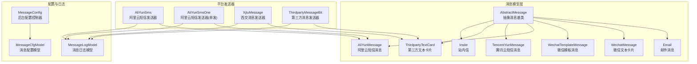
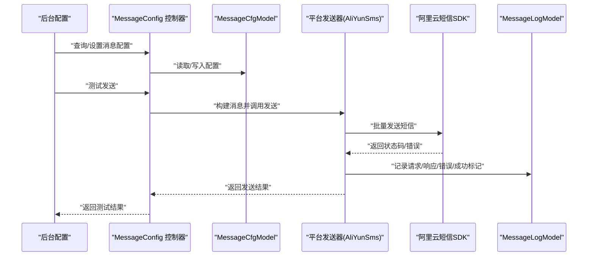
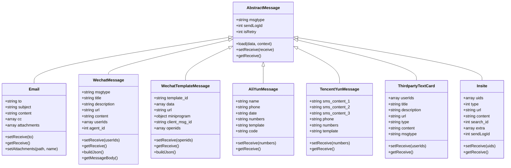
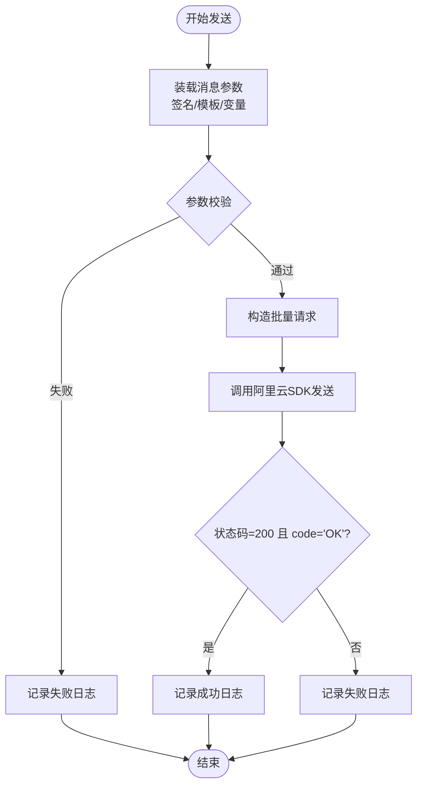
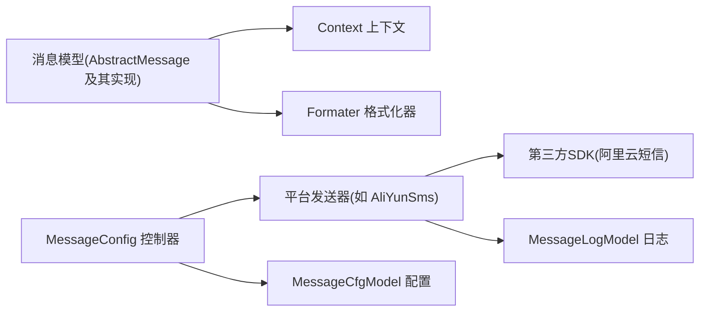

# 消息渠道管理

<cite>
**本文引用的文件**
- [AbstractMessage.php](file://process/src/services/notice/message/AbstractMessage.php)
- [Email.php](file://process/src/services/notice/message/Email.php)
- [WechatMessage.php](file://process/src/services/notice/message/WechatMessage.php)
- [WechatTemplateMessage.php](file://process/src/services/notice/message/WechatTemplateMessage.php)
- [AliYunMessage.php](file://process/src/services/notice/message/AliYunMessage.php)
- [TencentYunMessage.php](file://process/src/services/notice/message/TencentYunMessage.php)
- [ThirdpartyTextCard.php](file://process/src/services/notice/message/ThirdpartyTextCard.php)
- [Insite.php](file://process/src/services/notice/message/Insite.php)
- [AliYunSms.php](file://process/src/services/platform/AliYunSms.php)
- [AliYunSmsOne.php](file://process/src/services/platform/AliYunSmsOne.php)
- [XjtuMessage.php](file://process/src/services/platform/XjtuMessage.php)
- [ThirdpartyMessageBit.php](file://process/src/services/platform/ThirdpartyMessageBit.php)
- [MessageCfgModel.php](file://process/src/models/MessageCfgModel.php)
- [MessageLogModel.php](file://process/src/models/MessageLogModel.php)
- [MessageConfig.php](file://process/src/http/system/MessageConfig.php)
- [database.sql](file://process/docs/sql/database.sql)
</cite>

## 目录
1. [引言](#引言)
2. [项目结构](#项目结构)
3. [核心组件](#核心组件)
4. [架构总览](#架构总览)
5. [详细组件分析](#详细组件分析)
6. [依赖关系分析](#依赖关系分析)
7. [性能考虑](#性能考虑)
8. [故障排查指南](#故障排查指南)
9. [结论](#结论)
10. [附录](#附录)

## 引言
本文件面向 htdNew 项目中的“消息渠道管理”子系统，系统性梳理消息抽象模型、各类消息渠道（邮件、微信、阿里云短信、腾讯云短信、站内信等）的实现机制与接入方式，覆盖配置参数、发送接口、错误处理与状态跟踪，并给出模板使用方法、渠道特性、性能优化策略以及新增渠道的接入指南与最佳实践。

## 项目结构
消息渠道相关代码主要分布在以下目录与文件：
- 抽象与具体消息模型：process/src/services/notice/message
- 平台发送器（渠道适配层）：process/src/services/platform
- 配置与日志模型：process/src/models
- 后台配置接口：process/src/http/system/MessageConfig.php
- 数据库结构：process/docs/sql/database.sql

图表来源
- [AbstractMessage.php](file://process/src/services/notice/message/AbstractMessage.php#L1-L31)
- [Email.php](file://process/src/services/notice/message/Email.php#L1-L37)
- [WechatMessage.php](file://process/src/services/notice/message/WechatMessage.php#L1-L76)
- [WechatTemplateMessage.php](file://process/src/services/notice/message/WechatTemplateMessage.php#L1-L90)
- [AliYunMessage.php](file://process/src/services/notice/message/AliYunMessage.php#L1-L28)
- [TencentYunMessage.php](file://process/src/services/notice/message/TencentYunMessage.php#L1-L28)
- [ThirdpartyTextCard.php](file://process/src/services/notice/message/ThirdpartyTextCard.php#L1-L38)
- [Insite.php](file://process/src/services/notice/message/Insite.php#L1-L51)
- [AliYunSms.php](file://process/src/services/platform/AliYunSms.php#L1-L280)
- [AliYunSmsOne.php](file://process/src/services/platform/AliYunSmsOne.php#L1-L43)
- [XjtuMessage.php](file://process/src/services/platform/XjtuMessage.php#L89-L123)
- [ThirdpartyMessageBit.php](file://process/src/services/platform/ThirdpartyMessageBit.php#L46-L84)
- [MessageCfgModel.php](file://process/src/models/MessageCfgModel.php#L1-L133)
- [MessageLogModel.php](file://process/src/models/MessageLogModel.php#L1-L34)
- [MessageConfig.php](file://process/src/http/system/MessageConfig.php#L1-L374)

章节来源
- [MessageConfig.php](file://process/src/http/system/MessageConfig.php#L1-L374)
- [MessageCfgModel.php](file://process/src/models/MessageCfgModel.php#L1-L133)
- [MessageLogModel.php](file://process/src/models/MessageLogModel.php#L1-L34)
- [database.sql](file://process/docs/sql/database.sql#L502-L539)

## 核心组件
- 抽象消息基类 AbstractMessage：统一消息装载、接收者设置与获取，提供模板参数解析与上下文注入能力。
- 具体消息模型：Email、WechatMessage、WechatTemplateMessage、AliYunMessage、TencentYunMessage、ThirdpartyTextCard、Insite 等，分别承载不同渠道的消息字段与序列化逻辑。
- 平台发送器：AliYunSms、AliYunSmsOne、XjtuMessage、ThirdpartyMessageBit 等，负责对接第三方平台或内部通道，封装发送流程、参数校验、错误处理与交互日志。
- 配置与日志：MessageCfgModel 维护消息类型、平台与应用维度的配置；MessageLogModel 记录每次发送的请求、响应、错误与成功标记；MessageConfig 控制器提供后台配置、格式化模板与测试发送。

章节来源
- [AbstractMessage.php](file://process/src/services/notice/message/AbstractMessage.php#L1-L31)
- [Email.php](file://process/src/services/notice/message/Email.php#L1-L37)
- [WechatMessage.php](file://process/src/services/notice/message/WechatMessage.php#L1-L76)
- [WechatTemplateMessage.php](file://process/src/services/notice/message/WechatTemplateMessage.php#L1-L90)
- [AliYunMessage.php](file://process/src/services/notice/message/AliYunMessage.php#L1-L28)
- [TencentYunMessage.php](file://process/src/services/notice/message/TencentYunMessage.php#L1-L28)
- [ThirdpartyTextCard.php](file://process/src/services/notice/message/ThirdpartyTextCard.php#L1-L38)
- [Insite.php](file://process/src/services/notice/message/Insite.php#L1-L51)
- [AliYunSms.php](file://process/src/services/platform/AliYunSms.php#L1-L280)
- [AliYunSmsOne.php](file://process/src/services/platform/AliYunSmsOne.php#L1-L43)
- [XjtuMessage.php](file://process/src/services/platform/XjtuMessage.php#L89-L123)
- [ThirdpartyMessageBit.php](file://process/src/services/platform/ThirdpartyMessageBit.php#L46-L84)
- [MessageCfgModel.php](file://process/src/models/MessageCfgModel.php#L1-L133)
- [MessageLogModel.php](file://process/src/models/MessageLogModel.php#L1-L34)
- [MessageConfig.php](file://process/src/http/system/MessageConfig.php#L1-L374)

## 架构总览
消息从“配置—装载—发送—记录”的链路组织，后台通过 MessageConfig 提供配置与测试入口，平台发送器根据渠道特性组装参数并调用第三方 SDK 或内部接口，最终落库记录发送日志。

图表来源
- [MessageConfig.php](file://process/src/http/system/MessageConfig.php#L1-L374)
- [MessageCfgModel.php](file://process/src/models/MessageCfgModel.php#L1-L133)
- [AliYunSms.php](file://process/src/services/platform/AliYunSms.php#L1-L280)
- [MessageLogModel.php](file://process/src/models/MessageLogModel.php#L1-L34)

## 详细组件分析

### 抽象消息与消息模型
- AbstractMessage
  - 职责：统一从模板数据装载消息属性，注入上下文（如 sendLogId），并定义接收者设置/获取接口。
  - 关键点：使用格式化器按上下文替换占位符；支持重试标记与日志关联。
- Email
  - 字段：收件人、主题、正文、抄送、附件。
  - 特性：支持正文富文本格式化；可附加文件。
- WechatMessage
  - 字段：消息类型（text/textcard）、标题/描述/链接、文本内容、企业微信 Agent ID、接收用户ID集合。
  - 特性：根据 agent_id 生成消息体；支持 textcard 与 text 两种消息体。
- WechatTemplateMessage
  - 字段：模板ID、数据映射、跳转URL、小程序参数、防重 client_msg_id、接收 openid 列表。
  - 特性：逐 openid 生成 JSON，确保每条模板消息独立；强制要求 URL。
- AliYunMessage / TencentYunMessage
  - 字段：模板参数（如 code/date/name）、手机号/号码、模板标识。
  - 特性：统一接收者接口 setReceive/getReceive；短信模板参数由平台侧配置驱动。
- ThirdpartyTextCard
  - 字段：标题/描述/链接、消息类型、内容、msgtype、接收用户ID集合。
  - 特性：通用第三方文本卡片消息，常用于企业微信/钉钉等外部平台。
- Insite
  - 字段：接收用户ID集合、类型、URL、内容、search_id、extra、sendLogId。
  - 特性：站内信专用，支持基于任务ID或会话ID的搜索标识，便于失效清理。

图表来源
- [AbstractMessage.php](file://process/src/services/notice/message/AbstractMessage.php#L1-L31)
- [Email.php](file://process/src/services/notice/message/Email.php#L1-L37)
- [WechatMessage.php](file://process/src/services/notice/message/WechatMessage.php#L1-L76)
- [WechatTemplateMessage.php](file://process/src/services/notice/message/WechatTemplateMessage.php#L1-L90)
- [AliYunMessage.php](file://process/src/services/notice/message/AliYunMessage.php#L1-L28)
- [TencentYunMessage.php](file://process/src/services/notice/message/TencentYunMessage.php#L1-L28)
- [ThirdpartyTextCard.php](file://process/src/services/notice/message/ThirdpartyTextCard.php#L1-L38)
- [Insite.php](file://process/src/services/notice/message/Insite.php#L1-L51)

章节来源
- [AbstractMessage.php](file://process/src/services/notice/message/AbstractMessage.php#L1-L31)
- [Email.php](file://process/src/services/notice/message/Email.php#L1-L37)
- [WechatMessage.php](file://process/src/services/notice/message/WechatMessage.php#L1-L76)
- [WechatTemplateMessage.php](file://process/src/services/notice/message/WechatTemplateMessage.php#L1-L90)
- [AliYunMessage.php](file://process/src/services/notice/message/AliYunMessage.php#L1-L28)
- [TencentYunMessage.php](file://process/src/services/notice/message/TencentYunMessage.php#L1-L28)
- [ThirdpartyTextCard.php](file://process/src/services/notice/message/ThirdpartyTextCard.php#L1-L38)
- [Insite.php](file://process/src/services/notice/message/Insite.php#L1-L51)

### 平台发送器与渠道实现

#### 阿里云短信（AliYunSms）
- 能力与限制
  - 支持批量发送，单次最多 100 个手机号。
  - 通过模板参数动态拼装签名与模板变量。
- 关键流程
  - 参数准备：从消息中提取模板参数、签名、模板编码。
  - 客户端初始化：使用 AccessKey/Secret 创建 SDK 客户端。
  - 批量发送：构造批量请求并调用 SDK。
  - 结果记录：写入交互日志与发送日志。
- 错误处理
  - 参数校验失败：记录失败原因并返回。
  - SDK 异常捕获：记录异常信息与堆栈。
- 配置参数
  - app_key、app_secret（AccessKey/Secret）。
  - 模板配置由平台侧事件扩展，支持多模板与多签名组合。

图表来源
- [AliYunSms.php](file://process/src/services/platform/AliYunSms.php#L1-L280)
- [MessageLogModel.php](file://process/src/models/MessageLogModel.php#L1-L34)

章节来源
- [AliYunSms.php](file://process/src/services/platform/AliYunSms.php#L1-L280)

#### 阿里云短信（AliYunSmsOne，单发）
- 适用场景：单条短信发送。
- 关键点：复用阿里云 SDK 的单发接口，参数与日志记录同上。

章节来源
- [AliYunSmsOne.php](file://process/src/services/platform/AliYunSmsOne.php#L1-L43)
- [AliYunSms.php](file://process/src/services/platform/AliYunSms.php#L1-L280)

#### 西安交通大学消息（XjtuMessage）
- 业务逻辑：根据消息类型选择通道与内容格式，组装短信内容与标题，进行发送。
- 关键点：当消息类型为特定移动端类型时，优先使用对应通道；否则按常规描述+链接拼接短信内容。

章节来源
- [XjtuMessage.php](file://process/src/services/platform/XjtuMessage.php#L89-L123)

#### 第三方消息（ThirdpartyMessageBit）
- 用途：向第三方平台推送文本卡片消息，支持标题、描述、链接等字段。
- 关键点：构建接收者列表与消息体，打印调试信息辅助定位问题。

章节来源
- [ThirdpartyMessageBit.php](file://process/src/services/platform/ThirdpartyMessageBit.php#L46-L84)

#### 邮件（Email）
- 适用：邮件发送，支持主题、正文、抄送、附件。
- 关键点：正文支持富文本格式化；附件以路径与名称形式附加。

章节来源
- [Email.php](file://process/src/services/notice/message/Email.php#L1-L37)

#### 微信（WechatMessage / WechatTemplateMessage）
- 文本卡片消息：支持标题、描述、链接，按 agent_id 生成消息体。
- 模板消息：逐 openid 生成 JSON，强制要求 URL；支持小程序跳转与防重 client_msg_id。

章节来源
- [WechatMessage.php](file://process/src/services/notice/message/WechatMessage.php#L1-L76)
- [WechatTemplateMessage.php](file://process/src/services/notice/message/WechatTemplateMessage.php#L1-L90)

#### 站内信（Insite）
- 适用：站内消息展示与检索，支持类型、URL、内容、search_id 与 extra 扩展字段。
- 关键点：search_id 由任务ID或会话ID派生，便于失效清理。

章节来源
- [Insite.php](file://process/src/services/notice/message/Insite.php#L1-L51)

### 配置与模板
- 消息类型与渠道能力
  - MessageCfgModel 定义了多种消息类型（如待办、催办、超时、短信验证码、邮件验证码等），并标注其通知类型（短信/邮件/其他）。
  - 后台接口 MessageConfig 提供类型列表、变量列表、格式化模板列表、设置与删除配置、测试发送等功能。
- 模板参数
  - 各平台发送器通过 getFormatConfig 与 buildMessageConfig 注入模板类型与参数，再由消息模型 load 时按上下文解析。
- 配置持久化
  - message_cfg 表按 message_type + platform_id + app_id 唯一索引存储配置；message_log 记录每次发送的请求、响应、错误与成功标记。

章节来源
- [MessageCfgModel.php](file://process/src/models/MessageCfgModel.php#L1-L133)
- [MessageConfig.php](file://process/src/http/system/MessageConfig.php#L1-L374)
- [database.sql](file://process/docs/sql/database.sql#L502-L539)

## 依赖关系分析
- 消息模型依赖格式化器与上下文，用于从模板数据装载属性。
- 平台发送器依赖第三方 SDK（如阿里云短信）与交互日志模型，负责参数校验、SDK 调用与日志落库。
- 后台控制器依赖消息配置模型与平台对象，提供配置查询、设置、测试与定时任务配置。

图表来源
- [AbstractMessage.php](file://process/src/services/notice/message/AbstractMessage.php#L1-L31)
- [AliYunSms.php](file://process/src/services/platform/AliYunSms.php#L1-L280)
- [MessageLogModel.php](file://process/src/models/MessageLogModel.php#L1-L34)
- [MessageConfig.php](file://process/src/http/system/MessageConfig.php#L1-L374)
- [MessageCfgModel.php](file://process/src/models/MessageCfgModel.php#L1-L133)

## 性能考虑
- 批量发送优化
  - 阿里云短信支持批量发送，建议尽量合并相同签名与模板的请求，避免频繁切换模板导致吞吐下降。
- 日志与追踪
  - 发送前记录交互日志，成功/失败均写入 message_log，便于后续审计与重放。
- 模板与变量解析
  - 使用上下文一次性解析模板变量，减少重复计算；对大字段（如富文本）注意控制大小。
- 并发与限流
  - 对第三方 SDK 接口建议增加限速与重试策略，避免触发平台限流。
- 站内信检索
  - search_id 采用任务ID/会话ID拼接策略，便于快速失效清理，降低无效消息存储成本。

## 故障排查指南
- 常见问题定位
  - 参数缺失：阿里云短信 doSend 中对模板编码、手机号、签名进行必填校验，若为空则记录失败并返回。
  - SDK 异常：捕获异常并记录错误信息与堆栈，便于定位网络/鉴权/参数问题。
  - 模板消息 URL 缺失：微信模板消息强制要求 URL，未提供将抛出用户异常。
- 日志与回溯
  - message_log 记录请求/响应/错误/成功标记，结合后台交互日志定位问题。
- 快速验证
  - 使用后台接口的“测试发送”功能，选择平台与格式类型，传入配置与上下文，查看返回结果。

章节来源
- [AliYunSms.php](file://process/src/services/platform/AliYunSms.php#L133-L210)
- [WechatTemplateMessage.php](file://process/src/services/notice/message/WechatTemplateMessage.php#L45-L64)
- [MessageLogModel.php](file://process/src/models/MessageLogModel.php#L1-L34)
- [MessageConfig.php](file://process/src/http/system/MessageConfig.php#L344-L374)

## 结论
htdNew 的消息渠道管理以抽象消息模型为核心，通过平台发送器适配不同渠道，配合后台配置与日志体系，实现了灵活、可观测的消息发送能力。针对短信、邮件、微信与站内信等渠道，系统提供了清晰的参数规范、错误处理与性能优化建议。新增渠道时，建议遵循“消息模型 + 平台发送器 + 配置与日志”的三段式设计，确保一致性与可维护性。

## 附录

### 新增消息渠道接入指南
- 设计阶段
  - 定义消息模型：继承 AbstractMessage，声明必要字段，实现 setReceive/getReceive。
  - 若需要模板化，参考 WechatTemplateMessage 的逐 openid 生成 JSON 的模式。
- 平台适配
  - 实现平台发送器：实现发送流程、参数校验、SDK 调用与日志记录。
  - 在后台控制器中注册平台能力与格式化模板。
- 配置与测试
  - 在后台配置消息类型与平台模板，使用“测试发送”验证。
  - 关注 message_log 与交互日志，确保异常可追踪。
- 最佳实践
  - 批量发送优先；参数校验前置；异常捕获与日志记录完备；模板变量解析集中处理；对敏感字段（如 AccessKey）严格保密。

章节来源
- [AbstractMessage.php](file://process/src/services/notice/message/AbstractMessage.php#L1-L31)
- [AliYunSms.php](file://process/src/services/platform/AliYunSms.php#L1-L280)
- [MessageConfig.php](file://process/src/http/system/MessageConfig.php#L1-L374)
- [MessageLogModel.php](file://process/src/models/MessageLogModel.php#L1-L34)