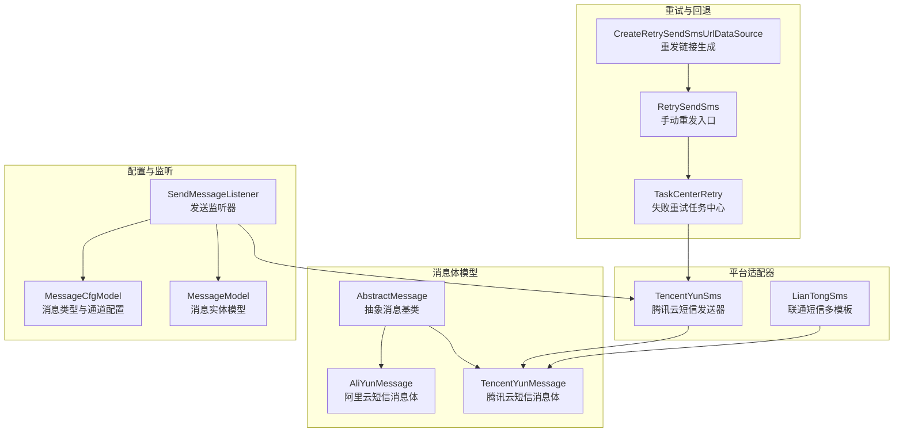
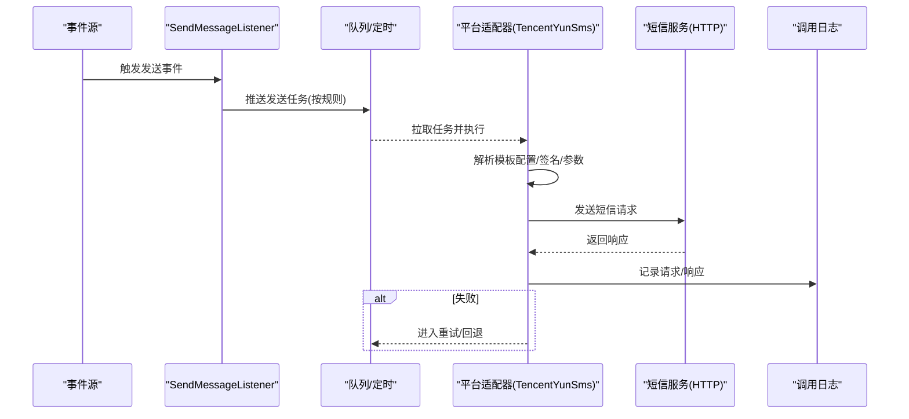
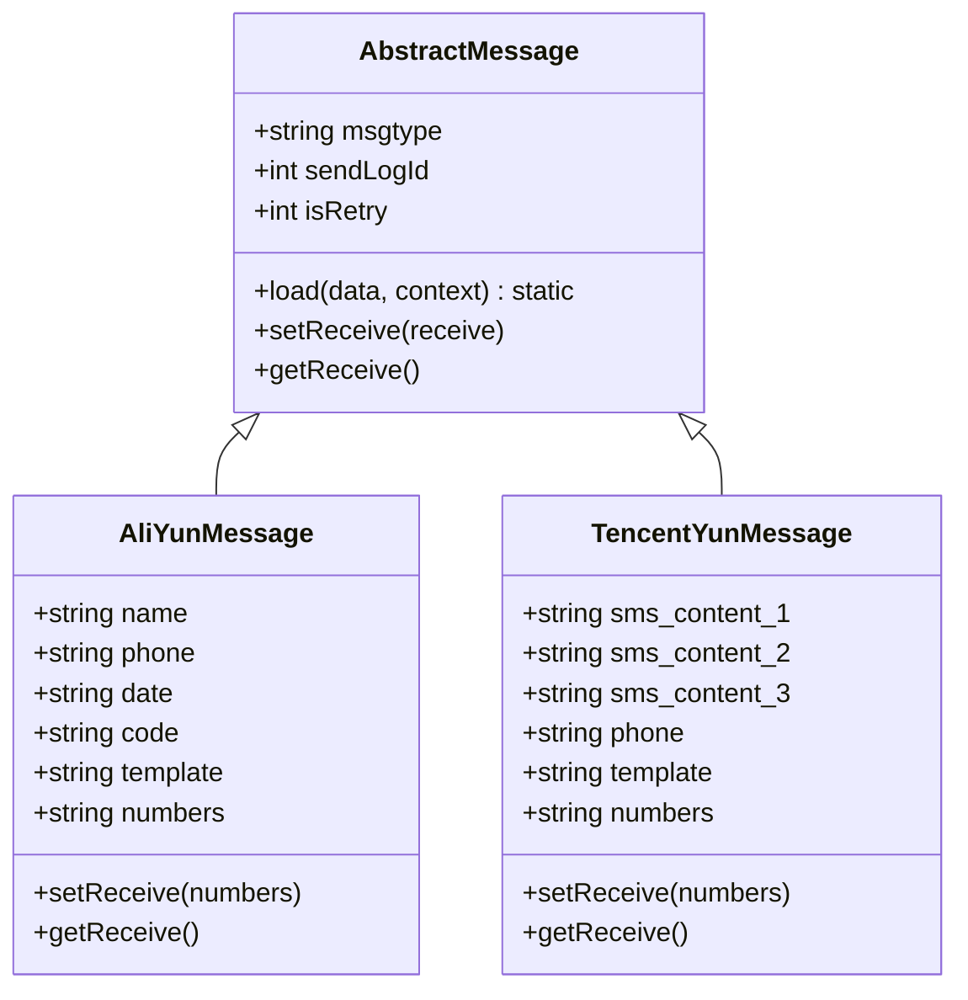
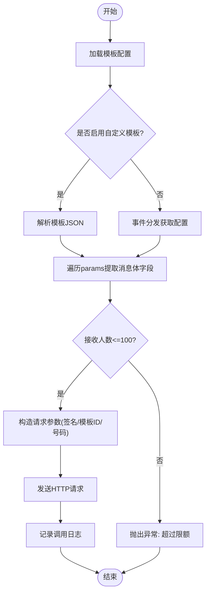
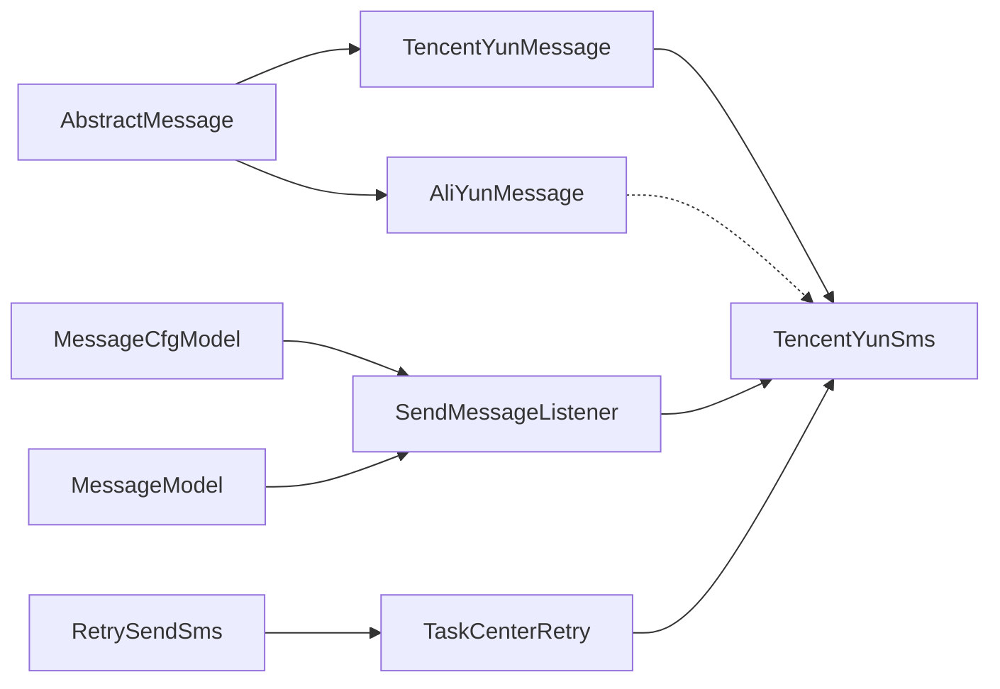
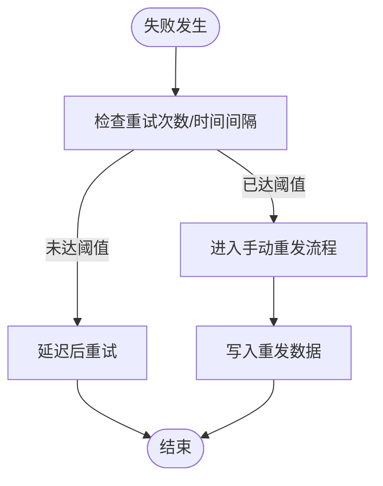

# 短信消息渠道

<cite>
**本文引用的文件**
- [AliYunMessage.php](file://process/src/services/notice/message/AliYunMessage.php)
- [TencentYunMessage.php](file://process/src/services/notice/message/TencentYunMessage.php)
- [AbstractMessage.php](file://process/src/services/notice/message/AbstractMessage.php)
- [TencentYunSms.php](file://process/src/services/platform/TencentYunSms.php)
- [LianTongSms.php](file://process/src/services/platform/LianTongSms.php)
- [MessageCfgModel.php](file://process/src/models/MessageCfgModel.php)
- [MessageModel.php](file://process/src/models/MessageModel.php)
- [SendMessageListener.php](file://process/src/services/listeners/SendMessageListener.php)
- [TaskCenterRetry.php](file://process/src/services/task/TaskCenterRetry.php)
- [RetrySendSms.php](file://process_envs/tmmu/product/http/site/RetrySendSms.php)
- [CreateRetrySendSmsUrlDataSource.php](file://process_envs/tmmu/product/datasource/CreateRetrySendSmsUrlDataSource.php)
- [TencentYunSmsFormatConfigListener.php](file://process_envs/cup/product/listeners/TencentYunSmsFormatConfigListener.php)
- [ZnEntranceSystem.php](file://process_envs/cup/product/tools/ZnEntranceSystem.php)
</cite>

## 目录
1. [简介](#简介)
2. [项目结构](#项目结构)
3. [核心组件](#核心组件)
4. [架构总览](#架构总览)
5. [组件详解](#组件详解)
6. [依赖关系分析](#依赖关系分析)
7. [性能与容量](#性能与容量)
8. [故障排查与重试回退](#故障排查与重试回退)
9. [结论](#结论)
10. [附录](#附录)

## 简介
本文件面向 htdNew 项目的短信消息渠道，聚焦于两类短信服务商接入：阿里云短信与腾讯云短信。文档围绕以下目标展开：
- 解释 AliYunMessage 与 TencentYunMessage 的实现机制与差异
- 说明短信服务集成、签名配置、模板管理与变量替换流程
- 详述短信发送配置参数、模板变量映射、发送状态与费用控制要点
- 对比两家服务商的 API 差异、调用限额与错误处理机制
- 提供重试策略、失败回退与监控告警建议
- 给出短信模板审核与合规性指引

## 项目结构
短信能力由“消息体模型 + 平台适配器 + 配置与监听 + 重试与回退”四层构成：
- 消息体模型：抽象消息基类与具体消息类（阿里云/腾讯云）
- 平台适配器：各平台发送器（如腾讯云短信）
- 配置与监听：消息类型与发送规则、队列/定时调度
- 重试与回退：失败重试、手动重发入口

图表来源
- [AliYunMessage.php](file://process/src/services/notice/message/AliYunMessage.php#L1-L29)
- [TencentYunMessage.php](file://process/src/services/notice/message/TencentYunMessage.php#L1-L28)
- [AbstractMessage.php](file://process/src/services/notice/message/AbstractMessage.php#L1-L31)
- [TencentYunSms.php](file://process/src/services/platform/TencentYunSms.php#L1-L243)
- [LianTongSms.php](file://process/src/services/platform/LianTongSms.php#L202-L243)
- [MessageCfgModel.php](file://process/src/models/MessageCfgModel.php#L1-L133)
- [MessageModel.php](file://process/src/models/MessageModel.php#L1-L111)
- [SendMessageListener.php](file://process/src/services/listeners/SendMessageListener.php#L1-L274)
- [TaskCenterRetry.php](file://process/src/services/task/TaskCenterRetry.php#L113-L185)
- [RetrySendSms.php](file://process_envs/tmmu/product/http/site/RetrySendSms.php#L1-L34)
- [CreateRetrySendSmsUrlDataSource.php](file://process_envs/tmmu/product/datasource/CreateRetrySendSmsUrlDataSource.php#L93-L123)

章节来源
- [AliYunMessage.php](file://process/src/services/notice/message/AliYunMessage.php#L1-L29)
- [TencentYunMessage.php](file://process/src/services/notice/message/TencentYunMessage.php#L1-L28)
- [AbstractMessage.php](file://process/src/services/notice/message/AbstractMessage.php#L1-L31)
- [TencentYunSms.php](file://process/src/services/platform/TencentYunSms.php#L1-L243)
- [LianTongSms.php](file://process/src/services/platform/LianTongSms.php#L202-L243)
- [MessageCfgModel.php](file://process/src/models/MessageCfgModel.php#L1-L133)
- [MessageModel.php](file://process/src/models/MessageModel.php#L1-L111)
- [SendMessageListener.php](file://process/src/services/listeners/SendMessageListener.php#L1-L274)
- [TaskCenterRetry.php](file://process/src/services/task/TaskCenterRetry.php#L113-L185)
- [RetrySendSms.php](file://process_envs/tmmu/product/http/site/RetrySendSms.php#L1-L34)
- [CreateRetrySendSmsUrlDataSource.php](file://process_envs/tmmu/product/datasource/CreateRetrySendSmsUrlDataSource.php#L93-L123)

## 核心组件
- 抽象消息基类：负责从模板数据与上下文装载消息属性，并统一接收人设置/获取接口
- 阿里云短信消息体：承载模板参数（如名称、电话、日期、验证码等），并保存模板标识
- 腾讯云短信消息体：承载模板参数（如内容字段、电话、号码集合），并保存模板标识
- 腾讯云短信发送器：封装签名、模板配置、批量发送、HTTP 请求与调用日志
- 消息类型与通道配置：定义消息类型、通道选择与发送方式
- 发送监听器：根据规则将消息推入队列或定时任务，支持重复表场景
- 失败重试与手动重发：基于任务中心重试与手动重发入口

章节来源
- [AbstractMessage.php](file://process/src/services/notice/message/AbstractMessage.php#L1-L31)
- [AliYunMessage.php](file://process/src/services/notice/message/AliYunMessage.php#L1-L29)
- [TencentYunMessage.php](file://process/src/services/notice/message/TencentYunMessage.php#L1-L28)
- [TencentYunSms.php](file://process/src/services/platform/TencentYunSms.php#L1-L243)
- [MessageCfgModel.php](file://process/src/models/MessageCfgModel.php#L1-L133)
- [SendMessageListener.php](file://process/src/services/listeners/SendMessageListener.php#L1-L274)
- [TaskCenterRetry.php](file://process/src/services/task/TaskCenterRetry.php#L113-L185)
- [RetrySendSms.php](file://process_envs/tmmu/product/http/site/RetrySendSms.php#L1-L34)

## 架构总览
短信发送的整体流程如下：
- 事件触发 → 监听器解析发送规则 → 构造消息体 → 选择平台适配器 → 平台适配器按模板与签名组装请求 → 发送并记录日志 → 失败进入重试或人工干预

图表来源
- [SendMessageListener.php](file://process/src/services/listeners/SendMessageListener.php#L76-L105)
- [TencentYunSms.php](file://process/src/services/platform/TencentYunSms.php#L145-L219)

章节来源
- [SendMessageListener.php](file://process/src/services/listeners/SendMessageListener.php#L1-L274)
- [TencentYunSms.php](file://process/src/services/platform/TencentYunSms.php#L145-L219)

## 组件详解

### 抽象消息与具体消息体
- 抽象消息基类提供 load 方法，依据模板数据与上下文动态填充消息属性，并设置发送日志 ID
- 阿里云消息体：包含名称、电话、日期、验证码等字段，以及模板标识与接收人集合
- 腾讯云消息体：包含内容字段、电话、接收人集合，以及模板标识

图表来源
- [AbstractMessage.php](file://process/src/services/notice/message/AbstractMessage.php#L1-L31)
- [AliYunMessage.php](file://process/src/services/notice/message/AliYunMessage.php#L1-L29)
- [TencentYunMessage.php](file://process/src/services/notice/message/TencentYunMessage.php#L1-L28)

章节来源
- [AbstractMessage.php](file://process/src/services/notice/message/AbstractMessage.php#L1-L31)
- [AliYunMessage.php](file://process/src/services/notice/message/AliYunMessage.php#L1-L29)
- [TencentYunMessage.php](file://process/src/services/notice/message/TencentYunMessage.php#L1-L28)

### 腾讯云短信发送器（核心实现）
- 模板配置与签名
  - 支持自定义模板开关与模板 JSON 配置；若未启用自定义模板，将通过事件分发器获取格式化配置
  - 签名采用哈希算法生成，确保请求完整性
- 批量发送与限额
  - 单次发送人数上限为 100；超过将抛出异常
- 参数映射与模板变量
  - 依据模板配置 params 中的 key，从消息体中提取对应字段，按顺序组成模板变量数组
- 请求与日志
  - 通过 HTTP 请求发送，记录请求/响应与状态

图表来源
- [TencentYunSms.php](file://process/src/services/platform/TencentYunSms.php#L83-L177)
- [TencentYunSms.php](file://process/src/services/platform/TencentYunSms.php#L180-L219)

章节来源
- [TencentYunSms.php](file://process/src/services/platform/TencentYunSms.php#L50-L123)
- [TencentYunSms.php](file://process/src/services/platform/TencentYunSms.php#L128-L177)
- [TencentYunSms.php](file://process/src/services/platform/TencentYunSms.php#L180-L219)

### 阿里云短信消息体
- 字段覆盖：名称、电话、日期、验证码、模板标识、接收人集合
- 用途：承载模板变量，配合阿里云平台适配器进行发送

章节来源
- [AliYunMessage.php](file://process/src/services/notice/message/AliYunMessage.php#L1-L29)

### 消息类型与通道配置
- 消息类型：涵盖待办、催办、超时、加签、驳回、知会、撤销、申请通过、终止、每日待办、短信验证码、邮件验证码、服务通知、填报任务等
- 通道选择：通过消息配置表选择平台与发送方式（默认/不发送/自定义）

章节来源
- [MessageCfgModel.php](file://process/src/models/MessageCfgModel.php#L39-L133)
- [MessageModel.php](file://process/src/models/MessageModel.php#L1-L111)

### 发送监听器与调度
- 触发时机：事务完成后入队或按规则定时
- 循环/自定义发送：支持按天/小时/分钟间隔与自定义时刻
- 重复表场景：按重复表拆分任务并逐条发送

章节来源
- [SendMessageListener.php](file://process/src/services/listeners/SendMessageListener.php#L76-L105)
- [SendMessageListener.php](file://process/src/services/listeners/SendMessageListener.php#L100-L185)
- [SendMessageListener.php](file://process/src/services/listeners/SendMessageListener.php#L239-L274)

### 失败重试与手动重发
- 任务中心重试：检查失败时间间隔与重试次数阈值，满足条件则重新推送
- 手动重发：提供重发链接入口，将短信内容写入数据库以便后续处理

章节来源
- [TaskCenterRetry.php](file://process/src/services/task/TaskCenterRetry.php#L113-L185)
- [RetrySendSms.php](file://process_envs/tmmu/product/http/site/RetrySendSms.php#L1-L34)
- [CreateRetrySendSmsUrlDataSource.php](file://process_envs/tmmu/product/datasource/CreateRetrySendSmsUrlDataSource.php#L93-L123)

## 依赖关系分析
- 消息体与平台解耦：消息体仅负责参数装载，平台适配器负责签名、模板与网络调用
- 模板配置事件：腾讯云发送器在未启用自定义模板时，通过事件分发器注入格式化配置
- 发送监听器与队列：统一调度入口，支持定时与循环发送
- 重试与回退：任务中心与手动入口互补，提升可靠性

图表来源
- [AbstractMessage.php](file://process/src/services/notice/message/AbstractMessage.php#L1-L31)
- [AliYunMessage.php](file://process/src/services/notice/message/AliYunMessage.php#L1-L29)
- [TencentYunMessage.php](file://process/src/services/notice/message/TencentYunMessage.php#L1-L28)
- [TencentYunSms.php](file://process/src/services/platform/TencentYunSms.php#L1-L243)
- [MessageCfgModel.php](file://process/src/models/MessageCfgModel.php#L1-L133)
- [MessageModel.php](file://process/src/models/MessageModel.php#L1-L111)
- [SendMessageListener.php](file://process/src/services/listeners/SendMessageListener.php#L1-L274)
- [TaskCenterRetry.php](file://process/src/services/task/TaskCenterRetry.php#L113-L185)
- [RetrySendSms.php](file://process_envs/tmmu/product/http/site/RetrySendSms.php#L1-L34)

章节来源
- [TencentYunSms.php](file://process/src/services/platform/TencentYunSms.php#L71-L113)
- [SendMessageListener.php](file://process/src/services/listeners/SendMessageListener.php#L1-L274)

## 性能与容量
- 腾讯云单次发送上限：100 条
- 调度策略：监听器支持一次性、循环与自定义时间点发送，避免瞬时洪峰
- 日志与可观测性：平台适配器记录请求/响应与状态，便于追踪与审计

章节来源
- [TencentYunSms.php](file://process/src/services/platform/TencentYunSms.php#L155-L157)
- [SendMessageListener.php](file://process/src/services/listeners/SendMessageListener.php#L100-L185)
- [TencentYunSms.php](file://process/src/services/platform/TencentYunSms.php#L206-L219)

## 故障排查与重试回退
- 重试策略
  - 任务中心重试：按失败时间与重试次数阈值判定是否再次推送
  - 平台适配器内部可结合业务扩展重试（如网络异常时指数退避）
- 失败回退
  - 手动重发入口：生成重发链接，将短信内容落库，便于后续补发
- 监控告警
  - 建议对发送失败率、超时率、限额触发次数进行监控与告警

图表来源
- [TaskCenterRetry.php](file://process/src/services/task/TaskCenterRetry.php#L129-L167)
- [RetrySendSms.php](file://process_envs/tmmu/product/http/site/RetrySendSms.php#L1-L34)
- [CreateRetrySendSmsUrlDataSource.php](file://process_envs/tmmu/product/datasource/CreateRetrySendSmsUrlDataSource.php#L93-L123)

章节来源
- [TaskCenterRetry.php](file://process/src/services/task/TaskCenterRetry.php#L113-L185)
- [RetrySendSms.php](file://process_envs/tmmu/product/http/site/RetrySendSms.php#L1-L34)
- [CreateRetrySendSmsUrlDataSource.php](file://process_envs/tmmu/product/datasource/CreateRetrySendSmsUrlDataSource.php#L93-L123)

## 结论
- 阿里云与腾讯云短信在消息体层面保持一致的装载与接收人接口，在平台适配器层面分别实现各自的签名、模板与调用细节
- 腾讯云发送器提供了完善的模板配置、签名与限额控制，并具备事件驱动的配置扩展能力
- 发送监听器与任务中心重试共同保障了发送的可靠性与可运维性
- 建议在生产环境中完善重试退避、限额预警与费用统计，确保稳定与合规

## 附录

### 短信模板审核与合规要求（实践建议）
- 模板内容应明确、简洁，避免歧义；变量占位清晰标注必填项
- 签名需与运营商审核一致，避免使用敏感或违规词汇
- 发送频率与总量需符合平台限额，避免触发风控
- 建立模板变更审批流程与灰度发布机制
- 对外发送需遵守隐私保护与用户授权原则，保留用户同意记录

### 关键实现路径参考
- 模板配置与参数装载
  - [AbstractMessage::load](file://process/src/services/notice/message/AbstractMessage.php#L15-L26)
  - [TencentYunSms::getFormatConfig](file://process/src/services/platform/TencentYunSms.php#L83-L113)
  - [TencentYunSms::getMsgConfig](file://process/src/services/platform/TencentYunSms.php#L116-L126)
- 发送与限额控制
  - [TencentYunSms::send](file://process/src/services/platform/TencentYunSms.php#L145-L177)
  - [TencentYunSms::doSend](file://process/src/services/platform/TencentYunSms.php#L180-L219)
- 消息类型与通道
  - [MessageCfgModel::types](file://process/src/models/MessageCfgModel.php#L67-L133)
  - [MessageModel::types](file://process/src/models/MessageModel.php#L74-L98)
- 发送监听与调度
  - [SendMessageListener::trigger](file://process/src/services/listeners/SendMessageListener.php#L43-L82)
  - [SendMessageListener::addConditionSendMessage](file://process/src/services/listeners/SendMessageListener.php#L83-L185)
- 重试与回退
  - [TaskCenterRetry::handlePushedTask](file://process/src/services/task/TaskCenterRetry.php#L125-L167)
  - [RetrySendSms::retrySendSms](file://process_envs/tmmu/product/http/site/RetrySendSms.php#L9-L26)
  - [CreateRetrySendSmsUrlDataSource::createDcrSmsUrl](file://process_envs/tmmu/product/datasource/CreateRetrySendSmsUrlDataSource.php#L93-L123)
- 示例：消息体装载与发送
  - [ZnEntranceSystem::示例调用](file://process_envs/cup/product/tools/ZnEntranceSystem.php#L273-L291)
  - [TencentYunSmsFormatConfigListener::模板配置示例](file://process_envs/cup/product/listeners/TencentYunSmsFormatConfigListener.php#L1-L35)