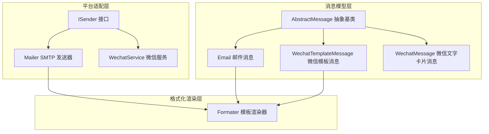
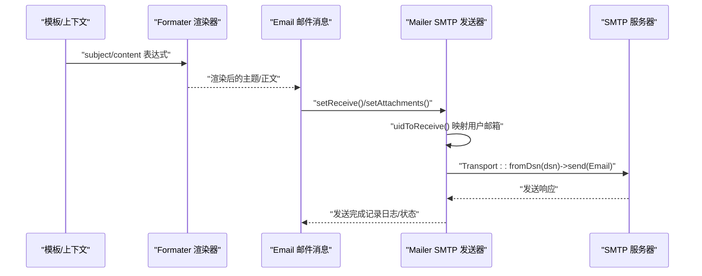
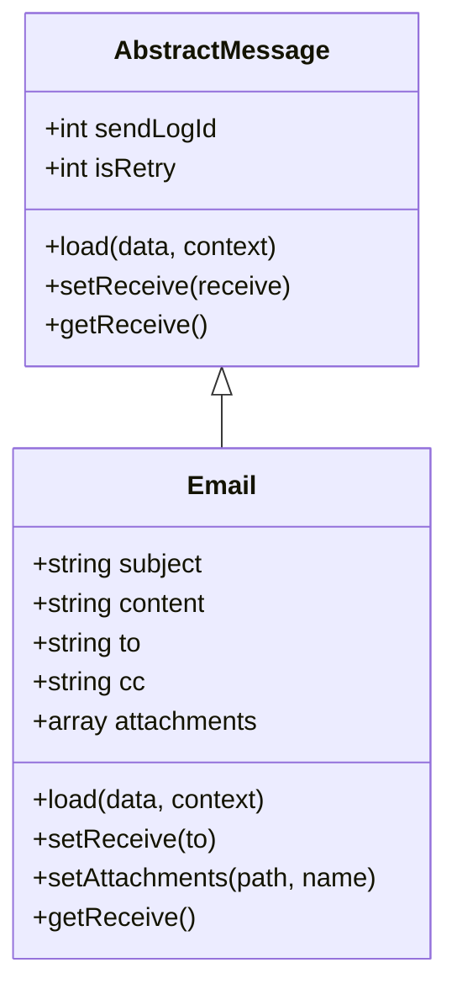
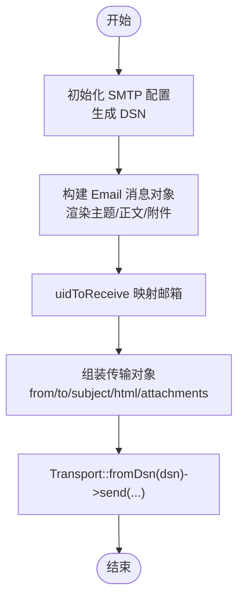
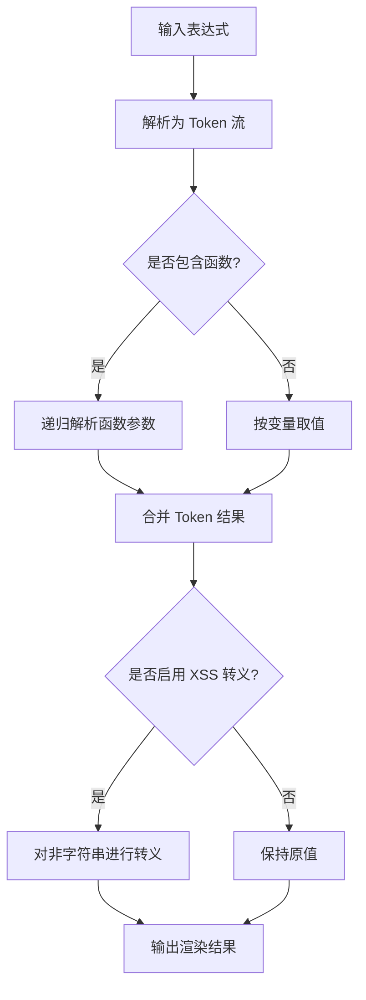
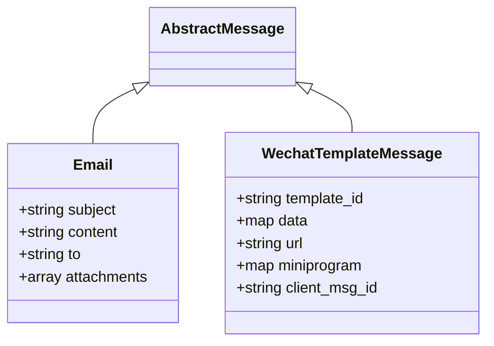
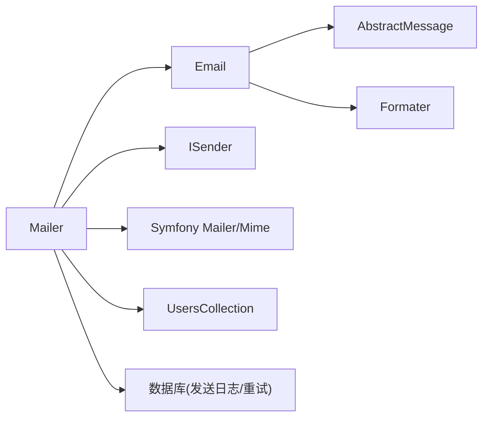

# 邮件消息渠道

<cite>
**本文引用的文件**
- [process\src\services\notice\message\AbstractMessage.php](file://process/src/services/notice/message/AbstractMessage.php)
- [process\src\services\notice\message\Email.php](file://process/src/services/notice/message/Email.php)
- [process\src\services\platform\Mailer.php](file://process/src/services/platform/Mailer.php)
- [process\src\services\platform\ISender.php](file://process/src/services/platform/ISender.php)
- [process\src\services\Formater.php](file://process/src/services/Formater.php)
- [process\src\migrations\migration_20250904_112321_login_config.php](file://process/src/migrations/migration_20250904_112321_login_config.php)
- [process\src\services\notice\message\WechatTemplateMessage.php](file://process/src/services/notice/message/WechatTemplateMessage.php)
- [process\src\services\notice\message\WechatMessage.php](file://process/src/services/notice/message/WechatMessage.php)
- [process\src\services\platform\WechatService.php](file://process/src/services/platform/WechatService.php)
</cite>

## 目录
1. [简介](#简介)
2. [项目结构](#项目结构)
3. [核心组件](#核心组件)
4. [架构总览](#架构总览)
5. [组件详解](#组件详解)
6. [依赖关系分析](#依赖关系分析)
7. [性能与可靠性](#性能与可靠性)
8. [故障排查指南](#故障排查指南)
9. [结论](#结论)
10. [附录](#附录)

## 简介
本文件面向 htdNew 项目的“邮件消息渠道”，系统性梳理 Email 消息类的实现机制与发送流程，覆盖 SMTP 配置、模板变量渲染、收件人设置、附件处理、发送状态记录与追踪等关键点；同时对比 WechatTemplateMessage 的差异与联系，给出在通知系统中的应用场景、错误处理与重试策略建议，以及邮件模板最佳实践与常见问题解决方案。

## 项目结构
邮件消息渠道由“消息模型层”“平台适配层”“格式化渲染层”三部分组成：
- 消息模型层：定义抽象消息基类与具体 Email 消息对象，负责承载模板变量、收件人、附件等信息，并提供从模板上下文加载的能力。
- 平台适配层：定义统一的发送接口与具体 SMTP 发送器，负责将消息对象转换为平台可识别的传输对象并执行发送。
- 格式化渲染层：提供模板变量解析与函数调用能力，确保主题、正文等字段在渲染后符合预期。

图示来源
- [process\src\services\notice\message\AbstractMessage.php](file://process/src/services/notice/message/AbstractMessage.php#L1-L31)
- [process\src\services\notice\message\Email.php](file://process/src/services/notice/message/Email.php#L1-L37)
- [process\src\services\platform\Mailer.php](file://process/src/services/platform/Mailer.php#L1-L128)
- [process\src\services\platform\ISender.php](file://process/src/services/platform/ISender.php#L1-L50)
- [process\src\services\Formater.php](file://process/src/services/Formater.php#L1-L200)
- [process\src\services\notice\message\WechatTemplateMessage.php](file://process/src/services/notice/message/WechatTemplateMessage.php#L1-L90)
- [process\src\services\notice\message\WechatMessage.php](file://process/src/services/notice/message/WechatMessage.php#L1-L56)
- [process\src\services\platform\WechatService.php](file://process/src/services/platform/WechatService.php#L99-L140)

章节来源
- [process\src\services\notice\message\AbstractMessage.php](file://process/src/services/notice/message/AbstractMessage.php#L1-L31)
- [process\src\services\notice\message\Email.php](file://process/src/services/notice/message/Email.php#L1-L37)
- [process\src\services\platform\Mailer.php](file://process/src/services/platform/Mailer.php#L1-L128)
- [process\src\services\platform\ISender.php](file://process/src/services/platform/ISender.php#L1-L50)
- [process\src\services\Formater.php](file://process/src/services/Formater.php#L1-L200)

## 核心组件
- 抽象消息基类 AbstractMessage
  - 提供统一的 load 方法，基于模板上下文渲染消息属性，并注入发送日志 ID 与重试标记。
  - 规定 setReceive/getReceive 的抽象契约，确保不同消息类型具备一致的接收者管理方式。
- 邮件消息 Email
  - 承载主题、正文、收件人、抄送、附件等字段。
  - 支持从模板上下文加载主题与富文本正文，并可追加附件。
- SMTP 发送器 Mailer
  - 实现 ISender 接口，负责将 Email 消息对象转换为平台传输对象并执行发送。
  - 基于 DSN 构造 SMTP 连接，支持单个或多个收件人，支持附件添加。
- 模板渲染器 Formater
  - 提供表达式解析、变量取值、函数调用与 XSS 处理能力，保障模板变量替换的安全与正确性。

章节来源
- [process\src\services\notice\message\AbstractMessage.php](file://process/src/services/notice/message/AbstractMessage.php#L1-L31)
- [process\src\services\notice\message\Email.php](file://process/src/services/notice/message/Email.php#L1-L37)
- [process\src\services\platform\Mailer.php](file://process/src/services/platform/Mailer.php#L1-L128)
- [process\src\services\Formater.php](file://process/src/services/Formater.php#L1-L200)

## 架构总览
下图展示邮件消息从模板到发送的端到端流程，包括模板变量渲染、消息对象构建、收件人映射与 SMTP 发送。

图示来源
- [process\src\services\platform\Mailer.php](file://process/src/services/platform/Mailer.php#L60-L108)
- [process\src\services\notice\message\Email.php](file://process/src/services/notice/message/Email.php#L1-L37)
- [process\src\services\Formater.php](file://process/src/services/Formater.php#L1-L200)

## 组件详解

### Email 类实现机制
- 字段与职责
  - 主题 subject、正文 content、收件人 to、抄送 cc、附件 attachments。
  - 通过 load(data, context) 从模板上下文渲染主题与富文本正文，并注入 sendLogId。
- 收件人设置
  - setReceive(to) 与 getReceive() 提供统一的接收者管理。
- 附件处理
  - setAttachments(path, name?) 追加附件，Mailer 在发送时遍历并附加到传输对象。

图示来源
- [process\src\services\notice\message\AbstractMessage.php](file://process/src/services/notice/message/AbstractMessage.php#L1-L31)
- [process\src\services\notice\message\Email.php](file://process/src/services/notice/message/Email.php#L1-L37)

章节来源
- [process\src\services\notice\message\Email.php](file://process/src/services/notice/message/Email.php#L1-L37)
- [process\src\services\notice\message\AbstractMessage.php](file://process/src/services/notice/message/AbstractMessage.php#L1-L31)

### SMTP 配置与发送流程
- 配置项
  - 类型 type、主机 host、端口 port、用户名 username、密码 password、发件人 from。
  - init() 中根据上述字段生成 DSN 字符串，供传输层使用。
- 发送流程
  - uidToReceive(uids) 将用户 ID 映射为邮箱地址列表。
  - send(message) 将 Email 对象转换为传输对象，设置发件人、收件人、主题、HTML 正文与附件，再通过 Transport::fromDsn(dsn)->send(...) 执行发送。

图示来源
- [process\src\services\platform\Mailer.php](file://process/src/services/platform/Mailer.php#L1-L128)

章节来源
- [process\src\services\platform\Mailer.php](file://process/src/services/platform/Mailer.php#L1-L128)

### 模板变量渲染与 XSS 处理
- 渲染入口
  - Formater::getValue(expression, context, xssFlag) 将表达式解析为 Token 流并求值。
- 表达式语法
  - 支持变量占位符与函数调用组合，函数参数可嵌套表达式。
- XSS 保护
  - 当 xss 为真时，会对非字符串结果进行 HTML 转义，避免富文本注入风险。
- 在 Email 中的应用
  - Email::load 使用 Formater::getValue 渲染 subject 与 content，其中 content 传入 true 开启 XSS 处理。

图示来源
- [process\src\services\Formater.php](file://process/src/services/Formater.php#L1-L200)
- [process\src\services\notice\message\Email.php](file://process/src/services/notice/message/Email.php#L1-L37)

章节来源
- [process\src\services\Formater.php](file://process/src/services/Formater.php#L1-L200)
- [process\src\services\notice\message\Email.php](file://process/src/services/notice/message/Email.php#L1-L37)

### 与 WechatTemplateMessage 的区别与联系
- 差异
  - Email 面向 SMTP 邮件通道，强调主题、HTML 正文与附件；WechatTemplateMessage 面向微信模板消息，强调 template_id、data 键值对、跳转 URL 与小程序跳转配置。
  - 收件人模型不同：Email 使用邮箱地址集合；WechatTemplateMessage 使用 openid 列表，且构建 JSON 时逐个 openid 生成消息体。
- 联系
  - 两者均继承自 AbstractMessage，遵循统一的 load 与接收者管理契约。
  - 均通过 Formater 渲染模板变量，保证消息内容的一致性与安全性。

图示来源
- [process\src\services\notice\message\AbstractMessage.php](file://process/src/services/notice/message/AbstractMessage.php#L1-L31)
- [process\src\services\notice\message\Email.php](file://process/src/services/notice/message/Email.php#L1-L37)
- [process\src\services\notice\message\WechatTemplateMessage.php](file://process/src/services/notice/message/WechatTemplateMessage.php#L1-L90)

章节来源
- [process\src\services\notice\message\WechatTemplateMessage.php](file://process/src/services/notice/message/WechatTemplateMessage.php#L1-L90)
- [process\src\services\notice\message\WechatMessage.php](file://process/src/services/notice/message/WechatMessage.php#L1-L56)
- [process\src\services\platform\WechatService.php](file://process/src/services/platform/WechatService.php#L99-L140)

### 应用场景
- 系统通知：如审批结果、任务提醒、报表生成完成等，通过 Email 直达用户邮箱。
- 报告与归档：结合附件功能，发送 PDF/Excel 等文件，满足合规与审计需求。
- 多租户与多校区：通过 uidToReceive 将用户 ID 映射为邮箱，适配不同组织的邮箱域。

[本节为概念性说明，无需列出章节来源]

## 依赖关系分析
- 组件耦合
  - Email 依赖 AbstractMessage 的 load 契约与 Formater 的渲染能力。
  - Mailer 实现 ISender 接口，依赖 Symfony 组件进行 SMTP 发送，并通过 UsersCollection 将 UID 映射为邮箱。
- 外部依赖
  - Symfony Mailer/ Mime：负责 DSN 构造、传输与邮件对象构建。
  - 数据库：发送日志与重试数据结构由迁移脚本定义，便于追踪与重试。

图示来源
- [process\src\services\notice\message\Email.php](file://process/src/services/notice/message/Email.php#L1-L37)
- [process\src\services\notice\message\AbstractMessage.php](file://process/src/services/notice/message/AbstractMessage.php#L1-L31)
- [process\src\services\Formater.php](file://process/src/services/Formater.php#L1-L200)
- [process\src\services\platform\Mailer.php](file://process/src/services/platform/Mailer.php#L1-L128)
- [process\src\migrations\migration_20250904_112321_login_config.php](file://process/src/migrations/migration_20250904_112321_login_config.php#L33-L71)

章节来源
- [process\src\services\platform\Mailer.php](file://process/src/services/platform/Mailer.php#L1-L128)
- [process\src\migrations\migration_20250904_112321_login_config.php](file://process/src/migrations/migration_20250904_112321_login_config.php#L33-L71)

## 性能与可靠性
- 性能优化建议
  - 批量发送：Mailer 已支持多收件人数组，尽量合并收件人列表减少连接数。
  - 附件大小控制：限制附件体积与数量，避免 SMTP 超时或被拒。
  - 渲染缓存：Formater 支持缓存键生成，合理利用可降低重复渲染开销。
- 可靠性与重试
  - 发送日志与重试：迁移脚本新增了发送日志表与重试相关列，可用于记录失败原因与重试方法。
  - 建议在业务层封装重试逻辑（如指数退避），并在成功后清理重试标记。
- 安全与合规
  - 富文本 XSS：Email 渲染时开启 XSS 处理，避免注入。
  - SSL/TLS：Mailer 标记 TODO 的 SSL 字段，建议在生产中显式启用并校验证书。

[本节为通用指导，无需列出章节来源]

## 故障排查指南
- 常见问题定位
  - SMTP 连接失败：检查 host/port/username/password/dsn 生成是否正确，确认网络连通与防火墙策略。
  - 收件人为空：确认 uidToReceive 映射是否成功，或直接传入邮箱数组。
  - 附件异常：确认路径存在且可读，名称编码规范。
  - 模板变量报错：检查表达式语法与函数支持，关注异常抛出位置。
- 日志与追踪
  - 发送日志表与重试字段可用于定位失败原因与重试策略执行情况。
- 重试与回退
  - 建议在业务层增加重试队列与幂等标识，避免重复发送。

章节来源
- [process\src\services\platform\Mailer.php](file://process/src/services/platform/Mailer.php#L60-L108)
- [process\src\migrations\migration_20250904_112321_login_config.php](file://process/src/migrations/migration_20250904_112321_login_config.php#L33-L71)

## 结论
htdNew 的邮件消息渠道以 Email 为核心消息模型，依托 Formater 的模板渲染能力与 Mailer 的 SMTP 发送器，实现了从模板到邮件的完整链路。其与微信模板消息在消息形态、接收者模型与构建方式上存在显著差异，但共享统一的抽象基类与变量渲染机制。通过合理的性能优化、日志与重试设计，可在多校区、多租户场景下稳定支撑各类通知需求。

[本节为总结性内容，无需列出章节来源]

## 附录

### 邮件模板最佳实践
- 表达式与函数
  - 使用清晰的变量命名与函数组合，避免过深嵌套导致渲染复杂度上升。
- XSS 与富文本
  - 对富文本启用 XSS 处理，避免用户输入引发的安全问题。
- 主题与正文
  - 主题简洁明确，正文结构化排版，必要时使用表格或列表提升可读性。
- 附件
  - 控制附件数量与体积，提供下载链接或在线预览，减少邮件体积。

[本节为通用指导，无需列出章节来源]