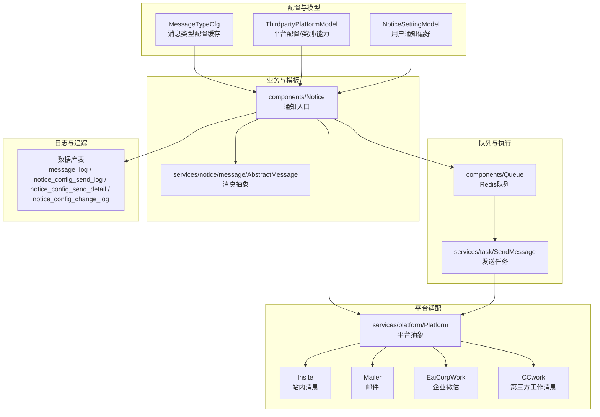
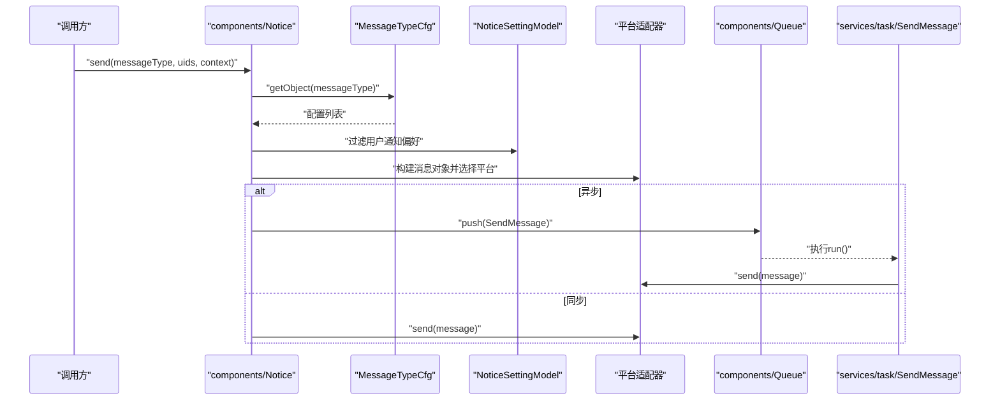
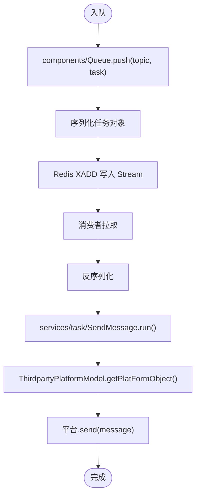
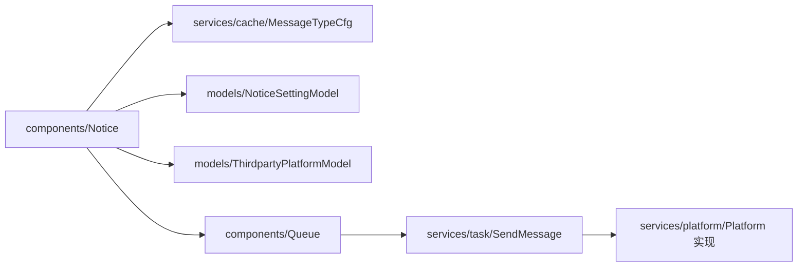

# 通知服务

<cite>
**本文引用的文件**
- [components/Notice.php](file://process/src/components/Notice.php)
- [components/Queue.php](file://process/src/components/Queue.php)
- [services/platform/Platform.php](file://process/src/services/platform/Platform.php)
- [services/platform/CCwork.php](file://process/src/services/platform/CCwork.php)
- [services/platform/Mailer.php](file://process/src/services/platform/Mailer.php)
- [services/platform/Insite.php](file://process/src/services/platform/Insite.php)
- [services/platform/EaiCorpWork.php](file://process/src/services/platform/EaiCorpWork.php)
- [services/notice/message/AbstractMessage.php](file://process/src/services/notice/message/AbstractMessage.php)
- [services/notice/message/ThirdpartyTextCard.php](file://process/src/services/notice/message/ThirdpartyTextCard.php)
- [services/cache/MessageTypeCfg.php](file://process/src/services/cache/MessageTypeCfg.php)
- [services/task/SendMessage.php](file://process/src/services/task/SendMessage.php)
- [models/ThirdpartyPlatformModel.php](file://process/src/models/ThirdpartyPlatformModel.php)
- [models/NoticeSettingModel.php](file://process/src/models/NoticeSettingModel.php)
- [http/site/Message.php](file://process/src/http/site/Message.php)
- [http/system/NoticeConfig.php](file://process/src/http/system/NoticeConfig.php)
- [docs/sql/database.sql](file://process/docs/sql/database.sql)
- [migrations/migration_20230919_102723_message_cfg.php](file://process/src/migrations/migration_20230919_102723_message_cfg.php)
- [migrations/migration_20250904_112321_login_config.php](file://process/src/migrations/migration_20250904_112321_login_config.php)
- [services/mqtt/Handler.php](file://process/src/services/mqtt/Handler.php)
</cite>

## 目录
1. [简介](#简介)
2. [项目结构](#项目结构)
3. [核心组件](#核心组件)
4. [架构总览](#架构总览)
5. [组件详解](#组件详解)
6. [依赖关系分析](#依赖关系分析)
7. [性能与扩展](#性能与扩展)
8. [故障排查](#故障排查)
9. [结论](#结论)
10. [附录](#附录)

## 简介
本文件面向 htdNew 项目的“通知服务”，系统化梳理多渠道通知机制、消息处理与监听器架构，覆盖消息发送、通知配置、监听器管理、消息模板、渠道集成（邮件、微信、短信等）、消息队列处理与通知状态跟踪，并提供配置管理、接口设计与错误处理机制说明，以及性能优化与扩展开发指南。

## 项目结构
通知服务围绕“配置驱动 + 平台适配 + 队列异步”的模式组织，主要由以下层次构成：
- 配置层：消息类型配置缓存与持久化、平台能力与类别、用户通知偏好
- 业务层：通知入口组件，负责按消息类型筛选配置、过滤接收人、构建消息体、选择平台并投递队列
- 平台层：各第三方通知平台的适配器（微信、企业微信、邮件、短信等），统一抽象接口
- 模板层：消息体抽象与格式化，支持上下文渲染
- 队列层：基于 Redis Stream 的任务队列，异步执行发送
- 日志与追踪：消息发送日志、发送明细、变更日志、交互日志

图表来源
- [components/Notice.php](file://process/src/components/Notice.php#L1-L406)
- [services/cache/MessageTypeCfg.php](file://process/src/services/cache/MessageTypeCfg.php#L1-L31)
- [models/ThirdpartyPlatformModel.php](file://process/src/models/ThirdpartyPlatformModel.php#L1-L687)
- [models/NoticeSettingModel.php](file://process/src/models/NoticeSettingModel.php#L1-L59)
- [services/platform/Platform.php](file://process/src/services/platform/Platform.php#L1-L93)
- [services/platform/Insite.php](file://process/src/services/platform/Insite.php)
- [services/platform/Mailer.php](file://process/src/services/platform/Mailer.php)
- [services/platform/EaiCorpWork.php](file://process/src/services/platform/EaiCorpWork.php)
- [services/platform/CCwork.php](file://process/src/services/platform/CCwork.php#L85-L132)
- [services/notice/message/AbstractMessage.php](file://process/src/services/notice/message/AbstractMessage.php#L1-L31)
- [components/Queue.php](file://process/src/components/Queue.php#L1-L173)
- [services/task/SendMessage.php](file://process/src/services/task/SendMessage.php#L1-L19)
- [docs/sql/database.sql](file://process/docs/sql/database.sql#L502-L539)

章节来源
- [components/Notice.php](file://process/src/components/Notice.php#L1-L406)
- [models/ThirdpartyPlatformModel.php](file://process/src/models/ThirdpartyPlatformModel.php#L1-L687)
- [services/cache/MessageTypeCfg.php](file://process/src/services/cache/MessageTypeCfg.php#L1-L31)
- [models/NoticeSettingModel.php](file://process/src/models/NoticeSettingModel.php#L1-L59)
- [services/platform/Platform.php](file://process/src/services/platform/Platform.php#L1-L93)
- [components/Queue.php](file://process/src/components/Queue.php#L1-L173)
- [services/task/SendMessage.php](file://process/src/services/task/SendMessage.php#L1-L19)
- [docs/sql/database.sql](file://process/docs/sql/database.sql#L502-L539)

## 核心组件
- 通知入口组件：负责按消息类型加载配置、过滤接收人、构建消息对象、选择平台并投递队列；支持同步/异步两种发送路径；提供类型化发送（如短信、邮件）与通用发送接口。
- 平台适配器：以统一抽象类为基础，实现不同渠道（站内、邮件、企业微信、第三方工作消息等）的发送逻辑与消息体映射。
- 消息模板：抽象消息类根据模板与上下文渲染生成最终消息体，支持接收人集合设置与附件等扩展。
- 队列与任务：通过 Redis Stream 存储任务，任务反序列化后调用对应平台发送。
- 配置与偏好：消息类型配置缓存、平台能力与类别、用户通知偏好决定是否向某用户推送。
- 日志与追踪：发送日志、明细、变更日志与交互日志，支撑状态跟踪与审计。

章节来源
- [components/Notice.php](file://process/src/components/Notice.php#L1-L406)
- [services/platform/Platform.php](file://process/src/services/platform/Platform.php#L1-L93)
- [services/notice/message/AbstractMessage.php](file://process/src/services/notice/message/AbstractMessage.php#L1-L31)
- [components/Queue.php](file://process/src/components/Queue.php#L1-L173)
- [services/task/SendMessage.php](file://process/src/services/task/SendMessage.php#L1-L19)
- [models/ThirdpartyPlatformModel.php](file://process/src/models/ThirdpartyPlatformModel.php#L1-L687)
- [models/NoticeSettingModel.php](file://process/src/models/NoticeSettingModel.php#L1-L59)

## 架构总览
通知服务采用“配置驱动 + 平台适配 + 队列异步”的分层架构。发送流程如下：
- 业务侧调用通知入口，按消息类型加载配置
- 过滤用户通知偏好与接收账号
- 构建消息对象（含上下文渲染）
- 选择平台适配器并投递到队列
- 队列消费者拉取任务，调用平台发送

图表来源
- [components/Notice.php](file://process/src/components/Notice.php#L1-L406)
- [services/cache/MessageTypeCfg.php](file://process/src/services/cache/MessageTypeCfg.php#L1-L31)
- [models/NoticeSettingModel.php](file://process/src/models/NoticeSettingModel.php#L1-L59)
- [services/task/SendMessage.php](file://process/src/services/task/SendMessage.php#L1-L19)
- [components/Queue.php](file://process/src/components/Queue.php#L1-L173)

## 组件详解

### 通知入口组件（components/Notice）
职责与流程要点：
- 按消息类型加载配置，区分默认配置与事项定制配置，支持按 app_id 过滤
- 过滤用户通知偏好（用户开启/默认接收），站内消息除外
- 构建消息对象，设置接收人（手机号/邮箱/open_id/等），写入发送日志
- 异步发送：投递到队列；同步发送：直接调用平台发送
- 提供类型化发送接口（短信、邮件）与通用发送接口

关键行为与路径：
- 发送主流程与过滤策略：[components/Notice.php](file://process/src/components/Notice.php#L22-L118)
- 平台选择与 doSend：[components/Notice.php](file://process/src/components/Notice.php#L119-L218)
- 类型化发送（短信/邮件）：[components/Notice.php](file://process/src/components/Notice.php#L258-L300)
- 通用邮件/企业微信发送：[components/Notice.php](file://process/src/components/Notice.php#L295-L385)
- 重试发送：[components/Notice.php](file://process/src/components/Notice.php#L220-L252)

章节来源
- [components/Notice.php](file://process/src/components/Notice.php#L1-L406)
- [models/NoticeSettingModel.php](file://process/src/models/NoticeSettingModel.php#L1-L59)

### 平台适配器（services/platform）
- 抽象基类：统一平台元信息、表单属性解析、能力与类别声明
- 典型实现：
  - 站内消息：[services/platform/Insite.php](file://process/src/services/platform/Insite.php)
  - 邮件：[services/platform/Mailer.php](file://process/src/services/platform/Mailer.php)
  - 企业微信：[services/platform/EaiCorpWork.php](file://process/src/services/platform/EaiCorpWork.php)
  - 第三方工作消息（如 CCwork）：[services/platform/CCwork.php](file://process/src/services/platform/CCwork.php#L85-L132)

平台抽象与属性解析：
- 平台元信息与表单解析：[services/platform/Platform.php](file://process/src/services/platform/Platform.php#L1-L93)

章节来源
- [services/platform/Platform.php](file://process/src/services/platform/Platform.php#L1-L93)
- [services/platform/Insite.php](file://process/src/services/platform/Insite.php)
- [services/platform/Mailer.php](file://process/src/services/platform/Mailer.php)
- [services/platform/EaiCorpWork.php](file://process/src/services/platform/EaiCorpWork.php)
- [services/platform/CCwork.php](file://process/src/services/platform/CCwork.php#L85-L132)

### 消息模板（services/notice/message）
- 抽象消息类：根据模板与上下文渲染，设置接收人集合
- 示例消息体：第三方文本卡片消息体类
- 模板加载与渲染：[services/notice/message/AbstractMessage.php](file://process/src/services/notice/message/AbstractMessage.php#L1-L31)
- 示例消息体类：[services/notice/message/ThirdpartyTextCard.php](file://process/src/services/notice/message/ThirdpartyTextCard.php)

章节来源
- [services/notice/message/AbstractMessage.php](file://process/src/services/notice/message/AbstractMessage.php#L1-L31)
- [services/notice/message/ThirdpartyTextCard.php](file://process/src/services/notice/message/ThirdpartyTextCard.php)

### 配置与偏好（models 与缓存）
- 平台配置与类别/能力：[models/ThirdpartyPlatformModel.php](file://process/src/models/ThirdpartyPlatformModel.php#L1-L687)
- 用户通知偏好：[models/NoticeSettingModel.php](file://process/src/models/NoticeSettingModel.php#L1-L59)
- 消息类型配置缓存：[services/cache/MessageTypeCfg.php](file://process/src/services/cache/MessageTypeCfg.php#L1-L31)

章节来源
- [models/ThirdpartyPlatformModel.php](file://process/src/models/ThirdpartyPlatformModel.php#L1-L687)
- [models/NoticeSettingModel.php](file://process/src/models/NoticeSettingModel.php#L1-L59)
- [services/cache/MessageTypeCfg.php](file://process/src/services/cache/MessageTypeCfg.php#L1-L31)

### 队列与任务（components/Queue 与 services/task/SendMessage）
- 队列封装：支持主题、推入、长度查询、消费者数量配置、编码/解码
- 发送任务：根据平台 ID 获取平台对象并执行发送

图表来源
- [components/Queue.php](file://process/src/components/Queue.php#L1-L173)
- [services/task/SendMessage.php](file://process/src/services/task/SendMessage.php#L1-L19)
- [models/ThirdpartyPlatformModel.php](file://process/src/models/ThirdpartyPlatformModel.php#L445-L459)

章节来源
- [components/Queue.php](file://process/src/components/Queue.php#L1-L173)
- [services/task/SendMessage.php](file://process/src/services/task/SendMessage.php#L1-L19)
- [models/ThirdpartyPlatformModel.php](file://process/src/models/ThirdpartyPlatformModel.php#L445-L459)

### 接口与配置管理
- 系统端通知配置接口：支持查询发送日志、筛选条件（时间、状态、用户工号）、关联用户与明细
- 用户端通知设置接口：按平台类型展示用户是否启用接收
- 数据库与迁移：
  - 消息配置与日志表结构：[docs/sql/database.sql](file://process/docs/sql/database.sql#L502-L539)
  - 通知配置发送明细与变更日志迁移：[migrations/migration_20250904_112321_login_config.php](file://process/src/migrations/migration_20250904_112321_login_config.php#L33-L71)
  - 旧版消息配置迁移（兼容）：[migrations/migration_20230919_102723_message_cfg.php](file://process/src/migrations/migration_20230919_102723_message_cfg.php#L85-L121)

章节来源
- [http/system/NoticeConfig.php](file://process/src/http/system/NoticeConfig.php#L252-L288)
- [http/site/Message.php](file://process/src/http/site/Message.php#L84-L115)
- [docs/sql/database.sql](file://process/docs/sql/database.sql#L502-L539)
- [migrations/migration_20250904_112321_login_config.php](file://process/src/migrations/migration_20250904_112321_login_config.php#L33-L71)
- [migrations/migration_20230919_102723_message_cfg.php](file://process/src/migrations/migration_20230919_102723_message_cfg.php#L85-L121)

### 监听器与事件（概念性说明）
- 仓库中存在监听器与事件相关文件（如 listeners、events.php），但未见与通知服务直接耦合的监听器实现。通知服务主要通过配置与队列驱动，而非事件回调。
- MQTT 处理器示例：[services/mqtt/Handler.php](file://process/src/services/mqtt/Handler.php#L1-L24) 展示了自定义主题处理逻辑，可作为外部事件接入参考。

[本节为概念性说明，不直接分析具体源码文件]

## 依赖关系分析
- 组件耦合与内聚
  - components/Notice 与 models/NoticeSettingModel、services/cache/MessageTypeCfg 高内聚，负责“配置 + 偏好”决策
  - 平台适配器与 models/ThirdpartyPlatformModel 解耦，通过类名与缓存获取对象
  - 队列与任务解耦，任务仅持有必要上下文
- 外部依赖
  - Redis Stream 作为消息队列载体
  - 数据库存储配置、日志与明细
- 潜在循环依赖
  - 当前结构未见循环依赖迹象；平台对象通过模型工厂创建，避免直接相互引用

图表来源
- [components/Notice.php](file://process/src/components/Notice.php#L1-L406)
- [services/cache/MessageTypeCfg.php](file://process/src/services/cache/MessageTypeCfg.php#L1-L31)
- [models/NoticeSettingModel.php](file://process/src/models/NoticeSettingModel.php#L1-L59)
- [models/ThirdpartyPlatformModel.php](file://process/src/models/ThirdpartyPlatformModel.php#L445-L459)
- [components/Queue.php](file://process/src/components/Queue.php#L1-L173)
- [services/task/SendMessage.php](file://process/src/services/task/SendMessage.php#L1-L19)

章节来源
- [components/Notice.php](file://process/src/components/Notice.php#L1-L406)
- [models/ThirdpartyPlatformModel.php](file://process/src/models/ThirdpartyPlatformModel.php#L445-L459)
- [components/Queue.php](file://process/src/components/Queue.php#L1-L173)
- [services/task/SendMessage.php](file://process/src/services/task/SendMessage.php#L1-L19)

## 性能与扩展
- 性能特性
  - 异步发送：通过队列解耦，提升请求吞吐与稳定性
  - 缓存配置：消息类型配置与平台对象缓存减少重复查询
  - 批量过滤：按平台偏好一次性过滤接收人，减少无效发送
- 优化建议
  - 队列并发：合理设置消费者数量与主题分区，避免积压
  - 平台限流：在平台适配器中增加速率控制与重试退避
  - 日志瘦身：对高频日志进行采样或分级
  - 模板预编译：对复杂模板进行预处理，降低渲染开销
- 扩展开发
  - 新增平台：继承 services/platform/Platform，实现 send 与消息体映射
  - 新增消息类型：在配置表中新增记录，或通过迁移脚本批量导入
  - 新增渠道：在 models/ThirdpartyPlatformModel 中补充类别/能力标识，完善用户设置界面

[本节为通用指导，不直接分析具体源码文件]

## 故障排查
- 常见问题定位
  - 无接收人：检查用户通知偏好与账号映射（手机号/邮箱/open_id）
  - 配置缺失：确认消息类型配置是否存在、平台是否启用
  - 队列积压：查看队列长度与消费者数量，核对平台凭据与网络
  - 发送失败：查看发送日志与明细，定位具体错误信息
- 关键日志与追踪
  - 发送日志与明细：message_log、notice_config_send_log、notice_config_send_detail
  - 变更日志：notice_config_change_log
  - 交互日志：记录忽略发送与无效场景
- 数据库与迁移
  - 表结构参考：[docs/sql/database.sql](file://process/docs/sql/database.sql#L502-L539)
  - 迁移脚本：[migrations/migration_20250904_112321_login_config.php](file://process/src/migrations/migration_20250904_112321_login_config.php#L33-L71)

章节来源
- [docs/sql/database.sql](file://process/docs/sql/database.sql#L502-L539)
- [migrations/migration_20250904_112321_login_config.php](file://process/src/migrations/migration_20250904_112321_login_config.php#L33-L71)

## 结论
通知服务通过“配置驱动 + 平台适配 + 队列异步”的架构，实现了多渠道通知的统一接入与高效执行。其核心在于：
- 清晰的配置与偏好体系，确保精准触达
- 可插拔的平台适配器，覆盖邮件、微信、短信等主流渠道
- 健壮的队列与日志体系，保障可观测与可恢复
配合合理的性能优化与扩展策略，可在多校区、多业务场景下稳定运行。

[本节为总结性内容，不直接分析具体源码文件]

## 附录
- 接口与页面
  - 系统端通知配置与日志查询：[http/system/NoticeConfig.php](file://process/src/http/system/NoticeConfig.php#L252-L288)
  - 用户端通知设置展示：[http/site/Message.php](file://process/src/http/site/Message.php#L84-L115)
- 平台与消息体示例
  - 企业微信平台：[services/platform/EaiCorpWork.php](file://process/src/services/platform/EaiCorpWork.php)
  - 第三方工作消息平台：[services/platform/CCwork.php](file://process/src/services/platform/CCwork.php#L85-L132)
  - 邮件平台：[services/platform/Mailer.php](file://process/src/services/platform/Mailer.php)
  - 站内消息平台：[services/platform/Insite.php](file://process/src/services/platform/Insite.php)
  - 消息抽象与模板：[services/notice/message/AbstractMessage.php](file://process/src/services/notice/message/AbstractMessage.php#L1-L31)

[本节为索引性内容，不直接分析具体源码文件]