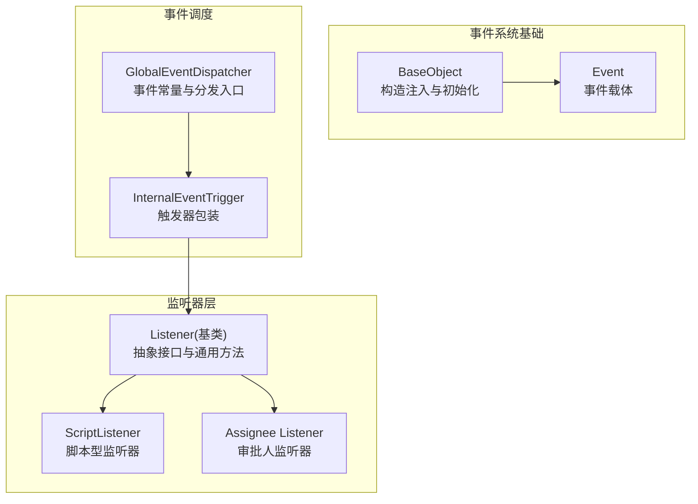
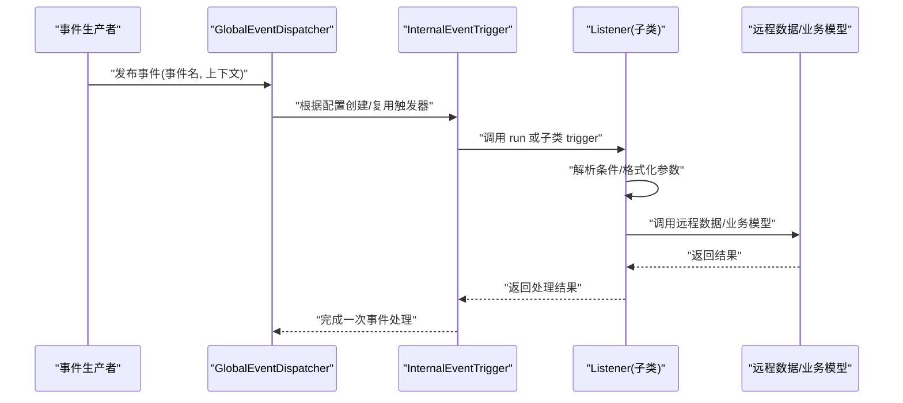
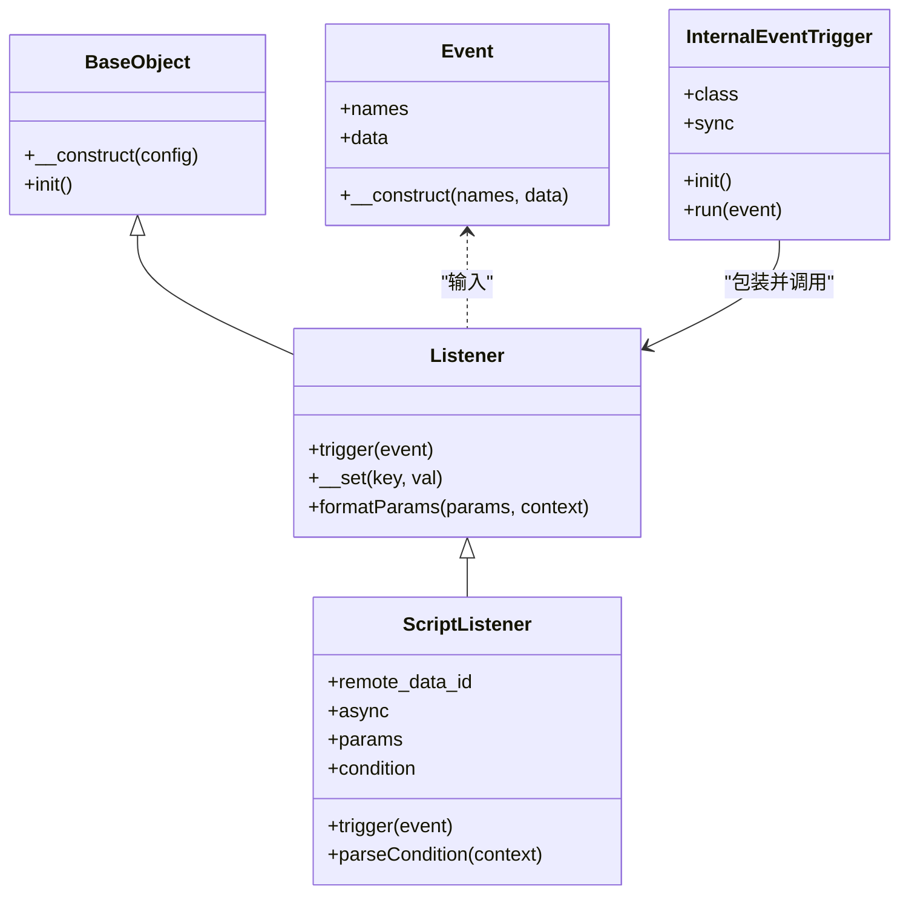
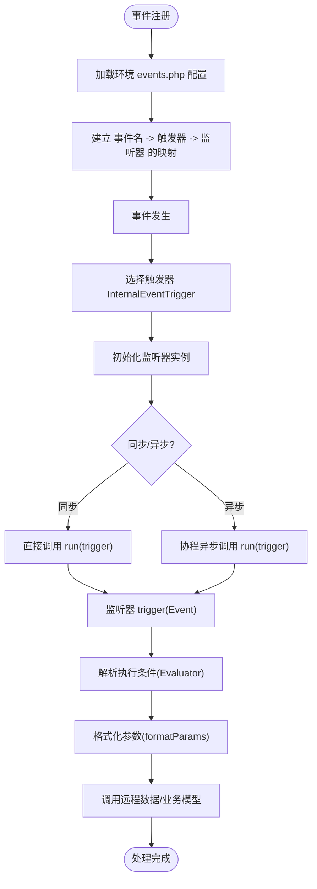
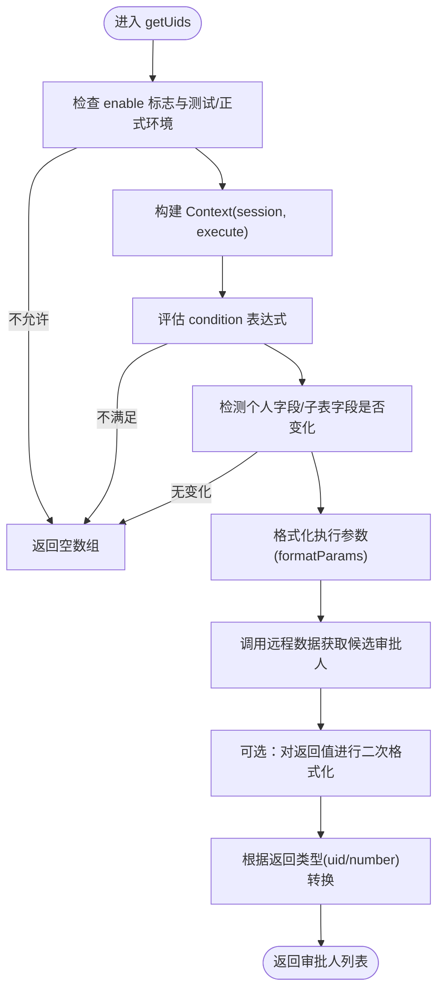
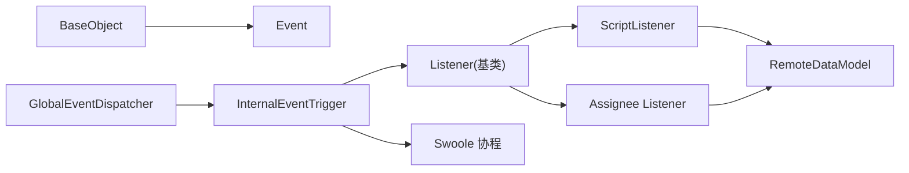

# 事件基类监听器

<cite>
**本文引用的文件**
- [Listener.php](file://process/src/services/listeners/Listener.php)
- [ScriptListener.php](file://process/src/services/listeners/ScriptListener.php)
- [BaseObject.php](file://process/vendor/lifei/zl/src/base/BaseObject.php)
- [Event.php（zl 框架）](file://process/vendor/lifei/zl/src/event/Event.php)
- [GlobalEventDispatcher.php](file://process/src/services/events/GlobalEventDispatcher.php)
- [InternalEventTrigger.php](file://process/src/services/events/InternalEventTrigger.php)
- [events.php（示例：buaa）](file://process_envs/buaa/product/events.php)
- [events.php（示例：nju）](file://process_envs/nju/product/events.php)
- [events.php（示例：dev/test）](file://process_envs/dev/test/events.php)
- [Listener.php（assignee）](file://process/src/services/assignee/Listener.php)
</cite>

## 目录
1. [引言](#引言)
2. [项目结构](#项目结构)
3. [核心组件](#核心组件)
4. [架构总览](#架构总览)
5. [详细组件分析](#详细组件分析)
6. [依赖关系分析](#依赖关系分析)
7. [性能考量](#性能考量)
8. [故障排查指南](#故障排查指南)
9. [结论](#结论)
10. [附录](#附录)

## 引言
本文件围绕 htdNew 项目中的“事件基类监听器”进行系统性技术文档整理，重点解释 Listener.php 作为所有监听器基类的设计原理、架构意义与使用方式。文档将从抽象接口定义、通用方法实现、扩展机制入手，逐步展开监听器的注册流程、事件分发机制与生命周期管理，并给出配置选项、错误处理策略与性能优化建议，最后提供自定义监听器的开发指南与最佳实践。

## 项目结构
与事件基类监听器直接相关的核心目录与文件如下：
- 事件系统基础：zl 框架的 BaseObject、Event 类
- 事件调度与触发：GlobalEventDispatcher、InternalEventTrigger
- 监听器基类与具体监听器：services/listeners/Listener.php、ScriptListener.php 等
- 监听器注册配置：各环境下的 events.php 配置文件
- 业务场景监听器：如 assignee/Listener.php（审批人选择逻辑）

图表来源
- [BaseObject.php](file://process/vendor/lifei/zl/src/base/BaseObject.php#L1-L23)
- [Event.php（zl 框架）](file://process/vendor/lifei/zl/src/event/Event.php#L1-L30)
- [GlobalEventDispatcher.php](file://process/src/services/events/GlobalEventDispatcher.php#L1-L262)
- [InternalEventTrigger.php](file://process/src/services/events/InternalEventTrigger.php#L1-L30)
- [Listener.php](file://process/src/services/listeners/Listener.php#L1-L33)
- [ScriptListener.php](file://process/src/services/listeners/ScriptListener.php#L1-L52)
- [Listener.php（assignee）](file://process/src/services/assignee/Listener.php#L1-L165)

章节来源
- [BaseObject.php](file://process/vendor/lifei/zl/src/base/BaseObject.php#L1-L23)
- [Event.php（zl 框架）](file://process/vendor/lifei/zl/src/event/Event.php#L1-L30)
- [GlobalEventDispatcher.php](file://process/src/services/events/GlobalEventDispatcher.php#L1-L262)
- [InternalEventTrigger.php](file://process/src/services/events/InternalEventTrigger.php#L1-L30)
- [Listener.php](file://process/src/services/listeners/Listener.php#L1-L33)
- [ScriptListener.php](file://process/src/services/listeners/ScriptListener.php#L1-L52)
- [Listener.php（assignee）](file://process/src/services/assignee/Listener.php#L1-L165)

## 核心组件
- 监听器基类（services/listeners/Listener.php）
  - 继承自 zl\base\BaseObject，具备构造注入与 init 生命周期能力
  - 抽象方法 trigger(Event $event)：定义监听器对事件的处理契约
  - 通用方法 formatParams($params, $context)：将配置参数按上下文格式化
  - __set 魔术方法：忽略未知属性赋值，避免误用导致的异常
- 事件载体（vendor/lifei/zl/src/event/Event.php）
  - 支持两种构造方式：传入 names 与 data；或传入数组配置
  - 提供 names（事件名集合）与 data（上下文数据）两个核心字段
- 事件分发器（services/events/GlobalEventDispatcher.php）
  - 使用 Singleton 与 EventDispatcherTrait，集中管理事件常量与分发
  - 定义大量业务事件常量，便于跨模块统一引用
- 触发器包装（services/events/InternalEventTrigger.php）
  - 将监听器类实例化并封装 run 方法
  - 支持同步/异步两种执行模式（通过协程）

章节来源
- [Listener.php](file://process/src/services/listeners/Listener.php#L1-L33)
- [Event.php（zl 框架）](file://process/vendor/lifei/zl/src/event/Event.php#L1-L30)
- [GlobalEventDispatcher.php](file://process/src/services/events/GlobalEventDispatcher.php#L1-L262)
- [InternalEventTrigger.php](file://process/src/services/events/InternalEventTrigger.php#L1-L30)

## 架构总览
事件系统采用“事件常量 + 分发器 + 触发器 + 监听器”的分层设计：
- 事件常量由 GlobalEventDispatcher 统一维护
- 分发器负责接收事件并根据配置选择触发器
- 触发器包装监听器对象，决定同步或异步执行
- 监听器基类提供统一的抽象接口与通用工具方法

图表来源
- [GlobalEventDispatcher.php](file://process/src/services/events/GlobalEventDispatcher.php#L1-L262)
- [InternalEventTrigger.php](file://process/src/services/events/InternalEventTrigger.php#L1-L30)
- [Listener.php](file://process/src/services/listeners/Listener.php#L1-L33)
- [ScriptListener.php](file://process/src/services/listeners/ScriptListener.php#L1-L52)

## 详细组件分析

### 监听器基类（services/listeners/Listener.php）
- 设计要点
  - 抽象接口：要求子类实现 trigger(Event $event)，确保监听器职责单一且可替换
  - 通用工具：formatParams 将配置参数转换为运行时可用的键值对，减少重复逻辑
  - 安全兜底：__set 忽略未知属性，降低配置错误带来的风险
- 扩展机制
  - 子类可通过继承该基类快速接入事件系统，复用参数格式化与条件判断能力
  - 与 RemoteDataModel、Formater、Evaluator 等服务配合，实现灵活的业务编排

图表来源
- [BaseObject.php](file://process/vendor/lifei/zl/src/base/BaseObject.php#L1-L23)
- [Event.php（zl 框架）](file://process/vendor/lifei/zl/src/event/Event.php#L1-L30)
- [Listener.php](file://process/src/services/listeners/Listener.php#L1-L33)
- [ScriptListener.php](file://process/src/services/listeners/ScriptListener.php#L1-L52)
- [InternalEventTrigger.php](file://process/src/services/events/InternalEventTrigger.php#L1-L30)

章节来源
- [Listener.php](file://process/src/services/listeners/Listener.php#L1-L33)
- [ScriptListener.php](file://process/src/services/listeners/ScriptListener.php#L1-L52)

### 事件分发与触发流程
- 注册阶段
  - 在各环境的 events.php 中声明事件与监听器映射，指定触发器类型与同步/异步策略
  - 示例：buaa、nju、dev/test 等环境均通过数组配置事件名、触发器类与监听器类
- 分发阶段
  - GlobalEventDispatcher 负责事件常量与分发入口
  - InternalEventTrigger 在 init 阶段实例化监听器类，并在 run 中根据 sync 决定同步或协程异步执行
- 处理阶段
  - 监听器 trigger 接收 Event，解析 condition 并格式化参数，最终调用远程数据或业务模型

图表来源
- [events.php（示例：buaa）](file://process_envs/buaa/product/events.php#L33-L44)
- [events.php（示例：nju）](file://process_envs/nju/product/events.php#L1-L33)
- [events.php（示例：dev/test）](file://process_envs/dev/test/events.php#L1-L39)
- [GlobalEventDispatcher.php](file://process/src/services/events/GlobalEventDispatcher.php#L1-L262)
- [InternalEventTrigger.php](file://process/src/services/events/InternalEventTrigger.php#L1-L30)
- [Listener.php](file://process/src/services/listeners/Listener.php#L1-L33)
- [ScriptListener.php](file://process/src/services/listeners/ScriptListener.php#L1-L52)

章节来源
- [events.php（示例：buaa）](file://process_envs/buaa/product/events.php#L33-L44)
- [events.php（示例：nju）](file://process_envs/nju/product/events.php#L1-L33)
- [events.php（示例：dev/test）](file://process_envs/dev/test/events.php#L1-L39)
- [GlobalEventDispatcher.php](file://process/src/services/events/GlobalEventDispatcher.php#L1-L262)
- [InternalEventTrigger.php](file://process/src/services/events/InternalEventTrigger.php#L1-L30)
- [Listener.php](file://process/src/services/listeners/Listener.php#L1-L33)
- [ScriptListener.php](file://process/src/services/listeners/ScriptListener.php#L1-L52)

### 业务监听器示例：审批人监听器（assignee/Listener.php）
- 职责与流程
  - 根据会话状态与启用标志判断是否允许执行
  - 解析条件表达式，过滤非必要分支
  - 支持个人字段变更与子表变更的细粒度判断
  - 通过远程数据调用获取候选审批人，支持返回类型转换
- 关键点
  - 条件与参数格式化：沿用基类 formatParams 与 Evaluator
  - 上下文注入：将 session、execute 等放入 Context
  - 结果处理：支持返回 uid 或 number，并做映射转换

图表来源
- [Listener.php（assignee）](file://process/src/services/assignee/Listener.php#L1-L165)
- [Listener.php](file://process/src/services/listeners/Listener.php#L1-L33)

章节来源
- [Listener.php（assignee）](file://process/src/services/assignee/Listener.php#L1-L165)
- [Listener.php](file://process/src/services/listeners/Listener.php#L1-L33)

## 依赖关系分析
- 组件耦合
  - 监听器基类与 zl 框架强耦合（BaseObject、Event），保证统一的生命周期与事件载体
  - 触发器与监听器解耦：通过配置指定监听器类，支持多态扩展
  - 业务监听器（如 assignee/Listener）依赖业务模型与服务（Context、Evaluator、Formater 等）
- 外部依赖
  - Swoole 协程用于异步执行（InternalEventTrigger 中使用协程调度）
  - RemoteDataModel 提供远程调用能力，支撑监听器与业务模型交互

图表来源
- [BaseObject.php](file://process/vendor/lifei/zl/src/base/BaseObject.php#L1-L23)
- [Event.php（zl 框架）](file://process/vendor/lifei/zl/src/event/Event.php#L1-L30)
- [GlobalEventDispatcher.php](file://process/src/services/events/GlobalEventDispatcher.php#L1-L262)
- [InternalEventTrigger.php](file://process/src/services/events/InternalEventTrigger.php#L1-L30)
- [Listener.php](file://process/src/services/listeners/Listener.php#L1-L33)
- [ScriptListener.php](file://process/src/services/listeners/ScriptListener.php#L1-L52)
- [Listener.php（assignee）](file://process/src/services/assignee/Listener.php#L1-L165)

章节来源
- [BaseObject.php](file://process/vendor/lifei/zl/src/base/BaseObject.php#L1-L23)
- [Event.php（zl 框架）](file://process/vendor/lifei/zl/src/event/Event.php#L1-L30)
- [GlobalEventDispatcher.php](file://process/src/services/events/GlobalEventDispatcher.php#L1-L262)
- [InternalEventTrigger.php](file://process/src/services/events/InternalEventTrigger.php#L1-L30)
- [Listener.php](file://process/src/services/listeners/Listener.php#L1-L33)
- [ScriptListener.php](file://process/src/services/listeners/ScriptListener.php#L1-L52)
- [Listener.php（assignee）](file://process/src/services/assignee/Listener.php#L1-L165)

## 性能考量
- 异步执行
  - 通过 InternalEventTrigger 的 sync 字段控制同步/异步，异步可显著提升吞吐，但需注意协程资源与错误隔离
- 参数格式化与条件评估
  - formatParams 与 Evaluator 的调用应尽量避免重复计算，可在上下文中缓存必要数据
- 远程调用
  - RemoteDataModel 的调用应结合连接池与超时控制，避免阻塞事件循环
- 监听器粒度
  - 将复杂逻辑拆分为多个轻量监听器，减少单次触发的耗时与失败影响面

## 故障排查指南
- 常见问题
  - 监听器未被触发：检查 events.php 中事件名与触发器配置是否正确
  - 触发器未实例化：确认 InternalEventTrigger 的 class 配置指向有效监听器类
  - 条件不满足：核对 condition 表达式与上下文字段是否一致
  - 参数为空：formatParams 返回空数组时，检查配置 params 与上下文是否存在对应键
- 错误处理策略
  - 建议在监听器中对远程调用与表达式求值增加 try-catch 包裹，并记录上下文关键信息
  - 对于异步执行，捕获协程异常并通过日志或监控上报
- 调试建议
  - 在 trigger 入口打印事件名、上下文关键字段与返回值
  - 使用最小化配置快速定位问题（关闭 async、简化 condition）

章节来源
- [InternalEventTrigger.php](file://process/src/services/events/InternalEventTrigger.php#L1-L30)
- [ScriptListener.php](file://process/src/services/listeners/ScriptListener.php#L1-L52)
- [Listener.php](file://process/src/services/listeners/Listener.php#L1-L33)

## 结论
Listener.php 作为事件系统中的监听器基类，提供了统一的抽象接口与通用工具方法，使得各类业务监听器能够以一致的方式接入事件分发体系。通过 GlobalEventDispatcher 与 InternalEventTrigger 的配合，系统实现了高内聚、低耦合的事件处理架构。在实际开发中，遵循本文的配置规范、扩展机制与性能优化建议，可高效构建稳定可靠的事件驱动能力。

## 附录

### 监听器基类配置选项与行为
- 触发接口
  - trigger(Event $event)：监听器必须实现的抽象方法
- 通用方法
  - formatParams($params, $context)：将配置参数转换为运行时参数
  - __set($key, $val)：忽略未知属性赋值，防止误用
- 生命周期
  - 继承自 BaseObject，支持构造注入与 init 初始化

章节来源
- [Listener.php](file://process/src/services/listeners/Listener.php#L1-L33)
- [BaseObject.php](file://process/vendor/lifei/zl/src/base/BaseObject.php#L1-L23)

### 事件注册与触发配置示例
- events.php 中的典型配置项
  - event：事件常量名
  - class：触发器类（如 InternalEventTrigger）
  - config.class：监听器类
  - config.sync：是否异步执行
- 示例参考
  - [events.php（buaa）](file://process_envs/buaa/product/events.php#L33-L44)
  - [events.php（nju）](file://process_envs/nju/product/events.php#L1-L33)
  - [events.php（dev/test）](file://process_envs/dev/test/events.php#L1-L39)

章节来源
- [events.php（buaa）](file://process_envs/buaa/product/events.php#L33-L44)
- [events.php（nju）](file://process_envs/nju/product/events.php#L1-L33)
- [events.php（dev/test）](file://process_envs/dev/test/events.php#L1-L39)

### 自定义监听器开发指南与最佳实践
- 开发步骤
  - 新建类继承 services/listeners/Listener
  - 实现 trigger(Event $event)：解析 Event->data，按需调用 formatParams
  - 如需条件判断，使用 Evaluator 或在子类中新增 parseCondition
  - 在 events.php 中注册事件与监听器映射，设置 sync
- 最佳实践
  - 将复杂逻辑拆分为多个监听器，保持单一职责
  - 对远程调用添加超时与重试策略
  - 在异步场景下做好异常捕获与日志记录
  - 使用 Context 传递上下文，避免全局状态依赖

章节来源
- [Listener.php](file://process/src/services/listeners/Listener.php#L1-L33)
- [ScriptListener.php](file://process/src/services/listeners/ScriptListener.php#L1-L52)
- [events.php（示例：buaa）](file://process_envs/buaa/product/events.php#L33-L44)