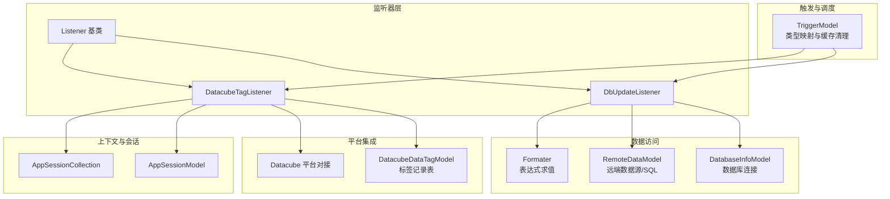
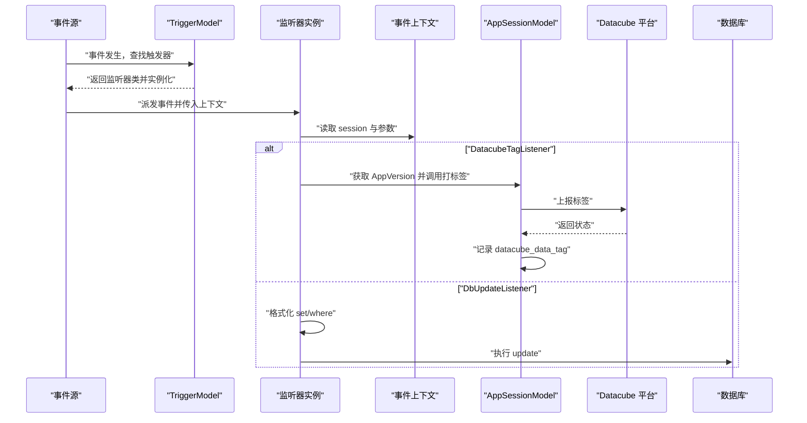
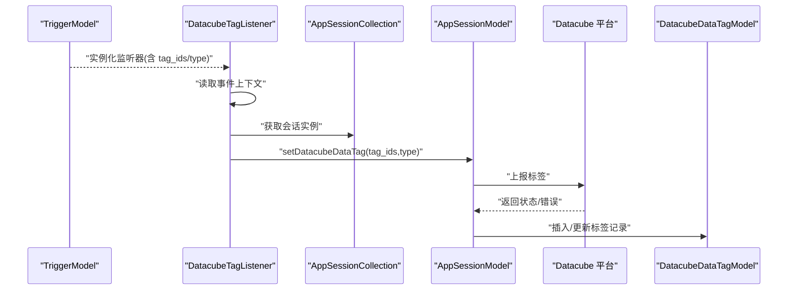
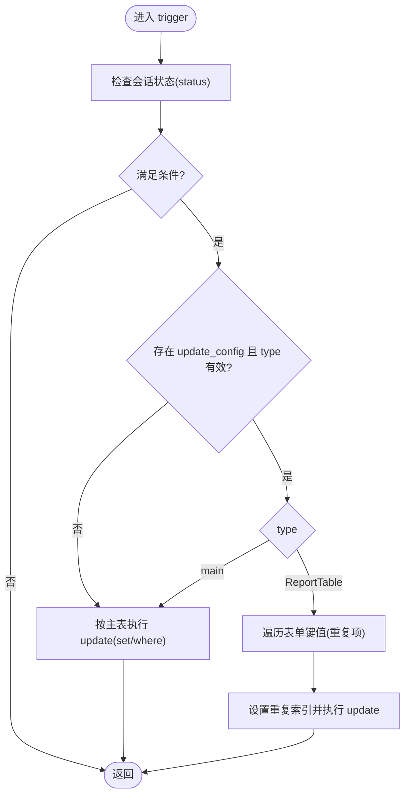
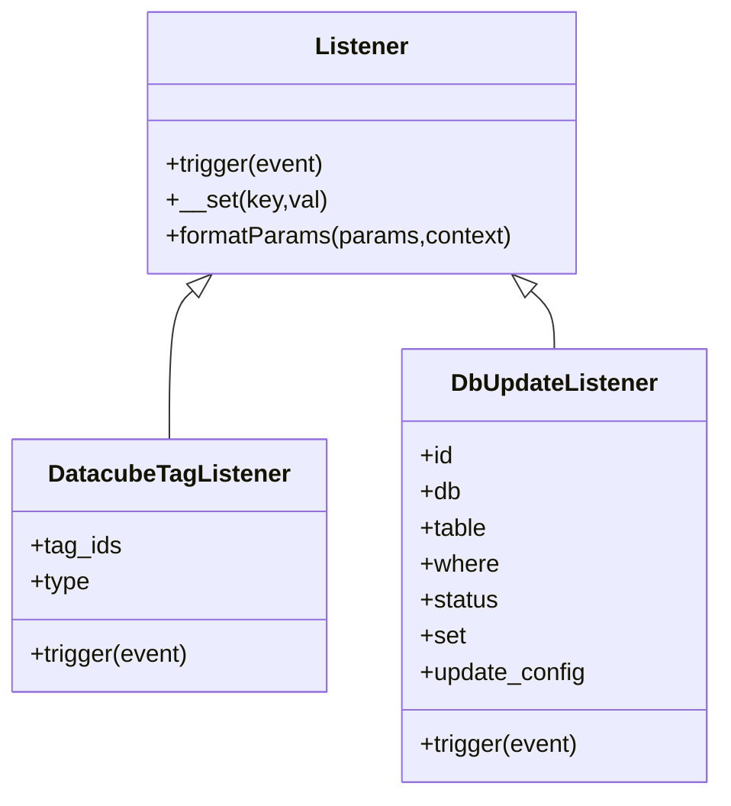
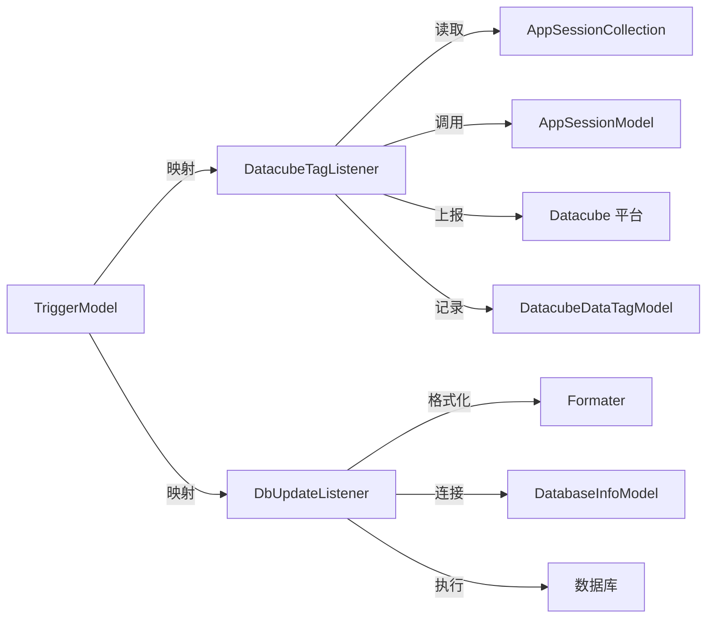

# 数据监听器

<cite>
**本文引用的文件**
- [process/src/services/listeners/DatacubeTagListener.php](file://process/src/services/listeners/DatacubeTagListener.php)
- [process/src/services/listeners/DbUpdateListener.php](file://process/src/services/listeners/DbUpdateListener.php)
- [process/src/services/listeners/Listener.php](file://process/src/services/listeners/Listener.php)
- [process/src/models/TriggerModel.php](file://process/src/models/TriggerModel.php)
- [process/src/services/Formater.php](file://process/src/services/Formater.php)
- [process/src/models/DatabaseInfoModel.php](file://process/src/models/DatabaseInfoModel.php)
- [process/src/models/RemoteDataModel.php](file://process/src/models/RemoteDataModel.php)
- [process/src/services/AppSessionCollection.php](file://process/src/services/AppSessionCollection.php)
- [process/src/models/AppSessionModel.php](file://process/src/models/AppSessionModel.php)
- [process/src/models/DatacubeDataTagModel.php](file://process/src/models/DatacubeDataTagModel.php)
- [process/src/services/platform/Datacube.php](file://process/src/services/platform/Datacube.php)
- [process/docs/sql/database.sql](file://process/docs/sql/database.sql)
- [process/src/migrations/migration_20240805_123142_create_datacube_data_tag.php](file://process/src/migrations/migration_20240805_123142_create_datacube_data_tag.php)
</cite>

## 目录
1. [简介](#简介)
2. [项目结构](#项目结构)
3. [核心组件](#核心组件)
4. [架构总览](#架构总览)
5. [详细组件分析](#详细组件分析)
6. [依赖关系分析](#依赖关系分析)
7. [性能考量](#性能考量)
8. [故障排查指南](#故障排查指南)
9. [结论](#结论)
10. [附录](#附录)

## 简介
本文件面向 htdNew 项目的“数据监听器”能力，聚焦两类监听器：
- DatacubeTagListener（数据立方标签监听器）：在特定事件发生后，将会话相关的数据打上标签，供外部数据立方平台消费与统计。
- DbUpdateListener（数据库更新监听器）：在满足条件时，对远端或本地数据库执行更新操作，支持按主表或报表表（重复项）批量更新。

文档将从触发机制、数据变更检测逻辑、处理流程、索引与缓存维护、数据一致性保障、配置参数、性能调优、监控与异常处理等方面进行系统性说明，并提供可视化图示帮助理解。

## 项目结构
与数据监听器直接相关的模块分布如下：
- 监听器基类与具体监听器：services/listeners
- 触发器模型与映射：models/TriggerModel.php
- 表达式与参数格式化：services/Formater.php
- 数据库连接与远端数据源：models/DatabaseInfoModel.php、models/RemoteDataModel.php
- 会话与上下文：services/AppSessionCollection.php、models/AppSessionModel.php
- 数据立方平台对接：services/platform/Datacube.php
- 数据立方标签持久化：models/DatacubeDataTagModel.php、docs/sql/database.sql、migrations/...

图表来源
- [process/src/services/listeners/Listener.php](file://process/src/services/listeners/Listener.php#L1-L33)
- [process/src/services/listeners/DatacubeTagListener.php](file://process/src/services/listeners/DatacubeTagListener.php#L1-L36)
- [process/src/services/listeners/DbUpdateListener.php](file://process/src/services/listeners/DbUpdateListener.php#L1-L68)
- [process/src/models/TriggerModel.php](file://process/src/models/TriggerModel.php#L90-L116)
- [process/src/services/Formater.php](file://process/src/services/Formater.php#L1-L246)
- [process/src/models/RemoteDataModel.php](file://process/src/models/RemoteDataModel.php#L1-L800)
- [process/src/models/DatabaseInfoModel.php](file://process/src/models/DatabaseInfoModel.php#L1-L322)
- [process/src/services/AppSessionCollection.php](file://process/src/services/AppSessionCollection.php#L1-L32)
- [process/src/models/AppSessionModel.php](file://process/src/models/AppSessionModel.php#L1-L800)
- [process/src/services/platform/Datacube.php](file://process/src/services/platform/Datacube.php#L44-L430)
- [process/src/models/DatacubeDataTagModel.php](file://process/src/models/DatacubeDataTagModel.php#L1-L50)

章节来源
- [process/src/services/listeners/Listener.php](file://process/src/services/listeners/Listener.php#L1-L33)
- [process/src/models/TriggerModel.php](file://process/src/models/TriggerModel.php#L90-L116)

## 核心组件
- 监听器基类 Listener：定义统一的 trigger 接口、忽略未知属性、参数格式化工具。
- DatacubeTagListener：基于会话上下文，调用 AppSessionModel 的数据立方标签能力，向平台上报标签并落库记录。
- DbUpdateListener：根据配置在满足状态条件时，对远端或本地数据库执行更新；支持主表与报表表（重复项）两种更新模式。
- TriggerModel：将触发器类型映射到具体监听器类，负责触发器配置加载与缓存失效。
- Formater：表达式解析与变量求值，用于动态参数与 where 条件的格式化。
- DatabaseInfoModel/RemoteDataModel：数据库连接与 SQL 执行、远端数据源调用。
- AppSessionCollection/AppSessionModel：会话集合与会话模型，承载表单数据、状态与上下文。
- Datacube 平台对接与标签记录：封装平台接口、重试与状态记录。

章节来源
- [process/src/services/listeners/Listener.php](file://process/src/services/listeners/Listener.php#L1-L33)
- [process/src/services/listeners/DatacubeTagListener.php](file://process/src/services/listeners/DatacubeTagListener.php#L1-L36)
- [process/src/services/listeners/DbUpdateListener.php](file://process/src/services/listeners/DbUpdateListener.php#L1-L68)
- [process/src/models/TriggerModel.php](file://process/src/models/TriggerModel.php#L90-L116)
- [process/src/services/Formater.php](file://process/src/services/Formater.php#L1-L246)
- [process/src/models/DatabaseInfoModel.php](file://process/src/models/DatabaseInfoModel.php#L1-L322)
- [process/src/models/RemoteDataModel.php](file://process/src/models/RemoteDataModel.php#L1-L800)
- [process/src/services/AppSessionCollection.php](file://process/src/services/AppSessionCollection.php#L1-L32)
- [process/src/models/AppSessionModel.php](file://process/src/models/AppSessionModel.php#L1-L800)
- [process/src/services/platform/Datacube.php](file://process/src/services/platform/Datacube.php#L44-L430)
- [process/src/models/DatacubeDataTagModel.php](file://process/src/models/DatacubeDataTagModel.php#L1-L50)

## 架构总览
数据监听器整体工作流：
- 触发器注册：TriggerModel 将触发器类型映射到具体监听器类。
- 事件分发：当业务事件发生时，框架根据事件路径查找匹配的触发器并实例化监听器。
- 监听器执行：监听器从事件上下文中提取 session 与相关数据，按自身逻辑进行处理。
- 数据立方标签：DatacubeTagListener 通过 AppSessionModel 调用平台接口打标签，并记录到 datacube_data_tag 表。
- 数据库更新：DbUpdateListener 根据配置格式化 set/where 条件，选择数据库连接，执行更新。

图表来源
- [process/src/models/TriggerModel.php](file://process/src/models/TriggerModel.php#L90-L116)
- [process/src/services/listeners/DatacubeTagListener.php](file://process/src/services/listeners/DatacubeTagListener.php#L1-L36)
- [process/src/services/listeners/DbUpdateListener.php](file://process/src/services/listeners/DbUpdateListener.php#L1-L68)
- [process/src/models/AppSessionModel.php](file://process/src/models/AppSessionModel.php#L1-L800)
- [process/src/services/platform/Datacube.php](file://process/src/services/platform/Datacube.php#L44-L430)
- [process/src/models/DatacubeDataTagModel.php](file://process/src/models/DatacubeDataTagModel.php#L1-L50)

## 详细组件分析

### DatacubeTagListener（数据立方标签监听器）
- 触发机制
  - 由 TriggerModel 将类型映射到该监听器类。
  - 事件触发时，监听器从事件上下文读取 session，并通过 AppSessionCollection 获取 AppSessionModel 实例。
- 数据变更检测与处理
  - 监听器持有 tag_ids 与 type 两个参数，在 trigger 中调用 AppSessionModel 的数据立方标签能力，将标签写入平台并记录到 datacube_data_tag 表。
  - 平台接口包含重试与状态记录，最终落库以便后续修复与审计。
- 索引与缓存
  - 通过 AppSessionCollection 单例缓存会话实例，避免重复构造。
  - 触发器配置变更后，TriggerModel 清理缓存并按范围刷新相关版本缓存。
- 数据一致性
  - 平台侧返回状态与错误信息，写入 datacube_data_tag 表，便于异步修复任务处理失败条目。

图表来源
- [process/src/models/TriggerModel.php](file://process/src/models/TriggerModel.php#L90-L116)
- [process/src/services/listeners/DatacubeTagListener.php](file://process/src/services/listeners/DatacubeTagListener.php#L1-L36)
- [process/src/services/AppSessionCollection.php](file://process/src/services/AppSessionCollection.php#L1-L32)
- [process/src/models/AppSessionModel.php](file://process/src/models/AppSessionModel.php#L1-L800)
- [process/src/services/platform/Datacube.php](file://process/src/services/platform/Datacube.php#L44-L430)
- [process/src/models/DatacubeDataTagModel.php](file://process/src/models/DatacubeDataTagModel.php#L1-L50)

章节来源
- [process/src/services/listeners/DatacubeTagListener.php](file://process/src/services/listeners/DatacubeTagListener.php#L1-L36)
- [process/src/services/AppSessionCollection.php](file://process/src/services/AppSessionCollection.php#L1-L32)
- [process/src/models/AppSessionModel.php](file://process/src/models/AppSessionModel.php#L1-L800)
- [process/src/services/platform/Datacube.php](file://process/src/services/platform/Datacube.php#L44-L430)
- [process/src/models/DatacubeDataTagModel.php](file://process/src/models/DatacubeDataTagModel.php#L1-L50)
- [process/src/migrations/migration_20240805_123142_create_datacube_data_tag.php](file://process/src/migrations/migration_20240805_123142_create_datacube_data_tag.php#L1-L39)
- [process/docs/sql/database.sql](file://process/docs/sql/database.sql#L2012-L2051)

### DbUpdateListener（数据库更新监听器）
- 触发机制
  - 由 TriggerModel 将类型映射到该监听器类。
  - 事件触发时，监听器从事件上下文读取 session，并根据配置决定是否执行更新。
- 数据变更检测与处理
  - 支持按会话状态过滤（status），若未满足则直接返回。
  - 若未配置 update_config 或 type 为主表（main），则直接按 set/where 执行更新。
  - 若 type 为报表表（ReportTable），则从会话表单数据中读取对应键值，循环设置重复索引并逐条更新。
- 表达式与参数格式化
  - 使用 Formater 对 set/where 中的表达式进行求值，支持复杂变量与函数。
- 数据库连接与执行
  - 优先使用 DatabaseInfoModel 指定的数据库连接；否则使用默认 db()。
  - 通过 QueryBuilder 构造 where 条件，执行 update 并记录日志。
- 索引与缓存
  - 触发器配置变更后，TriggerModel 清理缓存并刷新相关版本缓存。
- 数据一致性
  - 更新失败会抛出异常；数据库日志模型记录请求与响应，便于审计与重试。

图表来源
- [process/src/services/listeners/DbUpdateListener.php](file://process/src/services/listeners/DbUpdateListener.php#L1-L68)
- [process/src/services/Formater.php](file://process/src/services/Formater.php#L1-L246)
- [process/src/models/DatabaseInfoModel.php](file://process/src/models/DatabaseInfoModel.php#L1-L322)
- [process/src/models/RemoteDataModel.php](file://process/src/models/RemoteDataModel.php#L1-L800)

章节来源
- [process/src/services/listeners/DbUpdateListener.php](file://process/src/services/listeners/DbUpdateListener.php#L1-L68)
- [process/src/services/Formater.php](file://process/src/services/Formater.php#L1-L246)
- [process/src/models/DatabaseInfoModel.php](file://process/src/models/DatabaseInfoModel.php#L1-L322)
- [process/src/models/RemoteDataModel.php](file://process/src/models/RemoteDataModel.php#L1-L800)
- [process/src/models/TriggerModel.php](file://process/src/models/TriggerModel.php#L144-L159)

### 监听器基类与触发器映射
- Listener 基类
  - 提供统一 trigger 接口与 __set 忽略未知属性的能力。
  - formatParams 将配置参数通过 Formater 求值，形成运行时参数。
- TriggerModel 映射
  - 将触发器类型映射到具体监听器类，并在保存触发器后清理缓存，必要时清空全局缓存。
  - 提供 allEvent/receiveEvents 等辅助方法，用于事件路径扩展与接收节点事件。

图表来源
- [process/src/services/listeners/Listener.php](file://process/src/services/listeners/Listener.php#L1-L33)
- [process/src/services/listeners/DatacubeTagListener.php](file://process/src/services/listeners/DatacubeTagListener.php#L1-L36)
- [process/src/services/listeners/DbUpdateListener.php](file://process/src/services/listeners/DbUpdateListener.php#L1-L68)

章节来源
- [process/src/services/listeners/Listener.php](file://process/src/services/listeners/Listener.php#L1-L33)
- [process/src/models/TriggerModel.php](file://process/src/models/TriggerModel.php#L90-L116)

## 依赖关系分析
- 监听器与触发器
  - TriggerModel 通过 CLASSES 将触发器类型映射到监听器类，确保类型安全与实例化可控。
- 监听器与上下文
  - DatacubeTagListener 依赖 AppSessionCollection 与 AppSessionModel 获取会话与版本信息。
  - DbUpdateListener 依赖 Formater、RemoteDataModel、DatabaseInfoModel 进行参数格式化与数据库操作。
- 平台与持久化
  - DatacubeTagListener 依赖 Datacube 平台对接与 DatacubeDataTagModel 进行状态记录与修复。
- 缓存与一致性
  - TriggerModel.afterSave 清理缓存，保证触发器配置变更后生效。

图表来源
- [process/src/models/TriggerModel.php](file://process/src/models/TriggerModel.php#L90-L116)
- [process/src/services/listeners/DatacubeTagListener.php](file://process/src/services/listeners/DatacubeTagListener.php#L1-L36)
- [process/src/services/listeners/DbUpdateListener.php](file://process/src/services/listeners/DbUpdateListener.php#L1-L68)
- [process/src/services/AppSessionCollection.php](file://process/src/services/AppSessionCollection.php#L1-L32)
- [process/src/models/AppSessionModel.php](file://process/src/models/AppSessionModel.php#L1-L800)
- [process/src/services/platform/Datacube.php](file://process/src/services/platform/Datacube.php#L44-L430)
- [process/src/models/DatacubeDataTagModel.php](file://process/src/models/DatacubeDataTagModel.php#L1-L50)
- [process/src/services/Formater.php](file://process/src/services/Formater.php#L1-L246)
- [process/src/models/DatabaseInfoModel.php](file://process/src/models/DatabaseInfoModel.php#L1-L322)

章节来源
- [process/src/models/TriggerModel.php](file://process/src/models/TriggerModel.php#L90-L116)
- [process/src/services/listeners/DatacubeTagListener.php](file://process/src/services/listeners/DatacubeTagListener.php#L1-L36)
- [process/src/services/listeners/DbUpdateListener.php](file://process/src/services/listeners/DbUpdateListener.php#L1-L68)

## 性能考量
- 表达式求值
  - Formater 对表达式进行解析与求值，建议在配置中尽量减少复杂函数与深层嵌套，避免高并发下的 CPU 压力。
- 数据库更新
  - DbUpdateListener 支持批量报表表更新，应控制重复项数量，避免一次性更新过多行导致锁竞争与事务超时。
  - 建议对 where 条件建立合适索引，减少全表扫描。
- 会话缓存
  - AppSessionCollection 使用协程单例缓存会话实例，减少重复构造成本；但需关注内存占用，避免长时间持有大量会话。
- 日志与审计
  - DatabaseInfoModel 的日志记录包含请求与响应，建议在高并发场景下限制日志体量，避免 IO 抖动。

[本节为通用指导，不涉及具体文件分析]

## 故障排查指南
- 数据立方标签失败
  - 检查 Datacube 平台接口返回状态与错误信息，确认 datacube_data_tag 表中记录。
  - 可使用迁移脚本提供的修复任务定期重试失败条目。
- 数据库更新异常
  - 查看 DatabaseInfoModel 的日志记录，定位 SQL、参数与错误信息。
  - 确认 where/set 表达式是否正确求值，必要时在 Formater 中调试变量。
- 触发器未生效
  - 检查 TriggerModel 的类型映射与缓存是否已刷新。
  - 确认事件路径与触发器 events 列表匹配。

章节来源
- [process/src/services/platform/Datacube.php](file://process/src/services/platform/Datacube.php#L44-L430)
- [process/src/models/DatacubeDataTagModel.php](file://process/src/models/DatacubeDataTagModel.php#L1-L50)
- [process/src/models/DatabaseInfoModel.php](file://process/src/models/DatabaseInfoModel.php#L258-L321)
- [process/src/models/TriggerModel.php](file://process/src/models/TriggerModel.php#L144-L159)

## 结论
DatacubeTagListener 与 DbUpdateListener 分别承担“数据打标签”和“数据更新”的职责，二者均通过 TriggerModel 与事件系统解耦接入。前者强调与外部平台的协作与落库审计，后者强调对复杂表达式与多行重复数据的稳健更新。结合缓存、日志与异常处理机制，可在保证数据一致性的前提下提升系统可观测性与可维护性。

[本节为总结性内容，不涉及具体文件分析]

## 附录

### 配置参数与使用要点
- DatacubeTagListener
  - 关键参数：tag_ids、type
  - 触发时机：通常在动作后（after_operation）等事件
  - 输出：平台接口返回状态与错误，datacube_data_tag 表记录
- DbUpdateListener
  - 关键参数：id（数据库信息）、db（数据库别名）、table、where、status、set、update_config（type/main 或 ReportTable）
  - 触发时机：按事件与状态过滤
  - 输出：数据库更新结果与日志

章节来源
- [process/src/services/listeners/DatacubeTagListener.php](file://process/src/services/listeners/DatacubeTagListener.php#L1-L36)
- [process/src/services/listeners/DbUpdateListener.php](file://process/src/services/listeners/DbUpdateListener.php#L1-L68)
- [process/src/models/TriggerModel.php](file://process/src/models/TriggerModel.php#L90-L116)