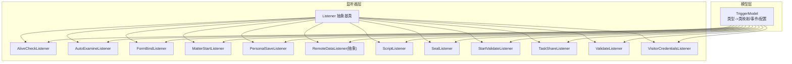
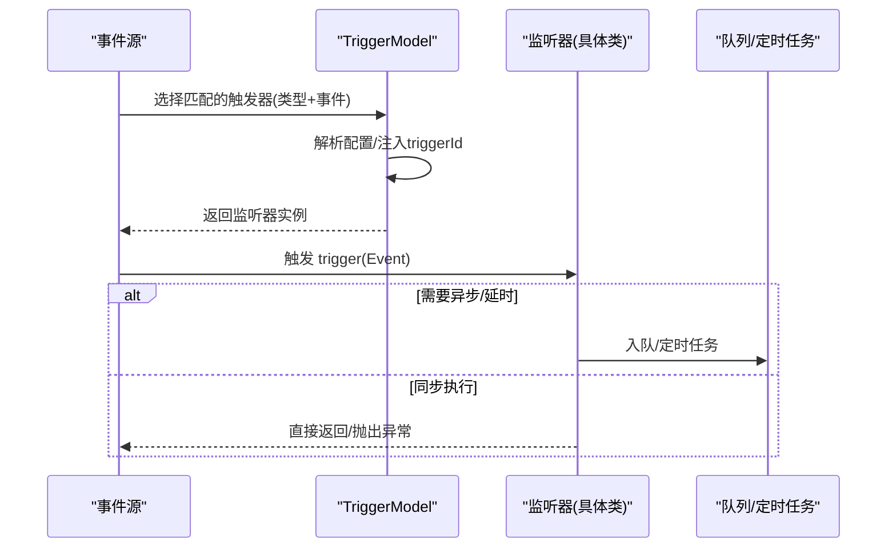
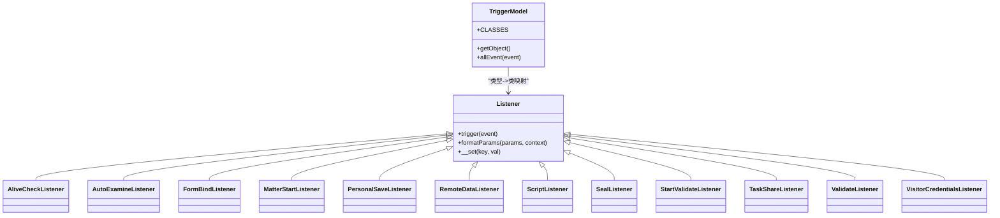

# 核心监听器

<cite>
**本文引用的文件**
- [Listener.php](file://process/src/services/listeners/Listener.php)
- [AliveCheckListener.php](file://process/src/services/listeners/AliveCheckListener.php)
- [AutoExamineListener.php](file://process/src/services/listeners/AutoExamineListener.php)
- [FormBindListener.php](file://process/src/services/listeners/FormBindListener.php)
- [MatterStartListener.php](file://process/src/services/listeners/MatterStartListener.php)
- [PersonalSaveListener.php](file://process/src/services/listeners/PersonalSaveListener.php)
- [RemoteDataListener.php](file://process/src/services/listeners/RemoteDataListener.php)
- [ScriptListener.php](file://process/src/services/listeners/ScriptListener.php)
- [SealListener.php](file://process/src/services/listeners/SealListener.php)
- [StartValidateListener.php](file://process/src/services/listeners/StartValidateListener.php)
- [TaskShareListener.php](file://process/src/services/listeners/TaskShareListener.php)
- [ValidateListener.php](file://process/src/services/listeners/ValidateListener.php)
- [VisitorCredentialsListener.php](file://process/src/services/listeners/VisitorCredentialsListener.php)
- [TriggerModel.php](file://process/src/models/TriggerModel.php)
</cite>

## 目录
1. [简介](#简介)
2. [项目结构](#项目结构)
3. [核心组件](#核心组件)
4. [架构总览](#架构总览)
5. [详细组件分析](#详细组件分析)
6. [依赖分析](#依赖分析)
7. [性能考虑](#性能考虑)
8. [故障排查指南](#故障排查指南)
9. [结论](#结论)
10. [附录](#附录)

## 简介
本文件面向 htdNew 流程引擎中的“核心监听器”体系，系统性梳理各类监听器的设计原理、触发条件、执行逻辑与配置要点，并结合事件模型与生命周期管理，给出错误处理策略、性能优化建议与扩展开发指南。重点覆盖以下监听器：
- 存活检查：AliveCheckListener
- 自动审批：AutoExamineListener
- 表单绑定：FormBindListener
- 事项启动：MatterStartListener
- 个人保存：PersonalSaveListener
- 远程数据：RemoteDataListener（抽象基类）
- 脚本监听：ScriptListener
- 印章监听：SealListener
- 开始验证：StartValidateListener
- 任务分享：TaskShareListener
- 验证监听：ValidateListener
- 访客凭证：VisitorCredentialsListener

## 项目结构
核心监听器位于 process/src/services/listeners 目录，统一继承自 Listener 抽象基类；触发器元数据与事件映射由 TriggerModel 提供。

图表来源
- [Listener.php](file://process/src/services/listeners/Listener.php#L1-L33)
- [TriggerModel.php](file://process/src/models/TriggerModel.php#L97-L116)

章节来源
- [Listener.php](file://process/src/services/listeners/Listener.php#L1-L33)
- [TriggerModel.php](file://process/src/models/TriggerModel.php#L97-L116)

## 核心组件
- Listener 抽象基类
  - 统一入口：trigger(Event $event)
  - 参数格式化：formatParams(params, context)
  - 容错：__set 忽略未知属性，避免配置漂移导致异常
- TriggerModel
  - 类型到监听器类的映射 CLASSES
  - 事件常量与事件路径解析
  - 实例化监听器时注入 triggerId

章节来源
- [Listener.php](file://process/src/services/listeners/Listener.php#L1-L33)
- [TriggerModel.php](file://process/src/models/TriggerModel.php#L97-L116)
- [TriggerModel.php](file://process/src/models/TriggerModel.php#L130-L142)

## 架构总览
监听器通过 TriggerModel 的类型映射被动态实例化，接收 Event 对象，从 Event->data 中读取上下文，按监听器职责执行业务逻辑。部分监听器会异步入队或延时执行，以保证用户体验与系统稳定性。

图表来源
- [TriggerModel.php](file://process/src/models/TriggerModel.php#L130-L142)
- [AutoExamineListener.php](file://process/src/services/listeners/AutoExamineListener.php#L116-L125)
- [MatterStartListener.php](file://process/src/services/listeners/MatterStartListener.php#L47-L57)

## 详细组件分析

### 存活检查（AliveCheckListener）
- 触发条件
  - 事件：通常在发起前/审批前等关键节点
  - 配置：未配置实名认证平台时直接抛错
- 执行逻辑
  - 读取最近一次认证记录，若超过阈值则在 context->result 中追加“未进行实名认证”的提醒项
- 配置方式
  - check_days：宽限天数
- 错误处理
  - 未配置平台：抛出用户异常
  - 未认证：向结果集合追加提示，不阻断流程

章节来源
- [AliveCheckListener.php](file://process/src/services/listeners/AliveCheckListener.php#L1-L38)

### 自动审批（AutoExamineListener）
- 触发条件
  - 事件：before_operation/after_operation 等动作前后
  - 配置：base/base_field/base_type/time_value/unit/direct/set_time/action_trigger_config
- 执行逻辑
  - 解析基准时间（任务时间或表单字段/变量）
  - 计算执行时刻（支持单位换算与正负方向）
  - 若配置 set_time，则对齐到当日该时刻（可能跨日）
  - 遍历 action_trigger_config，按表达式求值满足即构造自动完成任务
  - 若执行时刻已过：立即入高优队列；否则：登记一次性定时任务
- 性能与注意
  - 使用 CrontabModel 与 Queue，避免阻塞请求
  - 特定环境对秒精度做截断处理

章节来源
- [AutoExamineListener.php](file://process/src/services/listeners/AutoExamineListener.php#L1-L126)

### 表单绑定（FormBindListener）
- 触发条件
  - 事件：before_save/after_save 等
  - 配置：binds 数组，描述控件键与绑定类型（追加/覆盖/清除）
- 执行逻辑
  - 遍历 binds，定位表单组件对象
  - 支持重复表场景：按类型决定覆盖整张表或追加一行
  - 将计算后的值批量写回 session 表单数据
- 错误处理
  - 捕获异常并抛出用户异常，提示“表单绑定触发器执行失败”

章节来源
- [FormBindListener.php](file://process/src/services/listeners/FormBindListener.php#L1-L77)

### 事项启动（MatterStartListener）
- 触发条件
  - 事件：after_start（发起后）
  - 配置：condition/push_type/form_id/table_key/matter/columns/sendType
- 执行逻辑
  - 组装 MatterStartTask 参数（含 token 防重）
  - sendType=1 异步：事务成功后入队；sendType=2 同步：直接执行
- 注意
  - 通过 token 与 push_type 等参数确保幂等与正确路由

章节来源
- [MatterStartListener.php](file://process/src/services/listeners/MatterStartListener.php#L1-L61)

### 个人保存（PersonalSaveListener）
- 触发条件
  - 事件：保存/提交相关
  - 配置：tag_id/tag_is_open/enable_process
- 执行逻辑
  - 仅当 session->creator 非 0 时生效
  - 根据 enable_process 决定调用 DataReview 或 DataSave
  - 传入 tag_id（可为 0 关闭标签）

章节来源
- [PersonalSaveListener.php](file://process/src/services/listeners/PersonalSaveListener.php#L1-L37)

### 远程数据（RemoteDataListener）
- 设计定位
  - 抽象基类，封装远程数据读取通用能力（数据库/数据集/API）
- 关键能力
  - init：预编译 execute_params 为 Formater
  - getRemoteData(context)：按 data_type 选择读取路径
  - readDatabase/readDataTable/readApi：分别对接数据库、数据集与第三方 API
  - formatWhere/formatDataTable：表达式与表别名替换
- 使用建议
  - 作为父类被具体监听器复用（如 ValidateListener/ScriptListener 可组合其能力）

章节来源
- [RemoteDataListener.php](file://process/src/services/listeners/RemoteDataListener.php#L1-L260)

### 脚本监听（ScriptListener）
- 触发条件
  - 事件：任意
  - 配置：remote_data_id/async/params/condition
- 执行逻辑
  - parseCondition：条件表达式求值
  - formatParams：参数格式化
  - 调用 RemoteDataModel::invoke 或 invokeAsync
- 适用场景
  - 自定义代码/远程接口触发，灵活适配多种事件

章节来源
- [ScriptListener.php](file://process/src/services/listeners/ScriptListener.php#L1-L52)

### 印章监听（SealListener）
- 触发条件
  - 事件：before_operation/before_examine/after_start 等
  - 配置：type/config/condition
- 执行逻辑
  - parseCondition：按需校验
  - 根据 type 分支：
    - 表单签：校验/创建签章，必要时抛出 BeforeExamine 中断并返回签章 URL
    - 附件签：支持静默/主动模式，轮询同步状态并回写表单
  - 对 before_operation 场景直接拒绝，防止动作完成前被误用
- 错误处理
  - 参数缺失/状态异常/超时均抛用户异常

章节来源
- [SealListener.php](file://process/src/services/listeners/SealListener.php#L1-L218)

### 开始验证（StartValidateListener）
- 触发条件
  - 事件：before_start/after_start 等
  - 配置：rule_type/limit_number/limit_time/err_msg/get_limit
- 执行逻辑
  - 构造查询条件（app_id/creator/is_test/status 等）
  - rule_type 支持：单次、固定次数、进行中只能一次
  - limit_time 支持：无限制、固定时间范围、循环范围
  - 当 get_limit=true 时，仅返回查询条件与上限；否则抛出提示或允许继续
- 错误处理
  - 问卷通场景合并匿名与真实提交，按 id 倒序去重

章节来源
- [StartValidateListener.php](file://process/src/services/listeners/StartValidateListener.php#L1-L162)

### 任务分享（TaskShareListener）
- 触发条件
  - 事件：receive/revoke 等
  - 配置：users（用户集合配置）
- 执行逻辑
  - 初始化 ConfigCollection，解析出目标 UIDs
  - 批量插入 TaskShareModel 并更新会话共享用户集合

章节来源
- [TaskShareListener.php](file://process/src/services/listeners/TaskShareListener.php#L1-L37)

### 验证监听（ValidateListener）
- 触发条件
  - 事件：before_save/before_operation 等
  - 配置：remote_data_id/params/notice/condition/notice_type/notice_title
- 执行逻辑
  - formatParams 后调用远程数据模型执行
  - 使用 Evaluator 对 result 进行条件判断
  - 不满足条件时按 notice_type 抛出提示或弹框异常

章节来源
- [ValidateListener.php](file://process/src/services/listeners/ValidateListener.php#L1-L48)

### 访客凭证（VisitorCredentialsListener）
- 触发条件
  - 事件：before_save/after_save 等
  - 配置：key/send/message/mobileKey/emailKey/mobileChannel/emailChannel
- 执行逻辑
  - 解析凭证控件位置（支持重复表）
  - 生成 token，持久化 VisitorCredentialsModel
  - 将 token 回填至表单对应控件
  - 按需发送短信/邮件通知，消息中拼接访问链接
- 错误处理
  - 凭证控件配置缺失时抛用户异常

章节来源
- [VisitorCredentialsListener.php](file://process/src/services/listeners/VisitorCredentialsListener.php#L1-L213)

## 依赖分析
- 监听器与模型/服务
  - Listener 基类提供统一参数格式化与容错
  - TriggerModel 负责类型到类的映射与实例化
  - 各监听器依赖上下文（session/task/user/app）与工具（Queue/CrontabModel/Evaluator/Formater）
- 事件传播
  - TriggerModel 提供事件常量与事件路径解析
  - 监听器通过 Event->names 判断当前事件链路，决定行为分支

图表来源
- [Listener.php](file://process/src/services/listeners/Listener.php#L1-L33)
- [TriggerModel.php](file://process/src/models/TriggerModel.php#L97-L116)

章节来源
- [TriggerModel.php](file://process/src/models/TriggerModel.php#L97-L116)
- [Listener.php](file://process/src/services/listeners/Listener.php#L1-L33)

## 性能考虑
- 异步与延时
  - AutoExamineListener：对过去时刻直接入队，未来时刻使用 CrontabModel 定时，避免阻塞请求
  - MatterStartListener：sendType=1 时在事务成功后入队，降低并发压力
  - VisitorCredentialsListener：发送消息在事务成功后入低优队列
- 查询与条件
  - StartValidateListener：针对问卷通场景合并匿名与真实提交，减少重复查询
  - RemoteDataListener：formatWhere 支持复杂表达式与多表连接，注意索引与返回列优化
- 资源占用
  - SealListener：轮询签章状态时设置最大重试次数，避免长时间占用协程
  - ValidateListener：仅对结果进行条件判断，避免额外 IO

## 故障排查指南
- 常见问题定位
  - 配置缺失：如 SealListener 的 before_operation 阶段被禁用；VisitorCredentialsListener 的控件配置缺失
  - 事件时机不当：AutoExamineListener 的 base/base_field 解析为空导致不生效
  - 条件不满足：StartValidateListener/ValidateListener 的 condition 导致流程中断
- 排查步骤
  - 检查 TriggerModel 的事件映射与监听器类型
  - 查看监听器日志与异常栈，确认 formatParams 与上下文字段是否存在
  - 对异步任务：检查队列与定时任务状态
- 建议
  - 在监听器内部捕获可预期异常并抛出用户异常，便于前端展示
  - 对耗时操作尽量异步化，避免阻塞主流程

章节来源
- [SealListener.php](file://process/src/services/listeners/SealListener.php#L69-L74)
- [VisitorCredentialsListener.php](file://process/src/services/listeners/VisitorCredentialsListener.php#L136-L141)
- [AutoExamineListener.php](file://process/src/services/listeners/AutoExamineListener.php#L48-L62)
- [ValidateListener.php](file://process/src/services/listeners/ValidateListener.php#L33-L47)
- [StartValidateListener.php](file://process/src/services/listeners/StartValidateListener.php#L115-L130)

## 结论
核心监听器通过统一的抽象基类与事件驱动模型，实现了对流程关键节点的灵活扩展。各监听器围绕自身职责提供了清晰的触发条件、执行逻辑与错误处理策略。配合异步/延时机制与参数格式化工具，既能保障性能，又能提升可维护性。建议在新增监听器时遵循现有模式，充分利用 TriggerModel 的映射与上下文传递，确保扩展的一致性与稳定性。

## 附录
- 监听器与事件映射参考
  - 见 TriggerModel::CLASSES 与事件常量定义
- 配置要点速查
  - AutoExamineListener：base/base_field/base_type/time_value/unit/direct/set_time/action_trigger_config
  - StartValidateListener：rule_type/limit_number/limit_time/err_msg/get_limit
  - VisitorCredentialsListener：key/send/message/mobileKey/emailKey/mobileChannel/emailChannel
  - SealListener：type/config/condition
  - ValidateListener：remote_data_id/params/notice/condition/notice_type/notice_title
  - MatterStartListener：condition/push_type/form_id/table_key/matter/columns/sendType
  - TaskShareListener：users
  - FormBindListener：binds
  - PersonalSaveListener：tag_id/tag_is_open/enable_process
  - ScriptListener：remote_data_id/async/params/condition

章节来源
- [TriggerModel.php](file://process/src/models/TriggerModel.php#L97-L116)
- [TriggerModel.php](file://process/src/models/TriggerModel.php#L61-L86)