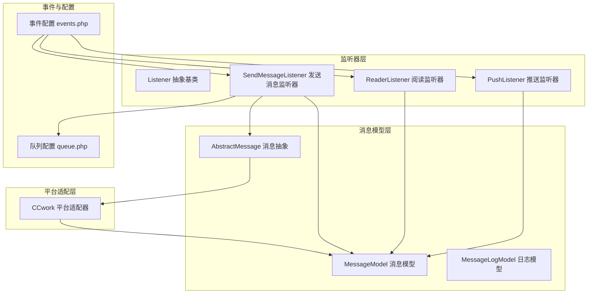
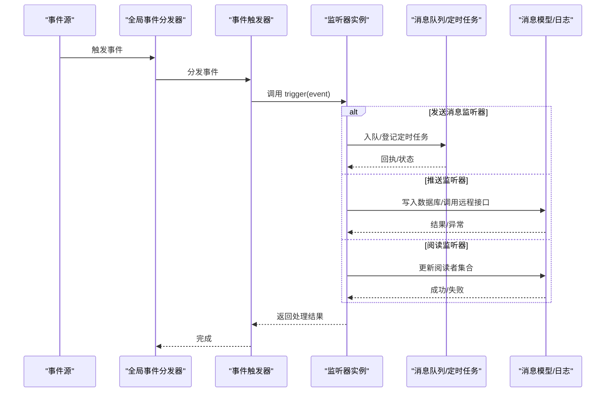
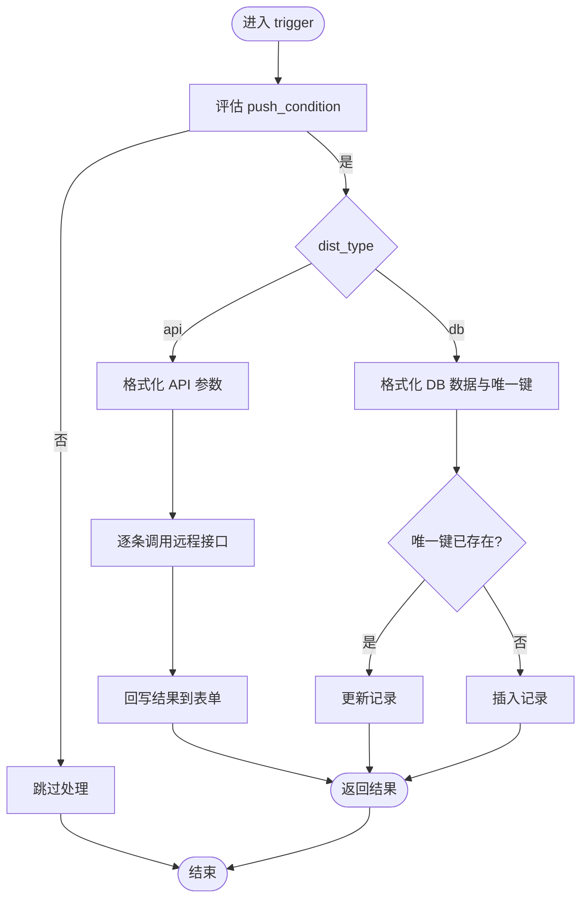
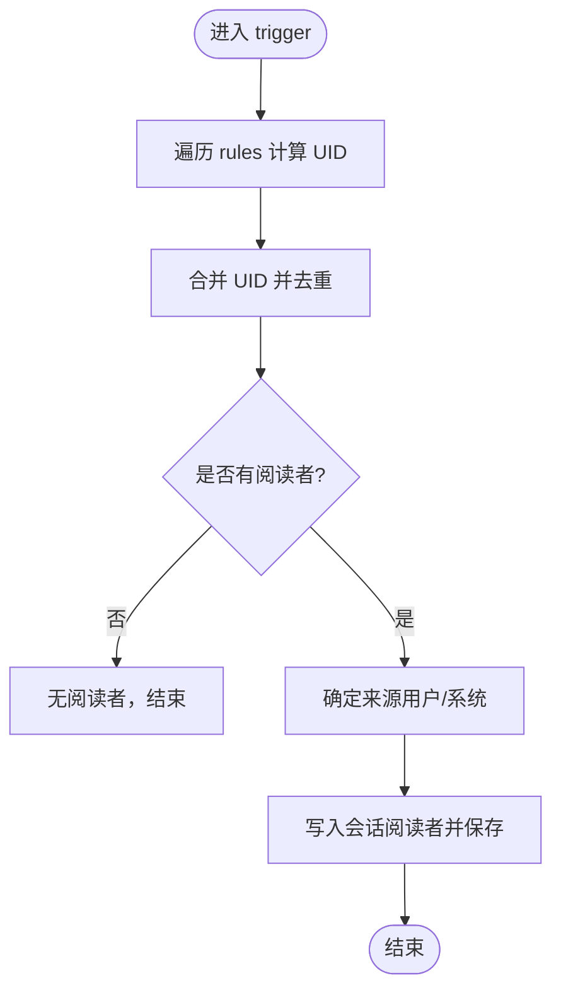
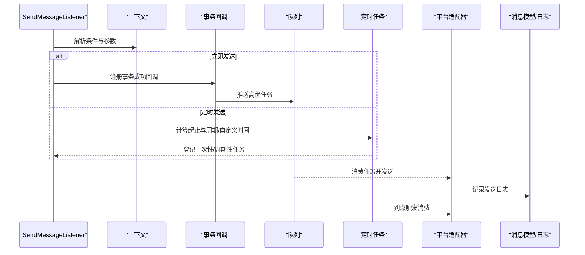
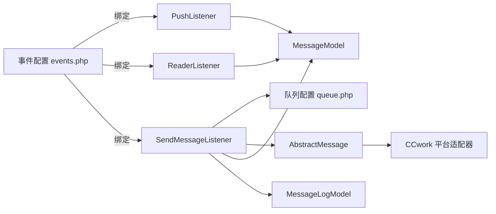

# 消息监听器

<cite>
**本文引用的文件**
- [Listener.php](file://process/src/services/listeners/Listener.php)
- [PushListener.php](file://process/src/services/listeners/PushListener.php)
- [ReaderListener.php](file://process/src/services/listeners/ReaderListener.php)
- [SendMessageListener.php](file://process/src/services/listeners/SendMessageListener.php)
- [queue.php](file://process/src/config/queue.php)
- [MessageModel.php](file://process/src/models/MessageModel.php)
- [MessageLogModel.php](file://process/src/models/MessageLogModel.php)
- [AbstractMessage.php](file://process/src/services/notice/message/AbstractMessage.php)
- [CCwork.php](file://process/src/services/platform/CCwork.php)
- [events.php](file://process_envs/bistu/product/events.php)
</cite>

## 目录
1. [简介](#简介)
2. [项目结构](#项目结构)
3. [核心组件](#核心组件)
4. [架构总览](#架构总览)
5. [组件详解](#组件详解)
6. [依赖关系分析](#依赖关系分析)
7. [性能与优化](#性能与优化)
8. [故障排查与监控](#故障排查与监控)
9. [结论](#结论)

## 简介
本文件聚焦 htdNew 项目中的“消息监听器”体系，系统性阐述通知系统中监听器的作用、工作机制与运行流程。重点覆盖三类监听器：
- PushListener（推送监听器）：将流程上下文数据推送到远端接口或数据库，并支持回写结果到表单。
- ReaderListener（阅读监听器）：基于规则计算并添加“知会人”，维护阅读者列表。
- SendMessageListener（发送消息监听器）：按条件与规则将消息投递至消息队列或定时调度，支持重复表场景与自定义发送时间。

同时，文档说明监听器与消息模型的交互方式、消息队列处理逻辑、消息状态生命周期管理、配置项、性能优化策略、故障恢复机制以及调试与监控方法。

## 项目结构
消息监听器位于统一的服务监听器目录下，围绕抽象基类 Listener 扩展出多种具体监听器；消息实体与日志模型分别承载消息元数据与发送记录；平台侧适配器负责对接第三方消息通道；事件配置文件定义事件与监听器的绑定关系。

图示来源
- [Listener.php](file://process/src/services/listeners/Listener.php#L1-L33)
- [PushListener.php](file://process/src/services/listeners/PushListener.php#L1-L232)
- [ReaderListener.php](file://process/src/services/listeners/ReaderListener.php#L1-L79)
- [SendMessageListener.php](file://process/src/services/listeners/SendMessageListener.php#L1-L274)
- [MessageModel.php](file://process/src/models/MessageModel.php#L1-L111)
- [MessageLogModel.php](file://process/src/models/MessageLogModel.php#L1-L34)
- [AbstractMessage.php](file://process/src/services/notice/message/AbstractMessage.php#L1-L31)
- [CCwork.php](file://process/src/services/platform/CCwork.php#L85-L132)
- [events.php](file://process_envs/bistu/product/events.php#L1-L37)
- [queue.php](file://process/src/config/queue.php#L1-L13)

章节来源
- [Listener.php](file://process/src/services/listeners/Listener.php#L1-L33)
- [PushListener.php](file://process/src/services/listeners/PushListener.php#L1-L232)
- [ReaderListener.php](file://process/src/services/listeners/ReaderListener.php#L1-L79)
- [SendMessageListener.php](file://process/src/services/listeners/SendMessageListener.php#L1-L274)
- [MessageModel.php](file://process/src/models/MessageModel.php#L1-L111)
- [MessageLogModel.php](file://process/src/models/MessageLogModel.php#L1-L34)
- [AbstractMessage.php](file://process/src/services/notice/message/AbstractMessage.php#L1-L31)
- [CCwork.php](file://process/src/services/platform/CCwork.php#L85-L132)
- [events.php](file://process_envs/bistu/product/events.php#L1-L37)
- [queue.php](file://process/src/config/queue.php#L1-L13)

## 核心组件
- 抽象监听器基类 Listener：提供统一的触发入口与参数格式化能力，屏蔽具体实现差异。
- PushListener：负责将上下文数据推送到远端 API 或数据库，支持唯一约束去重与回写结果。
- ReaderListener：根据规则计算阅读者列表，向会话添加阅读者并持久化。
- SendMessageListener：根据条件与规则将消息加入队列或定时任务，支持重复表与自定义发送时间。

章节来源
- [Listener.php](file://process/src/services/listeners/Listener.php#L1-L33)
- [PushListener.php](file://process/src/services/listeners/PushListener.php#L1-L232)
- [ReaderListener.php](file://process/src/services/listeners/ReaderListener.php#L1-L79)
- [SendMessageListener.php](file://process/src/services/listeners/SendMessageListener.php#L1-L274)

## 架构总览
消息监听器通过事件系统被触发，依据配置决定同步/异步执行；发送类监听器通常将任务投递到消息队列或定时任务，由消费者或计划任务执行实际发送；推送类监听器可直接访问数据库或远程接口；阅读类监听器更新会话的阅读者集合。

图示来源
- [events.php](file://process_envs/bistu/product/events.php#L1-L37)
- [SendMessageListener.php](file://process/src/services/listeners/SendMessageListener.php#L1-L274)
- [PushListener.php](file://process/src/services/listeners/PushListener.php#L1-L232)
- [ReaderListener.php](file://process/src/services/listeners/ReaderListener.php#L1-L79)
- [MessageModel.php](file://process/src/models/MessageModel.php#L1-L111)
- [MessageLogModel.php](file://process/src/models/MessageLogModel.php#L1-L34)

## 组件详解

### PushListener（推送监听器）
- 触发条件
  - 支持 push_condition 表达式，若表达式评估为假则跳过。
  - 支持主表与重复表两种推送模式，重复表模式要求存在会话上下文。
- 处理流程
  - API 类型：校验目标类型非 SQL/数据集；格式化参数；逐条调用远程接口；支持回写结果到表单。
  - DB 类型：按列定义格式化数据与唯一键；若唯一键命中则更新，否则插入；捕获 SQL 异常并记录原始 SQL 与错误。
- 状态跟踪
  - 返回布尔值表示是否成功；API 回写通过 session 保存。
- 关键交互
  - 远程接口调用由远程数据模型封装；数据库操作使用查询构建器与命令执行。
- 配置要点
  - dist_type、remote_data_id、database_id、params、columns、push_type、form_id、table_key、bindConfig 等。

图示来源
- [PushListener.php](file://process/src/services/listeners/PushListener.php#L1-L232)

章节来源
- [PushListener.php](file://process/src/services/listeners/PushListener.php#L1-L232)

### ReaderListener（阅读监听器）
- 触发条件
  - 无显式条件时仍可执行；通过 rules 中的 condition 与用户规则组合计算阅读者。
- 处理流程
  - 评估每条规则的 condition；根据规则中的用户配置解析 UID 集合；合并去重。
  - 若存在任务上下文，可识别发起人并控制是否排除自身；最终将阅读者写入会话并持久化。
- 状态跟踪
  - 通过会话模型维护阅读者列表；保存后即完成状态更新。
- 配置要点
  - rules 数组，每条包含 condition 与 users 用户配置。

图示来源
- [ReaderListener.php](file://process/src/services/listeners/ReaderListener.php#L1-L79)

章节来源
- [ReaderListener.php](file://process/src/services/listeners/ReaderListener.php#L1-L79)

### SendMessageListener（发送消息监听器）
- 触发条件
  - 支持 condition 表达式；支持 send_rule 自定义发送规则。
- 处理流程
  - 立即发送：在事务成功回调中将任务推送到高优队列。
  - 定时发送：解析起止时间、循环与自定义时间，登记一次性或周期性计划任务。
  - 重复表发送：遍历重复表项，克隆任务并按每行条件决定是否入队/定时。
- 状态跟踪
  - 使用消息模型承载消息元数据；发送日志模型记录请求、响应与错误；平台适配器负责实际发送。
- 配置要点
  - condition、send_rule、params、channels、receivers、form_receivers、push_type、form_id、table_key、form_receivers_type。

图示来源
- [SendMessageListener.php](file://process/src/services/listeners/SendMessageListener.php#L1-L274)
- [queue.php](file://process/src/config/queue.php#L1-L13)
- [AbstractMessage.php](file://process/src/services/notice/message/AbstractMessage.php#L1-L31)
- [CCwork.php](file://process/src/services/platform/CCwork.php#L85-L132)
- [MessageModel.php](file://process/src/models/MessageModel.php#L1-L111)
- [MessageLogModel.php](file://process/src/models/MessageLogModel.php#L1-L34)

章节来源
- [SendMessageListener.php](file://process/src/services/listeners/SendMessageListener.php#L1-L274)
- [queue.php](file://process/src/config/queue.php#L1-L13)
- [AbstractMessage.php](file://process/src/services/notice/message/AbstractMessage.php#L1-L31)
- [CCwork.php](file://process/src/services/platform/CCwork.php#L85-L132)
- [MessageModel.php](file://process/src/models/MessageModel.php#L1-L111)
- [MessageLogModel.php](file://process/src/models/MessageLogModel.php#L1-L34)

## 依赖关系分析
- 事件绑定：事件配置文件将特定事件与监听器类绑定，决定监听器的触发时机与是否异步。
- 监听器继承：所有监听器均继承自 Listener 抽象基类，统一触发签名与参数格式化。
- 发送链路：SendMessageListener 依赖队列配置与定时任务模型；平台适配器负责第三方通道发送；消息模型与日志模型承载发送元数据与记录。
- 推送链路：PushListener 依赖远程数据模型与数据库连接；API 类型禁止写入 SQL/数据集类型；DB 类型依赖唯一键去重。

图示来源
- [events.php](file://process_envs/bistu/product/events.php#L1-L37)
- [Listener.php](file://process/src/services/listeners/Listener.php#L1-L33)
- [PushListener.php](file://process/src/services/listeners/PushListener.php#L1-L232)
- [ReaderListener.php](file://process/src/services/listeners/ReaderListener.php#L1-L79)
- [SendMessageListener.php](file://process/src/services/listeners/SendMessageListener.php#L1-L274)
- [queue.php](file://process/src/config/queue.php#L1-L13)
- [AbstractMessage.php](file://process/src/services/notice/message/AbstractMessage.php#L1-L31)
- [CCwork.php](file://process/src/services/platform/CCwork.php#L85-L132)
- [MessageModel.php](file://process/src/models/MessageModel.php#L1-L111)
- [MessageLogModel.php](file://process/src/models/MessageLogModel.php#L1-L34)

章节来源
- [events.php](file://process_envs/bistu/product/events.php#L1-L37)
- [Listener.php](file://process/src/services/listeners/Listener.php#L1-L33)
- [PushListener.php](file://process/src/services/listeners/PushListener.php#L1-L232)
- [ReaderListener.php](file://process/src/services/listeners/ReaderListener.php#L1-L79)
- [SendMessageListener.php](file://process/src/services/listeners/SendMessageListener.php#L1-L274)
- [queue.php](file://process/src/config/queue.php#L1-L13)
- [AbstractMessage.php](file://process/src/services/notice/message/AbstractMessage.php#L1-L31)
- [CCwork.php](file://process/src/services/platform/CCwork.php#L85-L132)
- [MessageModel.php](file://process/src/models/MessageModel.php#L1-L111)
- [MessageLogModel.php](file://process/src/models/MessageLogModel.php#L1-L34)

## 性能与优化
- 异步优先：发送消息监听器在事务成功后才入队，避免阻塞主事务；重复表发送按行克隆任务，降低单次负载。
- 去重与批量：DB 推送基于唯一键判断存在性，减少无效写入；API 推送逐条调用，建议在上游聚合或去重。
- 定时策略：合理设置循环单位与设定时间，避免过于频繁的任务堆积；对重复表场景建议按业务粒度拆分。
- 日志与可观测：记录发送日志与错误信息，便于定位慢路径与失败原因；平台适配器记录交互日志，辅助审计。
- 资源隔离：队列消费者与定时任务应与业务线程池隔离，防止相互影响。

## 故障排查与监控
- 触发失败
  - 条件评估失败：检查表达式与上下文字段；确认 push_condition/condition 的语法与变量可用性。
  - 重复表缺失：API/DB 推送重复表模式需存在会话上下文，否则抛出异常。
- 发送失败
  - 队列/定时：确认队列消费者运行状态与任务积压；核对定时任务登记是否正确。
  - 平台通道：平台适配器发送失败需查看日志模型中的错误字段；核对第三方接口凭据与地址。
- 数据库异常
  - PushListener 在执行 SQL 时捕获异常并记录原始 SQL，优先检查唯一键冲突与字段类型。
- 监控指标建议
  - 任务入队数、执行时延、失败率、重试次数、定时任务命中率、平台通道成功率。

章节来源
- [PushListener.php](file://process/src/services/listeners/PushListener.php#L1-L232)
- [SendMessageListener.php](file://process/src/services/listeners/SendMessageListener.php#L1-L274)
- [MessageLogModel.php](file://process/src/models/MessageLogModel.php#L1-L34)
- [CCwork.php](file://process/src/services/platform/CCwork.php#L85-L132)

## 结论
消息监听器在 htdNew 通知系统中承担“条件触发—数据处理—渠道发送”的关键职责。PushListener 负责结构化数据的落地与回写；ReaderListener 负责阅读者集合的动态维护；SendMessageListener 则将消息可靠地投递到队列或定时任务，确保在合适的时间触达接收方。通过事件配置与平台适配器，监听器体系实现了与业务流程的解耦与扩展。结合日志模型与合理的性能优化策略，可有效保障消息系统的稳定性与可观测性。