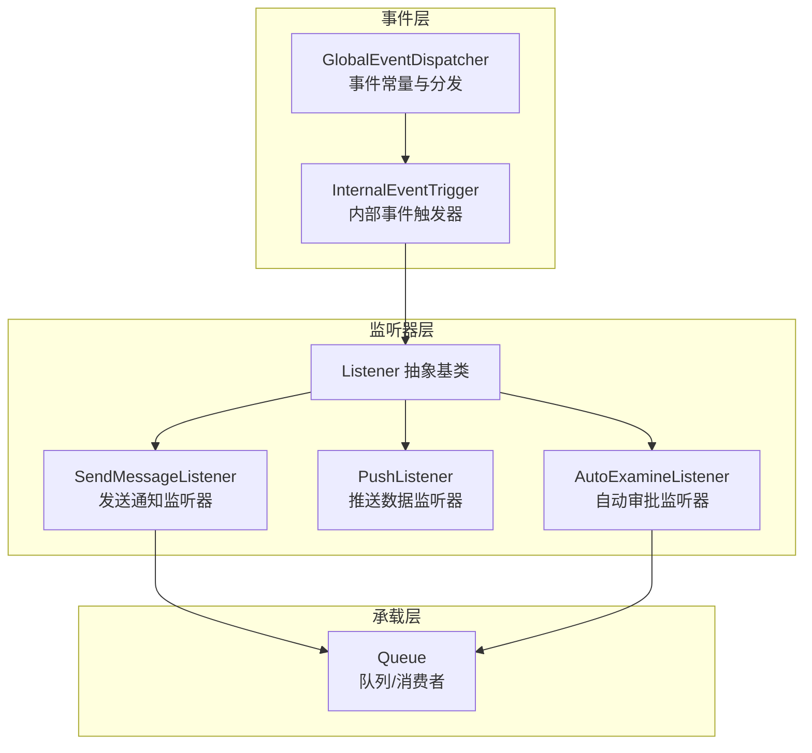
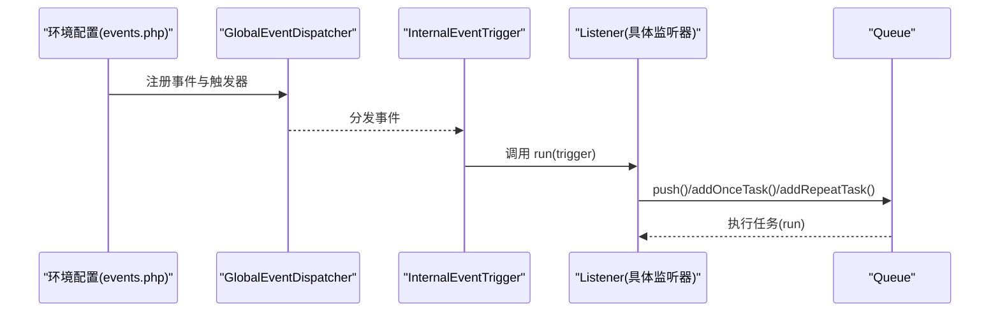
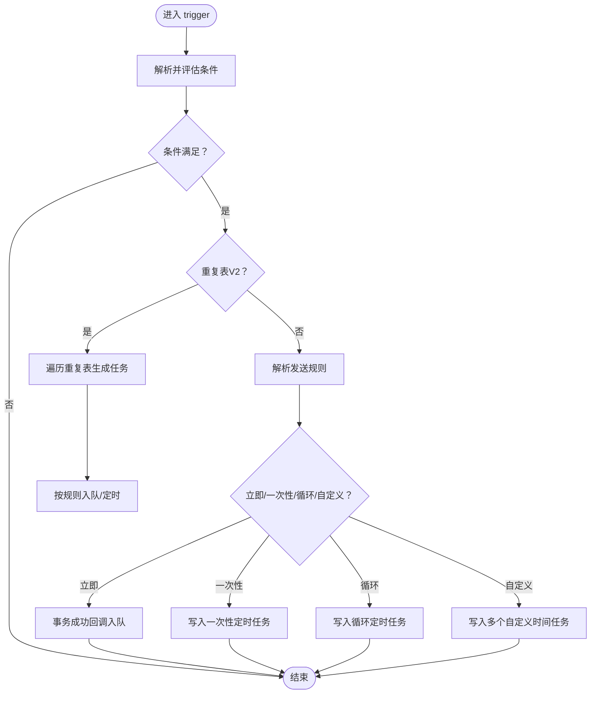
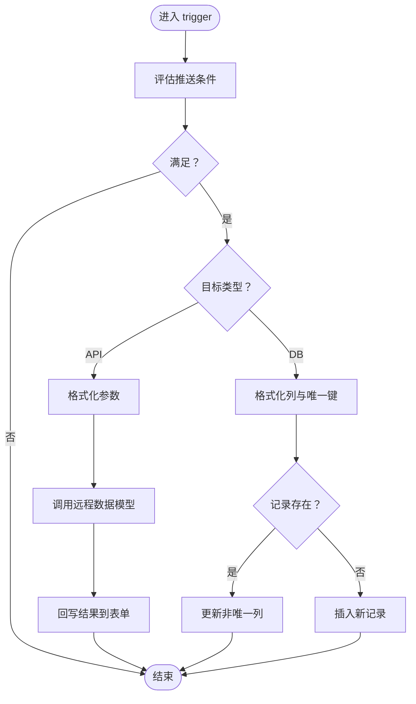
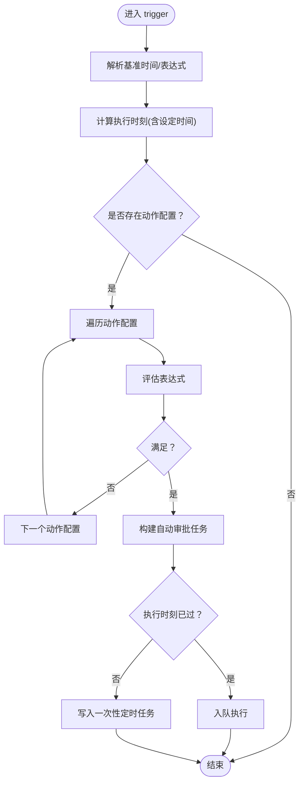
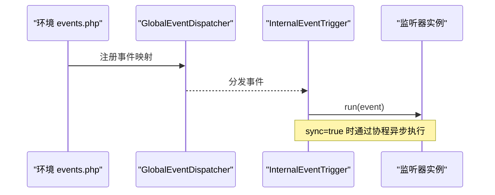
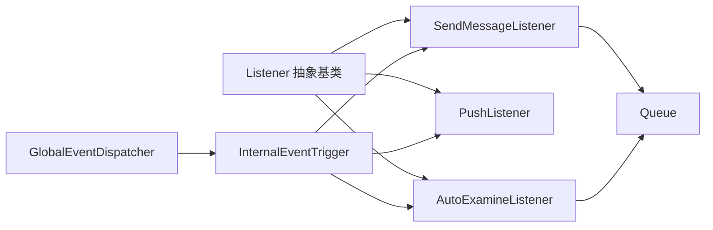

# 通知监听器

<cite>
**本文引用的文件**
- [Listener.php](file://process/src/services/listeners/Listener.php)
- [SendMessageListener.php](file://process/src/services/listeners/SendMessageListener.php)
- [PushListener.php](file://process/src/services/listeners/PushListener.php)
- [AutoExamineListener.php](file://process/src/services/listeners/AutoExamineListener.php)
- [Queue.php](file://process/src/components/Queue.php)
- [GlobalEventDispatcher.php](file://process/src/services/events/GlobalEventDispatcher.php)
- [InternalEventTrigger.php](file://process/src/services/events/InternalEventTrigger.php)
- [events.php（bistu）](file://process_envs/bistu/product/events.php)
- [events.php（bit）](file://process_envs/bit/product/events.php)
- [AccountLoginCheckListener.php](file://process_envs/bistu/product/listeners/AccountLoginCheckListener.php)
</cite>

## 目录
1. [引言](#引言)
2. [项目结构](#项目结构)
3. [核心组件](#核心组件)
4. [架构总览](#架构总览)
5. [组件详解](#组件详解)
6. [依赖关系分析](#依赖关系分析)
7. [性能考量](#性能考量)
8. [故障排查指南](#故障排查指南)
9. [结论](#结论)
10. [附录](#附录)

## 引言
本文件面向 htdNew 项目的“通知监听器”子系统，系统性阐述监听器架构的设计原理、事件驱动的通知机制、监听器的触发条件与执行逻辑、配置方式、与消息模型的关系、通知设置的管理机制以及消息状态跟踪方法。同时覆盖监听器注册流程、事件处理顺序、错误恢复机制，并给出性能优化建议与扩展开发指南。

## 项目结构
通知监听器位于 process 子模块中，采用“监听器基类 + 具体监听器实现 + 事件分发与触发 + 队列/定时任务承载”的分层组织：
- 监听器基类与具体监听器：位于 process/src/services/listeners
- 事件分发与触发：位于 process/src/services/events
- 任务队列承载：位于 process/src/components/Queue
- 环境级事件注册：位于 process_envs/{env}/product/events.php

图表来源
- [GlobalEventDispatcher.php](file://process/src/services/events/GlobalEventDispatcher.php#L1-L262)
- [InternalEventTrigger.php](file://process/src/services/events/InternalEventTrigger.php#L1-L30)
- [Listener.php](file://process/src/services/listeners/Listener.php#L1-L33)
- [SendMessageListener.php](file://process/src/services/listeners/SendMessageListener.php#L1-L274)
- [PushListener.php](file://process/src/services/listeners/PushListener.php#L1-L232)
- [AutoExamineListener.php](file://process/src/services/listeners/AutoExamineListener.php#L1-L126)
- [Queue.php](file://process/src/components/Queue.php#L1-L173)

章节来源
- [GlobalEventDispatcher.php](file://process/src/services/events/GlobalEventDispatcher.php#L1-L262)
- [InternalEventTrigger.php](file://process/src/services/events/InternalEventTrigger.php#L1-L30)
- [Listener.php](file://process/src/services/listeners/Listener.php#L1-L33)
- [SendMessageListener.php](file://process/src/services/listeners/SendMessageListener.php#L1-L274)
- [PushListener.php](file://process/src/services/listeners/PushListener.php#L1-L232)
- [AutoExamineListener.php](file://process/src/services/listeners/AutoExamineListener.php#L1-L126)
- [Queue.php](file://process/src/components/Queue.php#L1-L173)

## 核心组件
- 监听器抽象基类：统一参数格式化、忽略未知属性等通用能力，约束所有监听器必须实现 trigger 方法。
- 具体监听器：
  - 发送通知监听器：负责按条件与规则将消息投递至队列或定时任务，支持重复表场景与自定义发送时间。
  - 推送数据监听器：将表单/表达式计算结果推送到远端 API 或数据库，支持去重与回写。
  - 自动审批监听器：基于表单字段或表达式在指定时间点自动完成审批动作，支持定时与条件分支。
- 事件分发与触发：通过全局事件分发器定义事件常量，内部触发器封装同步/异步执行策略。
- 队列承载：统一的任务入队与反序列化执行，支持多主题与消费者配置热更新。

章节来源
- [Listener.php](file://process/src/services/listeners/Listener.php#L1-L33)
- [SendMessageListener.php](file://process/src/services/listeners/SendMessageListener.php#L1-L274)
- [PushListener.php](file://process/src/services/listeners/PushListener.php#L1-L232)
- [AutoExamineListener.php](file://process/src/services/listeners/AutoExamineListener.php#L1-L126)
- [GlobalEventDispatcher.php](file://process/src/services/events/GlobalEventDispatcher.php#L1-L262)
- [InternalEventTrigger.php](file://process/src/services/events/InternalEventTrigger.php#L1-L30)
- [Queue.php](file://process/src/components/Queue.php#L1-L173)

## 架构总览
事件驱动通知机制由“事件定义 → 触发器 → 监听器 → 承载（队列/定时）”构成闭环。环境配置文件(events.php)声明事件与监听器映射及执行策略（同步/异步），监听器在 trigger 中决定是否入队或写入定时任务，最终由消费者执行具体动作。

图表来源
- [events.php（bistu）](file://process_envs/bistu/product/events.php#L1-L37)
- [events.php（bit）](file://process_envs/bit/product/events.php#L1-L29)
- [GlobalEventDispatcher.php](file://process/src/services/events/GlobalEventDispatcher.php#L1-L262)
- [InternalEventTrigger.php](file://process/src/services/events/InternalEventTrigger.php#L1-L30)
- [Queue.php](file://process/src/components/Queue.php#L1-L173)

## 组件详解

### 监听器基类与参数格式化
- 统一继承框架对象，屏蔽未知属性赋值，避免配置漂移。
- 提供参数键值对格式化工具，将表达式/占位符解析为实际值，便于监听器消费。

章节来源
- [Listener.php](file://process/src/services/listeners/Listener.php#L1-L33)

### 发送通知监听器（SendMessageListener）
- 触发条件：可选表达式条件；当条件满足时继续执行。
- 执行逻辑：
  - 若为重复表推送且选择“按重复表时间发送”，则遍历重复表逐条生成任务并按规则入队/定时。
  - 否则根据发送规则（立即/一次性/循环/自定义时间）决定入队或写入定时任务。
  - 支持“表单取接收人”与多种接收人类型（用户ID/手机号/邮箱）。
- 关键点：
  - 事务成功回调入队，保证业务一致性。
  - 发送规则解析支持多种时间基准（任务开始、表单字段、表达式）与偏移单位（分钟/小时/天）。
  - 循环发送支持按日/小时/分钟间隔与设定时间段组合。

图表来源
- [SendMessageListener.php](file://process/src/services/listeners/SendMessageListener.php#L1-L274)

章节来源
- [SendMessageListener.php](file://process/src/services/listeners/SendMessageListener.php#L1-L274)

### 推送数据监听器（PushListener）
- 触发条件：可选表达式条件；不满足则短路返回。
- 执行逻辑：
  - API 类型：按参数模板构造数据，调用远程数据模型执行推送，并支持将结果回写到表单。
  - DB 类型：按列模板构造数据，支持唯一键去重，存在则更新，否则插入。
- 关键点：
  - 参数/列值均通过格式化器解析表达式。
  - 重复表模式下按行迭代生成数据集合。
  - 回写时支持主表与重复表两种路径。

图表来源
- [PushListener.php](file://process/src/services/listeners/PushListener.php#L1-L232)

章节来源
- [PushListener.php](file://process/src/services/listeners/PushListener.php#L1-L232)

### 自动审批监听器（AutoExamineListener）
- 触发条件：基于表单字段或表达式在指定时间点执行审批动作。
- 执行逻辑：
  - 解析基准时间（任务收到时间或表单控件时间，或表达式）与偏移，得到执行时刻。
  - 支持设定执行时刻（如当日固定时间），若已过则顺延至次日。
  - 条件分支：按配置数组逐项评估表达式，满足即生成自动审批任务，按过去/未来分别入队或写入一次性定时任务。

图表来源
- [AutoExamineListener.php](file://process/src/services/listeners/AutoExamineListener.php#L1-L126)

章节来源
- [AutoExamineListener.php](file://process/src/services/listeners/AutoExamineListener.php#L1-L126)

### 事件注册与触发流程
- 环境配置文件以数组形式声明事件、触发器类与同步/异步策略。
- 全局事件分发器集中定义事件常量。
- 内部触发器在 run 中根据 sync 字段选择同步或协程异步执行监听器的 run 方法。

图表来源
- [events.php（bistu）](file://process_envs/bistu/product/events.php#L1-L37)
- [events.php（bit）](file://process_envs/bit/product/events.php#L1-L29)
- [GlobalEventDispatcher.php](file://process/src/services/events/GlobalEventDispatcher.php#L1-L262)
- [InternalEventTrigger.php](file://process/src/services/events/InternalEventTrigger.php#L1-L30)

章节来源
- [events.php（bistu）](file://process_envs/bistu/product/events.php#L1-L37)
- [events.php（bit）](file://process_envs/bit/product/events.php#L1-L29)
- [GlobalEventDispatcher.php](file://process/src/services/events/GlobalEventDispatcher.php#L1-L262)
- [InternalEventTrigger.php](file://process/src/services/events/InternalEventTrigger.php#L1-L30)

### 监听器与消息模型的关系
- 发送通知监听器通过任务对象承载发送参数（条件、通道、接收人、表单取数等），统一入队或定时执行。
- 推送数据监听器将计算结果回写到表单，形成“监听器 → 结果变量 → 表单字段”的闭环。
- 自动审批监听器生成审批任务，与流程引擎协同工作。

章节来源
- [SendMessageListener.php](file://process/src/services/listeners/SendMessageListener.php#L1-L274)
- [PushListener.php](file://process/src/services/listeners/PushListener.php#L1-L232)
- [AutoExamineListener.php](file://process/src/services/listeners/AutoExamineListener.php#L1-L126)

### 通知设置的管理机制与消息状态跟踪
- 发送规则管理：支持立即、一次性、循环（按日/小时/分钟）、自定义时间等多种模式；循环模式支持起止时间与结束于“任务完成”等场景。
- 重复表推送：针对重复表行进行条件判断与任务拆分，支持在每个重复行上下文中设置执行索引。
- 状态跟踪：通过定时任务模型记录任务状态与启用/禁用标志，结合日志定位执行问题。

章节来源
- [SendMessageListener.php](file://process/src/services/listeners/SendMessageListener.php#L1-L274)
- [PushListener.php](file://process/src/services/listeners/PushListener.php#L1-L232)

### 错误恢复机制
- API 推送：捕获异常并记录 SQL/请求细节，便于快速定位。
- 表单回写：在无会话或重复表缺失时抛出明确异常，避免静默失败。
- 队列承载：统一反序列化与执行入口，便于在消费者侧集中处理异常与重试。

章节来源
- [PushListener.php](file://process/src/services/listeners/PushListener.php#L1-L232)
- [Queue.php](file://process/src/components/Queue.php#L1-L173)

## 依赖关系分析
- 监听器基类与具体监听器：所有监听器继承同一抽象基类，共享参数格式化能力。
- 事件层：事件常量集中定义，触发器封装执行策略。
- 承载层：队列统一承载任务，定时任务模型用于一次性/循环任务管理。
- 环境配置：事件与监听器的绑定、同步/异步策略由环境配置文件决定。

图表来源
- [Listener.php](file://process/src/services/listeners/Listener.php#L1-L33)
- [SendMessageListener.php](file://process/src/services/listeners/SendMessageListener.php#L1-L274)
- [PushListener.php](file://process/src/services/listeners/PushListener.php#L1-L232)
- [AutoExamineListener.php](file://process/src/services/listeners/AutoExamineListener.php#L1-L126)
- [GlobalEventDispatcher.php](file://process/src/services/events/GlobalEventDispatcher.php#L1-L262)
- [InternalEventTrigger.php](file://process/src/services/events/InternalEventTrigger.php#L1-L30)
- [Queue.php](file://process/src/components/Queue.php#L1-L173)

章节来源
- [Listener.php](file://process/src/services/listeners/Listener.php#L1-L33)
- [SendMessageListener.php](file://process/src/services/listeners/SendMessageListener.php#L1-L274)
- [PushListener.php](file://process/src/services/listeners/PushListener.php#L1-L232)
- [AutoExamineListener.php](file://process/src/services/listeners/AutoExamineListener.php#L1-L126)
- [GlobalEventDispatcher.php](file://process/src/services/events/GlobalEventDispatcher.php#L1-L262)
- [InternalEventTrigger.php](file://process/src/services/events/InternalEventTrigger.php#L1-L30)
- [Queue.php](file://process/src/components/Queue.php#L1-L173)

## 性能考量
- 异步优先：通过 InternalEventTrigger 的 sync 字段选择异步执行，降低请求链路延迟。
- 事务一致性：发送通知监听器在事务成功回调中入队，避免脏读与重复执行。
- 任务拆分：重复表推送按行拆分任务，避免单次任务负载过大。
- 定时任务粒度：循环任务按日/小时/分钟粒度配置，减少无效扫描。
- 队列消费者：通过配置热更新动态调整消费者数量，平衡吞吐与资源占用。

## 故障排查指南
- 事件未触发：检查环境 events.php 中事件常量与触发器映射是否正确。
- 监听器未执行：确认触发器 sync 配置与监听器 run 方法签名一致。
- 发送规则异常：核对规则中的时间基准、偏移单位与设定时间是否合理。
- API 推送失败：查看异常日志中的原始请求/响应与 SQL 片段。
- 表单回写失败：确认 session 存在与重复表键名正确。
- 队列积压：检查消费者数量与主题长度，必要时扩容消费者或优化任务粒度。

章节来源
- [events.php（bistu）](file://process_envs/bistu/product/events.php#L1-L37)
- [events.php（bit）](file://process_envs/bit/product/events.php#L1-L29)
- [PushListener.php](file://process/src/services/listeners/PushListener.php#L1-L232)
- [Queue.php](file://process/src/components/Queue.php#L1-L173)

## 结论
htdNew 的通知监听器体系以事件驱动为核心，通过抽象基类统一规范、触发器解耦执行策略、队列承载高并发任务，实现了灵活、可扩展、可观测的通知与自动化流程能力。结合环境配置即可快速接入新的监听器与事件，满足多校区、多业务形态的定制需求。

## 附录
- 监听器扩展开发步骤
  - 新建监听器类继承抽象基类，实现 trigger 方法。
  - 在环境 events.php 中注册事件与监听器映射，选择同步/异步。
  - 如需入队或定时任务，构造任务对象并通过队列/定时模型承载。
  - 编写条件表达式与参数模板，确保格式化器可解析。
  - 添加日志与异常处理，便于排障与恢复。

章节来源
- [Listener.php](file://process/src/services/listeners/Listener.php#L1-L33)
- [events.php（bistu）](file://process_envs/bistu/product/events.php#L1-L37)
- [events.php（bit）](file://process_envs/bit/product/events.php#L1-L29)
- [SendMessageListener.php](file://process/src/services/listeners/SendMessageListener.php#L1-L274)
- [PushListener.php](file://process/src/services/listeners/PushListener.php#L1-L232)
- [AutoExamineListener.php](file://process/src/services/listeners/AutoExamineListener.php#L1-L126)
- [Queue.php](file://process/src/components/Queue.php#L1-L173)
- [GlobalEventDispatcher.php](file://process/src/services/events/GlobalEventDispatcher.php#L1-L262)
- [InternalEventTrigger.php](file://process/src/services/events/InternalEventTrigger.php#L1-L30)
- [AccountLoginCheckListener.php](file://process_envs/bistu/product/listeners/AccountLoginCheckListener.php#L1-L57)