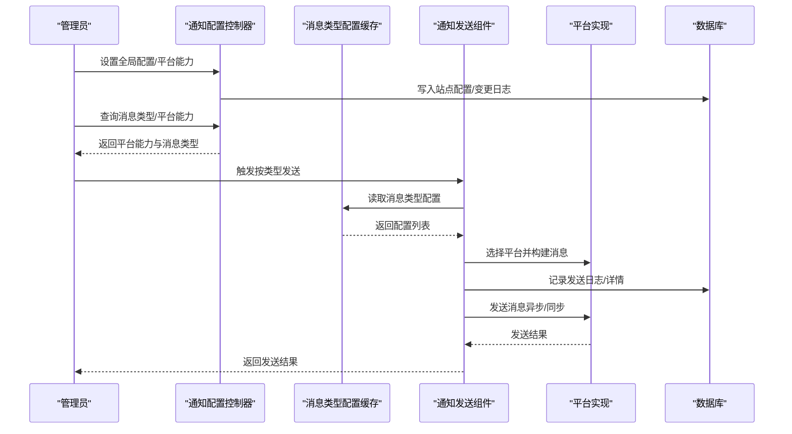
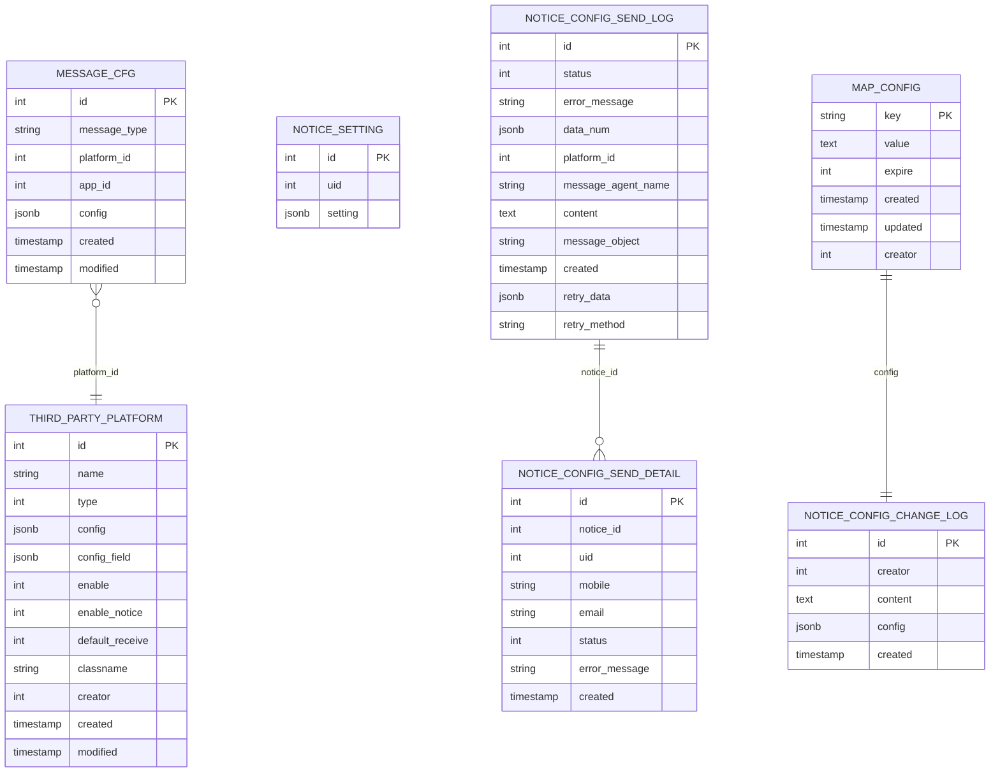
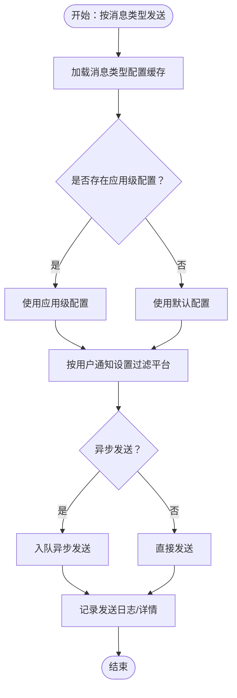
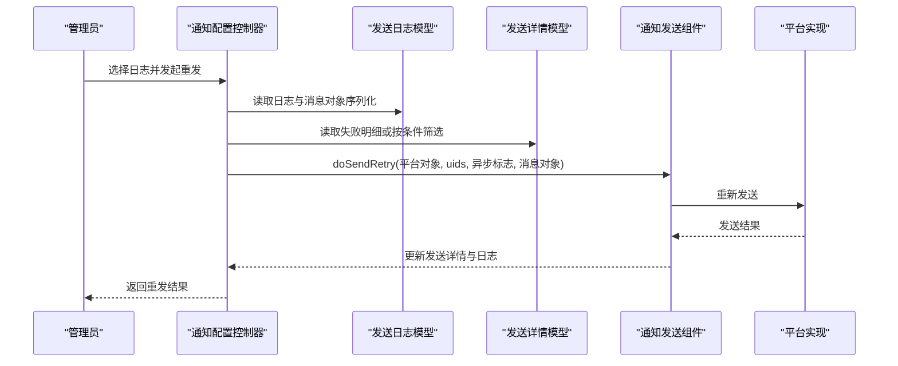
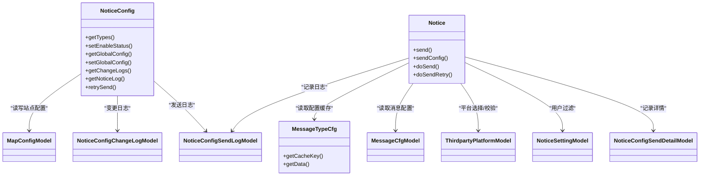

# 通知配置管理

<cite>
**本文引用的文件**
- [process/src/components/Notice.php](file://process/src/components/Notice.php)
- [process/src/http/system/NoticeConfig.php](file://process/src/http/system/NoticeConfig.php)
- [process/src/models/MessageCfgModel.php](file://process/src/models/MessageCfgModel.php)
- [process/src/services/cache/MessageTypeCfg.php](file://process/src/services/cache/MessageTypeCfg.php)
- [process/src/models/ThirdpartyPlatformModel.php](file://process/src/models/ThirdpartyPlatformModel.php)
- [process/src/models/NoticeSettingModel.php](file://process/src/models/NoticeSettingModel.php)
- [process/src/services/platform/Insite.php](file://process/src/services/platform/Insite.php)
- [process/src/services/platform/Mailer.php](file://process/src/services/platform/Mailer.php)
- [process/src/models/NoticeConfigSendLogModel.php](file://process/src/models/NoticeConfigSendLogModel.php)
- [process/src/models/NoticeConfigSendDetailModel.php](file://process/src/models/NoticeConfigSendDetailModel.php)
- [process/src/models/NoticeConfigChangeLogModel.php](file://process/src/models/NoticeConfigChangeLogModel.php)
- [process/src/models/MapConfigModel.php](file://process/src/models/MapConfigModel.php)
- [process/docs/sql/database.sql](file://process/docs/sql/database.sql)
- [process/src/migrations/migration_20250904_112321_login_config.php](file://process/src/migrations/migration_20250904_112321_login_config.php)
- [process/src/migrations/migration_20230919_102723_message_cfg.php](file://process/src/migrations/migration_20230919_102723_message_cfg.php)
- [process/src/migrations/migration_20240912_154331_message_notify_up.php](file://process/src/migrations/migration_20240912_154331_message_notify_up.php)
</cite>

## 目录
1. [引言](#引言)
2. [项目结构](#项目结构)
3. [核心组件](#核心组件)
4. [架构总览](#架构总览)
5. [详细组件分析](#详细组件分析)
6. [依赖分析](#依赖分析)
7. [性能考虑](#性能考虑)
8. [故障排除指南](#故障排除指南)
9. [结论](#结论)
10. [附录](#附录)

## 引言
本文件面向 htdNew 项目的“通知配置管理”，系统化梳理通知配置的数据模型、配置项管理机制、存储结构、验证规则与动态更新流程；阐明全局配置、用户个性化配置与应用级配置的层级关系；并提供导入导出、批量修改与配置迁移的实践方法，以及优化建议与故障排除指引。

## 项目结构
通知配置管理涉及的核心模块包括：
- 控制层：系统后台通知配置控制器，负责平台能力查询、全局配置读写、发送日志与重发、变更审计等。
- 业务组件：通知发送组件，负责按消息类型解析配置、选择平台、过滤用户、异步/同步发送、重试与日志记录。
- 模型层：消息配置、平台、用户通知设置、发送日志与详情、配置变更日志、站点配置映射等。
- 平台层：站内消息、邮件等具体平台实现，定义消息体格式、接收转换与发送逻辑。
- 缓存层：按消息类型缓存配置，支持热更新版本控制。

```mermaid
graph TB
subgraph "控制层"
NC["系统通知配置控制器<br/>process/src/http/system/NoticeConfig.php"]
end
subgraph "业务组件"
Notice["通知发送组件<br/>process/src/components/Notice.php"]
MsgTypeCache["消息类型配置缓存<br/>process/src/services/cache/MessageTypeCfg.php"]
end
subgraph "模型层"
MCfg["消息配置模型<br/>process/src/models/MessageCfgModel.php"]
TP["第三方平台模型<br/>process/src/models/ThirdpartyPlatformModel.php"]
NS["用户通知设置模型<br/>process/src/models/NoticeSettingModel.php"]
Log["发送日志模型<br/>process/src/models/NoticeConfigSendLogModel.php"]
Detail["发送详情模型<br/>process/src/models/NoticeConfigSendDetailModel.php"]
ChangeLog["变更日志模型<br/>process/src/models/NoticeConfigChangeLogModel.php"]
MapCfg["站点配置映射模型<br/>process/src/models/MapConfigModel.php"]
end
subgraph "平台实现"
Insite["站内消息平台<br/>process/src/services/platform/Insite.php"]
Mailer["邮件平台<br/>process/src/services/platform/Mailer.php"]
end
NC --> MapCfg
NC --> ChangeLog
NC --> Log
NC --> Detail
Notice --> MsgTypeCache
Notice --> MCfg
Notice --> TP
Notice --> NS
Notice --> Insite
Notice --> Mailer
Notice --> Log
Notice --> Detail
```

图表来源
- [process/src/http/system/NoticeConfig.php](file://process/src/http/system/NoticeConfig.php#L1-L377)
- [process/src/components/Notice.php](file://process/src/components/Notice.php#L1-L406)
- [process/src/services/cache/MessageTypeCfg.php](file://process/src/services/cache/MessageTypeCfg.php#L1-L31)
- [process/src/models/MessageCfgModel.php](file://process/src/models/MessageCfgModel.php#L1-L133)
- [process/src/models/ThirdpartyPlatformModel.php](file://process/src/models/ThirdpartyPlatformModel.php#L1-L687)
- [process/src/models/NoticeSettingModel.php](file://process/src/models/NoticeSettingModel.php#L1-L59)
- [process/src/models/NoticeConfigSendLogModel.php](file://process/src/models/NoticeConfigSendLogModel.php#L1-L55)
- [process/src/models/NoticeConfigSendDetailModel.php](file://process/src/models/NoticeConfigSendDetailModel.php#L1-L46)
- [process/src/models/NoticeConfigChangeLogModel.php](file://process/src/models/NoticeConfigChangeLogModel.php#L1-L40)
- [process/src/models/MapConfigModel.php](file://process/src/models/MapConfigModel.php#L1-L2185)
- [process/src/services/platform/Insite.php](file://process/src/services/platform/Insite.php#L1-L129)
- [process/src/services/platform/Mailer.php](file://process/src/services/platform/Mailer.php#L1-L128)

章节来源
- [process/src/http/system/NoticeConfig.php](file://process/src/http/system/NoticeConfig.php#L1-L377)
- [process/src/components/Notice.php](file://process/src/components/Notice.php#L1-L406)

## 核心组件
- 通知发送组件：根据消息类型加载配置，按平台筛选与过滤用户，异步入队或直接发送，并记录发送日志与详情。
- 系统通知配置控制器：提供平台能力查询、全局配置读写、变更日志、发送日志与重发等管理能力。
- 消息配置模型：存储消息类型、平台、应用维度的配置，支持发送策略（默认/不发/自定义）。
- 第三方平台模型：统一管理平台启用、通知能力、默认接收策略、平台类别与消息类型等。
- 用户通知设置模型：按用户维度记录其允许接收的平台集合与默认接收策略。
- 发送日志与详情模型：记录每次发送的平台、状态、消息对象序列化、重试数据与明细。
- 配置变更日志模型：记录全局配置变更内容与操作人，支持审计与回溯。
- 站点配置映射模型：集中管理各类站点配置键值，含“消息渠道设置”“消息发送”“消息配置”等键。

章节来源
- [process/src/components/Notice.php](file://process/src/components/Notice.php#L1-L406)
- [process/src/http/system/NoticeConfig.php](file://process/src/http/system/NoticeConfig.php#L1-L377)
- [process/src/models/MessageCfgModel.php](file://process/src/models/MessageCfgModel.php#L1-L133)
- [process/src/models/ThirdpartyPlatformModel.php](file://process/src/models/ThirdpartyPlatformModel.php#L1-L687)
- [process/src/models/NoticeSettingModel.php](file://process/src/models/NoticeSettingModel.php#L1-L59)
- [process/src/models/NoticeConfigSendLogModel.php](file://process/src/models/NoticeConfigSendLogModel.php#L1-L55)
- [process/src/models/NoticeConfigSendDetailModel.php](file://process/src/models/NoticeConfigSendDetailModel.php#L1-L46)
- [process/src/models/NoticeConfigChangeLogModel.php](file://process/src/models/NoticeConfigChangeLogModel.php#L1-L40)
- [process/src/models/MapConfigModel.php](file://process/src/models/MapConfigModel.php#L1-L2185)

## 架构总览
通知配置管理采用“配置驱动 + 平台抽象 + 用户过滤 + 日志审计”的架构：
- 配置驱动：消息类型配置按消息类型缓存，支持热更新版本控制。
- 平台抽象：各平台实现统一接口，支持站内消息、邮件等，具备消息体构建与发送能力。
- 用户过滤：基于用户通知设置与平台默认接收策略进行过滤。
- 日志审计：发送日志与详情记录发送状态、重试数据与明细，支持重发与清理。

图表来源
- [process/src/http/system/NoticeConfig.php](file://process/src/http/system/NoticeConfig.php#L1-L377)
- [process/src/components/Notice.php](file://process/src/components/Notice.php#L1-L406)
- [process/src/services/cache/MessageTypeCfg.php](file://process/src/services/cache/MessageTypeCfg.php#L1-L31)
- [process/src/services/platform/Insite.php](file://process/src/services/platform/Insite.php#L1-L129)
- [process/src/services/platform/Mailer.php](file://process/src/services/platform/Mailer.php#L1-L128)
- [process/src/models/NoticeConfigSendLogModel.php](file://process/src/models/NoticeConfigSendLogModel.php#L1-L55)
- [process/src/models/NoticeConfigSendDetailModel.php](file://process/src/models/NoticeConfigSendDetailModel.php#L1-L46)

## 详细组件分析

### 数据模型与存储结构
- 消息配置表（message_cfg）：按消息类型、平台、应用维度存储配置，支持发送策略（默认/不发/自定义），并记录创建与修改时间。
- 第三方平台表（thirdparty_platform）：记录平台启用、通知能力、默认接收策略、平台类别与消息类型等。
- 用户通知设置表（notice_setting）：按用户记录允许接收的平台集合与默认接收策略。
- 发送日志表（notice_config_send_log）：记录每次发送的平台、状态、消息对象序列化、重试数据与内容摘要。
- 发送详情表（notice_config_send_detail）：记录每个用户的发送状态与错误信息。
- 配置变更日志表（notice_config_change_log）：记录全局配置变更内容与操作人。
- 站点配置映射表（map_config）：集中管理各类站点配置键值，如“消息配置”“消息渠道设置”等。

图表来源
- [process/src/models/MessageCfgModel.php](file://process/src/models/MessageCfgModel.php#L1-L133)
- [process/src/models/ThirdpartyPlatformModel.php](file://process/src/models/ThirdpartyPlatformModel.php#L1-L687)
- [process/src/models/NoticeSettingModel.php](file://process/src/models/NoticeSettingModel.php#L1-L59)
- [process/src/models/NoticeConfigSendLogModel.php](file://process/src/models/NoticeConfigSendLogModel.php#L1-L55)
- [process/src/models/NoticeConfigSendDetailModel.php](file://process/src/models/NoticeConfigSendDetailModel.php#L1-L46)
- [process/src/models/NoticeConfigChangeLogModel.php](file://process/src/models/NoticeConfigChangeLogModel.php#L1-L40)
- [process/src/models/MapConfigModel.php](file://process/src/models/MapConfigModel.php#L1-L2185)
- [process/docs/sql/database.sql](file://process/docs/sql/database.sql#L502-L539)
- [process/src/migrations/migration_20250904_112321_login_config.php](file://process/src/migrations/migration_20250904_112321_login_config.php#L33-L71)

章节来源
- [process/src/models/MessageCfgModel.php](file://process/src/models/MessageCfgModel.php#L1-L133)
- [process/src/models/ThirdpartyPlatformModel.php](file://process/src/models/ThirdpartyPlatformModel.php#L1-L687)
- [process/src/models/NoticeSettingModel.php](file://process/src/models/NoticeSettingModel.php#L1-L59)
- [process/src/models/NoticeConfigSendLogModel.php](file://process/src/models/NoticeConfigSendLogModel.php#L1-L55)
- [process/src/models/NoticeConfigSendDetailModel.php](file://process/src/models/NoticeConfigSendDetailModel.php#L1-L46)
- [process/src/models/NoticeConfigChangeLogModel.php](file://process/src/models/NoticeConfigChangeLogModel.php#L1-L40)
- [process/src/models/MapConfigModel.php](file://process/src/models/MapConfigModel.php#L1-L2185)
- [process/docs/sql/database.sql](file://process/docs/sql/database.sql#L502-L539)
- [process/src/migrations/migration_20250904_112321_login_config.php](file://process/src/migrations/migration_20250904_112321_login_config.php#L33-L71)

### 配置项管理机制与层次关系
- 全局配置（站点级）：通过“消息配置”键集中管理，控制器提供读写接口，并记录变更日志。
- 应用级配置（应用维度）：消息配置表支持 app_id 字段，实现应用级覆盖；发送时优先匹配应用级配置，再回退至默认配置。
- 用户个性化配置（用户维度）：用户通知设置表记录允许接收的平台集合；平台默认接收策略由平台模型维护。
- 平台能力与默认接收：平台模型记录 enable_notice 与 default_receive，决定是否默认发送与默认接收方式。

图表来源
- [process/src/components/Notice.php](file://process/src/components/Notice.php#L1-L406)
- [process/src/services/cache/MessageTypeCfg.php](file://process/src/services/cache/MessageTypeCfg.php#L1-L31)
- [process/src/models/NoticeSettingModel.php](file://process/src/models/NoticeSettingModel.php#L1-L59)
- [process/src/models/ThirdpartyPlatformModel.php](file://process/src/models/ThirdpartyPlatformModel.php#L1-L687)

章节来源
- [process/src/http/system/NoticeConfig.php](file://process/src/http/system/NoticeConfig.php#L1-L377)
- [process/src/components/Notice.php](file://process/src/components/Notice.php#L1-L406)
- [process/src/models/MessageCfgModel.php](file://process/src/models/MessageCfgModel.php#L1-L133)
- [process/src/models/NoticeSettingModel.php](file://process/src/models/NoticeSettingModel.php#L1-L59)
- [process/src/models/ThirdpartyPlatformModel.php](file://process/src/models/ThirdpartyPlatformModel.php#L1-L687)

### 配置验证规则与动态更新
- 验证规则：
  - 平台启用与通知能力：平台模型记录 enable 与 enable_notice，发送前校验平台可用性与通知能力。
  - 用户过滤：仅当用户在该平台启用且允许接收时才纳入发送范围。
  - 消息类型配置：消息配置模型支持发送策略枚举，确保配置合法。
- 动态更新：
  - 消息类型配置保存时更新缓存版本，触发配置热更新。
  - 全局配置变更通过站点配置映射模型写入，并记录变更日志。
  - 平台能力变更通过控制器写入站点配置映射模型，即时生效。

章节来源
- [process/src/components/Notice.php](file://process/src/components/Notice.php#L1-L406)
- [process/src/models/MessageCfgModel.php](file://process/src/models/MessageCfgModel.php#L1-L133)
- [process/src/models/ThirdpartyPlatformModel.php](file://process/src/models/ThirdpartyPlatformModel.php#L1-L687)
- [process/src/http/system/NoticeConfig.php](file://process/src/http/system/NoticeConfig.php#L1-L377)

### 发送流程与重试机制
- 发送流程：
  - 解析消息类型配置，按平台筛选与用户过滤。
  - 构建消息对象，记录发送日志与重试数据。
  - 异步入队或直接发送，记录发送详情与状态。
- 重试机制：
  - 控制器支持按日志 ID 或明细 ID 重发，支持选择失败明细或全部失败重发。
  - 发送日志模型记录 retry_data 与 retry_method，便于恢复重试上下文。

图表来源
- [process/src/http/system/NoticeConfig.php](file://process/src/http/system/NoticeConfig.php#L336-L377)
- [process/src/components/Notice.php](file://process/src/components/Notice.php#L220-L252)
- [process/src/models/NoticeConfigSendLogModel.php](file://process/src/models/NoticeConfigSendLogModel.php#L1-L55)
- [process/src/models/NoticeConfigSendDetailModel.php](file://process/src/models/NoticeConfigSendDetailModel.php#L1-L46)

章节来源
- [process/src/http/system/NoticeConfig.php](file://process/src/http/system/NoticeConfig.php#L336-L377)
- [process/src/components/Notice.php](file://process/src/components/Notice.php#L220-L252)

### 导入导出、批量修改与配置迁移
- 导入导出：
  - 全局配置通过控制器读写“消息配置”键，可将配置以 JSON 形式导出/导入。
  - 平台能力通过“消息渠道设置”键集中管理，支持导出平台启用状态与默认接收策略。
- 批量修改：
  - 控制器支持批量设置平台启用状态与默认接收策略，事务写入站点配置映射模型。
  - 可结合平台能力查询接口批量生成平台清单，辅助批量配置。
- 配置迁移：
  - 消息配置迁移脚本支持将旧配置转换为新结构，迁移用户通知设置与触发器通道。
  - 发送日志与详情迁移脚本新增必要字段，保证历史数据兼容。

章节来源
- [process/src/http/system/NoticeConfig.php](file://process/src/http/system/NoticeConfig.php#L1-L377)
- [process/src/migrations/migration_20230919_102723_message_cfg.php](file://process/src/migrations/migration_20230919_102723_message_cfg.php#L85-L121)
- [process/src/migrations/migration_20250904_112321_login_config.php](file://process/src/migrations/migration_20250904_112321_login_config.php#L33-L71)
- [process/src/migrations/migration_20240912_154331_message_notify_up.php](file://process/src/migrations/migration_20240912_154331_message_notify_up.php#L1-L25)

## 依赖分析
- 组件耦合：
  - 通知发送组件依赖消息类型配置缓存、消息配置模型、平台模型、用户通知设置模型与日志模型。
  - 控制器依赖站点配置映射模型、发送日志与详情模型、变更日志模型。
- 外部依赖：
  - 平台实现依赖各自 SDK 或服务端能力（如邮件传输）。
- 潜在循环依赖：
  - 平台对象延迟创建并通过模型工厂注入，避免直接循环引用。

图表来源
- [process/src/http/system/NoticeConfig.php](file://process/src/http/system/NoticeConfig.php#L1-L377)
- [process/src/components/Notice.php](file://process/src/components/Notice.php#L1-L406)
- [process/src/services/cache/MessageTypeCfg.php](file://process/src/services/cache/MessageTypeCfg.php#L1-L31)
- [process/src/models/MessageCfgModel.php](file://process/src/models/MessageCfgModel.php#L1-L133)
- [process/src/models/ThirdpartyPlatformModel.php](file://process/src/models/ThirdpartyPlatformModel.php#L1-L687)
- [process/src/models/NoticeSettingModel.php](file://process/src/models/NoticeSettingModel.php#L1-L59)
- [process/src/models/NoticeConfigSendLogModel.php](file://process/src/models/NoticeConfigSendLogModel.php#L1-L55)
- [process/src/models/NoticeConfigSendDetailModel.php](file://process/src/models/NoticeConfigSendDetailModel.php#L1-L46)
- [process/src/models/NoticeConfigChangeLogModel.php](file://process/src/models/NoticeConfigChangeLogModel.php#L1-L40)
- [process/src/models/MapConfigModel.php](file://process/src/models/MapConfigModel.php#L1-L2185)

章节来源
- [process/src/http/system/NoticeConfig.php](file://process/src/http/system/NoticeConfig.php#L1-L377)
- [process/src/components/Notice.php](file://process/src/components/Notice.php#L1-L406)

## 性能考虑
- 缓存与热更新：消息类型配置通过缓存键与版本控制实现热更新，减少数据库访问压力。
- 异步发送：默认异步入队发送，降低请求延迟，提高吞吐。
- 批量插入：站内消息平台在插入消息与读者关系时使用批量插入，提升写入效率。
- 查询优化：发送日志与详情采用关联查询与分页，配合索引提升检索性能。

## 故障排除指南
- 无接收用户：
  - 现象：发送前用户过滤为空或接收账号为空。
  - 排查：检查用户通知设置与平台默认接收策略；确认用户手机号/邮箱等账户信息。
- 发送失败：
  - 现象：发送日志状态为失败，详情表记录错误信息。
  - 排查：查看发送日志与详情，定位失败原因；必要时重发失败明细。
- 平台不可用：
  - 现象：平台未启用或通知能力关闭。
  - 排查：检查平台模型 enable 与 enable_notice 字段；确认平台类名与配置正确。
- 配置未生效：
  - 现象：消息类型配置更新后未生效。
  - 排查：确认缓存版本已更新；检查站点配置映射模型中的“消息配置”键值。

章节来源
- [process/src/components/Notice.php](file://process/src/components/Notice.php#L1-L406)
- [process/src/models/NoticeConfigSendLogModel.php](file://process/src/models/NoticeConfigSendLogModel.php#L1-L55)
- [process/src/models/NoticeConfigSendDetailModel.php](file://process/src/models/NoticeConfigSendDetailModel.php#L1-L46)
- [process/src/models/ThirdpartyPlatformModel.php](file://process/src/models/ThirdpartyPlatformModel.php#L1-L687)

## 结论
通知配置管理通过“配置驱动 + 平台抽象 + 用户过滤 + 日志审计”的架构，实现了全局、应用与用户三层配置的协同管理。借助缓存与异步发送机制，系统在保证灵活性的同时兼顾性能与可观测性。通过完善的变更审计与重试机制，能够有效支撑大规模通知场景的稳定运行。

## 附录
- 配置键参考：
  - “消息配置”：集中存储全局通知配置。
  - “消息渠道设置”：集中存储平台启用与默认接收策略。
  - “消息发送”：与消息发送相关的站点配置键。
- 数据库初始化与迁移：
  - 初始化 SQL 与迁移脚本确保表结构与字段完备，支持发送日志、详情与变更审计。

章节来源
- [process/src/models/MapConfigModel.php](file://process/src/models/MapConfigModel.php#L1-L2185)
- [process/docs/sql/database.sql](file://process/docs/sql/database.sql#L502-L539)
- [process/src/migrations/migration_20250904_112321_login_config.php](file://process/src/migrations/migration_20250904_112321_login_config.php#L33-L71)
- [process/src/migrations/migration_20230919_102723_message_cfg.php](file://process/src/migrations/migration_20230919_102723_message_cfg.php#L85-L121)
- [process/src/migrations/migration_20240912_154331_message_notify_up.php](file://process/src/migrations/migration_20240912_154331_message_notify_up.php#L1-L25)