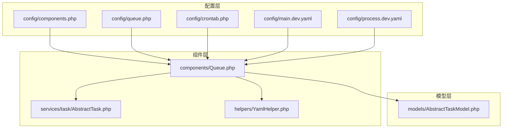
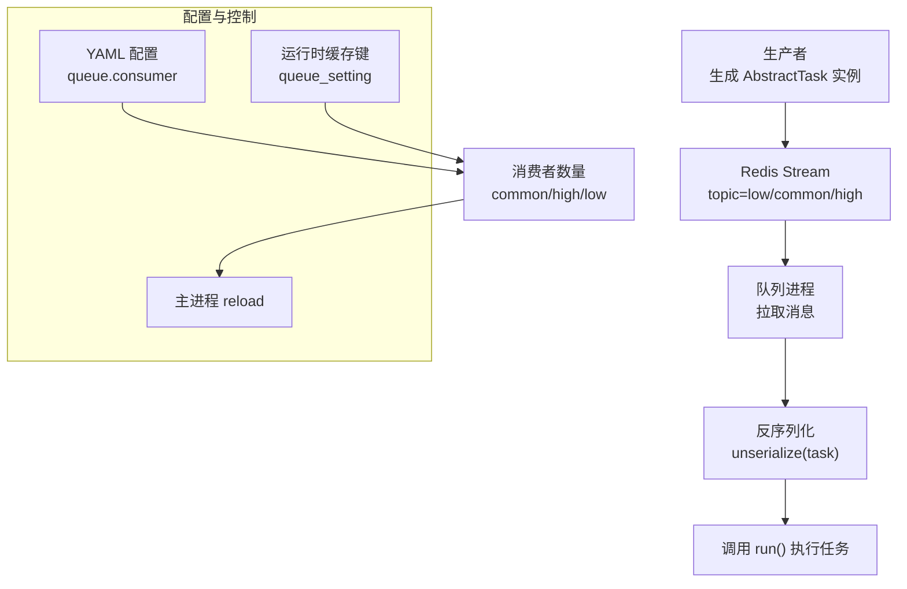
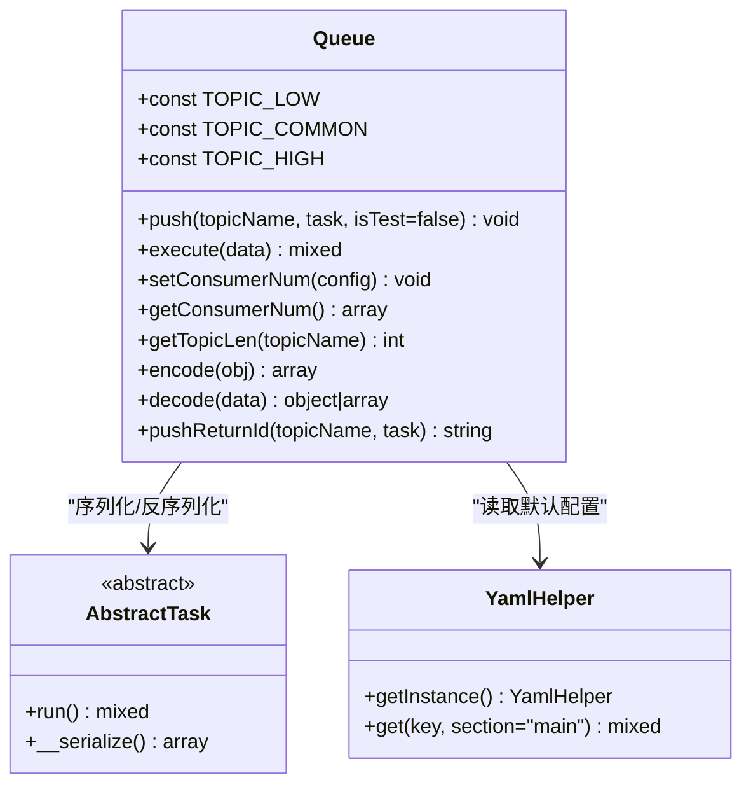
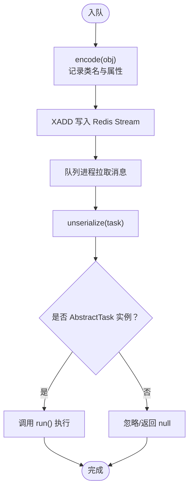
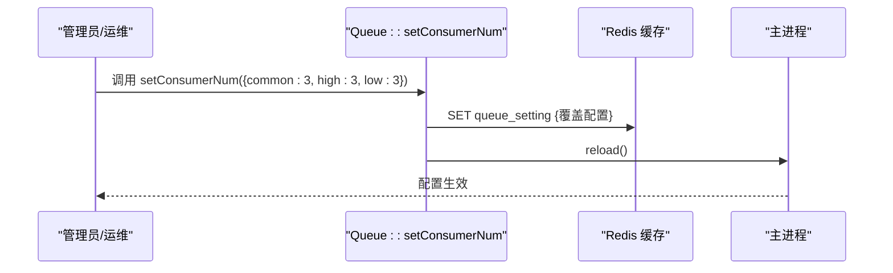
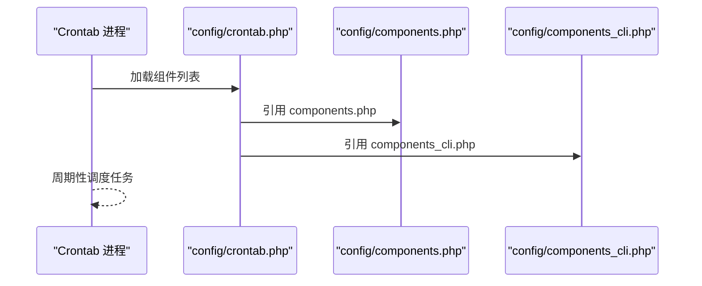
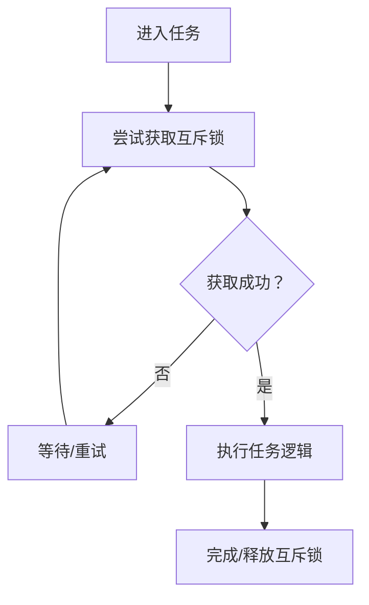
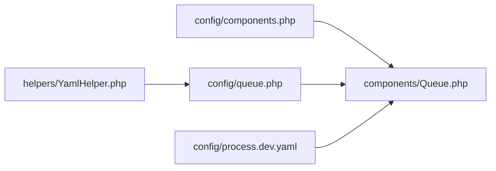

# 任务处理系统

<cite>
**本文引用的文件**
- [process\src\components\Queue.php](file://process/src/components/Queue.php)
- [process\src\services\task\AbstractTask.php](file://process/src/services/task/AbstractTask.php)
- [process\src\config\components.php](file://process/src/config/components.php)
- [process\src\config\queue.php](file://process/src/config/queue.php)
- [process\src\config\crontab.php](file://process/src/config/crontab.php)
- [process\src\config\main.dev.yaml](file://process/src/config/main.dev.yaml)
- [process\src\config\process.dev.yaml](file://process/src/config/process.dev.yaml)
- [process\src\helpers\YamlHelper.php](file://process/src/helpers/YamlHelper.php)
- [process\src\models\AbstractTaskModel.php](file://process/src/models/AbstractTaskModel.php)
</cite>

## 目录
1. [引言](#引言)
2. [项目结构](#项目结构)
3. [核心组件](#核心组件)
4. [架构总览](#架构总览)
5. [详细组件分析](#详细组件分析)
6. [依赖关系分析](#依赖关系分析)
7. [性能考量](#性能考量)
8. [故障排查指南](#故障排查指南)
9. [结论](#结论)
10. [附录](#附录)

## 引言
本文件面向 htdNew 项目中的任务处理系统，聚焦于基于 Redis Stream 的异步任务队列设计、消费者管理与负载均衡、定时任务调度与 Crontab 进程、任务序列化与反序列化机制、任务生命周期与监控、重试与故障恢复、以及可扩展性与开发实践建议。内容以仓库现有实现为依据，结合配置与运行时行为，帮助读者快速理解并高效使用该系统。

## 项目结构
任务处理系统由以下关键部分组成：
- 队列组件：负责任务入队、出队执行、消费者数量配置与查询、队列长度统计等。
- 任务抽象基类：定义任务统一接口与序列化规则。
- 配置层：组件注册、默认消费者数量、进程编排、运行时 YAML 配置。
- 任务模型：提供任务互斥锁、完成与跳转等流程控制能力。
- 运行时进程：队列进程与计划任务进程，分别对应异步与定时两类任务。

**图表来源**
- [process\src\config\components.php](file://process/src/config/components.php#L1-L34)
- [process\src\config\queue.php](file://process/src/config/queue.php#L1-L13)
- [process\src\config\crontab.php](file://process/src/config/crontab.php#L1-L10)
- [process\src\config\main.dev.yaml](file://process/src/config/main.dev.yaml#L58-L65)
- [process\src\config\process.dev.yaml](file://process/src/config/process.dev.yaml#L55-L71)
- [process\src\components\Queue.php](file://process/src/components/Queue.php#L1-L173)
- [process\src\services\task\AbstractTask.php](file://process/src/services/task/AbstractTask.php#L1-L30)
- [process\src\helpers\YamlHelper.php](file://process/src/helpers/YamlHelper.php#L1-L8)
- [process\src\models\AbstractTaskModel.php](file://process/src/models/AbstractTaskModel.php#L1-L106)

**章节来源**
- [process\src\config\components.php](file://process/src/config/components.php#L1-L34)
- [process\src\config\queue.php](file://process/src/config/queue.php#L1-L13)
- [process\src\config\crontab.php](file://process/src/config/crontab.php#L1-L10)
- [process\src\config\main.dev.yaml](file://process/src/config/main.dev.yaml#L58-L65)
- [process\src\config\process.dev.yaml](file://process/src/config/process.dev.yaml#L55-L71)

## 核心组件
- 队列组件（Queue）
  - 提供任务入队、执行、消费者数量设置与读取、队列长度查询等能力。
  - 使用 Redis Stream 存储任务，键名为 topic 名称；消息字段包含序列化的任务对象。
  - 支持三种主题优先级：low/common/high。
- 任务抽象基类（AbstractTask）
  - 定义统一的 run 接口，并提供 __serialize 规则，确保可序列化属性被正确捕获。
- 配置组件（components.php）
  - 注册 redis/cache/queue 等组件，其中 redis 配置关闭自动序列化以便直接存取字符串/数字。
- 队列配置（queue.php）
  - 加载默认消费者数量并合并运行时覆盖配置。
- 进程配置（process.dev.yaml）
  - 定义队列进程与计划任务进程的类、数量与配置文件路径。
- YAML 辅助（YamlHelper）
  - 封装 YAML 读取，供组件与配置模块使用。
- 任务模型（AbstractTaskModel）
  - 提供任务互斥锁、完成与跳转等流程控制方法，便于任务执行过程中的并发与状态管理。

**章节来源**
- [process\src\components\Queue.php](file://process/src/components/Queue.php#L1-L173)
- [process\src\services\task\AbstractTask.php](file://process/src/services/task/AbstractTask.php#L1-L30)
- [process\src\config\components.php](file://process/src/config/components.php#L1-L34)
- [process\src\config\queue.php](file://process/src/config/queue.php#L1-L13)
- [process\src\config\process.dev.yaml](file://process/src/config/process.dev.yaml#L55-L71)
- [process\src\helpers\YamlHelper.php](file://process/src/helpers/YamlHelper.php#L1-L8)
- [process\src\models\AbstractTaskModel.php](file://process/src/models/AbstractTaskModel.php#L78-L105)

## 架构总览
系统采用“生产者-消费者-Redis Stream”模式：
- 生产者将实现了 AbstractTask 的任务对象序列化后推送到指定 topic。
- 队列进程作为消费者，从 Redis Stream 拉取消息并反序列化执行 run 方法。
- 消费者数量可通过运行时缓存键覆盖，实现动态扩缩容。
- 定时任务通过独立的 Crontab 进程周期性触发，与队列进程解耦。

**图表来源**
- [process\src\components\Queue.php](file://process/src/components/Queue.php#L26-L40)
- [process\src\config\main.dev.yaml](file://process/src/config/main.dev.yaml#L58-L65)
- [process\src\config\process.dev.yaml](file://process/src/config/process.dev.yaml#L55-L71)
- [process\src\config\queue.php](file://process/src/config/queue.php#L1-L13)

## 详细组件分析

### 队列组件（Queue）分析
- 任务入队
  - 使用 Redis Stream 的 XADD 写入消息，字段包含序列化的任务对象。
  - 支持按主题（low/common/high）区分优先级。
- 任务执行
  - 从消息中提取任务字段并反序列化，若实例为 AbstractTask，则调用 run。
- 消费者管理
  - setConsumerNum 将覆盖配置写入缓存键 queue_setting，并触发主进程 reload。
  - getConsumerNum 读取默认配置与运行时覆盖配置，返回合并后的消费者数量。
- 队列长度
  - getTopicLen 通过 XLEN 获取指定 topic 的长度，便于监控与告警。

**图表来源**
- [process\src\components\Queue.php](file://process/src/components/Queue.php#L1-L173)
- [process\src\services\task\AbstractTask.php](file://process/src/services/task/AbstractTask.php#L1-L30)
- [process\src\helpers\YamlHelper.php](file://process/src/helpers/YamlHelper.php#L1-L8)

**章节来源**
- [process\src\components\Queue.php](file://process/src/components/Queue.php#L26-L67)
- [process\src\components\Queue.php](file://process/src/components/Queue.php#L84-L165)

### 任务序列化与反序列化机制
- 编码策略
  - encode 会记录对象的类名，并遍历公共非静态属性或 __serialize 返回的键值对，递归编码嵌套对象与数组。
  - 对于非 BaseObject 子类，构造函数参数必须具备默认值，否则抛出异常，避免不可序列化对象进入队列。
- 解码策略
  - decode 根据 __class 字段创建实例，优先使用 __unserialize 或 BaseObject 构造注入，否则反射赋值。
- 执行路径
  - execute 从消息中取出序列化任务，unserialize 后若为 AbstractTask 实例则调用 run。

**图表来源**
- [process\src\components\Queue.php](file://process/src/components/Queue.php#L84-L165)
- [process\src\services\task\AbstractTask.php](file://process/src/services/task/AbstractTask.php#L1-L30)

**章节来源**
- [process\src\components\Queue.php](file://process/src/components/Queue.php#L84-L165)
- [process\src\services\task\AbstractTask.php](file://process/src/services/task/AbstractTask.php#L1-L30)

### 消费者管理与负载均衡
- 默认消费者数量
  - 在 YAML 中定义每个主题的默认消费者数量（如 common/high/low）。
- 运行时覆盖
  - setConsumerNum 将覆盖配置写入缓存键 queue_setting，随后触发主进程 reload，使新配置生效。
- 动态扩缩容
  - 通过调整运行时配置即可动态增减各主题消费者的数量，实现按优先级与业务压力的弹性伸缩。

**图表来源**
- [process\src\components\Queue.php](file://process/src/components/Queue.php#L42-L48)
- [process\src\config\main.dev.yaml](file://process/src/config/main.dev.yaml#L58-L65)

**章节来源**
- [process\src\components\Queue.php](file://process/src/components/Queue.php#L42-L60)
- [process\src\config\main.dev.yaml](file://process/src/config/main.dev.yaml#L58-L65)

### 定时任务调度与 Crontab 进程
- 进程编排
  - process.dev.yaml 中定义了 Crontab 进程类与数量，配置文件为 config/crontab.php。
- 组件加载
  - crontab.php 合并 HTTP 与 CLI 组件，便于定时任务中复用应用组件。
- 工作流
  - Crontab 进程周期性扫描任务计划，触发相应任务执行，与队列进程职责分离。

**图表来源**
- [process\src\config\process.dev.yaml](file://process/src/config/process.dev.yaml#L64-L71)
- [process\src\config\crontab.php](file://process/src/config/crontab.php#L1-L10)
- [process\src\config\components.php](file://process/src/config/components.php#L1-L34)

**章节来源**
- [process\src\config\process.dev.yaml](file://process/src/config/process.dev.yaml#L64-L71)
- [process\src\config\crontab.php](file://process/src/config/crontab.php#L1-L10)

### 任务生命周期与互斥控制
- 互斥锁
  - 任务模型提供 getMutex/freeMutex，使用 Redis 键存储持有者标识，支持过期与并发控制。
- 完成与跳转
  - 支持任务完成后释放互斥锁、推进流程节点或跳转到目标节点，保障流程一致性。

**图表来源**
- [process\src\models\AbstractTaskModel.php](file://process/src/models/AbstractTaskModel.php#L78-L92)

**章节来源**
- [process\src\models\AbstractTaskModel.php](file://process/src/models/AbstractTaskModel.php#L78-L105)

## 依赖关系分析
- 组件注册
  - components.php 注册 redis/cache/queue 等组件，其中 redis 关闭自动序列化，适合直接存储字符串/数字。
- 配置加载
  - queue.php 读取 YAML 中的默认消费者数量，供队列组件使用。
- 进程编排
  - process.dev.yaml 定义队列进程与计划任务进程，分别加载各自配置文件。

**图表来源**
- [process\src\config\components.php](file://process/src/config/components.php#L1-L34)
- [process\src\config\queue.php](file://process/src/config/queue.php#L1-L13)
- [process\src\config\process.dev.yaml](file://process/src/config/process.dev.yaml#L55-L71)
- [process\src\helpers\YamlHelper.php](file://process/src/helpers/YamlHelper.php#L1-L8)

**章节来源**
- [process\src\config\components.php](file://process/src/config/components.php#L1-L34)
- [process\src\config\queue.php](file://process/src/config/queue.php#L1-L13)
- [process\src\config\process.dev.yaml](file://process/src/config/process.dev.yaml#L55-L71)
- [process\src\helpers\YamlHelper.php](file://process/src/helpers/YamlHelper.php#L1-L8)

## 性能考量
- Redis Stream 选择
  - 使用 XADD/XREAD 管道化与流式消费，适合高吞吐场景；注意合理设置消费者数量与批处理大小。
- 序列化开销
  - encode/decode 会遍历对象属性并递归处理嵌套结构，建议避免在任务中传递超大对象或深层嵌套数据。
- 并发与互斥
  - 使用 Redis 互斥键避免重复执行，减少资源竞争；同时注意锁粒度与过期时间，防止死锁。
- 监控指标
  - 通过 getTopicLen 获取队列长度，结合消费者数量计算积压率，及时扩容或降载。
- 扩展性
  - 通过运行时覆盖配置实现动态扩缩容；按主题划分优先级，隔离关键路径流量。

[本节为通用性能建议，不直接分析具体文件]

## 故障排查指南
- 任务无法反序列化
  - 检查任务类是否满足构造参数默认值要求；确认序列化版本与运行时类一致。
- 消费者数量未生效
  - 确认已写入缓存键 queue_setting 并触发主进程 reload；检查 YAML 默认配置与运行时覆盖配置。
- 队列积压严重
  - 查看各主题队列长度，评估消费者数量是否不足；检查任务执行耗时与重试策略。
- 互斥锁冲突
  - 检查互斥键是否存在且过期；确认任务完成时是否正确释放互斥锁。

**章节来源**
- [process\src\components\Queue.php](file://process/src/components/Queue.php#L42-L67)
- [process\src\models\AbstractTaskModel.php](file://process/src/models/AbstractTaskModel.php#L78-L92)

## 结论
该任务处理系统以 Redis Stream 为核心，结合队列组件的序列化/反序列化、消费者动态配置与进程编排，构建了高可用、可扩展的异步任务平台。定时任务通过独立的 Crontab 进程实现，与队列解耦。配合任务模型提供的互斥与流程控制能力，能够满足复杂业务的并发与一致性需求。建议在生产环境中持续监控队列长度与消费者负载，结合运行时配置实现弹性扩缩容。

[本节为总结性内容，不直接分析具体文件]

## 附录

### 任务开发指南
- 新建任务
  - 定义一个类继承 AbstractTask，并实现 run 方法。
  - 确保所有公共非静态属性均可被序列化，或实现 __serialize/__unserialize。
- 入队
  - 选择合适的主题（low/common/high），将任务实例序列化后推送到 Redis Stream。
- 执行
  - 队列进程会自动拉取消息并执行 run；如需监控，可结合队列长度与日志输出。
- 测试
  - 可通过 isTest 参数在 push 中进行差异化处理（如跳过某些副作用）。

**章节来源**
- [process\src\services\task\AbstractTask.php](file://process/src/services/task/AbstractTask.php#L1-L30)
- [process\src\components\Queue.php](file://process/src/components/Queue.php#L26-L30)

### 配置参数说明
- YAML 配置（main.dev.yaml）
  - queue.consumer：默认消费者数量（common/high/low）。
- 进程配置（process.dev.yaml）
  - queue 进程：类、数量、配置文件。
  - crontab 进程：类、数量、配置文件。
- 组件配置（components.php）
  - redis：关闭自动序列化，适合字符串/数字存储。
  - queue：注册队列组件。

**章节来源**
- [process\src\config\main.dev.yaml](file://process/src/config/main.dev.yaml#L58-L65)
- [process\src\config\process.dev.yaml](file://process/src/config/process.dev.yaml#L55-L71)
- [process\src\config\components.php](file://process/src/config/components.php#L1-L34)

### 调试技巧
- 开启详细日志
  - 在 YAML 中提高日志级别，观察队列入队、执行与消费者行为。
- 监控队列长度
  - 使用 getTopicLen 获取各主题长度，定位瓶颈。
- 验证消费者数量
  - 通过 setConsumerNum 覆盖配置并 reload，验证扩容效果。
- 任务互斥验证
  - 在任务执行前后检查互斥键状态，确保并发安全。

**章节来源**
- [process\src\config\main.dev.yaml](file://process/src/config/main.dev.yaml#L66-L66)
- [process\src\components\Queue.php](file://process/src/components/Queue.php#L62-L67)
- [process\src\models\AbstractTaskModel.php](file://process/src/models/AbstractTaskModel.php#L78-L92)